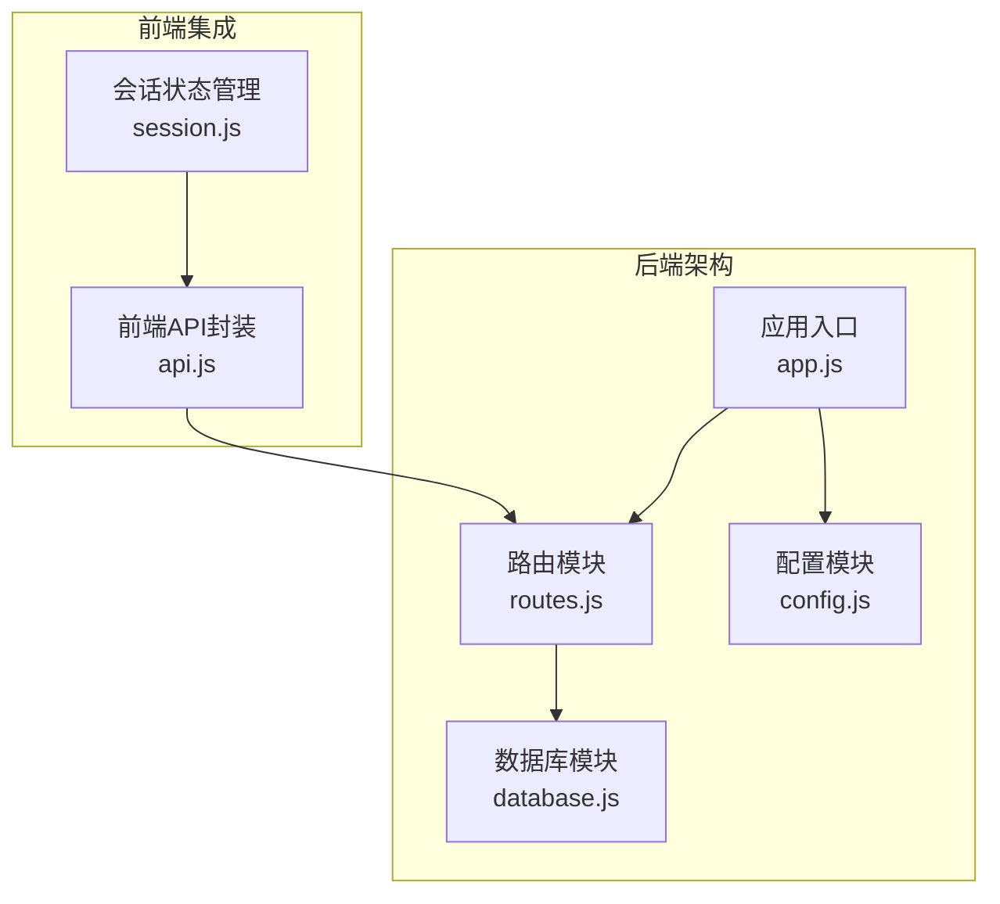
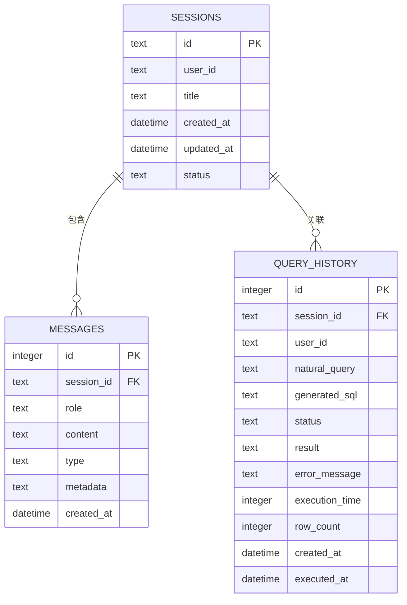
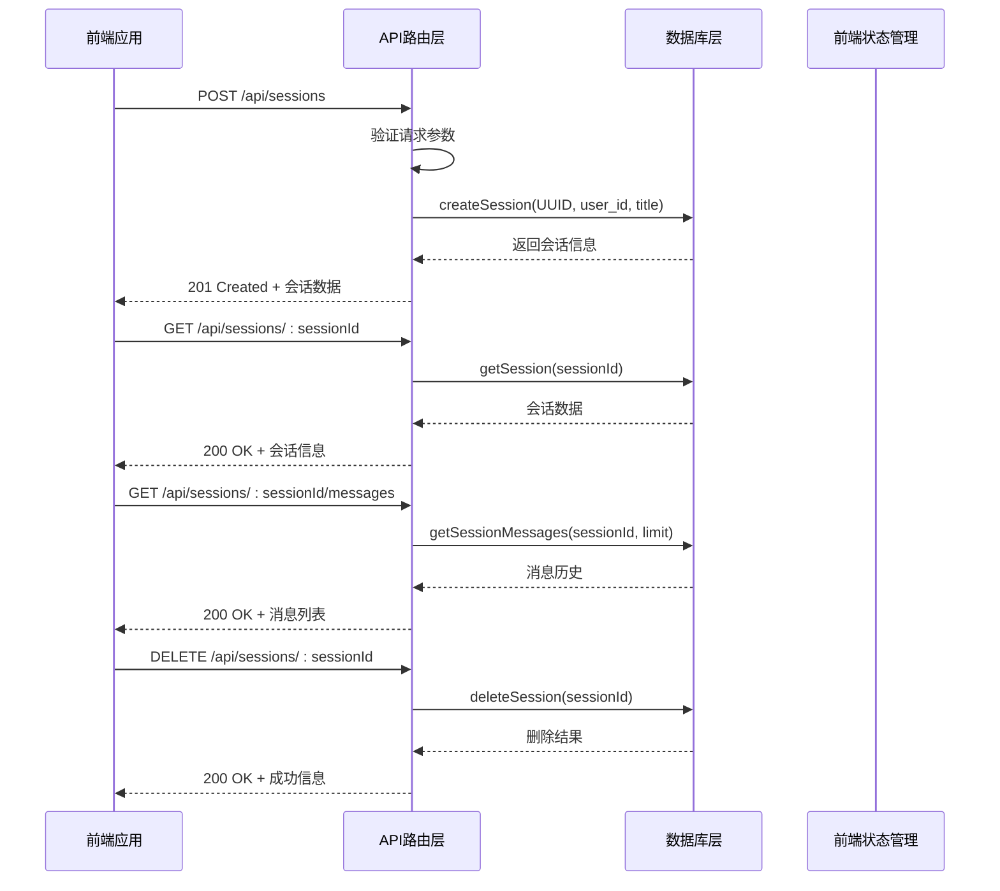
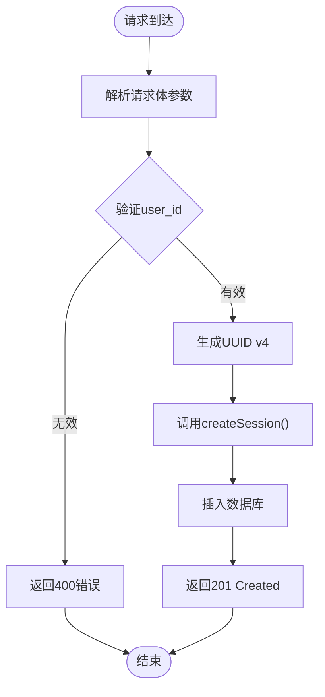
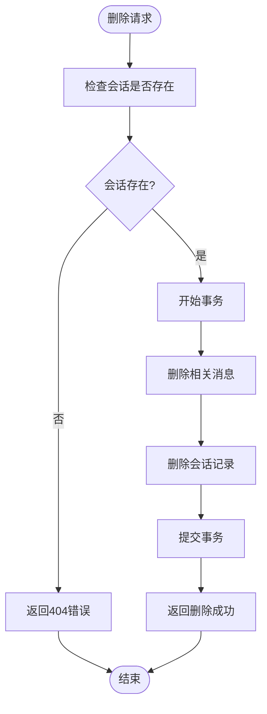
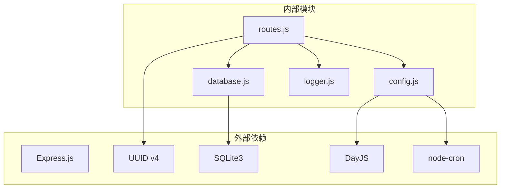

# 会话管理API

<cite>
**本文档引用的文件**
- [app.js](file://backend/src/app.js)
- [routes.js](file://backend/src/core/routes.js)
- [database.js](file://backend/src/core/database.js)
- [config.js](file://backend/src/core/config.js)
- [api.js](file://frontend/src/utils/api.js)
- [session.js](file://frontend/src/stores/session.js)
- [package.json](file://backend/package.json)
</cite>

## 目录
1. [简介](#简介)
2. [项目结构](#项目结构)
3. [核心组件](#核心组件)
4. [架构概览](#架构概览)
5. [详细组件分析](#详细组件分析)
6. [依赖分析](#依赖分析)
7. [性能考虑](#性能考虑)
8. [故障排除指南](#故障排除指南)
9. [结论](#结论)

## 简介
NL2SQL会话管理API提供了完整的对话会话生命周期管理功能，包括会话创建、查询、删除以及消息历史管理。该API基于RESTful设计原则，使用SQLite数据库进行数据持久化，支持用户级别的会话管理和消息历史追踪。

## 项目结构
后端采用模块化架构，主要由以下组件构成：
- 应用入口：负责服务启动和配置初始化
- 路由模块：定义RESTful API端点
- 数据库模块：处理SQLite数据库操作
- 配置模块：集中管理应用配置
- 前端集成：提供Vue.js状态管理

**图表来源**
- [app.js:1-260](file://backend/src/app.js#L1-L260)
- [routes.js:1-800](file://backend/src/core/routes.js#L1-L800)
- [database.js:1-859](file://backend/src/core/database.js#L1-L859)

**章节来源**
- [app.js:1-260](file://backend/src/app.js#L1-L260)
- [routes.js:1-800](file://backend/src/core/routes.js#L1-L800)

## 核心组件
会话管理API的核心组件包括：

### 数据库表结构
系统使用SQLite数据库存储会话相关信息，包含以下核心表：

**图表来源**
- [database.js:44-135](file://backend/src/core/database.js#L44-L135)

### UUID生成机制
系统使用标准的UUID v4生成机制，确保会话ID的唯一性和安全性。

**章节来源**
- [routes.js:272-273](file://backend/src/core/routes.js#L272-L273)
- [package.json:17](file://backend/package.json#L17)

## 架构概览
会话管理API采用分层架构设计，各层职责明确：

**图表来源**
- [routes.js:266-345](file://backend/src/core/routes.js#L266-L345)
- [database.js:467-549](file://backend/src/core/database.js#L467-L549)

## 详细组件分析

### 会话创建接口 (POST /api/sessions)
会话创建接口负责生成新的会话ID并初始化会话信息。

#### 接口规范
- **方法**: POST
- **路径**: `/api/sessions`
- **请求体参数**:
  - `user_id` (字符串, 必填): 用户标识符
  - `title` (字符串, 可选): 会话标题，默认为"新会话"

#### 验证规则
- `user_id`: 必填参数，不能为空字符串
- `title`: 可选参数，若省略则使用默认值

#### 处理流程

**图表来源**
- [routes.js:266-290](file://backend/src/core/routes.js#L266-L290)
- [database.js:467-475](file://backend/src/core/database.js#L467-L475)

**章节来源**
- [routes.js:256-290](file://backend/src/core/routes.js#L256-L290)

### 会话查询接口 (GET /api/sessions/:sessionId)
会话查询接口用于获取指定会话的详细信息。

#### 接口规范
- **方法**: GET
- **路径**: `/api/sessions/:sessionId`
- **路径参数**:
  - `sessionId` (字符串, 必填): 会话唯一标识符

#### 查询逻辑
- 仅返回状态为"active"的会话
- 支持会话不存在的情况处理

**章节来源**
- [routes.js:293-314](file://backend/src/core/routes.js#L293-L314)
- [database.js:482-485](file://backend/src/core/database.js#L482-L485)

### 会话删除接口 (DELETE /api/sessions/:sessionId)
会话删除接口提供软删除功能，确保数据完整性。

#### 接口规范
- **方法**: DELETE
- **路径**: `/api/sessions/:sessionId`

#### 删除策略

**图表来源**
- [routes.js:317-345](file://backend/src/core/routes.js#L317-L345)
- [database.js:530-549](file://backend/src/core/database.js#L530-L549)

**章节来源**
- [routes.js:316-345](file://backend/src/core/routes.js#L316-L345)

### 消息历史查询接口 (GET /api/sessions/:sessionId/messages)
消息历史查询接口提供分页和排序功能。

#### 接口规范
- **方法**: GET
- **路径**: `/api/sessions/:sessionId/messages`
- **查询参数**:
  - `limit` (数字, 可选): 返回消息数量限制，默认50

#### 排序规则
- 按创建时间升序排列（最早的消息在前）
- 支持metadata字段的JSON解析

**章节来源**
- [routes.js:347-373](file://backend/src/core/routes.js#L347-L373)
- [database.js:591-605](file://backend/src/core/database.js#L591-L605)

### 用户会话列表查询 (GET /api/users/:userId/sessions)
用户会话列表查询接口提供用户级别的会话管理。

#### 接口规范
- **方法**: GET
- **路径**: `/api/users/:userId/sessions`
- **查询参数**:
  - `limit` (数字, 可选): 返回会话数量限制，默认20

#### 查询逻辑
- 仅返回状态为"active"的会话
- 按最后更新时间降序排列

**章节来源**
- [routes.js:375-398](file://backend/src/core/routes.js#L375-L398)
- [database.js:493-501](file://backend/src/core/database.js#L493-L501)

## 依赖分析
会话管理API的依赖关系如下：

**图表来源**
- [package.json:10-20](file://backend/package.json#L10-L20)
- [routes.js:16-30](file://backend/src/core/routes.js#L16-L30)

**章节来源**
- [package.json:10-20](file://backend/package.json#L10-L20)

## 性能考虑
会话管理API在设计时充分考虑了性能优化：

### 数据库优化
- **索引策略**: 为关键查询字段建立索引
  - `sessions.user_id`: 加速用户会话查询
  - `sessions.status`: 加速状态筛选
  - `messages.session_id`: 加速消息历史查询
  - `messages.created_at`: 加速时间排序

### 查询优化
- **参数化查询**: 防止SQL注入，提高查询安全性
- **事务处理**: 确保删除操作的数据一致性
- **分页机制**: 限制查询结果数量，避免内存溢出

### 缓存策略
- **会话缓存**: 配置中定义了会话过期时间和清理间隔
- **查询历史缓存**: 支持频繁查询的性能优化

## 故障排除指南

### 常见错误及解决方案

#### 404 Not Found
**症状**: 查询不存在的会话或删除不存在的会话
**原因**: 会话ID无效或已被删除
**解决方案**: 
- 验证会话ID的有效性
- 检查会话状态是否为"active"

#### 500 Internal Server Error
**症状**: 服务器内部错误
**原因**: 数据库连接问题或SQL执行错误
**解决方案**:
- 检查数据库文件权限
- 验证SQLite3扩展安装

#### 400 Bad Request
**症状**: 请求参数错误
**原因**: 缺少必需参数或参数格式不正确
**解决方案**:
- 确保提供有效的`user_id`参数
- 验证请求体格式

### 调试技巧
1. **启用详细日志**: 检查应用日志文件
2. **数据库检查**: 使用SQLite命令行工具验证表结构
3. **API测试**: 使用curl或Postman测试API端点

**章节来源**
- [routes.js:284-289](file://backend/src/core/routes.js#L284-L289)
- [database.js:378-432](file://backend/src/core/database.js#L378-L432)

## 结论
NL2SQL会话管理API提供了完整的对话会话生命周期管理功能，具有以下特点：

### 技术优势
- **模块化设计**: 清晰的分层架构，易于维护和扩展
- **数据持久化**: 基于SQLite的可靠数据存储
- **性能优化**: 合理的索引策略和查询优化
- **错误处理**: 完善的错误处理和日志记录机制

### 功能特性
- **完整的CRUD操作**: 支持会话的创建、查询、更新和删除
- **消息历史管理**: 支持分页查询和排序
- **用户会话管理**: 提供用户级别的会话列表查询
- **数据完整性**: 通过事务确保操作的一致性

### 扩展建议
1. **认证授权**: 添加用户认证和权限控制
2. **会话过期**: 实现自动会话清理机制
3. **监控告警**: 添加API使用情况监控
4. **API版本化**: 支持API版本管理和向后兼容

该API为NL2SQL系统提供了坚实的基础，支持自然语言到SQL的转换功能，为用户提供流畅的查询体验。