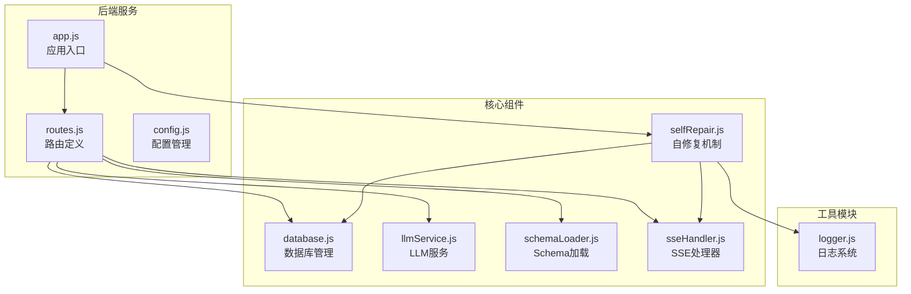
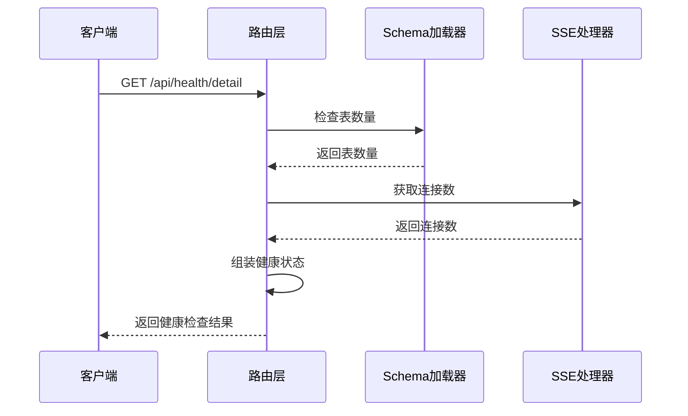
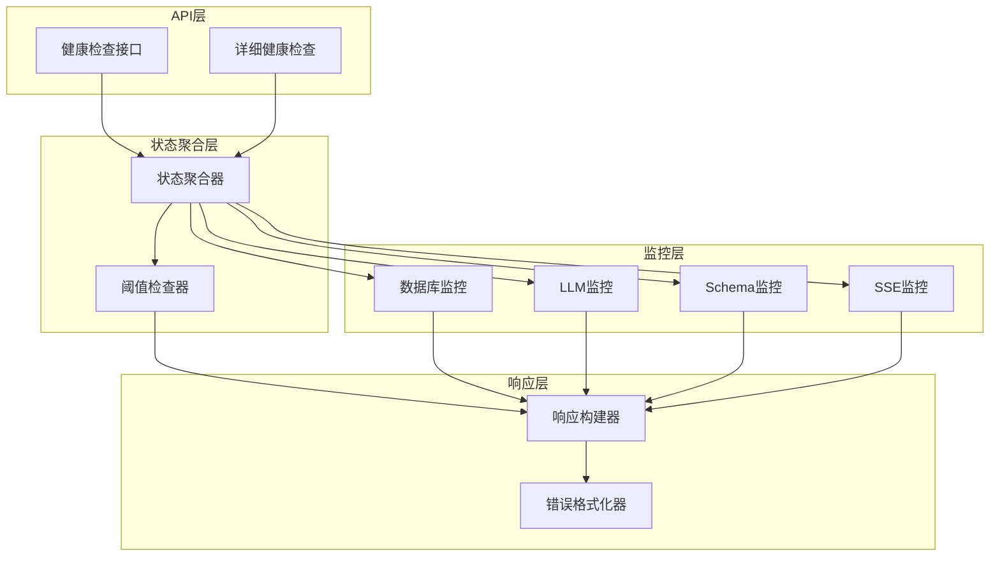
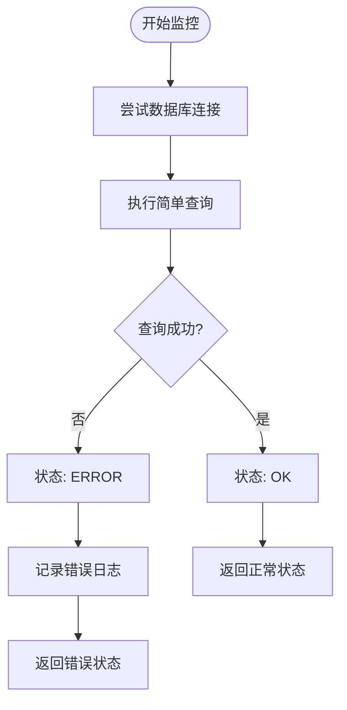
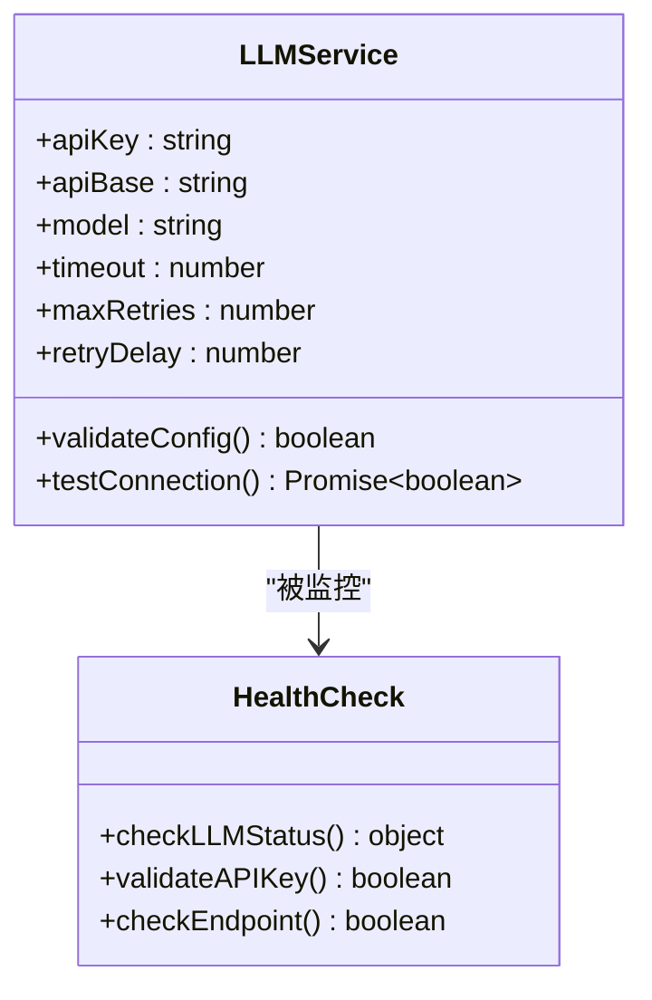
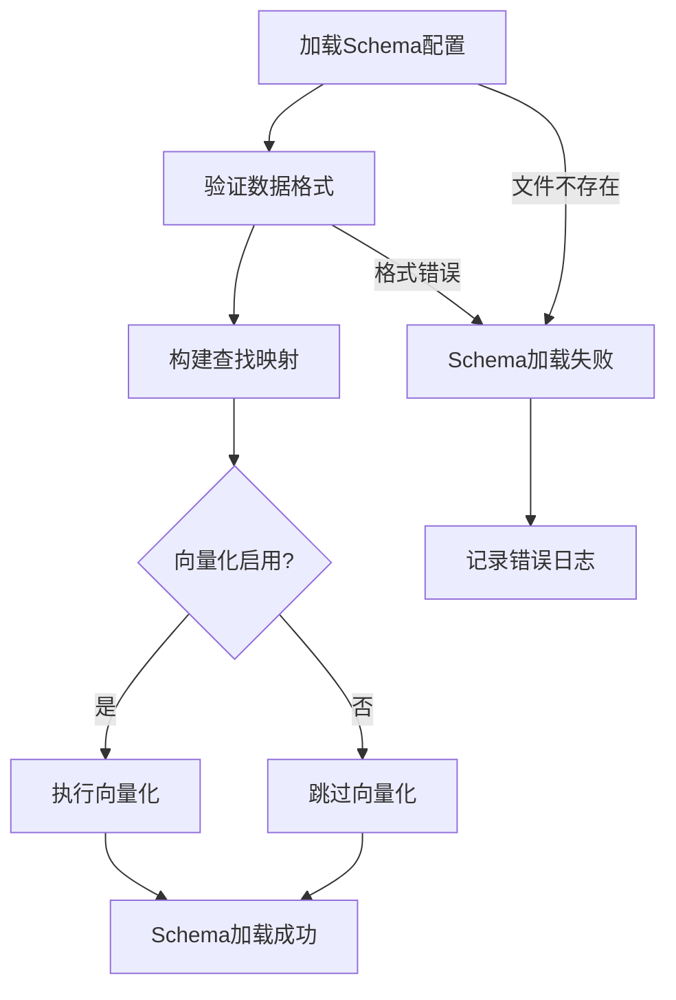
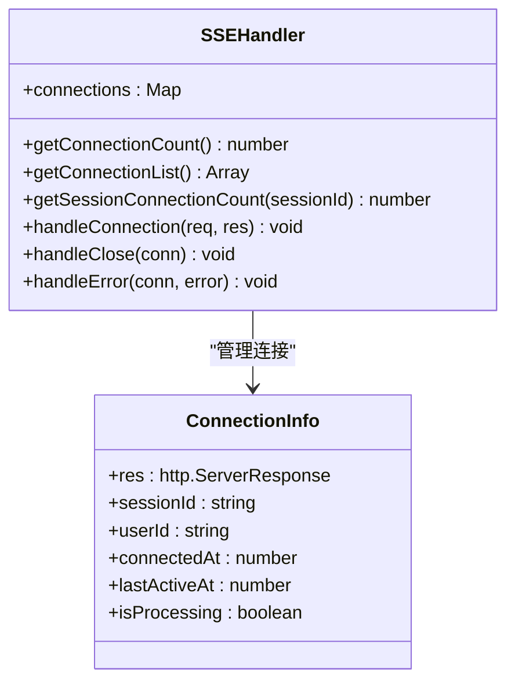
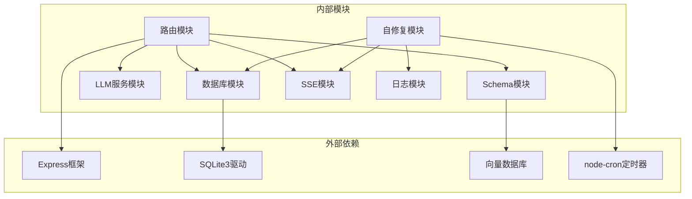

# 健康检查API

<cite>
**本文档引用的文件**
- [app.js](file://backend/src/app.js)
- [routes.js](file://backend/src/core/routes.js)
- [database.js](file://backend/src/core/database.js)
- [llmService.js](file://backend/src/core/llmService.js)
- [schemaLoader.js](file://backend/src/core/schemaLoader.js)
- [sseHandler.js](file://backend/src/core/sseHandler.js)
- [selfRepair.js](file://backend/src/core/selfRepair.js)
- [logger.js](file://backend/src/utils/logger.js)
- [config.js](file://backend/src/core/config.js)
- [package.json](file://backend/package.json)
</cite>

## 目录
1. [简介](#简介)
2. [项目结构](#项目结构)
3. [核心组件](#核心组件)
4. [架构概览](#架构概览)
5. [详细组件分析](#详细组件分析)
6. [依赖关系分析](#依赖关系分析)
7. [性能考虑](#性能考虑)
8. [故障排除指南](#故障排除指南)
9. [结论](#结论)

## 简介

NL2SQL健康检查API提供了完整的系统状态监控能力，包含基础健康检查和详细健康检查两个接口。该API能够监控数据库连接、LLM API服务、Schema加载和SSE连接等关键组件的状态，为系统运维提供实时的健康状态反馈。

## 项目结构

NL2SQL项目采用模块化架构设计，健康检查功能主要分布在以下核心模块中：

**图表来源**
- [app.js:1-260](file://backend/src/app.js#L1-L260)
- [routes.js:1-1037](file://backend/src/core/routes.js#L1-L1037)

**章节来源**
- [app.js:1-260](file://backend/src/app.js#L1-L260)
- [package.json:1-28](file://backend/package.json#L1-L28)

## 核心组件

### 健康检查API接口

系统提供两个层次的健康检查接口：

#### 基础健康检查
- **端点**: `GET /api/health`
- **用途**: 快速检查服务基本运行状态
- **响应**: 包含服务状态、时间戳、版本信息和内存使用情况

#### 详细健康检查
- **端点**: `GET /api/health/detail`
- **用途**: 全面检查各组件健康状态
- **响应**: 包含数据库、LLM API、Schema加载和SSE连接的详细状态

### 组件状态监控机制

健康检查API通过以下方式监控各组件状态：

**图表来源**
- [routes.js:99-137](file://backend/src/core/routes.js#L99-L137)
- [schemaLoader.js:432-434](file://backend/src/core/schemaLoader.js#L432-L434)
- [sseHandler.js:291-297](file://backend/src/core/sseHandler.js#L291-L297)

**章节来源**
- [routes.js:72-137](file://backend/src/core/routes.js#L72-L137)

## 架构概览

健康检查API采用分层架构设计，确保各组件职责清晰分离：

**图表来源**
- [routes.js:57-137](file://backend/src/core/routes.js#L57-L137)
- [selfRepair.js:169-310](file://backend/src/core/selfRepair.js#L169-L310)

## 详细组件分析

### 数据库连接监控

数据库连接监控通过直接查询验证连接有效性：

**图表来源**
- [selfRepair.js:189-196](file://backend/src/core/selfRepair.js#L189-L196)
- [database.js:370-409](file://backend/src/core/database.js#L370-L409)

数据库监控实现特点：
- 使用简单查询验证连接有效性
- 捕获并记录连接错误
- 提供详细的错误信息用于故障诊断

**章节来源**
- [database.js:206-267](file://backend/src/core/database.js#L206-L267)
- [selfRepair.js:189-196](file://backend/src/core/selfRepair.js#L189-L196)

### LLM API服务监控

LLM API监控通过配置验证确保API服务可用性：

**图表来源**
- [llmService.js:222-308](file://backend/src/core/llmService.js#L222-L308)
- [config.js:60-87](file://backend/src/core/config.js#L60-L87)

LLM监控关键点：
- 验证API密钥配置
- 检查API端点可达性
- 监控请求超时和重试机制

**章节来源**
- [llmService.js:222-308](file://backend/src/core/llmService.js#L222-L308)
- [config.js:60-87](file://backend/src/core/config.js#L60-L87)

### Schema加载监控

Schema加载监控验证数据结构定义的有效性：

**图表来源**
- [schemaLoader.js:69-122](file://backend/src/core/schemaLoader.js#L69-L122)
- [schemaLoader.js:161-189](file://backend/src/core/schemaLoader.js#L161-L189)

Schema监控实现：
- 验证Schema配置文件格式
- 检查表定义的完整性
- 监控向量化过程的执行状态

**章节来源**
- [schemaLoader.js:69-122](file://backend/src/core/schemaLoader.js#L69-L122)
- [schemaLoader.js:161-189](file://backend/src/core/schemaLoader.js#L161-L189)

### SSE连接监控

SSE连接监控跟踪实时连接状态：

**图表来源**
- [sseHandler.js:26-93](file://backend/src/core/sseHandler.js#L26-L93)
- [sseHandler.js:291-329](file://backend/src/core/sseHandler.js#L291-L329)

SSE监控特性：
- 实时跟踪活跃连接数
- 监控连接生命周期
- 提供连接统计信息

**章节来源**
- [sseHandler.js:26-93](file://backend/src/core/sseHandler.js#L26-L93)
- [sseHandler.js:291-329](file://backend/src/core/sseHandler.js#L291-L329)

## 依赖关系分析

健康检查API的依赖关系呈现清晰的分层结构：

**图表来源**
- [package.json:10-20](file://backend/package.json#L10-L20)
- [app.js:23-49](file://backend/src/app.js#L23-L49)

依赖关系特点：
- 明确的模块边界和职责划分
- 最小化循环依赖
- 清晰的外部依赖管理

**章节来源**
- [package.json:10-20](file://backend/package.json#L10-L20)
- [app.js:23-49](file://backend/src/app.js#L23-L49)

## 性能考虑

健康检查API在设计时充分考虑了性能影响：

### 响应时间优化
- 健康检查接口采用轻量级查询，避免复杂计算
- 使用连接池减少连接建立开销
- 实施缓存机制避免重复验证

### 资源使用控制
- 限制监控查询的复杂度
- 实施超时机制防止阻塞
- 控制日志输出级别

### 扩展性设计
- 支持水平扩展的监控节点
- 实施分布式健康检查协调
- 提供自定义监控指标接口

## 故障排除指南

### 常见问题诊断

#### 数据库连接问题
**症状**: 健康检查返回数据库错误状态
**排查步骤**:
1. 检查数据库文件权限
2. 验证数据库连接字符串
3. 确认数据库服务状态

#### LLM API连接问题
**症状**: LLM组件状态显示错误
**排查步骤**:
1. 验证API密钥配置
2. 检查网络连通性
3. 确认API端点可达性

#### Schema加载问题
**症状**: Schema组件状态异常
**排查步骤**:
1. 验证Schema配置文件格式
2. 检查文件权限
3. 确认向量化服务状态

#### SSE连接问题
**症状**: SSE组件状态异常
**排查步骤**:
1. 检查SSE连接数限制
2. 验证会话管理配置
3. 确认连接超时设置

### 监控配置建议

#### 健康检查频率设置
- **生产环境**: 每30秒检查一次
- **开发环境**: 每10秒检查一次
- **测试环境**: 每5秒检查一次

#### 阈值配置
- **数据库超时**: 5秒
- **LLM API超时**: 30秒
- **Schema加载超时**: 10秒
- **SSE连接超时**: 60秒

#### 告警机制
- **严重级别**: 立即通知运维团队
- **警告级别**: 记录日志并邮件通知
- **信息级别**: 仅记录不通知

**章节来源**
- [config.js:222-231](file://backend/src/core/config.js#L222-L231)
- [selfRepair.js:169-310](file://backend/src/core/selfRepair.js#L169-L310)

## 结论

NL2SQL健康检查API提供了全面、可靠的系统监控解决方案。通过分层架构设计和模块化实现，该API能够有效监控关键组件状态，为系统运维提供及时的状态反馈和故障预警。

### 主要优势
- **全面监控**: 覆盖数据库、LLM API、Schema和SSE连接
- **实时反馈**: 提供即时的健康状态信息
- **易于集成**: 简洁的API设计便于系统集成
- **可扩展性**: 支持自定义监控指标和阈值配置

### 最佳实践建议
1. **合理配置检查频率**，避免过度监控影响系统性能
2. **设置适当的告警阈值**，平衡告警准确性和及时性
3. **定期审查监控指标**，优化监控策略
4. **实施监控数据备份**，确保故障诊断信息的完整性

通过遵循这些最佳实践，NL2SQL健康检查API将成为保障系统稳定运行的重要工具。