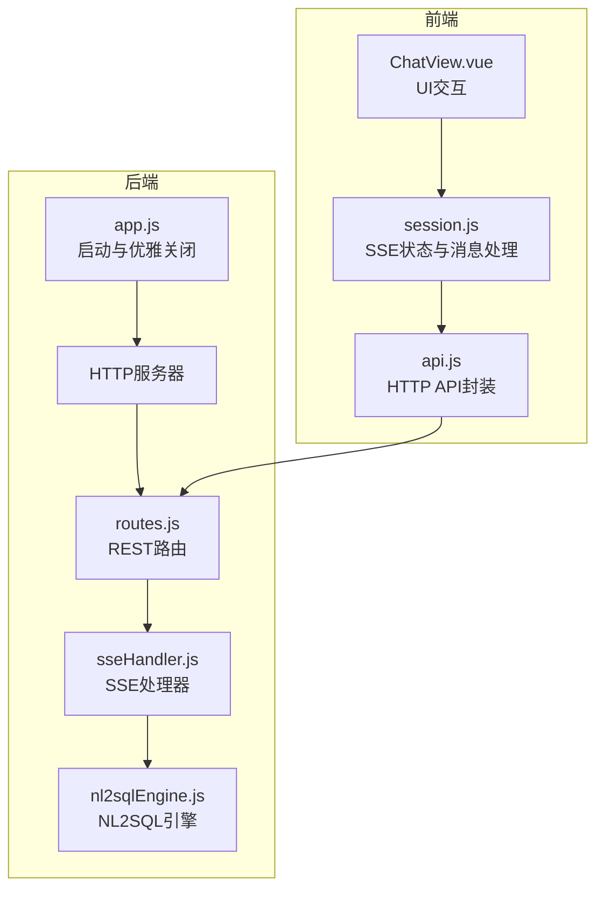
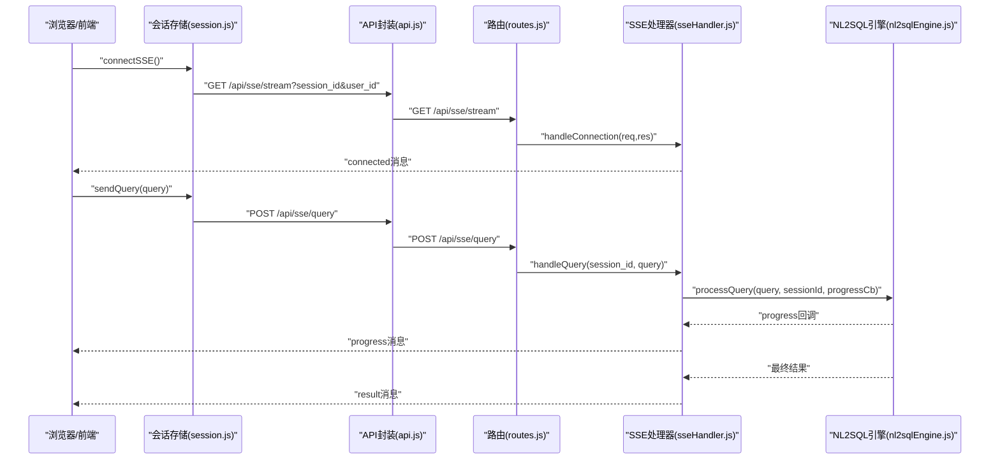
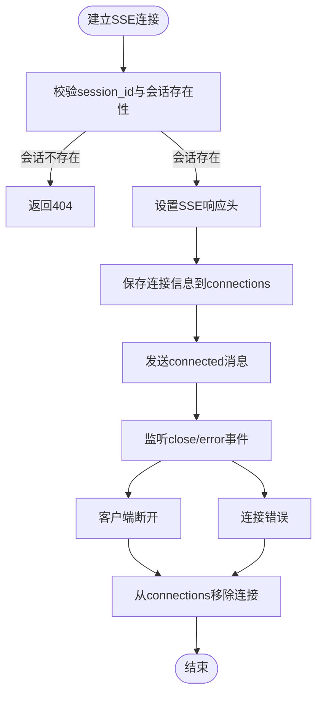
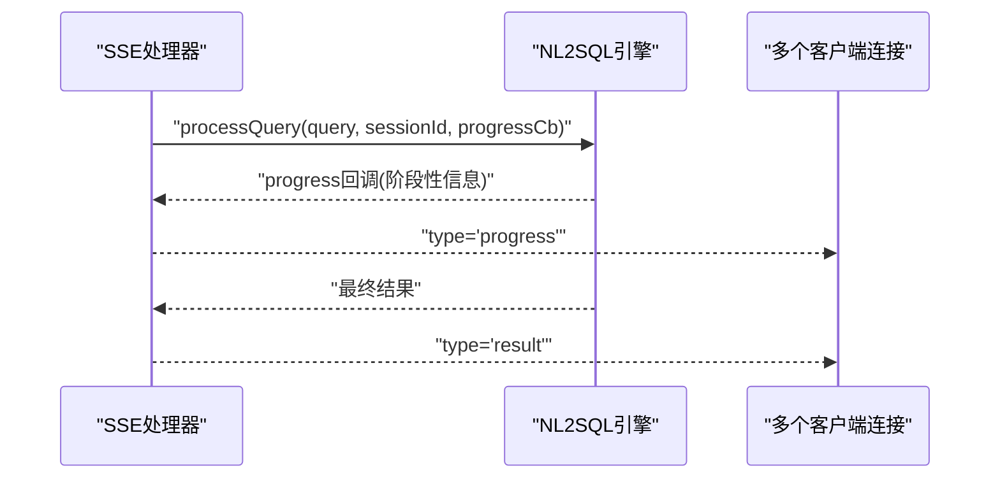
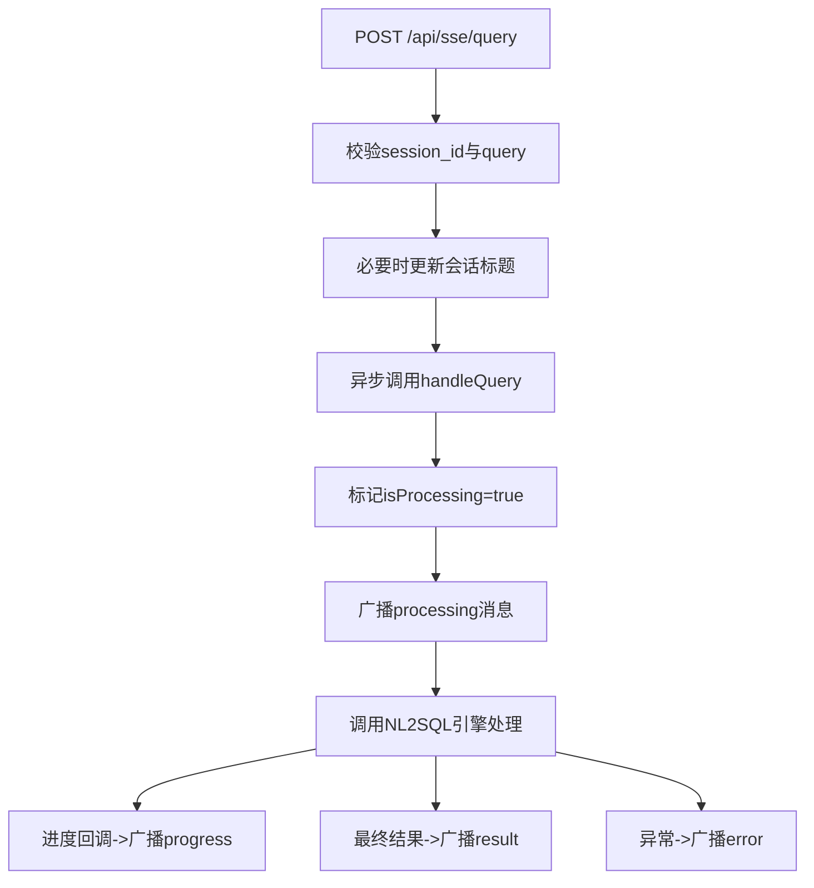
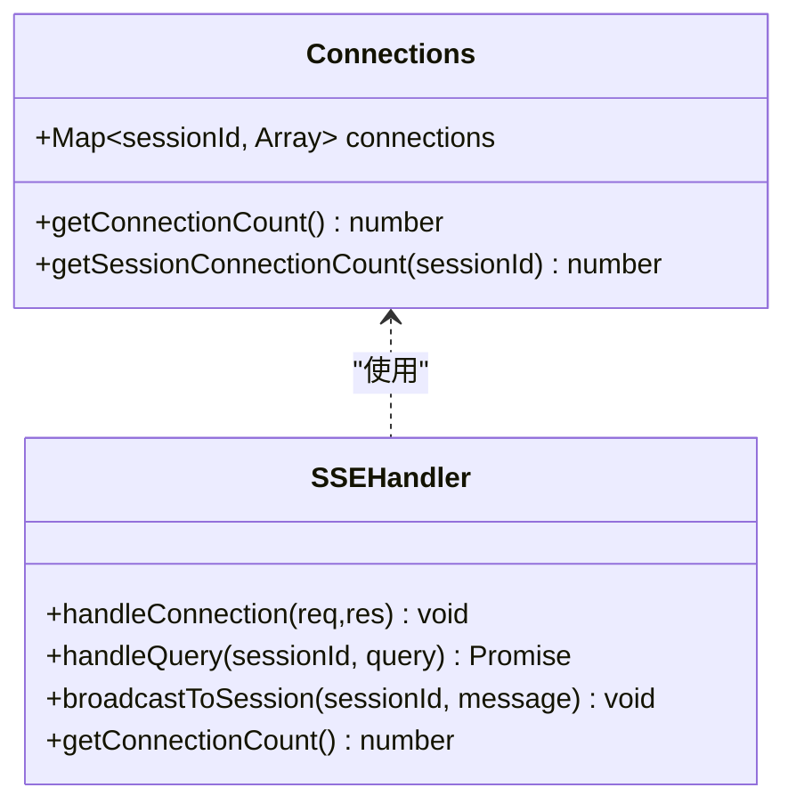
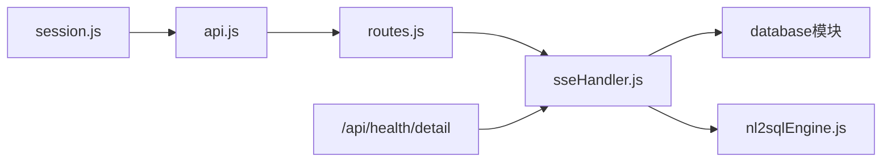

# 实时流API

<cite>
**本文档引用的文件**
- [backend/src/core/sseHandler.js](file://backend/src/core/sseHandler.js)
- [backend/src/core/routes.js](file://backend/src/core/routes.js)
- [backend/src/app.js](file://backend/src/app.js)
- [backend/src/core/nl2sqlEngine.js](file://backend/src/core/nl2sqlEngine.js)
- [backend/src/core/selfRepair.js](file://backend/src/core/selfRepair.js)
- [frontend/src/stores/session.js](file://frontend/src/stores/session.js)
- [frontend/src/utils/api.js](file://frontend/src/utils/api.js)
- [frontend/src/views/ChatView.vue](file://frontend/src/views/ChatView.vue)
</cite>

## 目录
1. [简介](#简介)
2. [项目结构](#项目结构)
3. [核心组件](#核心组件)
4. [架构总览](#架构总览)
5. [详细组件分析](#详细组件分析)
6. [依赖关系分析](#依赖关系分析)
7. [性能考量](#性能考量)
8. [故障排查指南](#故障排查指南)
9. [结论](#结论)
10. [附录](#附录)

## 简介
本文件面向NL2SQL项目的实时流API，聚焦Server-Sent Events（SSE）通信机制，覆盖以下主题：
- SSE连接建立、消息推送与断开处理的完整流程
- 实时进度通知机制、流式响应格式与错误重连策略
- SSE连接池管理、并发连接限制与资源清理机制
- 客户端连接示例、消息格式规范与状态同步策略
- 性能监控指标、连接统计信息与故障诊断方法

## 项目结构
后端采用Express + 原生HTTP服务器，SSE通过独立处理器模块管理；前端使用EventSource进行SSE订阅，并通过封装的API模块发起查询。

**图表来源**
- [backend/src/app.js:170-180](file://backend/src/app.js#L170-L180)
- [backend/src/core/routes.js:948-1002](file://backend/src/core/routes.js#L948-L1002)
- [backend/src/core/sseHandler.js:43-112](file://backend/src/core/sseHandler.js#L43-L112)
- [backend/src/core/nl2sqlEngine.js:1-200](file://backend/src/core/nl2sqlEngine.js#L1-L200)
- [frontend/src/stores/session.js:200-399](file://frontend/src/stores/session.js#L200-L399)
- [frontend/src/utils/api.js:246-251](file://frontend/src/utils/api.js#L246-L251)

**章节来源**
- [backend/src/app.js:170-180](file://backend/src/app.js#L170-L180)
- [backend/src/core/routes.js:948-1002](file://backend/src/core/routes.js#L948-L1002)

## 核心组件
- SSE处理器：负责连接管理、消息发送、进度回调与统计查询。
- 路由层：暴露SSE连接端点与查询提交端点。
- NL2SQL引擎：执行查询处理并将进度回调回传给SSE处理器。
- 前端会话存储：封装EventSource，处理消息类型与状态同步。
- 应用入口：启动HTTP服务器、注册路由与优雅关闭。

**章节来源**
- [backend/src/core/sseHandler.js:26-30](file://backend/src/core/sseHandler.js#L26-L30)
- [backend/src/core/routes.js:948-1002](file://backend/src/core/routes.js#L948-L1002)
- [backend/src/core/nl2sqlEngine.js:1-200](file://backend/src/core/nl2sqlEngine.js#L1-L200)
- [frontend/src/stores/session.js:200-399](file://frontend/src/stores/session.js#L200-L399)

## 架构总览
SSE实时流API的关键交互链路如下：

**图表来源**
- [backend/src/core/routes.js:948-1002](file://backend/src/core/routes.js#L948-L1002)
- [backend/src/core/sseHandler.js:43-112](file://backend/src/core/sseHandler.js#L43-L112)
- [backend/src/core/sseHandler.js:218-280](file://backend/src/core/sseHandler.js#L218-L280)
- [backend/src/core/nl2sqlEngine.js:1-200](file://backend/src/core/nl2sqlEngine.js#L1-L200)
- [frontend/src/stores/session.js:200-399](file://frontend/src/stores/session.js#L200-L399)
- [frontend/src/utils/api.js:246-251](file://frontend/src/utils/api.js#L246-L251)

## 详细组件分析

### SSE连接建立与断开处理
- 连接建立：路由层接收GET /api/sse/stream，调用SSE处理器的handleConnection。处理器校验会话、设置SSE响应头、记录连接信息并发送connected消息。同时绑定close与error事件，分别触发handleClose与handleError。
- 断开处理：当客户端断开或出现错误时，清理connections映射中的对应连接；若某会话无剩余连接，则删除该会话键。

**图表来源**
- [backend/src/core/routes.js:948-959](file://backend/src/core/routes.js#L948-L959)
- [backend/src/core/sseHandler.js:43-112](file://backend/src/core/sseHandler.js#L43-L112)
- [backend/src/core/sseHandler.js:119-153](file://backend/src/core/sseHandler.js#L119-L153)

**章节来源**
- [backend/src/core/routes.js:948-959](file://backend/src/core/routes.js#L948-L959)
- [backend/src/core/sseHandler.js:43-112](file://backend/src/core/sseHandler.js#L43-L112)
- [backend/src/core/sseHandler.js:119-153](file://backend/src/core/sseHandler.js#L119-L153)

### 实时进度通知机制与流式响应格式
- 进度回调：SSE处理器在handleQuery中调用NL2SQL引擎的processQuery，并传入progress回调。每次进度更新时，SSE处理器通过broadcastToSession向会话内所有连接广播progress消息。
- 消息类型：
  - connected：连接成功
  - processing：开始处理
  - progress：进度更新（含message、stage、progress等字段）
  - result：最终结果（含message、type、sql、data等）
  - error：错误消息
- 前端解析：前端store在onmessage中解析event.data为JSON，并根据data.type切换UI状态（如进度条、状态文本），在result时注入metadata（sql与data）。

**图表来源**
- [backend/src/core/sseHandler.js:242-266](file://backend/src/core/sseHandler.js#L242-L266)
- [backend/src/core/sseHandler.js:197-204](file://backend/src/core/sseHandler.js#L197-L204)
- [frontend/src/stores/session.js:227-295](file://frontend/src/stores/session.js#L227-L295)

**章节来源**
- [backend/src/core/sseHandler.js:242-266](file://backend/src/core/sseHandler.js#L242-L266)
- [frontend/src/stores/session.js:227-295](file://frontend/src/stores/session.js#L227-L295)

### 查询提交与异步处理
- 提交端点：POST /api/sse/query接收session_id与query，校验后立即返回“查询已提交”响应，随后异步调用SSE处理器的handleQuery。
- 会话标题更新：若会话标题为默认值，则在首次查询时将其更新为查询内容的截断片段。
- 引擎处理：handleQuery检查连接状态与并发标记，标记isProcessing后广播processing消息，再调用NL2SQL引擎执行查询并在进度回调中持续推送progress消息，最终推送result或error。

**图表来源**
- [backend/src/core/routes.js:972-1002](file://backend/src/core/routes.js#L972-L1002)
- [backend/src/core/sseHandler.js:218-280](file://backend/src/core/sseHandler.js#L218-L280)

**章节来源**
- [backend/src/core/routes.js:972-1002](file://backend/src/core/routes.js#L972-L1002)
- [backend/src/core/sseHandler.js:218-280](file://backend/src/core/sseHandler.js#L218-L280)

### 连接池管理、并发限制与资源清理
- 连接池：以sessionId为键，值为连接信息数组，支持同一会话多标签页或多连接。
- 并发控制：在handleQuery中，若任一连接处于isProcessing状态则拒绝新请求；处理完成后统一复位。
- 资源清理：handleClose与handleError均会从connections中移除连接；当某会话无剩余连接时删除该键；应用优雅关闭时，HTTP服务器关闭导致SSE连接自动断开。
- 统计接口：getConnectionCount与getSessionConnectionCount用于监控连接数；/api/health/detail包含SSE连接数。

**图表来源**
- [backend/src/core/sseHandler.js:26-30](file://backend/src/core/sseHandler.js#L26-L30)
- [backend/src/core/sseHandler.js:291-329](file://backend/src/core/sseHandler.js#L291-L329)
- [backend/src/core/routes.js:120-126](file://backend/src/core/routes.js#L120-L126)

**章节来源**
- [backend/src/core/sseHandler.js:26-30](file://backend/src/core/sseHandler.js#L26-L30)
- [backend/src/core/sseHandler.js:291-329](file://backend/src/core/sseHandler.js#L291-L329)
- [backend/src/core/routes.js:120-126](file://backend/src/core/routes.js#L120-L126)

### 客户端连接示例与消息格式规范
- 客户端连接：前端通过EventSource订阅GET /api/sse/stream，携带session_id与可选user_id。
- 消息格式：每条消息为JSON对象，包含type与data字段。常见类型与data字段：
  - connected：{ session_id, message }
  - processing：{ message }
  - progress：{ message, stage, progress }
  - result：{ message, type, sql, data }
  - error：{ message }
- 状态同步：前端store根据type更新processingStatus、processingProgress与isProcessing，并在result时注入metadata（sql与data）。

**章节来源**
- [frontend/src/stores/session.js:200-399](file://frontend/src/stores/session.js#L200-L399)
- [frontend/src/utils/api.js:246-251](file://frontend/src/utils/api.js#L246-L251)

### 错误重连策略
- 前端侧：在onerror中记录错误并标记isConnected=false；可在UI层触发重新connectSSE。
- 后端侧：连接断开或错误时自动清理connections；若客户端断线重连，需重新发起GET /api/sse/stream以重建连接。
- 健康检查：/api/health/detail包含SSE连接数，可用于运维监控。

**章节来源**
- [frontend/src/stores/session.js:213-221](file://frontend/src/stores/session.js#L213-L221)
- [backend/src/core/routes.js:120-126](file://backend/src/core/routes.js#L120-L126)

## 依赖关系分析
- 路由依赖SSE处理器：/api/sse/stream与/api/sse/query均委托给sseHandler。
- SSE处理器依赖数据库与NL2SQL引擎：用于会话校验与查询处理。
- 健康检查依赖SSE处理器：获取连接数。
- 前端依赖API封装与会话存储：API封装统一HTTP交互，会话存储封装EventSource与消息处理。

**图表来源**
- [backend/src/core/routes.js:26-27](file://backend/src/core/routes.js#L26-L27)
- [backend/src/core/routes.js:120-126](file://backend/src/core/routes.js#L120-L126)
- [frontend/src/stores/session.js:200-399](file://frontend/src/stores/session.js#L200-L399)
- [frontend/src/utils/api.js:246-251](file://frontend/src/utils/api.js#L246-L251)

**章节来源**
- [backend/src/core/routes.js:26-27](file://backend/src/core/routes.js#L26-L27)
- [backend/src/core/routes.js:120-126](file://backend/src/core/routes.js#L120-L126)

## 性能考量
- SSE响应头：设置Content-Type为text/event-stream，Cache-Control为no-cache，Connection为keep-alive，并禁用Nginx缓冲，确保低延迟推送。
- 连接并发：单会话内仅允许一个并发请求（isProcessing互斥），避免资源争用。
- 进度粒度：建议在NL2SQL引擎中合理拆分阶段，使progress消息频率适中，避免过多写入导致性能下降。
- 健康监控：/api/health与/SSE连接数可用于观察系统负载与连接峰值。

**章节来源**
- [backend/src/core/sseHandler.js:64-70](file://backend/src/core/sseHandler.js#L64-L70)
- [backend/src/core/sseHandler.js:228-231](file://backend/src/core/sseHandler.js#L228-L231)
- [backend/src/core/routes.js:120-126](file://backend/src/core/routes.js#L120-L126)

## 故障排查指南
- 连接失败
  - 缺少session_id：返回400，提示缺少参数。
  - 会话不存在：返回404，提示会话不存在。
  - 建议：确认会话已在后端创建且session_id有效。
- 处理冲突
  - 正在处理其他请求：提示“正在处理其他请求，请稍候”，等待处理完成。
- 连接断开
  - 前端：onerror中记录错误并断开连接；可尝试重新connectSSE。
  - 后端：handleClose与handleError自动清理；检查日志定位异常原因。
- 健康检查
  - 使用GET /api/health/detail查看SSE连接数与各组件状态。
- 优雅关闭
  - 应用收到SIGTERM/SIGINT时，先关闭HTTP服务器，再关闭SSE连接，最后关闭数据库与定时任务。

**章节来源**
- [backend/src/core/sseHandler.js:48-62](file://backend/src/core/sseHandler.js#L48-L62)
- [backend/src/core/sseHandler.js:228-231](file://backend/src/core/sseHandler.js#L228-L231)
- [frontend/src/stores/session.js:213-221](file://frontend/src/stores/session.js#L213-L221)
- [backend/src/core/routes.js:100-137](file://backend/src/core/routes.js#L100-L137)
- [backend/src/app.js:198-252](file://backend/src/app.js#L198-L252)

## 结论
NL2SQL的SSE实时流API通过简洁的连接管理、明确的消息类型与进度回调机制，实现了低延迟的查询结果推送。结合健康检查与优雅关闭策略，系统在可用性与可观测性方面具备良好表现。建议在生产环境中配合反向代理禁用缓冲、合理设置进度粒度与监控告警，以获得更稳定的用户体验。

## 附录

### API定义与使用要点
- 建立SSE连接
  - 方法：GET
  - 路径：/api/sse/stream
  - 查询参数：session_id（必填）、user_id（可选）
- 提交查询
  - 方法：POST
  - 路径：/api/sse/query
  - 请求体：{ session_id, query }
  - 响应：{ success: true, message: '查询已提交，请通过SSE接收结果' }

**章节来源**
- [backend/src/core/routes.js:948-1002](file://backend/src/core/routes.js#L948-L1002)

### 健康检查与统计
- GET /api/health：基础健康状态
- GET /api/health/detail：包含SSE连接数的详细健康状态
- SSE连接统计：getConnectionCount、getSessionConnectionCount

**章节来源**
- [backend/src/core/routes.js:72-137](file://backend/src/core/routes.js#L72-L137)
- [backend/src/core/sseHandler.js:291-329](file://backend/src/core/sseHandler.js#L291-L329)