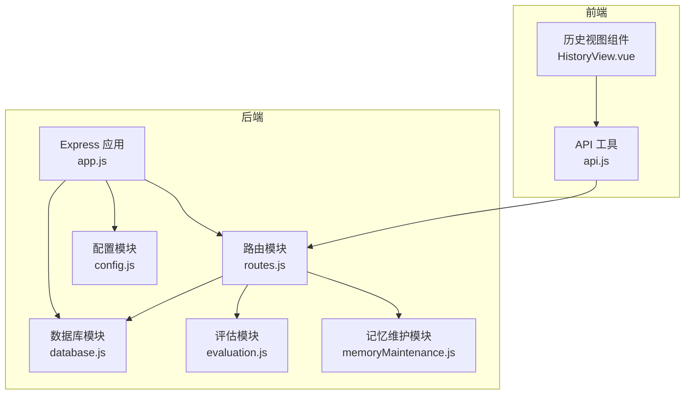
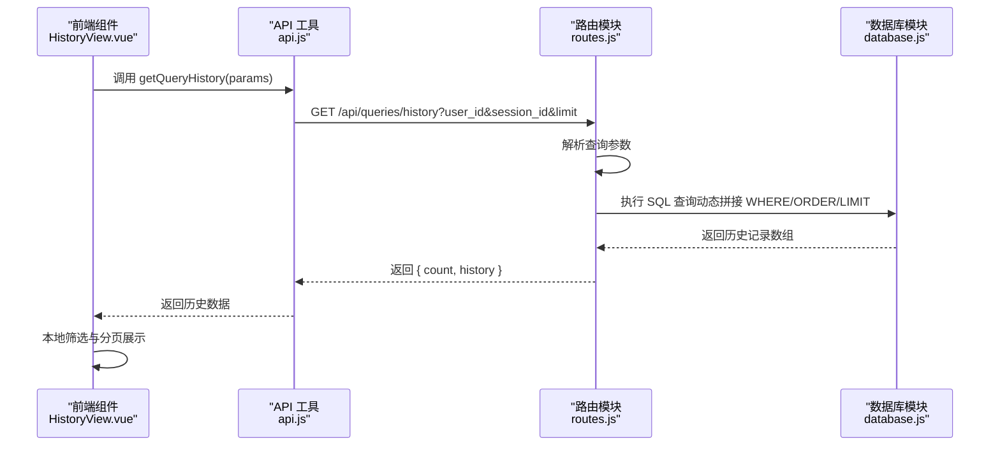
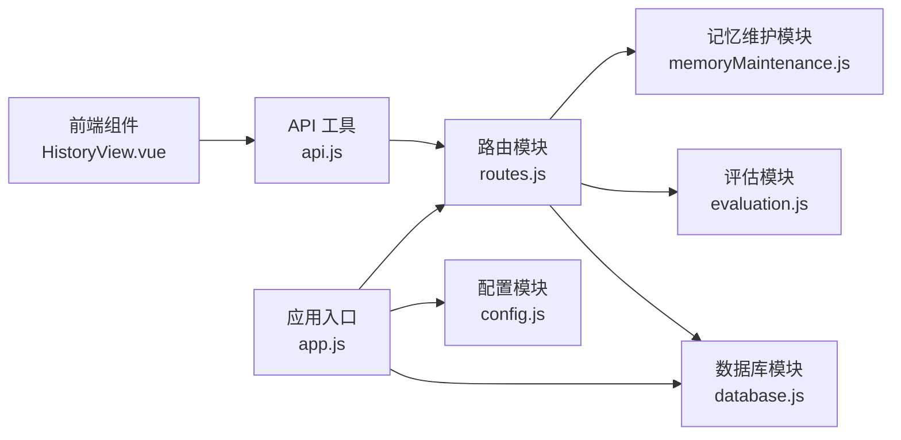
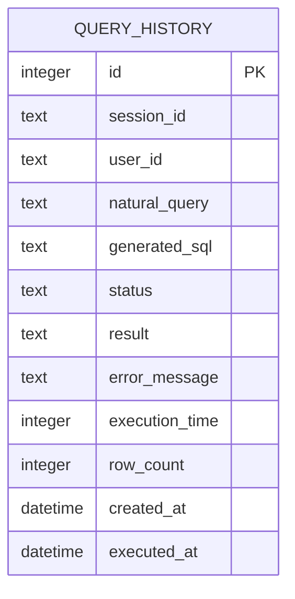

# 查询历史API

<cite>
**本文引用的文件**
- [app.js](file://backend/src/app.js)
- [routes.js](file://backend/src/core/routes.js)
- [database.js](file://backend/src/core/database.js)
- [config.js](file://backend/src/core/config.js)
- [api.js](file://frontend/src/utils/api.js)
- [HistoryView.vue](file://frontend/src/views/HistoryView.vue)
- [evaluation.js](file://backend/src/utils/evaluation.js)
- [memoryMaintenance.js](file://backend/src/memory/memoryMaintenance.js)
- [package.json](file://backend/package.json)
</cite>

## 目录
1. [简介](#简介)
2. [项目结构](#项目结构)
3. [核心组件](#核心组件)
4. [架构总览](#架构总览)
5. [详细组件分析](#详细组件分析)
6. [依赖关系分析](#依赖关系分析)
7. [性能考量](#性能考量)
8. [故障排查指南](#故障排查指南)
9. [结论](#结论)
10. [附录](#附录)

## 简介
本文件为 NL2SQL 项目的“查询历史”RESTful API 文档，聚焦于 GET /api/queries/history 的查询历史查询接口。内容涵盖：
- 接口参数与行为（用户ID筛选、会话ID筛选、分页与排序）
- 历史记录数据结构与存储机制
- 查询优化策略与索引设计
- 历史数据分析与统计接口
- 历史数据清理策略与存储空间管理
- 历史数据导出与批量处理能力现状说明

## 项目结构
后端采用 Express 框架，通过路由模块集中定义 REST API；数据库使用 SQLite，配合索引提升查询性能；前端通过封装的 API 工具调用后端接口。

图表来源
- [app.js:1-260](file://backend/src/app.js#L1-L260)
- [routes.js:1-800](file://backend/src/core/routes.js#L1-L800)
- [database.js:1-859](file://backend/src/core/database.js#L1-L859)
- [config.js:1-398](file://backend/src/core/config.js#L1-L398)
- [api.js:153-209](file://frontend/src/utils/api.js#L153-L209)
- [HistoryView.vue:1-441](file://frontend/src/views/HistoryView.vue#L1-L441)
- [evaluation.js:1-488](file://backend/src/utils/evaluation.js#L1-L488)
- [memoryMaintenance.js:1-417](file://backend/src/memory/memoryMaintenance.js#L1-L417)

章节来源
- [app.js:1-260](file://backend/src/app.js#L1-L260)
- [routes.js:1-800](file://backend/src/core/routes.js#L1-L800)
- [database.js:1-859](file://backend/src/core/database.js#L1-L859)
- [config.js:1-398](file://backend/src/core/config.js#L1-L398)
- [api.js:153-209](file://frontend/src/utils/api.js#L153-L209)
- [HistoryView.vue:1-441](file://frontend/src/views/HistoryView.vue#L1-L441)
- [evaluation.js:1-488](file://backend/src/utils/evaluation.js#L1-L488)
- [memoryMaintenance.js:1-417](file://backend/src/memory/memoryMaintenance.js#L1-L417)

## 核心组件
- 路由与控制器：在路由模块中定义 GET /api/queries/history，负责参数解析、SQL 构造与执行。
- 数据库层：提供 SQLite 表结构定义与查询方法，包含查询历史表的索引设计。
- 前端集成：前端组件通过 API 工具调用后端接口，并实现本地筛选与分页。
- 评估与统计：提供运行时统计接口，可用于历史查询质量与命中率分析。
- 记忆维护：长期记忆清理策略，虽针对偏好表，但体现数据生命周期管理思路。

章节来源
- [routes.js:400-450](file://backend/src/core/routes.js#L400-L450)
- [database.js:94-135](file://backend/src/core/database.js#L94-L135)
- [api.js:201-209](file://frontend/src/utils/api.js#L201-L209)
- [HistoryView.vue:223-297](file://frontend/src/views/HistoryView.vue#L223-L297)
- [evaluation.js:397-407](file://backend/src/utils/evaluation.js#L397-L407)
- [memoryMaintenance.js:24-46](file://backend/src/memory/memoryMaintenance.js#L24-L46)

## 架构总览
查询历史接口的调用链路如下：

图表来源
- [HistoryView.vue:223-297](file://frontend/src/views/HistoryView.vue#L223-L297)
- [api.js:201-209](file://frontend/src/utils/api.js#L201-L209)
- [routes.js:413-450](file://backend/src/core/routes.js#L413-L450)
- [database.js:370-409](file://backend/src/core/database.js#L370-L409)

## 详细组件分析

### 接口定义与参数
- 路径：GET /api/queries/history
- 查询参数：
  - user_id：用户ID筛选（可选）
  - session_id：会话ID筛选（可选）
  - limit：返回数量限制（默认20）
- 响应：
  - count：返回记录数量
  - history：历史记录数组（按 created_at 降序）

章节来源
- [routes.js:404-412](file://backend/src/core/routes.js#L404-L412)
- [routes.js:413-450](file://backend/src/core/routes.js#L413-L450)

### 数据结构与存储机制
- 表结构：query_history
  - 主键：id（自增）
  - 外键：session_id（可为空，ON DELETE SET NULL）
  - 关键字段：user_id、natural_query、generated_sql、status、result、error_message、execution_time、row_count、created_at、executed_at
- 索引设计：
  - idx_query_history_user_id：加速按用户查询
  - idx_query_history_session_id：加速按会话查询
  - idx_query_history_created_at：加速按时间排序
  - idx_query_history_status：加速按状态筛选

章节来源
- [database.js:94-135](file://backend/src/core/database.js#L94-L135)

### 查询优化策略
- 动态 SQL 构造：根据是否存在 user_id 和 session_id 条件动态拼接 WHERE 子句，避免不必要的全表扫描。
- 排序与限制：固定按 created_at DESC 且限制返回数量，结合 created_at 索引可高效实现分页。
- 参数化查询：使用占位符与参数数组，防止 SQL 注入。

章节来源
- [routes.js:417-435](file://backend/src/core/routes.js#L417-L435)
- [database.js:370-409](file://backend/src/core/database.js#L370-L409)

### 历史数据分析与统计
- 运行时统计接口：
  - GET /api/evaluation/stats：获取向量检索命中率与长期记忆命中率统计。
  - POST /api/evaluation/stats/reset：重置统计数据。
- 评估模块支持：
  - 向量化质量评估（Schema 与查询历史相似度）
  - 记忆命中率统计（按类型细分）

章节来源
- [routes.js:722-760](file://backend/src/core/routes.js#L722-L760)
- [evaluation.js:397-407](file://backend/src/utils/evaluation.js#L397-L407)
- [evaluation.js:465-487](file://backend/src/utils/evaluation.js#L465-L487)

### 历史数据清理策略与存储空间管理
- 长期记忆清理策略（偏好表）：
  - 高频（≥10次）：永久保留
  - 中频（3-9次）：90天未用清理（跳过置顶）
  - 低频（<3次）：30天未用清理（跳过置顶）
  - 字段别名：365天未用清理（跳过置顶）
- 查询历史表未显式定义清理策略，建议结合业务需求在应用层或数据库层制定保留周期与清理任务。

章节来源
- [memoryMaintenance.js:24-46](file://backend/src/memory/memoryMaintenance.js#L24-L46)
- [memoryMaintenance.js:134-165](file://backend/src/memory/memoryMaintenance.js#L134-L165)

### 历史数据导出与批量处理能力
- 后端未提供专门的导出接口或批量处理端点。
- 前端历史视图具备本地筛选与分页，但未实现导出功能。
- 若需导出，可在前端将当前页数据序列化为 CSV/JSON，或在后端扩展导出接口（建议基于 limit/offset 分页拉取全量数据并流式输出）。

章节来源
- [HistoryView.vue:223-297](file://frontend/src/views/HistoryView.vue#L223-L297)
- [routes.js:404-412](file://backend/src/core/routes.js#L404-L412)

## 依赖关系分析

图表来源
- [HistoryView.vue:1-441](file://frontend/src/views/HistoryView.vue#L1-L441)
- [api.js:153-209](file://frontend/src/utils/api.js#L153-L209)
- [routes.js:1-800](file://backend/src/core/routes.js#L1-L800)
- [database.js:1-859](file://backend/src/core/database.js#L1-L859)
- [evaluation.js:1-488](file://backend/src/utils/evaluation.js#L1-L488)
- [memoryMaintenance.js:1-417](file://backend/src/memory/memoryMaintenance.js#L1-L417)
- [app.js:1-260](file://backend/src/app.js#L1-L260)
- [config.js:1-398](file://backend/src/core/config.js#L1-L398)

章节来源
- [package.json:10-20](file://backend/package.json#L10-L20)
- [app.js:40-50](file://backend/src/app.js#L40-L50)
- [routes.js:16-30](file://backend/src/core/routes.js#L16-L30)

## 性能考量
- 索引利用：created_at、user_id、session_id、status 索引可显著提升查询与排序性能。
- 分页策略：建议前端使用 limit+offset 或基于游标分页，避免深层分页导致的性能下降。
- 查询复杂度：动态 WHERE 条件与 ORDER/LIMIT 组合在 SQLite 上可利用索引，但过多 OR 条件可能影响索引使用。
- 评估统计：运行时统计仅在启用跟踪时记录，避免对主流程造成额外开销。

章节来源
- [database.js:127-134](file://backend/src/core/database.js#L127-L134)
- [routes.js:417-435](file://backend/src/core/routes.js#L417-L435)
- [evaluation.js:71-96](file://backend/src/utils/evaluation.js#L71-L96)

## 故障排查指南
- 400 错误（缺少必要参数）：确认查询参数是否正确传递。
- 500 错误（数据库异常）：检查数据库连接、表结构与索引是否存在。
- 查询缓慢：确认是否命中 created_at、user_id、session_id 等索引；考虑减少返回数量或增加筛选条件。
- 评估统计未更新：确认评估开关与跟踪开关是否启用。

章节来源
- [routes.js:444-449](file://backend/src/core/routes.js#L444-L449)
- [database.js:206-267](file://backend/src/core/database.js#L206-L267)
- [config.js:342-354](file://backend/src/core/config.js#L342-L354)

## 结论
- GET /api/queries/history 提供了灵活的用户/会话筛选、分页与排序能力，配合 SQLite 索引可满足日常查询需求。
- 建议在应用层或数据库层补充查询历史的生命周期管理策略（如保留周期、清理任务），以控制存储成本。
- 若需导出与批量处理，可在前端或后端扩展相应能力，确保数据完整性与性能平衡。

## 附录

### API 定义概览
- 路径：GET /api/queries/history
- 查询参数：
  - user_id：用户ID（可选）
  - session_id：会话ID（可选）
  - limit：返回数量（默认20）
- 响应字段：
  - count：返回记录数量
  - history：历史记录数组（按 created_at 降序）

章节来源
- [routes.js:404-412](file://backend/src/core/routes.js#L404-L412)
- [routes.js:413-450](file://backend/src/core/routes.js#L413-L450)

### 历史记录数据模型

图表来源
- [database.js:98-125](file://backend/src/core/database.js#L98-L125)

### 前端调用与展示
- 前端通过 api.js 的 getQueryHistory(params) 调用后端接口。
- 历史视图组件支持本地筛选（关键词、状态、日期范围）与分页展示。

章节来源
- [api.js:201-209](file://frontend/src/utils/api.js#L201-L209)
- [HistoryView.vue:223-297](file://frontend/src/views/HistoryView.vue#L223-L297)