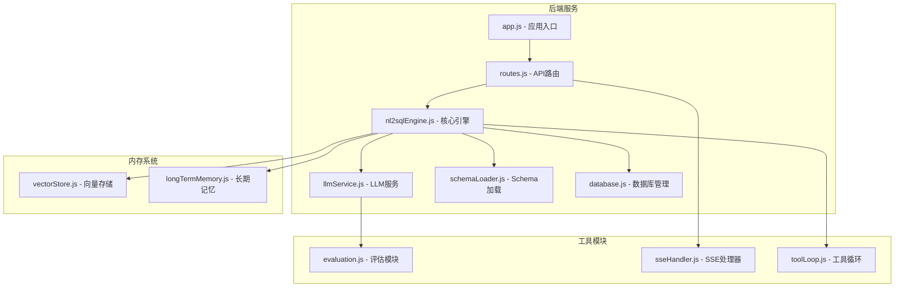
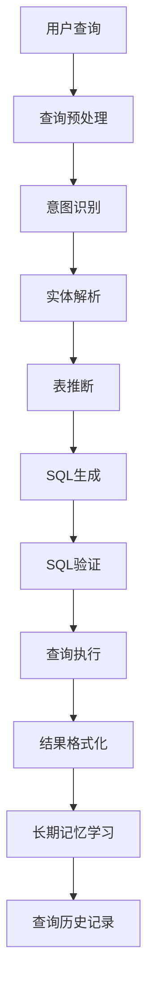
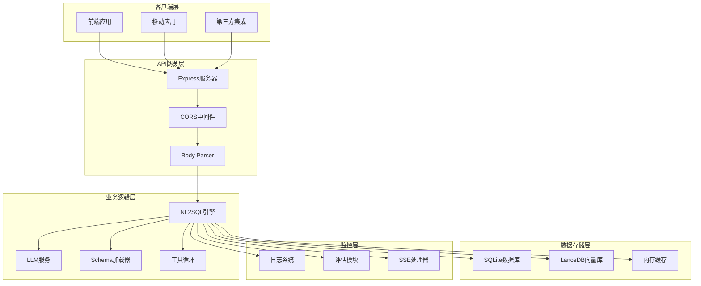
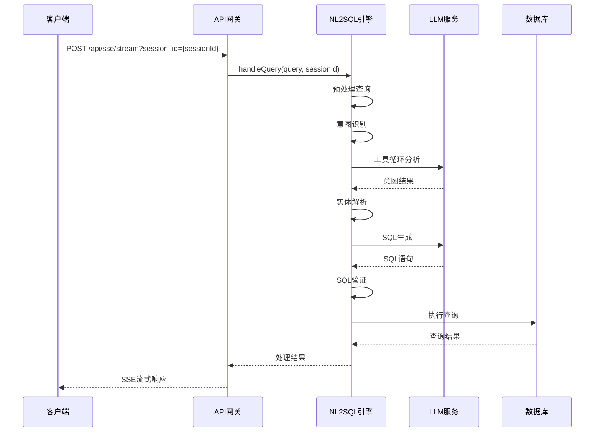
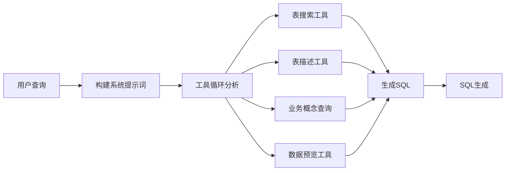
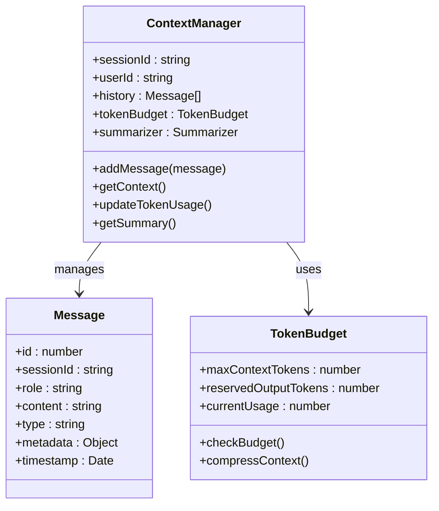
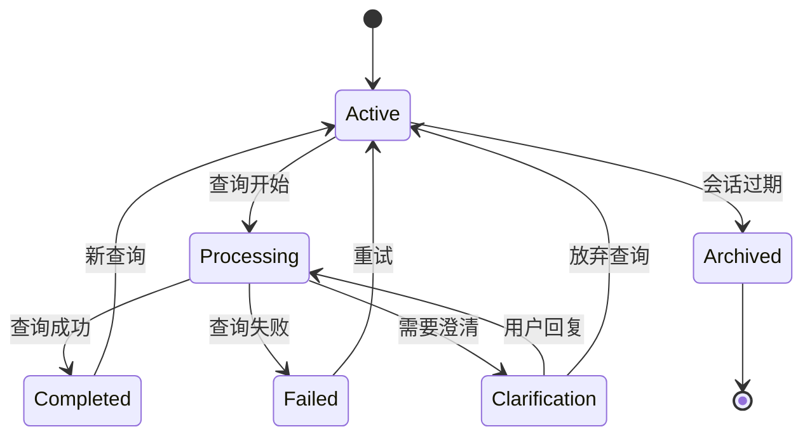
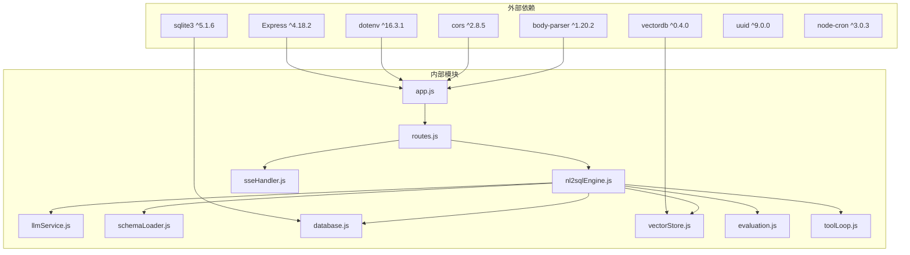
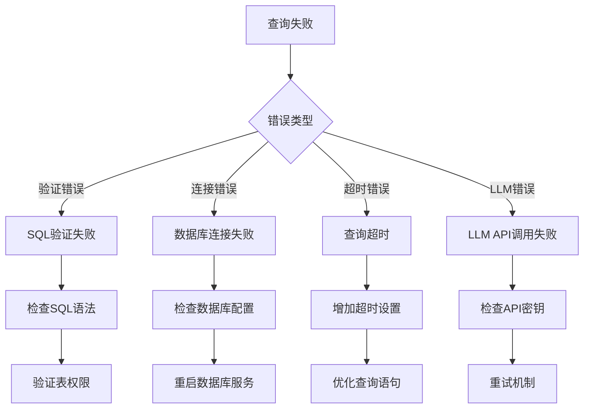

# 核心查询API

<cite>
**本文档引用的文件**
- [app.js](file://backend/src/app.js)
- [routes.js](file://backend/src/core/routes.js)
- [nl2sqlEngine.js](file://backend/src/core/nl2sqlEngine.js)
- [llmService.js](file://backend/src/core/llmService.js)
- [schemaLoader.js](file://backend/src/core/schemaLoader.js)
- [database.js](file://backend/src/core/database.js)
- [config.js](file://backend/src/core/config.js)
- [logger.js](file://backend/src/utils/logger.js)
- [vectorStore.js](file://backend/src/memory/vectorStore.js)
- [evaluation.js](file://backend/src/utils/evaluation.js)
- [sseHandler.js](file://backend/src/core/sseHandler.js)
- [toolLoop.js](file://backend/src/core/toolLoop.js)
</cite>

## 目录
1. [简介](#简介)
2. [项目结构](#项目结构)
3. [核心组件](#核心组件)
4. [架构概览](#架构概览)
5. [详细组件分析](#详细组件分析)
6. [依赖分析](#依赖分析)
7. [性能考虑](#性能考虑)
8. [故障排除指南](#故障排除指南)
9. [结论](#结论)

## 简介

NL2SQL核心查询API是一个基于自然语言到SQL转换的RESTful Web服务，提供智能化的数据查询能力。该系统通过LLM驱动的工具循环、语义搜索和长期记忆机制，实现了高效的自然语言查询处理。

本API的核心功能包括：
- 自然语言查询的意图识别和SQL生成
- 实体解析和业务术语映射
- 查询历史管理和会话状态维护
- 流式查询处理和SSE实时反馈
- 上下文管理和Token预算控制

## 项目结构

**图表来源**
- [app.js:1-260](file://backend/src/app.js#L1-L260)
- [routes.js:1-1037](file://backend/src/core/routes.js#L1-L1037)

**章节来源**
- [app.js:1-260](file://backend/src/app.js#L1-L260)
- [routes.js:1-1037](file://backend/src/core/routes.js#L1-L1037)

## 核心组件

### API路由系统

NL2SQL后端采用Express框架构建RESTful API，所有API端点都挂载在`/api`路径下：

- **健康检查接口**：`GET /api/health` 和 `GET /api/health/detail`
- **Schema接口**：`GET /api/schema`、`GET /api/schema/tables/:tableName`、`GET /api/schema/search`
- **会话管理接口**：`POST /api/sessions`、`GET /api/sessions/:sessionId`、`DELETE /api/sessions/:sessionId`
- **查询历史接口**：`GET /api/queries/history`
- **用户偏好接口**：`GET /api/preferences/:userId`、`POST /api/preferences/:userId/templates`
- **评估接口**：`GET /api/evaluation/stats`、`POST /api/evaluation/stats/reset`

### 核心查询引擎

NL2SQL引擎是整个系统的核心，负责处理自然语言到SQL的完整转换流程：

**图表来源**
- [nl2sqlEngine.js:1-800](file://backend/src/core/nl2sqlEngine.js#L1-L800)

**章节来源**
- [nl2sqlEngine.js:1-800](file://backend/src/core/nl2sqlEngine.js#L1-L800)
- [routes.js:1-1037](file://backend/src/core/routes.js#L1-L1037)

## 架构概览

**图表来源**
- [app.js:56-87](file://backend/src/app.js#L56-L87)
- [nl2sqlEngine.js:1-800](file://backend/src/core/nl2sqlEngine.js#L1-L800)

## 详细组件分析

### 查询处理端点

虽然项目中没有直接定义POST /api/query端点，但系统提供了完整的查询处理能力。查询处理流程如下：

**图表来源**
- [sseHandler.js:218-280](file://backend/src/core/sseHandler.js#L218-L280)
- [nl2sqlEngine.js:1-800](file://backend/src/core/nl2sqlEngine.js#L1-L800)

### 查询预处理流程

查询预处理包括多个关键步骤：

1. **查询标准化**：去除多余空白字符，统一编码格式
2. **上下文提取**：从对话历史中提取相关信息
3. **关键词识别**：识别业务术语和关键查询元素
4. **时间范围解析**：自动识别相对和绝对时间表达

### 意图识别机制

系统使用工具循环进行意图识别：

**图表来源**
- [toolLoop.js:41-185](file://backend/src/core/toolLoop.js#L41-L185)

### SQL生成过程

SQL生成采用多阶段验证机制：

1. **表选择验证**：确保目标表存在于Schema中
2. **字段权限检查**：验证用户对字段的访问权限
3. **语法完整性检查**：确保SQL语句语法正确
4. **安全性验证**：防止恶意SQL注入攻击

### 结果验证步骤

查询结果经过多重验证：

1. **数据完整性检查**：验证查询结果的完整性
2. **格式标准化**：将结果转换为统一的JSON格式
3. **敏感信息过滤**：脱敏处理敏感字段
4. **性能监控**：记录查询执行时间和资源消耗

**章节来源**
- [nl2sqlEngine.js:1-800](file://backend/src/core/nl2sqlEngine.js#L1-L800)
- [toolLoop.js:1-527](file://backend/src/core/toolLoop.js#L1-L527)

### 查询上下文管理

系统提供完整的上下文管理功能：

**图表来源**
- [database.js:555-605](file://backend/src/core/database.js#L555-L605)
- [config.js:299-333](file://backend/src/core/config.js#L299-L333)

**章节来源**
- [database.js:1-859](file://backend/src/core/database.js#L1-L859)
- [config.js:299-333](file://backend/src/core/config.js#L299-L333)

### 会话状态维护

会话管理系统支持多用户并发处理：

**图表来源**
- [database.js:467-549](file://backend/src/core/database.js#L467-L549)

**章节来源**
- [database.js:467-549](file://backend/src/core/database.js#L467-L549)

### 并发处理策略

系统采用多种策略处理并发查询：

1. **连接池管理**：限制同时处理的查询数量
2. **SSE流式处理**：实时推送查询进度
3. **队列管理**：排队处理超出容量的查询
4. **资源监控**：实时监控系统资源使用情况

**章节来源**
- [sseHandler.js:28-112](file://backend/src/core/sseHandler.js#L28-L112)

## 依赖分析

**图表来源**
- [package.json:10-27](file://backend/package.json#L10-L27)

**章节来源**
- [package.json:1-28](file://backend/package.json#L1-L28)

## 性能考虑

### 查询优化策略

1. **向量检索优化**：使用智能搜索算法提高检索精度
2. **缓存机制**：利用Schema缓存减少重复查询
3. **批量处理**：合并相似查询减少LLM调用
4. **资源限制**：设置查询超时和结果数量限制

### 内存管理

系统采用渐进式内存管理策略：

- **Token预算控制**：限制上下文长度防止内存溢出
- **对话摘要**：定期压缩历史消息
- **垃圾回收**：自动清理过期会话和查询记录

### 扩展性设计

- **模块化架构**：各组件独立可扩展
- **配置驱动**：通过环境变量调整性能参数
- **插件机制**：支持自定义工具和处理器

## 故障排除指南

### 常见错误类型

### 日志分析

系统提供多层次日志记录：

- **TRACE级别**：详细流程追踪，用于深度调试
- **DEBUG级别**：开发调试信息
- **INFO级别**：一般运行信息
- **WARN级别**：潜在问题警告
- **ERROR级别**：错误信息记录

### 监控指标

系统监控关键性能指标：

- **查询成功率**：计算查询成功处理的比例
- **响应时间**：记录查询处理的平均时间
- **资源使用率**：监控CPU、内存、磁盘使用情况
- **LLM调用统计**：跟踪API调用频率和成本

**章节来源**
- [logger.js:1-442](file://backend/src/utils/logger.js#L1-L442)
- [evaluation.js:1-488](file://backend/src/utils/evaluation.js#L1-L488)

## 结论

NL2SQL核心查询API提供了一个完整、可扩展的自然语言到SQL转换解决方案。系统通过模块化设计、智能工具循环和丰富的上下文管理，实现了高效准确的查询处理能力。

关键优势包括：
- **智能化处理**：结合LLM和工具循环实现精准查询理解
- **可扩展架构**：模块化设计支持功能扩展和定制
- **完善的监控**：全面的日志记录和性能监控
- **安全可靠**：多重安全验证和错误处理机制

该系统为数据分析和业务智能应用提供了强大的自然语言查询能力，能够有效降低数据查询的技术门槛，提升用户体验。