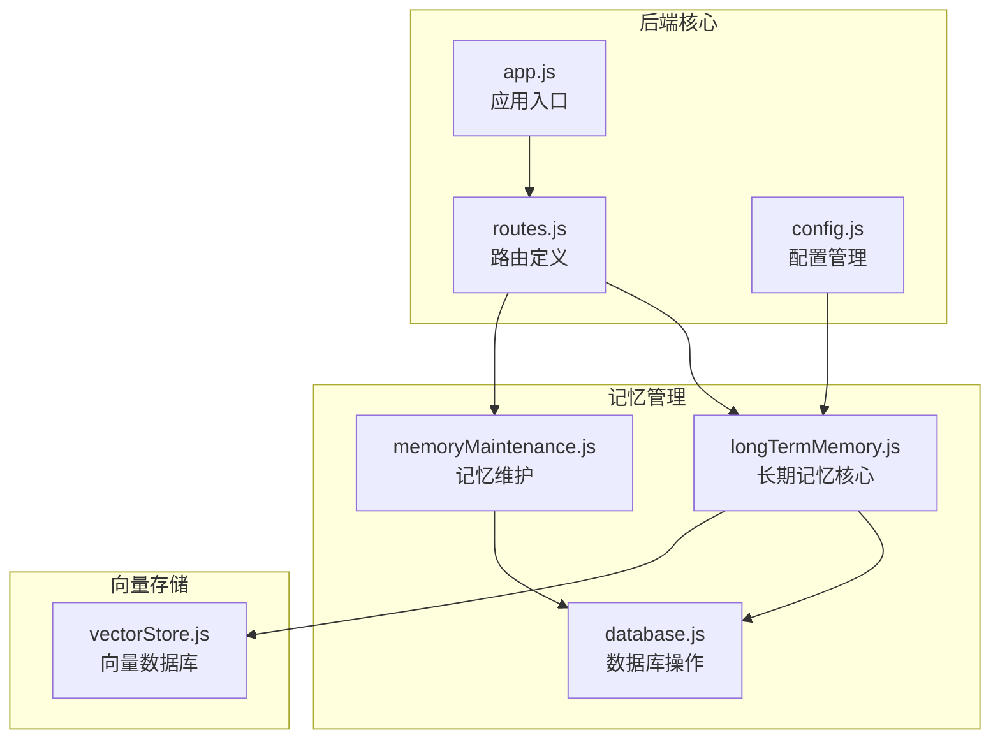
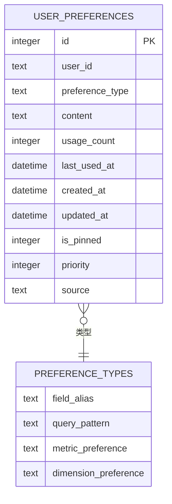
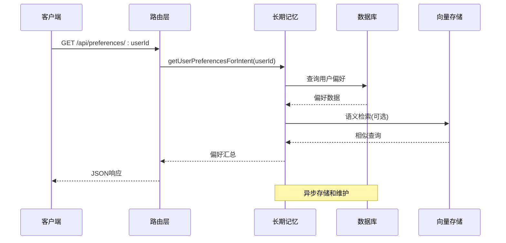
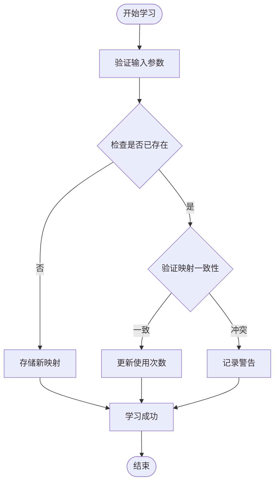
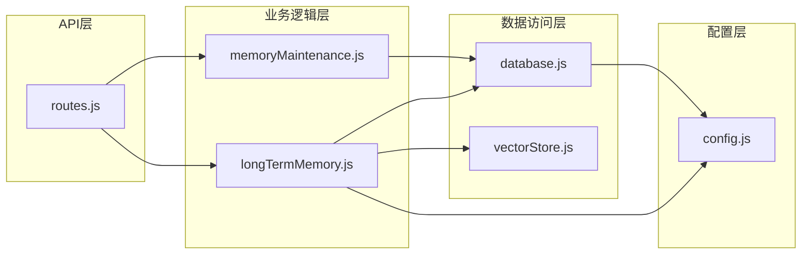
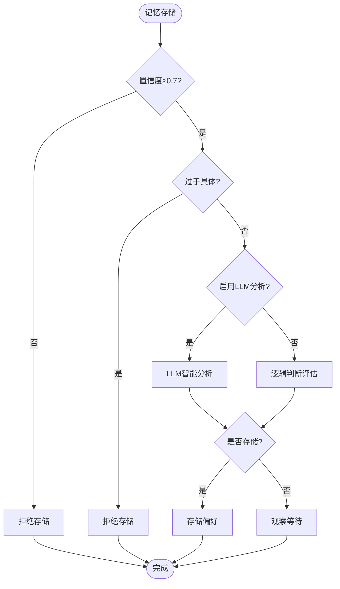

# 记忆偏好API

<cite>
**本文档引用的文件**
- [routes.js](file://backend/src/core/routes.js)
- [longTermMemory.js](file://backend/src/memory/longTermMemory.js)
- [memoryMaintenance.js](file://backend/src/memory/memoryMaintenance.js)
- [database.js](file://backend/src/core/database.js)
- [config.js](file://backend/src/core/config.js)
- [vectorStore.js](file://backend/src/memory/vectorStore.js)
- [app.js](file://backend/src/app.js)
</cite>

## 目录
1. [简介](#简介)
2. [项目结构](#项目结构)
3. [核心组件](#核心组件)
4. [架构概览](#架构概览)
5. [详细组件分析](#详细组件分析)
6. [依赖关系分析](#依赖关系分析)
7. [性能考虑](#性能考虑)
8. [故障排除指南](#故障排除指南)
9. [结论](#结论)

## 简介

记忆偏好API是NL2SQL系统中长期记忆管理的核心接口集合，负责用户查询偏好的存储、检索和维护。该API实现了智能偏好学习算法，能够从用户查询中自动提取个性化偏好，并提供多种查询模板和别名学习功能。

系统采用分层架构设计，包含三层记忆管理：
- **层1（短期记忆）**：会话上下文和临时数据
- **层2（长期记忆）**：用户偏好和常用模式
- **层3（向量记忆）**：语义检索和相似度匹配

## 项目结构

NL2SQL项目采用模块化架构，记忆偏好功能主要分布在以下模块中：



**图表来源**
- [app.js:1-260](file://backend/src/app.js#L1-L260)
- [routes.js:1-800](file://backend/src/core/routes.js#L1-L800)

**章节来源**
- [app.js:1-260](file://backend/src/app.js#L1-L260)
- [routes.js:1-800](file://backend/src/core/routes.js#L1-L800)

## 核心组件

### API路由定义

记忆偏好API包含以下核心接口：

| 接口 | 方法 | 描述 | 参数 |
|------|------|------|------|
| `/api/preferences/:userId` | GET | 获取用户偏好列表 | type(可选), limit(可选) |
| `/api/preferences/:userId/raw` | GET | 获取用户长期记忆原始数据 | type(可选) |
| `/api/preferences/:userId/stats` | GET | 获取用户记忆统计 | 无 |
| `/api/preferences/:userId/templates` | POST | 手动添加查询模板 | 模板对象 |
| `/api/preferences/:userId/learn-alias` | POST | 手动学习字段别名 | user_term, schema_field, field_type |
| `/api/preferences/:preferenceId` | DELETE | 删除用户偏好 | 无 |

### 数据存储结构

用户偏好数据存储在SQLite数据库的`user_preferences`表中，包含以下字段：



**图表来源**
- [database.js:140-163](file://backend/src/core/database.js#L140-L163)

**章节来源**
- [routes.js:453-716](file://backend/src/core/routes.js#L453-L716)
- [database.js:140-170](file://backend/src/core/database.js#L140-L170)

## 架构概览

记忆偏好系统采用事件驱动的异步处理架构：



**图表来源**
- [routes.js:553-592](file://backend/src/core/routes.js#L553-L592)
- [longTermMemory.js:963-1005](file://backend/src/memory/longTermMemory.js#L963-L1005)

## 详细组件分析

### GET /api/preferences/:userId - 用户偏好查询

该接口提供用户偏好的综合查询功能，支持按类型筛选：

#### 功能特性
- **类型筛选**：支持query_pattern、field_alias、metric_preference、dimension_preference四种类型
- **智能排序**：按使用频率和最近使用时间排序
- **实时检索**：从数据库中动态获取最新偏好数据

#### 请求参数
- `userId` (路径参数)：用户唯一标识
- `type` (查询参数)：偏好类型筛选（可选）
- `limit` (查询参数)：返回数量限制，默认50

#### 响应结构
```javascript
{
  "success": true,
  "user_id": "用户ID",
  "data": {
    "patterns": [],      // 查询模式数组
    "aliases": [],       // 字段别名数组
    "metrics": [],       // 指标偏好数组
    "dimensions": []     // 维度偏好数组
  }
}
```

**章节来源**
- [routes.js:546-592](file://backend/src/core/routes.js#L546-L592)
- [longTermMemory.js:963-1005](file://backend/src/memory/longTermMemory.js#L963-L1005)

### POST /api/preferences/:userId/templates - 查询模板保存

该接口允许用户手动保存查询模板，支持复杂的查询模式定义：

#### 模板结构
```javascript
{
  "name": "模板名称",
  "dimensions": ["维度1", "维度2"],
  "metrics": ["指标1"],
  "default_time_range": {
    "type": "relative",
    "value": "最近7天"
  },
  "filter_pattern": null,
  "is_manual": true
}
```

#### 验证规则
- **必填字段**：name字段不能为空
- **维度要求**：至少包含2个维度或1个指标
- **时间范围**：支持相对和绝对时间格式

#### 存储策略
- 手动模板具有最高优先级
- 模板名称用于去重判断
- 使用频率用于后续推荐

**章节来源**
- [routes.js:595-633](file://backend/src/core/routes.js#L595-L633)
- [longTermMemory.js:1068-1092](file://backend/src/memory/longTermMemory.js#L1068-L1092)

### DELETE /api/preferences/:preferenceId - 偏好删除

该接口提供用户偏好的删除功能：

#### 删除流程
1. 验证偏好记录存在性
2. 执行数据库删除操作
3. 返回删除结果状态

#### 返回响应
```javascript
{
  "success": true,
  "message": "偏好已删除"
}
```

**章节来源**
- [routes.js:635-664](file://backend/src/core/routes.js#L635-L664)
- [database.js:767-772](file://backend/src/core/database.js#L767-L772)

### POST /api/preferences/:userId/learn-alias - 手动别名学习

该接口支持用户手动学习字段别名映射关系：

#### 请求参数
- `user_term`：用户使用的术语
- `schema_field`：对应的Schema字段
- `field_type`：字段类型（metric|dimension|filter）

#### 学习算法
系统采用智能映射学习算法，支持多种映射格式：



**图表来源**
- [longTermMemory.js:758-812](file://backend/src/memory/longTermMemory.js#L758-L812)

**章节来源**
- [routes.js:666-716](file://backend/src/core/routes.js#L666-L716)
- [longTermMemory.js:758-812](file://backend/src/memory/longTermMemory.js#L758-L812)

## 依赖关系分析

### 组件耦合关系



**图表来源**
- [routes.js:1-800](file://backend/src/core/routes.js#L1-L800)
- [longTermMemory.js:1-1127](file://backend/src/memory/longTermMemory.js#L1-L1127)

### 数据流分析

记忆偏好系统遵循以下数据流模式：

1. **查询流程**：API请求 → 记忆检索 → 数据库查询 → 结果返回
2. **存储流程**：意图分析 → 偏好提取 → 数据库存储 → 异步维护
3. **维护流程**：定时任务 → 数据清理 → 统计报告

**章节来源**
- [routes.js:453-716](file://backend/src/core/routes.js#L453-L716)
- [longTermMemory.js:313-471](file://backend/src/memory/longTermMemory.js#L313-L471)

## 性能考虑

### 存储筛选策略

系统采用多层次的存储筛选机制：

| 筛选条件 | 阈值 | 说明 |
|----------|------|------|
| 最小置信度 | 0.7 | 查询必须达到一定置信度 |
| 高价值模板 | 维度≥2, 指标≥1 | 高频查询模式 |
| 频繁查询 | 7天内≥2次 | 简单查询的高频模式 |
| 过于具体 | 同时满足多个条件 | 一次性查询不存储 |

### 记忆保留策略



**图表来源**
- [longTermMemory.js:313-471](file://backend/src/memory/longTermMemory.js#L313-L471)

### 清理策略

系统采用分级清理策略：

| 使用频率 | 保留期限 | 清理条件 |
|----------|----------|----------|
| ≥10次 | 永久保留 | 不清理 |
| 3-9次 | 90天 | 90天未使用 |
| <3次 | 30天 | 30天未使用 |
| 字段别名 | 365天 | 365天未使用 |

**章节来源**
- [memoryMaintenance.js:24-46](file://backend/src/memory/memoryMaintenance.js#L24-L46)
- [longTermMemory.js:253-297](file://backend/src/memory/longTermMemory.js#L253-L297)

## 故障排除指南

### 常见问题诊断

#### API响应错误
- **400错误**：请求参数验证失败
- **500错误**：服务器内部错误
- **404错误**：资源不存在

#### 数据库连接问题
- 检查SQLite数据库文件权限
- 验证数据库表结构完整性
- 确认索引创建状态

#### 记忆学习失败
- 验证用户输入格式
- 检查字段映射一致性
- 确认存储阈值设置

### 性能优化建议

1. **索引优化**：确保user_id和preference_type索引有效
2. **查询优化**：合理使用limit参数限制返回数量
3. **缓存策略**：利用内存缓存减少数据库查询
4. **批量操作**：支持批量偏好查询和更新

**章节来源**
- [routes.js:453-716](file://backend/src/core/routes.js#L453-L716)
- [database.js:370-433](file://backend/src/core/database.js#L370-L433)

## 结论

记忆偏好API为NL2SQL系统提供了强大的个性化记忆能力，通过智能的学习算法和灵活的存储策略，能够有效提升用户的查询体验。系统的设计充分考虑了性能、可扩展性和易维护性，为构建智能化的自然语言查询系统奠定了坚实基础。

未来可以进一步优化的方向包括：
- 增强LLM智能分析能力
- 扩展更多类型的偏好学习
- 优化向量检索算法
- 增加偏好推荐功能