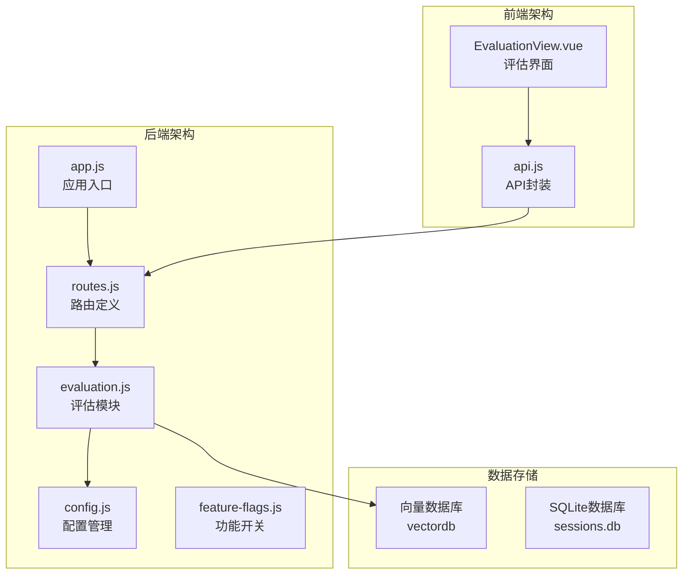
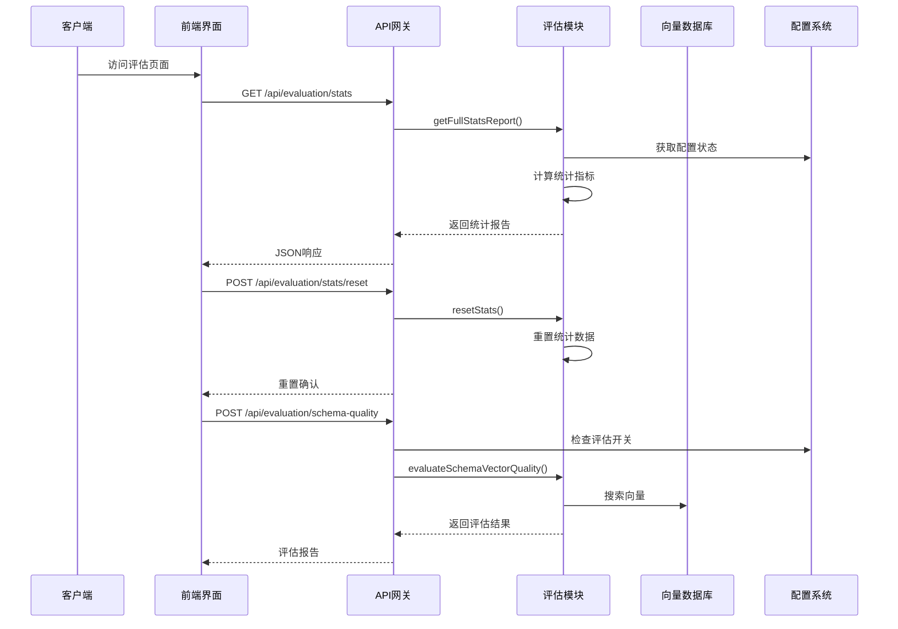
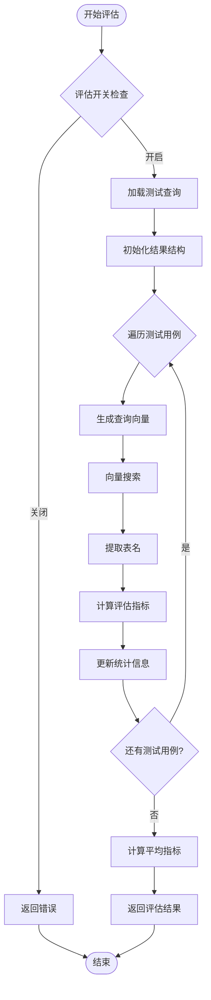
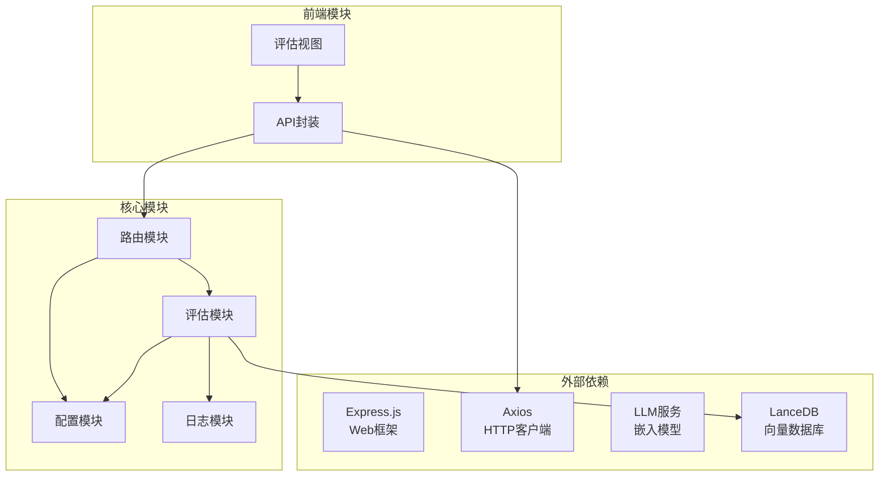

# 评估统计API

<cite>
**本文档引用的文件**
- [evaluation.js](file://backend/src/utils/evaluation.js)
- [routes.js](file://backend/src/core/routes.js)
- [config.js](file://backend/src/core/config.js)
- [feature-flags.js](file://backend/config/feature-flags.js)
- [app.js](file://backend/src/app.js)
- [EvaluationView.vue](file://frontend/src/views/EvaluationView.vue)
- [api.js](file://frontend/src/utils/api.js)
</cite>

## 目录
1. [简介](#简介)
2. [项目结构](#项目结构)
3. [核心组件](#核心组件)
4. [架构概览](#架构概览)
5. [详细组件分析](#详细组件分析)
6. [依赖关系分析](#依赖关系分析)
7. [性能考虑](#性能考虑)
8. [故障排除指南](#故障排除指南)
9. [结论](#结论)

## 简介

NL2SQL评估统计API是一套完整的向量化质量评估和运行时统计监控系统。该系统提供了三个核心API接口：

- **GET /api/evaluation/stats**：获取运行时统计报告，包括向量检索命中率和长期记忆命中率
- **POST /api/evaluation/stats/reset**：重置统计数据
- **POST /api/evaluation/schema-quality**：执行Schema向量化质量评估

该系统采用非侵入式设计，不影响主业务流程的正常运行，同时提供详细的评估指标和可视化界面。

## 项目结构

NL2SQL项目采用模块化架构，评估统计功能主要分布在以下模块中：



**图表来源**
- [app.js:1-260](file://backend/src/app.js#L1-L260)
- [routes.js:1-852](file://backend/src/core/routes.js#L1-L852)
- [evaluation.js:1-488](file://backend/src/utils/evaluation.js#L1-L488)

**章节来源**
- [app.js:1-260](file://backend/src/app.js#L1-L260)
- [routes.js:1-852](file://backend/src/core/routes.js#L1-L852)

## 核心组件

### 评估配置系统

评估系统通过环境变量和配置文件进行灵活控制：

| 配置项 | 环境变量 | 默认值 | 描述 |
|--------|----------|--------|------|
| 评估功能启用 | EVALUATION_ENABLED | false | 控制评估功能的整体开关 |
| 统计跟踪启用 | EVALUATION_TRACK_STATS | false | 控制运行时统计的记录 |
| 高相似度阈值 | - | 0.8 | 用于查询相似度评估 |
| 中相似度阈值 | - | 0.5 | 用于查询相似度评估 |
| 高质量阈值 | - | 0.8 | 用于Schema质量评估 |
| 中质量阈值 | - | 0.5 | 用于Schema质量评估 |

### 运行时统计系统

系统维护两套统计指标：

#### 向量检索统计
- **Schema检索**：搜索总数、命中数、命中率
- **查询历史检索**：搜索总数、命中数、命中率
- **距离分布**：极近(<0.3)、较近(0.3-0.5)、中等(0.5-0.7)、较远(>0.7)

#### 长期记忆统计
- **总体命中率**：总查询数、命中数、未命中数
- **按类型统计**：字段别名、查询模式、指标偏好、维度偏好

**章节来源**
- [evaluation.js:19-60](file://backend/src/utils/evaluation.js#L19-L60)
- [config.js:342-354](file://backend/src/core/config.js#L342-L354)

## 架构概览

评估统计API采用分层架构设计，确保功能的模块化和可维护性：



**图表来源**
- [routes.js:726-803](file://backend/src/core/routes.js#L726-L803)
- [evaluation.js:397-429](file://backend/src/utils/evaluation.js#L397-L429)

## 详细组件分析

### 运行时统计API (GET /api/evaluation/stats)

#### 接口规范
- **方法**：GET
- **路径**：/api/evaluation/stats
- **功能**：获取完整的运行时统计报告

#### 响应结构
```javascript
{
  "success": true,
  "data": {
    "vectorSearch": {
      "schema": {
        "searches": 0,
        "hits": 0,
        "hitRate": 0.0
      },
      "query": {
        "searches": 0,
        "hits": 0,
        "hitRate": 0.0
      },
      "distanceDistribution": {
        "veryClose": 0,
        "close": 0,
        "moderate": 0,
        "far": 0
      }
    },
    "longTermMemory": {
      "overall": {
        "hitRate": 0,
        "totalQueries": 0,
        "totalHits": 0,
        "totalMisses": 0
      },
      "byType": [
        {
          "type": "field_alias",
          "hitRate": 0,
          "hits": 0,
          "misses": 0
        }
      ]
    },
    "generatedAt": "2024-01-01T00:00:00Z",
    "config": {
      "enabled": false,
      "trackStats": false
    }
  }
}
```

#### 统计指标说明

**向量检索命中率**
- **Schema检索命中率**：衡量基于Schema向量的检索准确性
- **查询历史命中率**：衡量基于历史查询向量的检索准确性
- **距离分布**：反映向量相似度的质量分布

**长期记忆命中率**
- **总体命中率**：长期记忆功能的整体效果
- **按类型细分**：不同类型记忆的命中表现

**章节来源**
- [routes.js:726-740](file://backend/src/core/routes.js#L726-L740)
- [evaluation.js:397-407](file://backend/src/utils/evaluation.js#L397-L407)

### 统计数据重置API (POST /api/evaluation/stats/reset)

#### 接口规范
- **方法**：POST
- **路径**：/api/evaluation/stats/reset
- **功能**：重置所有统计数据

#### 请求响应
```javascript
// 成功响应
{
  "success": true,
  "message": "统计数据已重置"
}

// 失败响应
{
  "success": false,
  "error": "重置统计数据失败: 错误信息"
}
```

#### 重置范围
- 向量检索统计：重置Schema和查询历史的搜索计数
- 距离分布统计：重置所有距离区间的计数
- 长期记忆统计：重置总查询数、命中数和各类别的命中/未命中计数

**章节来源**
- [routes.js:746-760](file://backend/src/core/routes.js#L746-L760)
- [evaluation.js:412-429](file://backend/src/utils/evaluation.js#L412-L429)

### Schema向量化质量评估API (POST /api/evaluation/schema-quality)

#### 接口规范
- **方法**：POST
- **路径**：/api/evaluation/schema-quality
- **功能**：执行Schema向量化质量评估

#### 请求格式
```javascript
{
  "testQueries": [
    {
      "query": "查询语句",
      "expectedTables": ["表名1", "表名2"]
    }
  ]
}
```

#### 默认测试查询
系统内置了8个默认测试查询，覆盖常见的业务场景：
- 平台注册用户统计
- 付费金额统计  
- 用户活跃趋势
- 渠道登录用户数
- 游戏创角数据
- 平台首单统计
- 按渠道看DAU
- 按按钮点击分析

#### 评估指标

**整体指标**
- **准确率**：正确识别目标表的比例
- **平均精确率**：所有测试用例精确率的平均值
- **平均召回率**：所有测试用例召回率的平均值
- **平均F1分数**：所有测试用例F1分数的平均值

**分类统计**
- **高质量**：召回率≥0.8
- **中等质量**：召回率≥0.5且<0.8  
- **低质量**：召回率<0.5

#### 评估流程



**图表来源**
- [routes.js:771-803](file://backend/src/core/routes.js#L771-L803)
- [evaluation.js:158-266](file://backend/src/utils/evaluation.js#L158-L266)

**章节来源**
- [routes.js:762-803](file://backend/src/core/routes.js#L762-L803)
- [evaluation.js:439-459](file://backend/src/utils/evaluation.js#L439-L459)

### 查询相似度评估API (POST /api/evaluation/query-quality)

#### 接口规范
- **方法**：POST  
- **路径**：/api/evaluation/query-quality
- **功能**：评估查询历史的向量化相似度

#### 请求格式
```javascript
{
  "testPairs": [
    {
      "query1": "查询语句1",
      "query2": "查询语句2", 
      "expectedSimilarity": 0.9
    }
  ]
}
```

#### 默认测试对
系统内置了5个默认查询相似度测试对，涵盖不同相似度场景：
- 收入统计 vs 昨日营收数据 (高相似度: 0.9)
- 按渠道看DAU vs 各渠道日活跃用户 (高相似度: 0.85)
- 收入统计 vs 用户留存 (低相似度: 0.2)
- 最近7天流水 vs 过去一周营收 (高相似度: 0.9)
- 查询游戏数据 vs 查看游戏信息 (中相似度: 0.8)

#### 评估指标
- **平均误差**：实际相似度与期望相似度的平均差值
- **高相似度对数**：相似度>0.8的查询对数量
- **中相似度对数**：相似度在0.5-0.8之间的查询对数量
- **低相似度对数**：相似度<0.5的查询对数量

**章节来源**
- [routes.js:805-841](file://backend/src/core/routes.js#L805-L841)
- [evaluation.js:453-459](file://backend/src/utils/evaluation.js#L453-L459)

## 依赖关系分析

评估统计API的依赖关系体现了清晰的模块化设计：



**图表来源**
- [routes.js:16-29](file://backend/src/core/routes.js#L16-L29)
- [evaluation.js:12-13](file://backend/src/utils/evaluation.js#L12-L13)

### 关键依赖说明

**配置依赖**
- 评估功能完全依赖配置系统进行开关控制
- 配置项来自环境变量和配置文件
- 支持运行时动态调整

**数据依赖**
- 向量数据库用于Schema向量化质量评估
- SQLite数据库用于长期记忆统计
- LLM服务用于生成查询向量

**前端依赖**
- Element Plus提供UI组件
- Axios封装HTTP请求
- Vue 3提供响应式状态管理

**章节来源**
- [routes.js:28-29](file://backend/src/core/routes.js#L28-L29)
- [evaluation.js:12-13](file://backend/src/utils/evaluation.js#L12-L13)

## 性能考虑

### 评估功能的性能影响

评估系统采用非侵入式设计，尽量减少对主业务的影响：

**内存使用**
- 统计数据仅存储在内存中，重启后丢失
- 避免了额外的数据库写入操作
- 内存占用与统计维度数量成正比

**计算开销**
- 评估过程异步执行，不影响主线程
- 向量搜索使用批量处理优化
- 相似度计算采用高效的余弦相似度算法

**网络开销**
- 评估API为CPU密集型操作
- 避免了不必要的网络传输
- 响应时间主要取决于LLM服务和向量数据库性能

### 性能优化策略

**评估开关控制**
- 通过环境变量控制评估功能启用
- 生产环境默认禁用评估功能
- 避免对生产性能造成影响

**统计采样**
- 运行时统计可选择性启用
- 减少不必要的统计记录
- 降低内存和CPU开销

**缓存策略**
- 评估结果不进行缓存
- 避免过期数据影响评估准确性
- 确保评估结果的实时性

## 故障排除指南

### 常见问题及解决方案

**评估功能未启用**
- **症状**：调用评估API返回403错误
- **原因**：EVALUATION_ENABLED环境变量未设置为true
- **解决**：在.env文件中设置EVALUATION_ENABLED=true

**向量数据库连接失败**
- **症状**：Schema质量评估过程中出现数据库错误
- **原因**：向量数据库路径配置错误或数据库文件损坏
- **解决**：检查VECTOR_DB_PATH配置，重新初始化向量数据库

**LLM服务不可用**
- **症状**：评估过程中出现LLM API错误
- **原因**：LLM API密钥配置错误或网络连接问题
- **解决**：验证LLM_API_KEY和LLM_API_BASE配置

**内存不足**
- **症状**：系统出现内存警告或性能下降
- **原因**：运行时统计数据过多
- **解决**：定期重置统计数据，启用EVALUATION_TRACK_STATS=false

### 调试技巧

**启用详细日志**
- 设置LOG_LEVEL=debug获取详细调试信息
- 检查评估过程中的中间结果
- 监控向量搜索的详细信息

**性能监控**
- 使用GET /api/evaluation/stats监控系统状态
- 定期检查向量检索命中率
- 监控长期记忆使用情况

**错误处理**
- 评估API提供详细的错误信息
- 检查网络连接和API密钥配置
- 验证向量数据库的可用性

**章节来源**
- [routes.js:773-778](file://backend/src/core/routes.js#L773-L778)
- [evaluation.js:93-96](file://backend/src/utils/evaluation.js#L93-L96)

## 结论

NL2SQL评估统计API提供了一套完整、灵活且高性能的向量化质量评估解决方案。系统的主要优势包括：

**设计优势**
- 非侵入式设计，不影响主业务流程
- 模块化架构，易于维护和扩展
- 灵活的配置系统，支持动态开关控制

**功能完整性**
- 提供运行时统计监控
- 支持多种评估指标
- 包含可视化界面

**性能优化**
- 异步处理，避免阻塞主线程
- 内存优化，减少资源占用
- 可选择性启用，降低开销

**使用建议**
- 在开发和测试环境中启用评估功能
- 定期监控评估指标，及时发现问题
- 根据业务需求调整评估阈值
- 建立完善的评估数据存储和分析机制

该系统为NL2SQL项目的持续改进和质量保证提供了强有力的技术支撑，有助于提升系统的整体性能和用户体验。