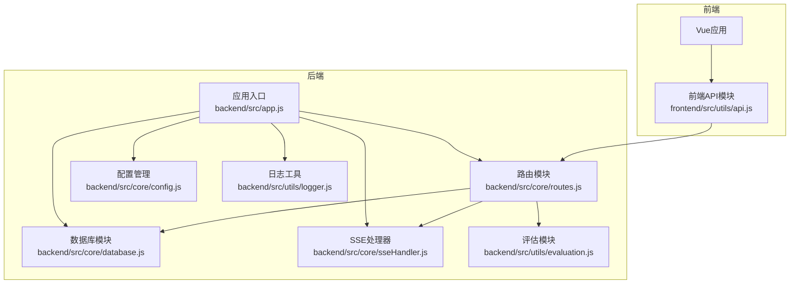
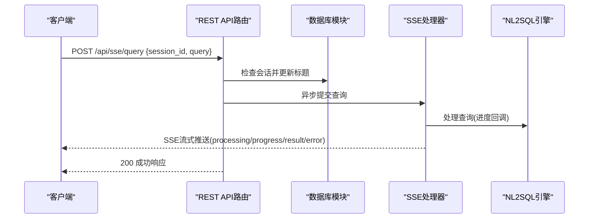
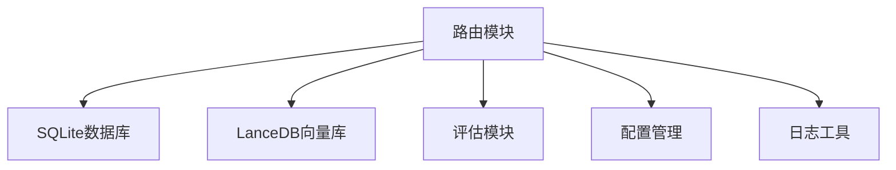

# API参考文档

<cite>
**本文档引用的文件**
- [backend/src/app.js](file://backend/src/app.js)
- [backend/src/core/routes.js](file://backend/src/core/routes.js)
- [backend/src/core/config.js](file://backend/src/core/config.js)
- [backend/src/core/sseHandler.js](file://backend/src/core/sseHandler.js)
- [backend/src/core/database.js](file://backend/src/core/database.js)
- [backend/src/utils/logger.js](file://backend/src/utils/logger.js)
- [backend/src/utils/evaluation.js](file://backend/src/utils/evaluation.js)
- [backend/config/business-semantic-layer.json](file://backend/config/business-semantic-layer.json)
- [backend/config/feature-flags.js](file://backend/config/feature-flags.js)
- [backend/package.json](file://backend/package.json)
- [frontend/src/utils/api.js](file://frontend/src/utils/api.js)
</cite>

## 目录
1. [简介](#简介)
2. [项目结构](#项目结构)
3. [核心组件](#核心组件)
4. [架构概览](#架构概览)
5. [详细组件分析](#详细组件分析)
6. [依赖分析](#依赖分析)
7. [性能考虑](#性能考虑)
8. [故障排除指南](#故障排除指南)
9. [结论](#结论)
10. [附录](#附录)

## 简介
本文件为NL2SQL服务的完整API参考文档。NL2SQL是一个基于自然语言生成SQL的查询服务，提供RESTful API接口、Server-Sent Events(SSE)流式响应、Schema元数据管理、会话与历史记录管理、长期记忆与偏好管理、以及运行时评估统计等功能。本文档详细说明所有API端点的HTTP方法、URL模式、请求参数、响应格式，并提供认证与授权机制、版本管理策略、客户端集成指南与最佳实践。

## 项目结构
NL2SQL采用前后端分离架构，后端基于Node.js + Express提供REST API与SSE服务，前端Vue应用通过Axios封装的API模块与后端交互。核心模块包括路由、配置、数据库、SSE处理器、日志与评估工具等。

**图表来源**
- [backend/src/app.js:1-266](file://backend/src/app.js#L1-L266)
- [backend/src/core/routes.js:1-1037](file://backend/src/core/routes.js#L1-L1037)

**章节来源**
- [backend/src/app.js:1-266](file://backend/src/app.js#L1-L266)
- [backend/src/core/routes.js:1-1037](file://backend/src/core/routes.js#L1-L1037)

## 核心组件
- 应用入口与中间件：负责加载环境变量、初始化数据库与向量库、挂载路由、启动HTTP服务器与SSE服务。
- 路由模块：定义全部REST API端点，包含健康检查、Schema查询、会话管理、查询历史、偏好与记忆、评估统计、配置与SSE接口。
- 配置管理：集中管理LLM API、数据库、安全策略、会话、日志、自修复、Schema、长期记忆、上下文管理与评估等配置。
- SSE处理器：管理SSE连接、消息广播、进度回调与连接统计。
- 数据库模块：SQLite数据库表结构定义与CRUD操作。
- 日志工具：统一日志记录，支持文件轮转与结构化输出。
- 评估模块：向量化质量评估与运行时统计记录。

**章节来源**
- [backend/src/app.js:1-266](file://backend/src/app.js#L1-L266)
- [backend/src/core/config.js:1-398](file://backend/src/core/config.js#L1-L398)
- [backend/src/core/sseHandler.js:1-349](file://backend/src/core/sseHandler.js#L1-L349)
- [backend/src/core/database.js:1-200](file://backend/src/core/database.js#L1-L200)
- [backend/src/utils/logger.js:1-482](file://backend/src/utils/logger.js#L1-L482)
- [backend/src/utils/evaluation.js:1-200](file://backend/src/utils/evaluation.js#L1-L200)

## 架构概览
NL2SQL后端通过Express提供REST API，所有接口均挂载在 `/api` 前缀下。SSE端点位于 `/api/sse/stream` 和 `/api/sse/query`，用于流式返回查询处理过程与结果。路由模块根据配置与功能开关动态启用不同能力，如业务语义层、动态意图拆解、澄清机制、Agentic工作流等。

**图表来源**
- [backend/src/core/routes.js:961-1002](file://backend/src/core/routes.js#L961-L1002)
- [backend/src/core/sseHandler.js:218-280](file://backend/src/core/sseHandler.js#L218-L280)

**章节来源**
- [backend/src/core/routes.js:944-1002](file://backend/src/core/routes.js#L944-L1002)
- [backend/src/core/sseHandler.js:1-349](file://backend/src/core/sseHandler.js#L1-L349)

## 详细组件分析

### 健康检查接口
- GET /api/health
  - 功能：服务健康状态检查，返回状态、版本、运行时间与内存使用。
  - 响应：包含状态、时间戳、版本、运行时长与内存使用信息。
  - 示例响应：见[响应示例](#响应示例)
- GET /api/health/detail
  - 功能：详细健康检查，包含数据库、LLM、Schema、SSE连接等组件状态。
  - 响应：包含各组件状态与连接数等信息。
  - 示例响应：见[响应示例](#响应示例)

**章节来源**
- [backend/src/core/routes.js:57-137](file://backend/src/core/routes.js#L57-L137)

### Schema接口
- GET /api/schema
  - 功能：获取完整Schema信息，支持按类型筛选（tables/metrics/dimensions）。
  - 查询参数：type（可选）
  - 响应：根据type返回相应数据或完整Schema。
- GET /api/schema/tables/:tableName
  - 功能：获取指定表的详细信息及关联表。
  - 路径参数：tableName
  - 响应：包含表定义与关联表列表。
- GET /api/schema/search
  - 功能：搜索Schema，支持关键词与结果数量限制。
  - 查询参数：q（必填）、limit（默认5）
  - 响应：包含查询词、结果数量与表列表。

**章节来源**
- [backend/src/core/routes.js:139-250](file://backend/src/core/routes.js#L139-L250)

### 会话管理接口
- POST /api/sessions
  - 功能：创建新会话。
  - 请求体：user_id（可选）、title（可选）
  - 响应：创建的会话信息（包含会话ID、用户ID、标题等）。
- GET /api/sessions/:sessionId
  - 功能：获取会话信息。
  - 路径参数：sessionId
  - 响应：会话详情。
- DELETE /api/sessions/:sessionId
  - 功能：删除会话。
  - 路径参数：sessionId
  - 响应：删除成功状态。
- GET /api/sessions/:sessionId/messages
  - 功能：获取会话消息历史。
  - 路径参数：sessionId
  - 查询参数：limit（默认50）
  - 响应：会话ID、消息数量与消息列表。
- GET /api/users/:userId/sessions
  - 功能：获取用户的所有会话。
  - 路径参数：userId
  - 查询参数：limit（默认20）
  - 响应：用户ID、会话数量与会话列表。

**章节来源**
- [backend/src/core/routes.js:252-398](file://backend/src/core/routes.js#L252-L398)
- [backend/src/core/database.js:39-195](file://backend/src/core/database.js#L39-L195)

### 查询历史接口
- GET /api/queries/history
  - 功能：获取查询历史。
  - 查询参数：user_id（可选）、session_id（可选）、limit（默认20）
  - 响应：历史数量与历史列表。

**章节来源**
- [backend/src/core/routes.js:400-450](file://backend/src/core/routes.js#L400-L450)

### 用户偏好与长期记忆接口
- GET /api/preferences/:userId/raw
  - 功能：获取用户长期记忆原始数据（调试用途）。
  - 路径参数：userId
  - 查询参数：type（可选）
  - 响应：原始数据与按类型分组的结果。
- GET /api/preferences/:userId/stats
  - 功能：获取用户记忆统计。
  - 路径参数：userId
  - 响应：用户ID与统计信息。
- GET /api/preferences/:userId
  - 功能：获取用户偏好列表。
  - 路径参数：userId
  - 查询参数：type（可选，支持query_pattern/field_alias/metric_preference/dimension_preference）、limit（默认50）
  - 响应：成功标志、用户ID与偏好数据。
- POST /api/preferences/:userId/templates
  - 功能：手动添加查询模板。
  - 路径参数：userId
  - 请求体：name（必填）、dimensions（可选）、metrics（可选）、default_time_range（可选）
  - 响应：保存结果与数据。
- DELETE /api/preferences/:preferenceId
  - 功能：删除用户偏好。
  - 路径参数：preferenceId
  - 响应：删除结果。
- POST /api/preferences/:userId/learn-alias
  - 功能：手动学习字段别名。
  - 路径参数：userId
  - 请求体：user_term（必填）、schema_field（必填）、field_type（默认metric）
  - 响应：学习结果与数据。

**章节来源**
- [backend/src/core/routes.js:452-716](file://backend/src/core/routes.js#L452-L716)

### 评估接口
- GET /api/evaluation/stats
  - 功能：获取运行时统计报告（向量检索命中率、记忆命中率等）。
  - 响应：成功标志与统计数据。
- POST /api/evaluation/stats/reset
  - 功能：重置统计数据。
  - 响应：重置结果。
- GET /api/evaluation/config
  - 功能：获取评估配置。
  - 响应：评估功能开关、统计跟踪与阈值。
- POST /api/evaluation/schema-quality
  - 功能：执行Schema向量化质量评估。
  - 请求体：testQueries（可选，测试查询列表）
  - 响应：评估结果。
- POST /api/evaluation/query-quality
  - 功能：执行查询历史向量化质量评估。
  - 请求体：testPairs（可选，测试查询对）
  - 响应：评估结果。

**章节来源**
- [backend/src/core/routes.js:718-856](file://backend/src/core/routes.js#L718-L856)
- [backend/src/utils/evaluation.js:1-200](file://backend/src/utils/evaluation.js#L1-L200)

### 统计信息接口
- GET /api/stats
  - 功能：获取服务统计信息（今日查询统计、连接数、Schema统计、系统信息等）。
  - 响应：统计信息对象。

**章节来源**
- [backend/src/core/routes.js:858-913](file://backend/src/core/routes.js#L858-L913)

### 配置接口
- GET /api/config
  - 功能：获取公开配置信息（不含敏感信息如API密钥）。
  - 响应：版本、LLM模型与API基础地址、安全限制、功能开关等。

**章节来源**
- [backend/src/core/routes.js:915-942](file://backend/src/core/routes.js#L915-L942)

### SSE接口
- GET /api/sse/stream
  - 功能：建立Server-Sent Events连接。
  - 查询参数：session_id（必填）、user_id（可选，默认anonymous）
  - 响应：SSE流，消息类型包括connected、processing、progress、result、error。
- POST /api/sse/query
  - 功能：提交查询请求，结果通过SSE推送。
  - 请求体：session_id（必填）、query（必填）
  - 响应：提交成功提示。

**章节来源**
- [backend/src/core/routes.js:944-1002](file://backend/src/core/routes.js#L944-L1002)
- [backend/src/core/sseHandler.js:1-349](file://backend/src/core/sseHandler.js#L1-L349)

### 错误处理
- 404未找到：返回接口不存在信息与请求路径。
- 全局错误处理：捕获未处理错误，返回服务器内部错误（开发环境显示详细信息，生产环境简化）。

**章节来源**
- [backend/src/core/routes.js:1004-1030](file://backend/src/core/routes.js#L1004-L1030)

## 依赖分析
- Express中间件：CORS、body-parser用于跨域与请求体解析。
- 数据库：SQLite用于会话、消息、查询历史、用户偏好与系统日志存储。
- 向量数据库：LanceDB用于Schema与查询历史的向量化存储。
- 配置管理：集中管理LLM API、数据库、安全策略、功能开关等。
- 日志：统一日志记录与文件轮转。
- 评估：非侵入式评估统计与质量评估接口。

**图表来源**
- [backend/src/core/routes.js:1-1037](file://backend/src/core/routes.js#L1-L1037)
- [backend/src/core/config.js:1-398](file://backend/src/core/config.js#L1-L398)

**章节来源**
- [backend/src/core/routes.js:1-1037](file://backend/src/core/routes.js#L1-L1037)
- [backend/src/core/config.js:1-398](file://backend/src/core/config.js#L1-L398)

## 性能考虑
- 连接与超时：配置中包含查询超时、最大行数限制、禁止的关键字列表，防止大查询导致性能问题。
- 日志级别：支持按环境切换日志级别，生产环境建议降低日志量以提升性能。
- SSE连接：支持多标签页连接与连接清理，避免资源泄漏。
- 功能开关：通过功能开关控制新功能的启用，便于渐进式优化与回滚。

**章节来源**
- [backend/src/core/config.js:132-170](file://backend/src/core/config.js#L132-L170)
- [backend/src/core/sseHandler.js:1-349](file://backend/src/core/sseHandler.js#L1-L349)
- [backend/config/feature-flags.js:1-249](file://backend/config/feature-flags.js#L1-L249)

## 故障排除指南
- 健康检查：通过 /api/health 与 /api/health/detail 快速定位数据库、LLM、Schema与SSE连接状态。
- 日志：查看日志文件与控制台输出，定位错误堆栈与异常信息。
- 数据库：确认SQLite数据库初始化成功，表结构与索引创建完成。
- SSE：检查会话是否存在、连接参数是否正确、SSE连接是否被Nginx等代理缓冲。
- 评估：确认评估功能开关已启用，且评估阈值与统计跟踪配置正确。

**章节来源**
- [backend/src/core/routes.js:57-137](file://backend/src/core/routes.js#L57-L137)
- [backend/src/utils/logger.js:1-482](file://backend/src/utils/logger.js#L1-L482)
- [backend/src/core/database.js:39-195](file://backend/src/core/database.js#L39-L195)
- [backend/src/core/sseHandler.js:1-349](file://backend/src/core/sseHandler.js#L1-L349)
- [backend/src/utils/evaluation.js:1-200](file://backend/src/utils/evaluation.js#L1-L200)

## 结论
NL2SQL提供了完善的REST API与SSE流式响应能力，结合Schema管理、会话与历史记录、长期记忆与偏好、评估统计与配置接口，形成一套完整的自然语言到SQL的查询服务。通过集中配置与功能开关，系统具备良好的可扩展性与可控性。建议在生产环境中合理配置安全策略、日志级别与评估功能，并通过健康检查与SSE监控保障服务稳定性。

## 附录

### 认证与授权机制
- 访问控制：当前路由未实现强制认证，建议在网关或反向代理层添加鉴权策略。
- 授权策略：通过白名单限制可访问的表，防止越权查询。
- 安全策略：禁止执行DDL/DDL等高危SQL关键字，限制单次查询返回行数与超时时间，敏感字段脱敏。

**章节来源**
- [backend/src/core/config.js:132-170](file://backend/src/core/config.js#L132-L170)

### 版本管理与兼容性
- API版本：当前API未显式版本化，建议在URL中加入版本前缀（如 /api/v1）以便未来演进。
- 向后兼容：通过功能开关与配置项控制新功能，避免破坏现有行为。
- 废弃策略：建议在变更前提供迁移指南与过渡期，逐步淘汰旧接口。

**章节来源**
- [backend/src/core/routes.js:1-1037](file://backend/src/core/routes.js#L1-L1037)
- [backend/config/feature-flags.js:1-249](file://backend/config/feature-flags.js#L1-L249)

### 客户端集成指南
- 基础URL：前端API模块使用 /api 前缀，确保后端路由正确挂载。
- 请求拦截：可在请求拦截器中添加认证令牌（如Bearer Token）。
- 响应处理：统一处理错误响应，区分网络错误与服务器错误。
- SSE集成：通过 /api/sse/stream 建立连接，监听processing/progress/result/error事件。

**章节来源**
- [frontend/src/utils/api.js:1-303](file://frontend/src/utils/api.js#L1-L303)
- [backend/src/core/routes.js:944-1002](file://backend/src/core/routes.js#L944-L1002)

### SDK使用示例与最佳实践
- SDK封装：前端已提供API模块，建议在业务层进一步封装常用操作（如创建会话、提交查询、获取历史）。
- 最佳实践：
  - 使用功能开关控制新功能的启用与回滚。
  - 合理设置查询超时与返回行数限制。
  - 通过健康检查与SSE监控保障用户体验。
  - 在生产环境启用严格的白名单与安全策略。

**章节来源**
- [frontend/src/utils/api.js:1-303](file://frontend/src/utils/api.js#L1-L303)
- [backend/config/feature-flags.js:1-249](file://backend/config/feature-flags.js#L1-L249)
- [backend/src/core/config.js:132-170](file://backend/src/core/config.js#L132-L170)

### 响应示例
以下为部分典型接口的成功与错误响应示例（仅展示结构与字段，不包含具体数据）：

- 健康检查（GET /api/health）
  - 成功响应：包含状态、时间戳、版本、运行时长与内存使用信息。
  - 错误响应：无（健康检查通常不会失败）

- 详细健康检查（GET /api/health/detail）
  - 成功响应：包含组件状态与连接数等信息。
  - 错误响应：503状态与错误详情

- Schema查询（GET /api/schema）
  - 成功响应：根据type返回tables/metrics/dimensions或完整Schema
  - 错误响应：无（查询参数缺失时返回400）

- 会话管理（POST /api/sessions）
  - 成功响应：包含会话ID、用户ID、标题等
  - 错误响应：500状态与错误信息

- SSE查询（POST /api/sse/query）
  - 成功响应：包含成功标志与提示信息
  - 错误响应：400（缺少参数）或500（内部错误）

**章节来源**
- [backend/src/core/routes.js:57-137](file://backend/src/core/routes.js#L57-L137)
- [backend/src/core/routes.js:139-250](file://backend/src/core/routes.js#L139-L250)
- [backend/src/core/routes.js:252-398](file://backend/src/core/routes.js#L252-L398)
- [backend/src/core/routes.js:961-1002](file://backend/src/core/routes.js#L961-L1002)