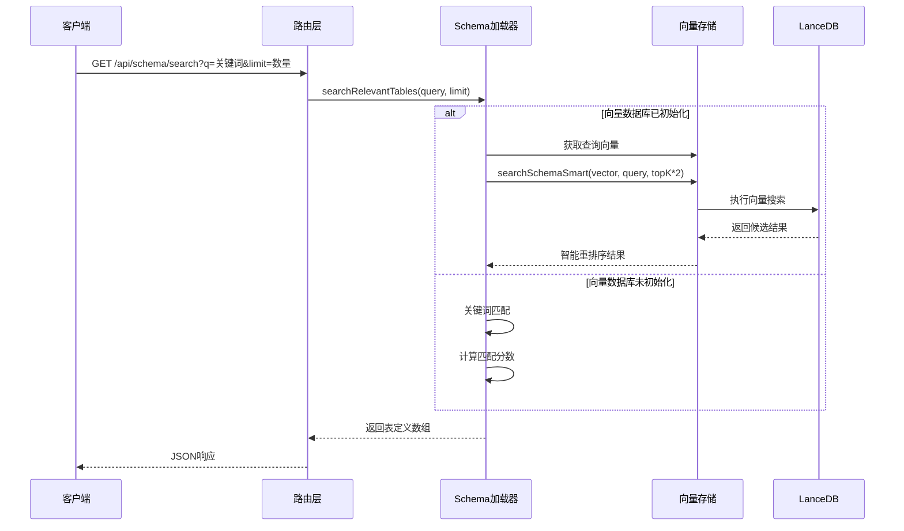
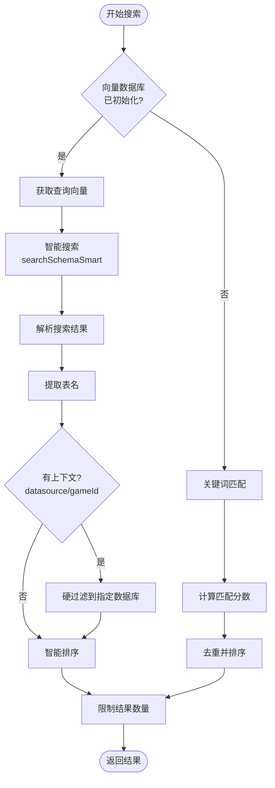
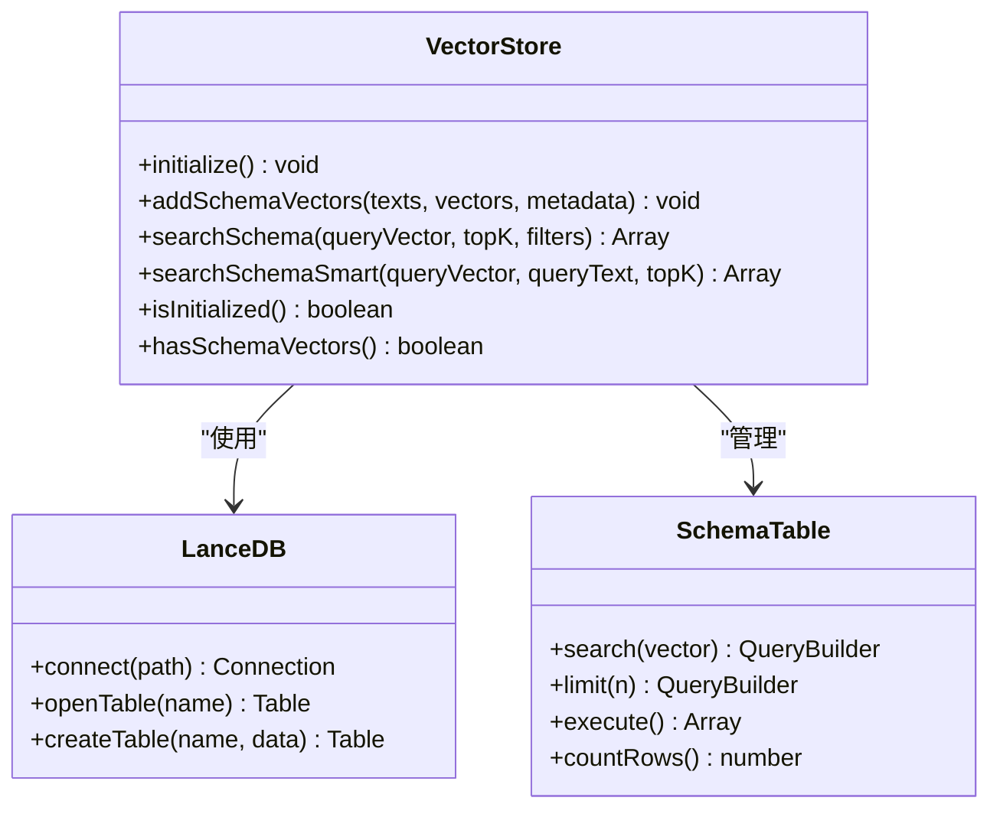
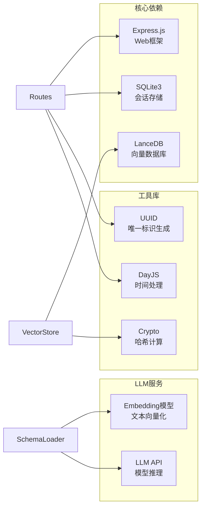
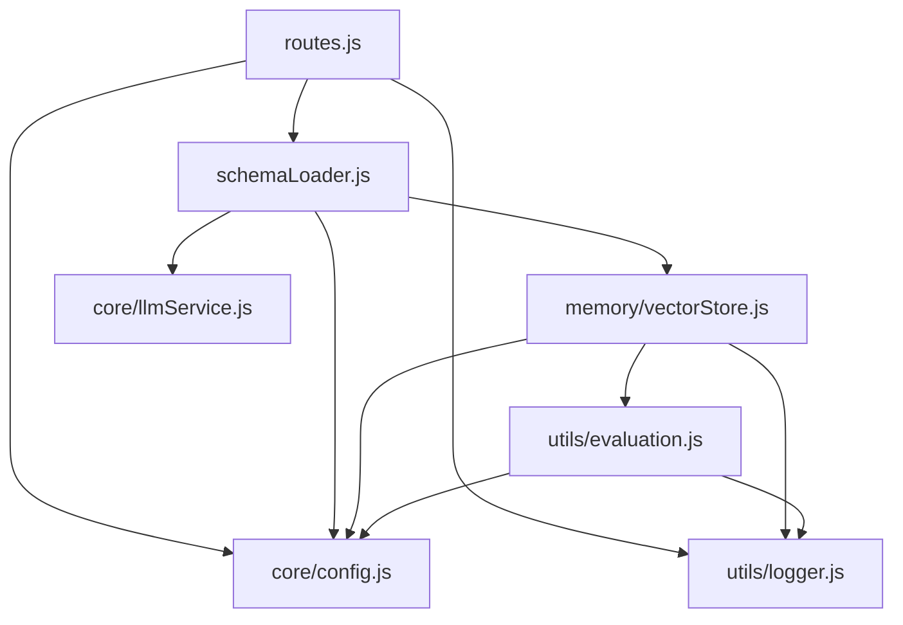

# Schema搜索端点

<cite>
**本文档引用的文件**
- [routes.js](file://backend/src/core/routes.js)
- [schemaLoader.js](file://backend/src/core/schemaLoader.js)
- [vectorStore.js](file://backend/src/memory/vectorStore.js)
- [config.js](file://backend/src/core/config.js)
- [evaluation.js](file://backend/src/utils/evaluation.js)
- [schema-metadata.json](file://backend/config/schema-metadata.json)
- [package.json](file://backend/package.json)
</cite>

## 目录
1. [简介](#简介)
2. [项目结构](#项目结构)
3. [核心组件](#核心组件)
4. [架构概览](#架构概览)
5. [详细组件分析](#详细组件分析)
6. [依赖分析](#依赖分析)
7. [性能考虑](#性能考虑)
8. [故障排除指南](#故障排除指南)
9. [结论](#结论)
10. [附录](#附录)

## 简介

Schema搜索端点是NL2SQL系统中的核心功能之一，负责根据用户输入的自然语言查询，智能搜索和推荐相关的数据库表结构。该功能结合了关键词匹配、语义向量检索和智能排序算法，为用户提供准确的Schema发现体验。

本文档详细说明了GET /api/schema/search端点的实现原理，包括搜索算法、关键词匹配机制、结果排序逻辑、性能优化策略以及向量数据库的集成方式。

## 项目结构

NL2SQL系统的Schema搜索功能主要分布在以下模块中：

```mermaid
graph TB
subgraph "API层"
Routes[routes.js<br/>REST路由定义]
end
subgraph "核心业务层"
SchemaLoader[schemaLoader.js<br/>Schema加载与搜索]
Config[config.js<br/>配置管理]
end
subgraph "向量存储层"
VectorStore[vectorStore.js<br/>向量数据库操作]
Eval[evaluation.js<br/>评估统计]
end
subgraph "数据层"
SchemaMeta[schema-metadata.json<br/>Schema元数据]
VectorDB[(LanceDB)<br/>向量数据库]
end
Routes --> SchemaLoader
SchemaLoader --> VectorStore
SchemaLoader --> Config
VectorStore --> VectorDB
SchemaLoader --> SchemaMeta
Eval --> VectorStore
```

**图表来源**
- [routes.js:217-250](file://backend/src/core/routes.js#L217-L250)
- [schemaLoader.js:571-653](file://backend/src/core/schemaLoader.js#L571-L653)
- [vectorStore.js:380-437](file://backend/src/memory/vectorStore.js#L380-L437)

**章节来源**
- [routes.js:1-1037](file://backend/src/core/routes.js#L1-L1037)
- [schemaLoader.js:1-1235](file://backend/src/core/schemaLoader.js#L1-L1235)
- [vectorStore.js:1-948](file://backend/src/memory/vectorStore.js#L1-L948)

## 核心组件

### REST路由定义

路由模块定义了Schema相关的API端点，其中最重要的就是Schema搜索端点：

- **端点**: `GET /api/schema/search`
- **参数**: 
  - `q`: 必需，搜索关键词
  - `limit`: 可选，默认5，结果数量限制
- **响应**: 返回匹配的表定义数组

### Schema加载器

Schema加载器负责：
- 加载和解析Schema元数据配置
- 实现关键词匹配和语义搜索算法
- 管理向量数据库的集成
- 提供智能搜索和排序功能

### 向量存储模块

向量存储模块基于LanceDB实现：
- 存储表级向量表示
- 提供语义相似度搜索
- 实现智能重排序算法
- 支持查询历史向量存储

**章节来源**
- [routes.js:217-250](file://backend/src/core/routes.js#L217-L250)
- [schemaLoader.js:571-653](file://backend/src/core/schemaLoader.js#L571-L653)
- [vectorStore.js:380-576](file://backend/src/memory/vectorStore.js#L380-L576)

## 架构概览

Schema搜索功能的整体架构采用分层设计，实现了搜索算法的可扩展性和性能优化：



**图表来源**
- [routes.js:225-250](file://backend/src/core/routes.js#L225-L250)
- [schemaLoader.js:595-653](file://backend/src/core/schemaLoader.js#L595-L653)
- [vectorStore.js:452-576](file://backend/src/memory/vectorStore.js#L452-L576)

## 详细组件分析

### 搜索算法实现

#### 1. 搜索流程控制

搜索算法采用"向量搜索优先，关键词匹配回退"的设计：



**图表来源**
- [schemaLoader.js:595-653](file://backend/src/core/schemaLoader.js#L595-L653)

#### 2. 智能搜索算法

智能搜索算法包含多个重排序策略：

**策略1：游戏提及优先级**
- 检测查询中是否包含具体游戏名称
- 如果提及游戏，对应游戏表优先级最高
- 使用动态游戏名索引和硬编码关键词双重检测

**策略2：平台类型分层权重**
- 未提及具体游戏时，按平台类型分配权重
- 平台核心表：+80分
- 平台其他表：+50分  
- 报表表：+40分
- 新平台库：+20分
- 老平台库：+10分
- 未指定游戏的游戏表：-30分（降权）

**策略3：数据源类型权重**
- 原始日志表：+30分
- 聚合报表表：-20分（降权）

**策略4：语义相似度归一化**
- 向量距离越小，得分越高
- 距离归一化到0-20分范围

**章节来源**
- [schemaLoader.js:595-653](file://backend/src/core/schemaLoader.js#L595-L653)
- [vectorStore.js:452-576](file://backend/src/memory/vectorStore.js#L452-L576)

#### 3. 关键词匹配算法

当向量数据库不可用时，系统回退到关键词匹配：

**匹配策略**：
- 将查询文本和表信息转换为小写
- 提取关键词并计算匹配分数
- 表名完全匹配给予额外分数
- 支持中文表名和字段名

**排序逻辑**：
- 按匹配分数降序排列
- 去重处理，避免重复表
- 限制返回数量

**章节来源**
- [schemaLoader.js:662-710](file://backend/src/core/schemaLoader.js#L662-L710)

### 结果排序机制

#### 1. 优先级评分系统

智能搜索使用综合评分系统：

```
优先级分数 = 游戏提及权重 + 平台类型权重 + 数据源权重 + 语义相似度权重
```

**评分权重分配**：
- 游戏提及：最高可达+100分
- 平台类型：+10到+80分
- 数据源类型：±30分
- 语义相似度：0-20分

#### 2. 上下文感知过滤

系统支持多种上下文参数：

**datasource上下文**：
- 仅返回指定数据库前缀的表
- 保留核心平台表（tzpingtai_*、dwd_*）跨库通用性

**gameId上下文**：
- 根据游戏ID推断平台类型
- 旧平台：new_tzpingtaiold表优先
- 新平台：new_tzpingtai表优先

**章节来源**
- [schemaLoader.js:612-644](file://backend/src/core/schemaLoader.js#L612-L644)
- [vectorStore.js:508-554](file://backend/src/memory/vectorStore.js#L508-L554)

### 向量检索集成

#### 1. 向量数据库架构

系统使用LanceDB作为向量存储后端：



**图表来源**
- [vectorStore.js:233-324](file://backend/src/memory/vectorStore.js#L233-L324)
- [vectorStore.js:380-437](file://backend/src/memory/vectorStore.js#L380-L437)

#### 2. 表级向量表示

系统采用"表级向量"而非"字段级向量"的设计：

**表级表征文本构建**：
- 域标签：[域:platform]、[域:game_xxx]、[域:report]
- 表名和中文名
- 数据类型：原始日志、聚合报表、维度表
- 核心业务功能描述
- 强动作特征词（注册、登录、付费、活跃等）

**元数据标签**：
- type: table
- name: 表名
- name_cn: 中文名
- scope: 域标签
- data_type: 数据类型
- key_features: 特征词列表

**章节来源**
- [schemaLoader.js:209-285](file://backend/src/core/schemaLoader.js#L209-L285)
- [schemaLoader.js:299-340](file://backend/src/core/schemaLoader.js#L299-L340)

#### 3. 智能搜索实现

智能搜索方法包含完整的重排序流程：

**步骤1：意图识别**
- 检测查询中是否提及具体游戏
- 使用动态游戏名索引和硬编码关键词

**步骤2：向量搜索**
- 获取更多候选结果（topK*3）
- 执行语义相似度搜索

**步骤3：重排序**
- 计算综合优先级分数
- 按分数降序排列

**步骤4：结果限制**
- 限制最终返回数量
- 记录评估统计

**章节来源**
- [vectorStore.js:452-576](file://backend/src/memory/vectorStore.js#L452-L576)

### 搜索参数配置

#### 1. 查询参数

| 参数 | 类型 | 必需 | 默认值 | 描述 |
|------|------|------|--------|------|
| q | string | 是 | - | 搜索关键词 |
| limit | number | 否 | 5 | 返回结果数量限制 |

#### 2. 环境变量配置

系统支持多种环境变量配置：

**向量数据库配置**：
- `VECTOR_DB_PATH`: 向量数据库存储路径，默认`./data/vectordb`
- `EMBEDDING_MODEL`: Embedding模型名称，默认`text-embedding-3-small`
- `EMBEDDING_DIMENSION`: 向量维度，默认1536

**Schema配置**：
- `SCHEMA_CONFIG_PATH`: Schema配置文件路径
- `SCHEMA_REVECTORIZE`: 是否强制重新向量化

**评估配置**：
- `EVALUATION_ENABLED`: 是否启用评估功能
- `EVALUATION_TRACK_STATS`: 是否记录运行时统计

**章节来源**
- [routes.js:225-250](file://backend/src/core/routes.js#L225-L250)
- [config.js:106-109](file://backend/src/core/config.js#L106-L109)
- [config.js:240-250](file://backend/src/core/config.js#L240-L250)

## 依赖分析

### 外部依赖

系统依赖以下关键外部组件：



**图表来源**
- [package.json:10-20](file://backend/package.json#L10-L20)

### 内部模块依赖



**图表来源**
- [routes.js:15-30](file://backend/src/core/routes.js#L15-L30)
- [schemaLoader.js:15-27](file://backend/src/core/schemaLoader.js#L15-L27)
- [vectorStore.js:14-23](file://backend/src/memory/vectorStore.js#L14-L23)

**章节来源**
- [package.json:10-20](file://backend/package.json#L10-L20)
- [routes.js:15-30](file://backend/src/core/routes.js#L15-L30)

## 性能考虑

### 1. 向量搜索优化

**预过滤策略**：
- 搜索更多候选结果（topK*2或*3）用于后续重排序
- 应用层过滤替代数据库层过滤，确保灵活性

**缓存机制**：
- Schema向量数据持久化存储
- 支持增量更新，避免全量重建
- 检测向量数据变更，自动重新向量化

**并发处理**：
- 异步向量生成和存储
- 并行处理多个表的向量化
- 非阻塞的搜索操作

### 2. 关键词匹配优化

**索引构建**：
- 构建表名和字段名的映射索引
- 支持中文表名和字段名
- 快速查找机制

**内存优化**：
- 有限的内存使用
- 及时释放中间结果
- 避免重复计算

### 3. 评估和监控

系统提供完整的性能监控：

**向量搜索统计**：
- 搜索次数和命中率
- 距离分布统计
- 性能指标跟踪

**运行时监控**：
- 搜索延迟测量
- 内存使用监控
- 错误率统计

**章节来源**
- [evaluation.js:37-60](file://backend/src/utils/evaluation.js#L37-L60)
- [evaluation.js:71-96](file://backend/src/utils/evaluation.js#L71-L96)

## 故障排除指南

### 常见问题诊断

#### 1. 向量数据库初始化失败

**症状**：
- 搜索结果为空
- 控制台出现初始化警告

**解决方案**：
- 检查向量数据库路径配置
- 验证LanceDB依赖安装
- 确认数据库文件权限

#### 2. 搜索结果不准确

**症状**：
- 相关表未被识别
- 排序不符合预期

**解决方案**：
- 检查Schema配置文件完整性
- 验证向量数据是否正确生成
- 调整关键词匹配权重

#### 3. 性能问题

**症状**：
- 搜索响应缓慢
- 内存使用过高

**解决方案**：
- 优化向量维度设置
- 调整搜索结果数量
- 检查硬件资源使用

### 调试工具

系统提供多种调试工具：

**评估接口**：
- `/api/evaluation/stats`: 获取运行时统计
- `/api/evaluation/schema-quality`: 执行Schema质量评估

**日志配置**：
- 支持多级别的日志输出
- 详细的搜索过程日志
- 错误堆栈跟踪

**章节来源**
- [routes.js:722-760](file://backend/src/core/routes.js#L722-L760)
- [evaluation.js:397-429](file://backend/src/utils/evaluation.js#L397-L429)

## 结论

Schema搜索端点通过结合关键词匹配和语义向量检索，为NL2SQL系统提供了强大的Schema发现能力。其设计特点包括：

1. **多层次搜索策略**：向量搜索优先，关键词匹配回退，确保在各种情况下都能提供准确结果
2. **智能排序算法**：基于游戏提及、平台类型、数据源类型和语义相似度的综合评分系统
3. **上下文感知**：支持datasource和gameId上下文，提供更精确的结果过滤
4. **性能优化**：预过滤、缓存机制和并发处理确保高效的搜索体验
5. **可扩展性**：模块化设计支持未来功能扩展和算法改进

该实现为自然语言到SQL的转换提供了坚实的基础，能够有效帮助用户快速定位相关的数据库表结构。

## 附录

### 搜索示例

#### 基础搜索
```
GET /api/schema/search?q=用户注册&limit=5
```

#### 高级搜索
```
GET /api/schema/search?q=青木游戏付费统计&limit=8
```

#### 带上下文搜索
```
GET /api/schema/search?q=渠道登录用户&datasource=new_tzpingtai&limit=5
```

### 高级搜索技巧

1. **使用具体关键词**：包含游戏名称、业务术语能提高准确性
2. **利用上下文**：指定datasource能精确过滤结果
3. **调整limit参数**：根据需求调整返回结果数量
4. **组合搜索**：同时使用多个关键词提高匹配精度

### 搜索结果解释

系统返回的搜索结果包含以下信息：
- **表名**: 数据库表的英文标识
- **中文名**: 表的中文描述
- **描述**: 表的业务含义说明
- **字段列表**: 表包含的字段及其描述
- **优先级分数**: 智能排序的综合评分