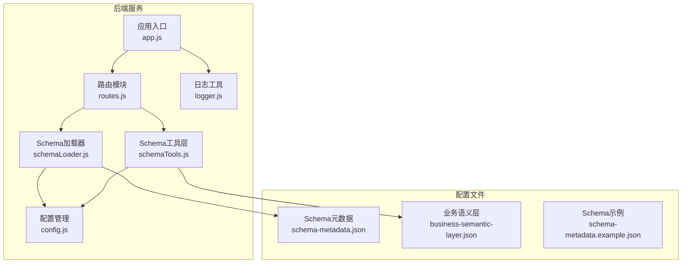
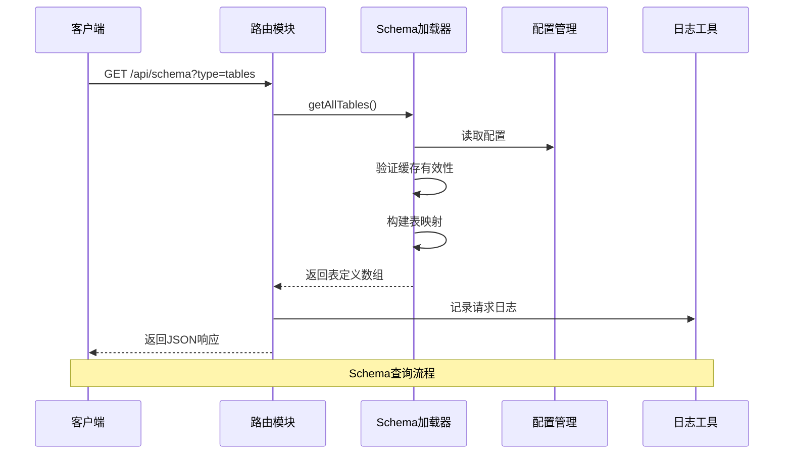
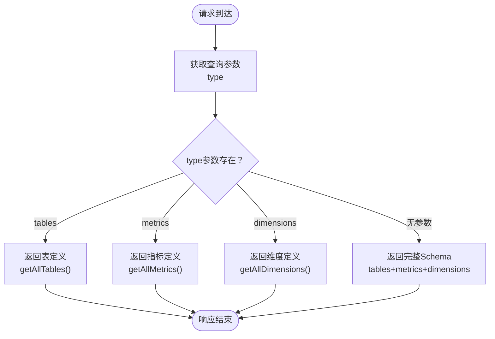
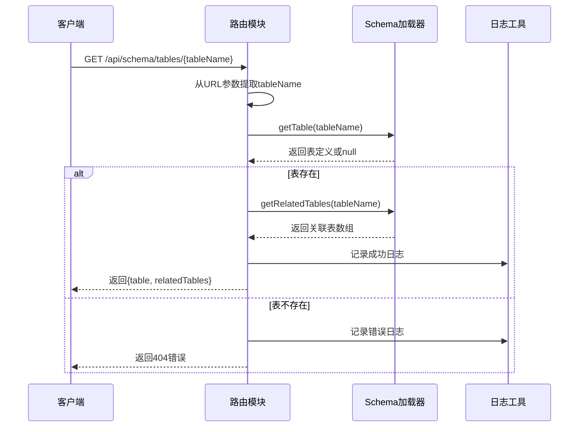
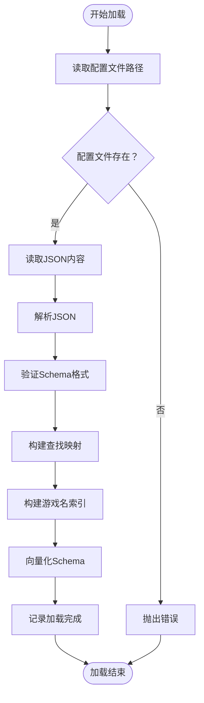
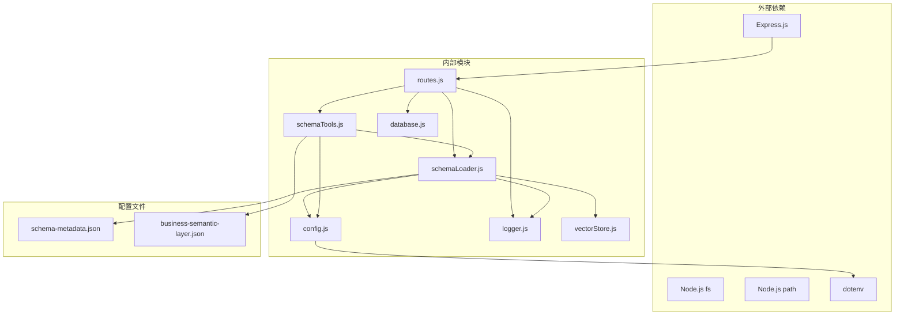

# Schema查询端点

<cite>
**本文档引用的文件**
- [routes.js](file://backend/src/core/routes.js)
- [schemaLoader.js](file://backend/src/core/schemaLoader.js)
- [schemaTools.js](file://backend/src/core/schemaTools.js)
- [config.js](file://backend/src/core/config.js)
- [logger.js](file://backend/src/utils/logger.js)
- [app.js](file://backend/src/app.js)
- [business-semantic-layer.json](file://backend/config/business-semantic-layer.json)
- [schema-metadata.example.json](file://backend/config/schema-metadata.example.json)
- [schema-metadata.json.backup](file://backend/config/schema-metadata.json.backup)
</cite>

## 目录
1. [简介](#简介)
2. [项目结构](#项目结构)
3. [核心组件](#核心组件)
4. [架构概览](#架构概览)
5. [详细组件分析](#详细组件分析)
6. [依赖关系分析](#依赖关系分析)
7. [性能考虑](#性能考虑)
8. [故障排除指南](#故障排除指南)
9. [结论](#结论)

## 简介

本文档详细说明了NL2SQL系统中Schema查询相关端点的实现，重点关注以下两个核心API：
- GET /api/schema：获取完整的Schema信息
- GET /api/schema/tables/:tableName：获取指定表的详细信息

文档涵盖了Schema数据结构、表定义获取、表详情查询的完整流程，包括查询参数说明、响应格式解析、错误处理机制，并提供了实际使用示例、最佳实践建议和性能考虑因素。同时深入解释了SchemaLoader模块如何加载和管理Schema数据，以及缓存机制的工作原理。

## 项目结构

NL2SQL系统采用模块化架构设计，核心功能围绕Schema管理和查询展开：

**图表来源**
- [app.js:1-266](file://backend/src/app.js#L1-L266)
- [routes.js:1-1037](file://backend/src/core/routes.js#L1-L1037)

**章节来源**
- [app.js:1-266](file://backend/src/app.js#L1-L266)
- [routes.js:1-1037](file://backend/src/core/routes.js#L1-L1037)

## 核心组件

### Schema查询端点

系统提供了两个主要的Schema查询端点：

#### 1. GET /api/schema
- **功能**：获取完整的Schema信息
- **查询参数**：
  - `type`：类型筛选（tables|metrics|dimensions）
- **响应格式**：根据type参数返回相应的Schema片段或完整Schema

#### 2. GET /api/schema/tables/:tableName
- **功能**：获取指定表的详细信息
- **路径参数**：`tableName` - 表名
- **响应格式**：包含表定义和关联表信息

### SchemaLoader模块

SchemaLoader是Schema管理的核心模块，负责：
- 加载和验证Schema元数据
- 提供Schema查询接口
- 实现缓存机制
- 支持向量化和语义搜索

**章节来源**
- [routes.js:143-215](file://backend/src/core/routes.js#L143-L215)
- [schemaLoader.js:1-1235](file://backend/src/core/schemaLoader.js#L1-L1235)

## 架构概览

**图表来源**
- [routes.js:150-186](file://backend/src/core/routes.js#L150-L186)
- [schemaLoader.js:441-443](file://backend/src/core/schemaLoader.js#L441-L443)

## 详细组件分析

### Schema查询端点实现

#### GET /api/schema 端点

该端点实现了灵活的Schema查询功能，支持多种查询模式：

**图表来源**
- [routes.js:150-186](file://backend/src/core/routes.js#L150-L186)

#### GET /api/schema/tables/:tableName 端点

该端点提供表详情查询功能：

**图表来源**
- [routes.js:192-215](file://backend/src/core/routes.js#L192-L215)

**章节来源**
- [routes.js:143-215](file://backend/src/core/routes.js#L143-L215)

### Schema数据结构

Schema元数据采用标准化的JSON格式，包含以下核心组件：

#### 表定义结构
每个表包含以下关键字段：
- `name`: 表英文名
- `name_cn`: 表中文名
- `description`: 表描述
- `fields`: 字段数组

#### 字段定义结构
每个字段包含：
- `name`: 字段英文名
- `name_cn`: 字段中文名
- `type`: 字段类型
- `description`: 字段描述
- `is_primary`: 是否为主键
- `foreign_key`: 外键引用

#### 关系定义结构
表关系包含：
- `from`: 源表字段
- `to`: 目标表字段
- `type`: 关系类型
- `description`: 关系描述

**章节来源**
- [schema-metadata.example.json:1-328](file://backend/config/schema-metadata.example.json#L1-L328)
- [schema-metadata.json.backup:1-1308](file://backend/config/schema-metadata.json.backup#L1-L1308)

### SchemaLoader模块详解

#### 加载和初始化流程

**图表来源**
- [schemaLoader.js:75-131](file://backend/src/core/schemaLoader.js#L75-L131)

#### 缓存机制

SchemaLoader实现了两级缓存机制：

1. **内存缓存**：存储已加载的Schema数据
2. **时间戳缓存**：跟踪缓存的有效性

缓存特性：
- 可配置的过期时间
- 支持强制重新加载
- 自动检测缓存状态

**章节来源**
- [schemaLoader.js:36-57](file://backend/src/core/schemaLoader.js#L36-L57)
- [schemaLoader.js:949-959](file://backend/src/core/schemaLoader.js#L949-L959)

### 搜索和匹配功能

SchemaLoader提供了强大的搜索和匹配能力：

#### 语义搜索
- 基于向量相似度的表匹配
- 支持业务概念映射
- 智能重排序算法

#### 关键词匹配
- 基于表名、描述、字段的关键词匹配
- 支持中英文混合搜索
- 可配置的匹配权重

**章节来源**
- [schemaLoader.js:571-710](file://backend/src/core/schemaLoader.js#L571-L710)

### 错误处理机制

系统实现了多层次的错误处理：

#### HTTP错误处理
- 404错误：表不存在
- 400错误：缺少必需参数
- 500错误：服务器内部错误

#### Schema验证错误
- 配置文件格式错误
- 必需字段缺失
- 数据类型不匹配

#### 日志记录
- 结构化错误日志
- 请求追踪
- 性能监控

**章节来源**
- [routes.js:199-205](file://backend/src/core/routes.js#L199-L205)
- [routes.js:244-249](file://backend/src/core/routes.js#L244-L249)

## 依赖关系分析

**图表来源**
- [app.js:23-48](file://backend/src/app.js#L23-L48)
- [routes.js:17-29](file://backend/src/core/routes.js#L17-L29)

**章节来源**
- [app.js:23-48](file://backend/src/app.js#L23-L48)
- [routes.js:17-29](file://backend/src/core/routes.js#L17-L29)

## 性能考虑

### 缓存策略
- **内存缓存**：避免重复读取磁盘文件
- **向量缓存**：减少向量化计算开销
- **查询缓存**：缓存常用查询结果

### 性能优化技术
- **延迟加载**：按需加载Schema数据
- **索引优化**：使用Map数据结构实现O(1)查找
- **批量操作**：支持批量表查询

### 监控和诊断
- **性能日志**：记录查询耗时
- **内存使用监控**：跟踪内存占用
- **缓存命中率**：统计缓存效果

**章节来源**
- [config.js:240-250](file://backend/src/core/config.js#L240-L250)
- [schemaLoader.js:949-969](file://backend/src/core/schemaLoader.js#L949-L969)

## 故障排除指南

### 常见问题和解决方案

#### Schema文件加载失败
**症状**：服务启动时报Schema文件不存在错误
**原因**：
- 配置文件路径错误
- 文件权限问题
- JSON格式错误

**解决方法**：
1. 检查SCHEMA_CONFIG_PATH环境变量
2. 验证文件路径和权限
3. 使用schema-metadata.example.json作为参考

#### 表查询返回空结果
**症状**：GET /api/schema/tables/:tableName返回空数组
**原因**：
- 表名拼写错误
- 表不存在
- 缓存过期

**解决方法**：
1. 使用GET /api/schema验证表是否存在
2. 检查表名大小写
3. 调用reload()重新加载Schema

#### 搜索功能异常
**症状**：搜索相关表失败
**原因**：
- 向量数据库未初始化
- LLM API配置错误
- 网络连接问题

**解决方法**：
1. 检查向量存储初始化状态
2. 验证LLM API配置
3. 确认网络连接

**章节来源**
- [schemaLoader.js:85-86](file://backend/src/core/schemaLoader.js#L85-L86)
- [routes.js:118-120](file://backend/src/core/routes.js#L118-L120)

## 结论

NL2SQL系统的Schema查询端点设计体现了现代Web服务的最佳实践：

### 设计优势
- **模块化架构**：清晰的职责分离和依赖管理
- **灵活的查询接口**：支持多种查询模式和筛选条件
- **高性能实现**：完善的缓存机制和优化策略
- **健壮的错误处理**：多层次的错误处理和日志记录

### 技术特色
- **向量化搜索**：结合语义理解和关键词匹配
- **动态Schema管理**：支持Schema的热加载和更新
- **业务语义层**：提供业务概念到技术实现的映射
- **工具增强**：支持按需索取的Schema探索

### 应用场景
该系统适用于：
- 自然语言到SQL的转换
- 数据探索和发现
- 业务指标计算
- 数据分析和报表生成

通过合理配置和使用，Schema查询端点能够为用户提供高效、准确的Schema信息服务，支撑复杂的NL2SQL应用场景。