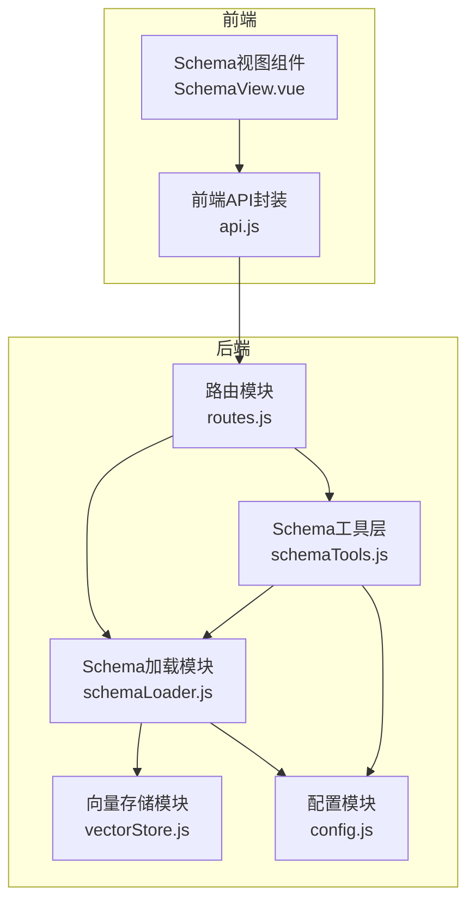
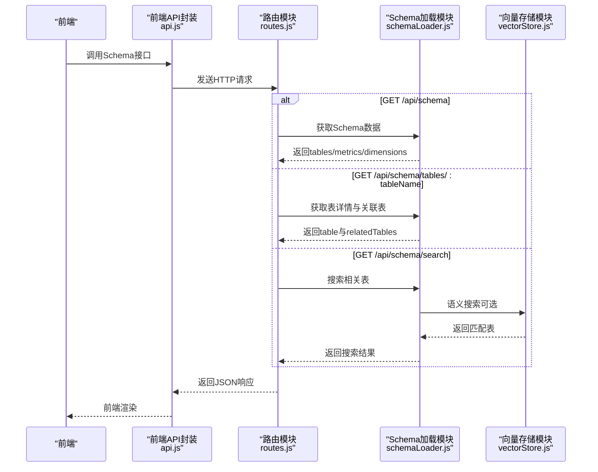
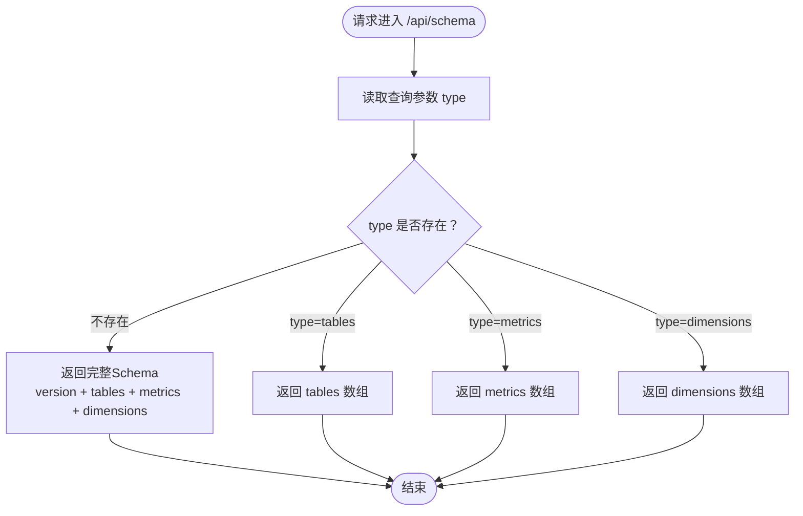
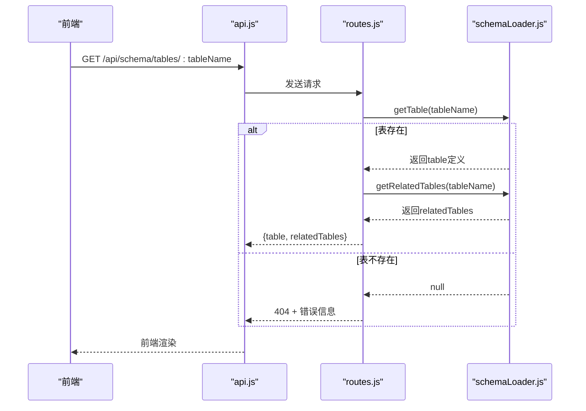
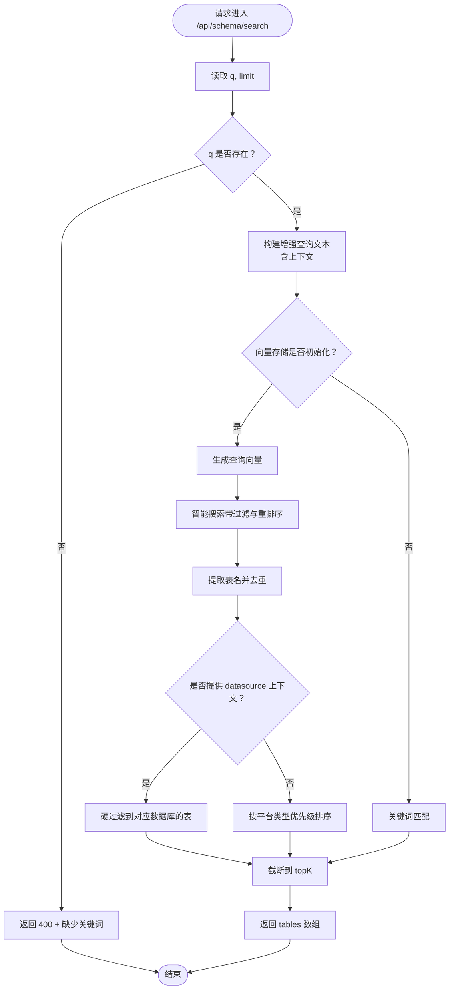
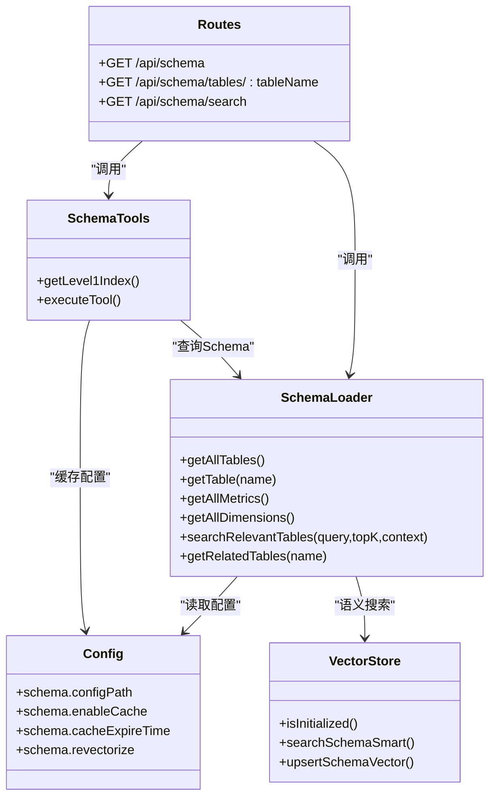

# Schema管理API

<cite>
**本文引用的文件**
- [routes.js](file://backend/src/core/routes.js)
- [schemaLoader.js](file://backend/src/core/schemaLoader.js)
- [schemaTools.js](file://backend/src/core/schemaTools.js)
- [config.js](file://backend/src/core/config.js)
- [schema-metadata.example.json](file://backend/config/schema-metadata.example.json)
- [business-semantic-layer.json](file://backend/config/business-semantic-layer.json)
- [vectorStore.js](file://backend/src/memory/vectorStore.js)
- [api.js](file://frontend/src/utils/api.js)
- [SchemaView.vue](file://frontend/src/views/SchemaView.vue)
</cite>

## 目录
1. [简介](#简介)
2. [项目结构](#项目结构)
3. [核心组件](#核心组件)
4. [架构总览](#架构总览)
5. [详细组件分析](#详细组件分析)
6. [依赖关系分析](#依赖关系分析)
7. [性能考量](#性能考量)
8. [故障排查指南](#故障排查指南)
9. [结论](#结论)
10. [附录](#附录)

## 简介
本文件为NL2SQL项目的Schema管理API参考文档，聚焦于以下三个Schema相关端点：
- GET /api/schema：获取完整Schema或按类型筛选（tables/metrics/dimensions）
- GET /api/schema/tables/:tableName：获取指定表的详细信息及关联表
- GET /api/schema/search：基于关键词搜索相关表（支持语义搜索与关键词匹配）

文档涵盖Schema数据结构、表定义、指标与维度的获取方式，查询参数与过滤选项、搜索功能实现细节，Schema元数据格式与字段类型说明、关联关系表示方法，并提供Schema更新流程、缓存机制、性能优化建议与常见问题解决方案。

## 项目结构
后端采用Express框架，Schema管理API位于核心路由模块中，Schema数据由Schema加载模块负责加载与查询，同时集成向量存储以支持语义搜索。前端通过Axios封装的API模块调用后端Schema接口。

图表来源
- [routes.js:140-250](file://backend/src/core/routes.js#L140-L250)
- [schemaLoader.js:1-131](file://backend/src/core/schemaLoader.js#L1-L131)
- [schemaTools.js:1-632](file://backend/src/core/schemaTools.js#L1-L632)
- [config.js:234-250](file://backend/src/core/config.js#L234-L250)
- [vectorStore.js:326-576](file://backend/src/memory/vectorStore.js#L326-L576)

章节来源
- [routes.js:140-250](file://backend/src/core/routes.js#L140-L250)
- [schemaLoader.js:1-131](file://backend/src/core/schemaLoader.js#L1-L131)
- [schemaTools.js:1-632](file://backend/src/core/schemaTools.js#L1-L632)
- [config.js:234-250](file://backend/src/core/config.js#L234-L250)
- [vectorStore.js:326-576](file://backend/src/memory/vectorStore.js#L326-L576)

## 核心组件
- 路由模块：定义Schema相关REST端点，处理请求参数与响应格式。
- Schema加载模块：负责Schema元数据的加载、校验、缓存、查询与语义搜索。
- Schema工具层：提供LLM可调用的Schema探索工具，支持按需索取。
- 配置模块：集中管理Schema配置（路径、缓存、向量化开关等）。
- 向量存储模块：提供Schema向量的增删改查与智能搜索能力。

章节来源
- [routes.js:140-250](file://backend/src/core/routes.js#L140-L250)
- [schemaLoader.js:1-131](file://backend/src/core/schemaLoader.js#L1-L131)
- [schemaTools.js:1-632](file://backend/src/core/schemaTools.js#L1-L632)
- [config.js:234-250](file://backend/src/core/config.js#L234-L250)
- [vectorStore.js:326-576](file://backend/src/memory/vectorStore.js#L326-L576)

## 架构总览
Schema管理API的请求处理流程如下：
- 前端通过api.js发起HTTP请求至后端路由模块。
- 路由模块根据端点调用Schema加载模块或Schema工具层。
- Schema加载模块从配置文件加载Schema元数据，构建映射与缓存，并在需要时调用向量存储模块进行语义搜索。
- 返回标准化的JSON响应给前端。

图表来源
- [routes.js:140-250](file://backend/src/core/routes.js#L140-L250)
- [schemaLoader.js:433-710](file://backend/src/core/schemaLoader.js#L433-L710)
- [vectorStore.js:576-576](file://backend/src/memory/vectorStore.js#L576-L576)

## 详细组件分析

### GET /api/schema
- 功能：获取完整Schema或按类型筛选。
- 查询参数：
  - type：可选，支持tables、metrics、dimensions三类筛选。
- 响应：
  - 默认：返回version、tables、metrics、dimensions。
  - type=tables：仅返回tables。
  - type=metrics：仅返回metrics。
  - type=dimensions：仅返回dimensions。

图表来源
- [routes.js:143-186](file://backend/src/core/routes.js#L143-L186)

章节来源
- [routes.js:143-186](file://backend/src/core/routes.js#L143-L186)

### GET /api/schema/tables/:tableName
- 功能：获取指定表的详细信息及关联表。
- 路径参数：
  - tableName：目标表名（支持英文名或中文名）。
- 响应：
  - 成功：返回table定义与relatedTables（关联表名数组）。
  - 失败：返回404及错误信息。

图表来源
- [routes.js:188-215](file://backend/src/core/routes.js#L188-L215)
- [schemaLoader.js:440-531](file://backend/src/core/schemaLoader.js#L440-L531)

章节来源
- [routes.js:188-215](file://backend/src/core/routes.js#L188-L215)
- [schemaLoader.js:440-531](file://backend/src/core/schemaLoader.js#L440-L531)

### GET /api/schema/search
- 功能：基于关键词搜索相关表，支持语义搜索与关键词匹配。
- 查询参数：
  - q：必填，搜索关键词。
  - limit：可选，默认5，返回结果数量上限。
- 响应：
  - 成功：返回query、count、tables（表定义数组）。
  - 失败：返回500及错误信息。

图表来源
- [routes.js:217-250](file://backend/src/core/routes.js#L217-L250)
- [schemaLoader.js:560-710](file://backend/src/core/schemaLoader.js#L560-L710)
- [vectorStore.js:576-576](file://backend/src/memory/vectorStore.js#L576-L576)

章节来源
- [routes.js:217-250](file://backend/src/core/routes.js#L217-L250)
- [schemaLoader.js:560-710](file://backend/src/core/schemaLoader.js#L560-L710)
- [vectorStore.js:576-576](file://backend/src/memory/vectorStore.js#L576-L576)

### Schema数据结构与元数据格式
Schema元数据由配置文件定义，包含以下核心字段：
- version：Schema版本号。
- tables：表定义数组，每张表包含：
  - name/name_cn：表名与中文名。
  - description：表描述。
  - fields：字段定义数组，每个字段包含：
    - name/name_cn：字段名与中文名。
    - type：字段类型（如VARCHAR、DECIMAL等）。
    - description：字段描述。
    - is_primary：是否为主键。
    - foreign_key：外键引用（如users.user_id）。
    - aggregations：可聚合函数列表（如SUM、AVG等）。
    - time_granularity：时间粒度（如hour、day、week、month、year）。
- relationships：表关系数组，每条关系包含：
  - from/to：起止表字段（如sales_order.user_id）。
  - type：关系类型（如MANY_TO_ONE）。
  - description：关系描述。
- metrics：指标定义数组，每条指标包含：
  - name/name_cn：指标名与中文名。
  - definition：指标定义（如SUM(sales_order.order_amount)）。
  - description：指标描述。
  - unit：指标单位。
- dimensions：维度定义数组，每条维度包含：
  - name/name_cn：维度名与中文名。
  - fields：维度字段数组（如["region.province","region.city"]）。
  - granularities：时间粒度数组（如["hour","day","week","month","quarter","year"]）。
  - hierarchy：层级关系（如["province","city"]）。

章节来源
- [schema-metadata.example.json:1-328](file://backend/config/schema-metadata.example.json#L1-L328)

### 字段类型与关联关系表示
- 字段类型：遵循数据库字段类型规范，如VARCHAR、DECIMAL、DATETIME等。
- 关联关系：通过from/to字段组合与type标注，表示多表关联关系。例如：
  - from: "sales_order.user_id"
  - to: "users.user_id"
  - type: "MANY_TO_ONE"
  - description: "订单关联用户"

章节来源
- [schema-metadata.example.json:233-252](file://backend/config/schema-metadata.example.json#L233-L252)

### 搜索功能实现细节
- 语义搜索：当向量存储初始化且启用时，先生成查询向量，再通过智能搜索返回匹配表，随后结合显式表名与过滤逻辑（如datasource、平台类型）进行二次筛选与排序。
- 关键词匹配：若语义搜索不可用或失败，回退到关键词匹配，基于表名、中文名、描述与字段名进行评分排序。
- 上下文增强：支持根据gameId与datasource增强查询文本，提升平台与数据源相关的匹配准确性。

章节来源
- [schemaLoader.js:560-710](file://backend/src/core/schemaLoader.js#L560-L710)
- [vectorStore.js:576-576](file://backend/src/memory/vectorStore.js#L576-L576)

### Schema更新流程
- 配置文件更新：修改配置文件中的tables、relationships、metrics、dimensions等字段。
- 重启服务：后端启动时加载Schema配置文件并构建映射与缓存。
- 向量化更新：若向量存储已初始化，将对表级表征进行增量更新，避免重复Embedding调用。
- 缓存生效：Schema加载完成后，后续查询将使用内存缓存，提升性能。

章节来源
- [schemaLoader.js:75-131](file://backend/src/core/schemaLoader.js#L75-L131)
- [schemaLoader.js:200-285](file://backend/src/core/schemaLoader.js#L200-L285)
- [config.js:234-250](file://backend/src/core/config.js#L234-L250)

### 缓存机制
- Schema缓存：加载Schema后缓存版本、表定义、字段映射与动态索引，并记录缓存时间戳。
- Level 1索引缓存：Schema工具层提供极简版索引缓存，带过期时间控制，默认1小时。
- 向量缓存：向量存储模块支持增量更新与软删除，避免重复向量化。

章节来源
- [schemaLoader.js:32-57](file://backend/src/core/schemaLoader.js#L32-L57)
- [schemaLoader.js:166-198](file://backend/src/core/schemaLoader.js#L166-L198)
- [schemaTools.js:136-173](file://backend/src/core/schemaTools.js#L136-L173)
- [vectorStore.js:866-903](file://backend/src/memory/vectorStore.js#L866-L903)

### 前端集成
- 前端通过api.js封装的函数调用后端Schema接口，包括：
  - getSchema()：获取完整Schema。
  - getTableDetail(tableName)：获取表详情。
  - searchSchema(query, limit)：搜索相关表。
- 前端视图组件SchemaView.vue负责渲染Schema数据，支持切换“表结构”、“指标”、“维度”、“表关系”四个标签页。

章节来源
- [api.js:114-141](file://frontend/src/utils/api.js#L114-L141)
- [SchemaView.vue:182-200](file://frontend/src/views/SchemaView.vue#L182-L200)

## 依赖关系分析

图表来源
- [routes.js:140-250](file://backend/src/core/routes.js#L140-L250)
- [schemaLoader.js:433-710](file://backend/src/core/schemaLoader.js#L433-L710)
- [schemaTools.js:547-632](file://backend/src/core/schemaTools.js#L547-L632)
- [config.js:234-250](file://backend/src/core/config.js#L234-L250)
- [vectorStore.js:326-576](file://backend/src/memory/vectorStore.js#L326-L576)

章节来源
- [routes.js:140-250](file://backend/src/core/routes.js#L140-L250)
- [schemaLoader.js:433-710](file://backend/src/core/schemaLoader.js#L433-L710)
- [schemaTools.js:547-632](file://backend/src/core/schemaTools.js#L547-L632)
- [config.js:234-250](file://backend/src/core/config.js#L234-L250)
- [vectorStore.js:326-576](file://backend/src/memory/vectorStore.js#L326-L576)

## 性能考量
- 向量搜索：启用向量存储时，优先使用语义搜索，显著提升关键词模糊匹配与业务语义理解能力。
- 增量更新：向量存储支持基于内容Hash的增量更新，避免重复Embedding调用。
- 缓存策略：Schema加载后建立内存映射与索引，Level 1索引也提供短期缓存，减少重复计算。
- 限制与超时：搜索结果数量限制与查询超时配置，防止资源滥用与响应过慢。
- 白名单与安全：可通过allowedTables与禁止关键字列表限制访问范围，保障安全性。

章节来源
- [schemaLoader.js:200-285](file://backend/src/core/schemaLoader.js#L200-L285)
- [vectorStore.js:866-903](file://backend/src/memory/vectorStore.js#L866-L903)
- [config.js:140-170](file://backend/src/core/config.js#L140-L170)

## 故障排查指南
- 404 表不存在：当请求的表名在Schema中未找到时，返回404与错误信息。请确认表名（支持英文与中文名）是否正确。
- 400 缺少关键词：搜索接口要求q参数，若缺失将返回400。请提供有效的搜索关键词。
- 500 搜索失败：语义搜索过程中可能出现异常，返回500与错误信息。检查向量存储初始化状态与LLM服务可用性。
- Schema未加载：若Schema未正确加载，健康检查接口会显示schema组件状态为error。请检查配置文件路径与内容格式。
- 权限与白名单：若allowedTables为空，将允许访问所有表；生产环境建议配置白名单以限制访问范围。

章节来源
- [routes.js:199-205](file://backend/src/core/routes.js#L199-L205)
- [routes.js:229-233](file://backend/src/core/routes.js#L229-L233)
- [routes.js:117-120](file://backend/src/core/routes.js#L117-L120)
- [config.js:140-170](file://backend/src/core/config.js#L140-L170)

## 结论
NL2SQL的Schema管理API提供了灵活、可扩展的Schema查询与搜索能力。通过配置驱动的Schema元数据、内存缓存与向量存储的结合，既保证了查询性能，又提升了语义理解与业务概念映射的准确性。建议在生产环境中合理配置白名单、缓存与向量化策略，并持续监控健康状态与评估指标，以获得最佳的用户体验与系统稳定性。

## 附录

### Schema元数据格式要点
- tables：包含name、name_cn、description、fields等字段。
- fields：包含name、name_cn、type、description、is_primary、foreign_key、aggregations、time_granularity等。
- relationships：包含from、to、type、description。
- metrics：包含name、name_cn、definition、description、unit。
- dimensions：包含name、name_cn、fields、granularities、hierarchy。

章节来源
- [schema-metadata.example.json:1-328](file://backend/config/schema-metadata.example.json#L1-L328)

### 业务语义层配置
- business-semantic-layer.json提供业务概念到物理表/字段的映射，支持平台类型、充值、注册、登录、聊天、创角、首充、留存、等级等概念的别名与优先级配置，以及查询模式与字段映射。

章节来源
- [business-semantic-layer.json:1-189](file://backend/config/business-semantic-layer.json#L1-L189)