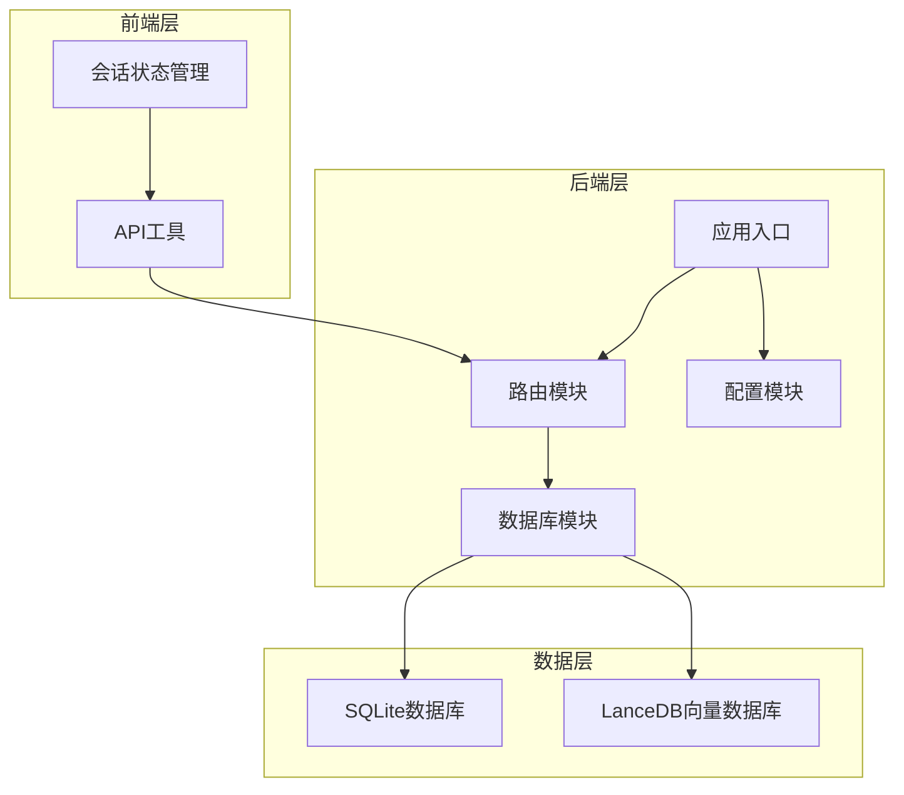
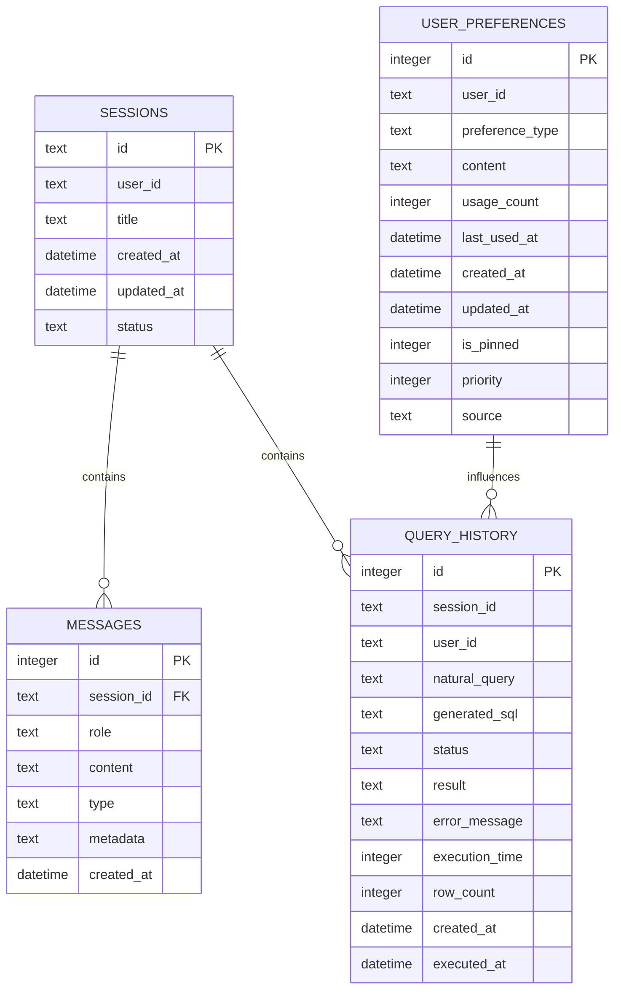
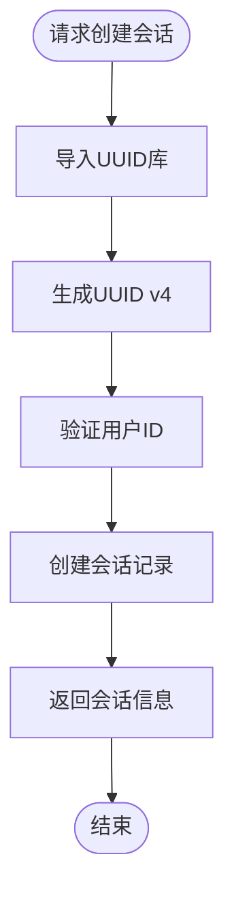
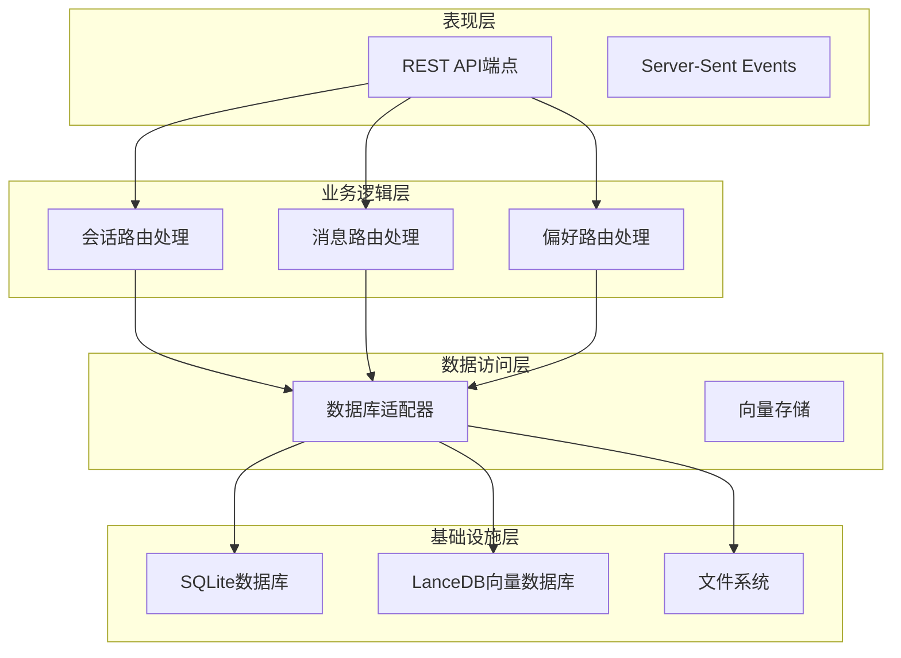
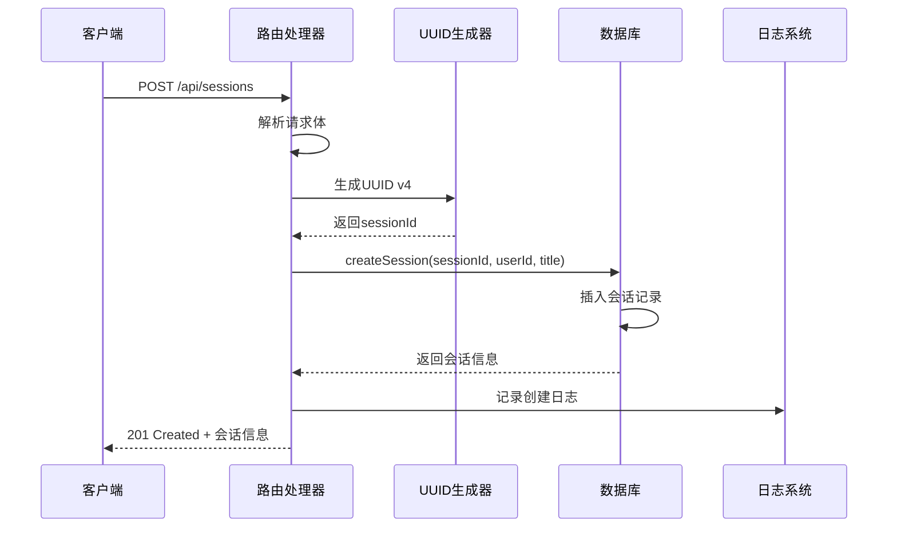
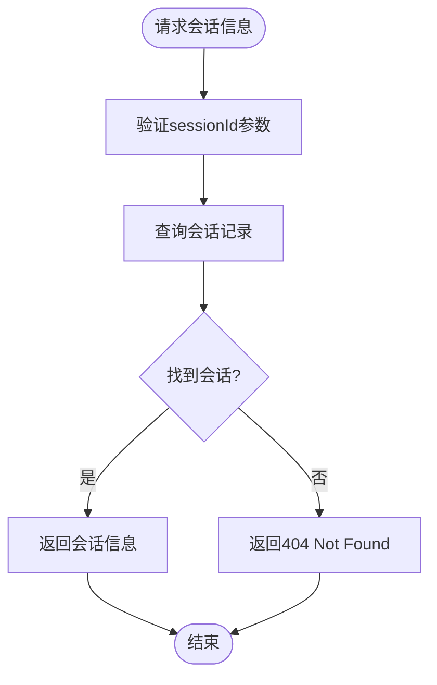
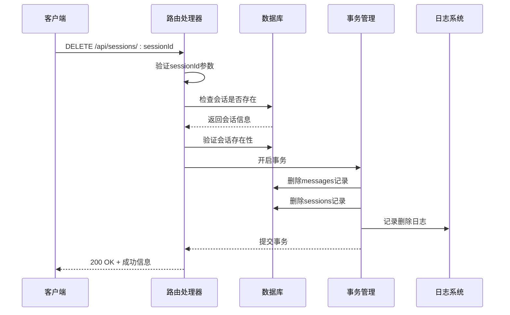
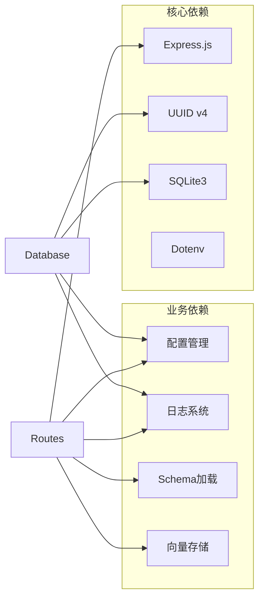
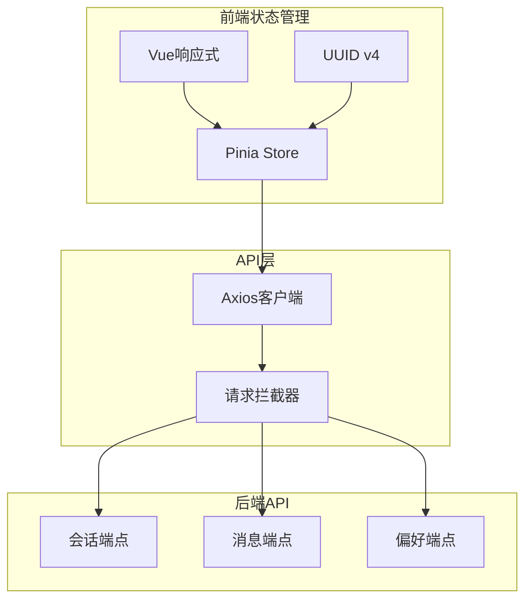

# 会话CRUD端点

<cite>
**本文档引用的文件**
- [app.js](file://backend/src/app.js)
- [routes.js](file://backend/src/core/routes.js)
- [database.js](file://backend/src/core/database.js)
- [config.js](file://backend/src/core/config.js)
- [session.js](file://frontend/src/stores/session.js)
- [api.js](file://frontend/src/utils/api.js)
- [package.json](file://backend/package.json)
</cite>

## 目录
1. [简介](#简介)
2. [项目结构](#项目结构)
3. [核心组件](#核心组件)
4. [架构概览](#架构概览)
5. [详细组件分析](#详细组件分析)
6. [依赖关系分析](#依赖关系分析)
7. [性能考虑](#性能考虑)
8. [故障排除指南](#故障排除指南)
9. [结论](#结论)

## 简介

本文档详细说明了NL2SQL项目中的会话CRUD端点实现，重点关注以下三个核心端点：

- **POST /api/sessions** - 创建新会话
- **GET /api/sessions/:sessionId** - 获取会话信息
- **DELETE /api/sessions/:sessionId** - 删除会话

这些端点构成了NL2SQL系统中会话管理的核心功能，支持用户与系统的交互历史管理、查询历史跟踪以及长期记忆的存储。

## 项目结构

NL2SQL项目采用模块化架构设计，会话管理功能分布在多个层次中：



**图表来源**
- [app.js:1-266](file://backend/src/app.js#L1-L266)
- [routes.js:1-1037](file://backend/src/core/routes.js#L1-L1037)

**章节来源**
- [app.js:1-266](file://backend/src/app.js#L1-L266)
- [routes.js:1-1037](file://backend/src/core/routes.js#L1-L1037)

## 核心组件

### 会话数据模型

会话系统基于SQLite数据库实现，核心数据结构如下：



**图表来源**
- [database.js:39-195](file://backend/src/core/database.js#L39-L195)

### UUID生成机制

系统使用标准的UUID v4算法生成会话ID：



**图表来源**
- [routes.js:266-290](file://backend/src/core/routes.js#L266-L290)
- [database.js:526-534](file://backend/src/core/database.js#L526-L534)

**章节来源**
- [database.js:39-195](file://backend/src/core/database.js#L39-L195)
- [routes.js:266-290](file://backend/src/core/routes.js#L266-L290)

## 架构概览

会话管理系统的整体架构采用分层设计：



**图表来源**
- [app.js:1-266](file://backend/src/app.js#L1-L266)
- [routes.js:1-1037](file://backend/src/core/routes.js#L1-L1037)

## 详细组件分析

### POST /api/sessions - 会话创建

#### 请求处理流程



**图表来源**
- [routes.js:266-290](file://backend/src/core/routes.js#L266-L290)
- [database.js:526-534](file://backend/src/core/database.js#L526-L534)

#### 请求参数验证

| 参数名 | 必需 | 类型 | 默认值 | 描述 |
|--------|------|------|--------|------|
| user_id | 否 | string | 'anonymous' | 用户标识符 |
| title | 否 | string | '新会话' | 会话标题 |

#### 响应格式

**成功响应 (201 Created)**:
```json
{
  "id": "string",
  "user_id": "string",
  "title": "string"
}
```

**错误响应 (500 Internal Server Error)**:
```json
{
  "error": "string"
}
```

#### 匿名用户处理

系统支持匿名用户会话创建，当`user_id`未提供时自动使用'anonymous'作为默认值。

**章节来源**
- [routes.js:266-290](file://backend/src/core/routes.js#L266-L290)
- [database.js:526-534](file://backend/src/core/database.js#L526-L534)

### GET /api/sessions/:sessionId - 会话信息获取

#### 查询流程



**图表来源**
- [routes.js:296-314](file://backend/src/core/routes.js#L296-L314)
- [database.js:541-544](file://backend/src/core/database.js#L541-L544)

#### 查询条件

系统仅返回状态为'active'的会话记录，确保不会返回已删除或归档的会话。

#### 响应格式

**成功响应 (200 OK)**:
```json
{
  "id": "string",
  "user_id": "string",
  "title": "string",
  "created_at": "datetime",
  "updated_at": "datetime",
  "status": "string"
}
```

**错误响应 (404 Not Found)**:
```json
{
  "error": "会话不存在"
}
```

**章节来源**
- [routes.js:296-314](file://backend/src/core/routes.js#L296-L314)
- [database.js:541-544](file://backend/src/core/database.js#L541-L544)

### DELETE /api/sessions/:sessionId - 会话删除

#### 删除机制



**图表来源**
- [routes.js:320-345](file://backend/src/core/routes.js#L320-L345)
- [database.js:589-608](file://backend/src/core/database.js#L589-L608)

#### 事务管理

系统使用SQLite事务确保删除操作的原子性：

1. **删除消息**: 先删除与会话关联的所有消息记录
2. **删除会话**: 再删除会话本身
3. **事务提交**: 确保两个操作要么都成功，要么都失败

#### 外键约束

数据库设计包含外键约束，确保数据完整性：

- `messages.session_id` 引用 `sessions.id`
- 删除会话时自动删除相关消息（CASCADE）

**章节来源**
- [routes.js:320-345](file://backend/src/core/routes.js#L320-L345)
- [database.js:589-608](file://backend/src/core/database.js#L589-L608)

### 会话状态管理

#### 状态字段

会话表包含状态字段，支持多种会话状态：

| 状态值 | 描述 | 用途 |
|--------|------|------|
| active | 活跃 | 默认状态，可正常使用 |
| archived | 归档 | 不再活跃但仍可查询 |
| deleted | 删除 | 已删除的会话 |

#### 时间戳管理

系统自动管理会话的时间戳：

- `created_at`: 会话创建时间
- `updated_at`: 会话最后更新时间
- `touchSession()`: 更新会话时间戳

**章节来源**
- [database.js:566-569](file://backend/src/core/database.js#L566-L569)

## 依赖关系分析

### 后端依赖



**图表来源**
- [package.json:10-20](file://backend/package.json#L10-L20)
- [app.js:22-48](file://backend/src/app.js#L22-L48)

### 前端集成



**图表来源**
- [session.js:15-23](file://frontend/src/stores/session.js#L15-L23)
- [api.js:14-34](file://frontend/src/utils/api.js#L14-L34)

**章节来源**
- [package.json:10-20](file://backend/package.json#L10-L20)
- [session.js:15-23](file://frontend/src/stores/session.js#L15-L23)
- [api.js:14-34](file://frontend/src/utils/api.js#L14-L34)

## 性能考虑

### 数据库优化

1. **索引优化**: 会话表包含多个索引以加速查询
   - `idx_sessions_user_id`: 按用户查询
   - `idx_sessions_status`: 按状态筛选
   - `idx_sessions_updated_at`: 按时间排序

2. **事务批处理**: 删除操作使用事务确保原子性

3. **参数化查询**: 所有数据库操作使用参数化查询防止SQL注入

### 缓存策略

系统配置支持会话历史缓存：

- `maxHistory`: 最大会话历史消息数（默认20）
- `expireTime`: 会话过期时间（默认7天）
- `cleanupInterval`: 清理间隔（默认1小时）

**章节来源**
- [config.js:179-186](file://backend/src/core/config.js#L179-L186)

## 故障排除指南

### 常见错误及解决方案

#### 1. 会话创建失败

**症状**: POST /api/sessions 返回500错误

**可能原因**:
- 数据库连接问题
- UUID生成失败
- 数据库表结构异常

**解决方案**:
1. 检查数据库连接状态
2. 验证数据库初始化过程
3. 查看应用日志获取详细错误信息

#### 2. 会话查询失败

**症状**: GET /api/sessions/:sessionId 返回404

**可能原因**:
- 会话ID不存在
- 会话状态不是active
- 数据库连接异常

**解决方案**:
1. 验证会话ID格式
2. 检查会话状态
3. 确认数据库服务正常运行

#### 3. 会话删除失败

**症状**: DELETE /api/sessions/:sessionId 返回500错误

**可能原因**:
- 外键约束冲突
- 事务回滚
- 数据库锁定

**解决方案**:
1. 检查相关联的消息记录
2. 确认无并发访问
3. 查看数据库锁状态

### 调试技巧

1. **启用详细日志**: 设置`LOG_LEVEL=debug`获取更多调试信息
2. **检查数据库状态**: 使用SQLite命令行工具验证表结构
3. **监控数据库连接**: 确保数据库连接池正常工作

**章节来源**
- [app.js:97-194](file://backend/src/app.js#L97-L194)
- [config.js:195-213](file://backend/src/core/config.js#L195-L213)

## 结论

NL2SQL项目的会话CRUD端点实现了完整的会话生命周期管理，具有以下特点：

1. **完整的CRUD支持**: 支持会话的创建、查询、删除操作
2. **数据完整性保证**: 使用事务和外键约束确保数据一致性
3. **灵活的用户管理**: 支持匿名用户和认证用户
4. **性能优化**: 包含索引优化和缓存策略
5. **错误处理**: 提供完善的错误处理和日志记录

该实现为NL2SQL系统提供了可靠的会话管理基础，支持复杂的查询历史管理和长期记忆功能。通过模块化设计和清晰的架构分离，系统具备良好的可维护性和扩展性。