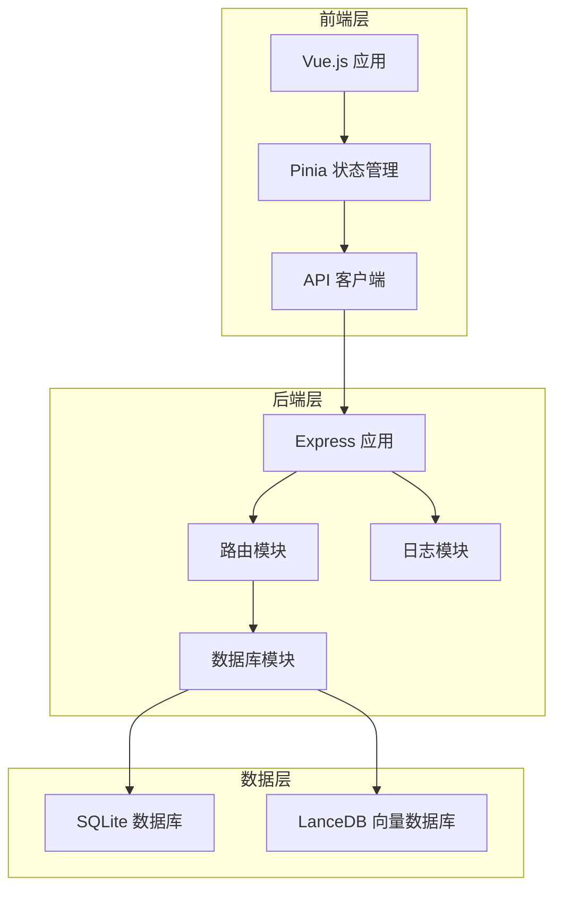
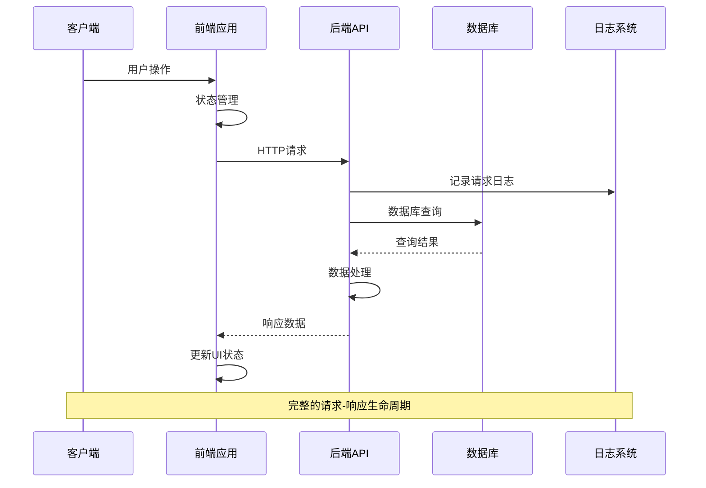
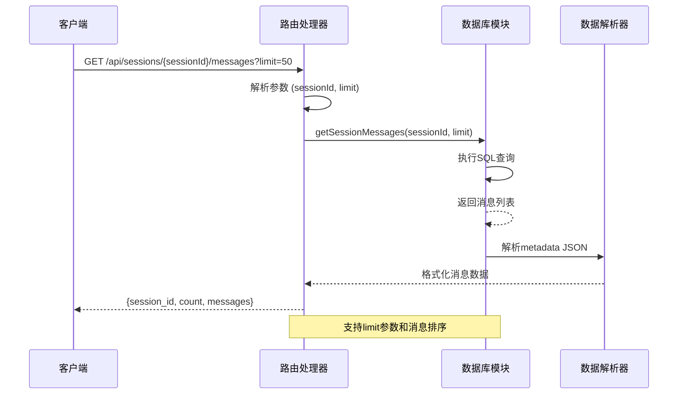
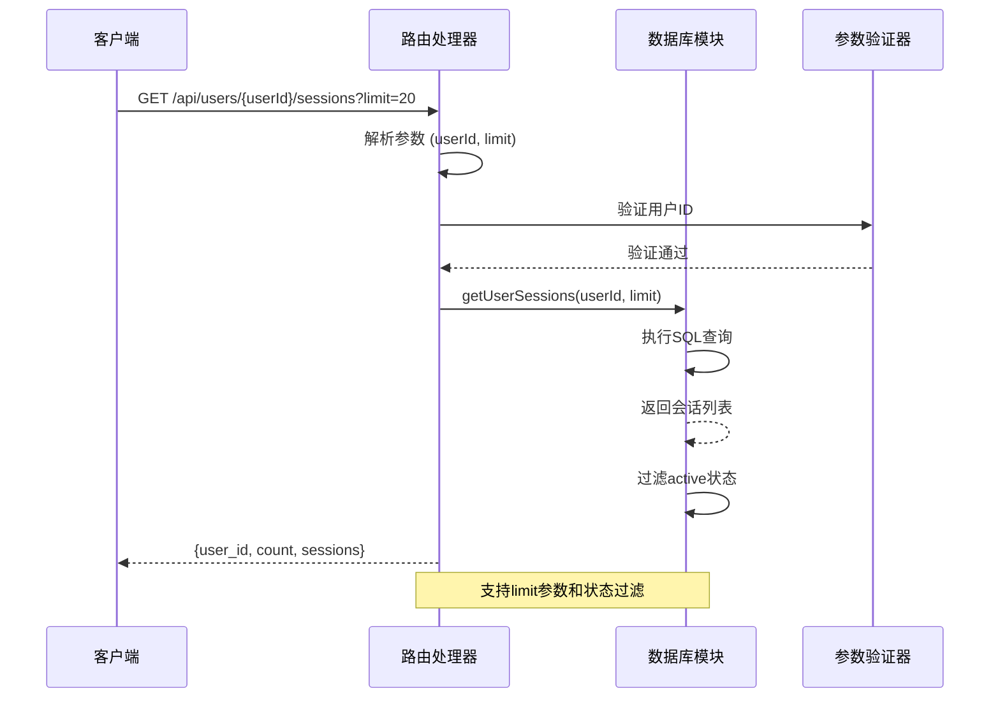
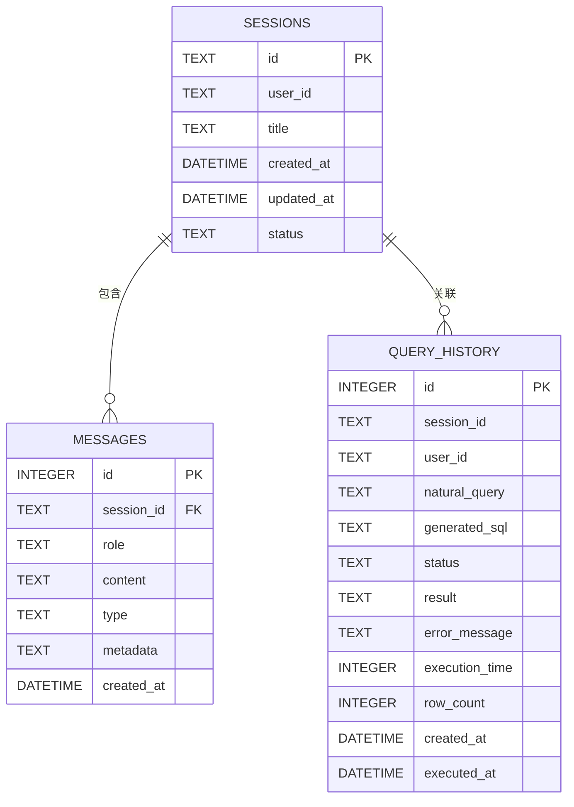
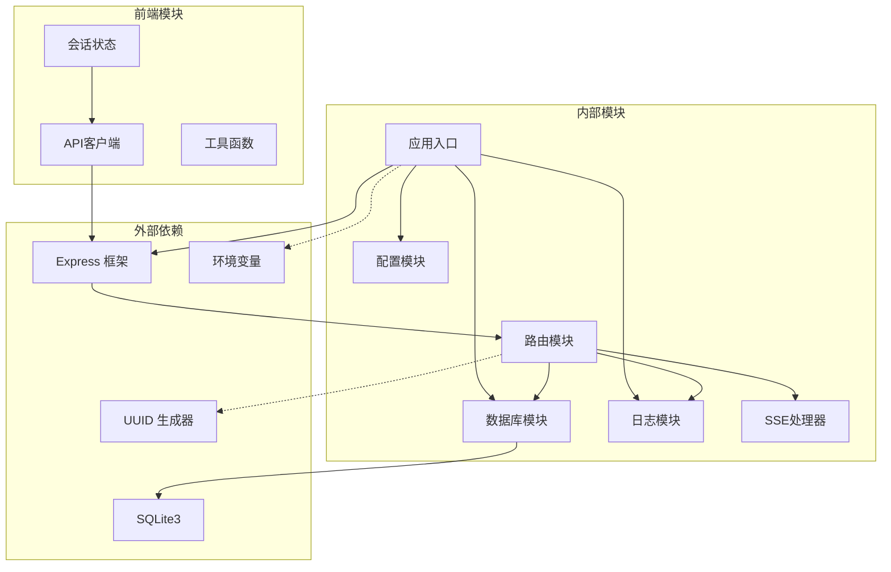

# 会话消息端点

<cite>
**本文档引用的文件**
- [app.js](file://backend/src/app.js)
- [routes.js](file://backend/src/core/routes.js)
- [database.js](file://backend/src/core/database.js)
- [logger.js](file://backend/src/utils/logger.js)
- [config.js](file://backend/src/core/config.js)
- [session.js](file://frontend/src/stores/session.js)
- [api.js](file://frontend/src/utils/api.js)
</cite>

## 目录
1. [简介](#简介)
2. [项目结构](#项目结构)
3. [核心组件](#核心组件)
4. [架构概览](#架构概览)
5. [详细组件分析](#详细组件分析)
6. [依赖关系分析](#依赖关系分析)
7. [性能考虑](#性能考虑)
8. [故障排除指南](#故障排除指南)
9. [结论](#结论)

## 简介

本文档详细说明了NL2SQL系统中的会话消息相关端点，重点关注以下两个核心API：

- **GET /api/sessions/:sessionId/messages** - 获取指定会话的消息历史
- **GET /api/users/:userId/sessions** - 获取用户的会话列表

这些端点实现了消息历史获取、用户会话管理、消息分页等功能，支持limit参数处理、消息排序规则，并具备查询优化、缓存策略和性能考虑。

## 项目结构

NL2SQL项目采用前后端分离架构，后端使用Node.js + Express构建RESTful API，前端使用Vue.js + Pinia管理状态。



**图表来源**
- [app.js:56-87](file://backend/src/app.js#L56-L87)
- [routes.js:35-36](file://backend/src/core/routes.js#L35-L36)

**章节来源**
- [app.js:1-266](file://backend/src/app.js#L1-L266)
- [routes.js:1-1037](file://backend/src/core/routes.js#L1-L1037)

## 核心组件

### 后端核心组件

1. **路由模块** - 定义RESTful API端点和业务逻辑
2. **数据库模块** - 管理SQLite数据库连接和数据操作
3. **配置模块** - 统一管理应用配置
4. **日志模块** - 提供结构化日志记录

### 前端核心组件

1. **会话状态管理** - 使用Pinia管理会话状态
2. **API客户端** - 封装HTTP请求和响应处理

**章节来源**
- [routes.js:35-36](file://backend/src/core/routes.js#L35-L36)
- [database.js:29](file://backend/src/core/database.js#L29-L29)
- [config.js:16](file://backend/src/core/config.js#L16-L16)
- [session.js:33](file://frontend/src/stores/session.js#L33-L33)

## 架构概览

NL2SQL系统采用分层架构设计，确保关注点分离和代码可维护性。



**图表来源**
- [routes.js:46-54](file://backend/src/core/routes.js#L46-L54)
- [logger.js:246-264](file://backend/src/utils/logger.js#L246-L264)

## 详细组件分析

### 会话消息端点

#### GET /api/sessions/:sessionId/messages

此端点用于获取指定会话的消息历史记录。



**图表来源**
- [routes.js:354-373](file://backend/src/core/routes.js#L354-L373)
- [database.js:650-664](file://backend/src/core/database.js#L650-L664)

##### 实现细节

1. **参数处理**：
   - `sessionId`: 路径参数，必需
   - `limit`: 查询参数，默认50，最大限制在数据库层实现

2. **查询逻辑**：
   ```sql
   SELECT * FROM messages 
   WHERE session_id = ?
   ORDER BY created_at ASC
   LIMIT ?
   ```

3. **数据结构**：
   - `messages`: 消息数组，按时间升序排列
   - `metadata`: JSON字符串，解析为对象

4. **错误处理**：
   - 数据库查询异常：记录错误并返回500状态
   - 会话不存在：返回404状态

**章节来源**
- [routes.js:348-373](file://backend/src/core/routes.js#L348-L373)
- [database.js:644-664](file://backend/src/core/database.js#L644-L664)

#### GET /api/users/:userId/sessions

此端点用于获取指定用户的所有会话列表。



**图表来源**
- [routes.js:379-398](file://backend/src/core/routes.js#L379-L398)
- [database.js:552-560](file://backend/src/core/database.js#L552-L560)

##### 实现细节

1. **参数处理**：
   - `userId`: 路径参数，必需
   - `limit`: 查询参数，默认20

2. **查询逻辑**：
   ```sql
   SELECT * FROM sessions 
   WHERE user_id = ? AND status = ?
   ORDER BY updated_at DESC
   LIMIT ?
   ```

3. **状态管理**：
   - 仅返回`status = 'active'`的会话
   - 按`updated_at`降序排列

4. **数据结构**：
   - `sessions`: 会话数组，包含会话基本信息
   - `count`: 返回的会话数量

**章节来源**
- [routes.js:376-398](file://backend/src/core/routes.js#L376-L398)
- [database.js:547-560](file://backend/src/core/database.js#L547-L560)

### 数据模型



**图表来源**
- [database.js:44-87](file://backend/src/core/database.js#L44-L87)
- [database.js:98-125](file://backend/src/core/database.js#L98-L125)

### 消息数据结构

#### 消息对象结构

| 字段名 | 类型 | 描述 | 必需 |
|--------|------|------|------|
| id | INTEGER | 消息唯一标识 | 是 |
| session_id | TEXT | 所属会话ID | 是 |
| role | TEXT | 消息角色 | 是 |
| content | TEXT | 消息内容 | 是 |
| type | TEXT | 消息类型 | 否 |
| metadata | TEXT | JSON元数据 | 否 |
| created_at | DATETIME | 创建时间 | 是 |

#### 支持的消息类型

- `text`: 文本消息
- `sql`: SQL代码
- `result`: 查询结果
- `error`: 错误信息
- `clarify`: 澄清请求

#### 支持的消息角色

- `user`: 用户消息
- `assistant`: 助手回复
- `system`: 系统消息
- `tool`: 工具消息

**章节来源**
- [database.js:70-87](file://backend/src/core/database.js#L70-L87)
- [database.js:623-642](file://backend/src/core/database.js#L623-L642)

### 查询优化策略

#### 索引设计

数据库为关键字段建立了优化索引：

```sql
-- 会话表索引
CREATE INDEX IF NOT EXISTS idx_sessions_user_id ON sessions(user_id);
CREATE INDEX IF NOT EXISTS idx_sessions_status ON sessions(status);
CREATE INDEX IF NOT EXISTS idx_sessions_updated_at ON sessions(updated_at);

-- 消息表索引  
CREATE INDEX IF NOT EXISTS idx_messages_session_id ON messages(session_id);
CREATE INDEX IF NOT EXISTS idx_messages_created_at ON messages(created_at);

-- 查询历史表索引
CREATE INDEX IF NOT EXISTS idx_query_history_user_id ON query_history(user_id);
CREATE INDEX IF NOT EXISTS idx_query_history_session_id ON query_history(session_id);
CREATE INDEX IF NOT EXISTS idx_query_history_created_at ON query_history(created_at);
CREATE INDEX IF NOT EXISTS idx_query_history_status ON query_history(status);
```

#### 查询优化技术

1. **参数化查询**：防止SQL注入攻击
2. **索引利用**：通过WHERE子句和ORDER BY子句有效利用索引
3. **LIMIT限制**：控制返回结果数量，避免内存溢出
4. **JSON解析优化**：仅在需要时解析metadata字段

**章节来源**
- [database.js:39-195](file://backend/src/core/database.js#L39-L195)
- [database.js:650-664](file://backend/src/core/database.js#L650-L664)

### 缓存策略

虽然当前实现主要依赖数据库查询，但系统具备良好的缓存扩展能力：

1. **数据库连接池**：复用数据库连接，减少连接开销
2. **查询结果缓存**：可扩展实现查询结果缓存
3. **配置缓存**：Schema配置和系统配置的缓存机制
4. **会话状态缓存**：前端状态管理的本地缓存

**章节来源**
- [config.js:115-130](file://backend/src/core/config.js#L115-L130)
- [config.js:240-250](file://backend/src/core/config.js#L240-L250)

## 依赖关系分析



**图表来源**
- [app.js:23-49](file://backend/src/app.js#L23-L49)
- [routes.js:17-29](file://backend/src/core/routes.js#L17-L29)
- [session.js:16-22](file://frontend/src/stores/session.js#L16-L22)

### 模块耦合度分析

1. **低耦合设计**：各模块职责明确，依赖关系清晰
2. **接口契约**：通过明确定义的接口进行模块间通信
3. **配置中心化**：所有配置集中管理，便于维护
4. **错误处理统一**：全局错误处理机制，保证系统稳定性

**章节来源**
- [app.js:39-50](file://backend/src/app.js#L39-L50)
- [routes.js:16-30](file://backend/src/core/routes.js#L16-L30)

## 性能考虑

### 查询性能优化

1. **索引优化**：
   - 会话查询按`user_id`和`status`索引
   - 消息查询按`session_id`和`created_at`索引
   - 查询历史按多字段组合索引

2. **查询限制**：
   - 默认limit限制，防止大数据集查询
   - 时间范围限制，支持分页查询

3. **连接池管理**：
   - 数据库连接池配置
   - 连接超时和空闲连接管理

### 前端性能优化

1. **状态管理优化**：
   - 局部状态更新，避免不必要的重渲染
   - 异步数据加载，提升用户体验

2. **API调用优化**：
   - 请求去重，避免重复请求
   - 错误重试机制
   - 超时控制

**章节来源**
- [database.js:206-267](file://backend/src/core/database.js#L206-L267)
- [session.js:103-112](file://frontend/src/stores/session.js#L103-L112)

## 故障排除指南

### 常见问题及解决方案

#### 1. 数据库连接问题

**症状**：应用启动失败，数据库连接错误

**解决方案**：
- 检查数据库文件路径配置
- 验证数据库文件权限
- 确认SQLite3模块安装正确

#### 2. 查询超时问题

**症状**：API响应缓慢或超时

**解决方案**：
- 检查数据库索引是否正确创建
- 优化查询条件，使用适当的limit值
- 调整查询超时配置

#### 3. 前端状态同步问题

**症状**：会话列表不同步或消息显示异常

**解决方案**：
- 检查SSE连接状态
- 验证会话ID有效性
- 确认API响应格式正确

### 日志分析

系统提供了详细的日志记录功能，可用于问题诊断：

1. **请求日志**：记录每个API请求的基本信息
2. **错误日志**：记录数据库查询错误和系统异常
3. **性能日志**：记录慢查询和性能瓶颈

**章节来源**
- [logger.js:46-98](file://backend/src/utils/logger.js#L46-L98)
- [routes.js:46-54](file://backend/src/core/routes.js#L46-L54)

## 结论

NL2SQL系统的会话消息端点设计合理，实现了以下关键特性：

1. **清晰的API设计**：RESTful风格，参数明确，响应结构标准化
2. **完善的错误处理**：全面的异常捕获和错误响应机制
3. **性能优化**：合理的索引设计和查询限制
4. **可扩展性**：模块化设计，便于功能扩展和维护
5. **安全性**：参数化查询，防止SQL注入攻击

这些端点为NL2SQL系统提供了稳定可靠的会话管理和消息历史功能，支持用户进行自然语言到SQL的转换，并保持良好的用户体验。