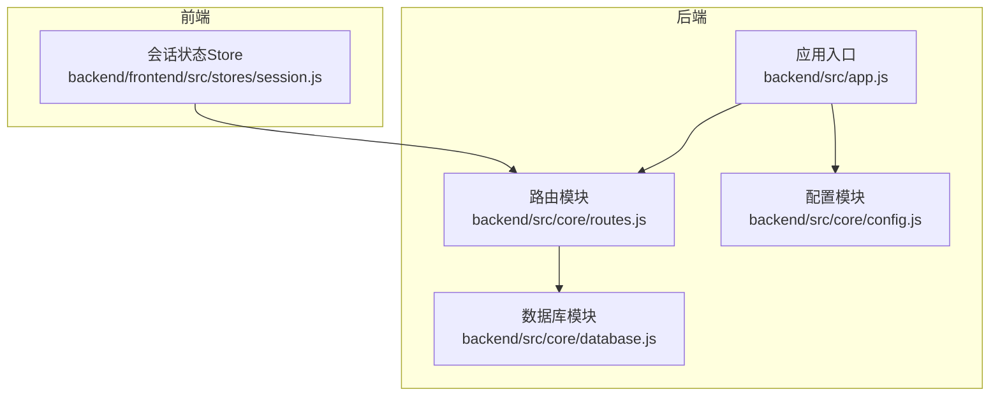
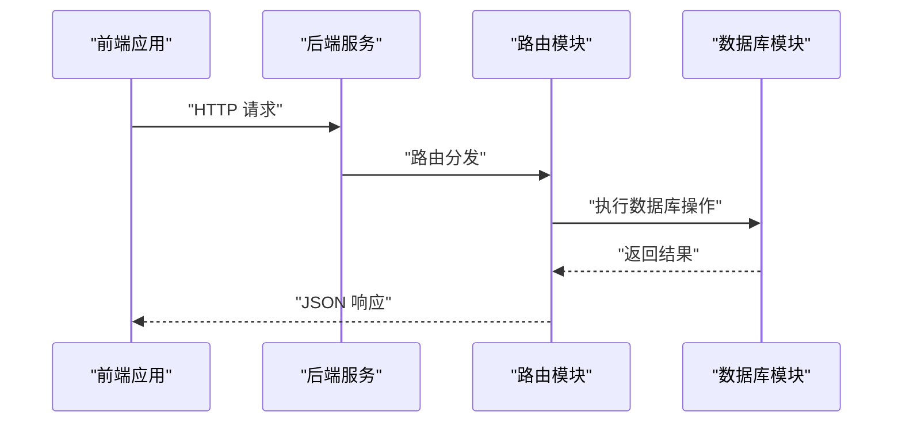
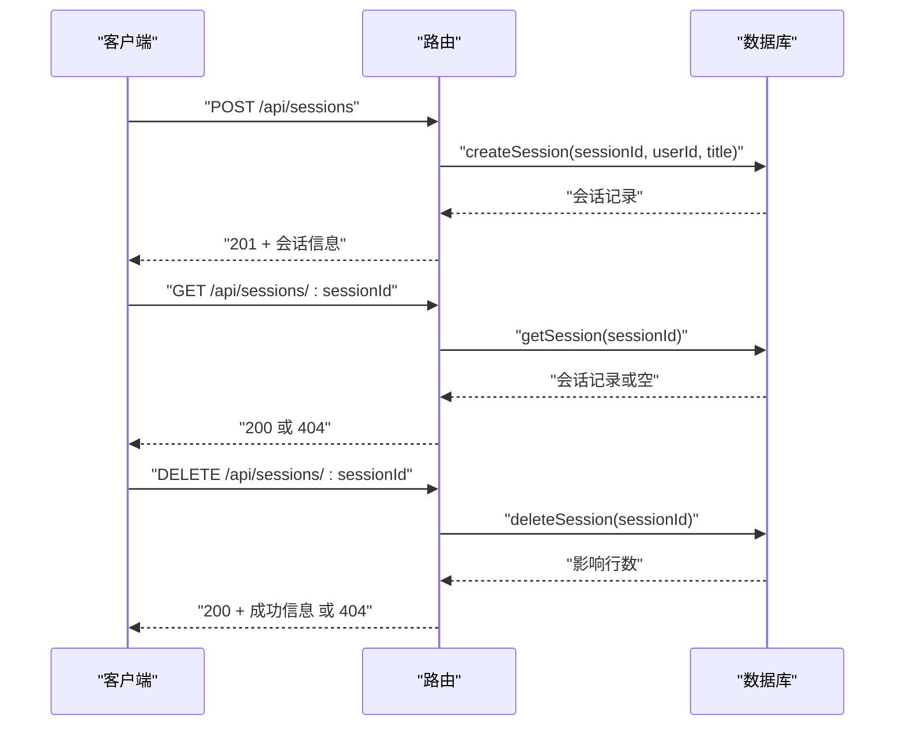
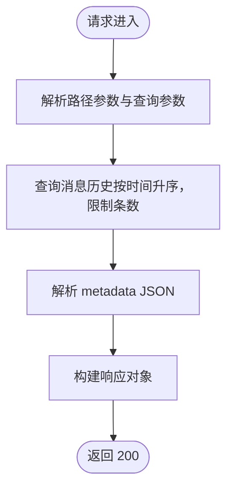
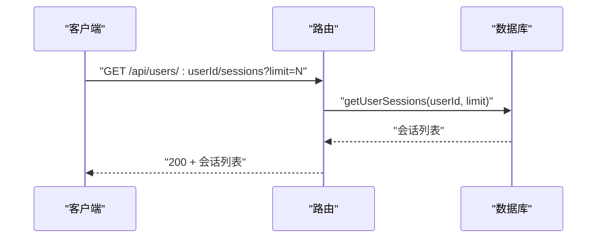
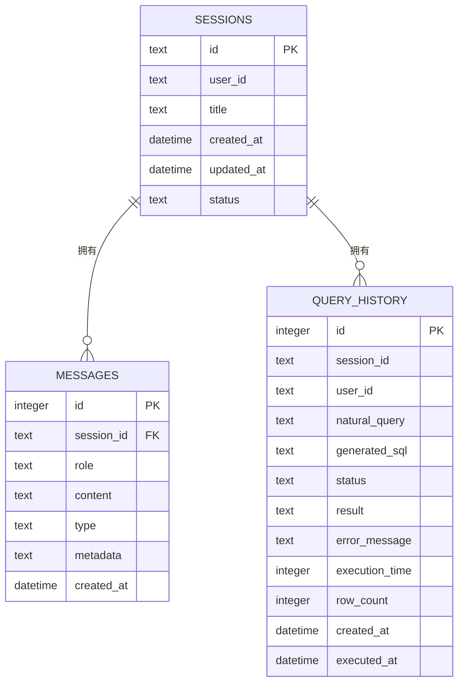
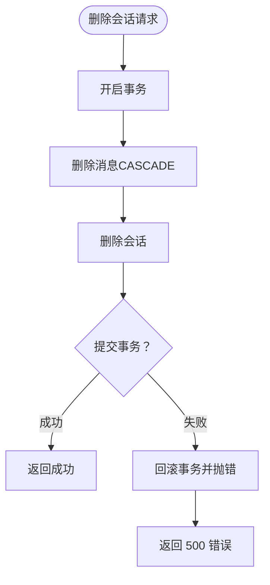
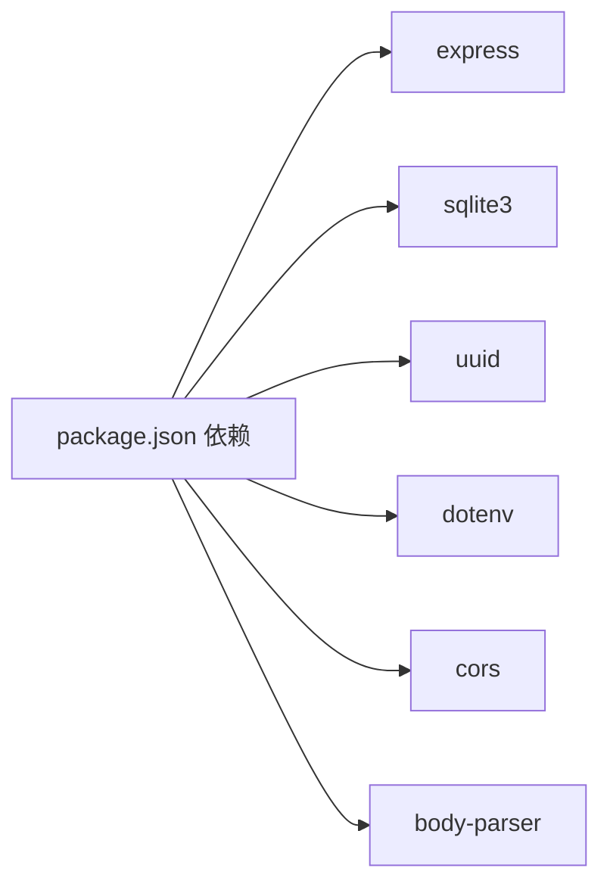

# 会话管理API

<cite>
**本文引用的文件**
- [backend/src/app.js](file://backend/src/app.js)
- [backend/src/core/routes.js](file://backend/src/core/routes.js)
- [backend/src/core/database.js](file://backend/src/core/database.js)
- [backend/src/core/config.js](file://backend/src/core/config.js)
- [backend/frontend/src/stores/session.js](file://backend/frontend/src/stores/session.js)
- [backend/package.json](file://backend/package.json)
</cite>

## 目录
1. [简介](#简介)
2. [项目结构](#项目结构)
3. [核心组件](#核心组件)
4. [架构概览](#架构概览)
5. [详细组件分析](#详细组件分析)
6. [依赖分析](#依赖分析)
7. [性能考虑](#性能考虑)
8. [故障排查指南](#故障排查指南)
9. [结论](#结论)

## 简介
本文件为 NL2SQL 项目的会话管理 API 参考文档，涵盖以下端点：
- POST /api/sessions：创建新会话
- GET /api/sessions/:sessionId：获取会话信息
- DELETE /api/sessions/:sessionId：删除会话
- GET /api/sessions/:sessionId/messages：获取会话消息历史
- GET /api/users/:userId/sessions：获取用户的所有会话

文档重点说明：
- 会话生命周期管理（创建、查询、删除）
- 消息历史获取与分页限制
- 用户会话列表查询
- 会话数据结构与消息格式
- 权限控制与安全配置
- 并发处理、数据一致性与错误恢复策略

## 项目结构
后端采用 Express 框架，路由集中于 routes 模块，数据库操作封装于 database 模块，配置由 config 模块统一管理。前端使用 Pinia 管理会话状态并与后端 API 交互。

**图表来源**
- [backend/src/app.js:1-266](file://backend/src/app.js#L1-L266)
- [backend/src/core/routes.js:1-800](file://backend/src/core/routes.js#L1-L800)
- [backend/src/core/database.js:1-800](file://backend/src/core/database.js#L1-L800)
- [backend/src/core/config.js:1-398](file://backend/src/core/config.js#L1-L398)
- [backend/frontend/src/stores/session.js:1-400](file://backend/frontend/src/stores/session.js#L1-L400)

**章节来源**
- [backend/src/app.js:1-266](file://backend/src/app.js#L1-L266)
- [backend/src/core/routes.js:1-800](file://backend/src/core/routes.js#L1-L800)
- [backend/src/core/database.js:1-800](file://backend/src/core/database.js#L1-L800)
- [backend/src/core/config.js:1-398](file://backend/src/core/config.js#L1-L398)
- [backend/frontend/src/stores/session.js:1-400](file://backend/frontend/src/stores/session.js#L1-L400)

## 核心组件
- 路由模块：定义并实现会话相关 API，负责请求校验、调用数据库模块并返回标准化响应。
- 数据库模块：封装 SQLite 表结构与 CRUD 操作，提供会话、消息、查询历史等数据访问方法。
- 配置模块：集中管理端口、数据库路径、会话过期时间、Token 预算、日志级别等配置。
- 前端 Store：管理会话列表、当前会话、消息历史与 SSE 连接状态，驱动 UI 与后端交互。

**章节来源**
- [backend/src/core/routes.js:252-398](file://backend/src/core/routes.js#L252-L398)
- [backend/src/core/database.js:39-195](file://backend/src/core/database.js#L39-L195)
- [backend/src/core/config.js:16-398](file://backend/src/core/config.js#L16-L398)
- [backend/frontend/src/stores/session.js:28-399](file://backend/frontend/src/stores/session.js#L28-L399)

## 架构概览
后端启动时初始化配置、数据库与向量数据库，挂载路由并启动 HTTP 服务器。会话管理 API 通过路由模块进入，调用数据库模块执行数据操作，最终返回 JSON 响应。

**图表来源**
- [backend/src/app.js:78-87](file://backend/src/app.js#L78-L87)
- [backend/src/core/routes.js:266-398](file://backend/src/core/routes.js#L266-L398)
- [backend/src/core/database.js:526-664](file://backend/src/core/database.js#L526-L664)

## 详细组件分析

### 会话生命周期管理
- 创建会话
  - 方法与路径：POST /api/sessions
  - 请求体字段：user_id（可选）、title（可选）
  - 行为：生成 UUID 作为会话 ID，写入 sessions 表，返回创建的会话信息
  - 响应：201 Created，包含 id、user_id、title
- 获取会话
  - 方法与路径：GET /api/sessions/:sessionId
  - 行为：根据会话 ID 查询 sessions 表，返回会话信息
  - 响应：200 OK 或 404 Not Found
- 删除会话
  - 方法与路径：DELETE /api/sessions/:sessionId
  - 行为：检查会话存在性，删除会话及其关联消息（CASCADE），返回成功信息
  - 响应：200 OK 或 404 Not Found

**图表来源**
- [backend/src/core/routes.js:266-345](file://backend/src/core/routes.js#L266-L345)
- [backend/src/core/database.js:526-608](file://backend/src/core/database.js#L526-L608)

**章节来源**
- [backend/src/core/routes.js:266-345](file://backend/src/core/routes.js#L266-L345)
- [backend/src/core/database.js:526-608](file://backend/src/core/database.js#L526-L608)

### 消息历史获取
- 获取消息历史
  - 方法与路径：GET /api/sessions/:sessionId/messages
  - 查询参数：limit（默认 50）
  - 行为：按创建时间升序查询 messages 表，解析 metadata JSON，返回消息列表
  - 响应：200 OK，包含 session_id、count、messages
- 消息格式
  - 字段：id、session_id、role、content、type、metadata、created_at
  - metadata：JSON 字符串，解析后为对象
  - type 取值：text、sql、result、error、clarify
  - role 取值：user、assistant、system、tool

**图表来源**
- [backend/src/core/routes.js:354-373](file://backend/src/core/routes.js#L354-L373)
- [backend/src/core/database.js:650-664](file://backend/src/core/database.js#L650-L664)

**章节来源**
- [backend/src/core/routes.js:354-373](file://backend/src/core/routes.js#L354-L373)
- [backend/src/core/database.js:650-664](file://backend/src/core/database.js#L650-L664)

### 用户会话列表
- 获取用户会话
  - 方法与路径：GET /api/users/:userId/sessions
  - 查询参数：limit（默认 20）
  - 行为：查询 sessions 表中 user_id 匹配且状态为 active 的会话，按 updated_at 降序返回
  - 响应：200 OK，包含 user_id、count、sessions

**图表来源**
- [backend/src/core/routes.js:379-398](file://backend/src/core/routes.js#L379-L398)
- [backend/src/core/database.js:552-560](file://backend/src/core/database.js#L552-L560)

**章节来源**
- [backend/src/core/routes.js:379-398](file://backend/src/core/routes.js#L379-L398)
- [backend/src/core/database.js:552-560](file://backend/src/core/database.js#L552-L560)

### 会话数据结构与消息格式
- 会话表（sessions）
  - 字段：id（主键）、user_id、title、created_at、updated_at、status（active/archived/deleted）
  - 索引：user_id、status、updated_at
- 消息表（messages）
  - 字段：id（自增主键）、session_id（外键，CASCADE 删除）、role、content、type、metadata、created_at
  - 索引：session_id、created_at
- 查询历史表（query_history）
  - 字段：id（自增主键）、session_id、user_id、natural_query、generated_sql、status、result、error_message、execution_time、row_count、created_at、executed_at
  - 索引：user_id、session_id、created_at、status

**图表来源**
- [backend/src/core/database.js:39-135](file://backend/src/core/database.js#L39-L135)

**章节来源**
- [backend/src/core/database.js:39-135](file://backend/src/core/database.js#L39-L135)

### 权限控制与安全配置
- CORS：允许任意来源跨域访问（开发环境）
- 安全配置项（来自配置模块）：
  - allowedTables：允许查询的表白名单
  - maxQueryRows：单次查询返回最大行数
  - queryTimeout：查询超时时间
  - forbiddenKeywords：禁止的关键字列表
  - sensitiveFields：查询结果中需脱敏的字段列表
- 建议：
  - 生产环境应配置具体的 CORS 源
  - 明确设置 ALLOWED_TABLES 白名单
  - 合理设置 MAX_QUERY_ROWS 与 QUERY_TIMEOUT，防止资源滥用

**章节来源**
- [backend/src/app.js:63-72](file://backend/src/app.js#L63-L72)
- [backend/src/core/config.js:140-170](file://backend/src/core/config.js#L140-L170)

### 并发处理、数据一致性与错误恢复
- 并发与一致性
  - 删除会话采用事务：先删除消息，再删除会话，保证外键约束下的数据一致性
  - 外键约束启用：PRAGMA foreign_keys = ON
- 错误恢复
  - 路由层捕获异常并返回 500 与错误信息
  - 应用启动阶段记录详细日志，异常时优雅关闭
- 前端交互
  - SSE 连接状态管理，断线重连与错误处理
  - 消息类型区分（result、clarify、error），UI 层据此渲染

**图表来源**
- [backend/src/core/database.js:589-608](file://backend/src/core/database.js#L589-L608)

**章节来源**
- [backend/src/core/database.js:234-242](file://backend/src/core/database.js#L234-L242)
- [backend/src/core/database.js:589-608](file://backend/src/core/database.js#L589-L608)
- [backend/src/core/routes.js:284-344](file://backend/src/core/routes.js#L284-L344)
- [backend/src/app.js:204-258](file://backend/src/app.js#L204-L258)
- [backend/frontend/src/stores/session.js:185-295](file://backend/frontend/src/stores/session.js#L185-L295)

## 依赖分析
- 后端依赖
  - express：Web 框架
  - sqlite3：SQLite 数据库驱动
  - uuid：生成会话 ID
  - dotenv、cors、body-parser：环境变量、跨域与请求体解析
- 前端依赖
  - pinia：状态管理
  - uuid：生成消息 ID
  - EventSource：SSE 连接

**图表来源**
- [backend/package.json:10-27](file://backend/package.json#L10-L27)

**章节来源**
- [backend/package.json:10-27](file://backend/package.json#L10-L27)

## 性能考虑
- 数据库索引：为 user_id、status、updated_at、created_at 等常用查询字段建立索引，提升查询效率
- 查询限制：消息历史与用户会话列表支持 limit 参数，避免一次性返回过多数据
- 事务与外键：删除会话使用事务与 CASCADE 删除，减少不一致风险
- 日志级别：生产环境建议降低日志级别，减少 I/O 压力
- 前端分页与增量渲染：结合 limit 参数与前端虚拟列表，优化大历史消息的渲染性能

## 故障排查指南
- 常见错误与处理
  - 会话不存在：404，检查会话 ID 是否正确
  - 数据库未初始化：启动时报错，确认数据库路径与权限
  - CORS 问题：生产环境需配置允许的源
- 日志定位
  - 启动日志：检查配置验证、数据库初始化、向量数据库初始化
  - 请求日志：查看路由中间件记录的请求信息
  - 异常日志：捕获未处理的 Promise 拒绝与未捕获异常，执行优雅关闭
- 建议
  - 在生产环境开启详细日志与错误上报
  - 对高频接口增加限流与熔断策略（可在网关层实现）

**章节来源**
- [backend/src/core/routes.js:46-54](file://backend/src/core/routes.js#L46-L54)
- [backend/src/app.js:97-194](file://backend/src/app.js#L97-L194)
- [backend/src/app.js:248-258](file://backend/src/app.js#L248-L258)

## 结论
NL2SQL 的会话管理 API 提供了完整的会话生命周期管理能力，配合 SQLite 数据库与合理的索引设计，能够满足中小规模场景下的会话与消息存储需求。通过配置模块集中管理各项参数，结合前端 Store 的状态管理与 SSE 实时通信，实现了良好的用户体验。生产环境中建议完善 CORS、白名单与超时限制等安全配置，并关注日志与监控，以保障稳定性与安全性。