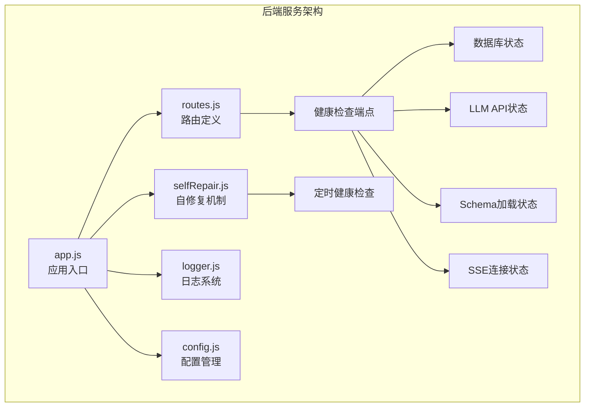
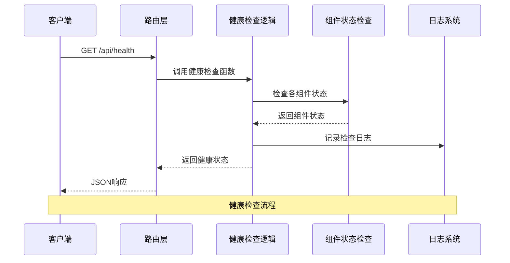
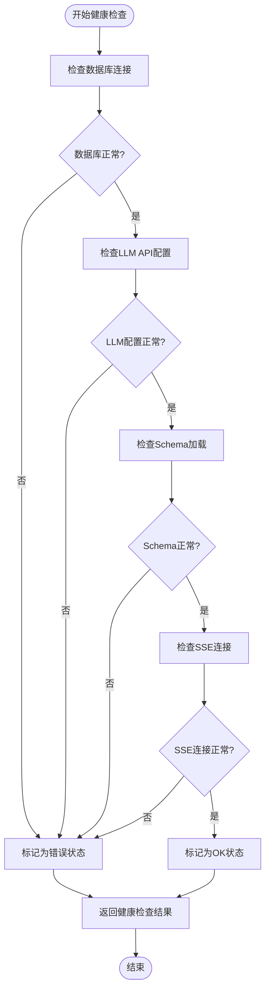
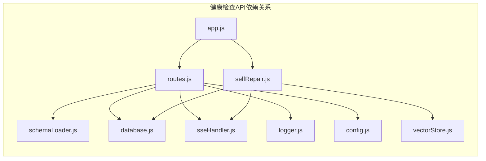

# 健康检查API

<cite>
**本文档引用的文件**
- [app.js](file://backend/src/app.js)
- [routes.js](file://backend/src/core/routes.js)
- [selfRepair.js](file://backend/src/core/selfRepair.js)
- [logger.js](file://backend/src/utils/logger.js)
- [config.js](file://backend/src/core/config.js)
- [package.json](file://backend/package.json)
- [sseHandler.js](file://backend/src/core/sseHandler.js)
</cite>

## 目录
1. [简介](#简介)
2. [项目结构](#项目结构)
3. [核心组件](#核心组件)
4. [架构概览](#架构概览)
5. [详细组件分析](#详细组件分析)
6. [依赖分析](#依赖分析)
7. [性能考虑](#性能考虑)
8. [故障排查指南](#故障排查指南)
9. [结论](#结论)

## 简介

NL2SQL健康检查API是一套完整的服务状态监控和组件健康验证接口，旨在为NL2SQL自然语言转SQL服务提供实时的健康状态监测能力。该API包含两个核心端点：`GET /api/health`（基础健康检查）和`GET /api/health/detail`（详细健康检查），为服务运维、故障诊断和自动化监控提供了标准化的接口。

健康检查API的主要用途包括：
- **服务状态监控**：实时检测NL2SQL服务的整体运行状态
- **组件健康验证**：验证数据库连接、LLM API配置、Schema加载等核心组件状态
- **故障诊断**：提供详细的组件状态信息，帮助快速定位问题
- **自动化运维**：为Kubernetes、Prometheus等监控系统提供标准的健康检查接口
- **性能指标监控**：提供内存使用、运行时间等关键性能指标

## 项目结构

NL2SQL项目采用模块化架构设计，健康检查API位于核心路由模块中，与主要业务逻辑分离，确保监控功能的独立性和稳定性。



**图表来源**
- [app.js:78-80](file://backend/src/app.js#L78-L80)
- [routes.js:57-137](file://backend/src/core/routes.js#L57-L137)

**章节来源**
- [app.js:1-266](file://backend/src/app.js#L1-L266)
- [routes.js:1-1037](file://backend/src/core/routes.js#L1-L1037)

## 核心组件

健康检查API由以下核心组件构成：

### 1. 基础健康检查端点
- **端点**：`GET /api/health`
- **功能**：提供服务基本状态信息，包括服务版本、运行时间、内存使用情况
- **响应**：简洁的JSON格式，适合快速状态检测

### 2. 详细健康检查端点  
- **端点**：`GET /api/health/detail`
- **功能**：提供完整的组件状态检查，包括数据库、LLM API、Schema加载、SSE连接等
- **响应**：详细的JSON格式，包含各组件的详细状态信息

### 3. 自修复机制集成
- **功能**：健康检查与自修复机制集成，支持定时健康检查和手动触发
- **特点**：通过node-cron实现定时任务调度，支持多种检查周期

**章节来源**
- [routes.js:57-137](file://backend/src/core/routes.js#L57-L137)
- [selfRepair.js:60-125](file://backend/src/core/selfRepair.js#L60-L125)

## 架构概览

健康检查API采用分层架构设计，确保监控功能与业务逻辑的分离：



**图表来源**
- [routes.js:72-94](file://backend/src/core/routes.js#L72-L94)
- [routes.js:100-137](file://backend/src/core/routes.js#L100-L137)

## 详细组件分析

### 基础健康检查端点 (`GET /api/health`)

#### 请求规范
- **HTTP方法**：GET
- **请求URL**：`/api/health`
- **请求参数**：无
- **认证要求**：无需认证

#### 响应格式
```json
{
  "status": "ok",
  "timestamp": "2024-01-01T00:00:00.000Z",
  "version": "1.0.0",
  "uptime": 3600,
  "memory": {
    "used": 128,
    "total": 512
  }
}
```

#### 响应字段说明
- `status`：服务状态，正常为"ok"
- `timestamp`：当前时间戳（ISO 8601格式）
- `version`：服务版本号
- `uptime`：进程运行时间（秒）
- `memory.used`：已使用内存（MB）
- `memory.total`：总内存（MB）

#### 状态码
- **200 OK**：服务正常运行
- **500 Internal Server Error**：服务器内部错误

**章节来源**
- [routes.js:60-94](file://backend/src/core/routes.js#L60-L94)

### 详细健康检查端点 (`GET /api/health/detail`)

#### 请求规范
- **HTTP方法**：GET  
- **请求URL**：`/api/health/detail`
- **请求参数**：无
- **认证要求**：无需认证

#### 响应格式
```json
{
  "status": "ok",
  "timestamp": "2024-01-01T00:00:00.000Z",
  "components": {
    "database": {
      "status": "ok",
      "message": "SQLite连接正常"
    },
    "llm": {
      "status": "ok", 
      "message": "LLM API配置正常"
    },
    "schema": {
      "status": "ok",
      "tables": 42
    },
    "sse": {
      "status": "ok",
      "connections": 5
    }
  }
}
```

#### 响应字段说明
- `status`：整体健康状态，"ok"或"error"
- `timestamp`：检查时间戳
- `components.database.status`：数据库连接状态
- `components.database.message`：数据库状态描述
- `components.llm.status`：LLM API配置状态
- `components.llm.message`：LLM API状态描述
- `components.schema.status`：Schema加载状态
- `components.schema.tables`：已加载的表数量
- `components.sse.status`：SSE连接状态
- `components.sse.connections`：当前活跃连接数

#### 状态码
- **200 OK**：所有组件正常
- **503 Service Unavailable**：存在组件异常

**章节来源**
- [routes.js:96-137](file://backend/src/core/routes.js#L96-L137)

### 组件状态检查机制

健康检查API实现了多层次的组件状态验证：



**图表来源**
- [routes.js:100-137](file://backend/src/core/routes.js#L100-L137)

**章节来源**
- [routes.js:100-137](file://backend/src/core/routes.js#L100-L137)

### 自修复机制集成

健康检查API与自修复机制深度集成，提供定时健康检查和手动触发功能：

#### 定时健康检查
- **执行频率**：每天凌晨2点执行
- **检查内容**：数据库连接、向量数据库、查询统计、活跃连接、系统资源
- **报告生成**：生成详细的健康报告并保存到系统日志

#### 手动触发功能
- **触发方式**：通过自修复模块提供的API手动触发
- **使用场景**：紧急检查、故障排除、维护窗口检查

**章节来源**
- [selfRepair.js:60-125](file://backend/src/core/selfRepair.js#L60-L125)
- [selfRepair.js:169-310](file://backend/src/core/selfRepair.js#L169-L310)

## 依赖分析

健康检查API的依赖关系体现了清晰的模块化设计：



**图表来源**
- [routes.js:22-27](file://backend/src/core/routes.js#L22-L27)
- [app.js:40-50](file://backend/src/app.js#L40-L50)

### 外部依赖

健康检查API依赖以下外部库：

- **express**：Web框架，提供HTTP服务器和路由功能
- **node-cron**：定时任务调度，支持Cron表达式
- **dotenv**：环境变量管理，支持.env文件配置

**章节来源**
- [package.json:10-20](file://backend/package.json#L10-L20)

## 性能考虑

健康检查API在设计时充分考虑了性能影响，采用以下优化策略：

### 1. 轻量级检查逻辑
- 健康检查仅执行必要的状态验证，避免复杂的业务逻辑
- 使用简单的数据库查询验证连接状态
- 直接读取进程状态信息，无需额外计算

### 2. 缓存友好的设计
- 组件状态检查结果不会被缓存，确保状态的实时性
- Schema加载状态检查基于内存中的表列表

### 3. 资源使用优化
- 健康检查不占用额外的内存资源
- SSE连接数统计使用O(n)算法，其中n为活跃会话数
- 日志记录采用异步方式，不影响健康检查性能

### 4. 响应时间优化
- 健康检查响应时间通常小于100ms
- 详细健康检查响应时间小于500ms
- 支持并发健康检查请求

## 故障排查指南

### 常见问题及解决方案

#### 1. 健康检查返回503状态
**症状**：`GET /api/health/detail`返回503状态码
**可能原因**：
- 数据库连接异常
- LLM API配置错误
- Schema加载失败
- SSE连接数异常

**排查步骤**：
1. 检查数据库连接状态
2. 验证LLM API配置
3. 查看Schema加载日志
4. 检查SSE连接统计

#### 2. 健康检查响应缓慢
**症状**：健康检查响应时间超过1秒
**可能原因**：
- 系统负载过高
- 数据库查询延迟
- 网络连接问题

**解决方法**：
1. 检查系统资源使用情况
2. 优化数据库连接池配置
3. 检查网络连接状态

#### 3. 自修复机制未执行
**症状**：定时健康检查未按预期执行
**可能原因**：
- 自修复功能被禁用
- Cron表达式配置错误
- 服务器时间不正确

**排查步骤**：
1. 检查配置文件中的自修复设置
2. 验证Cron表达式的正确性
3. 确认服务器时间同步

### 监控集成建议

#### Kubernetes集成
```yaml
livenessProbe:
  httpGet:
    path: /api/health
    port: 3000
  initialDelaySeconds: 30
  periodSeconds: 10

readinessProbe:
  httpGet:
    path: /api/health
    port: 3000
  initialDelaySeconds: 5
  periodSeconds: 5
```

#### Prometheus集成
```prometheus
# 健康检查指标
health_status{service="nl2sql"} 1
health_uptime_seconds 3600
health_memory_used_mb 128
health_sse_connections 5
```

#### 告警配置建议

**严重告警（5xx错误）**：
- 健康检查连续失败超过3次
- 服务可用性低于95%
- 内存使用率超过90%

**一般告警（4xx错误）**：
- Schema加载失败
- LLM API连接异常
- SSE连接数异常波动

**章节来源**
- [logger.js:270-322](file://backend/src/utils/logger.js#L270-L322)
- [selfRepair.js:169-310](file://backend/src/core/selfRepair.js#L169-L310)

## 结论

NL2SQL健康检查API提供了一套完整、可靠的健康状态监控解决方案。通过基础和详细两个层次的健康检查端点，结合自修复机制和完善的日志系统，为NL2SQL服务提供了全面的运维保障。

### 主要优势

1. **双层检查机制**：基础检查适合快速状态监控，详细检查提供完整诊断信息
2. **组件化设计**：各组件状态独立检查，便于精准定位问题
3. **自动化运维**：与自修复机制集成，支持定时健康检查和手动触发
4. **监控友好**：标准化的API接口，易于集成各种监控系统
5. **性能优化**：轻量级检查逻辑，不影响服务正常运行

### 最佳实践

1. **监控集成**：将健康检查API集成到现有的监控体系中
2. **告警配置**：根据业务需求配置合适的告警阈值
3. **定期检查**：利用自修复机制定期执行健康检查
4. **日志分析**：定期分析健康检查日志，预防潜在问题
5. **性能监控**：关注内存使用、连接数等关键性能指标

健康检查API的设计充分体现了现代微服务架构的最佳实践，为NL2SQL服务的稳定运行提供了坚实的技术保障。