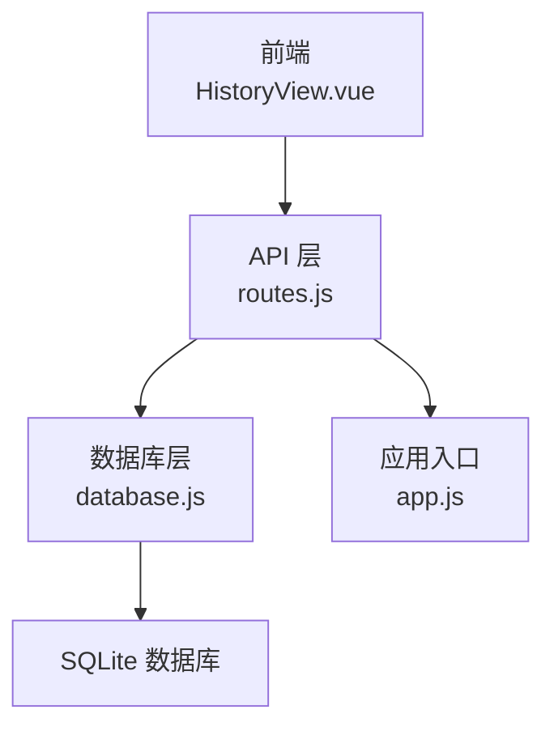
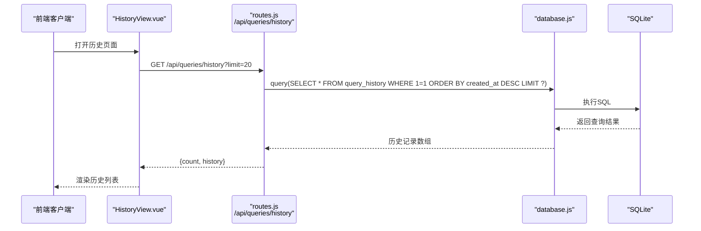
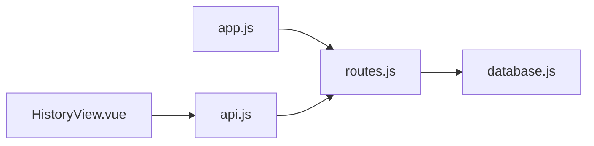

# 查询历史API

<cite>
**本文引用的文件**
- [routes.js](file://backend/src/core/routes.js)
- [database.js](file://backend/src/core/database.js)
- [app.js](file://backend/src/app.js)
- [HistoryView.vue](file://frontend/src/views/HistoryView.vue)
- [api.js](file://frontend/src/utils/api.js)
- [selfRepair.js](file://backend/src/core/selfRepair.js)
</cite>

## 目录
1. [简介](#简介)
2. [项目结构](#项目结构)
3. [核心组件](#核心组件)
4. [架构概览](#架构概览)
5. [详细组件分析](#详细组件分析)
6. [依赖分析](#依赖分析)
7. [性能考虑](#性能考虑)
8. [故障排查指南](#故障排查指南)
9. [结论](#结论)

## 简介
本文档为 NL2SQL 项目的查询历史 API 提供完整参考，重点覆盖 GET /api/queries/history 端点的实现与使用。内容涵盖：
- 查询历史的数据结构与筛选条件
- 分页机制与时间范围查询
- 历史数据存储格式与索引设计
- 查询优化策略与数据清理机制
- 隐私保护措施与数据分析实践

## 项目结构
NL2SQL 后端采用 Express 框架，API 路由集中在 routes.js 中，数据库操作封装在 database.js 中，前端通过 HistoryView.vue 与 api.js 调用查询历史接口。

图表来源
- [routes.js:401-450](file://backend/src/core/routes.js#L401-L450)
- [database.js:94-135](file://backend/src/core/database.js#L94-L135)
- [app.js:78-80](file://backend/src/app.js#L78-L80)

章节来源
- [routes.js:401-450](file://backend/src/core/routes.js#L401-L450)
- [database.js:94-135](file://backend/src/core/database.js#L94-L135)
- [app.js:78-80](file://backend/src/app.js#L78-L80)

## 核心组件
- 路由层：定义 /api/queries/history 端点，支持 user_id、session_id、limit 等查询参数。
- 数据库层：提供 query_history 表结构与索引，支持按用户、会话、状态、时间排序的高效查询。
- 应用入口：挂载路由并初始化数据库与向量数据库。
- 前端视图：HistoryView.vue 通过 api.js 调用 /api/queries/history，实现历史记录展示与分页。

章节来源
- [routes.js:401-450](file://backend/src/core/routes.js#L401-L450)
- [database.js:94-135](file://backend/src/core/database.js#L94-L135)
- [app.js:78-80](file://backend/src/app.js#L78-L80)
- [HistoryView.vue:226-243](file://frontend/src/views/HistoryView.vue#L226-L243)
- [api.js:206-208](file://frontend/src/utils/api.js#L206-L208)

## 架构概览
查询历史 API 的调用链路如下：

图表来源
- [routes.js:413-450](file://backend/src/core/routes.js#L413-L450)
- [database.js:429-448](file://backend/src/core/database.js#L429-L448)
- [HistoryView.vue:226-243](file://frontend/src/views/HistoryView.vue#L226-L243)
- [api.js:206-208](file://frontend/src/utils/api.js#L206-L208)

## 详细组件分析

### 查询历史数据模型
query_history 表包含以下关键字段：
- id：自增主键
- session_id：所属会话ID（外键）
- user_id：用户标识
- natural_query：用户自然语言查询
- generated_sql：生成的SQL语句
- status：执行状态（pending/success/failed）
- result：查询结果（JSON字符串）
- error_message：错误信息（失败时）
- execution_time：执行耗时（毫秒）
- row_count：返回行数
- created_at：创建时间
- executed_at：执行时间

为提升查询性能，建立了以下索引：
- idx_query_history_user_id：按用户ID查询
- idx_query_history_session_id：按会话ID查询
- idx_query_history_created_at：按时间排序
- idx_query_history_status：按状态筛选

章节来源
- [database.js:94-135](file://backend/src/core/database.js#L94-L135)

### 路由实现与筛选条件
GET /api/queries/history 的实现要点：
- 查询参数支持：
  - user_id：用户ID筛选
  - session_id：会话ID筛选
  - limit：返回数量限制（默认20）
- SQL 构造：
  - 基础查询：SELECT * FROM query_history WHERE 1=1
  - 动态追加条件：user_id、session_id
  - 排序与限制：ORDER BY created_at DESC LIMIT ?
- 返回结构：
  - count：历史记录数量
  - history：历史记录数组

章节来源
- [routes.js:404-450](file://backend/src/core/routes.js#L404-L450)

### 分页机制
- 前端通过 HistoryView.vue 的分页组件控制每页数量与当前页码
- 前端调用时传入 limit 与 offset（由 page 与 pageSize 计算）
- 后端仅接收 limit 参数，不直接支持 offset；前端需自行计算 offset

章节来源
- [HistoryView.vue:173-177](file://frontend/src/views/HistoryView.vue#L173-L177)
- [HistoryView.vue:277-289](file://frontend/src/views/HistoryView.vue#L277-L289)
- [api.js:230-233](file://frontend/src/utils/api.js#L230-L233)

### 时间范围查询
- 后端未直接提供时间范围参数，但可通过以下方式实现：
  - 在前端对返回的历史记录进行时间范围过滤
  - 或扩展后端路由，增加 start_time、end_time 参数并在 SQL 中追加时间范围条件

章节来源
- [routes.js:413-450](file://backend/src/core/routes.js#L413-L450)
- [HistoryView.vue:206-214](file://frontend/src/views/HistoryView.vue#L206-L214)

### 查询优化策略
- 索引优化：query_history 表已建立多处索引，支持按用户、会话、时间、状态的高效查询
- 参数化查询：使用占位符避免 SQL 注入
- 排序优化：按 created_at DESC 排序，结合 LIMIT 限制返回数量
- 建议：如需频繁按时间范围查询，可在数据库层增加时间范围索引或物化视图

章节来源
- [database.js:127-134](file://backend/src/core/database.js#L127-L134)
- [routes.js:417-439](file://backend/src/core/routes.js#L417-L439)

### 数据清理机制
- 自修复任务：定期检查查询统计与慢查询，生成健康报告
- 会话清理：定期归档长时间未活跃的会话
- 记忆维护：压缩与清理过期记忆，保持系统健康

章节来源
- [selfRepair.js:220-310](file://backend/src/core/selfRepair.js#L220-L310)
- [selfRepair.js:341-373](file://backend/src/core/selfRepair.js#L341-L373)
- [selfRepair.js:383-415](file://backend/src/core/selfRepair.js#L383-L415)

### 隐私保护措施
- 数据最小化：仅存储必要的查询历史与执行结果
- 索引设计：通过 user_id 索引实现按用户隔离
- 前端过滤：前端可对历史记录进行本地过滤，减少敏感信息传输
- 建议：如需更强隐私保护，可在后端增加数据脱敏与访问控制

章节来源
- [database.js:94-135](file://backend/src/core/database.js#L94-L135)
- [routes.js:413-450](file://backend/src/core/routes.js#L413-L450)

### 历史数据分析与趋势统计
- 健康检查：自修复任务统计查询成功率、失败率与平均执行时间
- 建议：可扩展接口，提供按用户、时间、状态的聚合统计，支持趋势分析与使用模式挖掘

章节来源
- [selfRepair.js:220-250](file://backend/src/core/selfRepair.js#L220-L250)

## 依赖分析
- 路由依赖数据库模块，通过 query 方法执行 SQL
- 应用入口挂载路由并初始化数据库
- 前端通过 api.js 封装的 axios 实例调用 /api/queries/history

图表来源
- [routes.js:401-450](file://backend/src/core/routes.js#L401-L450)
- [database.js:429-448](file://backend/src/core/database.js#L429-L448)
- [app.js:78-80](file://backend/src/app.js#L78-L80)
- [HistoryView.vue:226-243](file://frontend/src/views/HistoryView.vue#L226-L243)
- [api.js:206-208](file://frontend/src/utils/api.js#L206-L208)

章节来源
- [routes.js:401-450](file://backend/src/core/routes.js#L401-L450)
- [database.js:429-448](file://backend/src/core/database.js#L429-L448)
- [app.js:78-80](file://backend/src/app.js#L78-L80)
- [HistoryView.vue:226-243](file://frontend/src/views/HistoryView.vue#L226-L243)
- [api.js:206-208](file://frontend/src/utils/api.js#L206-L208)

## 性能考虑
- 索引利用：确保 user_id、session_id、created_at、status 索引被有效使用
- 查询限制：合理设置 limit，避免一次性返回大量历史记录
- 前端分页：通过前端分页减少后端压力
- 缓存策略：对热点用户的历史记录可考虑短期缓存

## 故障排查指南
- 404/400 错误：检查请求参数是否正确，特别是 user_id、session_id、limit
- 500 错误：查看后端日志，确认数据库连接与 SQL 执行是否正常
- 性能问题：检查索引使用情况，必要时增加时间范围索引
- 健康检查：通过 /api/health 与 /api/health/detail 确认服务状态

章节来源
- [routes.js:444-449](file://backend/src/core/routes.js#L444-L449)
- [app.js:97-194](file://backend/src/app.js#L97-L194)

## 结论
查询历史 API 提供了按用户与会话维度的历史记录查询能力，配合 SQLite 的索引设计与自修复机制，能够满足日常查询历史的检索需求。建议在后续版本中增加时间范围查询参数与更丰富的统计接口，以支持更深入的历史数据分析与趋势统计。