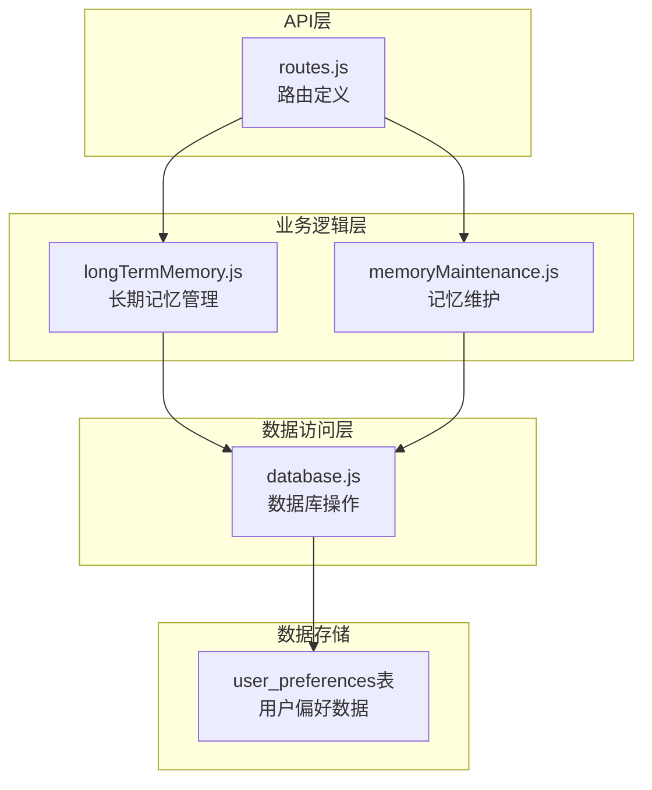
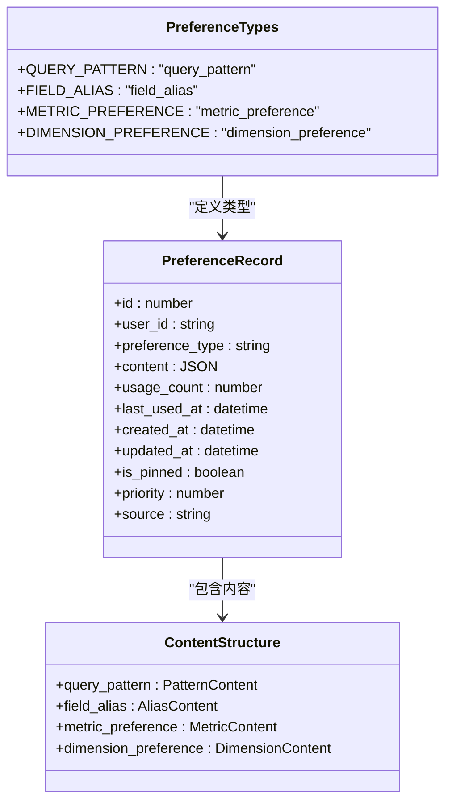
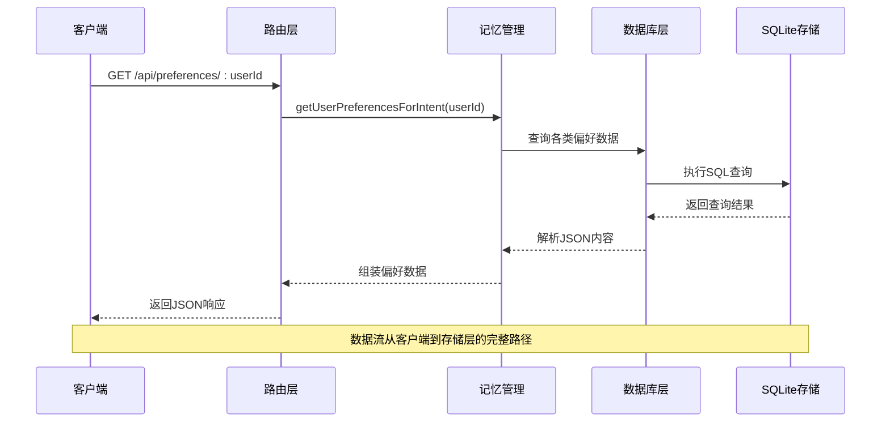
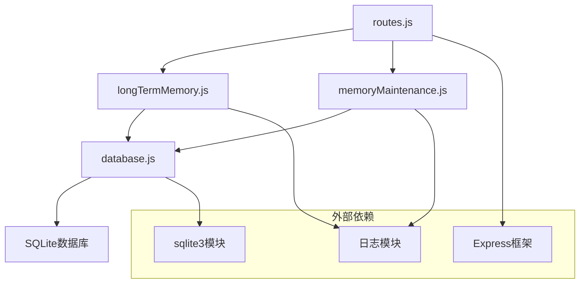
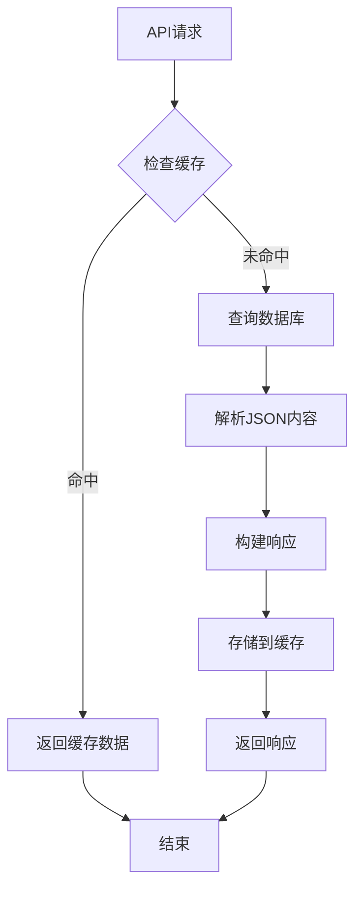

# 偏好数据端点

<cite>
**本文档引用的文件**
- [routes.js](file://backend/src/core/routes.js)
- [longTermMemory.js](file://backend/src/memory/longTermMemory.js)
- [memoryMaintenance.js](file://backend/src/memory/memoryMaintenance.js)
- [database.js](file://backend/src/core/database.js)
</cite>

## 目录
1. [简介](#简介)
2. [项目结构](#项目结构)
3. [核心组件](#核心组件)
4. [架构概览](#架构概览)
5. [详细组件分析](#详细组件分析)
6. [依赖分析](#依赖分析)
7. [性能考虑](#性能考虑)
8. [故障排除指南](#故障排除指南)
9. [结论](#结论)

## 简介

本文档详细说明了NL2SQL系统中偏好数据获取相关端点的实现。重点关注三个核心端点：

- GET /api/preferences/:userId - 获取用户偏好列表
- GET /api/preferences/:userId/raw - 获取用户偏好原始数据
- GET /api/preferences/:userId/stats - 获取用户偏好统计信息

这些端点实现了用户长期记忆管理的核心功能，包括查询模式、字段别名、指标偏好和维度偏好的存储、检索和管理。

## 项目结构

偏好数据相关功能分布在以下模块中：



**图表来源**
- [routes.js:456-592](file://backend/src/core/routes.js#L456-L592)
- [longTermMemory.js:1-50](file://backend/src/memory/longTermMemory.js#L1-L50)
- [memoryMaintenance.js:1-20](file://backend/src/memory/memoryMaintenance.js#L1-L20)
- [database.js:137-171](file://backend/src/core/database.js#L137-L171)

**章节来源**
- [routes.js:456-592](file://backend/src/core/routes.js#L456-L592)
- [longTermMemory.js:1-50](file://backend/src/memory/longTermMemory.js#L1-L50)
- [memoryMaintenance.js:1-20](file://backend/src/memory/memoryMaintenance.js#L1-L20)
- [database.js:137-171](file://backend/src/core/database.js#L137-L171)

## 核心组件

### 偏好数据类型系统

系统支持四种主要的偏好数据类型：



**图表来源**
- [longTermMemory.js:38-43](file://backend/src/memory/longTermMemory.js#L38-L43)
- [database.js:140-163](file://backend/src/core/database.js#L140-L163)

### 数据库表结构

用户偏好数据存储在SQLite数据库的`user_preferences`表中：

| 字段名 | 类型 | 描述 | 约束 |
|--------|------|------|------|
| id | INTEGER | 主键自增 | PRIMARY KEY |
| user_id | TEXT | 用户标识 | NOT NULL |
| preference_type | TEXT | 偏好类型 | NOT NULL |
| content | TEXT | JSON内容 | NOT NULL |
| usage_count | INTEGER | 使用次数 | DEFAULT 1 |
| last_used_at | DATETIME | 最后使用时间 | |
| created_at | DATETIME | 创建时间 | DEFAULT CURRENT_TIMESTAMP |
| updated_at | DATETIME | 更新时间 | DEFAULT CURRENT_TIMESTAMP |
| is_pinned | INTEGER | 是否置顶 | DEFAULT 0 |
| priority | INTEGER | 优先级 | DEFAULT 0 |
| source | TEXT | 来源类型 | DEFAULT 'auto' |

**章节来源**
- [database.js:140-163](file://backend/src/core/database.js#L140-L163)

## 架构概览

偏好数据端点采用分层架构设计：



**图表来源**
- [routes.js:553-592](file://backend/src/core/routes.js#L553-L592)
- [longTermMemory.js:979-1000](file://backend/src/memory/longTermMemory.js#L979-L1000)
- [database.js:695-717](file://backend/src/core/database.js#L695-L717)

## 详细组件分析

### GET /api/preferences/:userId 端点

#### 功能概述
获取用户的偏好列表，支持按类型筛选和数量限制。

#### 查询参数
- `type` (可选): 偏好类型筛选
  - `query_pattern`: 查询模式
  - `field_alias`: 字段别名
  - `metric_preference`: 常用指标
  - `dimension_preference`: 常用维度
- `limit` (可选): 返回数量限制，默认50

#### 响应格式
```json
{
  "success": true,
  "user_id": "string",
  "data": {
    "patterns": [
      {
        "id": 1,
        "content": {
          "name": "模式名称",
          "dimensions": ["维度1", "维度2"],
          "metrics": ["指标1"],
          "default_time_range": {
            "type": "relative",
            "value": "最近7天"
          }
        },
        "usage_count": 5,
        "created_at": "2024-01-01T00:00:00Z"
      }
    ],
    "aliases": [
      {
        "id": 2,
        "content": {
          "user_term": "用户术语",
          "schema_field": "目标字段",
          "field_type": "metric|dimension|filter"
        },
        "usage_count": 3
      }
    ],
    "metrics": [
      {
        "id": 3,
        "content": {
          "field_name": "指标名称",
          "last_query": "最后查询"
        },
        "usage_count": 8
      }
    ],
    "dimensions": [
      {
        "id": 4,
        "content": {
          "field_name": "维度名称"
        },
        "usage_count": 6
      }
    ]
  }
}
```

#### 错误处理
- 404: 用户不存在
- 500: 服务器内部错误

**章节来源**
- [routes.js:545-592](file://backend/src/core/routes.js#L545-L592)
- [longTermMemory.js:979-1000](file://backend/src/memory/longTermMemory.js#L979-L1000)
- [database.js:695-717](file://backend/src/core/database.js#L695-L717)

### GET /api/preferences/:userId/raw 端点

#### 功能概述
获取用户偏好原始数据，用于调试和开发目的。

#### 查询参数
- `type` (可选): 偏好类型筛选
  - 支持所有四种偏好类型

#### 响应格式
```json
{
  "success": true,
  "user_id": "string",
  "total_count": 15,
  "data": {
    "all": [
      {
        "id": 1,
        "user_id": "user123",
        "preference_type": "field_alias",
        "content": {
          "user_term": "用户术语",
          "schema_field": "目标字段",
          "field_type": "metric"
        },
        "usage_count": 5,
        "created_at": "2024-01-01T00:00:00Z",
        "updated_at": "2024-01-01T00:00:00Z"
      }
    ],
    "grouped": {
      "field_alias": [],
      "query_pattern": [],
      "metric_preference": [],
      "dimension_preference": []
    }
  }
}
```

#### 数据过滤机制
- 支持按偏好类型过滤
- 自动解析JSON内容字段
- 按类型分组显示

**章节来源**
- [routes.js:456-517](file://backend/src/core/routes.js#L456-L517)

### GET /api/preferences/:userId/stats 端点

#### 功能概述
获取用户的偏好统计信息，包括总数和按类型的分布。

#### 响应格式
```json
{
  "success": true,
  "user_id": "string",
  "data": {
    "total": 15,
    "byType": [
      {
        "preference_type": "field_alias",
        "count": 5,
        "avg_usage": 3.2,
        "max_usage": 8,
        "oldest_use": "2024-01-01T00:00:00Z"
      },
      {
        "preference_type": "query_pattern",
        "count": 3,
        "avg_usage": 2.7,
        "max_usage": 5,
        "oldest_use": "2024-01-01T00:00:00Z"
      }
    ]
  }
}
```

#### 统计信息内容
- 总记录数
- 按偏好的类型分布
- 平均使用次数
- 最大使用次数
- 最早使用时间

**章节来源**
- [routes.js:519-543](file://backend/src/core/routes.js#L519-L543)
- [memoryMaintenance.js:326-355](file://backend/src/memory/memoryMaintenance.js#L326-L355)

### 偏好数据结构详解

#### 查询模式 (query_pattern)
```json
{
  "name": "按日期统计收入",
  "dimensions": ["日期", "地区"],
  "metrics": ["收入"],
  "default_time_range": {
    "type": "relative",
    "value": "最近7天"
  }
}
```

#### 字段别名 (field_alias)
```json
{
  "user_term": "收入",
  "schema_field": "income_amount",
  "field_type": "metric"
}
```

#### 指标偏好 (metric_preference)
```json
{
  "field_name": "DAU",
  "last_query": "查询日活跃用户数"
}
```

#### 维度偏好 (dimension_preference)
```json
{
  "field_name": "渠道"
}
```

**章节来源**
- [longTermMemory.js:662-682](file://backend/src/memory/longTermMemory.js#L662-L682)
- [longTermMemory.js:808-823](file://backend/src/memory/longTermMemory.js#L808-L823)

## 依赖分析



**图表来源**
- [routes.js:17-30](file://backend/src/core/routes.js#L17-L30)
- [longTermMemory.js:17-22](file://backend/src/memory/longTermMemory.js#L17-L22)
- [memoryMaintenance.js:16-18](file://backend/src/memory/memoryMaintenance.js#L16-L18)
- [database.js:13-19](file://backend/src/core/database.js#L13-L19)

### 数据访问权限控制

系统采用基于用户ID的简单访问控制机制：

1. **参数验证**: 路由层验证`userId`参数的存在性和有效性
2. **数据隔离**: 所有查询都强制绑定到特定用户ID
3. **无认证机制**: 当前实现未包含用户身份认证逻辑
4. **错误处理**: 对于不存在的用户返回适当的错误状态

**章节来源**
- [routes.js:553-592](file://backend/src/core/routes.js#L553-L592)

## 性能考虑

### 查询优化策略

1. **索引使用**
   - `user_id`索引：加速按用户查询
   - `preference_type`索引：加速按类型筛选
   - 复合索引：`user_id + preference_type`优化联合查询

2. **查询限制**
   - 默认限制返回数量（50条）
   - 支持自定义limit参数
   - 按使用次数和最后使用时间排序

3. **内存管理**
   - 异步查询处理
   - Promise并行查询优化
   - JSON解析延迟处理

### 缓存策略



**图表来源**
- [database.js:695-717](file://backend/src/core/database.js#L695-L717)

## 故障排除指南

### 常见错误及解决方案

#### 1. 数据库连接问题
**症状**: 500 Internal Server Error
**原因**: 数据库初始化失败或连接断开
**解决方案**: 
- 检查数据库文件权限
- 验证SQLite3模块安装
- 确认数据库文件完整性

#### 2. 用户ID无效
**症状**: 404 Not Found
**原因**: 用户ID不存在或格式不正确
**解决方案**:
- 验证用户ID格式
- 确认用户已在系统中注册
- 检查大小写敏感性

#### 3. 查询超时
**症状**: 请求处理时间过长
**原因**: 大量偏好数据或复杂查询
**解决方案**:
- 使用limit参数限制返回数量
- 优化数据库索引
- 实施查询结果缓存

#### 4. JSON解析错误
**症状**: 内容字段解析失败
**原因**: 存储的JSON格式不正确
**解决方案**:
- 验证content字段格式
- 检查JSON序列化过程
- 实施数据验证机制

**章节来源**
- [routes.js:536-542](file://backend/src/core/routes.js#L536-L542)
- [database.js:712-716](file://backend/src/core/database.js#L712-L716)

## 结论

偏好数据端点系统提供了完整的用户长期记忆管理功能，具有以下特点：

1. **模块化设计**: 清晰的分层架构，职责分离明确
2. **灵活的数据模型**: 支持多种偏好类型和复杂的嵌套结构
3. **性能优化**: 合理的索引策略和查询限制
4. **扩展性强**: 易于添加新的偏好类型和功能

建议的后续改进方向：
- 添加用户身份认证机制
- 实施更精细的权限控制
- 增加数据备份和恢复功能
- 优化大数据量场景下的性能表现