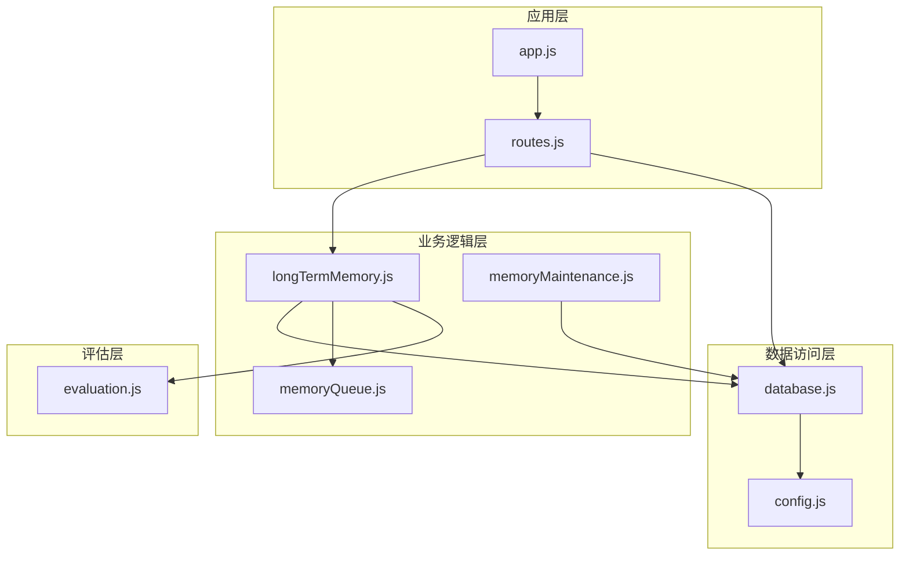
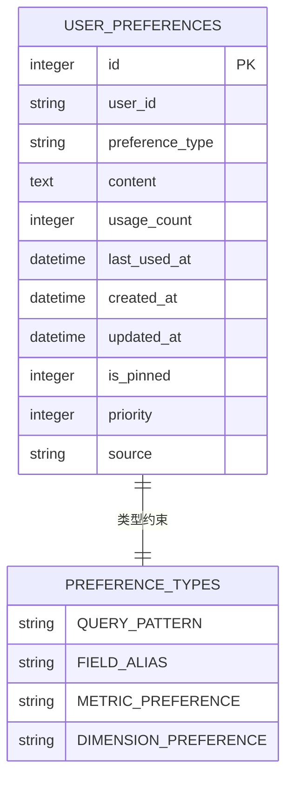
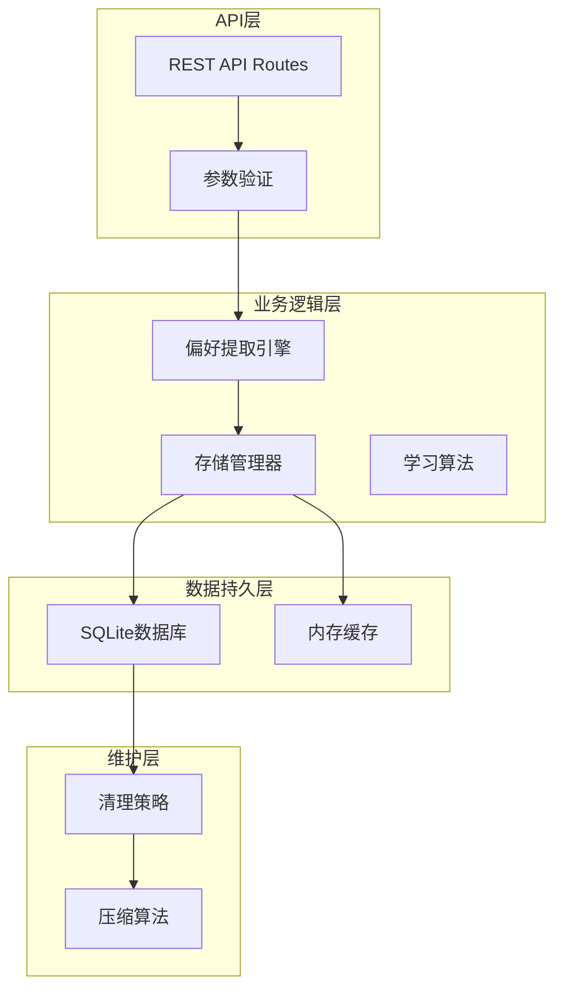
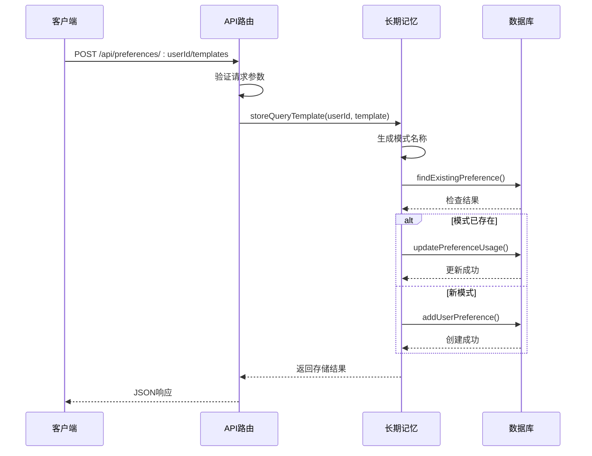
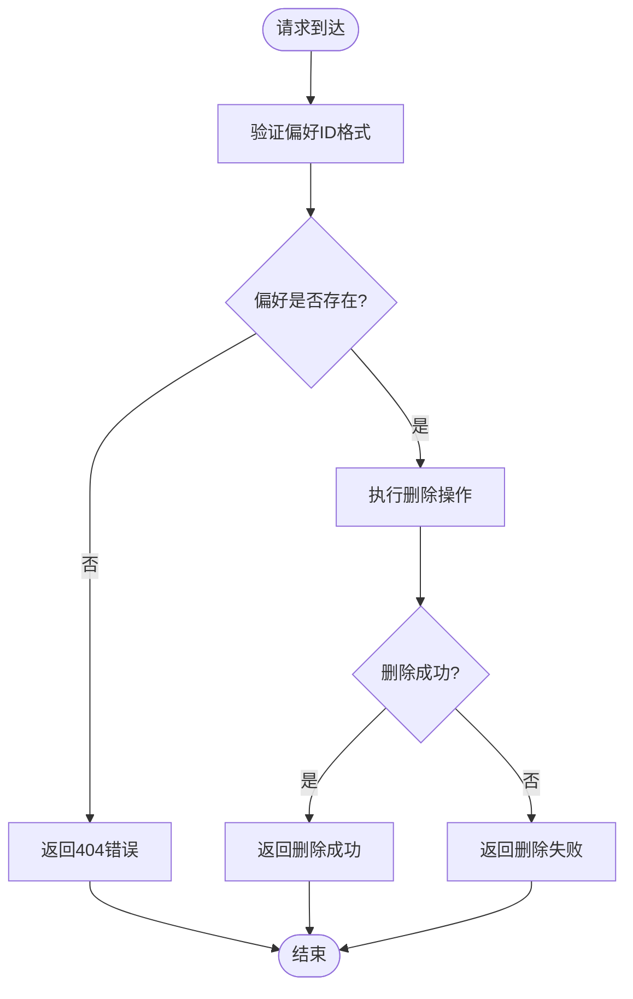
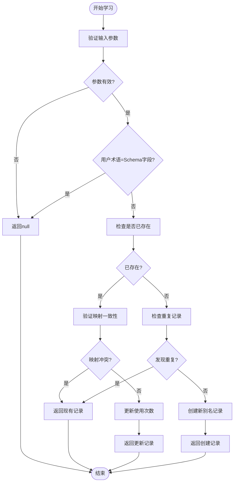
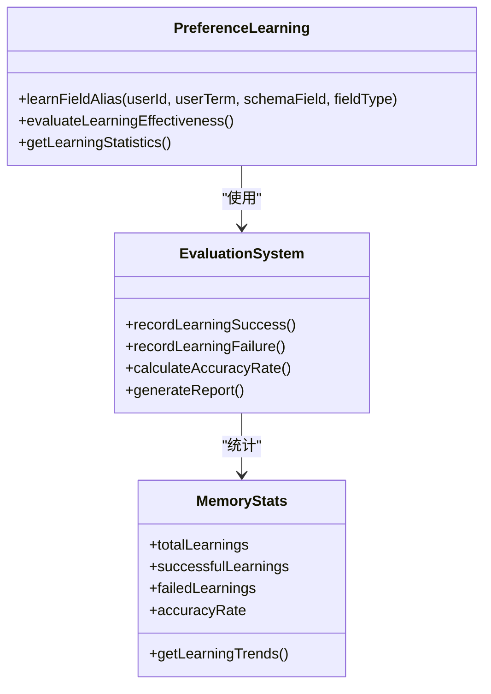
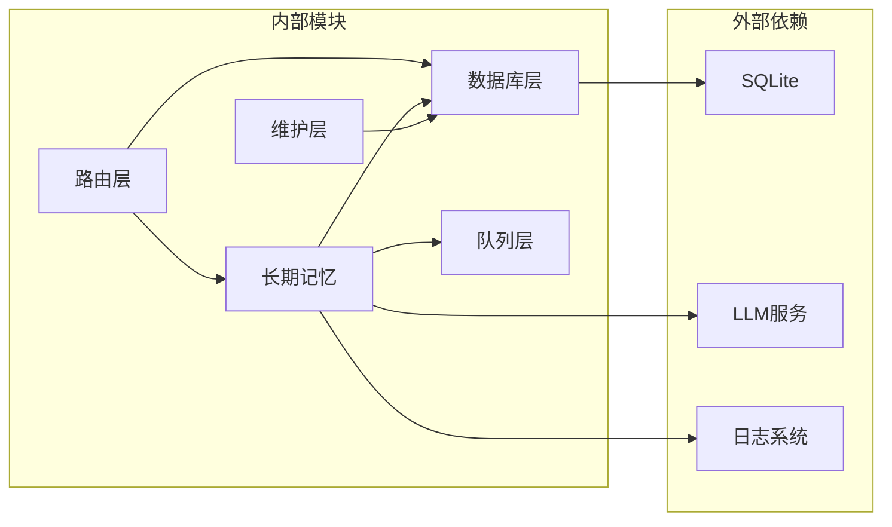
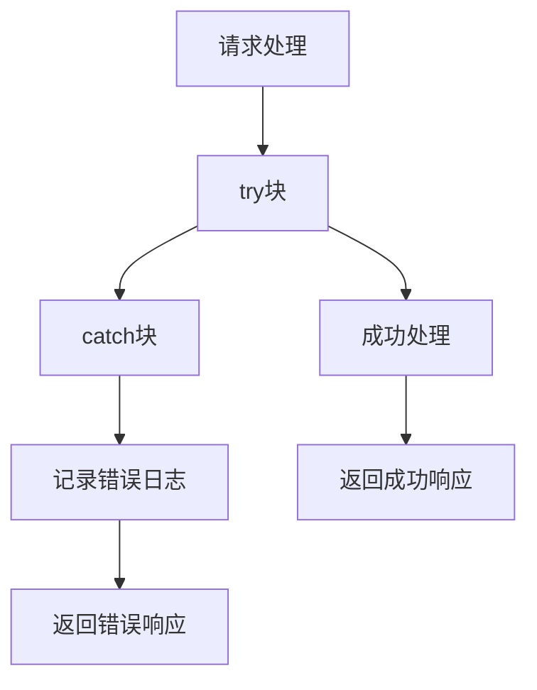

# 偏好管理端点

<cite>
**本文档引用的文件**
- [routes.js](file://backend/src/core/routes.js)
- [longTermMemory.js](file://backend/src/memory/longTermMemory.js)
- [database.js](file://backend/src/core/database.js)
- [memoryMaintenance.js](file://backend/src/memory/memoryMaintenance.js)
- [memoryQueue.js](file://backend/src/memory/memoryQueue.js)
- [config.js](file://backend/src/core/config.js)
- [evaluation.js](file://backend/src/utils/evaluation.js)
- [app.js](file://backend/src/app.js)
</cite>

## 目录
1. [简介](#简介)
2. [项目结构](#项目结构)
3. [核心组件](#核心组件)
4. [架构概览](#架构概览)
5. [详细组件分析](#详细组件分析)
6. [依赖分析](#依赖分析)
7. [性能考虑](#性能考虑)
8. [故障排除指南](#故障排除指南)
9. [结论](#结论)

## 简介

本文档详细说明NL2SQL系统中偏好管理相关端点的功能和实现机制。重点关注三个核心端点：

- POST /api/preferences/:userId/templates - 查询模板创建
- DELETE /api/preferences/:preferenceId - 偏好删除
- POST /api/preferences/:userId/learn-alias - 别名学习

这些端点构成了系统的长期记忆管理核心，支持用户偏好的持久化存储、智能学习和高效检索。

## 项目结构

NL2SQL系统采用模块化架构设计，偏好管理功能分布在多个层次：

**图表来源**
- [app.js:97-194](file://backend/src/app.js#L97-L194)
- [routes.js:595-716](file://backend/src/core/routes.js#L595-L716)
- [longTermMemory.js:1-800](file://backend/src/memory/longTermMemory.js#L1-L800)

**章节来源**
- [app.js:56-87](file://backend/src/app.js#L56-L87)
- [routes.js:1-100](file://backend/src/core/routes.js#L1-L100)

## 核心组件

### 偏好管理数据结构

系统使用统一的用户偏好表来存储不同类型的学习内容：

**图表来源**
- [database.js:140-163](file://backend/src/core/database.js#L140-L163)

### 偏好类型定义

系统支持四种主要的偏好类型：

1. **查询模式 (query_pattern)**: 存储常用的查询模式和模板
2. **字段别名 (field_alias)**: 用户术语与Schema字段的映射关系
3. **指标偏好 (metric_preference)**: 用户常用的指标偏好
4. **维度偏好 (dimension_preference)**: 用户常用的维度偏好

**章节来源**
- [longTermMemory.js:38-43](file://backend/src/memory/longTermMemory.js#L38-L43)
- [database.js:140-163](file://backend/src/core/database.js#L140-L163)

## 架构概览

偏好管理系统采用分层架构，确保功能分离和职责明确：

**图表来源**
- [routes.js:595-716](file://backend/src/core/routes.js#L595-L716)
- [longTermMemory.js:289-461](file://backend/src/memory/longTermMemory.js#L289-L461)
- [memoryMaintenance.js:69-120](file://backend/src/memory/memoryMaintenance.js#L69-L120)

## 详细组件分析

### 查询模板创建端点

#### 端点定义与参数

POST /api/preferences/:userId/templates

请求参数验证：
- `name`: 模板名称（必填）
- `dimensions`: 维度数组
- `metrics`: 指标数组  
- `default_time_range`: 默认时间范围配置

#### 处理流程

**图表来源**
- [routes.js:606-633](file://backend/src/core/routes.js#L606-L633)
- [longTermMemory.js:591-635](file://backend/src/memory/longTermMemory.js#L591-L635)
- [database.js:792-826](file://backend/src/core/database.js#L792-L826)

#### 数据持久化机制

模板存储采用智能去重策略：
1. 检查是否存在相同名称的查询模式
2. 如果存在，更新使用次数和最后使用时间
3. 如果不存在，创建新的偏好记录

**章节来源**
- [routes.js:595-633](file://backend/src/core/routes.js#L595-L633)
- [longTermMemory.js:591-635](file://backend/src/memory/longTermMemory.js#L591-L635)

### 偏好删除端点

#### 端点定义与参数

DELETE /api/preferences/:preferenceId

参数要求：
- `preferenceId`: 偏好记录ID（路径参数）

#### 删除流程

**图表来源**
- [routes.js:639-664](file://backend/src/core/routes.js#L639-L664)
- [database.js:833-838](file://backend/src/core/database.js#L833-L838)

#### 级联操作与数据一致性

偏好删除采用直接删除策略，不涉及复杂的级联操作。删除操作具有以下特点：

1. **原子性**: 单条记录删除，保证操作原子性
2. **幂等性**: 重复删除同一ID不会产生副作用
3. **一致性**: 删除后立即反映在后续查询中

**章节来源**
- [routes.js:639-664](file://backend/src/core/routes.js#L639-L664)
- [database.js:833-838](file://backend/src/core/database.js#L833-L838)

### 别名学习端点

#### 端点定义与参数

POST /api/preferences/:userId/learn-alias

请求参数：
- `user_term`: 用户术语（必填）
- `schema_field`: Schema字段（必填）
- `field_type`: 字段类型（metric/dimension/filter，默认metric）

#### 学习算法逻辑

**图表来源**
- [routes.js:677-716](file://backend/src/core/routes.js#L677-L716)
- [longTermMemory.js:748-800](file://backend/src/memory/longTermMemory.js#L748-L800)

#### 别名学习算法详解

系统实现了多层次的别名学习保护机制：

1. **参数验证**: 确保用户术语和Schema字段都存在
2. **自映射检测**: 避免用户术语与Schema字段完全相同的情况
3. **重复检测**: 检查是否已存在相同的用户术语映射
4. **冲突处理**: 当映射冲突时，记录警告并返回现有映射
5. **使用统计**: 自动更新使用次数和最后使用时间

**章节来源**
- [routes.js:667-716](file://backend/src/core/routes.js#L667-L716)
- [longTermMemory.js:748-800](file://backend/src/memory/longTermMemory.js#L748-L800)

### 学习效果评估机制

系统提供完整的评估反馈机制：

**图表来源**
- [evaluation.js:370-429](file://backend/src/utils/evaluation.js#L370-L429)
- [longTermMemory.js:748-800](file://backend/src/memory/longTermMemory.js#L748-L800)

**章节来源**
- [evaluation.js:370-429](file://backend/src/utils/evaluation.js#L370-L429)

## 依赖分析

### 组件耦合关系

**图表来源**
- [routes.js:17-30](file://backend/src/core/routes.js#L17-L30)
- [longTermMemory.js:17-22](file://backend/src/memory/longTermMemory.js#L17-L22)
- [database.js:13-20](file://backend/src/core/database.js#L13-L20)

### 数据流分析

偏好管理的数据流遵循清晰的单向依赖：

1. **API层** → **业务逻辑层** → **数据访问层**
2. **评估层** ← **业务逻辑层** → **数据访问层**
3. **配置层** → **所有层**

**章节来源**
- [routes.js:595-716](file://backend/src/core/routes.js#L595-L716)
- [longTermMemory.js:1-800](file://backend/src/memory/longTermMemory.js#L1-L800)

## 性能考虑

### 异步存储优化

系统采用异步队列机制处理大量存储操作：

- **批量处理**: 每批最多5个操作
- **并行执行**: Promise.allSettled确保失败不影响其他操作
- **队列管理**: 自动清理空队列，避免内存泄漏

### 缓存策略

- **内存缓存**: 高频访问的偏好数据缓存
- **索引优化**: 为user_id和preference_type建立复合索引
- **查询优化**: 使用参数化查询防止SQL注入

### 性能监控

系统内置性能监控机制：
- 记录队列处理时间和成功率
- 监控数据库操作延迟
- 统计学习效果指标

## 故障排除指南

### 常见问题诊断

1. **偏好创建失败**
   - 检查请求参数格式
   - 验证用户ID有效性
   - 确认数据库连接状态

2. **偏好删除异常**
   - 确认偏好ID格式正确
   - 检查记录是否存在
   - 验证权限设置

3. **别名学习无效**
   - 检查用户术语和Schema字段
   - 验证映射关系合理性
   - 查看冲突日志

### 错误处理机制

系统采用统一的错误处理策略：

**图表来源**
- [routes.js:606-633](file://backend/src/core/routes.js#L606-L633)
- [longTermMemory.js:457-460](file://backend/src/memory/longTermMemory.js#L457-L460)

**章节来源**
- [routes.js:606-716](file://backend/src/core/routes.js#L606-L716)
- [longTermMemory.js:457-460](file://backend/src/memory/longTermMemory.js#L457-L460)

## 结论

NL2SQL系统的偏好管理端点提供了完整的长期记忆管理解决方案。通过精心设计的架构和算法，系统实现了：

1. **灵活的偏好管理**: 支持多种类型的用户偏好学习和存储
2. **智能的学习算法**: 通过多层次验证确保学习质量
3. **高效的性能表现**: 异步队列和缓存机制保证系统响应速度
4. **完善的错误处理**: 全面的异常捕获和恢复机制
5. **透明的评估体系**: 提供学习效果的量化评估

这些特性使得系统能够有效提升用户查询体验，减少重复劳动，提高数据分析效率。通过持续的评估和优化，系统将持续改进其偏好学习能力，为用户提供更加智能化的服务。