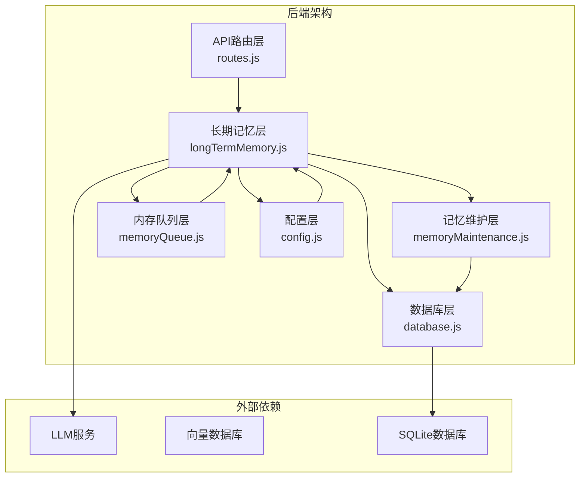
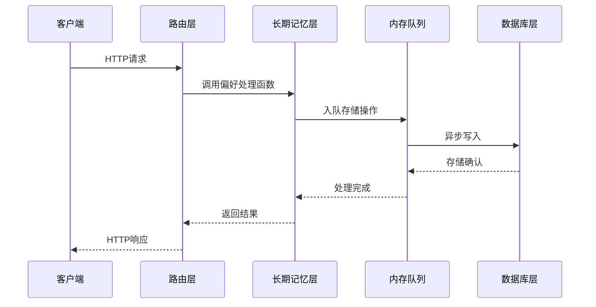
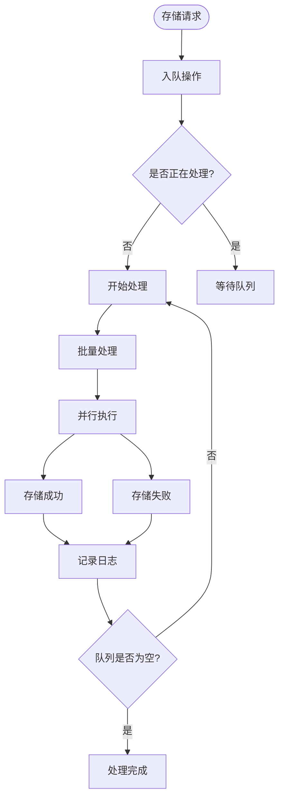
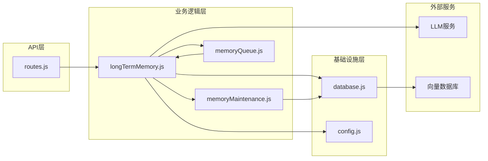

# 用户偏好API

<cite>
**本文档引用的文件**
- [routes.js](file://backend/src/core/routes.js)
- [longTermMemory.js](file://backend/src/memory/longTermMemory.js)
- [memoryMaintenance.js](file://backend/src/memory/memoryMaintenance.js)
- [database.js](file://backend/src/core/database.js)
- [memoryQueue.js](file://backend/src/memory/memoryQueue.js)
- [config.js](file://backend/src/core/config.js)
- [app.js](file://backend/src/app.js)
- [package.json](file://backend/package.json)
</cite>

## 目录
1. [简介](#简介)
2. [项目结构](#项目结构)
3. [核心组件](#核心组件)
4. [架构概览](#架构概览)
5. [详细组件分析](#详细组件分析)
6. [依赖分析](#依赖分析)
7. [性能考虑](#性能考虑)
8. [故障排除指南](#故障排除指南)
9. [结论](#结论)

## 简介

用户偏好API是NL2SQL系统中长期记忆管理的核心接口集合，负责管理用户的个性化偏好、查询模式和学习成果。该API支持用户偏好的创建、查询、更新、删除和同步，为用户提供个性化的自然语言到SQL转换体验。

本API主要包含以下功能：
- 用户偏好数据的增删改查操作
- 长期记忆的智能提取和存储
- 查询模板的管理和推荐
- 字段别名的学习和维护
- 记忆统计和维护功能

## 项目结构

NL2SQL项目的后端采用模块化设计，用户偏好API位于核心路由模块中，与长期记忆管理、数据库操作和配置管理紧密集成。



**图表来源**
- [routes.js:453-716](file://backend/src/core/routes.js#L453-L716)
- [longTermMemory.js:1-100](file://backend/src/memory/longTermMemory.js#L1-L100)
- [memoryMaintenance.js:1-50](file://backend/src/memory/memoryMaintenance.js#L1-L50)

**章节来源**
- [routes.js:1-100](file://backend/src/core/routes.js#L1-L100)
- [app.js:1-100](file://backend/src/app.js#L1-L100)

## 核心组件

用户偏好API由多个核心组件协同工作，形成完整的偏好管理系统：

### 1. 路由层 (Routes Layer)
负责HTTP请求的接收和响应处理，定义了完整的RESTful API端点。

### 2. 长期记忆层 (Long Term Memory Layer)
实现智能偏好提取、存储和管理，包含LLM驱动的智能分析功能。

### 3. 记忆维护层 (Memory Maintenance Layer)
负责偏好数据的清理、压缩和统计分析，确保系统性能。

### 4. 数据库层 (Database Layer)
提供持久化存储，管理用户偏好的CRUD操作。

### 5. 内存队列层 (Memory Queue Layer)
实现异步存储操作，提升系统并发处理能力。

**章节来源**
- [routes.js:453-716](file://backend/src/core/routes.js#L453-L716)
- [longTermMemory.js:1-100](file://backend/src/memory/longTermMemory.js#L1-L100)
- [memoryMaintenance.js:1-50](file://backend/src/memory/memoryMaintenance.js#L1-L50)

## 架构概览

用户偏好API采用分层架构设计，每层都有明确的职责分工：



**图表来源**
- [routes.js:545-592](file://backend/src/core/routes.js#L545-L592)
- [longTermMemory.js:399-405](file://backend/src/memory/longTermMemory.js#L399-L405)
- [memoryQueue.js:46-66](file://backend/src/memory/memoryQueue.js#L46-L66)

## 详细组件分析

### API端点详解

#### 1. 获取用户偏好列表
**GET /api/preferences/:userId**

功能：获取指定用户的偏好列表，支持按类型筛选和数量限制。

参数：
- 路径参数：`:userId` - 用户唯一标识
- 查询参数：
  - `type` - 偏好类型筛选（可选：`query_pattern|field_alias|metric_preference|dimension_preference`）
  - `limit` - 返回数量限制（默认50）

响应结构：
```json
{
  "success": true,
  "user_id": "string",
  "data": {
    "patterns": [],
    "aliases": [],
    "metrics": [],
    "dimensions": []
  }
}
```

**章节来源**
- [routes.js:545-592](file://backend/src/core/routes.js#L545-L592)
- [longTermMemory.js:558-592](file://backend/src/memory/longTermMemory.js#L558-L592)

#### 2. 获取原始记忆数据
**GET /api/preferences/:userId/raw**

功能：获取用户长期记忆的原始数据，用于调试和分析。

参数：
- 路径参数：`:userId` - 用户唯一标识
- 查询参数：`type` - 偏好类型筛选（可选）

响应结构：
```json
{
  "success": true,
  "user_id": "string",
  "total_count": 0,
  "data": {
    "all": [],
    "grouped": {
      "field_alias": [],
      "query_pattern": [],
      "metric_preference": [],
      "dimension_preference": []
    }
  }
}
```

**章节来源**
- [routes.js:456-517](file://backend/src/core/routes.js#L456-L517)

#### 3. 获取记忆统计
**GET /api/preferences/:userId/stats**

功能：获取用户的记忆统计信息，包括各类偏好的数量和使用情况。

参数：
- 路径参数：`:userId` - 用户唯一标识

响应结构：
```json
{
  "success": true,
  "user_id": "string",
  "data": {
    "total": 0,
    "byType": []
  }
}
```

**章节来源**
- [routes.js:519-543](file://backend/src/core/routes.js#L519-L543)
- [memoryMaintenance.js:325-355](file://backend/src/memory/memoryMaintenance.js#L325-L355)

#### 4. 手动添加查询模板
**POST /api/preferences/:userId/templates**

功能：手动添加查询模板，支持自定义维度、指标和时间范围。

请求体：
```json
{
  "name": "模板名称",
  "dimensions": ["维度1", "维度2"],
  "metrics": ["指标1"],
  "default_time_range": {
    "type": "relative",
    "value": "最近7天"
  }
}
```

响应结构：
```json
{
  "success": true,
  "message": "模板已保存",
  "data": {}
}
```

**章节来源**
- [routes.js:594-633](file://backend/src/core/routes.js#L594-L633)
- [longTermMemory.js:591-635](file://backend/src/memory/longTermMemory.js#L591-L635)

#### 5. 删除用户偏好
**DELETE /api/preferences/:preferenceId**

功能：删除指定的用户偏好记录。

参数：
- 路径参数：`:preferenceId` - 偏好记录ID

响应结构：
```json
{
  "success": true,
  "message": "偏好已删除"
}
```

**章节来源**
- [routes.js:635-664](file://backend/src/core/routes.js#L635-L664)
- [longTermMemory.js:644-645](file://backend/src/memory/longTermMemory.js#L644-L645)

#### 6. 手动学习字段别名
**POST /api/preferences/:userId/learn-alias**

功能：手动学习字段别名映射，帮助系统理解用户的表达习惯。

请求体：
```json
{
  "user_term": "用户的说法",
  "schema_field": "对应的Schema字段",
  "field_type": "metric|dimension|filter"
}
```

响应结构：
```json
{
  "success": true,
  "message": "字段别名已学习",
  "data": {}
}
```

**章节来源**
- [routes.js:666-716](file://backend/src/core/routes.js#L666-L716)
- [longTermMemory.js:748-800](file://backend/src/memory/longTermMemory.js#L748-L800)

### 偏好数据结构

用户偏好系统支持四种主要类型的偏好：

#### 1. 查询模式 (query_pattern)
存储用户常用的查询模式，包含维度、指标、时间范围等信息。

#### 2. 字段别名 (field_alias)
记录用户对数据库字段的个性化称呼，如"营收"对应"income_amount"。

#### 3. 指标偏好 (metric_preference)
记录用户经常使用的指标，用于个性化推荐。

#### 4. 维度偏好 (dimension_preference)
记录用户经常使用的维度，用于查询优化。

**章节来源**
- [longTermMemory.js:37-43](file://backend/src/memory/longTermMemory.js#L37-L43)
- [database.js:142-163](file://backend/src/core/database.js#L142-L163)

### 学习算法

#### LLM智能分析
系统使用LLM进行智能偏好提取，包含以下判断维度：

1. **字段别名映射** - 最高优先级
   - 游戏实体映射：用户说明游戏名称与ID对应
   - 数据源映射：用户说明平台/数据源标识
   - 字段别名：用户为Schema字段起别名

2. **分析习惯** - 高优先级
   - 用户习惯查看的维度组合或特定指标
   - 触发信号：用户明确说"我习惯..."、"以后都..."

3. **业务逻辑定义** - 谨慎使用
   - 用户定义的通用计算口径或过滤规则
   - 仅当用户明确表达"以后都按这个规则"时存储

4. **通用查询** - 低优先级
   - 任何人都会问的通用定义或无特殊偏好的单次取数

**章节来源**
- [longTermMemory.js:48-190](file://backend/src/memory/longTermMemory.js#L48-L190)

### 存储机制

#### 异步存储队列
为了提升系统性能，所有偏好存储操作都通过内存队列异步处理：



**图表来源**
- [memoryQueue.js:72-118](file://backend/src/memory/memoryQueue.js#L72-L118)

#### 记忆维护策略
系统采用分级保留策略：

| 使用频率 | 保留策略 | 清理条件 |
|---------|---------|---------|
| 高频(≥10次) | 永久保留 | 不清理 |
| 中频(3-9次) | 90天未用清理 | 90天未使用 |
| 低频(<3次) | 30天未用清理 | 30天未使用 |
| 字段别名 | 365天未用清理 | 365天未使用 |

**章节来源**
- [memoryMaintenance.js:24-46](file://backend/src/memory/memoryMaintenance.js#L24-L46)
- [memoryMaintenance.js:69-120](file://backend/src/memory/memoryMaintenance.js#L69-L120)

## 依赖分析

用户偏好API的依赖关系如下：



**图表来源**
- [routes.js:1-50](file://backend/src/core/routes.js#L1-L50)
- [longTermMemory.js:17-23](file://backend/src/memory/longTermMemory.js#L17-L23)

### 外部依赖

- **Express**: Web框架，提供HTTP服务
- **SQLite**: 本地数据库，存储用户偏好
- **LLM服务**: 大语言模型，用于智能偏好提取
- **向量数据库**: 存储Schema向量信息

**章节来源**
- [package.json:10-20](file://backend/package.json#L10-L20)

## 性能考虑

### 1. 异步处理
- 使用内存队列处理存储操作，避免阻塞主线程
- 批量处理提升吞吐量
- 并行执行减少延迟

### 2. 数据库优化
- 为用户ID、偏好类型建立索引
- 复合索引加速查询
- JSON字段查询使用`json_extract`函数

### 3. 内存管理
- 队列大小限制防止内存溢出
- 超时机制避免长时间阻塞
- 批量处理减少内存分配

### 4. 配置优化
- 可配置的批量大小和处理间隔
- 灵活的清理策略
- 可调节的阈值参数

**章节来源**
- [memoryQueue.js:27-33](file://backend/src/memory/memoryQueue.js#L27-L33)
- [database.js:165-171](file://backend/src/core/database.js#L165-L171)
- [config.js:259-293](file://backend/src/core/config.js#L259-L293)

## 故障排除指南

### 常见问题及解决方案

#### 1. API响应超时
**症状**: 请求响应时间过长
**原因**: 
- 内存队列积压
- 数据库连接问题
- LLM服务响应慢

**解决方案**:
- 检查队列状态：`GET /api/preferences/:userId/stats`
- 监控数据库性能
- 配置LLM超时参数

#### 2. 偏好数据丢失
**症状**: 用户偏好消失
**原因**:
- 记忆清理策略
- 数据库损坏
- 队列处理失败

**解决方案**:
- 检查清理日志
- 验证数据库完整性
- 重试失败的队列操作

#### 3. LLM分析失败
**症状**: 智能偏好提取失效
**原因**:
- API密钥配置错误
- LLM服务不可用
- 配置参数不正确

**解决方案**:
- 验证LLM配置
- 检查API密钥
- 查看错误日志

**章节来源**
- [memoryQueue.js:186-202](file://backend/src/memory/memoryQueue.js#L186-L202)
- [config.js:366-397](file://backend/src/core/config.js#L366-L397)

## 结论

用户偏好API为NL2SQL系统提供了完整的长期记忆管理解决方案。通过智能的偏好提取、高效的异步存储和灵活的记忆维护策略，系统能够为用户提供个性化的自然语言到SQL转换体验。

主要优势：
- **智能化**: LLM驱动的偏好提取，能够理解用户的表达习惯
- **高性能**: 异步队列处理，支持高并发场景
- **可维护性**: 分级保留策略，自动清理无用数据
- **可扩展性**: 模块化设计，易于功能扩展

未来改进方向：
- 增强偏好推荐算法
- 优化LLM成本控制
- 扩展偏好类型支持
- 加强数据备份机制