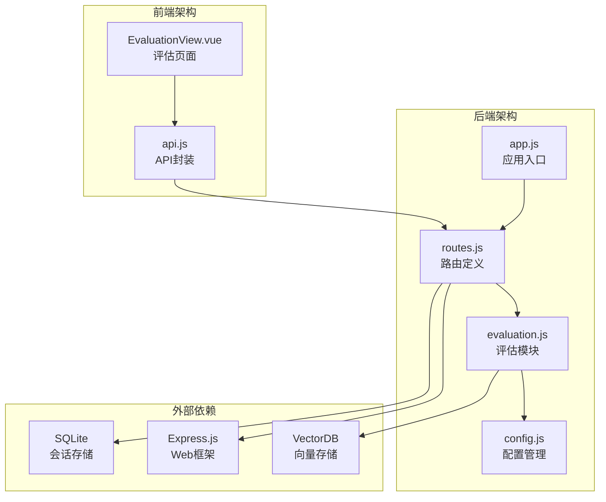
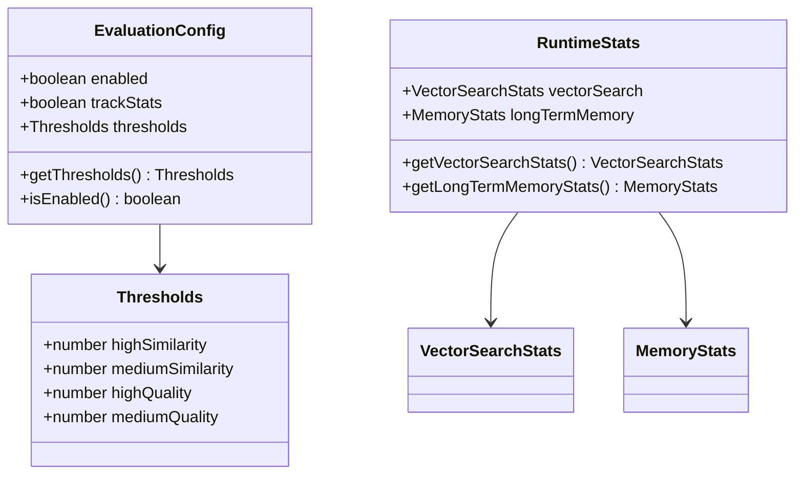
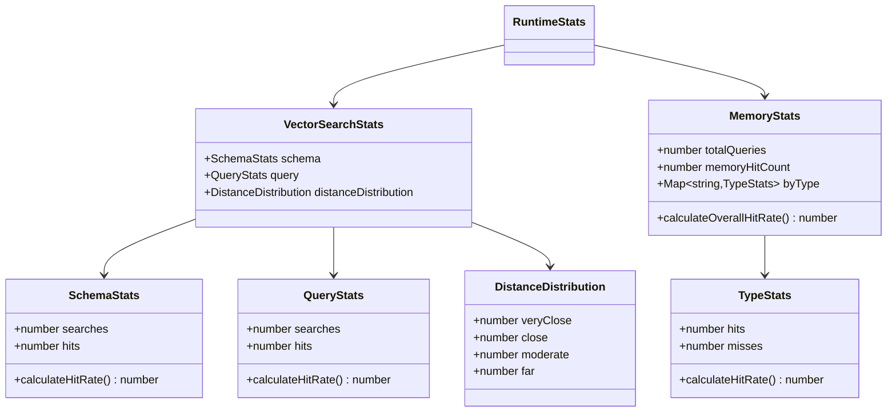
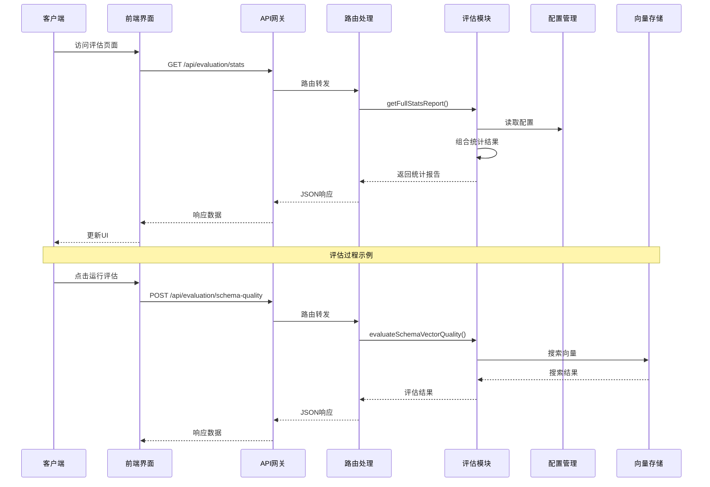
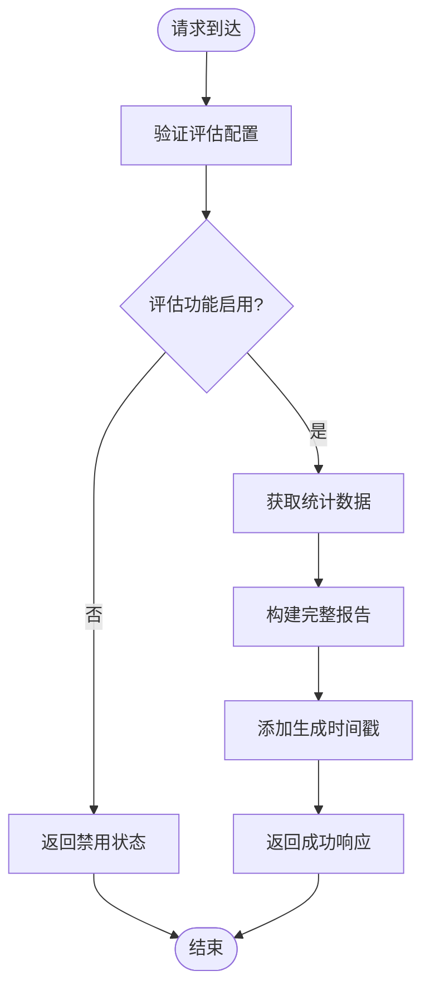
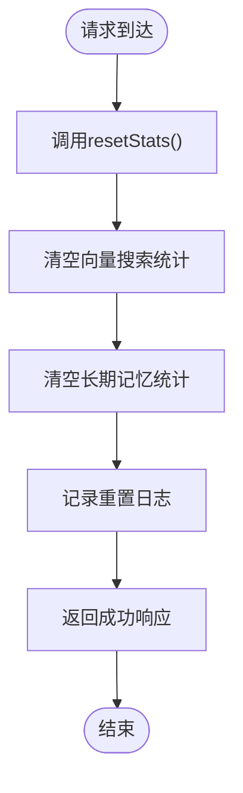
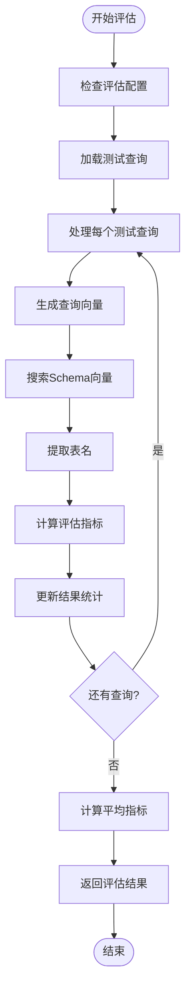
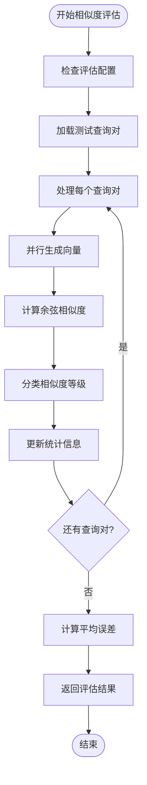
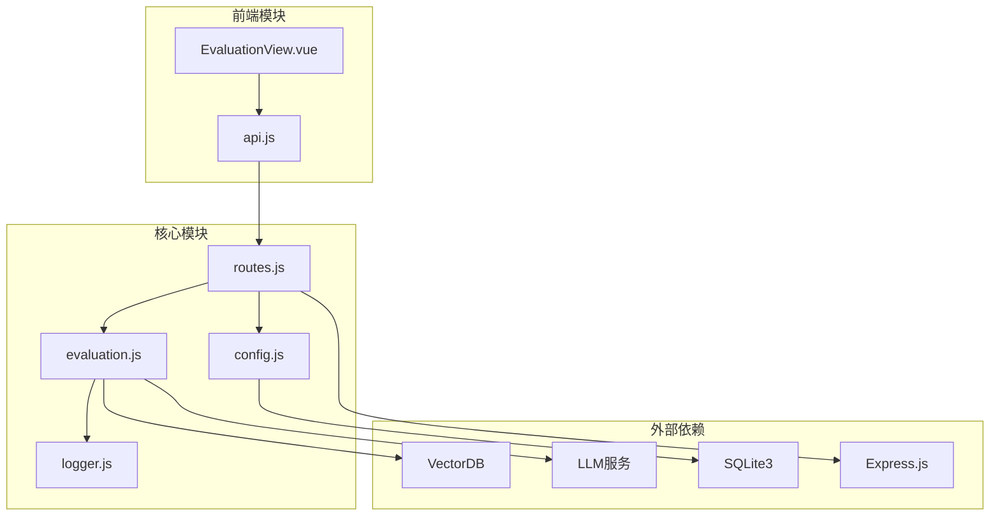

# 评估API

<cite>
**本文档引用的文件**
- [evaluation.js](file://backend/src/utils/evaluation.js)
- [routes.js](file://backend/src/core/routes.js)
- [config.js](file://backend/src/core/config.js)
- [app.js](file://backend/src/app.js)
- [EvaluationView.vue](file://frontend/src/views/EvaluationView.vue)
- [api.js](file://frontend/src/utils/api.js)
- [package.json](file://backend/package.json)
</cite>

## 目录
1. [简介](#简介)
2. [项目结构](#项目结构)
3. [核心组件](#核心组件)
4. [架构概览](#架构概览)
5. [详细组件分析](#详细组件分析)
6. [依赖分析](#依赖分析)
7. [性能考虑](#性能考虑)
8. [故障排除指南](#故障排除指南)
9. [结论](#结论)
10. [附录](#附录)

## 简介

NL2SQL评估API是一套完整的系统评估和监控解决方案，专门用于评估向量化质量、记忆命中率和系统性能表现。该API提供了三个核心端点：`GET /api/evaluation/stats`、`POST /api/evaluation/stats/reset` 和 `POST /api/evaluation/schema-quality`，以及额外的查询质量评估端点。

评估API的设计目标是：
- **非侵入性**：不影响主业务流程的正常运行
- **实时监控**：提供运行时统计和性能指标
- **质量保证**：通过自动化评估确保系统质量
- **可视化展示**：配合前端界面提供直观的评估结果

## 项目结构

NL2SQL项目采用模块化架构，评估功能主要分布在以下模块中：



**图表来源**
- [app.js:1-266](file://backend/src/app.js#L1-L266)
- [routes.js:1-1037](file://backend/src/core/routes.js#L1-L1037)
- [evaluation.js:1-488](file://backend/src/utils/evaluation.js#L1-L488)

**章节来源**
- [app.js:1-266](file://backend/src/app.js#L1-L266)
- [routes.js:1-1037](file://backend/src/core/routes.js#L1-L1037)
- [package.json:1-28](file://backend/package.json#L1-L28)

## 核心组件

### 评估配置系统

评估系统通过集中配置管理所有评估相关的设置：



**图表来源**
- [config.js:342-354](file://backend/src/core/config.js#L342-L354)
- [evaluation.js:19-31](file://backend/src/utils/evaluation.js#L19-L31)

### 评估统计模块

评估统计模块提供实时运行时统计功能：



**图表来源**
- [evaluation.js:37-60](file://backend/src/utils/evaluation.js#L37-L60)
- [evaluation.js:344-391](file://backend/src/utils/evaluation.js#L344-L391)

**章节来源**
- [config.js:342-354](file://backend/src/core/config.js#L342-L354)
- [evaluation.js:19-488](file://backend/src/utils/evaluation.js#L19-L488)

## 架构概览

评估API采用分层架构设计，确保功能分离和可维护性：



**图表来源**
- [routes.js:722-803](file://backend/src/core/routes.js#L722-L803)
- [evaluation.js:158-266](file://backend/src/utils/evaluation.js#L158-L266)

## 详细组件分析

### 评估统计端点

#### GET /api/evaluation/stats

该端点提供完整的运行时统计报告，包括向量检索命中率和长期记忆命中率。

**请求参数**
- 无

**响应结构**
```json
{
  "success": true,
  "data": {
    "vectorSearch": {
      "schema": {
        "searches": 0,
        "hits": 0,
        "hitRate": 0.0
      },
      "query": {
        "searches": 0,
        "hits": 0,
        "hitRate": 0.0
      },
      "distanceDistribution": {
        "veryClose": 0,
        "close": 0,
        "moderate": 0,
        "far": 0
      }
    },
    "longTermMemory": {
      "overall": {
        "hitRate": 0.0,
        "totalQueries": 0,
        "totalHits": 0,
        "totalMisses": 0
      },
      "byType": [
        {
          "type": "field_alias",
          "hitRate": 0.0,
          "hits": 0,
          "misses": 0
        }
      ]
    },
    "generatedAt": "2024-01-01T00:00:00.000Z",
    "config": {
      "enabled": false,
      "trackStats": false
    }
  }
}
```

**处理流程**


**图表来源**
- [routes.js:722-740](file://backend/src/core/routes.js#L722-L740)
- [evaluation.js:397-407](file://backend/src/utils/evaluation.js#L397-L407)

#### POST /api/evaluation/stats/reset

该端点用于重置所有统计数据，清空当前的运行时统计。

**请求参数**
- 无

**响应结构**
```json
{
  "success": true,
  "message": "统计数据已重置"
}
```

**处理流程**


**图表来源**
- [routes.js:742-760](file://backend/src/core/routes.js#L742-L760)
- [evaluation.js:412-429](file://backend/src/utils/evaluation.js#L412-L429)

### Schema质量评估端点

#### POST /api/evaluation/schema-quality

该端点执行Schema向量化质量评估，通过测试查询与预期表的匹配度来评估向量化效果。

**请求参数**
```json
{
  "testQueries": [
    {
      "query": "查询语句",
      "expectedTables": ["表名1", "表名2"]
    }
  ]
}
```

**响应结构**
```json
{
  "success": true,
  "data": {
    "total": 8,
    "correct": 0,
    "partial": 0,
    "incorrect": 0,
    "accuracy": 0.0,
    "avgPrecision": 0.0,
    "avgRecall": 0.0,
    "avgF1": 0.0,
    "details": [
      {
        "query": "查询语句",
        "expected": ["表名1"],
        "retrieved": ["表名1", "表名2"],
        "precision": 1.0,
        "recall": 1.0,
        "f1Score": 1.0,
        "top1Correct": true
      }
    ]
  }
}
```

**评估算法流程**


**图表来源**
- [routes.js:762-803](file://backend/src/core/routes.js#L762-L803)
- [evaluation.js:158-266](file://backend/src/utils/evaluation.js#L158-L266)

### 查询质量评估端点

#### POST /api/evaluation/query-quality

该端点评估查询历史的向量化质量，通过计算相似查询对之间的余弦相似度来评估向量化效果。

**请求参数**
```json
{
  "testPairs": [
    {
      "query1": "查询语句1",
      "query2": "查询语句2",
      "expectedSimilarity": 0.9
    }
  ]
}
```

**响应结构**
```json
{
  "success": true,
  "data": {
    "total": 5,
    "highSimilarity": 0,
    "mediumSimilarity": 0,
    "lowSimilarity": 0,
    "avgError": 0.0,
    "details": [
      {
        "query1": "查询语句1",
        "query2": "查询语句2",
        "expectedSimilarity": 0.9,
        "actualSimilarity": 0.85,
        "error": 0.05
      }
    ]
  }
}
```

**相似度计算流程**


**图表来源**
- [routes.js:805-841](file://backend/src/core/routes.js#L805-L841)
- [evaluation.js:276-334](file://backend/src/utils/evaluation.js#L276-L334)

### 评估配置端点

#### GET /api/evaluation/config

该端点提供评估功能的配置信息，包括启用状态、统计跟踪和阈值设置。

**响应结构**
```json
{
  "success": true,
  "data": {
    "enabled": false,
    "trackStats": false,
    "thresholds": {
      "highSimilarity": 0.8,
      "mediumSimilarity": 0.5,
      "highQuality": 0.8,
      "mediumQuality": 0.5
    }
  }
}
```

**章节来源**
- [routes.js:722-856](file://backend/src/core/routes.js#L722-L856)
- [evaluation.js:158-334](file://backend/src/utils/evaluation.js#L158-L334)

## 依赖分析

评估API的依赖关系图展示了各组件之间的交互：



**图表来源**
- [routes.js:28-29](file://backend/src/core/routes.js#L28-L29)
- [evaluation.js:12-13](file://backend/src/utils/evaluation.js#L12-L13)
- [app.js:23-48](file://backend/src/app.js#L23-L48)

**章节来源**
- [routes.js:1-1037](file://backend/src/core/routes.js#L1-L1037)
- [evaluation.js:1-488](file://backend/src/utils/evaluation.js#L1-L488)
- [app.js:1-266](file://backend/src/app.js#L1-L266)

## 性能考虑

### 评估性能指标

评估系统提供了多个性能相关的指标：

1. **向量检索命中率**
   - Schema检索命中率：衡量Schema向量检索的准确性
   - 查询历史命中率：衡量查询历史向量检索的有效性

2. **记忆系统性能**
   - 长期记忆总体命中率：衡量用户偏好记忆的准确性
   - 按类型记忆命中率：区分不同类型记忆的性能表现

3. **向量质量指标**
   - 精确率(Precision)：检索结果中正确的比例
   - 召回率(Recall)：实际相关结果中被检索到的比例
   - F1分数：精确率和召回率的调和平均数

### 性能优化策略

1. **异步处理**
   - 评估操作使用异步处理，避免阻塞主线程
   - 并行处理多个评估任务，提高效率

2. **缓存机制**
   - 利用向量数据库的内置缓存
   - 配置合理的缓存策略减少重复计算

3. **阈值优化**
   - 可配置的相似度阈值适应不同场景
   - 动态调整阈值以平衡精度和召回率

## 故障排除指南

### 常见问题及解决方案

#### 评估功能未启用

**症状**：调用评估端点返回403错误

**原因**：`EVALUATION_ENABLED=false`

**解决方案**：
```bash
# 在.env文件中设置
EVALUATION_ENABLED=true
EVALUATION_TRACK_STATS=true
```

#### 向量搜索失败

**症状**：评估过程中出现向量搜索错误

**原因**：
1. 向量数据库未初始化
2. LLM服务不可用
3. 网络连接问题

**解决方案**：
1. 检查向量数据库连接状态
2. 验证LLM API配置
3. 确认网络连通性

#### 性能问题

**症状**：评估响应时间过长

**原因**：
1. 测试数据集过大
2. 向量维度过高
3. 硬件资源不足

**解决方案**：
1. 减少测试查询数量
2. 优化向量维度
3. 升级硬件配置

**章节来源**
- [routes.js:772-778](file://backend/src/core/routes.js#L772-L778)
- [evaluation.js:159-161](file://backend/src/utils/evaluation.js#L159-L161)

## 结论

NL2SQL评估API提供了一套完整的系统评估和监控解决方案。通过三个核心端点和丰富的统计功能，开发者可以全面了解系统的运行状况和性能表现。

### 主要优势

1. **非侵入性设计**：评估功能不影响主业务流程
2. **实时监控**：提供运行时统计和性能指标
3. **可视化界面**：配合前端提供直观的评估结果展示
4. **灵活配置**：支持动态调整评估参数和阈值

### 应用场景

- **开发调试**：验证向量化质量改进效果
- **性能监控**：持续跟踪系统性能变化
- **质量保证**：定期评估系统质量水平
- **系统调优**：基于评估结果进行优化

### 未来发展方向

1. **扩展评估维度**：增加更多质量评估指标
2. **自动化评估**：集成到CI/CD流程中
3. **预测分析**：基于历史数据预测性能趋势
4. **多维度对比**：支持不同版本间的性能对比

## 附录

### 环境变量配置

| 变量名 | 默认值 | 描述 |
|--------|--------|------|
| EVALUATION_ENABLED | false | 是否启用评估功能 |
| EVALUATION_TRACK_STATS | false | 是否记录运行时统计 |
| LLM_API_BASE | https://api.openai.com/v1 | LLM API基础URL |
| EMBEDDING_MODEL | text-embedding-3-small | Embedding模型名称 |

### 评估阈值说明

| 阈值类型 | 高质量阈值 | 中等质量阈值 | 说明 |
|----------|------------|--------------|------|
| 相似度阈值 | 0.8 | 0.5 | 用于查询相似度评估 |
| 质量阈值 | 0.8 | 0.5 | 用于Schema向量化质量评估 |

### API使用示例

```javascript
// 获取评估统计
fetch('/api/evaluation/stats')
  .then(response => response.json())
  .then(data => console.log(data));

// 重置统计数据
fetch('/api/evaluation/stats/reset', {
  method: 'POST'
});

// 运行Schema质量评估
fetch('/api/evaluation/schema-quality', {
  method: 'POST',
  headers: {
    'Content-Type': 'application/json'
  },
  body: JSON.stringify({
    testQueries: [
      {
        query: "查询语句",
        expectedTables: ["表名"]
      }
    ]
  })
});
```