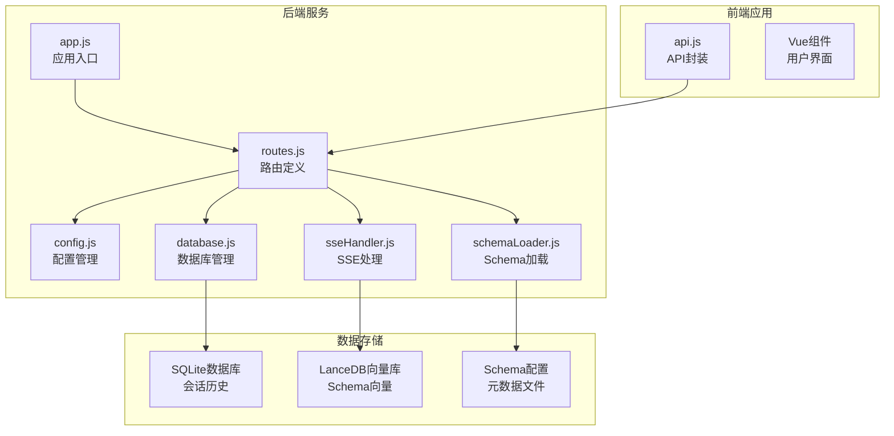
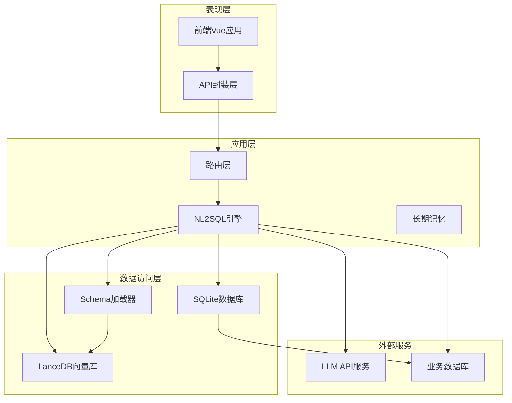
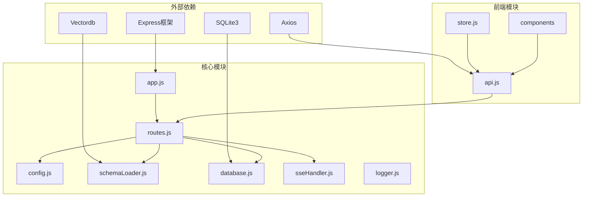

# API接口文档

<cite>
**本文档引用的文件**
- [app.js](file://backend/src/app.js)
- [routes.js](file://backend/src/core/routes.js)
- [config.js](file://backend/src/core/config.js)
- [schemaLoader.js](file://backend/src/core/schemaLoader.js)
- [database.js](file://backend/src/core/database.js)
- [sseHandler.js](file://backend/src/core/sseHandler.js)
- [api.js](file://frontend/src/utils/api.js)
- [package.json](file://backend/package.json)
- [schema-metadata.example.json](file://backend/config/schema-metadata.example.json)
</cite>

## 目录
1. [简介](#简介)
2. [项目结构](#项目结构)
3. [核心组件](#核心组件)
4. [架构概览](#架构概览)
5. [详细组件分析](#详细组件分析)
6. [依赖关系分析](#依赖关系分析)
7. [性能考虑](#性能考虑)
8. [故障排除指南](#故障排除指南)
9. [结论](#结论)

## 简介

NL2SQL是一个自然语言转SQL的数据查询服务，提供RESTful API接口，支持Schema查询、会话管理、用户偏好、查询历史和系统统计等功能。该服务采用Node.js + Express技术栈，结合SQLite数据库和向量数据库，实现了智能化的自然语言到SQL转换能力。

## 项目结构

NL2SQL项目采用前后端分离架构，后端使用Express框架提供RESTful API，前端使用Vue.js构建用户界面。



**图表来源**
- [app.js:1-238](file://backend/src/app.js#L1-L238)
- [routes.js:1-895](file://backend/src/core/routes.js#L1-L895)

**章节来源**
- [app.js:1-238](file://backend/src/app.js#L1-L238)
- [package.json:1-28](file://backend/package.json#L1-L28)

## 核心组件

NL2SQL系统包含以下核心组件：

### 1. 应用入口组件
- **app.js**: 应用程序主入口，负责初始化配置、数据库连接、路由挂载和服务器启动

### 2. 路由处理组件
- **routes.js**: 定义所有RESTful API端点，包含健康检查、Schema查询、会话管理、用户偏好、查询历史和统计信息接口

### 3. 配置管理组件
- **config.js**: 统一管理应用配置，包括LLM API配置、数据库配置、安全配置、会话配置等

### 4. 数据访问组件
- **schemaLoader.js**: 负责加载和管理Schema元数据，提供Schema查询和匹配功能
- **database.js**: SQLite数据库管理，处理会话历史、查询日志等数据的持久化存储

### 5. 实时通信组件
- **sseHandler.js**: Server-Sent Events处理器，实现流式消息推送和实时通信

**章节来源**
- [routes.js:1-895](file://backend/src/core/routes.js#L1-L895)
- [config.js:1-332](file://backend/src/core/config.js#L1-L332)

## 架构概览

NL2SQL采用分层架构设计，各组件职责清晰，耦合度低。



**图表来源**
- [routes.js:1-895](file://backend/src/core/routes.js#L1-L895)
- [schemaLoader.js:1-732](file://backend/src/core/schemaLoader.js#L1-L732)
- [database.js:1-850](file://backend/src/core/database.js#L1-L850)

## 详细组件分析

### 健康检查接口

#### 接口定义
- **GET /api/health**: 基础健康检查
- **GET /api/health/detail**: 详细健康检查

#### 请求参数
- 无

#### 响应格式
```json
{
  "status": "ok",
  "timestamp": "ISO时间字符串",
  "version": "服务版本",
  "uptime": "运行时间（秒）",
  "memory": {
    "used": "已使用内存（MB）",
    "total": "总内存（MB）"
  }
}
```

#### 详细健康检查响应
```json
{
  "status": "ok",
  "timestamp": "ISO时间字符串",
  "components": {
    "database": {
      "status": "ok",
      "message": "SQLite连接正常"
    },
    "llm": {
      "status": "ok", 
      "message": "LLM API配置正常"
    },
    "schema": {
      "status": "ok",
      "tables": "表数量"
    },
    "sse": {
      "status": "ok",
      "connections": "SSE连接数量"
    }
  }
}
```

**章节来源**
- [routes.js:58-135](file://backend/src/core/routes.js#L58-L135)

### Schema查询接口

#### 接口定义
- **GET /api/schema**: 获取完整的Schema信息
- **GET /api/schema/tables/:tableName**: 获取指定表的详细信息
- **GET /api/schema/search**: 搜索Schema

#### 查询参数
- **GET /api/schema**: 
  - `type`: 类型筛选（tables|metrics|dimensions）
- **GET /api/schema/search**:
  - `q`: 搜索关键词（必需）
  - `limit`: 返回结果数量限制（默认5）

#### 响应格式
```json
{
  "version": "1.0",
  "tables": [],
  "metrics": [],
  "dimensions": []
}
```

#### 表详情响应
```json
{
  "table": {
    "name": "表名",
    "name_cn": "中文名",
    "description": "描述",
    "fields": []
  },
  "relatedTables": []
}
```

**章节来源**
- [routes.js:141-248](file://backend/src/core/routes.js#L141-L248)
- [schemaLoader.js:296-390](file://backend/src/core/schemaLoader.js#L296-L390)

### 会话管理接口

#### 接口定义
- **POST /api/sessions**: 创建新会话
- **GET /api/sessions/:sessionId**: 获取会话信息
- **DELETE /api/sessions/:sessionId**: 删除会话
- **GET /api/sessions/:sessionId/messages**: 获取会话消息历史
- **GET /api/users/:userId/sessions**: 获取用户的所有会话

#### 请求参数
- **POST /api/sessions**:
  ```json
  {
    "user_id": "用户ID",
    "title": "会话标题（可选）"
  }
  ```

#### 响应格式
```json
{
  "id": "会话ID",
  "user_id": "用户ID", 
  "title": "会话标题",
  "created_at": "创建时间",
  "updated_at": "更新时间",
  "status": "active"
}
```

#### 消息历史响应
```json
{
  "session_id": "会话ID",
  "count": "消息数量",
  "messages": []
}
```

**章节来源**
- [routes.js:254-396](file://backend/src/core/routes.js#L254-L396)
- [database.js:458-540](file://backend/src/core/database.js#L458-L540)

### 用户偏好接口

#### 接口定义
- **GET /api/preferences/:userId**: 获取用户偏好列表
- **GET /api/preferences/:userId/raw**: 获取用户长期记忆原始数据
- **GET /api/preferences/:userId/stats**: 获取用户记忆统计
- **POST /api/preferences/:userId/templates**: 手动添加查询模板
- **POST /api/preferences/:userId/learn-alias**: 手动学习字段别名
- **DELETE /api/preferences/:preferenceId**: 删除用户偏好

#### 查询参数
- **GET /api/preferences/:userId**:
  - `type`: 偏好类型筛选（query_pattern|field_alias|metric_preference|dimension_preference）
  - `limit`: 返回数量限制（默认50）

#### 查询模板请求体
```json
{
  "name": "模板名称",
  "dimensions": ["维度1", "维度2"],
  "metrics": ["指标1"],
  "default_time_range": {
    "type": "relative", 
    "value": "最近7天"
  }
}
```

#### 字段别名学习请求体
```json
{
  "user_term": "用户的说法",
  "schema_field": "对应的Schema字段", 
  "field_type": "metric|dimension|filter"
}
```

**章节来源**
- [routes.js:454-714](file://backend/src/core/routes.js#L454-L714)
- [database.js:609-763](file://backend/src/core/database.js#L609-L763)

### 查询历史接口

#### 接口定义
- **GET /api/queries/history**: 获取查询历史

#### 查询参数
- `user_id`: 用户ID筛选
- `session_id`: 会话ID筛选  
- `limit`: 返回数量限制（默认20）

#### 响应格式
```json
{
  "count": "历史记录数量",
  "history": [
    {
      "id": "查询ID",
      "session_id": "会话ID",
      "user_id": "用户ID",
      "natural_query": "用户查询",
      "generated_sql": "生成的SQL",
      "status": "pending|success|failed",
      "result": "查询结果",
      "error_message": "错误信息",
      "execution_time": "执行耗时（毫秒）",
      "row_count": "返回行数",
      "created_at": "创建时间",
      "executed_at": "执行时间"
    }
  ]
}
```

**章节来源**
- [routes.js:402-448](file://backend/src/core/routes.js#L402-L448)
- [database.js:582-596](file://backend/src/core/database.js#L582-L596)

### 系统统计接口

#### 接口定义
- **GET /api/stats**: 获取服务统计信息

#### 响应格式
```json
{
  "timestamp": "时间戳",
  "connections": {
    "sse": "SSE连接数量"
  },
  "queries": {
    "today": {
      "total_queries": "今日总查询数",
      "success_count": "成功查询数", 
      "failed_count": "失败查询数",
      "avg_execution_time": "平均执行时间"
    }
  },
  "schema": {
    "tables": "表数量",
    "metrics": "指标数量", 
    "dimensions": "维度数量"
  },
  "system": {
    "uptime": "运行时间（秒）",
    "memory": "内存使用情况",
    "node_version": "Node.js版本"
  }
}
```

**章节来源**
- [routes.js:720-771](file://backend/src/core/routes.js#L720-L771)

### SSE实时通信接口

#### 接口定义
- **GET /api/sse/stream**: 建立SSE连接
- **POST /api/sse/query**: 发送查询请求

#### 查询参数
- **GET /api/sse/stream**:
  - `session_id`: 会话ID（必需）
  - `user_id`: 用户ID（可选，默认anonymous）

#### 请求体
- **POST /api/sse/query**:
  ```json
  {
    "session_id": "会话ID",
    "query": "查询内容"
  }
  ```

#### SSE事件类型
- `connected`: 连接成功
- `processing`: 开始处理
- `progress`: 进度更新
- `result`: 查询结果
- `error`: 错误信息

**章节来源**
- [routes.js:806-860](file://backend/src/core/routes.js#L806-L860)
- [sseHandler.js:43-280](file://backend/src/core/sseHandler.js#L43-L280)

## 依赖关系分析

NL2SQL系统的组件依赖关系如下：



**图表来源**
- [package.json:10-27](file://backend/package.json#L10-L27)
- [app.js:22-50](file://backend/src/app.js#L22-L50)

**章节来源**
- [package.json:1-28](file://backend/package.json#L1-L28)
- [app.js:1-238](file://backend/src/app.js#L1-L238)

## 性能考虑

### 1. 数据库性能优化
- **索引优化**: 为常用查询字段建立索引，如`user_id`、`session_id`、`created_at`
- **批量操作**: 使用事务批量执行多个数据库操作
- **连接池**: 配置合适的数据库连接池参数

### 2. 缓存策略
- **Schema缓存**: 缓存Schema元数据，减少重复加载
- **向量缓存**: 缓存向量数据，支持语义搜索
- **响应缓存**: 对静态数据查询结果进行缓存

### 3. 内存管理
- **垃圾回收**: 定期清理不再使用的连接和缓存
- **内存监控**: 监控内存使用情况，防止内存泄漏
- **流式处理**: 对大数据量响应使用流式处理

### 4. 网络优化
- **SSE连接复用**: 支持多标签页共享同一SSE连接
- **请求合并**: 合并频繁的小请求
- **压缩传输**: 对响应数据进行压缩

## 故障排除指南

### 1. 常见错误及解决方案

#### 数据库连接错误
**症状**: 应用启动失败，显示数据库连接错误
**解决方案**: 
- 检查数据库文件路径配置
- 确认数据库文件权限
- 验证SQLite版本兼容性

#### Schema加载失败
**症状**: Schema查询接口返回错误
**解决方案**:
- 检查Schema配置文件格式
- 验证Schema文件路径
- 确认向量数据库初始化状态

#### LLM API调用失败
**症状**: 查询处理失败，返回LLM调用错误
**解决方案**:
- 检查LLM API密钥配置
- 验证API基础URL设置
- 确认网络连接状态

### 2. 性能问题诊断

#### 查询响应缓慢
**诊断步骤**:
1. 检查数据库索引是否合理
2. 分析查询执行计划
3. 监控数据库连接池使用情况

#### 内存使用过高
**诊断步骤**:
1. 检查是否有内存泄漏
2. 监控SSE连接数量
3. 分析缓存使用情况

### 3. 日志分析

#### 启用详细日志
在开发环境中设置：
```bash
LOG_LEVEL=debug
NODE_ENV=development
```

#### 关键日志类型
- **错误日志**: 记录API调用错误和异常
- **性能日志**: 记录查询执行时间和慢查询
- **审计日志**: 记录用户行为和系统操作

**章节来源**
- [config.js:195-208](file://backend/src/core/config.js#L195-L208)
- [app.js:160-165](file://backend/src/app.js#L160-L165)

## 结论

NL2SQL项目提供了完整的自然语言转SQL服务API，具有以下特点：

### 技术优势
- **模块化设计**: 各组件职责清晰，易于维护和扩展
- **实时通信**: 支持SSE流式消息推送，提供良好的用户体验
- **智能查询**: 结合Schema元数据和向量搜索，提升查询准确性
- **数据持久化**: 使用SQLite存储会话历史和用户偏好

### 功能完整性
- **全面的API覆盖**: 包含Schema查询、会话管理、用户偏好、查询历史等核心功能
- **灵活的配置**: 支持多种部署场景和环境配置
- **完善的错误处理**: 提供详细的错误信息和状态码

### 最佳实践建议
1. **生产环境部署**: 配置适当的日志级别和安全参数
2. **性能监控**: 建立监控体系，及时发现和解决性能问题
3. **数据备份**: 定期备份数据库和重要配置文件
4. **版本管理**: 建立API版本控制和向后兼容策略

该系统为自然语言查询提供了强大的技术支持，适合在各种数据分析和业务查询场景中使用。