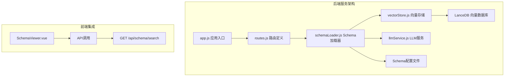
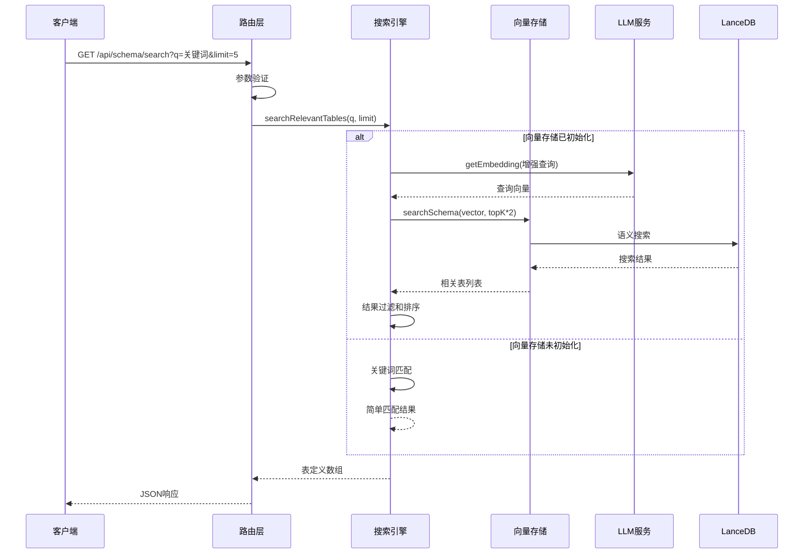
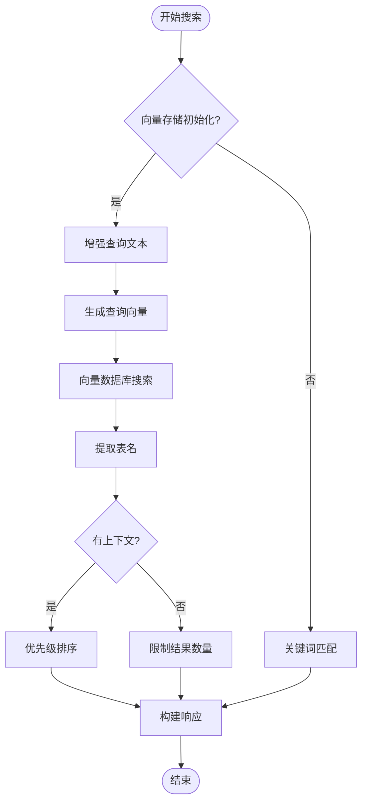
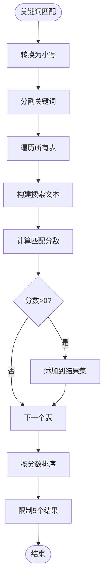
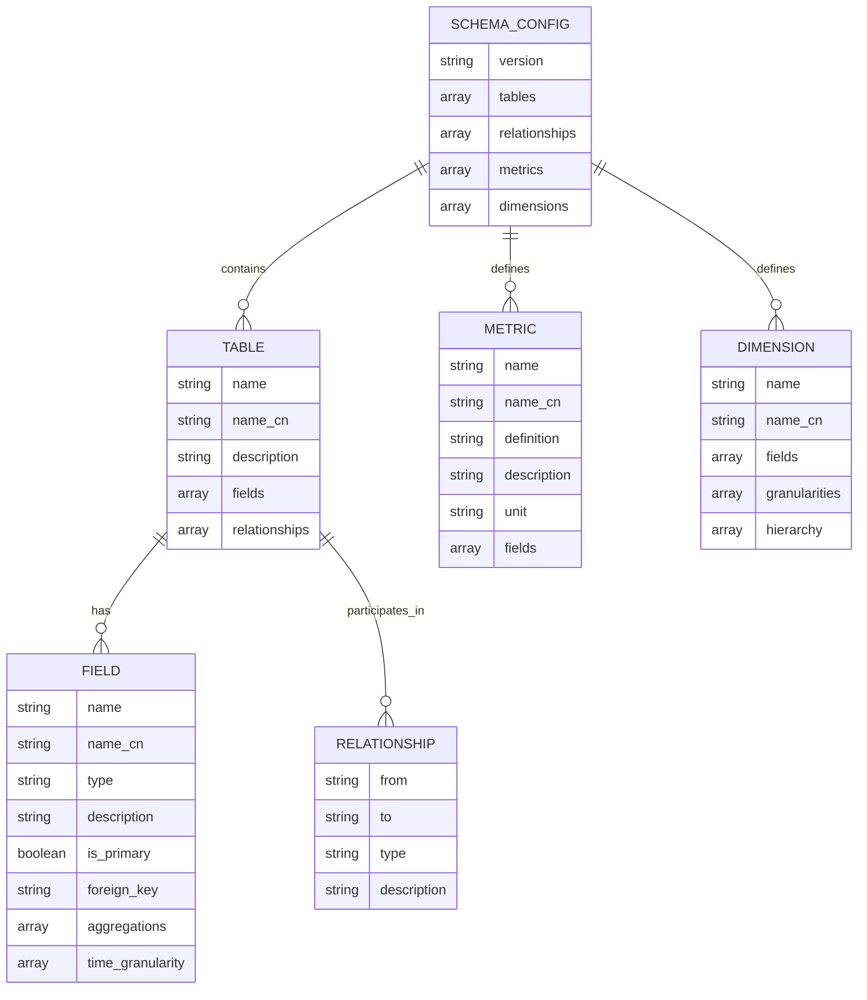
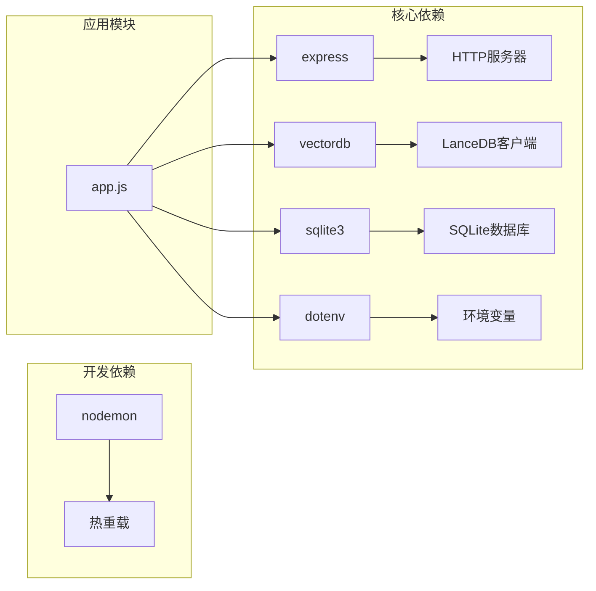
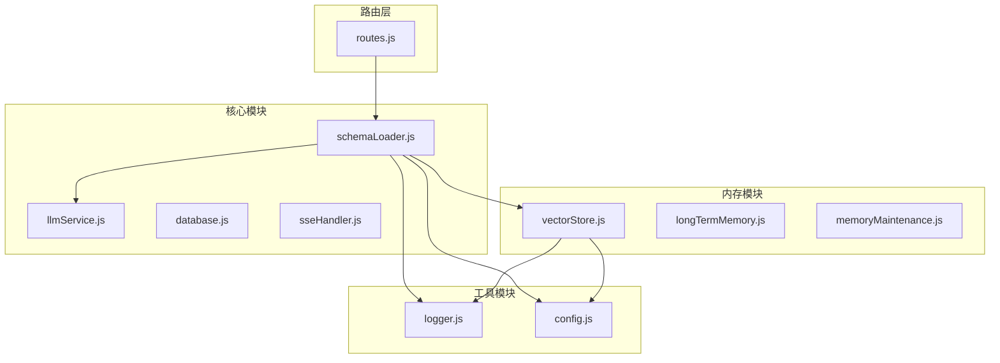
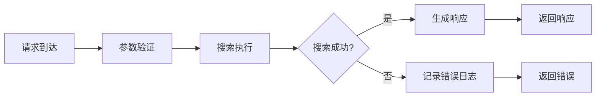

# Schema搜索接口

<cite>
**本文档引用的文件**
- [routes.js](file://backend/src/core/routes.js)
- [schemaLoader.js](file://backend/src/core/schemaLoader.js)
- [vectorStore.js](file://backend/src/memory/vectorStore.js)
- [llmService.js](file://backend/src/core/llmService.js)
- [schema-metadata.example.json](file://backend/config/schema-metadata.example.json)
- [app.js](file://backend/src/app.js)
- [package.json](file://backend/package.json)
</cite>

## 目录
1. [简介](#简介)
2. [项目结构](#项目结构)
3. [核心组件](#核心组件)
4. [架构概览](#架构概览)
5. [详细组件分析](#详细组件分析)
6. [依赖关系分析](#依赖关系分析)
7. [性能考虑](#性能考虑)
8. [故障排除指南](#故障排除指南)
9. [结论](#结论)

## 简介

Schema搜索接口是NL2SQL服务中的核心功能之一，提供基于关键词的数据库表和字段搜索能力。该接口支持两种搜索模式：语义搜索和关键词匹配，能够根据用户输入的自然语言关键词智能地推荐相关的数据库表结构。

该接口的主要特点包括：
- 支持语义层面的表搜索，理解用户查询的业务含义
- 提供关键词匹配作为回退机制，确保搜索的可靠性
- 支持多语言搜索（中英文表名、字段名）
- 智能排序和优先级处理
- 完善的错误处理和性能优化

## 项目结构

NL2SQL服务采用模块化架构设计，Schema搜索功能位于后端核心模块中：



**图表来源**
- [app.js:1-200](file://backend/src/app.js#L1-L200)
- [routes.js:1-895](file://backend/src/core/routes.js#L1-L895)

**章节来源**
- [app.js:1-200](file://backend/src/app.js#L1-L200)
- [package.json:1-28](file://backend/package.json#L1-L28)

## 核心组件

### 路由层 (routes.js)
Schema搜索接口的HTTP端点定义在路由模块中，提供RESTful API规范。

### 搜索引擎 (schemaLoader.js)
核心搜索逻辑的实现，包含语义搜索和关键词匹配两种算法。

### 向量存储 (vectorStore.js)
基于LanceDB的向量数据库，支持高效的语义相似度搜索。

### LLM服务 (llmService.js)
提供Embedding向量生成服务，将文本转换为向量表示。

**章节来源**
- [routes.js:215-248](file://backend/src/core/routes.js#L215-L248)
- [schemaLoader.js:420-507](file://backend/src/core/schemaLoader.js#L420-L507)
- [vectorStore.js:375-404](file://backend/src/memory/vectorStore.js#L375-L404)

## 架构概览

Schema搜索接口采用分层架构设计，实现了从HTTP请求到数据库查询的完整处理流程：



**图表来源**
- [routes.js:223-247](file://backend/src/core/routes.js#L223-L247)
- [schemaLoader.js:420-507](file://backend/src/core/schemaLoader.js#L420-L507)
- [vectorStore.js:375-404](file://backend/src/memory/vectorStore.js#L375-L404)

## 详细组件分析

### API端点规范

#### 端点定义
- **方法**: GET
- **路径**: `/api/schema/search`
- **功能**: 搜索相关的数据库表结构

#### 查询参数

| 参数名 | 必需 | 类型 | 默认值 | 描述 |
|--------|------|------|--------|------|
| q | 是 | string | - | 搜索关键词，必需参数 |
| limit | 否 | number | 5 | 返回结果数量限制，默认5 |

#### 请求示例
```bash
# 基本搜索
curl "http://localhost:3000/api/schema/search?q=销售订单&limit=5"

# 搜索用户相关表
curl "http://localhost:3000/api/schema/search?q=用户信息&limit=3"

# 搜索财务相关表
curl "http://localhost:3000/api/schema/search?q=财务报表&limit=8"
```

#### 响应结构

成功的搜索响应包含以下字段：

| 字段名 | 类型 | 描述 |
|--------|------|------|
| query | string | 原始搜索关键词 |
| count | number | 匹配结果数量 |
| tables | array | 表定义数组，按相关性排序 |

每个表定义包含：

| 字段名 | 类型 | 描述 |
|--------|------|------|
| name | string | 表英文名 |
| name_cn | string | 表中文名 |
| description | string | 表描述 |
| fields | array | 字段定义数组 |
| relationships | array | 表关系数组 |

每个字段定义包含：

| 字段名 | 类型 | 描述 |
|--------|------|------|
| name | string | 字段英文名 |
| name_cn | string | 字段中文名 |
| type | string | 字段类型 |
| description | string | 字段描述 |
| is_primary | boolean | 是否为主键 |
| foreign_key | string | 外键引用 |

#### 错误处理

| 状态码 | 错误原因 | 响应体 |
|--------|----------|--------|
| 400 | 缺少q参数 | `{ "error": "缺少搜索关键词（q参数）" }` |
| 500 | 搜索失败 | `{ "error": "搜索失败: 错误信息" }` |

**章节来源**
- [routes.js:215-248](file://backend/src/core/routes.js#L215-L248)

### 搜索算法实现

#### 语义搜索算法

语义搜索是基于向量相似度的高级搜索方式，主要步骤如下：



**图表来源**
- [schemaLoader.js:420-507](file://backend/src/core/schemaLoader.js#L420-L507)

#### 关键词匹配算法

当向量存储未初始化或语义搜索失败时，系统会回退到关键词匹配：



**图表来源**
- [schemaLoader.js:516-557](file://backend/src/core/schemaLoader.js#L516-L557)

### 数据结构设计

#### Schema配置文件结构

系统使用JSON配置文件定义数据库Schema元数据：



**图表来源**
- [schema-metadata.example.json:1-328](file://backend/config/schema-metadata.example.json#L1-L328)

**章节来源**
- [schema-metadata.example.json:1-328](file://backend/config/schema-metadata.example.json#L1-L328)

### 性能优化策略

#### 缓存机制
- Schema数据缓存：避免重复加载配置文件
- 向量存储缓存：利用LanceDB的高效索引
- 查询结果缓存：减少重复计算

#### 异步处理
- Embedding向量生成采用异步方式
- 向量数据库查询支持并发处理
- 批量处理优化网络请求

#### 智能回退
- 语义搜索失败时自动回退到关键词匹配
- 动态选择最优搜索策略
- 保证搜索的可靠性和性能

**章节来源**
- [schemaLoader.js:682-731](file://backend/src/core/schemaLoader.js#L682-L731)
- [vectorStore.js:375-404](file://backend/src/memory/vectorStore.js#L375-L404)

## 依赖关系分析

### 外部依赖



**图表来源**
- [package.json:10-23](file://backend/package.json#L10-L23)

### 内部模块依赖



**图表来源**
- [routes.js:16-28](file://backend/src/core/routes.js#L16-L28)
- [schemaLoader.js:15-26](file://backend/src/core/schemaLoader.js#L15-L26)

**章节来源**
- [package.json:10-23](file://backend/package.json#L10-L23)
- [routes.js:16-28](file://backend/src/core/routes.js#L16-L28)

## 性能考虑

### 搜索性能优化

1. **向量搜索优化**
   - 使用LanceDB的GPU加速向量索引
   - 批量处理Embedding向量生成
   - 智能的topK参数调整

2. **关键词匹配优化**
   - 预构建表名和字段名的映射
   - 使用Map数据结构提高查找效率
   - 分词算法优化

3. **缓存策略**
   - Schema数据缓存
   - 向量数据缓存
   - 查询结果缓存

### 内存管理

- 向量存储采用流式处理，避免内存溢出
- 及时清理临时数据结构
- 监控内存使用情况

### 网络优化

- Embedding API请求超时控制
- 自动重试机制
- 错误处理和降级策略

## 故障排除指南

### 常见问题及解决方案

#### 1. 搜索结果为空
**可能原因**：
- 向量存储未初始化
- 查询关键词过于具体
- Schema配置文件缺失

**解决方法**：
```javascript
// 检查向量存储状态
if (!vectorStore.isInitialized()) {
    console.log("向量存储未初始化，使用关键词匹配");
}

// 验证Schema配置
const schemaConfig = fs.readFileSync(configPath, 'utf-8');
const schemaData = JSON.parse(schemaConfig);
```

#### 2. 搜索响应缓慢
**可能原因**：
- Embedding API响应慢
- 向量数据库查询性能问题
- 网络延迟

**优化方案**：
- 调整Embedding超时时间
- 优化向量索引
- 使用CDN加速

#### 3. 400错误：缺少q参数
**解决方法**：
```javascript
// 确保提供必需的q参数
if (!q) {
    return res.status(400).json({
        error: '缺少搜索关键词（q参数）'
    });
}
```

### 日志监控

系统提供了详细的日志记录机制：



**图表来源**
- [routes.js:44-52](file://backend/src/core/routes.js#L44-L52)
- [schemaLoader.js:499-503](file://backend/src/core/schemaLoader.js#L499-L503)

**章节来源**
- [routes.js:44-52](file://backend/src/core/routes.js#L44-L52)
- [schemaLoader.js:499-503](file://backend/src/core/schemaLoader.js#L499-L503)

## 结论

Schema搜索接口为NL2SQL服务提供了强大的数据库Schema发现能力。通过结合语义搜索和关键词匹配两种算法，系统能够在保证准确性的同时提供优秀的用户体验。

### 主要优势

1. **多模态搜索**：支持语义理解和关键词匹配
2. **智能排序**：基于相关性分数的智能排序
3. **容错性强**：向量搜索失败时自动回退
4. **性能优化**：多层缓存和异步处理
5. **扩展性好**：模块化设计便于功能扩展

### 未来改进方向

1. **搜索精度提升**：引入更先进的语义搜索算法
2. **个性化推荐**：基于用户历史行为的个性化排序
3. **实时更新**：支持Schema配置的动态更新
4. **多租户支持**：为不同用户提供隔离的搜索空间

该接口的设计充分体现了现代AI驱动的数据查询服务的特点，为用户提供了直观、高效的数据库Schema探索体验。