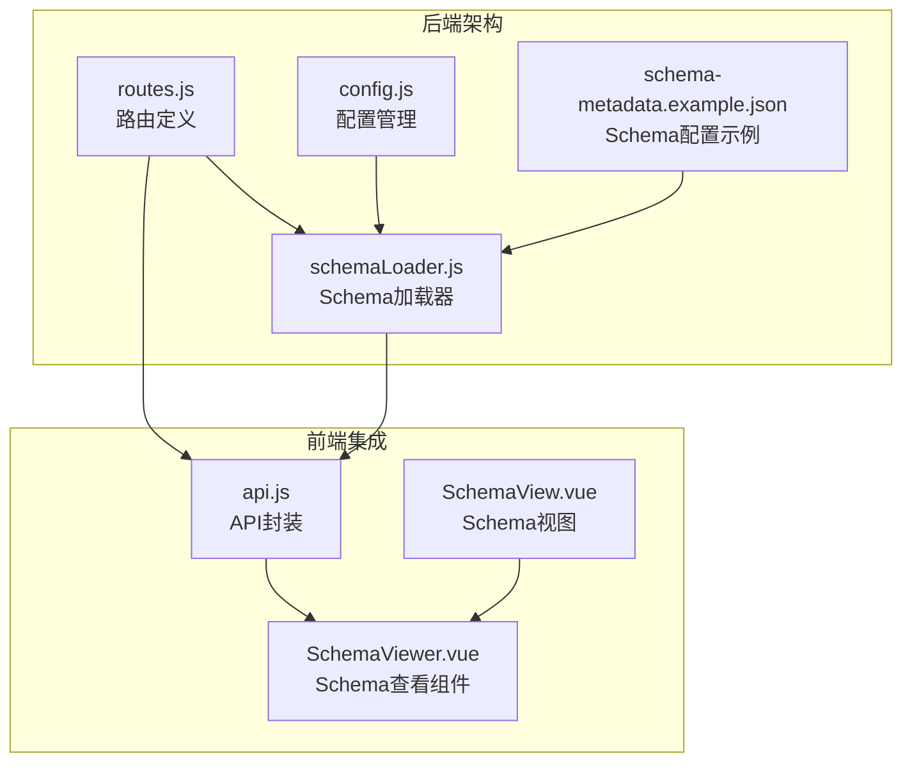
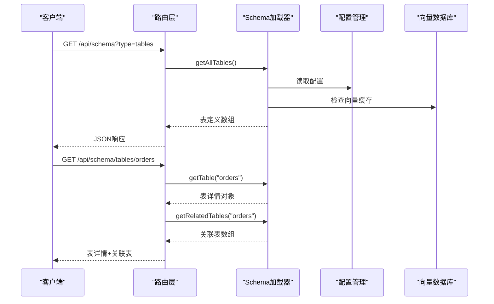
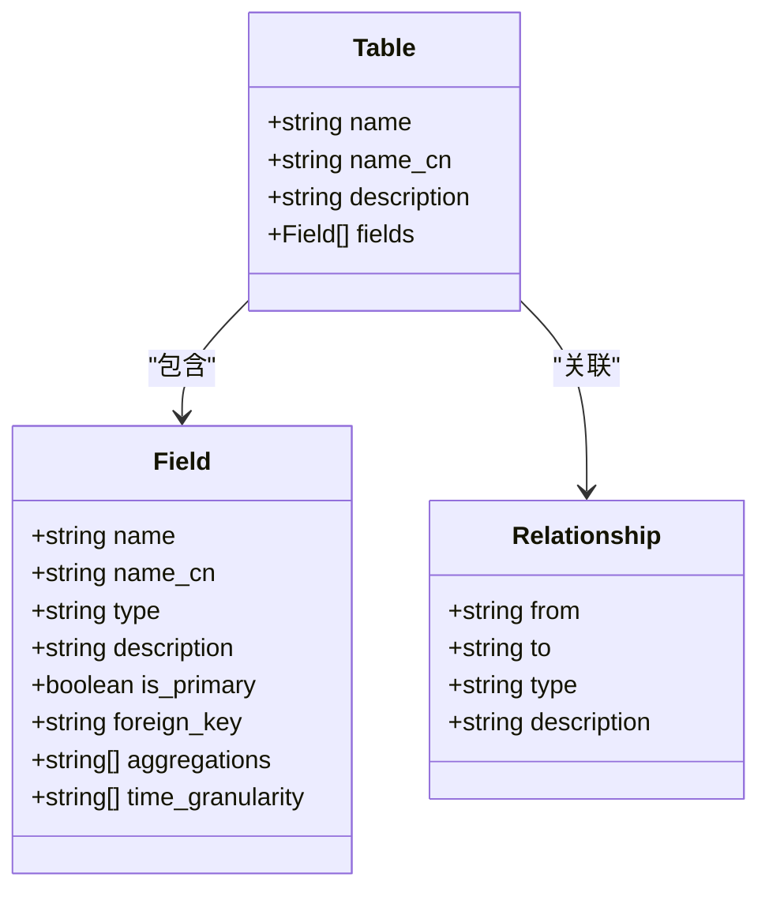
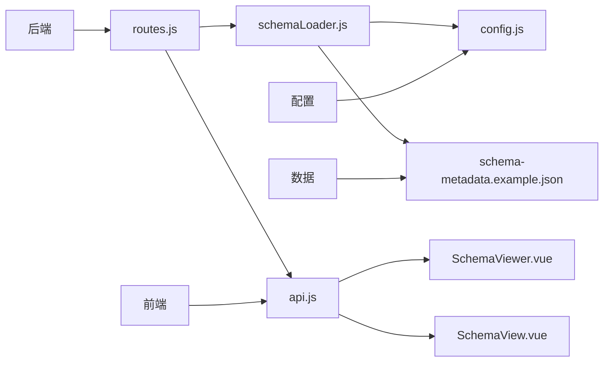

# Schema查询端点

<cite>
**本文档引用的文件**
- [routes.js](file://backend/src/core/routes.js)
- [schemaLoader.js](file://backend/src/core/schemaLoader.js)
- [schema-metadata.example.json](file://backend/config/schema-metadata.example.json)
- [config.js](file://backend/src/core/config.js)
- [api.js](file://frontend/src/utils/api.js)
</cite>

## 目录
1. [简介](#简介)
2. [项目结构](#项目结构)
3. [核心组件](#核心组件)
4. [架构概览](#架构概览)
5. [详细组件分析](#详细组件分析)
6. [依赖关系分析](#依赖关系分析)
7. [性能考虑](#性能考虑)
8. [故障排除指南](#故障排除指南)
9. [结论](#结论)

## 简介

Schema查询端点是NL2SQL系统中的核心API组件，负责提供数据库表结构、指标定义和维度信息的查询服务。该系统支持两种主要的Schema查询端点：完整Schema查询和特定表详情查询，为自然语言到SQL转换提供了丰富的元数据支持。

## 项目结构

NL2SQL项目的Schema查询功能分布在以下关键文件中：



**图表来源**
- [routes.js:141-213](file://backend/src/core/routes.js#L141-L213)
- [schemaLoader.js:1-732](file://backend/src/core/schemaLoader.js#L1-L732)

**章节来源**
- [routes.js:141-213](file://backend/src/core/routes.js#L141-L213)
- [schemaLoader.js:1-732](file://backend/src/core/schemaLoader.js#L1-L732)

## 核心组件

### Schema查询路由模块

路由模块定义了两个核心的Schema查询端点：

1. **完整Schema查询端点** (`GET /api/schema`)
2. **表详情查询端点** (`GET /api/schema/tables/:tableName`)

这两个端点通过统一的Schema加载器提供数据访问，支持灵活的查询参数和响应格式。

### Schema加载器模块

Schema加载器负责：
- 从JSON配置文件加载Schema元数据
- 提供各种查询接口（表、指标、维度）
- 实现缓存机制提高性能
- 支持向量化搜索功能

**章节来源**
- [routes.js:141-213](file://backend/src/core/routes.js#L141-L213)
- [schemaLoader.js:296-390](file://backend/src/core/schemaLoader.js#L296-L390)

## 架构概览



**图表来源**
- [routes.js:148-213](file://backend/src/core/routes.js#L148-L213)
- [schemaLoader.js:300-390](file://backend/src/core/schemaLoader.js#L300-L390)

## 详细组件分析

### 完整Schema查询端点

#### 端点规范

**URL**: `GET /api/schema`

**查询参数**:
- `type` (可选): 数据类型筛选
  - `tables`: 仅返回表定义
  - `metrics`: 仅返回指标定义
  - `dimensions`: 仅返回维度定义
  - 默认: 返回完整Schema（包含tables、metrics、dimensions）

#### 响应格式

**默认响应结构**:
```json
{
  "version": "1.0",
  "tables": [...],
  "metrics": [...],
  "dimensions": [...]
}
```

**按类型筛选响应**:
```json
{
  "tables": [...]  // 或 "metrics": [...], "dimensions": [...]
}
```

#### 实际使用示例

**完整Schema查询**:
```bash
curl -X GET "http://localhost:3000/api/schema"
```

**表定义查询**:
```bash
curl -X GET "http://localhost:3000/api/schema?type=tables"
```

**指标定义查询**:
```bash
curl -X GET "http://localhost:3000/api/schema?type=metrics"
```

**维度定义查询**:
```bash
curl -X GET "http://localhost:3000/api/schema?type=dimensions"
```

**章节来源**
- [routes.js:141-184](file://backend/src/core/routes.js#L141-L184)

### 表详情查询端点

#### 端点规范

**URL**: `GET /api/schema/tables/:tableName`

**路径参数**:
- `tableName`: 目标表的名称（支持英文名或中文名）

#### 响应格式

**成功响应**:
```json
{
  "table": {
    "name": "sales_order",
    "name_cn": "销售订单表",
    "description": "记录所有销售订单的主表",
    "fields": [
      {
        "name": "order_id",
        "name_cn": "订单ID",
        "type": "VARCHAR(32)",
        "description": "订单唯一标识",
        "is_primary": true
      }
    ]
  },
  "relatedTables": ["users", "region", "products"]
}
```

#### 实际使用示例

**查询特定表详情**:
```bash
curl -X GET "http://localhost:3000/api/schema/tables/sales_order"
```

**查询不存在的表**:
```bash
curl -X GET "http://localhost:3000/api/schema/tables/nonexistent_table"
```

**章节来源**
- [routes.js:186-213](file://backend/src/core/routes.js#L186-L213)

### Schema数据结构

#### 表定义结构



**图表来源**
- [schema-metadata.example.json:4-327](file://backend/config/schema-metadata.example.json#L4-L327)

#### 指标和维度结构

**指标定义**:
```json
{
  "name": "sales_amount",
  "name_cn": "销售额",
  "definition": "SUM(sales_order.order_amount)",
  "description": "订单金额总和",
  "unit": "元"
}
```

**维度定义**:
```json
{
  "name": "时间",
  "name_cn": "时间",
  "fields": ["sales_order.created_at", "sales_order.pay_time"],
  "granularities": ["hour", "day", "week", "month", "quarter", "year"]
}
```

**章节来源**
- [schema-metadata.example.json:253-327](file://backend/config/schema-metadata.example.json#L253-L327)

## 依赖关系分析



**图表来源**
- [routes.js:22-27](file://backend/src/core/routes.js#L22-L27)
- [schemaLoader.js:19-26](file://backend/src/core/schemaLoader.js#L19-L26)

### 组件耦合分析

- **路由层**与**Schema加载器**之间存在清晰的职责分离
- **Schema加载器**依赖于**配置管理**和**数据文件**
- **前端API封装**与**路由层**通过统一的HTTP接口交互
- **向量数据库**作为可选依赖，增强搜索功能

**章节来源**
- [routes.js:22-27](file://backend/src/core/routes.js#L22-L27)
- [schemaLoader.js:19-26](file://backend/src/core/schemaLoader.js#L19-L26)

## 性能考虑

### 缓存机制

Schema加载器实现了智能缓存机制：
- **缓存启用**: 通过配置项控制
- **缓存过期**: 默认1小时过期时间
- **强制刷新**: 支持重新加载Schema数据

### 向量化搜索

系统支持基于向量的语义搜索：
- **向量存储**: 使用LanceDB存储Schema向量
- **批量处理**: 分批获取Embedding向量
- **回退机制**: 向量化失败时自动回退到关键词匹配

### 最佳实践建议

1. **合理使用查询参数**: 仅在需要时使用`type`参数获取特定类型的Schema数据
2. **缓存利用**: 充分利用Schema缓存机制，减少重复加载
3. **错误处理**: 实现适当的错误处理和重试机制
4. **性能监控**: 监控Schema查询的响应时间和成功率

**章节来源**
- [schemaLoader.js:682-731](file://backend/src/core/schemaLoader.js#L682-L731)
- [config.js:235-245](file://backend/src/core/config.js#L235-L245)

## 故障排除指南

### 常见错误场景

#### 表不存在错误

**错误响应**:
```json
{
  "error": "表不存在",
  "tableName": "nonexistent_table"
}
```

**解决方案**:
1. 验证表名是否正确
2. 检查Schema配置文件中的表定义
3. 确认表名支持中文名查询

#### 配置文件错误

**错误类型**:
- Schema配置文件不存在
- JSON格式不正确
- 必要字段缺失

**解决方案**:
1. 检查配置文件路径
2. 验证JSON格式
3. 确保必需字段完整

#### 向量数据库问题

**错误表现**:
- 向量化过程失败
- 搜索结果不准确

**解决方案**:
1. 检查向量数据库连接
2. 验证Embedding模型配置
3. 确认磁盘空间充足

### 调试技巧

1. **启用详细日志**: 检查后端日志输出
2. **验证Schema格式**: 使用示例配置文件对比
3. **测试基本功能**: 先测试`/api/health`端点确认服务正常
4. **逐步排查**: 从简单查询开始，逐步增加复杂度

**章节来源**
- [routes.js:197-203](file://backend/src/core/routes.js#L197-L203)
- [schemaLoader.js:77-80](file://backend/src/core/schemaLoader.js#L77-L80)

## 结论

Schema查询端点为NL2SQL系统提供了强大的元数据查询能力。通过合理的API设计和完善的错误处理机制，系统能够为用户提供准确、高效的Schema信息查询服务。配合前端的Schema查看组件，用户可以直观地了解数据库结构和业务规则，为后续的自然语言查询奠定坚实基础。

建议在生产环境中：
- 配置适当的缓存策略
- 监控Schema查询性能
- 定期验证Schema配置的准确性
- 实施适当的访问控制和安全措施