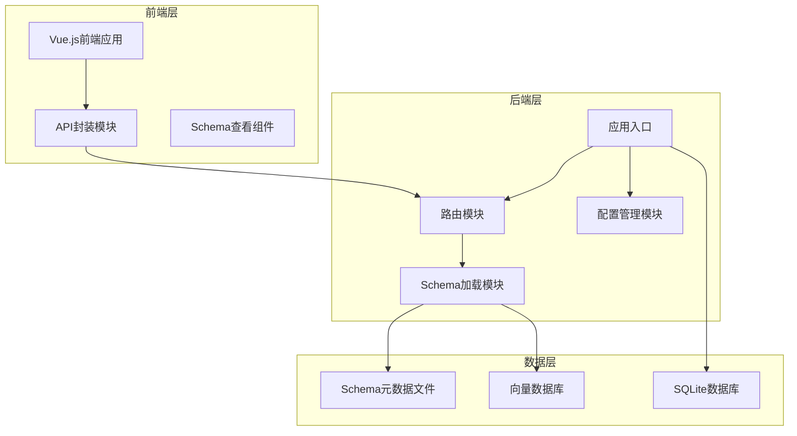
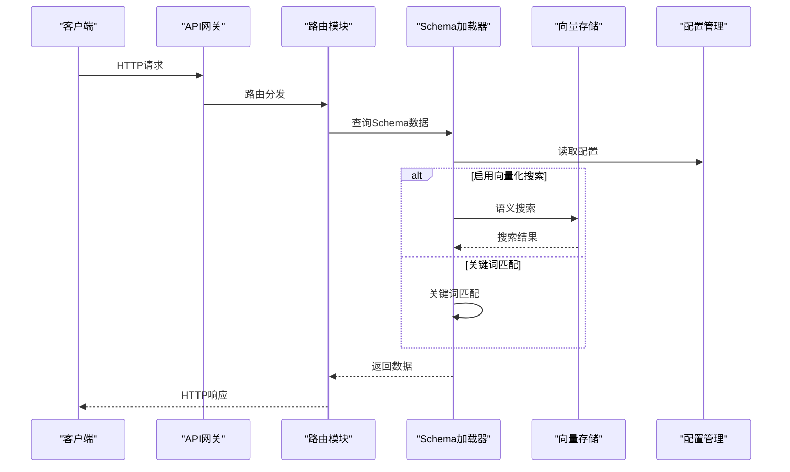
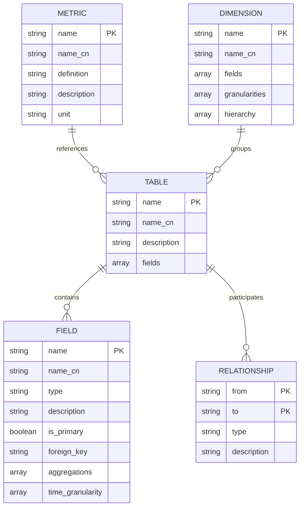
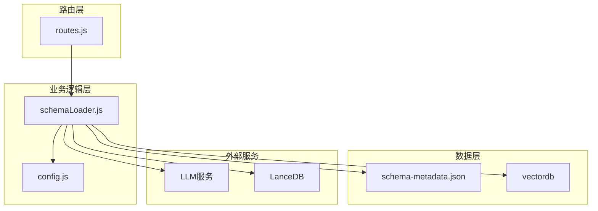
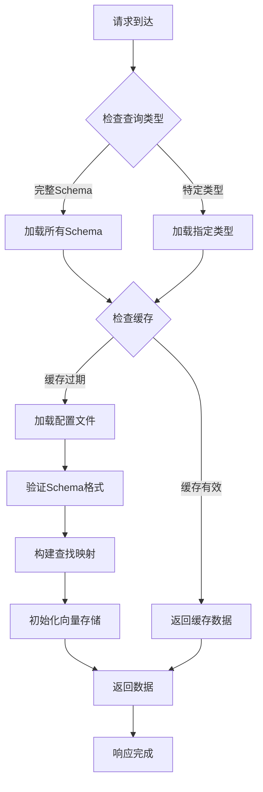

# Schema管理接口

<cite>
**本文档引用的文件**
- [routes.js](file://backend/src/core/routes.js)
- [schemaLoader.js](file://backend/src/core/schemaLoader.js)
- [schema-metadata.example.json](file://backend/config/schema-metadata.example.json)
- [config.js](file://backend/src/core/config.js)
- [app.js](file://backend/src/app.js)
- [api.js](file://frontend/src/utils/api.js)
- [SchemaView.vue](file://frontend/src/views/SchemaView.vue)
</cite>

## 目录
1. [简介](#简介)
2. [项目结构](#项目结构)
3. [核心组件](#核心组件)
4. [架构概览](#架构概览)
5. [详细组件分析](#详细组件分析)
6. [依赖关系分析](#依赖关系分析)
7. [性能考虑](#性能考虑)
8. [故障排除指南](#故障排除指南)
9. [结论](#结论)

## 简介

Schema管理接口是NL2SQL系统的核心组件，负责提供数据表结构、指标和维度的元数据管理功能。该接口支持完整的Schema查询、表详情获取和智能搜索功能，为自然语言转SQL提供了准确的数据结构信息。

系统采用前后端分离架构，后端基于Express.js提供RESTful API，前端使用Vue.js构建用户界面。Schema数据通过JSON配置文件管理，支持缓存机制和向量化搜索功能。

## 项目结构

NL2SQL项目的整体架构分为三层：



**图表来源**
- [app.js:97-166](file://backend/src/app.js#L97-L166)
- [routes.js:138-248](file://backend/src/core/routes.js#L138-L248)
- [schemaLoader.js:69-122](file://backend/src/core/schemaLoader.js#L69-L122)

**章节来源**
- [app.js:97-166](file://backend/src/app.js#L97-L166)
- [routes.js:138-248](file://backend/src/core/routes.js#L138-L248)

## 核心组件

### Schema数据结构定义

Schema管理系统采用标准化的数据结构来描述数据库表、指标和维度：

#### 表定义结构
```javascript
{
  "name": "表名",
  "name_cn": "中文名",
  "description": "表描述",
  "fields": [
    {
      "name": "字段名",
      "name_cn": "中文名",
      "type": "字段类型",
      "description": "字段描述",
      "is_primary": true/false,
      "foreign_key": "外键引用",
      "aggregations": ["聚合函数"],
      "time_granularity": ["时间粒度"]
    }
  ]
}
```

#### 指标定义结构
```javascript
{
  "name": "指标名",
  "name_cn": "中文名",
  "definition": "SQL定义",
  "description": "指标描述",
  "unit": "单位"
}
```

#### 维度定义结构
```javascript
{
  "name": "维度名",
  "name_cn": "中文名",
  "fields": ["字段引用"],
  "granularities": ["粒度"],
  "hierarchy": ["层级"]
}
```

**章节来源**
- [schema-metadata.example.json:4-327](file://backend/config/schema-metadata.example.json#L4-L327)

### 缓存机制

Schema管理系统实现了多层缓存策略：

1. **内存缓存**：Schema数据在内存中缓存，避免重复读取文件
2. **时间戳验证**：通过缓存时间戳判断数据是否过期
3. **配置控制**：可通过配置禁用缓存或调整过期时间

**章节来源**
- [schemaLoader.js:53-57](file://backend/src/core/schemaLoader.js#L53-L57)
- [schemaLoader.js:682-692](file://backend/src/core/schemaLoader.js#L682-L692)
- [config.js:235-245](file://backend/src/core/config.js#L235-L245)

## 架构概览

Schema管理接口的完整架构如下：



**图表来源**
- [routes.js:148-248](file://backend/src/core/routes.js#L148-L248)
- [schemaLoader.js:420-507](file://backend/src/core/schemaLoader.js#L420-L507)

## 详细组件分析

### GET /api/schema 端点

#### 功能概述
获取完整的Schema信息，支持按类型筛选返回特定的Schema元素。

#### 查询参数
- `type` (可选): 类型筛选器
  - `tables`: 仅返回表定义
  - `metrics`: 仅返回指标定义
  - `dimensions`: 仅返回维度定义

#### 响应格式
```javascript
{
  "version": "1.0",
  "tables": [...],      // 表定义数组
  "metrics": [...],     // 指标定义数组  
  "dimensions": [...]   // 维度定义数组
}
```

#### 错误处理
- 400 Bad Request: 当type参数无效时
- 500 Internal Server Error: 当Schema加载失败时

**章节来源**
- [routes.js:141-184](file://backend/src/core/routes.js#L141-L184)

### GET /api/schema/tables/:tableName 端点

#### 功能概述
获取指定表的详细信息，包括表定义和关联表信息。

#### 路径参数
- `tableName`: 表名（支持英文名或中文名）

#### 响应格式
```javascript
{
  "table": {
    "name": "表名",
    "name_cn": "中文名",
    "description": "表描述",
    "fields": [...]
  },
  "relatedTables": ["表1", "表2", ...]  // 关联表名数组
}
```

#### 错误处理
- 404 Not Found: 当表不存在时
- 500 Internal Server Error: 当查询失败时

**章节来源**
- [routes.js:186-213](file://backend/src/core/routes.js#L186-L213)
- [schemaLoader.js:379-390](file://backend/src/core/schemaLoader.js#L379-L390)

### GET /api/schema/search 端点

#### 功能概述
搜索相关的表和字段，支持语义搜索和关键词匹配。

#### 查询参数
- `q` (必需): 搜索关键词
- `limit` (可选): 返回结果数量限制，默认5

#### 搜索算法
系统采用双层搜索策略：

1. **语义搜索**（推荐）
   - 使用LLM生成Embedding向量
   - 在向量数据库中进行相似度搜索
   - 支持上下文增强（游戏ID、数据源）

2. **关键词匹配**（回退）
   - 基于关键词的简单匹配
   - 支持表名、中文名、描述的模糊匹配

#### 响应格式
```javascript
{
  "query": "搜索关键词",
  "count": 3,
  "tables": [
    {
      "name": "表名",
      "name_cn": "中文名",
      "description": "表描述",
      "fields": [...],
      "score": 0.95
    }
  ]
}
```

#### 错误处理
- 400 Bad Request: 当缺少q参数时
- 500 Internal Server Error: 当搜索失败时

**章节来源**
- [routes.js:215-248](file://backend/src/core/routes.js#L215-L248)
- [schemaLoader.js:420-507](file://backend/src/core/schemaLoader.js#L420-L507)

### Schema数据结构关系图



**图表来源**
- [schema-metadata.example.json:4-327](file://backend/config/schema-metadata.example.json#L4-L327)

## 依赖关系分析

### 组件依赖图



**图表来源**
- [routes.js:22-27](file://backend/src/core/routes.js#L22-L27)
- [schemaLoader.js:19-26](file://backend/src/core/schemaLoader.js#L19-L26)

### 数据流图



**图表来源**
- [schemaLoader.js:69-122](file://backend/src/core/schemaLoader.js#L69-L122)
- [schemaLoader.js:161-189](file://backend/src/core/schemaLoader.js#L161-L189)

**章节来源**
- [schemaLoader.js:69-122](file://backend/src/core/schemaLoader.js#L69-L122)
- [schemaLoader.js:161-189](file://backend/src/core/schemaLoader.js#L161-L189)

## 性能考虑

### 缓存策略

1. **内存缓存优化**
   - Schema数据在内存中缓存，避免重复文件I/O
   - 缓存时间戳每小时更新一次
   - 支持动态缓存失效

2. **向量化搜索优化**
   - 分批处理Embedding向量，避免单次请求过大
   - 批处理大小默认20个文本
   - 异常处理确保部分失败不影响整体流程

3. **索引优化**
   - 表名和字段名建立快速查找映射
   - 支持中文名和英文名的双重映射

### 性能优化建议

1. **配置优化**
   ```javascript
   // 缓存配置
   SCHEMA_CACHE_TIME: 3600000,  // 1小时
   SCHEMA_REVECTORIZE: false,   // 是否强制重新向量化
   
   // 搜索配置  
   SEARCH_BATCH_SIZE: 20,       // 搜索批处理大小
   SEARCH_TOP_K: 5,             // 返回结果数量
   ```

2. **最佳实践**
   - 合理设置缓存过期时间
   - 在大量数据场景下启用向量化搜索
   - 使用适当的limit参数控制返回数量
   - 实施适当的错误重试机制

**章节来源**
- [config.js:235-245](file://backend/src/core/config.js#L235-L245)
- [schemaLoader.js:256-273](file://backend/src/core/schemaLoader.js#L256-L273)

## 故障排除指南

### 常见错误及解决方案

#### Schema文件加载失败
**症状**: 服务启动时报Schema文件不存在
**原因**: 配置文件路径错误或文件损坏
**解决方案**:
1. 检查SCHEMA_CONFIG_PATH配置
2. 验证JSON格式正确性
3. 确认文件权限设置

#### 向量存储初始化失败
**症状**: 搜索功能不可用
**原因**: LanceDB初始化失败或磁盘空间不足
**解决方案**:
1. 检查VECTOR_DB_PATH配置
2. 确认磁盘空间充足
3. 验证文件权限

#### 搜索结果为空
**症状**: 搜索接口返回空结果
**原因**: 向量化数据缺失或搜索关键词不匹配
**解决方案**:
1. 检查向量存储状态
2. 验证搜索关键词
3. 调整搜索参数

### 调试工具

1. **健康检查接口**
   ```bash
   GET /api/health
   GET /api/health/detail
   ```

2. **配置检查**
   ```bash
   GET /api/config
   ```

3. **统计信息**
   ```bash
   GET /api/stats
   ```

**章节来源**
- [routes.js:58-135](file://backend/src/core/routes.js#L58-L135)
- [routes.js:724-771](file://backend/src/core/routes.js#L724-L771)

## 结论

Schema管理接口为NL2SQL系统提供了完整的数据结构管理能力。通过标准化的Schema数据结构、智能的搜索算法和高效的缓存机制，系统能够为自然语言转SQL提供准确可靠的数据支持。

主要优势：
- **灵活的数据结构**：支持表、指标、维度的统一管理
- **智能搜索**：结合语义搜索和关键词匹配的混合算法
- **高性能设计**：多层缓存和向量化优化
- **易于扩展**：模块化设计支持功能扩展

未来改进方向：
- 增强搜索算法的准确性
- 优化大数据量场景下的性能表现
- 提供Schema版本管理和变更追踪功能