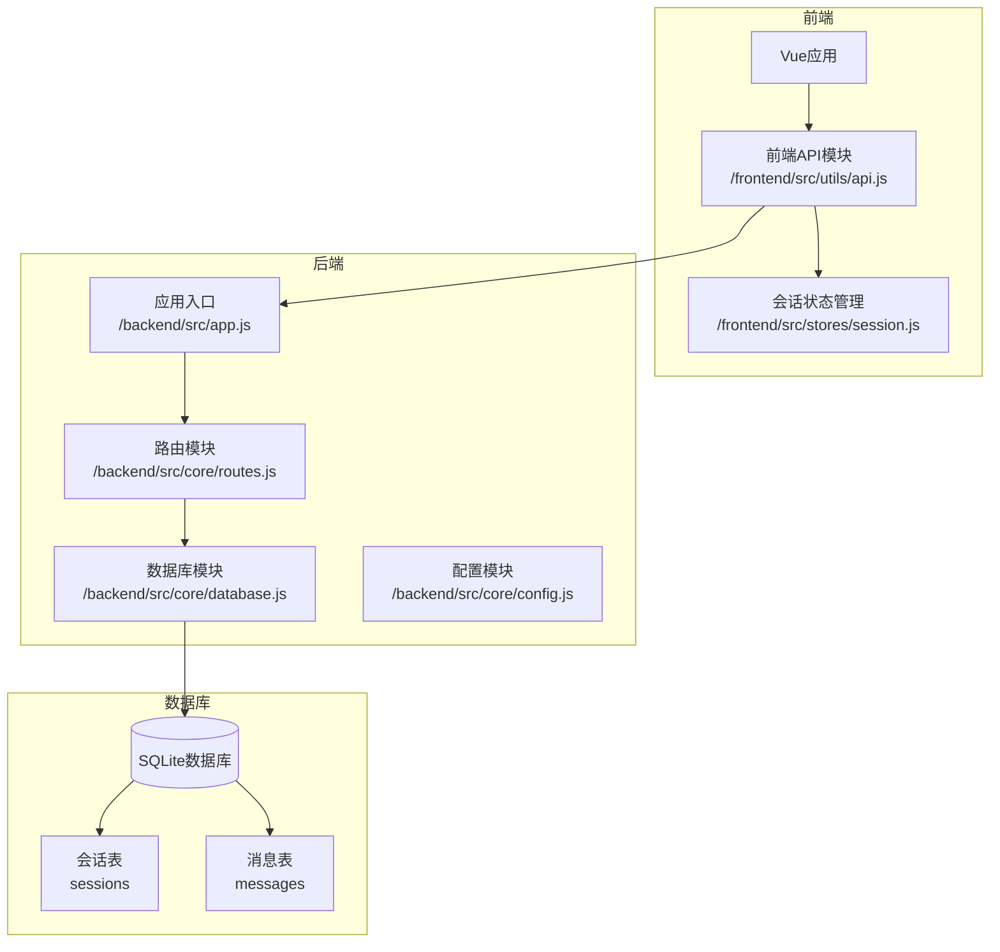
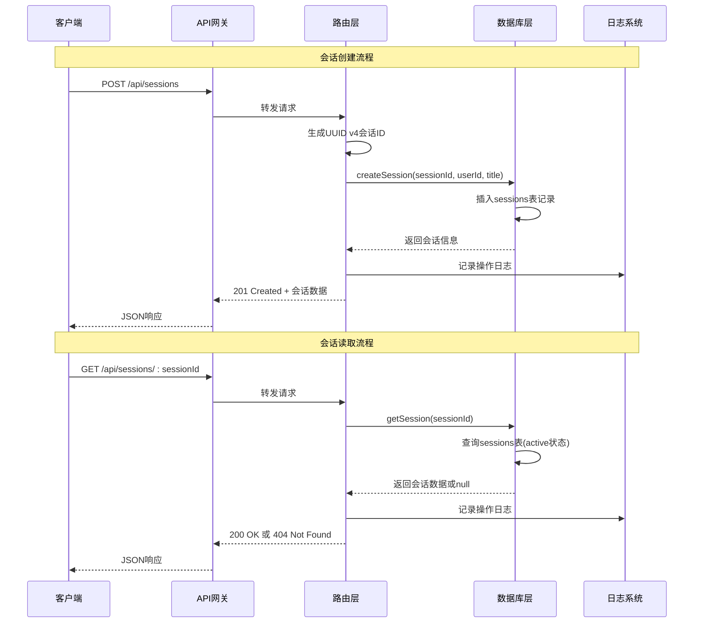
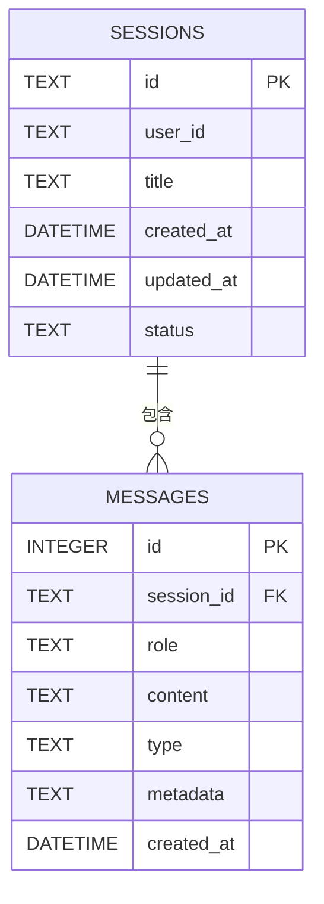
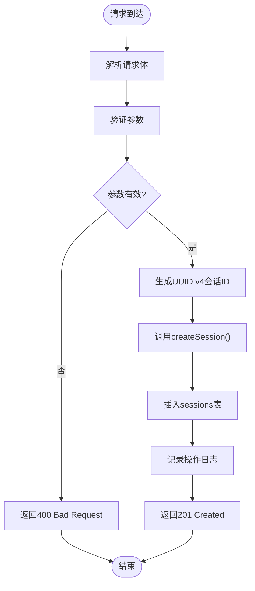
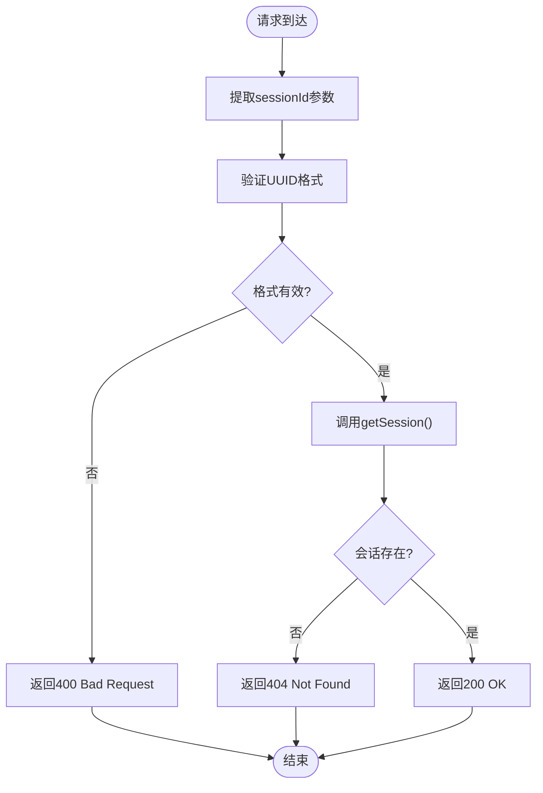
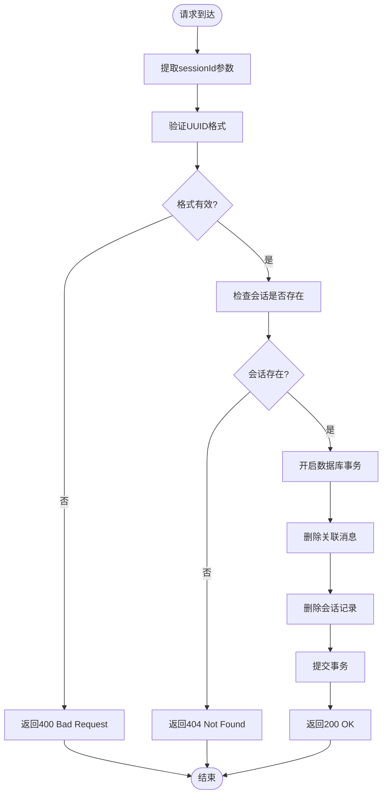
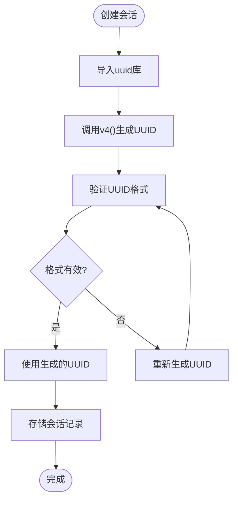
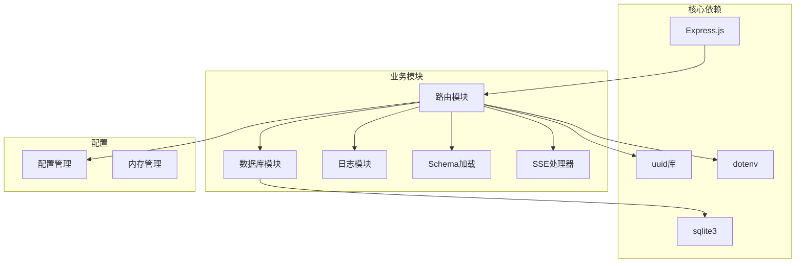
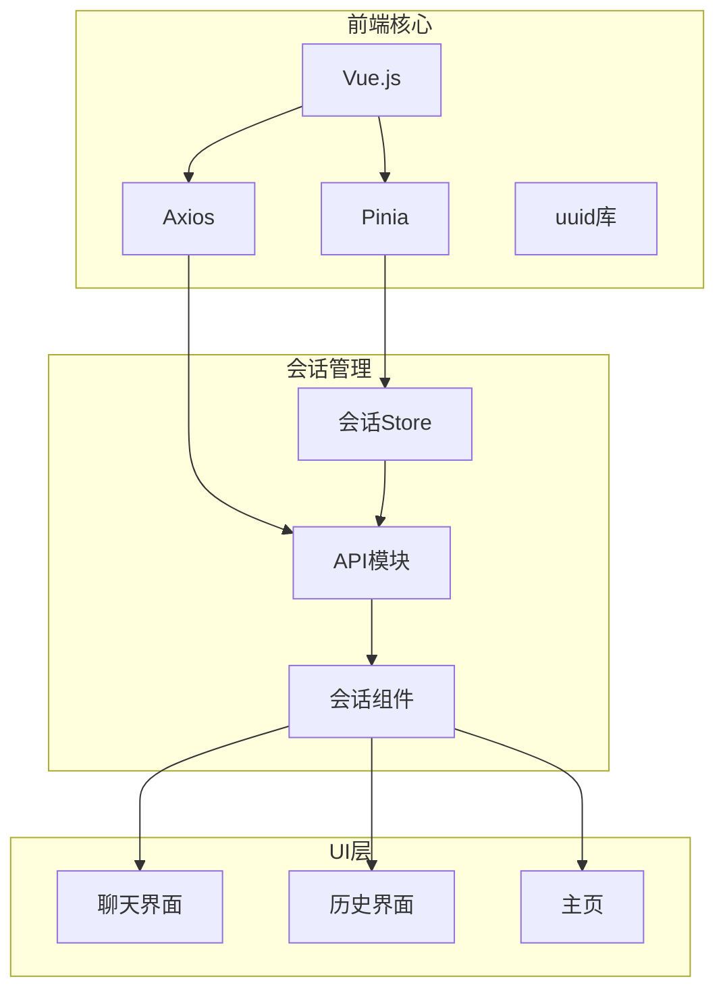

# 会话CRUD端点

<cite>
**本文引用的文件**
- [routes.js](file://backend/src/core/routes.js)
- [database.js](file://backend/src/core/database.js)
- [app.js](file://backend/src/app.js)
- [api.js](file://frontend/src/utils/api.js)
- [session.js](file://frontend/src/stores/session.js)
- [package.json](file://backend/package.json)
</cite>

## 目录
1. [简介](#简介)
2. [项目结构](#项目结构)
3. [核心组件](#核心组件)
4. [架构概览](#架构概览)
5. [详细组件分析](#详细组件分析)
6. [依赖分析](#依赖分析)
7. [性能考虑](#性能考虑)
8. [故障排除指南](#故障排除指南)
9. [结论](#结论)

## 简介
本文档详细记录了NL2SQL服务中的会话CRUD端点API规范，包括：
- POST /api/sessions（创建新会话）
- GET /api/sessions/:sessionId（获取会话信息）
- DELETE /api/sessions/:sessionId（删除会话）

重点涵盖会话ID生成机制（UUID v4）、默认值处理（匿名用户和默认标题）、错误处理和状态码，以及完整的请求和响应示例。

## 项目结构
NL2SQL服务采用前后端分离架构，后端基于Express.js提供RESTful API，前端使用Vue.js + Pinia进行状态管理。



**图表来源**
- [app.js:1-238](file://backend/src/app.js#L1-L238)
- [routes.js:1-895](file://backend/src/core/routes.js#L1-L895)
- [database.js:1-850](file://backend/src/core/database.js#L1-L850)

**章节来源**
- [app.js:1-238](file://backend/src/app.js#L1-L238)
- [routes.js:1-895](file://backend/src/core/routes.js#L1-L895)

## 核心组件
会话CRUD功能由以下核心组件构成：

### 后端路由层
- 路由定义：在routes.js中定义所有会话相关端点
- 中间件：统一的日志记录和错误处理
- 参数验证：基本的输入验证和错误处理

### 数据库层
- SQLite数据库：使用sqlite3模块进行数据持久化
- 表结构：sessions表存储会话信息，包含UUID主键、用户ID、标题等字段
- 索引优化：为user_id、status、updated_at等字段建立索引

### 前端集成
- API封装：前端通过api.js模块统一管理HTTP请求
- 状态管理：使用Pinia store管理会话状态和生命周期
- 用户界面：提供会话列表、创建、删除等交互功能

**章节来源**
- [routes.js:250-343](file://backend/src/core/routes.js#L250-L343)
- [database.js:44-189](file://backend/src/core/database.js#L44-L189)
- [api.js:144-195](file://frontend/src/utils/api.js#L144-L195)

## 架构概览
会话CRUD端点遵循RESTful设计原则，采用标准的HTTP状态码和JSON响应格式。



**图表来源**
- [routes.js:264-343](file://backend/src/core/routes.js#L264-L343)
- [database.js:458-476](file://backend/src/core/database.js#L458-L476)

## 详细组件分析

### 会话数据模型
会话数据结构定义如下：



**图表来源**
- [database.js:44-92](file://backend/src/core/database.js#L44-L92)

#### 字段说明
- **id**: 会话唯一标识符，使用UUID v4格式
- **user_id**: 用户标识符，默认值为'anonymous'
- **title**: 会话标题，默认值为'新会话'
- **created_at**: 会话创建时间，默认当前时间戳
- **updated_at**: 最后更新时间，默认当前时间戳
- **status**: 会话状态，默认'active'

**章节来源**
- [database.js:44-57](file://backend/src/core/database.js#L44-L57)

### 会话创建端点 (POST /api/sessions)

#### 接口规范
- **方法**: POST
- **路径**: /api/sessions
- **请求头**: Content-Type: application/json
- **请求体参数**:
  - user_id: string (可选) - 用户ID，默认'anonymous'
  - title: string (可选) - 会话标题，默认'新会话'

#### 请求示例
```javascript
// 基本请求
{
  "user_id": "user_123",
  "title": "销售数据分析"
}

// 简化请求（使用默认值）
{
  "user_id": "anonymous"
}
```

#### 响应示例
```javascript
// 成功响应 (201 Created)
{
  "id": "550e8400-e29b-41d4-a716-446655440000",
  "user_id": "user_123",
  "title": "销售数据分析"
}

// 错误响应 (500 Internal Server Error)
{
  "error": "创建会话失败: 数据库连接异常"
}
```

#### 处理流程


**图表来源**
- [routes.js:264-288](file://backend/src/core/routes.js#L264-L288)
- [database.js:458-466](file://backend/src/core/database.js#L458-L466)

**章节来源**
- [routes.js:254-288](file://backend/src/core/routes.js#L254-L288)
- [database.js:458-466](file://backend/src/core/database.js#L458-L466)

### 会话读取端点 (GET /api/sessions/:sessionId)

#### 接口规范
- **方法**: GET
- **路径**: /api/sessions/:sessionId
- **路径参数**:
  - sessionId: string - 会话ID（UUID v4格式）

#### 请求示例
```javascript
// GET /api/sessions/550e8400-e29b-41d4-a716-446655440000
```

#### 响应示例
```javascript
// 成功响应 (200 OK)
{
  "id": "550e8400-e29b-41d4-a716-446655440000",
  "user_id": "user_123",
  "title": "销售数据分析",
  "created_at": "2024-01-15T10:30:00Z",
  "updated_at": "2024-01-15T14:45:00Z",
  "status": "active"
}

// 错误响应 (404 Not Found)
{
  "error": "会话不存在"
}

// 错误响应 (500 Internal Server Error)
{
  "error": "获取会话失败: 数据库查询异常"
}
```

#### 处理流程


**图表来源**
- [routes.js:294-312](file://backend/src/core/routes.js#L294-L312)
- [database.js:473-476](file://backend/src/core/database.js#L473-L476)

**章节来源**
- [routes.js:290-312](file://backend/src/core/routes.js#L290-L312)
- [database.js:473-476](file://backend/src/core/database.js#L473-L476)

### 会话删除端点 (DELETE /api/sessions/:sessionId)

#### 接口规范
- **方法**: DELETE
- **路径**: /api/sessions/:sessionId
- **路径参数**:
  - sessionId: string - 会话ID（UUID v4格式）

#### 请求示例
```javascript
// DELETE /api/sessions/550e8400-e29b-41d4-a716-446655440000
```

#### 响应示例
```javascript
// 成功响应 (200 OK)
{
  "success": true,
  "message": "会话已删除"
}

// 错误响应 (404 Not Found)
{
  "error": "会话不存在"
}

// 错误响应 (500 Internal Server Error)
{
  "error": "删除会话失败: 数据库事务异常"
}
```

#### 处理流程


**图表来源**
- [routes.js:318-343](file://backend/src/core/routes.js#L318-L343)
- [database.js:521-540](file://backend/src/core/database.js#L521-L540)

**章节来源**
- [routes.js:314-343](file://backend/src/core/routes.js#L314-L343)
- [database.js:521-540](file://backend/src/core/database.js#L521-L540)

### 会话ID生成机制
系统使用UUID v4算法生成全局唯一的会话ID：



**图表来源**
- [routes.js:270-271](file://backend/src/core/routes.js#L270-L271)

**章节来源**
- [routes.js:270-271](file://backend/src/core/routes.js#L270-L271)

### 默认值处理策略
系统实现了智能的默认值处理机制：

| 参数 | 默认值 | 处理逻辑 |
|------|--------|----------|
| user_id | 'anonymous' | 如果请求体中未提供user_id，则使用'anonymous' |
| title | '新会话' | 如果请求体中未提供title，则使用'新会话' |

**章节来源**
- [routes.js:276-277](file://backend/src/core/routes.js#L276-L277)

### 错误处理和状态码
系统遵循RESTful API标准的状态码约定：

#### 成功状态码
- **200 OK**: GET请求成功获取资源
- **201 Created**: POST请求成功创建资源
- **204 No Content**: DELETE请求成功删除资源

#### 客户端错误状态码
- **400 Bad Request**: 请求参数格式错误或缺失
- **404 Not Found**: 请求的资源不存在
- **405 Method Not Allowed**: 不支持的HTTP方法

#### 服务器错误状态码
- **500 Internal Server Error**: 服务器内部错误

**章节来源**
- [routes.js:282-287](file://backend/src/core/routes.js#L282-L287)
- [routes.js:306-311](file://backend/src/core/routes.js#L306-L311)
- [routes.js:337-342](file://backend/src/core/routes.js#L337-L342)

## 依赖分析

### 后端依赖关系


**图表来源**
- [package.json:10-20](file://backend/package.json#L10-L20)
- [app.js:22-50](file://backend/src/app.js#L22-L50)

### 前端依赖关系


**图表来源**
- [api.js:14-16](file://frontend/src/utils/api.js#L14-L16)
- [session.js:15-22](file://frontend/src/stores/session.js#L15-L22)

**章节来源**
- [package.json:1-28](file://backend/package.json#L1-L28)
- [api.js:1-252](file://frontend/src/utils/api.js#L1-L252)

## 性能考虑
会话CRUD端点的性能优化策略：

### 数据库优化
- **索引策略**: 为user_id、status、updated_at字段建立索引，加速查询性能
- **事务处理**: 删除会话时使用事务确保数据一致性
- **参数化查询**: 使用参数化SQL防止SQL注入并提高查询效率

### 缓存策略
- **会话缓存**: 对频繁访问的会话信息进行缓存
- **消息预加载**: 在会话切换时预加载消息历史

### 并发控制
- **连接池**: 使用SQLite连接池管理数据库连接
- **请求限流**: 实现基本的请求频率限制防止滥用

## 故障排除指南

### 常见问题及解决方案

#### 1. 会话创建失败
**症状**: POST /api/sessions 返回500错误
**可能原因**:
- 数据库连接异常
- UUID生成失败
- 数据库表结构问题

**解决步骤**:
1. 检查数据库连接状态
2. 验证sessions表结构
3. 查看服务器日志获取详细错误信息

#### 2. 会话读取失败
**症状**: GET /api/sessions/:sessionId 返回404错误
**可能原因**:
- 会话ID格式不正确
- 会话已被删除
- 会话状态不是active

**解决步骤**:
1. 验证UUID格式
2. 检查会话状态
3. 确认会话ID正确性

#### 3. 会话删除失败
**症状**: DELETE /api/sessions/:sessionId 返回500错误
**可能原因**:
- 数据库事务失败
- 外键约束冲突
- 数据库锁定

**解决步骤**:
1. 检查数据库事务状态
2. 验证外键关系
3. 重启数据库服务

**章节来源**
- [routes.js:282-287](file://backend/src/core/routes.js#L282-L287)
- [routes.js:306-311](file://backend/src/core/routes.js#L306-L311)
- [routes.js:337-342](file://backend/src/core/routes.js#L337-L342)

## 结论
NL2SQL服务的会话CRUD端点提供了完整的会话生命周期管理功能。系统采用UUID v4确保会话ID的全局唯一性，实现了智能的默认值处理机制，并建立了完善的错误处理和状态码体系。

### 主要特性总结
- **标准化API**: 遵循RESTful设计原则
- **数据完整性**: 使用UUID v4和外键约束
- **错误处理**: 完善的错误处理和状态码
- **性能优化**: 索引优化和事务处理
- **前后端集成**: 前端状态管理和API封装

### 最佳实践建议
1. **参数验证**: 始终验证请求参数的有效性
2. **错误处理**: 实现统一的错误处理机制
3. **日志记录**: 记录所有重要的操作日志
4. **性能监控**: 监控数据库查询性能
5. **安全考虑**: 实施适当的访问控制和数据验证