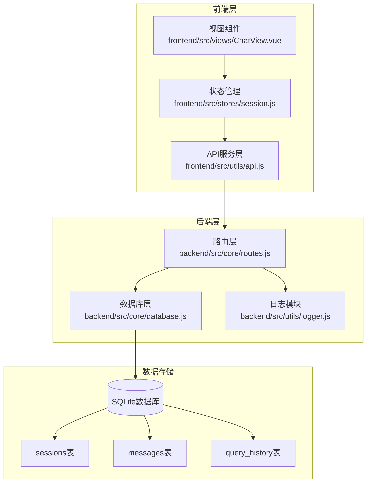
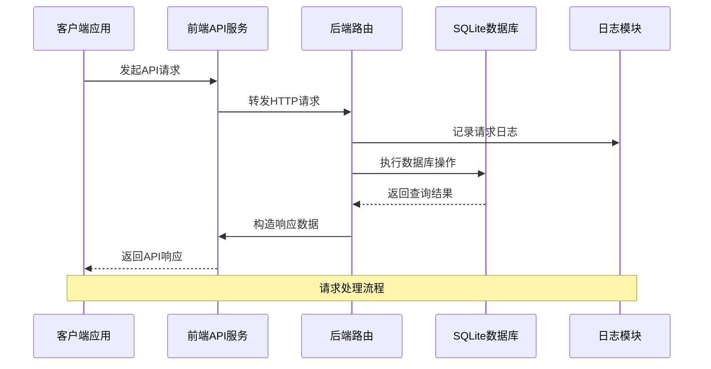
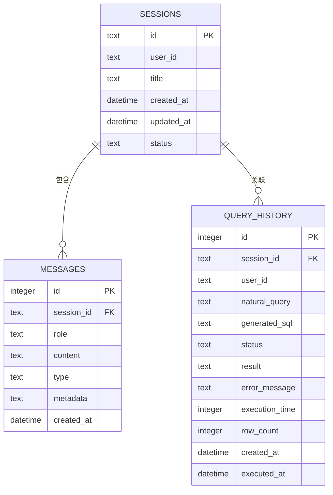
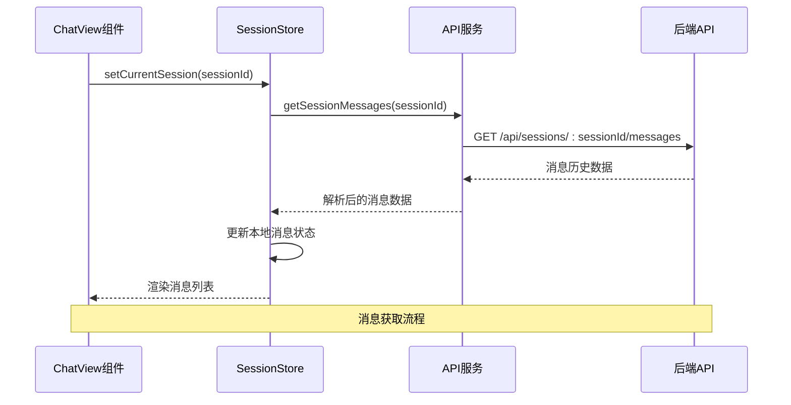
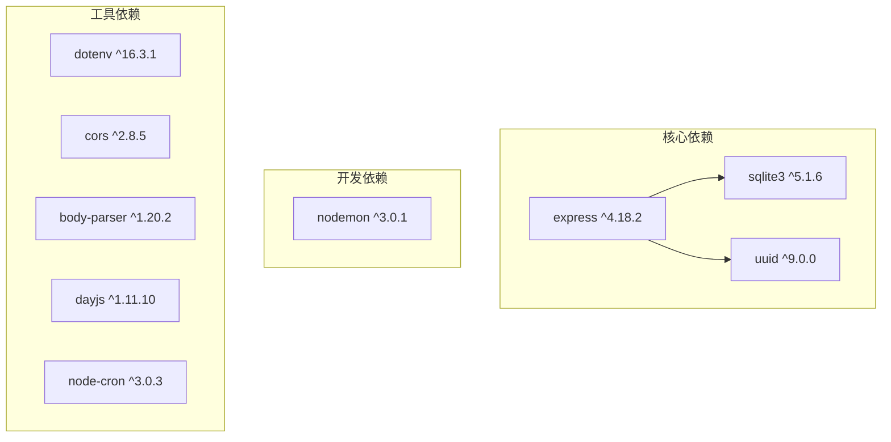

# 会话消息接口

<cite>
**本文档引用的文件**
- [routes.js](file://backend/src/core/routes.js)
- [database.js](file://backend/src/core/database.js)
- [api.js](file://frontend/src/utils/api.js)
- [session.js](file://frontend/src/stores/session.js)
- [package.json](file://backend/package.json)
</cite>

## 目录
1. [简介](#简介)
2. [项目结构](#项目结构)
3. [核心组件](#核心组件)
4. [架构概览](#架构概览)
5. [详细组件分析](#详细组件分析)
6. [依赖分析](#依赖分析)
7. [性能考虑](#性能考虑)
8. [故障排除指南](#故障排除指南)
9. [结论](#结论)

## 简介

本文档详细描述了NL2SQL系统中会话消息相关的REST API接口，重点关注以下两个核心端点：
- GET /api/sessions/:sessionId/messages - 获取特定会话的消息历史
- GET /api/users/:userId/sessions - 获取用户的全部会话列表

这些接口支持消息历史查询的参数使用方法（limit参数）、分页机制和数据格式，提供了会话消息获取的请求示例和响应示例，展示了如何查询特定会话的消息历史和用户的全部会话列表。同时包含消息排序规则（按时间倒序）、性能优化建议和错误处理的最佳实践，说明了会话与用户之间的关联关系和数据访问权限控制。

## 项目结构

NL2SQL项目采用前后端分离的架构设计，后端使用Node.js + Express构建RESTful API，前端使用Vue.js + Pinia构建用户界面。



**图表来源**
- [routes.js:1-895](file://backend/src/core/routes.js#L1-L895)
- [database.js:1-850](file://backend/src/core/database.js#L1-L850)
- [api.js:1-252](file://frontend/src/utils/api.js#L1-L252)
- [session.js:1-398](file://frontend/src/stores/session.js#L1-L398)

**章节来源**
- [routes.js:1-895](file://backend/src/core/routes.js#L1-L895)
- [database.js:1-850](file://backend/src/core/database.js#L1-L850)
- [api.js:1-252](file://frontend/src/utils/api.js#L1-L252)
- [session.js:1-398](file://frontend/src/stores/session.js#L1-L398)

## 核心组件

### 后端路由组件

后端路由模块负责定义和实现所有RESTful API端点，包括会话消息接口。主要功能包括：

- **请求日志中间件**：记录每个API请求的基本信息
- **会话管理接口**：创建、获取、删除会话
- **消息历史接口**：获取会话消息历史和用户会话列表
- **查询历史接口**：管理查询历史记录
- **健康检查接口**：监控服务状态

### 数据库组件

数据库模块负责会话历史、查询日志等数据的持久化存储，使用SQLite轻量级数据库。核心表结构包括：

- **sessions表**：存储用户的会话信息
- **messages表**：存储会话中的消息历史
- **query_history表**：存储用户的数据查询记录

### 前端API组件

前端API模块封装所有与后端API的通信，包括HTTP REST API调用、请求/响应拦截和错误处理。主要功能包括：

- **axios实例配置**：设置基础URL和超时时间
- **请求拦截器**：在请求发送前执行
- **响应拦截器**：统一处理错误
- **API方法封装**：会话相关API的封装

**章节来源**
- [routes.js:1-895](file://backend/src/core/routes.js#L1-L895)
- [database.js:1-850](file://backend/src/core/database.js#L1-L850)
- [api.js:1-252](file://frontend/src/utils/api.js#L1-L252)

## 架构概览

NL2SQL系统的整体架构采用分层设计，确保了良好的可维护性和扩展性。



**图表来源**
- [routes.js:44-52](file://backend/src/core/routes.js#L44-L52)
- [database.js:361-424](file://backend/src/core/database.js#L361-L424)
- [api.js:44-88](file://frontend/src/utils/api.js#L44-L88)

系统的关键特性包括：
- **异步处理**：所有数据库操作都使用Promise进行异步处理
- **错误处理**：统一的错误处理机制，确保API的稳定性
- **日志记录**：完整的请求日志记录，便于调试和监控
- **数据验证**：对输入参数进行验证和转换

**章节来源**
- [routes.js:1-895](file://backend/src/core/routes.js#L1-L895)
- [database.js:1-850](file://backend/src/core/database.js#L1-L850)
- [api.js:1-252](file://frontend/src/utils/api.js#L1-L252)

## 详细组件分析

### 会话消息接口

#### GET /api/sessions/:sessionId/messages

此接口用于获取特定会话的消息历史记录。

**请求规范**
- **HTTP方法**：GET
- **路径参数**：sessionId（会话ID）
- **查询参数**：
  - limit（可选）：返回消息数量限制，默认值为50

**请求示例**
```javascript
// 基本请求
GET /api/sessions/123e4567-e89b-12d3-a456-426614174000/messages

// 带限制参数的请求
GET /api/sessions/123e4567-e89b-12d3-a456-426614174000/messages?limit=100
```

**响应格式**
```javascript
{
  "session_id": "123e4567-e89b-12d3-a456-426614174000",
  "count": 50,
  "messages": [
    {
      "id": 1,
      "session_id": "123e4567-e89b-12d3-a456-426614174000",
      "role": "user",
      "content": "查询销售额",
      "type": "text",
      "metadata": null,
      "created_at": "2024-01-15T10:30:00Z"
    },
    {
      "id": 2,
      "session_id": "123e4567-e89b-12d3-a456-426614174000",
      "role": "assistant",
      "content": "SELECT SUM(amount) FROM sales",
      "type": "sql",
      "metadata": {
        "sql": "SELECT SUM(amount) FROM sales",
        "data": []
      },
      "created_at": "2024-01-15T10:30:05Z"
    }
  ]
}
```

**处理逻辑**
1. 从路由参数中提取sessionId
2. 从查询参数中获取limit值，默认50
3. 调用数据库函数获取消息历史
4. 对metadata字段进行JSON解析
5. 返回标准化的响应格式

**错误处理**
- 404错误：当会话不存在时返回错误信息
- 500错误：数据库操作失败时返回错误信息

#### GET /api/users/:userId/sessions

此接口用于获取指定用户的所有会话列表。

**请求规范**
- **HTTP方法**：GET
- **路径参数**：userId（用户ID）
- **查询参数**：
  - limit（可选）：返回会话数量限制，默认值为20

**请求示例**
```javascript
// 基本请求
GET /api/users/user123/sessions

// 带限制参数的请求
GET /api/users/user123/sessions?limit=50
```

**响应格式**
```javascript
{
  "user_id": "user123",
  "count": 10,
  "sessions": [
    {
      "id": "123e4567-e89b-12d3-a456-426614174000",
      "user_id": "user123",
      "title": "销售数据分析",
      "created_at": "2024-01-15T10:30:00Z",
      "updated_at": "2024-01-15T14:45:00Z",
      "status": "active"
    },
    {
      "id": "888f9999-a11b-22c3-b456-426614174000",
      "user_id": "user123",
      "title": "客户统计",
      "created_at": "2024-01-14T09:15:00Z",
      "updated_at": "2024-01-14T09:15:00Z",
      "status": "active"
    }
  ]
}
```

**处理逻辑**
1. 从路由参数中提取userId
2. 从查询参数中获取limit值，默认20
3. 调用数据库函数获取用户会话列表
4. 按updated_at降序排列
5. 返回标准化的响应格式

**错误处理**
- 404错误：当会话不存在时返回错误信息
- 500错误：数据库操作失败时返回错误信息

**章节来源**
- [routes.js:345-396](file://backend/src/core/routes.js#L345-L396)
- [database.js:576-596](file://backend/src/core/database.js#L576-L596)
- [database.js:478-492](file://backend/src/core/database.js#L478-L492)

### 数据模型和关系

系统使用SQLite数据库存储会话和消息数据，采用外键约束确保数据完整性。



**图表来源**
- [database.js:44-135](file://backend/src/core/database.js#L44-L135)

**关系说明**
- **一对一关系**：每个消息属于一个会话
- **一对多关系**：每个会话包含多个消息
- **外键约束**：messages.session_id 引用 sessions.id
- **级联删除**：删除会话时自动删除其消息

**章节来源**
- [database.js:44-135](file://backend/src/core/database.js#L44-L135)

### 消息排序和分页机制

#### 排序规则

消息历史查询采用以下排序规则：

1. **会话消息历史**：按created_at升序排列
2. **用户会话列表**：按updated_at降序排列

这种设计确保用户能够看到消息的完整时间线，而会话列表显示最新的会话在前面。

#### 分页机制

系统实现了基于LIMIT的简单分页机制：

- **默认限制**：会话消息历史默认返回50条记录
- **用户会话列表默认返回20个会话**
- **可配置限制**：通过limit查询参数自定义返回数量
- **参数验证**：自动将字符串参数转换为整数

**章节来源**
- [routes.js:352-358](file://backend/src/core/routes.js#L352-L358)
- [routes.js:377-383](file://backend/src/core/routes.js#L377-L383)
- [database.js:582-588](file://backend/src/core/database.js#L582-L588)
- [database.js:484-491](file://backend/src/core/database.js#L484-L491)

### 前端集成

前端通过API服务模块与后端进行交互，实现了完整的会话消息管理功能。



**图表来源**
- [session.js:144-171](file://frontend/src/stores/session.js#L144-L171)
- [api.js:176-186](file://frontend/src/utils/api.js#L176-L186)

**前端功能特性**
- **状态管理**：使用Pinia管理会话状态
- **自动加载**：切换会话时自动加载消息历史
- **错误处理**：统一的错误处理和用户反馈
- **实时更新**：支持SSE实时消息推送

**章节来源**
- [api.js:176-186](file://frontend/src/utils/api.js#L176-L186)
- [session.js:144-171](file://frontend/src/stores/session.js#L144-L171)

## 依赖分析

### 后端依赖

NL2SQL后端使用Node.js生态系统中的关键依赖包：



**图表来源**
- [package.json:10-20](file://backend/package.json#L10-L20)

### 数据库索引策略

为了优化查询性能，数据库采用了精心设计的索引策略：

| 表名 | 索引列 | 用途 | 性能影响 |
|------|--------|------|----------|
| sessions | user_id | 按用户查询会话 | 显著提升 |
| sessions | status | 按状态筛选 | 中等提升 |
| sessions | updated_at | 按时间排序 | 显著提升 |
| messages | session_id | 按会话查询消息 | 显著提升 |
| messages | created_at | 按时间排序 | 显著提升 |
| query_history | user_id | 按用户查询历史 | 显著提升 |
| query_history | session_id | 按会话查询 | 中等提升 |
| query_history | created_at | 按时间排序 | 显著提升 |

**章节来源**
- [package.json:10-20](file://backend/package.json#L10-L20)
- [database.js:59-134](file://backend/src/core/database.js#L59-L134)

## 性能考虑

### 查询优化

1. **索引优化**
   - 为高频查询列建立适当索引
   - 使用复合索引优化复杂查询
   - 定期分析查询计划

2. **查询限制**
   - 实现合理的默认限制值
   - 防止大规模数据传输
   - 支持分页和增量加载

3. **缓存策略**
   - 对热点数据实施缓存
   - 使用连接池管理数据库连接
   - 实施适当的过期策略

### 并发处理

系统采用异步非阻塞I/O模型，能够有效处理并发请求：

- **事件驱动架构**：基于Node.js的事件循环
- **异步数据库操作**：使用Promise避免阻塞
- **连接池管理**：复用数据库连接减少开销

### 内存管理

- **流式处理**：大结果集采用流式处理
- **及时释放**：及时清理不再使用的变量
- **垃圾回收**：合理使用内存避免泄漏

## 故障排除指南

### 常见错误及解决方案

#### 404 Not Found
**症状**：请求会话或消息时返回404错误
**原因**：
- 会话ID不存在
- 用户ID无效
- 数据库连接问题

**解决方案**：
1. 验证会话ID格式和有效性
2. 检查用户权限和会话状态
3. 确认数据库连接正常

#### 500 Internal Server Error
**症状**：服务器内部错误
**原因**：
- 数据库查询失败
- SQL语法错误
- 系统资源不足

**解决方案**：
1. 检查数据库日志
2. 验证SQL语句正确性
3. 监控系统资源使用情况

#### 性能问题
**症状**：API响应缓慢
**原因**：
- 缺少必要的数据库索引
- 查询过于复杂
- 数据量过大

**解决方案**：
1. 添加适当的数据库索引
2. 优化SQL查询语句
3. 实施分页和限制机制

### 调试技巧

1. **启用详细日志**：查看请求和响应的完整信息
2. **使用数据库客户端**：直接查询数据库验证数据状态
3. **监控系统指标**：观察CPU、内存和磁盘使用情况
4. **测试边界条件**：验证极限情况下的行为

**章节来源**
- [routes.js:365-370](file://backend/src/core/routes.js#L365-L370)
- [routes.js:390-395](file://backend/src/core/routes.js#L390-L395)

## 结论

NL2SQL系统的会话消息接口设计体现了现代Web应用的最佳实践：

### 设计优势

1. **清晰的API规范**：RESTful设计遵循HTTP标准
2. **完善的错误处理**：统一的错误响应格式
3. **性能优化**：合理的索引策略和查询限制
4. **前后端分离**：清晰的职责划分和接口定义

### 技术特点

- **异步架构**：基于Promise的非阻塞I/O模型
- **数据一致性**：使用外键约束确保数据完整性
- **可扩展性**：模块化的代码结构便于维护
- **可观测性**：完整的日志记录和监控能力

### 未来改进方向

1. **身份认证**：实现用户身份验证和授权机制
2. **缓存优化**：引入Redis等缓存层提升性能
3. **监控增强**：添加APM工具进行性能监控
4. **API版本化**：支持向后兼容的API演进

该接口设计为NL2SQL系统提供了稳定可靠的消息管理能力，支持自然语言到SQL的智能查询功能，为用户提供了流畅的交互体验。