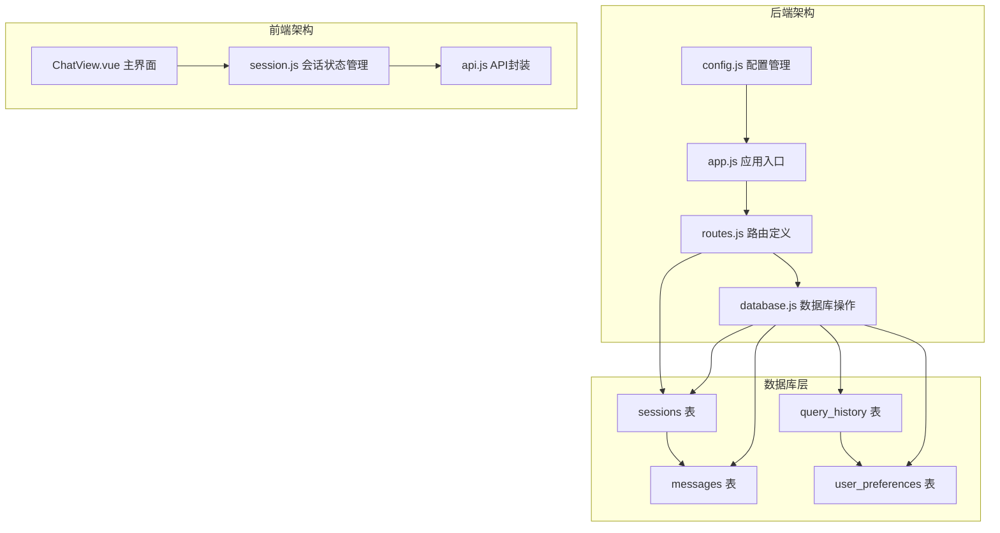
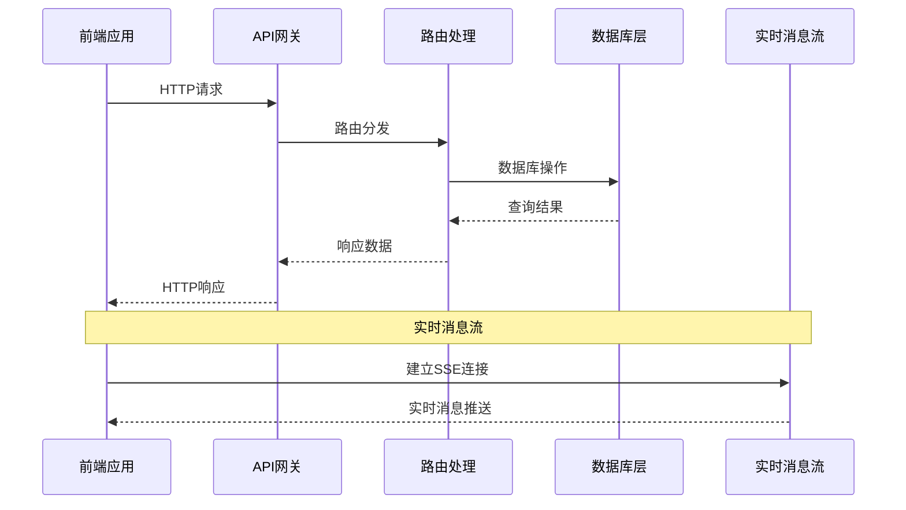
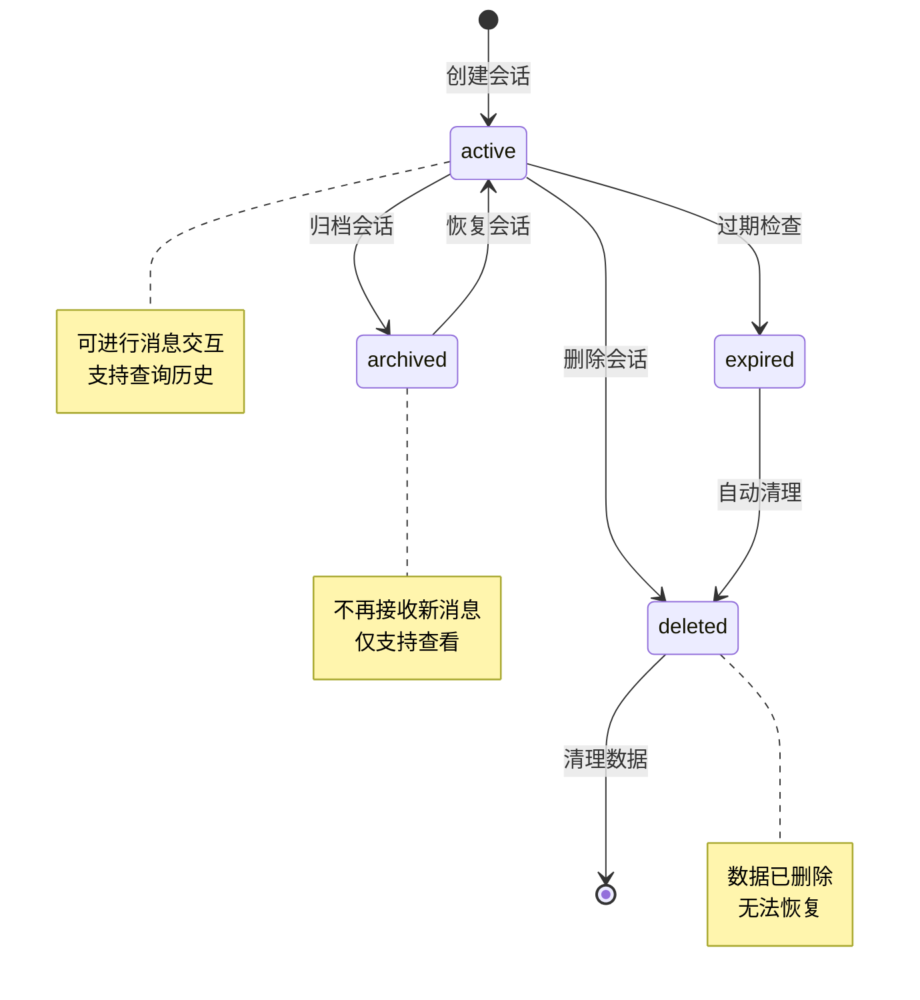
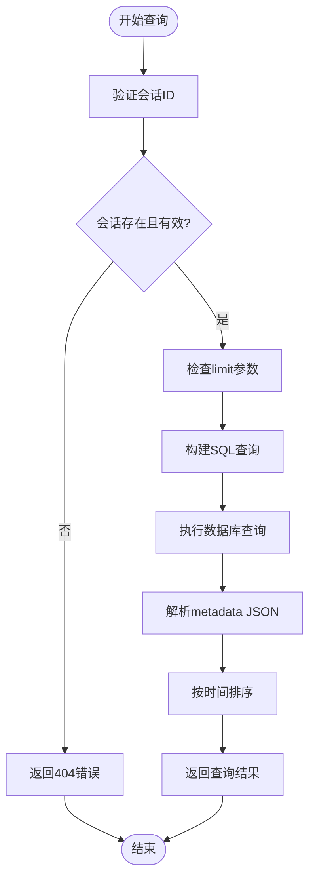
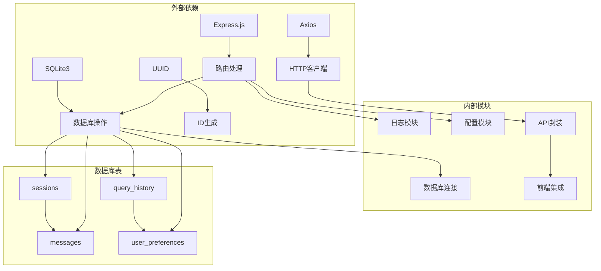

# 会话管理接口

<cite>
**本文档引用的文件**
- [routes.js](file://backend/src/core/routes.js)
- [database.js](file://backend/src/core/database.js)
- [session.js](file://frontend/src/stores/session.js)
- [api.js](file://frontend/src/utils/api.js)
- [app.js](file://backend/src/app.js)
- [config.js](file://backend/src/core/config.js)
</cite>

## 目录
1. [简介](#简介)
2. [项目结构](#项目结构)
3. [核心组件](#核心组件)
4. [架构概览](#架构概览)
5. [详细组件分析](#详细组件分析)
6. [依赖分析](#依赖分析)
7. [性能考虑](#性能考虑)
8. [故障排除指南](#故障排除指南)
9. [结论](#结论)

## 简介

会话管理接口是NL2SQL系统中的核心功能模块，负责管理用户与AI助手之间的对话会话。该接口提供了完整的会话生命周期管理，包括会话创建、查询、删除以及消息历史管理等功能。系统采用SQLite数据库存储会话数据，支持实时消息流传输，并提供了完整的前后端集成方案。

## 项目结构

NL2SQL项目的会话管理功能分布在前后端两个主要部分：



**图表来源**
- [app.js:1-238](file://backend/src/app.js#L1-L238)
- [routes.js:250-396](file://backend/src/core/routes.js#L250-L396)
- [database.js:39-189](file://backend/src/core/database.js#L39-L189)

**章节来源**
- [app.js:56-80](file://backend/src/app.js#L56-L80)
- [routes.js:250-396](file://backend/src/core/routes.js#L250-L396)

## 核心组件

### 后端路由组件

后端通过Express框架提供RESTful API接口，所有会话管理相关的端点都定义在路由模块中：

- **POST /api/sessions** - 创建新会话
- **GET /api/sessions/:sessionId** - 获取会话信息  
- **DELETE /api/sessions/:sessionId** - 删除会话
- **GET /api/sessions/:sessionId/messages** - 获取会话消息历史
- **GET /api/users/:userId/sessions** - 获取用户的所有会话

### 数据库组件

数据库层使用SQLite作为持久化存储，包含四个主要表结构：

- **sessions表** - 存储会话基本信息
- **messages表** - 存储会话中的消息历史
- **query_history表** - 存储查询历史记录
- **user_preferences表** - 存储用户偏好设置

### 前端组件

前端使用Vue.js和Pinia进行状态管理，提供完整的会话操作界面：

- **Session Store** - 管理会话状态和消息流
- **API封装** - 统一的HTTP请求处理
- **实时消息流** - 通过Server-Sent Events实现实时通信

**章节来源**
- [routes.js:254-396](file://backend/src/core/routes.js#L254-L396)
- [database.js:44-189](file://backend/src/core/database.js#L44-L189)
- [session.js:33-397](file://frontend/src/stores/session.js#L33-L397)

## 架构概览

会话管理系统的整体架构采用分层设计，确保了良好的可维护性和扩展性：



**图表来源**
- [app.js:78-80](file://backend/src/app.js#L78-L80)
- [routes.js:264-396](file://backend/src/core/routes.js#L264-L396)
- [session.js:185-221](file://frontend/src/stores/session.js#L185-L221)

## 详细组件分析

### 会话数据结构

会话管理系统的核心数据结构如下：

#### 会话表 (sessions)
| 字段名 | 类型 | 描述 | 约束 |
|--------|------|------|------|
| id | TEXT | 会话唯一标识 | PRIMARY KEY, UUID |
| user_id | TEXT | 用户标识 | NOT NULL |
| title | TEXT | 会话标题 | 可选 |
| created_at | DATETIME | 创建时间 | 默认CURRENT_TIMESTAMP |
| updated_at | DATETIME | 更新时间 | 默认CURRENT_TIMESTAMP |
| status | TEXT | 会话状态 | 默认'active' |

#### 消息表 (messages)
| 字段名 | 类型 | 描述 | 约束 |
|--------|------|------|------|
| id | INTEGER | 消息唯一标识 | PRIMARY KEY, AUTO_INCREMENT |
| session_id | TEXT | 所属会话ID | NOT NULL, 外键 |
| role | TEXT | 消息角色 | NOT NULL |
| content | TEXT | 消息内容 | NOT NULL |
| type | TEXT | 消息类型 | 默认'text' |
| metadata | TEXT | 元数据(JSON) | 可选 |
| created_at | DATETIME | 创建时间 | 默认CURRENT_TIMESTAMP |

#### 角色枚举值
- **user**: 用户发送的消息
- **assistant**: 助手回复的消息
- **system**: 系统消息
- **tool**: 工具消息

#### 消息类型枚举值
- **text**: 文本消息
- **sql**: SQL代码
- **result**: 查询结果
- **error**: 错误消息
- **clarify**: 需要澄清的消息

**章节来源**
- [database.js:44-92](file://backend/src/core/database.js#L44-L92)
- [database.js:555-596](file://backend/src/core/database.js#L555-L596)

### 会话生命周期管理

会话生命周期包含以下关键阶段：



**图表来源**
- [database.js:473-540](file://backend/src/core/database.js#L473-L540)
- [config.js:179-186](file://backend/src/core/config.js#L179-L186)

### API端点详细说明

#### POST /api/sessions - 创建新会话

**请求参数**
- **user_id** (string, 必填): 用户标识
- **title** (string, 可选): 会话标题，默认为"新会话"

**响应数据**
```javascript
{
  "id": "string",           // 会话ID (UUID)
  "user_id": "string",      // 用户ID
  "title": "string",        // 会话标题
  "created_at": "datetime", // 创建时间
  "updated_at": "datetime", // 更新时间
  "status": "active"        // 状态
}
```

**使用示例**
```javascript
// 前端调用示例
const response = await api.createSession();
const sessionId = response.id;
console.log(`创建会话成功: ${sessionId}`);
```

**章节来源**
- [routes.js:264-288](file://backend/src/core/routes.js#L264-L288)
- [database.js:458-466](file://backend/src/core/database.js#L458-L466)

#### GET /api/sessions/:sessionId - 获取会话信息

**路径参数**
- **sessionId** (string, 必填): 会话唯一标识

**响应数据**
```javascript
{
  "id": "string",
  "user_id": "string", 
  "title": "string",
  "created_at": "datetime",
  "updated_at": "datetime",
  "status": "string"
}
```

**错误处理**
- **404 Not Found**: 会话不存在或状态不是active

**章节来源**
- [routes.js:294-312](file://backend/src/core/routes.js#L294-L312)
- [database.js:473-476](file://backend/src/core/database.js#L473-L476)

#### DELETE /api/sessions/:sessionId - 删除会话

**路径参数**
- **sessionId** (string, 必填): 会话唯一标识

**响应数据**
```javascript
{
  "success": true,
  "message": "会话已删除"
}
```

**事务处理**
删除会话时会自动删除关联的所有消息，确保数据完整性。

**章节来源**
- [routes.js:318-343](file://backend/src/core/routes.js#L318-L343)
- [database.js:521-540](file://backend/src/core/database.js#L521-L540)

#### GET /api/sessions/:sessionId/messages - 获取会话消息历史

**路径参数**
- **sessionId** (string, 必填): 会话唯一标识

**查询参数**
- **limit** (number, 可选): 返回消息数量限制，默认50

**响应数据**
```javascript
{
  "session_id": "string",
  "count": 0,
  "messages": [
    {
      "id": 0,
      "session_id": "string",
      "role": "string",
      "content": "string",
      "type": "string",
      "metadata": object,
      "created_at": "datetime"
    }
  ]
}
```

**排序规则**: 按创建时间升序排列

**章节来源**
- [routes.js:352-371](file://backend/src/core/routes.js#L352-L371)
- [database.js:582-596](file://backend/src/core/database.js#L582-L596)

#### GET /api/users/:userId/sessions - 获取用户的所有会话

**路径参数**
- **userId** (string, 必填): 用户唯一标识

**查询参数**
- **limit** (number, 可选): 返回会话数量限制，默认20

**响应数据**
```javascript
{
  "user_id": "string",
  "count": 0,
  "sessions": [
    {
      "id": "string",
      "user_id": "string",
      "title": "string",
      "created_at": "datetime",
      "updated_at": "datetime", 
      "status": "string"
    }
  ]
}
```

**排序规则**: 按更新时间降序排列

**章节来源**
- [routes.js:377-396](file://backend/src/core/routes.js#L377-L396)
- [database.js:484-492](file://backend/src/core/database.js#L484-L492)

### 消息历史查询流程



**图表来源**
- [routes.js:352-371](file://backend/src/core/routes.js#L352-L371)
- [database.js:582-596](file://backend/src/core/database.js#L582-L596)

**章节来源**
- [routes.js:352-371](file://backend/src/core/routes.js#L352-L371)
- [database.js:582-596](file://backend/src/core/database.js#L582-L596)

### 会话ID生成规则

系统使用UUID v4算法生成会话ID：


**生成特点**
- 基于随机数生成，确保全局唯一性
- 符合UUID v4标准格式
- 长度为36字符(包含连字符)
- 无时间戳信息，保护隐私

**章节来源**
- [routes.js:270-271](file://backend/src/core/routes.js#L270-L271)

### 权限控制和安全最佳实践

#### CORS配置
后端启用了跨域资源共享，允许所有来源访问：
```javascript
app.use(cors({ origin: '*' }));
```

**注意**: 生产环境中应配置为具体域名，提高安全性。

#### 数据库安全
- 所有SQL查询使用参数化绑定，防止SQL注入攻击
- 外键约束确保数据完整性
- 事务处理保证操作原子性

#### 错误处理机制
- 统一的错误日志记录
- 适当的HTTP状态码返回
- 详细的错误信息描述

**章节来源**
- [app.js:65](file://backend/src/app.js#L65)
- [database.js:361-424](file://backend/src/core/database.js#L361-L424)

## 依赖分析

会话管理模块的依赖关系如下：



**图表来源**
- [app.js:23-48](file://backend/src/app.js#L23-L48)
- [routes.js:17-27](file://backend/src/core/routes.js#L17-L27)
- [database.js:13-19](file://backend/src/core/database.js#L13-L19)

**章节来源**
- [app.js:23-48](file://backend/src/app.js#L23-L48)
- [routes.js:17-27](file://backend/src/core/routes.js#L17-L27)

## 性能考虑

### 数据库性能优化

#### 索引策略
- **sessions表**: user_id, status, updated_at索引
- **messages表**: session_id, created_at索引  
- **query_history表**: user_id, session_id, created_at, status索引

#### 查询优化
- 使用LIMIT限制返回结果数量
- 按时间戳索引进行高效排序
- 避免SELECT *，只查询必要字段

### 前端性能优化

#### 状态管理
- 使用Pinia进行响应式状态管理
- 按需加载会话消息
- 实时消息流处理

#### 缓存策略
- 会话列表缓存
- 消息历史分页加载
- SSE连接复用

## 故障排除指南

### 常见问题及解决方案

#### 1. 会话创建失败
**症状**: POST /api/sessions 返回500错误
**原因**: 数据库连接问题或UUID生成异常
**解决**: 检查数据库文件权限和磁盘空间

#### 2. 会话查询超时
**症状**: GET /api/sessions/:sessionId 返回超时
**原因**: 数据库锁等待或查询性能问题
**解决**: 优化查询索引，检查数据库负载

#### 3. 消息历史为空
**症状**: GET /api/sessions/:sessionId/messages 返回空数组
**原因**: 会话ID错误或消息已被清理
**解决**: 验证会话ID有效性，检查消息清理策略

#### 4. SSE连接断开
**症状**: 实时消息流中断
**原因**: 网络不稳定或服务器重启
**解决**: 实现自动重连机制

**章节来源**
- [routes.js:282-287](file://backend/src/core/routes.js#L282-L287)
- [session.js:185-221](file://frontend/src/stores/session.js#L185-L221)

### 错误处理最佳实践

#### 后端错误处理
- 统一的日志记录格式
- 详细的错误堆栈信息
- 适当的HTTP状态码返回

#### 前端错误处理
- 网络错误的友好提示
- 自动重试机制
- 用户友好的错误界面

## 结论

NL2SQL系统的会话管理接口提供了完整的会话生命周期管理功能，具有以下特点：

**技术优势**
- 基于SQLite的轻量级存储方案
- 完整的RESTful API设计
- 实时消息流支持
- 前后端分离架构

**功能特性**
- 会话创建、查询、删除的完整生命周期
- 消息历史的灵活查询和管理
- 用户会话列表的便捷访问
- 实时消息推送机制

**扩展性**
- 模块化设计便于功能扩展
- 配置驱动的灵活性
- 良好的性能优化策略

该接口为NL2SQL系统提供了稳定可靠的会话管理基础，支持用户与AI助手之间的自然对话体验。