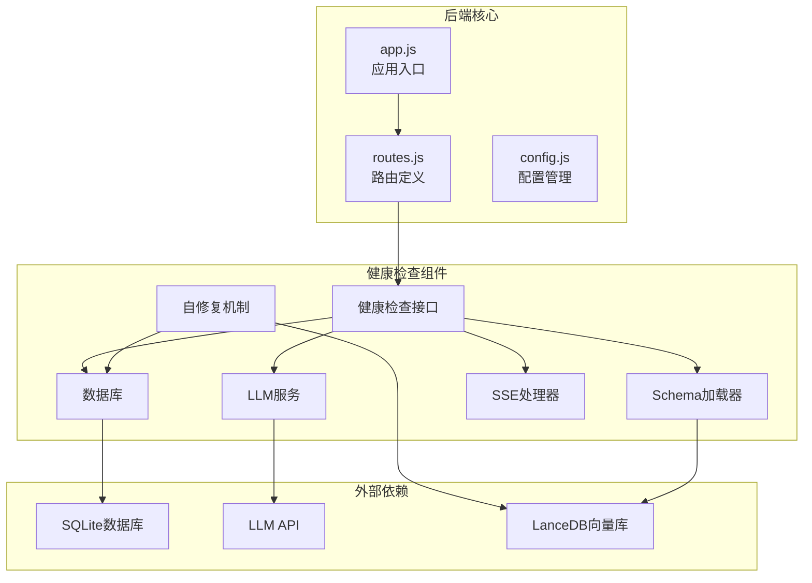
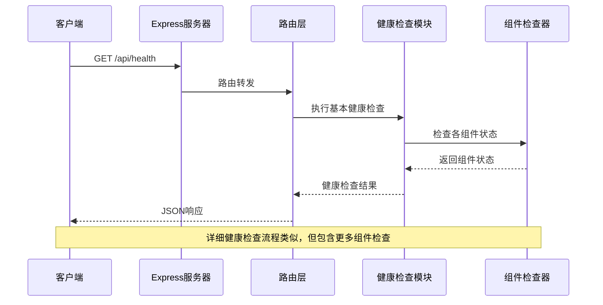
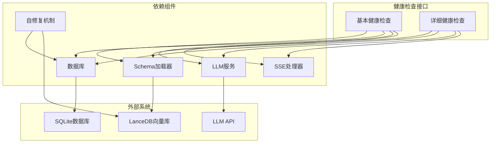

# 健康检查接口

<cite>
**本文档引用的文件**
- [routes.js](file://backend/src/core/routes.js)
- [app.js](file://backend/src/app.js)
- [schemaLoader.js](file://backend/src/core/schemaLoader.js)
- [sseHandler.js](file://backend/src/core/sseHandler.js)
- [database.js](file://backend/src/core/database.js)
- [llmService.js](file://backend/src/core/llmService.js)
- [selfRepair.js](file://backend/src/core/selfRepair.js)
- [config.js](file://backend/src/core/config.js)
- [package.json](file://backend/package.json)
</cite>

## 目录
1. [简介](#简介)
2. [项目结构](#项目结构)
3. [核心组件](#核心组件)
4. [架构概览](#架构概览)
5. [详细组件分析](#详细组件分析)
6. [依赖分析](#依赖分析)
7. [性能考虑](#性能考虑)
8. [故障排除指南](#故障排除指南)
9. [结论](#结论)

## 简介

健康检查接口是NL2SQL服务的重要监控组件，提供了两种级别的健康检查能力：

- **基本健康检查**：提供服务运行状态的快速检查，包含服务状态、时间戳、版本和运行时间等基本信息
- **详细健康检查**：提供全面的系统状态检查，包含数据库、LLM API、Schema加载和SSE连接状态等关键组件的状态

这些接口对于服务监控、故障诊断和自动化运维至关重要，能够帮助运维人员快速识别和解决系统问题。

## 项目结构

NL2SQL项目的健康检查功能主要分布在以下核心文件中：



**图表来源**
- [app.js:78-80](file://backend/src/app.js#L78-L80)
- [routes.js:58-135](file://backend/src/core/routes.js#L58-L135)

**章节来源**
- [app.js:1-238](file://backend/src/app.js#L1-L238)
- [routes.js:1-800](file://backend/src/core/routes.js#L1-L800)

## 核心组件

健康检查接口由以下核心组件构成：

### 基本健康检查组件
- **服务状态**：实时反映服务运行状态
- **时间戳**：精确到毫秒的时间信息
- **版本信息**：服务版本号
- **运行时间**：进程运行时长（秒）
- **内存使用**：实时内存使用情况

### 详细健康检查组件
- **数据库状态**：SQLite连接状态检查
- **LLM API状态**：大语言模型API连接状态
- **Schema加载状态**：数据表结构加载状态
- **SSE连接状态**：服务器推送事件连接统计

**章节来源**
- [routes.js:70-135](file://backend/src/core/routes.js#L70-L135)

## 架构概览

健康检查接口采用分层架构设计，确保了良好的可维护性和扩展性：



**图表来源**
- [routes.js:70-135](file://backend/src/core/routes.js#L70-L135)
- [app.js:78-80](file://backend/src/app.js#L78-L80)

## 详细组件分析

### 基本健康检查接口

#### 接口定义
- **端点**：GET /api/health
- **用途**：提供服务的基本运行状态信息
- **响应格式**：JSON对象

#### 请求参数
- 无查询参数

#### 响应格式
```json
{
  "status": "ok",
  "timestamp": "2024-01-01T00:00:00.000Z",
  "version": "1.0.0",
  "uptime": 3600,
  "memory": {
    "used": 128,
    "total": 512
  }
}
```

#### 响应字段说明
- **status**：服务状态，正常为"ok"
- **timestamp**：检查时间戳（ISO 8601格式）
- **version**：服务版本号
- **uptime**：进程运行时间（秒）
- **memory.used**：已使用内存（MB）
- **memory.total**：总内存（MB）

#### 状态码
- 200：成功
- 500：服务器内部错误

**章节来源**
- [routes.js:70-92](file://backend/src/core/routes.js#L70-L92)

### 详细健康检查接口

#### 接口定义
- **端点**：GET /api/health/detail
- **用途**：提供系统的全面健康状态检查
- **响应格式**：JSON对象

#### 请求参数
- 无查询参数

#### 响应格式
```json
{
  "status": "ok",
  "timestamp": "2024-01-01T00:00:00.000Z",
  "components": {
    "database": {
      "status": "ok",
      "message": "SQLite连接正常"
    },
    "llm": {
      "status": "ok",
      "message": "LLM API配置正常"
    },
    "schema": {
      "status": "ok",
      "tables": 15
    },
    "sse": {
      "status": "ok",
      "connections": 10
    }
  }
}
```

#### 响应字段说明
- **status**：整体系统状态
- **timestamp**：检查时间戳
- **components.database.status**：数据库连接状态
- **components.database.message**：数据库状态描述
- **components.llm.status**：LLM API状态
- **components.llm.message**：LLM API状态描述
- **components.schema.status**：Schema加载状态
- **components.schema.tables**：已加载的表数量
- **components.sse.status**：SSE连接状态
- **components.sse.connections**：当前活跃连接数

#### 状态码
- 200：所有组件正常
- 503：部分或全部组件异常

**章节来源**
- [routes.js:98-135](file://backend/src/core/routes.js#L98-L135)

### 组件状态检查机制

#### 数据库状态检查
- 检查SQLite连接是否正常
- 验证数据库表结构完整性
- 确认数据读写功能正常

#### LLM API状态检查
- 验证API密钥配置
- 检查API端点可达性
- 确认模型配置正确

#### Schema加载状态检查
- 验证Schema配置文件存在
- 检查表定义完整性
- 确认向量数据库初始化状态

#### SSE连接状态检查
- 统计当前活跃连接数
- 监控连接质量
- 检查消息传输状态

**章节来源**
- [routes.js:104-123](file://backend/src/core/routes.js#L104-L123)

## 依赖分析

健康检查接口的依赖关系如下：



**图表来源**
- [routes.js:22-27](file://backend/src/core/routes.js#L22-L27)
- [schemaLoader.js:15-26](file://backend/src/core/schemaLoader.js#L15-L26)

**章节来源**
- [routes.js:1-800](file://backend/src/core/routes.js#L1-L800)
- [schemaLoader.js:1-732](file://backend/src/core/schemaLoader.js#L1-L732)

## 性能考虑

健康检查接口在设计时充分考虑了性能因素：

### 响应时间优化
- 基本健康检查仅进行轻量级状态检查
- 详细健康检查包含多个组件检查，响应时间相对较长
- 使用异步操作避免阻塞主线程

### 资源使用控制
- 限制检查操作的数据库查询复杂度
- 控制向量数据库查询的批量大小
- 避免在健康检查中执行重负载操作

### 缓存策略
- 利用Schema加载器的缓存机制
- 避免重复的外部API调用
- 合理使用内存存储检查结果

## 故障排除指南

### 常见问题及解决方案

#### 健康检查返回503状态
当详细健康检查返回503状态时，表示系统存在异常：

1. **数据库连接问题**
   - 检查数据库文件权限
   - 验证数据库连接字符串
   - 确认数据库服务正常运行

2. **LLM API配置问题**
   - 验证API密钥有效性
   - 检查API端点可达性
   - 确认网络连接正常

3. **Schema加载问题**
   - 检查配置文件路径
   - 验证Schema文件格式
   - 确认向量数据库初始化

4. **SSE连接问题**
   - 检查SSE处理器状态
   - 验证连接池配置
   - 确认网络防火墙设置

#### 健康检查响应缓慢

1. **数据库查询优化**
   - 检查数据库索引配置
   - 优化查询语句
   - 考虑增加数据库连接池

2. **LLM API性能**
   - 检查API响应时间
   - 考虑增加API超时时间
   - 优化模型选择

3. **向量数据库性能**
   - 检查向量索引状态
   - 优化批量查询大小
   - 考虑增加硬件资源

#### 监控和诊断工具

1. **日志分析**
   - 查看应用日志中的错误信息
   - 分析健康检查日志
   - 监控系统资源使用

2. **性能监控**
   - 监控CPU使用率
   - 检查内存使用情况
   - 分析网络延迟

3. **自动化监控**
   - 配置健康检查告警
   - 设置性能阈值
   - 建立故障转移机制

**章节来源**
- [selfRepair.js:169-310](file://backend/src/core/selfRepair.js#L169-L310)
- [routes.js:128-132](file://backend/src/core/routes.js#L128-L132)

## 结论

NL2SQL项目的健康检查接口提供了完善的系统监控能力，通过基本和详细两个层次的健康检查，能够满足不同场景下的监控需求。

### 主要优势
- **多层次监控**：基本检查提供快速状态，详细检查提供全面诊断
- **组件化设计**：独立的组件检查机制，便于维护和扩展
- **性能优化**：合理的资源使用和响应时间控制
- **故障诊断**：详细的错误信息和状态描述

### 最佳实践
- 定期执行健康检查，建立监控告警机制
- 根据业务需求调整检查频率
- 结合日志分析进行深度故障诊断
- 建立自动化运维流程

### 未来改进方向
- 增加更多的健康检查指标
- 实现更智能的故障预测
- 优化检查性能和准确性
- 扩展监控告警机制

通过合理使用健康检查接口，可以有效提升NL2SQL服务的稳定性和可靠性，为用户提供更好的服务体验。