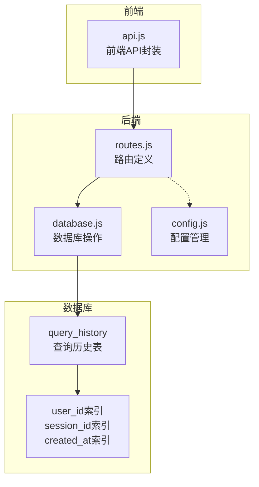
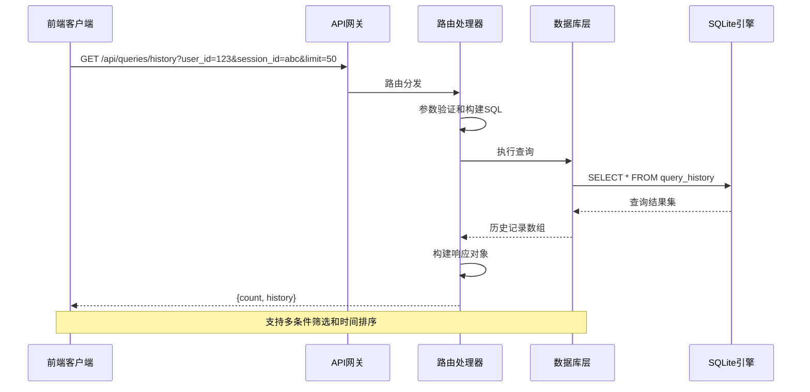
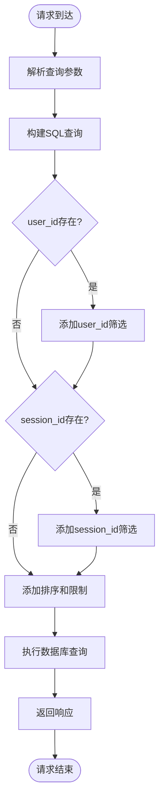
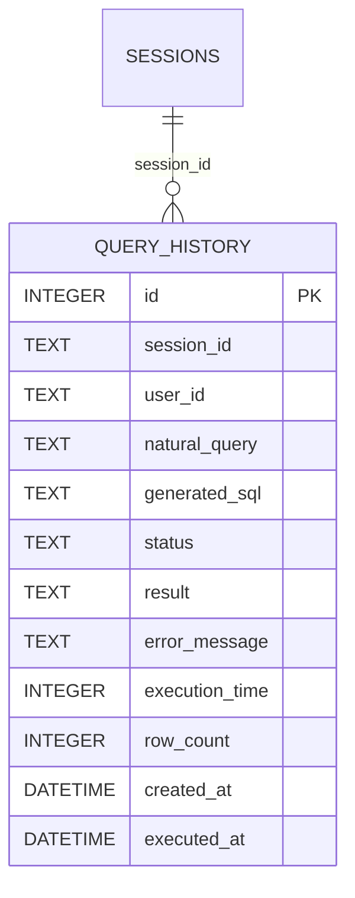
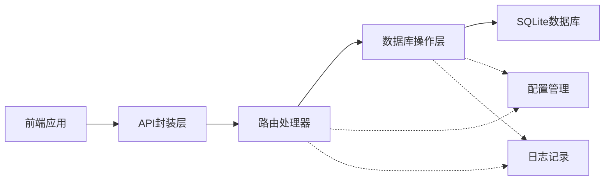

# 查询历史接口

<cite>
**本文档引用的文件**
- [routes.js](file://backend/src/core/routes.js)
- [database.js](file://backend/src/core/database.js)
- [api.js](file://frontend/src/utils/api.js)
- [config.js](file://backend/src/core/config.js)
</cite>

## 目录
1. [简介](#简介)
2. [项目结构](#项目结构)
3. [核心组件](#核心组件)
4. [架构概览](#架构概览)
5. [详细组件分析](#详细组件分析)
6. [依赖分析](#依赖分析)
7. [性能考虑](#性能考虑)
8. [故障排除指南](#故障排除指南)
9. [结论](#结论)

## 简介
本文件详细记录了查询历史接口的完整API规范，包括GET /api/queries/history端点的使用方法、数据结构、过滤机制和性能特性。该接口支持基于用户ID和会话ID的筛选，并按时间倒序返回查询记录。

## 项目结构
查询历史接口位于后端核心路由模块中，与数据库层紧密集成：



**图表来源**
- [routes.js:402-448](file://backend/src/core/routes.js#L402-L448)
- [database.js:94-134](file://backend/src/core/database.js#L94-L134)

**章节来源**
- [routes.js:402-448](file://backend/src/core/routes.js#L402-L448)
- [database.js:94-134](file://backend/src/core/database.js#L94-L134)

## 核心组件
查询历史接口由三个核心部分组成：

### 后端路由层
- **端点定义**: GET /api/queries/history
- **参数支持**: user_id（用户ID筛选）、session_id（会话ID筛选）、limit（返回数量限制，默认20）
- **响应格式**: 包含count和history字段的对象

### 数据库层
- **表结构**: query_history表，包含完整的查询历史记录
- **索引优化**: 为user_id、session_id、created_at建立索引
- **外键约束**: 与sessions表关联，支持会话级数据管理

### 前端封装层
- **API封装**: getQueryHistory函数，支持参数传递
- **类型安全**: TypeScript类型定义确保参数正确性

**章节来源**
- [routes.js:402-448](file://backend/src/core/routes.js#L402-L448)
- [database.js:94-134](file://backend/src/core/database.js#L94-L134)
- [api.js:200-208](file://frontend/src/utils/api.js#L200-L208)

## 架构概览
查询历史接口采用典型的三层架构设计：



**图表来源**
- [routes.js:411-447](file://backend/src/core/routes.js#L411-L447)
- [database.js:94-134](file://backend/src/core/database.js#L94-L134)

## 详细组件分析

### API端点规范

#### 基本信息
- **方法**: GET
- **路径**: /api/queries/history
- **功能**: 获取查询历史记录

#### 查询参数
| 参数名 | 类型 | 必需 | 默认值 | 描述 |
|--------|------|------|--------|------|
| user_id | string | 否 | 无 | 用户ID筛选条件 |
| session_id | string | 否 | 无 | 会话ID筛选条件 |
| limit | number | 否 | 20 | 返回记录数量限制 |

#### 响应结构
```javascript
{
  "count": 5,
  "history": [
    {
      "id": 1,
      "session_id": "session_123",
      "user_id": "user_456",
      "natural_query": "查询用户统计数据",
      "generated_sql": "SELECT COUNT(*) FROM users",
      "status": "success",
      "result": "{}",
      "error_message": "",
      "execution_time": 150,
      "row_count": 1,
      "created_at": "2024-01-15T10:30:00Z",
      "executed_at": "2024-01-15T10:30:00Z"
    }
  ]
}
```

#### 过滤机制
接口支持灵活的条件组合筛选：



**图表来源**
- [routes.js:411-447](file://backend/src/core/routes.js#L411-L447)

### 数据模型设计

#### 查询历史表结构


**图表来源**
- [database.js:98-125](file://backend/src/core/database.js#L98-L125)

#### 关键字段说明
| 字段名 | 类型 | 约束 | 描述 |
|--------|------|------|------|
| id | INTEGER | 主键, 自增 | 查询记录唯一标识 |
| session_id | TEXT | 外键 | 关联的会话ID |
| user_id | TEXT | 非空 | 用户标识符 |
| natural_query | TEXT | 非空 | 用户原始查询文本 |
| generated_sql | TEXT | 可空 | 生成的SQL语句 |
| status | TEXT | 默认pending | 查询执行状态 |
| result | TEXT | 可空 | 执行结果（JSON格式） |
| error_message | TEXT | 可空 | 错误信息 |
| execution_time | INTEGER | 可空 | 执行耗时（毫秒） |
| row_count | INTEGER | 可空 | 返回行数 |
| created_at | DATETIME | 默认当前时间 | 创建时间 |
| executed_at | DATETIME | 可空 | 执行时间 |

### 性能优化特性

#### 索引策略
数据库为查询历史表建立了多个关键索引：

| 索引类型 | 字段 | 作用 |
|----------|------|------|
| 主键索引 | id | 唯一标识符 |
| 用户索引 | user_id | 按用户查询优化 |
| 会话索引 | session_id | 按会话查询优化 |
| 时间索引 | created_at | 按时间排序优化 |
| 状态索引 | status | 按状态筛选优化 |

#### 查询优化
- **动态SQL构建**: 根据提供的筛选条件动态构建WHERE子句
- **参数化查询**: 使用占位符防止SQL注入攻击
- **索引利用**: 通过合适的索引组合实现高效查询
- **限制返回数量**: 默认限制20条记录，避免大数据量传输

**章节来源**
- [routes.js:411-447](file://backend/src/core/routes.js#L411-L447)
- [database.js:127-134](file://backend/src/core/database.js#L127-L134)

## 依赖分析

### 组件间依赖关系


**图表来源**
- [routes.js:402-448](file://backend/src/core/routes.js#L402-L448)
- [api.js:200-208](file://frontend/src/utils/api.js#L200-L208)

### 外部依赖
- **SQLite**: 本地轻量级数据库引擎
- **Node.js**: 运行时环境
- **Express**: Web框架（通过路由模块体现）

**章节来源**
- [routes.js:402-448](file://backend/src/core/routes.js#L402-L448)
- [database.js:200-261](file://backend/src/core/database.js#L200-L261)

## 性能考虑

### 查询性能
- **时间复杂度**: O(log n + k)，其中n为索引大小，k为返回记录数
- **空间复杂度**: O(k)，返回结果集大小
- **索引利用**: 通过user_id、session_id、created_at索引实现快速查询

### 扩展性设计
- **分页支持**: 通过limit参数控制返回数量
- **索引优化**: 多字段组合索引支持常见查询模式
- **异步处理**: 数据库操作采用异步模式避免阻塞

### 监控指标
- **执行时间**: 记录查询执行耗时
- **返回行数**: 统计查询结果集大小
- **错误率**: 监控查询失败情况

## 故障排除指南

### 常见问题及解决方案

#### 1. 查询超时
**症状**: API响应缓慢或超时
**原因**: 
- 缺少适当的索引
- 查询条件过于宽泛
- 数据量过大

**解决方案**:
- 确保user_id、session_id、created_at索引存在
- 使用更精确的筛选条件
- 调整limit参数限制返回数量

#### 2. 权限错误
**症状**: 返回403或权限相关错误
**原因**: 
- 用户ID格式不正确
- 会话ID无效

**解决方案**:
- 验证用户ID和会话ID格式
- 确认用户对目标数据的访问权限

#### 3. 数据不一致
**症状**: 查询结果与预期不符
**原因**:
- 会话外键约束
- 数据库事务处理

**解决方案**:
- 检查会话是否存在
- 确认数据库连接状态

**章节来源**
- [routes.js:442-447](file://backend/src/core/routes.js#L442-L447)

## 结论
查询历史接口提供了完整的查询记录管理能力，具有以下特点：

1. **灵活的筛选机制**: 支持用户ID和会话ID的组合筛选
2. **高性能设计**: 通过多字段索引和参数化查询优化性能
3. **数据一致性**: 通过外键约束保证查询历史与会话的关联完整性
4. **易于扩展**: 模块化设计便于功能扩展和维护

该接口为数据分析应用提供了可靠的查询历史管理基础，支持用户行为分析和查询模式识别等高级功能。