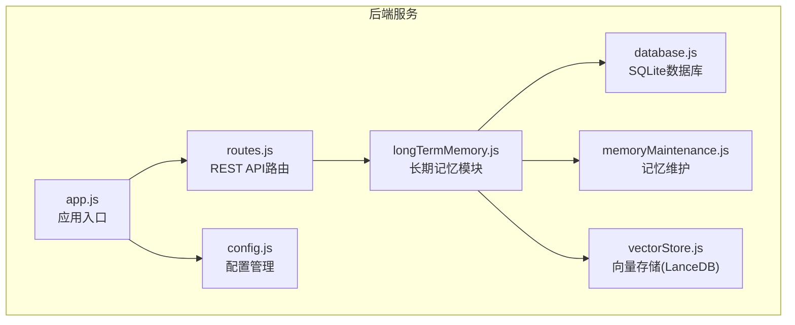
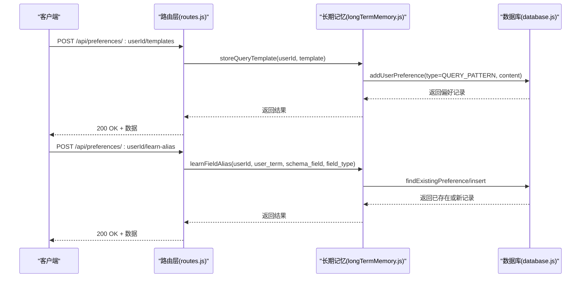
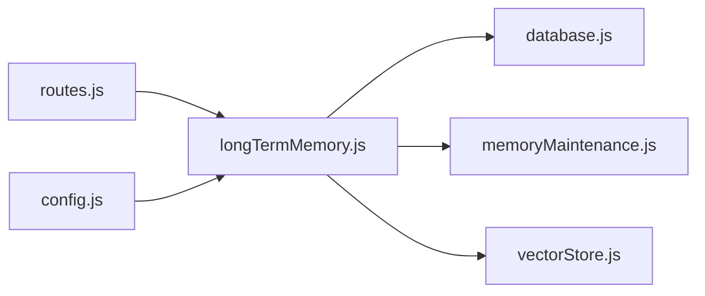

# 偏好学习和模板管理

<cite>
**本文引用的文件**
- [app.js](file://backend/src/app.js)
- [routes.js](file://backend/src/core/routes.js)
- [longTermMemory.js](file://backend/src/memory/longTermMemory.js)
- [database.js](file://backend/src/core/database.js)
- [memoryMaintenance.js](file://backend/src/memory/memoryMaintenance.js)
- [vectorStore.js](file://backend/src/memory/vectorStore.js)
- [config.js](file://backend/src/core/config.js)
- [package.json](file://backend/package.json)
</cite>

## 目录
1. [简介](#简介)
2. [项目结构](#项目结构)
3. [核心组件](#核心组件)
4. [架构概览](#架构概览)
5. [详细组件分析](#详细组件分析)
6. [依赖分析](#依赖分析)
7. [性能考虑](#性能考虑)
8. [故障排查指南](#故障排查指南)
9. [结论](#结论)
10. [附录](#附录)

## 简介
本文件面向偏好学习和模板管理接口的使用者，提供POST /api/preferences/:userId/templates（手动添加查询模板）和POST /api/preferences/:userId/learn-alias（手动学习字段别名）两个端点的完整API规范。文档涵盖：
- 查询模板的数据结构与命名规范
- 字段别名的学习机制与偏好类型（metric|dimension|filter）
- 模板创建与别名学习的请求与响应示例
- 模板存储格式、别名映射机制与学习效果评估方法
- 错误处理最佳实践与常见问题排查

## 项目结构
后端采用Express框架，核心模块包括路由、数据库、长期记忆、向量存储与配置管理。偏好学习与模板管理位于长期记忆模块，通过数据库表user_preferences进行持久化存储。

图表来源
- [app.js:1-238](file://backend/src/app.js#L1-L238)
- [routes.js:1-800](file://backend/src/core/routes.js#L1-L800)
- [longTermMemory.js:1-1134](file://backend/src/memory/longTermMemory.js#L1-L1134)
- [database.js:1-850](file://backend/src/core/database.js#L1-L850)
- [memoryMaintenance.js:1-415](file://backend/src/memory/memoryMaintenance.js#L1-L415)
- [vectorStore.js:1-621](file://backend/src/memory/vectorStore.js#L1-L621)
- [config.js:1-372](file://backend/src/core/config.js#L1-L372)

章节来源
- [app.js:1-238](file://backend/src/app.js#L1-L238)
- [routes.js:1-800](file://backend/src/core/routes.js#L1-L800)

## 核心组件
- 路由层：定义REST API端点，处理请求参数与响应格式
- 长期记忆模块：实现偏好提取、模板存储、别名学习与记忆维护
- 数据库层：SQLite持久化user_preferences表，支持偏好类型、内容与使用统计
- 记忆维护：按使用频率与时间策略清理与合并偏好
- 向量存储：LanceDB向量数据库，支持Schema与查询历史的语义检索
- 配置管理：集中管理端口、LLM、数据库、安全与长期记忆阈值等配置

章节来源
- [routes.js:592-714](file://backend/src/core/routes.js#L592-L714)
- [longTermMemory.js:1-1134](file://backend/src/memory/longTermMemory.js#L1-L1134)
- [database.js:136-781](file://backend/src/core/database.js#L136-L781)
- [memoryMaintenance.js:1-415](file://backend/src/memory/memoryMaintenance.js#L1-L415)
- [vectorStore.js:1-621](file://backend/src/memory/vectorStore.js#L1-L621)
- [config.js:248-288](file://backend/src/core/config.js#L248-L288)

## 架构概览
偏好学习与模板管理的端到端流程如下：

图表来源
- [routes.js:592-714](file://backend/src/core/routes.js#L592-L714)
- [longTermMemory.js:1074-1099](file://backend/src/memory/longTermMemory.js#L1074-L1099)
- [longTermMemory.js:771-825](file://backend/src/memory/longTermMemory.js#L771-L825)
- [database.js:608-618](file://backend/src/core/database.js#L608-L618)
- [database.js:724-751](file://backend/src/core/database.js#L724-L751)

## 详细组件分析

### 端点：POST /api/preferences/:userId/templates（手动添加查询模板）
- 功能：手动为用户添加查询模板，便于后续快速复用
- 请求路径：POST /api/preferences/:userId/templates
- 路由实现位置：[routes.js:592-631](file://backend/src/core/routes.js#L592-L631)
- 实际处理函数：[longTermMemory.js:1074-1099](file://backend/src/memory/longTermMemory.js#L1074-L1099)
- 数据库存储：[database.js:608-618](file://backend/src/core/database.js#L608-L618)

请求体字段
- name（必填）：模板名称，用于标识模板
- dimensions（可选）：维度字段数组
- metrics（可选）：指标字段数组
- default_time_range（可选）：默认时间范围，包含type与value
- filter_pattern（可选）：过滤器模式
- is_manual（固定）：标记为手动创建模板

响应结构
- success：布尔值，表示操作是否成功
- message：字符串，操作结果描述
- data：包含新建偏好记录的ID、类型与内容

请求示例
- 方法：POST
- 路径：/api/preferences/USER123/templates
- 请求体：
  - name: "销售趋势模板"
  - dimensions: ["日期", "渠道"]
  - metrics: ["销售额"]
  - default_time_range: { "type": "relative", "value": "最近7天" }

响应示例
- 状态码：200
- 响应体：
  - success: true
  - message: "模板已保存"
  - data: { id: 123, user_id: "USER123", preference_type: "query_pattern", content: { ... } }

错误处理
- 400：name为空时返回错误
- 500：内部错误时返回错误信息

章节来源
- [routes.js:592-631](file://backend/src/core/routes.js#L592-L631)
- [longTermMemory.js:1074-1099](file://backend/src/memory/longTermMemory.js#L1074-L1099)
- [database.js:608-618](file://backend/src/core/database.js#L608-L618)

### 端点：POST /api/preferences/:userId/learn-alias（手动学习字段别名）
- 功能：手动学习用户术语与Schema字段之间的映射关系
- 请求路径：POST /api/preferences/:userId/learn-alias
- 路由实现位置：[routes.js:664-714](file://backend/src/core/routes.js#L664-L714)
- 实际处理函数：[longTermMemory.js:771-825](file://backend/src/memory/longTermMemory.js#L771-L825)
- 数据库存储：[database.js:608-618](file://backend/src/core/database.js#L608-L618)

请求体字段
- user_term（必填）：用户使用的术语
- schema_field（必填）：对应的Schema字段或值
- field_type（可选，默认metric）：字段类型，支持metric|dimension|filter

响应结构
- success：布尔值，表示学习是否成功
- message：字符串，操作结果描述
- data：包含新建偏好记录的ID、类型与内容

请求示例
- 方法：POST
- 路径：/api/preferences/USER123/learn-alias
- 请求体：
  - user_term: "营收"
  - schema_field: "income_amount"
  - field_type: "metric"

响应示例
- 状态码：200
- 响应体：
  - success: true
  - message: "字段别名已学习"
  - data: { id: 456, user_id: "USER123", preference_type: "field_alias", content: { ... } }

错误处理
- 400：user_term或schema_field为空时返回错误
- 500：内部错误时返回错误信息

章节来源
- [routes.js:664-714](file://backend/src/core/routes.js#L664-L714)
- [longTermMemory.js:771-825](file://backend/src/memory/longTermMemory.js#L771-L825)
- [database.js:608-618](file://backend/src/core/database.js#L608-L618)

### 模板数据结构与命名规范
- 数据结构
  - name：模板名称（必填）
  - dimensions：维度数组
  - metrics：指标数组
  - default_time_range：默认时间范围（可选）
  - filter_pattern：过滤器模式（可选）
  - is_manual：标记为手动创建（固定为true）

- 命名规范
  - 名称应简洁明确，能反映模板的维度、指标与时间范围特征
  - 建议采用“时间范围_维度_指标”的命名风格，便于识别与检索

章节来源
- [longTermMemory.js:1074-1099](file://backend/src/memory/longTermMemory.js#L1074-L1099)

### 字段别名学习机制与偏好类型
- 学习机制
  - 检查是否已存在相同用户术语的映射
  - 若映射一致则更新使用次数；若冲突则记录警告
  - 存储内容包含user_term、schema_field、field_type与置信度

- 偏好类型
  - metric：指标字段
  - dimension：维度字段
  - filter：过滤器字段

- 存储格式
  - preference_type：field_alias
  - content：包含user_term、schema_field、field_type与confidence

章节来源
- [longTermMemory.js:771-825](file://backend/src/memory/longTermMemory.js#L771-L825)
- [database.js:136-157](file://backend/src/core/database.js#L136-L157)

### 学习效果评估与记忆维护
- 使用频率与时间策略
  - 高频（≥10次）：永久保留
  - 中频（3-9次）：90天未用清理
  - 低频（<3次）：30天未用清理
  - 字段别名：365天未用清理

- 合并相似模式
  - 当多个模式维度/指标高度重合时，合并为更通用的模式

- 统计与报告
  - 支持按类型统计偏好数量、平均使用次数与最久未用时间

章节来源
- [memoryMaintenance.js:24-46](file://backend/src/memory/memoryMaintenance.js#L24-L46)
- [memoryMaintenance.js:195-309](file://backend/src/memory/memoryMaintenance.js#L195-L309)
- [memoryMaintenance.js:315-349](file://backend/src/memory/memoryMaintenance.js#L315-L349)

### 错误处理最佳实践
- 参数校验
  - 模板：name不能为空
  - 别名：user_term与schema_field不能为空
- 异常捕获
  - 路由层统一捕获异常并返回500错误
  - 长期记忆模块记录详细日志，便于排查
- 响应一致性
  - 成功：200 + { success: true, message, data }
  - 失败：400/500 + { success: false, error }

章节来源
- [routes.js:609-614](file://backend/src/core/routes.js#L609-L614)
- [routes.js:679-685](file://backend/src/core/routes.js#L679-L685)
- [longTermMemory.js:821-824](file://backend/src/memory/longTermMemory.js#L821-L824)

## 依赖分析
- Express路由依赖长期记忆模块进行偏好处理
- 长期记忆模块依赖数据库模块进行持久化
- 记忆维护模块依赖数据库模块进行清理与统计
- 向量存储模块独立于偏好管理，提供语义检索能力
- 配置模块集中管理长期记忆阈值与保留策略

图表来源
- [routes.js:1-800](file://backend/src/core/routes.js#L1-L800)
- [longTermMemory.js:1-1134](file://backend/src/memory/longTermMemory.js#L1-L1134)
- [database.js:1-850](file://backend/src/core/database.js#L1-L850)
- [memoryMaintenance.js:1-415](file://backend/src/memory/memoryMaintenance.js#L1-L415)
- [vectorStore.js:1-621](file://backend/src/memory/vectorStore.js#L1-L621)
- [config.js:248-288](file://backend/src/core/config.js#L248-L288)

章节来源
- [routes.js:1-800](file://backend/src/core/routes.js#L1-L800)
- [longTermMemory.js:1-1134](file://backend/src/memory/longTermMemory.js#L1-L1134)
- [database.js:1-850](file://backend/src/core/database.js#L1-L850)
- [memoryMaintenance.js:1-415](file://backend/src/memory/memoryMaintenance.js#L1-L415)
- [vectorStore.js:1-621](file://backend/src/memory/vectorStore.js#L1-L621)
- [config.js:248-288](file://backend/src/core/config.js#L248-L288)

## 性能考虑
- 长期记忆阈值与保留策略可配置，平衡存储空间与检索效率
- SQLite适合中小规模偏好数据，支持索引优化
- 向量存储用于语义检索，需合理设置维度与索引策略
- 建议定期执行记忆维护，清理低价值偏好

## 故障排查指南
- 400错误
  - 检查请求体字段是否完整（模板name、别名user_term与schema_field）
- 500错误
  - 查看服务日志，定位数据库或长期记忆模块异常
- 偏好未生效
  - 检查记忆维护策略是否清理了低频偏好
  - 确认模板或别名是否被正确存储到user_preferences表

章节来源
- [routes.js:609-614](file://backend/src/core/routes.js#L609-L614)
- [routes.js:679-685](file://backend/src/core/routes.js#L679-L685)
- [memoryMaintenance.js:69-120](file://backend/src/memory/memoryMaintenance.js#L69-L120)

## 结论
偏好学习与模板管理接口提供了手动管理用户查询偏好的能力。通过清晰的数据结构、严格的错误处理与完善的记忆维护策略，系统能够有效提升用户查询体验与效率。建议结合长期记忆阈值与保留策略，定期评估与优化偏好数据质量。

## 附录
- 依赖版本
  - Node.js >= 18.0.0
  - Express、SQLite3、vectordb、dotenv、cors、body-parser、uuid、dayjs、node-cron

章节来源
- [package.json:1-28](file://backend/package.json#L1-L28)