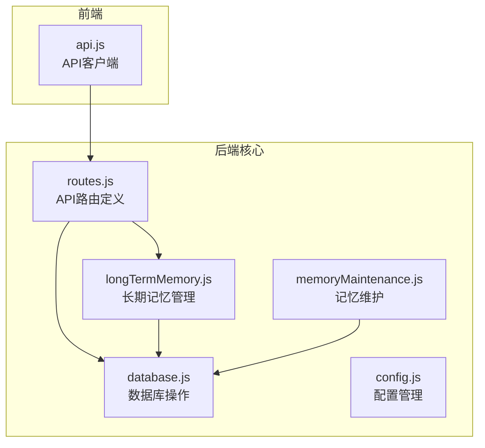
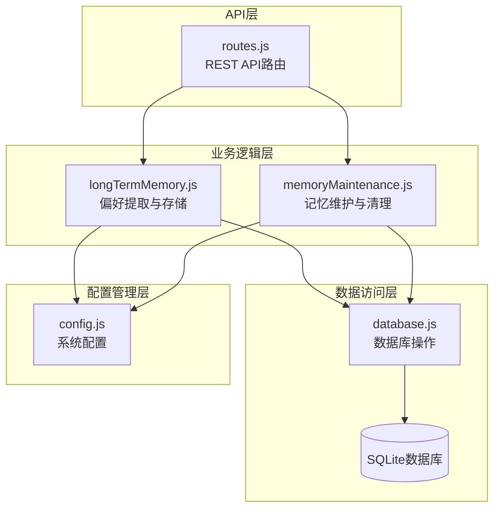
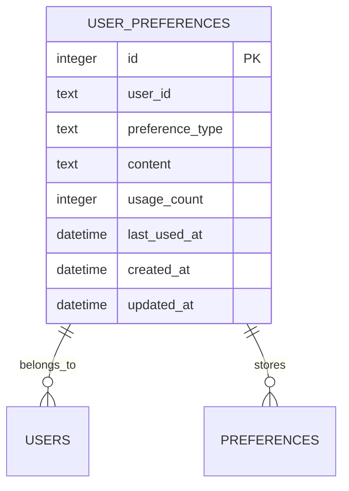
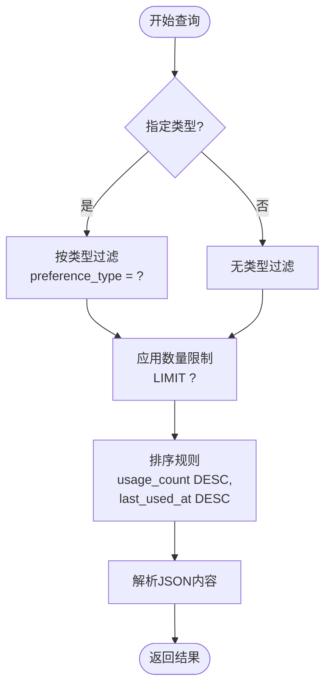
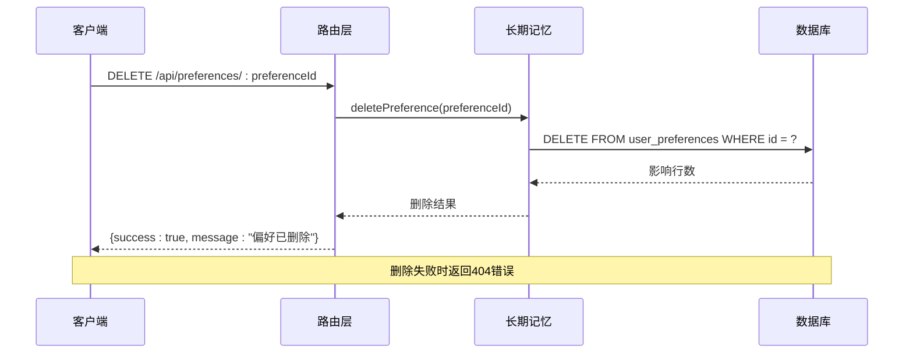
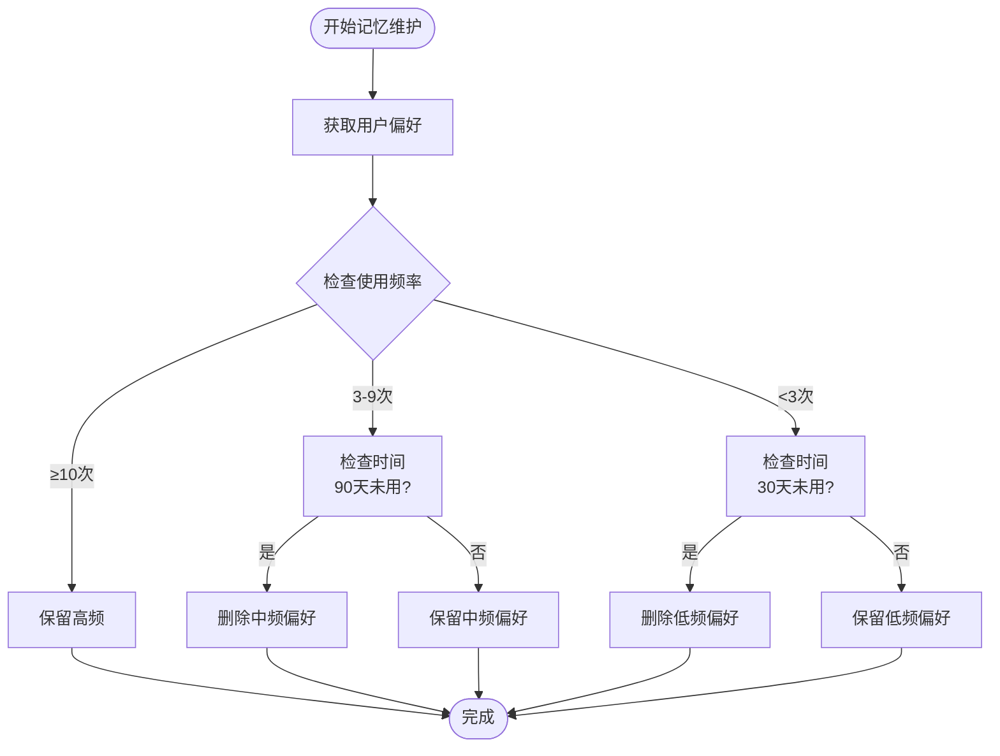
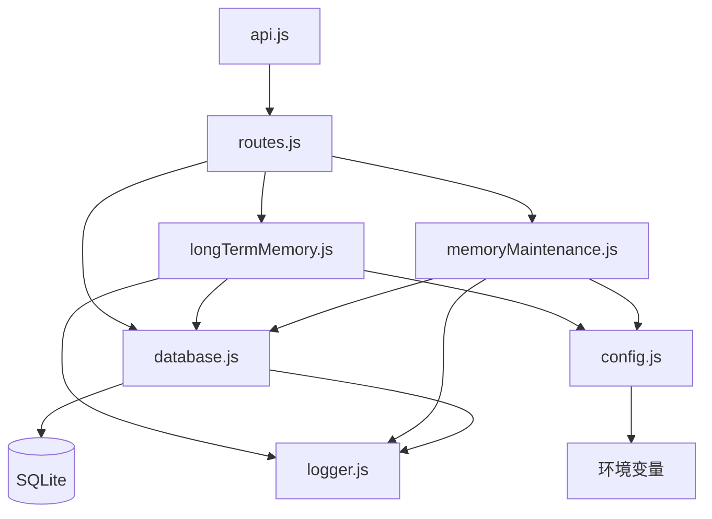
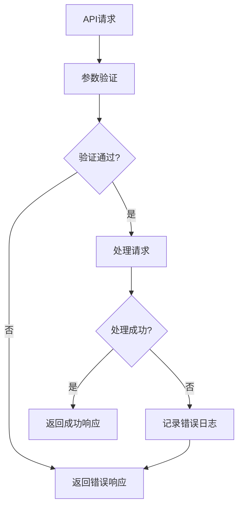

# 偏好数据管理

<cite>
**本文档引用的文件**
- [routes.js](file://backend/src/core/routes.js)
- [database.js](file://backend/src/core/database.js)
- [longTermMemory.js](file://backend/src/memory/longTermMemory.js)
- [memoryMaintenance.js](file://backend/src/memory/memoryMaintenance.js)
- [config.js](file://backend/src/core/config.js)
- [api.js](file://frontend/src/utils/api.js)
</cite>

## 目录
1. [简介](#简介)
2. [项目结构](#项目结构)
3. [核心组件](#核心组件)
4. [架构概览](#架构概览)
5. [详细组件分析](#详细组件分析)
6. [依赖关系分析](#依赖关系分析)
7. [性能考虑](#性能考虑)
8. [故障排除指南](#故障排除指南)
9. [结论](#结论)

## 简介

偏好数据管理是NL2SQL系统中长期记忆功能的核心组成部分，负责存储和管理用户的查询偏好、习惯和个性化设置。该系统通过智能提取用户在查询过程中的偏好信息，构建个性化的查询模式，从而提升用户体验和查询效率。

系统支持多种类型的偏好数据，包括查询模式、字段别名、指标偏好和维度偏好，并提供完整的CRUD操作接口来管理这些数据。

## 项目结构

NL2SQL项目的偏好数据管理功能分布在以下关键模块中：

**图表来源**
- [routes.js:543-662](file://backend/src/core/routes.js#L543-L662)
- [database.js:137-165](file://backend/src/core/database.js#L137-L165)
- [longTermMemory.js:1-50](file://backend/src/memory/longTermMemory.js#L1-L50)

**章节来源**
- [routes.js:1-100](file://backend/src/core/routes.js#L1-L100)
- [database.js:39-189](file://backend/src/core/database.js#L39-L189)

## 核心组件

### 数据模型设计

偏好数据采用统一的user_preferences表结构，支持四种主要类型：

| 偏好类型 | 描述 | 存储内容示例 |
|---------|------|-------------|
| query_pattern | 查询模式 | `{name: "按天_收入_成本", dimensions: ["日期"], metrics: ["收入","成本"]}` |
| field_alias | 字段别名 | `{user_term: "青木", schema_field: "game_id", field_type: "game"}` |
| metric_preference | 指标偏好 | `{field_name: "收入", last_query: "查询收入指标"}` |
| dimension_preference | 维度偏好 | `{field_name: "地区", last_query: "按地区查看数据"}` |

### API端点规范

系统提供以下偏好数据管理API端点：

#### 获取用户偏好列表
- **端点**: `GET /api/preferences/:userId`
- **查询参数**:
  - `type`: 偏好类型筛选（可选：query_pattern、field_alias、metric_preference、dimension_preference）
  - `limit`: 返回数量限制（默认50）

#### 删除用户偏好
- **端点**: `DELETE /api/preferences/:preferenceId`

#### 辅助端点
- `GET /api/preferences/:userId/raw`: 获取原始记忆数据（调试用途）
- `GET /api/preferences/:userId/stats`: 获取用户记忆统计

**章节来源**
- [routes.js:543-662](file://backend/src/core/routes.js#L543-L662)
- [database.js:137-165](file://backend/src/core/database.js#L137-L165)

## 架构概览

偏好数据管理采用分层架构设计，确保功能模块的清晰分离和职责明确：

**图表来源**
- [routes.js:44-52](file://backend/src/core/routes.js#L44-L52)
- [longTermMemory.js:17-21](file://backend/src/memory/longTermMemory.js#L17-L21)
- [memoryMaintenance.js:16-19](file://backend/src/memory/memoryMaintenance.js#L16-L19)

## 详细组件分析

### 数据库设计与索引策略

用户偏好数据存储在SQLite数据库的user_preferences表中，采用以下索引策略优化查询性能：

**索引策略**:
- `idx_user_preferences_user_id`: 加速按用户查询
- `idx_user_preferences_type`: 加速按类型筛选
- `idx_user_prefs_user_type`: 复合索引，优化用户+类型查询

**章节来源**
- [database.js:137-165](file://backend/src/core/database.js#L137-L165)

### 偏好类型分类与存储机制

系统支持四种主要的偏好类型，每种类型都有特定的存储和检索机制：

#### 查询模式（Query Pattern）
用于存储用户常用的查询结构和习惯：
- **特征**: 维度组合、指标组合、时间范围偏好
- **存储**: JSON格式，包含name、dimensions、metrics、default_time_range等字段
- **用途**: 提供智能查询建议和模板

#### 字段别名（Field Alias）
用于存储用户对数据库字段的个性化称呼：
- **特征**: user_term（用户术语）、schema_field（数据库字段）、field_type（字段类型）
- **存储**: JSON格式，支持实体映射和值映射
- **用途**: 实体解析和字段映射

#### 指标偏好（Metric Preference）
用于存储用户常用的指标偏好：
- **特征**: field_name（指标名称）、last_query（最后查询）
- **存储**: 简单的键值对结构
- **用途**: 指标推荐和快捷访问

#### 维度偏好（Dimension Preference）
用于存储用户常用的维度偏好：
- **特征**: field_name（维度名称）、last_query（最后查询）
- **存储**: 简单的键值对结构
- **用途**: 维度推荐和快捷访问

**章节来源**
- [longTermMemory.js:35-41](file://backend/src/memory/longTermMemory.js#L35-L41)
- [database.js:140-157](file://backend/src/core/database.js#L140-L157)

### 查询过滤机制

偏好数据的查询支持多维度过滤和排序：

**图表来源**
- [database.js:627-649](file://backend/src/core/database.js#L627-L649)

**章节来源**
- [routes.js:551-590](file://backend/src/core/routes.js#L551-L590)
- [database.js:627-649](file://backend/src/core/database.js#L627-L649)

### 删除操作流程

偏好数据删除采用软删除和硬删除相结合的策略：

**图表来源**
- [routes.js:637-662](file://backend/src/core/routes.js#L637-L662)
- [longTermMemory.js:856-865](file://backend/src/memory/longTermMemory.js#L856-L865)

**章节来源**
- [routes.js:637-662](file://backend/src/core/routes.js#L637-L662)

### 记忆维护与清理策略

系统提供智能的记忆维护功能，根据使用频率和时间进行分级清理：

**图表来源**
- [memoryMaintenance.js:69-120](file://backend/src/memory/memoryMaintenance.js#L69-L120)

**章节来源**
- [memoryMaintenance.js:69-189](file://backend/src/memory/memoryMaintenance.js#L69-L189)

## 依赖关系分析

偏好数据管理模块之间的依赖关系如下：

**图表来源**
- [routes.js:17-27](file://backend/src/core/routes.js#L17-L27)
- [longTermMemory.js:17-21](file://backend/src/memory/longTermMemory.js#L17-L21)
- [memoryMaintenance.js:16-19](file://backend/src/memory/memoryMaintenance.js#L16-L19)

**章节来源**
- [routes.js:17-27](file://backend/src/core/routes.js#L17-L27)

## 性能考虑

### 查询优化策略

1. **索引优化**: 
   - 使用复合索引 `idx_user_prefs_user_type` 优化用户+类型查询
   - 按使用频率排序时利用 `usage_count` 和 `last_used_at` 字段

2. **查询限制**:
   - 默认限制返回50条记录，可通过limit参数调整
   - 支持类型筛选减少不必要的数据传输

3. **JSON解析优化**:
   - 仅在需要时解析content字段的JSON内容
   - 使用数据库原生JSON函数进行精确匹配

### 存储优化策略

1. **分级保留策略**:
   - 高频偏好（≥10次）永久保留
   - 中频偏好（3-9次）90天未用清理
   - 低频偏好（<3次）30天未用清理
   - 字段别名365天未用清理

2. **相似模式合并**:
   - 合并维度和指标重叠度>70%的查询模式
   - 减少重复存储和查询开销

**章节来源**
- [database.js:159-164](file://backend/src/core/database.js#L159-L164)
- [memoryMaintenance.js:24-46](file://backend/src/memory/memoryMaintenance.js#L24-L46)

## 故障排除指南

### 常见问题及解决方案

1. **偏好数据查询异常**:
   - 检查数据库连接状态
   - 验证用户ID的有效性
   - 确认查询参数格式正确

2. **偏好删除失败**:
   - 确认preferenceId存在且属于当前用户
   - 检查数据库权限设置
   - 验证删除操作的事务完整性

3. **性能问题**:
   - 检查索引是否正确创建
   - 优化查询参数（limit、type）
   - 监控数据库连接池使用情况

### 错误处理机制

系统提供完善的错误处理和日志记录：

**章节来源**
- [routes.js:583-589](file://backend/src/core/routes.js#L583-L589)
- [routes.js:655-661](file://backend/src/core/routes.js#L655-L661)

## 结论

NL2SQL系统的偏好数据管理功能通过精心设计的架构和优化策略，为用户提供了一个强大而灵活的个性化查询体验。系统不仅支持基本的CRUD操作，还具备智能的学习能力、维护机制和性能优化策略。

关键优势包括：
- **多层次的偏好类型支持**：涵盖查询模式、字段别名、指标偏好和维度偏好
- **智能学习机制**：通过LLM和逻辑判断提取有价值的用户偏好
- **高效的存储和检索**：合理的数据库设计和索引策略
- **自动维护清理**：基于使用频率和时间的智能清理策略
- **完整的API接口**：支持查询、删除等核心操作

该系统为后续的功能扩展和性能优化奠定了坚实的基础，能够有效提升用户的查询效率和满意度。