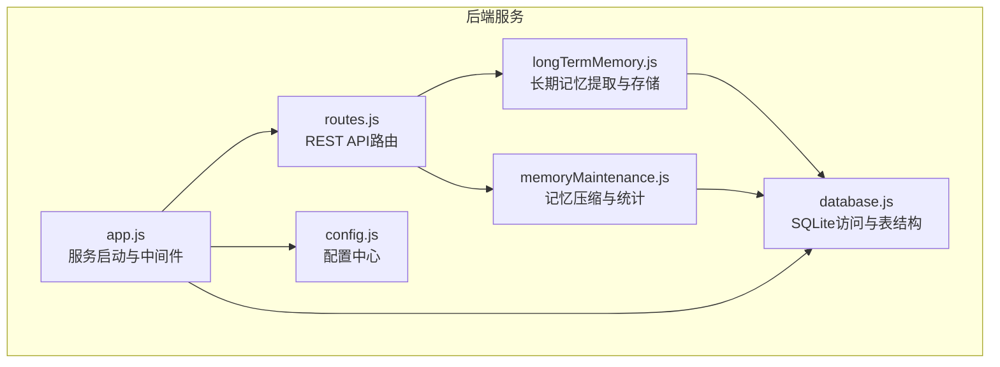
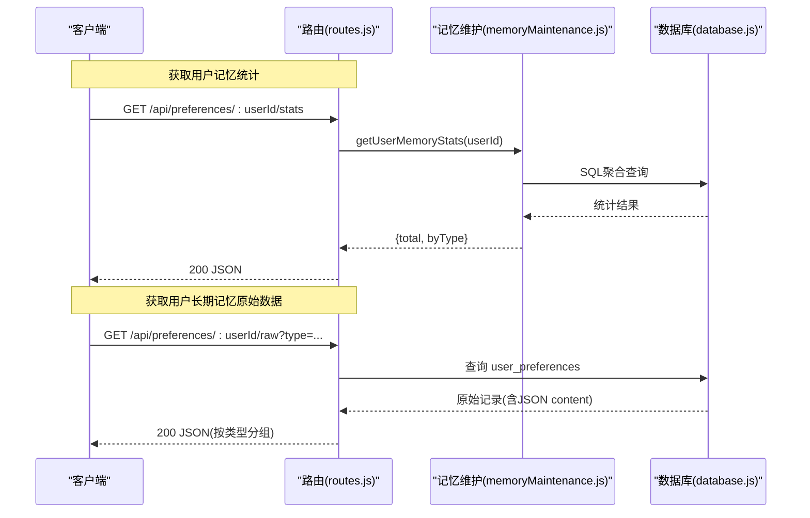
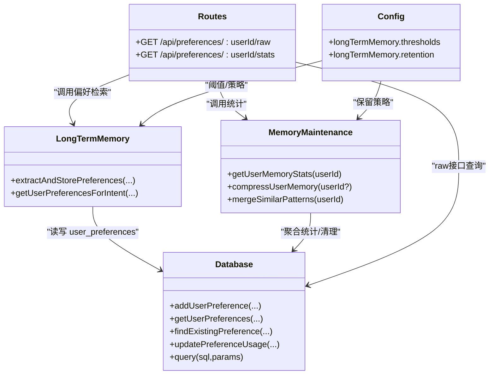
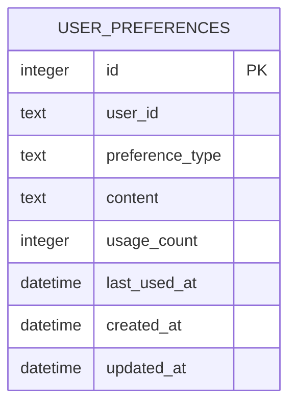

# 偏好调试和统计

<cite>
**本文引用的文件**
- [routes.js](file://backend/src/core/routes.js)
- [longTermMemory.js](file://backend/src/memory/longTermMemory.js)
- [memoryMaintenance.js](file://backend/src/memory/memoryMaintenance.js)
- [database.js](file://backend/src/core/database.js)
- [config.js](file://backend/src/core/config.js)
- [app.js](file://backend/src/app.js)
</cite>

## 目录
1. [简介](#简介)
2. [项目结构](#项目结构)
3. [核心组件](#核心组件)
4. [架构总览](#架构总览)
5. [详细组件分析](#详细组件分析)
6. [依赖关系分析](#依赖关系分析)
7. [性能考量](#性能考量)
8. [故障排查指南](#故障排查指南)
9. [结论](#结论)
10. [附录](#附录)

## 简介
本文件面向偏好调试与统计接口的使用者与维护者，系统化梳理并说明以下两个端点的完整规范与实现细节：
- GET /api/preferences/:userId/raw：获取用户长期记忆原始数据，用于调试与分析
- GET /api/preferences/:userId/stats：获取用户记忆统计，辅助性能监控与健康评估

文档涵盖：
- 原始数据结构与调试用途
- 统计数据的含义与解读方法
- 请求与响应示例（以路径与片段形式呈现）
- 性能监控与故障诊断最佳实践
- 内存维护机制、数据清理策略与统计计算的准确性保障

## 项目结构
后端采用 Express 路由集中定义，偏好相关接口位于核心路由模块中，长期记忆与维护逻辑分别封装在独立模块中，数据库层提供统一的 SQLite 访问能力。

图表来源
- [app.js:1-238](file://backend/src/app.js#L1-L238)
- [routes.js:1-895](file://backend/src/core/routes.js#L1-L895)
- [longTermMemory.js:1-1134](file://backend/src/memory/longTermMemory.js#L1-L1134)
- [memoryMaintenance.js:1-415](file://backend/src/memory/memoryMaintenance.js#L1-L415)
- [database.js:1-850](file://backend/src/core/database.js#L1-L850)
- [config.js:1-372](file://backend/src/core/config.js#L1-L372)

章节来源
- [app.js:1-238](file://backend/src/app.js#L1-L238)
- [routes.js:1-895](file://backend/src/core/routes.js#L1-L895)

## 核心组件
- 路由层：定义 /api/preferences/:userId/raw 与 /api/preferences/:userId/stats 两个端点，负责参数校验、调用业务模块并返回标准化响应。
- 长期记忆模块：负责偏好提取、存储与检索，支持字段别名、查询模式、指标/维度偏好等类型。
- 记忆维护模块：负责记忆压缩、清理、相似模式合并与统计报告。
- 数据库模块：提供 user_preferences 表的增删改查、使用次数与时间戳更新、JSON 内容解析等能力。
- 配置模块：集中管理长期记忆阈值、保留策略、是否启用 LLM 提炼等开关。

章节来源
- [routes.js:450-590](file://backend/src/core/routes.js#L450-L590)
- [longTermMemory.js:1-1134](file://backend/src/memory/longTermMemory.js#L1-L1134)
- [memoryMaintenance.js:1-415](file://backend/src/memory/memoryMaintenance.js#L1-L415)
- [database.js:136-781](file://backend/src/core/database.js#L136-L781)
- [config.js:247-288](file://backend/src/core/config.js#L247-L288)

## 架构总览
偏好调试与统计接口的调用链路如下：

图表来源
- [routes.js:517-541](file://backend/src/core/routes.js#L517-L541)
- [memoryMaintenance.js:315-349](file://backend/src/memory/memoryMaintenance.js#L315-L349)
- [database.js:608-649](file://backend/src/core/database.js#L608-L649)

## 详细组件分析

### 端点：GET /api/preferences/:userId/raw（原始数据调试）
- 功能：返回指定用户的长期记忆原始数据，便于调试与分析。
- 路径：/api/preferences/:userId/raw
- 方法：GET
- 路由定义位置：[routes.js:455-515](file://backend/src/core/routes.js#L455-L515)
- 参数：
  - 路径参数：userId（必填）
  - 查询参数：type（可选，按偏好类型过滤）
- 响应结构要点：
  - success：布尔，表示请求是否成功
  - user_id：目标用户ID
  - total_count：返回记录总数
  - data：
    - all：按创建时间倒序的完整记录列表
    - grouped：按偏好类型分组的对象，包含 field_alias、query_pattern、metric_preference、dimension_preference
  - content：JSON 字段，解析为对象后包含具体偏好内容
- 调试用途：
  - 核对偏好类型与内容是否符合预期
  - 检查字段别名映射、查询模式、指标/维度偏好是否正确存储
  - 分析使用次数与最近使用时间，定位冷热偏好
- 示例（请求与响应片段路径）：
  - 请求示例：[routes.js:459](file://backend/src/core/routes.js#L459)
  - 响应示例：[routes.js:499-507](file://backend/src/core/routes.js#L499-L507)

章节来源
- [routes.js:455-515](file://backend/src/core/routes.js#L455-L515)
- [database.js:136-165](file://backend/src/core/database.js#L136-L165)

### 端点：GET /api/preferences/:userId/stats（用户记忆统计）
- 功能：返回指定用户的长期记忆统计信息，用于性能监控与健康评估。
- 路径：/api/preferences/:userId/stats
- 方法：GET
- 路由定义位置：[routes.js:517-541](file://backend/src/core/routes.js#L517-L541)
- 参数：
  - 路径参数：userId（必填）
- 响应结构要点：
  - success：布尔，表示请求是否成功
  - user_id：目标用户ID
  - data：
    - total：该用户偏好总数
    - byType：按偏好类型分组的统计，包含 count、avg_usage、max_usage、oldest_use
- 统计解读：
  - total：整体规模，反映用户偏好积累
  - byType.count：各类别数量，用于判断偏好分布
  - byType.avg_usage/max_usage：使用频率特征，帮助识别高频偏好
  - byType.oldest_use：最久未使用时间，辅助清理策略
- 示例（请求与响应片段路径）：
  - 请求示例：[routes.js:522](file://backend/src/core/routes.js#L522)
  - 响应示例：[routes.js:529-533](file://backend/src/core/routes.js#L529-L533)

章节来源
- [routes.js:517-541](file://backend/src/core/routes.js#L517-L541)
- [memoryMaintenance.js:315-349](file://backend/src/memory/memoryMaintenance.js#L315-L349)

### 原始数据结构与调试要点
- 表结构与字段：
  - user_preferences 表包含：id、user_id、preference_type、content（JSON）、usage_count、last_used_at、created_at、updated_at
  - content 字段为 JSON 文本，需解析后查看具体内容
- 偏好类型：
  - field_alias：字段别名映射
  - query_pattern：查询模式（维度、指标、时间范围、过滤模式等）
  - metric_preference：常用指标
  - dimension_preference：常用维度
- 调试建议：
  - 使用 type 参数限定类型，缩小排查范围
  - 对比 usage_count 与 last_used_at，识别冷数据
  - 检查 content 内容是否与用户输入一致，确认映射关系正确
  - 若发现重复或冗余，结合记忆维护模块的合并策略进行清理

章节来源
- [database.js:136-165](file://backend/src/core/database.js#L136-L165)
- [routes.js:459-515](file://backend/src/core/routes.js#L459-L515)

### 统计数据的含义与解读
- 统计来源：按用户ID聚合 user_preferences 表
- 指标说明：
  - count：该类型的偏好数量
  - avg_usage：平均使用次数
  - max_usage：最高使用次数
  - oldest_use：最久未使用时间
- 解读方法：
  - 偏好分布：byType.count 反映各类别占比，判断用户习惯偏向
  - 使用强度：avg_usage/max_usage 反映偏好活跃度，可用于个性化推荐权重
  - 清理时机：oldest_use 较早的偏好可考虑清理，避免占用空间
- 与维护策略的关系：
  - 统计结果与记忆维护模块的清理规则相互印证，指导定期压缩与合并

章节来源
- [memoryMaintenance.js:315-349](file://backend/src/memory/memoryMaintenance.js#L315-L349)

### 记忆维护机制与数据清理策略
- 分级保留策略（天数）：
  - 高频(≥10次)：永久保留
  - 中频(3-9次)：90天未用清理
  - 低频(<3次)：30天未用清理
  - 字段别名：365天未用清理
- 相似模式合并：
  - 维度/指标重合度>70%且时间范围类型一致时合并
  - 合并后更新使用次数并标记来源
- 压缩流程：
  - 按用户批量清理，统计删除与保留数量
  - 支持按用户或全量执行

章节来源
- [memoryMaintenance.js:24-46](file://backend/src/memory/memoryMaintenance.js#L24-L46)
- [memoryMaintenance.js:127-189](file://backend/src/memory/memoryMaintenance.js#L127-L189)
- [memoryMaintenance.js:201-309](file://backend/src/memory/memoryMaintenance.js#L201-L309)

### 统计计算的准确性保障
- 聚合查询：
  - 使用 SQL 聚合函数统计数量、平均使用次数、最大使用次数与最早使用时间
- 时间窗口：
  - 清理与统计均基于 last_used_at 与 created_at 字段，确保时间维度准确
- 数据一致性：
  - 使用事务与索引优化，减少并发写入带来的统计偏差
- 配置驱动：
  - 阈值与保留策略来自配置中心，便于统一调整与审计

章节来源
- [memoryMaintenance.js:320-349](file://backend/src/memory/memoryMaintenance.js#L320-L349)
- [database.js:608-649](file://backend/src/core/database.js#L608-L649)
- [config.js:247-288](file://backend/src/core/config.js#L247-L288)

## 依赖关系分析

图表来源
- [routes.js:455-541](file://backend/src/core/routes.js#L455-L541)
- [longTermMemory.js:1-1134](file://backend/src/memory/longTermMemory.js#L1-L1134)
- [memoryMaintenance.js:1-415](file://backend/src/memory/memoryMaintenance.js#L1-L415)
- [database.js:136-781](file://backend/src/core/database.js#L136-L781)
- [config.js:247-288](file://backend/src/core/config.js#L247-L288)

章节来源
- [routes.js:455-541](file://backend/src/core/routes.js#L455-L541)
- [longTermMemory.js:1-1134](file://backend/src/memory/longTermMemory.js#L1-L1134)
- [memoryMaintenance.js:1-415](file://backend/src/memory/memoryMaintenance.js#L1-L415)
- [database.js:136-781](file://backend/src/core/database.js#L136-L781)
- [config.js:247-288](file://backend/src/core/config.js#L247-L288)

## 性能考量
- 查询优化：
  - user_preferences 表具备复合索引，按 user_id 与 preference_type 查询高效
  - raw 接口支持按 type 过滤，减少解析与传输开销
- 统计效率：
  - stats 接口使用 SQL 聚合，避免逐条遍历
  - 压缩与合并操作按用户批量执行，降低全表扫描频率
- 内存与磁盘：
  - SQLite 适合中小规模数据，建议定期清理冷数据
  - 合理设置保留策略，平衡存储成本与召回效果

[本节为通用性能讨论，不直接分析具体文件]

## 故障排查指南
- 常见问题与定位：
  - 404/400：检查 userId 是否有效、type 是否合法
  - 500：查看服务日志，关注数据库连接与 SQL 执行错误
  - 统计异常：核对 user_id 是否正确、content 是否为合法 JSON
- 调试步骤：
  - 使用 raw 接口导出全部偏好，确认 content 结构与字段别名映射
  - 对比 stats 的 byType 与实际偏好数量，排查异常类型
  - 检查 last_used_at 与 usage_count，确认清理策略是否生效
- 维护建议：
  - 定期执行压缩与合并，保持统计准确性
  - 根据业务需求调整阈值与保留策略

章节来源
- [routes.js:459-515](file://backend/src/core/routes.js#L459-L515)
- [memoryMaintenance.js:315-349](file://backend/src/memory/memoryMaintenance.js#L315-L349)

## 结论
偏好调试与统计接口为长期记忆系统的可观测性与可维护性提供了关键支撑。通过 raw 接口可深入洞察用户偏好结构与内容，借助 stats 接口可量化评估偏好规模与使用强度。配合记忆维护模块的清理与合并策略，可在保证准确性的同时维持良好的性能与存储效率。建议在生产环境中结合配置中心动态调整阈值与保留策略，并建立定期巡检与告警机制。

[本节为总结性内容，不直接分析具体文件]

## 附录

### API 定义与示例（路径引用）
- GET /api/preferences/:userId/raw
  - 请求示例：[routes.js:459](file://backend/src/core/routes.js#L459)
  - 响应示例：[routes.js:499-507](file://backend/src/core/routes.js#L499-L507)
- GET /api/preferences/:userId/stats
  - 请求示例：[routes.js:522](file://backend/src/core/routes.js#L522)
  - 响应示例：[routes.js:529-533](file://backend/src/core/routes.js#L529-L533)

### 数据模型（简化）

图表来源
- [database.js:136-165](file://backend/src/core/database.js#L136-L165)