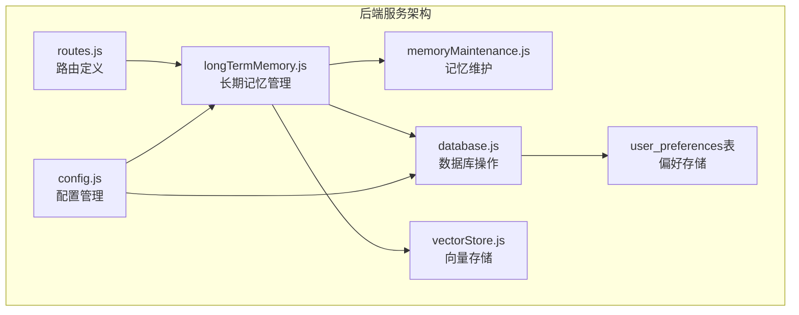
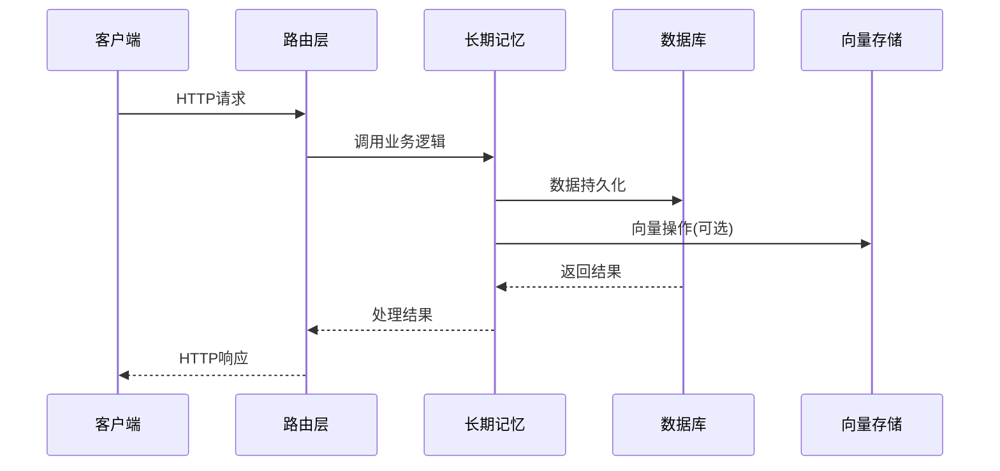
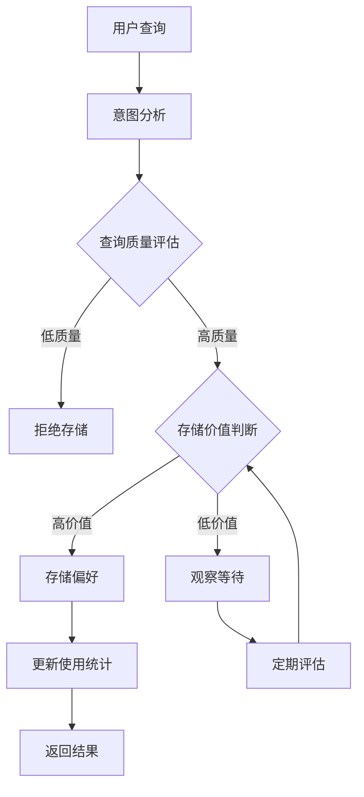
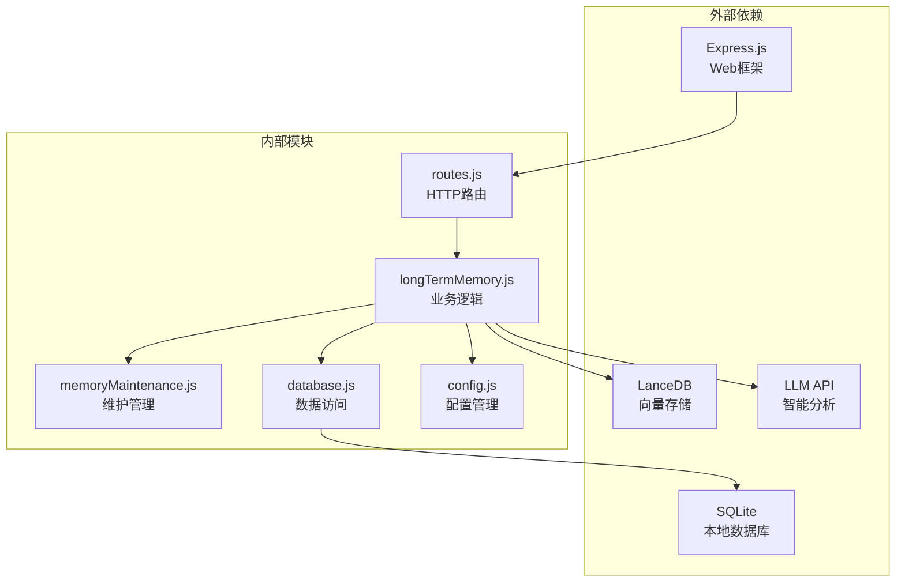

# 用户偏好接口

<cite>
**本文档引用的文件**
- [routes.js](file://backend/src/core/routes.js)
- [longTermMemory.js](file://backend/src/memory/longTermMemory.js)
- [memoryMaintenance.js](file://backend/src/memory/memoryMaintenance.js)
- [database.js](file://backend/src/core/database.js)
- [config.js](file://backend/src/core/config.js)
- [vectorStore.js](file://backend/src/memory/vectorStore.js)
- [app.js](file://backend/src/app.js)
</cite>

## 目录
1. [简介](#简介)
2. [项目结构](#项目结构)
3. [核心组件](#核心组件)
4. [架构概览](#架构概览)
5. [详细组件分析](#详细组件分析)
6. [依赖分析](#依赖分析)
7. [性能考虑](#性能考虑)
8. [故障排除指南](#故障排除指南)
9. [结论](#结论)

## 简介

用户偏好接口是NL2SQL系统中长期记忆（Layer 2）的核心功能模块，负责管理用户的查询偏好、学习模式和个性化设置。该接口支持用户偏好的查询、学习、模板管理和统计分析，为自然语言到SQL的转换提供智能化支持。

系统采用三层架构设计：
- **路由层**：处理HTTP请求和响应
- **业务逻辑层**：实现偏好提取、存储和管理算法
- **数据持久层**：提供SQLite数据库和向量存储支持

## 项目结构

NL2SQL项目的用户偏好接口位于后端服务的memory模块中，主要包含以下核心文件：



**图表来源**
- [routes.js:450-715](file://backend/src/core/routes.js#L450-L715)
- [longTermMemory.js:1-1134](file://backend/src/memory/longTermMemory.js#L1-L1134)
- [database.js:137-189](file://backend/src/core/database.js#L137-L189)

**章节来源**
- [routes.js:1-895](file://backend/src/core/routes.js#L1-L895)
- [app.js:1-238](file://backend/src/app.js#L1-L238)

## 核心组件

### 用户偏好数据结构

系统支持四种类型的用户偏好，每种都有特定的数据结构和用途：

#### 1. 查询模式 (query_pattern)
存储用户常用的查询模式和模板，包含维度、指标、时间范围等信息。

#### 2. 字段别名 (field_alias)
记录用户对数据库字段的个性化称呼，支持游戏ID、数据源标识等映射关系。

#### 3. 指标偏好 (metric_preference)
记录用户经常使用的指标名称，用于快速识别和推荐。

#### 4. 维度偏好 (dimension_preference)
记录用户经常使用的维度名称，支持按时间、地区等维度分析。

### 存储机制

偏好数据采用JSON格式存储在SQLite数据库的`user_preferences`表中，支持以下字段：
- `id`: 主键标识
- `user_id`: 用户标识
- `preference_type`: 偏好类型
- `content`: JSON格式的偏好内容
- `usage_count`: 使用次数统计
- `last_used_at`: 最后使用时间

**章节来源**
- [database.js:137-189](file://backend/src/core/database.js#L137-L189)
- [longTermMemory.js:35-41](file://backend/src/memory/longTermMemory.js#L35-L41)

## 架构概览

用户偏好接口采用模块化设计，各组件职责清晰分离：



**图表来源**
- [routes.js:450-715](file://backend/src/core/routes.js#L450-L715)
- [longTermMemory.js:1-1134](file://backend/src/memory/longTermMemory.js#L1-L1134)
- [database.js:600-781](file://backend/src/core/database.js#L600-L781)

## 详细组件分析

### GET /api/preferences/:userId/raw

此端点提供用户偏好数据的原始视图，主要用于调试和分析目的。

**功能特点：**
- 支持按偏好类型筛选 (`type`查询参数)
- 按创建时间倒序排列
- 返回按类型分组的完整数据结构

**响应数据结构：**
```json
{
  "success": true,
  "user_id": "用户ID",
  "total_count": 0,
  "data": {
    "all": [],
    "grouped": {
      "field_alias": [],
      "query_pattern": [],
      "metric_preference": [],
      "dimension_preference": []
    }
  }
}
```

**使用场景：**
- 开发调试
- 偏好数据统计分析
- 手动数据清理和维护

**章节来源**
- [routes.js:459-515](file://backend/src/core/routes.js#L459-L515)

### GET /api/preferences/:userId/stats

获取用户的长期记忆统计信息，包括各类偏好的数量和使用情况。

**统计维度：**
- 按类型分组的偏好总数
- 平均使用次数
- 最近使用时间
- 高频、中频、低频偏好分布

**章节来源**
- [routes.js:522-541](file://backend/src/core/routes.js#L522-L541)
- [memoryMaintenance.js:320-349](file://backend/src/memory/memoryMaintenance.js#L320-L349)

### GET /api/preferences/:userId

获取用户的偏好列表，支持多种筛选和排序选项。

**查询参数：**
- `type`: 偏好类型筛选 (query_pattern|field_alias|metric_preference|dimension_preference)
- `limit`: 返回数量限制 (默认50)

**响应结构：**
```json
{
  "success": true,
  "user_id": "用户ID",
  "data": {
    "patterns": [],
    "aliases": [],
    "metrics": [],
    "dimensions": []
  }
}
```

**最佳实践：**
- 使用`type`参数进行精确筛选
- 合理设置`limit`参数控制响应大小
- 结合`stats`端点进行偏好分析

**章节来源**
- [routes.js:551-590](file://backend/src/core/routes.js#L551-L590)
- [longTermMemory.js:976-1012](file://backend/src/memory/longTermMemory.js#L976-L1012)

### POST /api/preferences/:userId/templates

手动添加查询模板，支持自定义维度、指标和时间范围配置。

**请求体参数：**
- `name`: 模板名称 (必填)
- `dimensions`: 维度数组
- `metrics`: 指标数组  
- `default_time_range`: 默认时间范围配置

**使用场景：**
- 团队共享的查询模板
- 常用分析场景的标准模板
- 业务流程的标准化查询

**章节来源**
- [routes.js:604-631](file://backend/src/core/routes.js#L604-L631)
- [longTermMemory.js:1075-1099](file://backend/src/memory/longTermMemory.js#L1075-L1099)

### DELETE /api/preferences/:preferenceId

删除指定的用户偏好记录。

**功能特点：**
- 支持删除任意类型的偏好
- 自动更新相关统计数据
- 提供删除确认和错误处理

**章节来源**
- [routes.js:637-662](file://backend/src/core/routes.js#L637-L662)
- [database.js:758-763](file://backend/src/core/database.js#L758-L763)

### POST /api/preferences/:userId/learn-alias

手动学习字段别名映射关系，支持多种字段类型。

**请求体参数：**
- `user_term`: 用户使用的术语 (必填)
- `schema_field`: 对应的Schema字段 (必填)
- `field_type`: 字段类型 (metric|dimension|filter，默认metric)

**学习规则：**
- 自动检测重复映射
- 验证映射一致性
- 支持多种映射格式

**章节来源**
- [routes.js:675-714](file://backend/src/core/routes.js#L675-L714)
- [longTermMemory.js:771-825](file://backend/src/memory/longTermMemory.js#L771-L825)

### 偏好学习机制

系统采用智能学习算法，自动识别和存储有价值的用户偏好：



**图表来源**
- [longTermMemory.js:251-295](file://backend/src/memory/longTermMemory.js#L251-L295)
- [longTermMemory.js:311-484](file://backend/src/memory/longTermMemory.js#L311-L484)

**章节来源**
- [longTermMemory.js:251-484](file://backend/src/memory/longTermMemory.js#L251-L484)

### 模板管理功能

查询模板管理系统提供完整的模板生命周期管理：

**模板特征：**
- 支持自定义维度和指标组合
- 预设默认时间范围
- 手动标记(is_manual)用于区分
- 使用频率统计和排序

**模板合并：**
- 自动识别相似模板
- 合并重叠的维度和指标
- 更新使用统计
- 保持模板的语义完整性

**章节来源**
- [longTermMemory.js:1075-1099](file://backend/src/memory/longTermMemory.js#L1075-L1099)
- [memoryMaintenance.js:201-309](file://backend/src/memory/memoryMaintenance.js#L201-L309)

## 依赖分析

用户偏好接口的依赖关系呈现清晰的分层结构：



**图表来源**
- [app.js:22-50](file://backend/src/app.js#L22-L50)
- [routes.js:16-27](file://backend/src/core/routes.js#L16-L27)
- [longTermMemory.js:17-20](file://backend/src/memory/longTermMemory.js#L17-L20)

**章节来源**
- [app.js:22-50](file://backend/src/app.js#L22-L50)
- [config.js:16-332](file://backend/src/core/config.js#L16-L332)

## 性能考虑

### 存储优化策略

**索引设计：**
- `user_id`索引：加速用户偏好查询
- `preference_type`索引：支持类型筛选
- 复合索引：`user_id + preference_type`优化联合查询

**查询优化：**
- 使用参数化查询防止SQL注入
- 合理设置LIMIT参数控制结果集大小
- 异步操作避免阻塞主线程

### 内存管理

**缓存策略：**
- 配置级别的缓存控制
- 向量数据的按需加载
- 长期记忆的分级保留

**垃圾回收：**
- 定期清理低使用频率的偏好
- 字段别名的长期保留策略
- 内存使用监控和告警

## 故障排除指南

### 常见问题及解决方案

**1. 偏好存储失败**
- 检查数据库连接状态
- 验证用户ID格式
- 确认请求参数完整性

**2. 查询性能问题**
- 检查索引是否正常
- 优化查询参数
- 考虑增加LIMIT限制

**3. 向量存储异常**
- 确认LanceDB服务状态
- 检查磁盘空间
- 验证向量维度配置

**章节来源**
- [database.js:361-424](file://backend/src/core/database.js#L361-L424)
- [vectorStore.js:55-85](file://backend/src/memory/vectorStore.js#L55-L85)

### 调试技巧

**启用详细日志：**
- 设置`LOG_LEVEL=debug`
- 监控数据库查询性能
- 跟踪向量搜索结果

**数据验证：**
- 使用`/api/preferences/:userId/raw`端点
- 检查JSON数据格式
- 验证索引完整性

## 结论

用户偏好接口为NL2SQL系统提供了强大的智能化支持，通过机器学习和人工标注相结合的方式，实现了个性化的查询体验。系统的设计充分考虑了可扩展性、性能和可靠性，在保证功能完整性的同时，提供了灵活的配置选项和完善的维护机制。

未来的发展方向包括：
- 增强LLM智能分析能力
- 优化向量搜索算法
- 扩展偏好学习的场景覆盖
- 提升系统的自动化程度

通过持续的优化和改进，用户偏好接口将继续为用户提供更加智能和高效的自然语言查询体验。