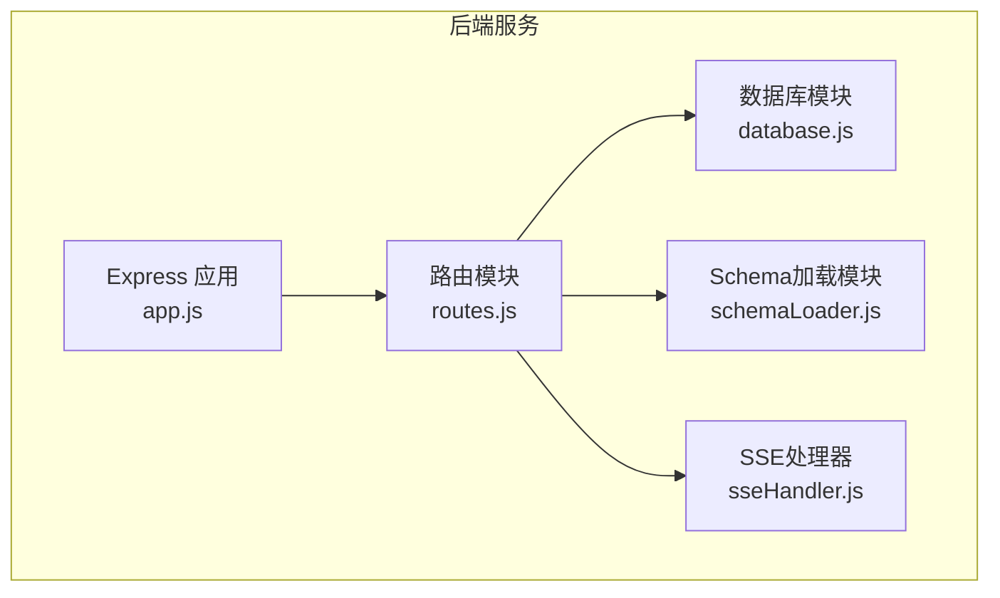
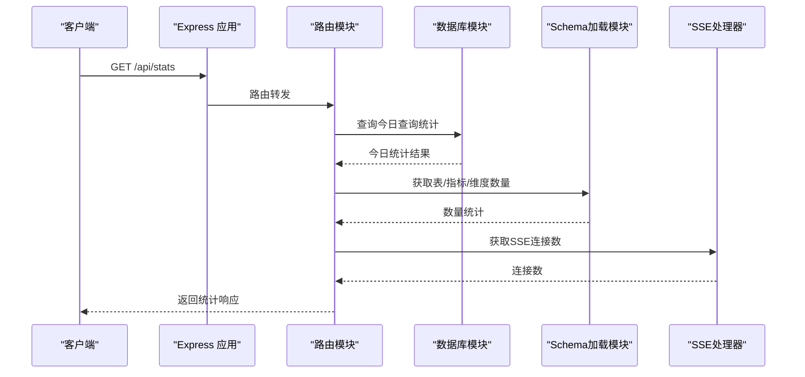
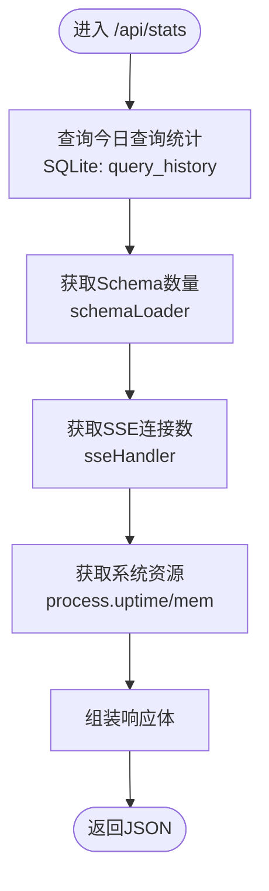
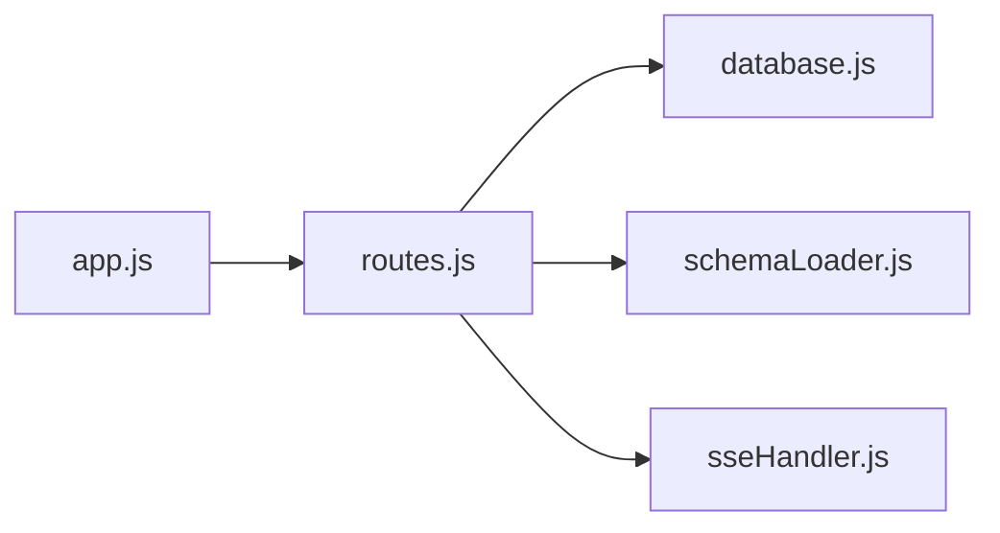

# 系统统计接口

<cite>
**本文引用的文件**
- [routes.js](file://backend/src/core/routes.js)
- [sseHandler.js](file://backend/src/core/sseHandler.js)
- [database.js](file://backend/src/core/database.js)
- [schemaLoader.js](file://backend/src/core/schemaLoader.js)
- [app.js](file://backend/src/app.js)
- [config.js](file://backend/src/core/config.js)
- [package.json](file://backend/package.json)
- [api.js](file://frontend/src/utils/api.js)
</cite>

## 目录
1. [简介](#简介)
2. [项目结构](#项目结构)
3. [核心组件](#核心组件)
4. [架构总览](#架构总览)
5. [详细组件分析](#详细组件分析)
6. [依赖关系分析](#依赖关系分析)
7. [性能考量](#性能考量)
8. [故障排查指南](#故障排查指南)
9. [结论](#结论)
10. [附录](#附录)

## 简介
本文件为系统统计接口的详细API文档，聚焦于GET /api/stats端点，提供服务实时状态监控所需的关键指标与数据结构说明。内容涵盖：
- 今日查询统计（总数、成功/失败计数、平均执行时长）
- 连接状态（SSE连接数）
- Schema信息（表、指标、维度数量）
- 系统资源使用情况（运行时长、内存占用、Node版本）
- 统计指标的计算方法、时间范围与聚合规则
- 请求与响应示例、更新频率、性能考虑与监控最佳实践
- 对SSE连接数统计、内存使用情况与查询性能指标的解释

## 项目结构
后端采用Express框架，路由集中在core模块，统计接口位于路由模块中，通过数据库模块与Schema加载模块获取数据，并由SSE处理器提供连接数统计。

图表来源
- [app.js:78-80](file://backend/src/app.js#L78-L80)
- [routes.js:16-27](file://backend/src/core/routes.js#L16-L27)

章节来源
- [app.js:78-80](file://backend/src/app.js#L78-L80)
- [routes.js:16-27](file://backend/src/core/routes.js#L16-L27)

## 核心组件
- 路由模块：定义并实现GET /api/stats端点，聚合今日查询统计、SSE连接数、Schema信息与系统资源。
- 数据库模块：提供SQLite查询能力，用于统计今日查询历史。
- Schema加载模块：提供表、指标、维度数量统计。
- SSE处理器：提供SSE连接数统计接口。
- 应用入口：挂载路由并启动HTTP服务。

章节来源
- [routes.js:724-771](file://backend/src/core/routes.js#L724-L771)
- [database.js:361-400](file://backend/src/core/database.js#L361-L400)
- [schemaLoader.js:300-360](file://backend/src/core/schemaLoader.js#L300-L360)
- [sseHandler.js:291-297](file://backend/src/core/sseHandler.js#L291-L297)
- [app.js:78-80](file://backend/src/app.js#L78-L80)

## 架构总览
GET /api/stats的调用链如下：

图表来源
- [routes.js:724-771](file://backend/src/core/routes.js#L724-L771)
- [database.js:361-400](file://backend/src/core/database.js#L361-L400)
- [schemaLoader.js:300-360](file://backend/src/core/schemaLoader.js#L300-L360)
- [sseHandler.js:291-297](file://backend/src/core/sseHandler.js#L291-L297)

## 详细组件分析

### GET /api/stats 接口规范
- 方法：GET
- 路径：/api/stats
- 功能：返回服务实时状态统计信息，包括今日查询统计、SSE连接数、Schema信息与系统资源使用情况。

请求参数
- 无

响应体字段
- timestamp: ISO时间字符串，统计生成时间
- connections.sse: number，当前活跃SSE连接数
- queries.today: object，今日查询统计
  - total_queries: number，今日查询总数
  - success_count: number，今日成功查询数
  - failed_count: number，今日失败查询数
  - avg_execution_time: number，今日查询平均执行时长（毫秒）
- schema: object，Schema信息
  - tables: number，表数量
  - metrics: number，指标数量
  - dimensions: number，维度数量
- system: object，系统资源使用情况
  - uptime: number，进程运行时长（秒）
  - memory: object，Node进程内存使用
    - heapUsed: number，已使用堆内存（字节）
    - heapTotal: number，堆内存总量（字节）
    - heapAvailable: number，可用堆内存（字节）
    - rss: number，常驻集大小（字节）
  - node_version: string，Node版本

错误响应
- 500: 获取统计信息失败，返回错误信息

请求示例
- curl -i http://localhost:3000/api/stats

响应示例
- 成功响应示例（字段与类型见上）
- 失败响应示例：{"error":"获取统计信息失败: ..."}

章节来源
- [routes.js:724-771](file://backend/src/core/routes.js#L724-L771)

### 统计指标计算方法、时间范围与聚合规则
- 今日查询统计
  - 时间范围：当天（按服务所在时区当日日期）
  - 聚合规则：按日期分组，统计总数、成功/失败计数与平均执行时长
  - 数据来源：SQLite表query_history
- SSE连接数
  - 统计范围：当前活跃SSE连接总数（同一会话允许多标签页连接）
  - 数据来源：SSE处理器内部连接映射
- Schema信息
  - 统计范围：当前加载的Schema元数据
  - 数据来源：Schema加载模块的缓存数据
- 系统资源使用情况
  - uptime：进程运行时长（秒）
  - memory：Node进程内存使用（heapUsed、heapTotal、heapAvailable、rss）

章节来源
- [routes.js:726-751](file://backend/src/core/routes.js#L726-L751)
- [database.js:361-400](file://backend/src/core/database.js#L361-L400)
- [sseHandler.js:291-297](file://backend/src/core/sseHandler.js#L291-L297)
- [schemaLoader.js:300-360](file://backend/src/core/schemaLoader.js#L300-L360)

### 数据流与处理逻辑
- 今日查询统计
  - 使用SQLite查询，按日期等于当天的记录进行聚合
  - 返回总数、成功/失败计数与平均执行时长
- Schema信息
  - 通过Schema加载模块获取表、指标、维度数量
- SSE连接数
  - 通过SSE处理器提供的getConnectionCount统计活跃连接数
- 系统资源使用情况
  - 通过process.uptime与process.memoryUsage获取运行时长与内存使用

图表来源
- [routes.js:724-771](file://backend/src/core/routes.js#L724-L771)
- [database.js:361-400](file://backend/src/core/database.js#L361-L400)
- [schemaLoader.js:300-360](file://backend/src/core/schemaLoader.js#L300-L360)
- [sseHandler.js:291-297](file://backend/src/core/sseHandler.js#L291-L297)

### 前端集成与调用
- 前端通过封装的API函数调用GET /api/stats
- 建议在监控页面定期轮询该接口，以获取实时状态

章节来源
- [api.js:218-220](file://frontend/src/utils/api.js#L218-L220)

## 依赖关系分析
- 路由模块依赖数据库模块、Schema加载模块与SSE处理器
- 应用入口将路由挂载至/，并启动HTTP服务

图表来源
- [routes.js:16-27](file://backend/src/core/routes.js#L16-L27)
- [app.js:78-80](file://backend/src/app.js#L78-L80)

章节来源
- [routes.js:16-27](file://backend/src/core/routes.js#L16-L27)
- [app.js:78-80](file://backend/src/app.js#L78-L80)

## 性能考量
- 查询复杂度
  - 今日查询统计：涉及对query_history表的日期过滤与聚合，建议确保相关索引（如created_at、status）存在以提升性能
- 内存使用
  - 统计接口本身为轻量查询，但需关注SSE连接数增长带来的内存占用
- 更新频率
  - 建议监控页面每10-30秒轮询一次，避免过于频繁导致数据库压力
- 最佳实践
  - 对于高并发场景，可在前端做缓存与去抖处理
  - 结合健康检查接口（/api/health、/api/health/detail）进行综合监控

[本节为通用指导，不直接分析具体文件]

## 故障排查指南
- 500错误
  - 检查数据库连接与表结构是否正常
  - 查看应用日志定位具体错误
- SSE连接数异常
  - 检查SSE连接生命周期与清理逻辑
  - 确认客户端是否正确断开连接
- Schema数量异常
  - 检查Schema配置文件是否正确加载
  - 确认缓存是否过期或被禁用

章节来源
- [routes.js:765-770](file://backend/src/core/routes.js#L765-L770)
- [app.js:160-165](file://backend/src/app.js#L160-L165)

## 结论
GET /api/stats提供了服务运行状态的实时快照，覆盖查询统计、连接状态、Schema信息与系统资源使用情况。通过合理的轮询频率与监控策略，可有效保障服务的稳定性与可观测性。

[本节为总结，不直接分析具体文件]

## 附录

### API定义与示例

- 端点：GET /api/stats
- 请求参数：无
- 响应体字段：见“核心组件”与“详细组件分析”
- 请求示例：curl -i http://localhost:3000/api/stats
- 响应示例：见“核心组件”与“详细组件分析”

章节来源
- [routes.js:724-771](file://backend/src/core/routes.js#L724-L771)
- [api.js:218-220](file://frontend/src/utils/api.js#L218-L220)

### 监控最佳实践
- 轮询策略：建议每10-30秒轮询一次，结合告警阈值（如SSE连接数突增、内存使用率过高、查询失败率上升）
- 告警维度：SSE连接数、内存使用率、查询成功率、平均执行时长
- 日志与追踪：结合应用日志与错误响应，定位异常根因

[本节为通用指导，不直接分析具体文件]