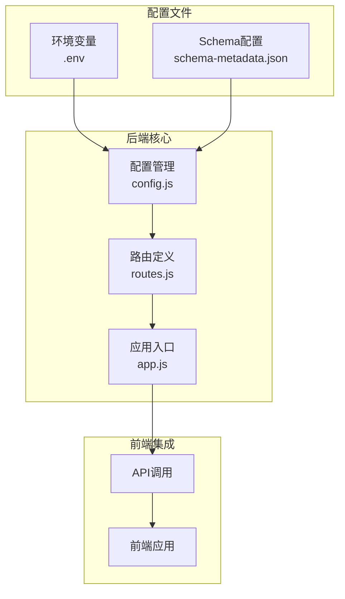
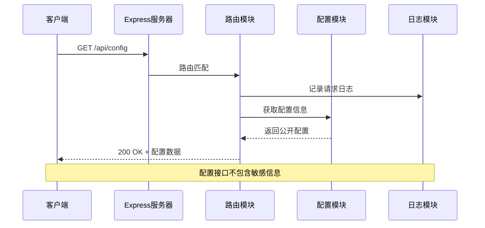
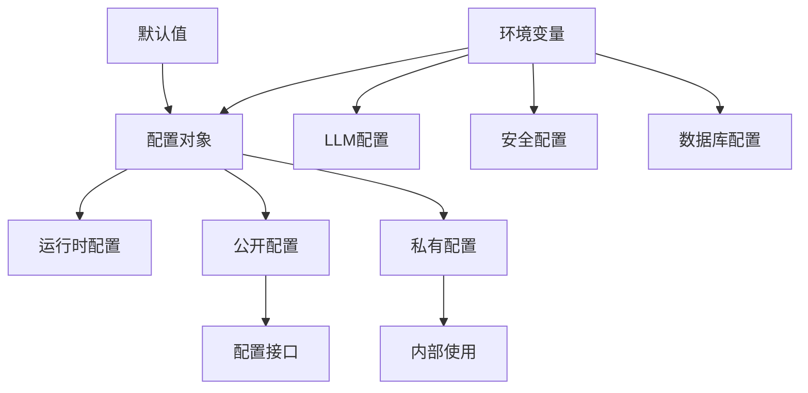
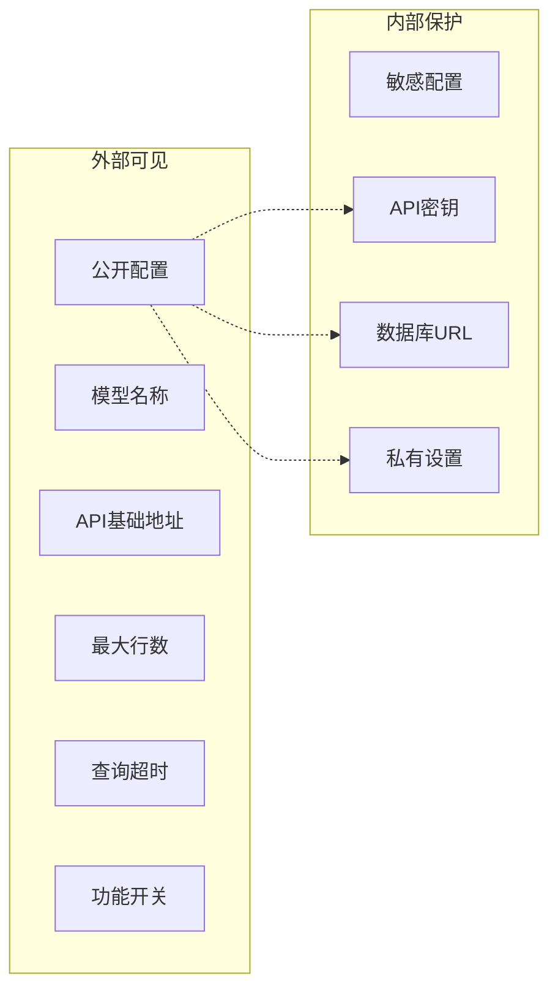
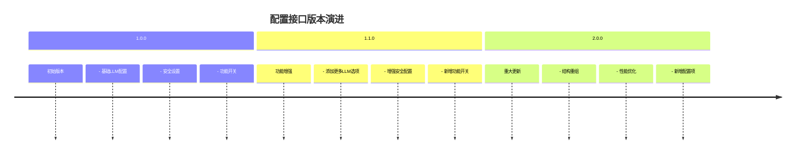
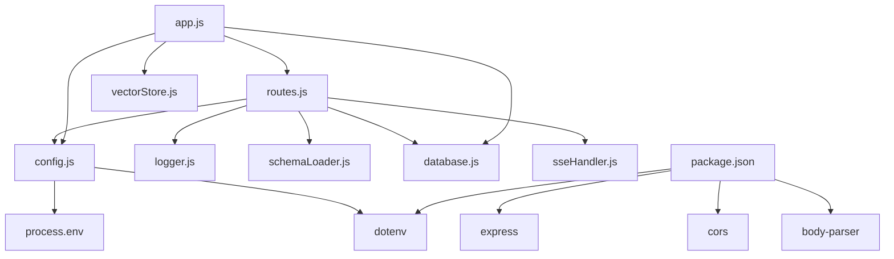

# 配置接口

<cite>
**本文档引用的文件**
- [config.js](file://backend/src/core/config.js)
- [routes.js](file://backend/src/core/routes.js)
- [app.js](file://backend/src/app.js)
- [package.json](file://backend/package.json)
- [schema-metadata.example.json](file://backend/config/schema-metadata.example.json)
</cite>

## 目录
1. [简介](#简介)
2. [项目结构](#项目结构)
3. [核心组件](#核心组件)
4. [架构概览](#架构概览)
5. [详细组件分析](#详细组件分析)
6. [依赖分析](#依赖分析)
7. [性能考虑](#性能考虑)
8. [故障排除指南](#故障排除指南)
9. [结论](#结论)

## 简介

配置接口是NL2SQL服务的重要组成部分，它提供了获取公开配置信息的能力，使客户端能够动态获取服务的运行配置而无需暴露敏感数据。该接口特别设计用于支持前端应用的动态配置需求，包括LLM配置、安全设置和功能开关等信息。

## 项目结构

NL2SQL项目的配置系统采用模块化设计，主要涉及以下关键文件：



**图表来源**
- [config.js:1-332](file://backend/src/core/config.js#L1-L332)
- [routes.js:773-800](file://backend/src/core/routes.js#L773-L800)
- [app.js:39-50](file://backend/src/app.js#L39-L50)

**章节来源**
- [config.js:1-332](file://backend/src/core/config.js#L1-L332)
- [routes.js:773-800](file://backend/src/core/routes.js#L773-L800)
- [app.js:39-50](file://backend/src/app.js#L39-L50)

## 核心组件

配置接口的核心组件包括：

### 配置管理模块
配置管理模块统一管理应用的所有配置项，从环境变量读取并提供默认值。该模块集中管理配置便于维护和修改，避免配置散落在各个文件中。

### 路由定义模块
路由定义模块包含RESTful API端点，其中配置接口作为其中一个重要的API端点，提供安全的配置信息获取能力。

### 应用入口模块
应用入口模块负责加载环境变量配置、初始化各个核心模块，并启动HTTP服务器。

**章节来源**
- [config.js:12-289](file://backend/src/core/config.js#L12-L289)
- [routes.js:773-800](file://backend/src/core/routes.js#L773-L800)
- [app.js:15-166](file://backend/src/app.js#L15-L166)

## 架构概览

配置接口在整个系统架构中的位置如下：



**图表来源**
- [routes.js:782-800](file://backend/src/core/routes.js#L782-L800)
- [config.js:16-289](file://backend/src/core/config.js#L16-L289)

## 详细组件分析

### 配置接口规范

#### 端点定义
- **HTTP方法**: GET
- **路径**: `/api/config`
- **功能**: 获取公开的配置信息，不包含敏感数据

#### 请求示例
```bash
curl -X GET "http://localhost:3000/api/config"
```

#### 响应示例
```json
{
  "version": "1.0.0",
  "llm": {
    "model": "gpt-4",
    "api_base": "https://api.openai.com/v1"
  },
  "security": {
    "max_query_rows": 1000,
    "query_timeout": 30000
  },
  "features": {
    "streaming": true,
    "clarification": true,
    "vector_search": true
  }
}
```

#### 响应数据结构

| 字段 | 类型 | 描述 | 示例值 |
|------|------|------|--------|
| version | string | 配置版本号 | "1.0.0" |
| llm | object | LLM配置信息 | - |
| llm.model | string | LLM模型名称 | "gpt-4" |
| llm.api_base | string | LLM API基础地址 | "https://api.openai.com/v1" |
| security | object | 安全配置信息 | - |
| security.max_query_rows | number | 最大查询行数限制 | 1000 |
| security.query_timeout | number | 查询超时时间(ms) | 30000 |
| features | object | 功能开关配置 | - |
| features.streaming | boolean | 流式传输功能 | true |
| features.clarification | boolean | 澄清功能 | true |
| features.vector_search | boolean | 向量搜索功能 | true |

**章节来源**
- [routes.js:777-800](file://backend/src/core/routes.js#L777-L800)

### 配置数据来源与优先级

配置系统采用多层优先级机制：



**图表来源**
- [config.js:16-289](file://backend/src/core/config.js#L16-L289)

#### 配置项分类

**LLM配置**（来自配置对象）
- `llm.apiBase`: LLM API基础URL
- `llm.model`: 默认使用的模型名称
- `llm.timeout`: 请求超时时间（毫秒）

**安全配置**（来自配置对象）
- `security.maxQueryRows`: 单个查询返回的最大行数限制
- `security.queryTimeout`: 查询超时时间（毫秒）

**功能开关**（硬编码）
- `features.streaming`: 流式传输功能（固定为true）
- `features.clarification`: 澄清功能（固定为true）
- `features.vector_search`: 向量搜索功能（固定为true）

**章节来源**
- [config.js:60-87](file://backend/src/core/config.js#L60-L87)
- [config.js:140-170](file://backend/src/core/config.js#L140-L170)
- [routes.js:786-799](file://backend/src/core/routes.js#L786-L799)

### 配置安全性考虑

#### 敏感信息保护
配置接口经过精心设计，确保不暴露任何敏感信息：

1. **API密钥保护**: `llm.apiKey` 不包含在响应中
2. **数据库凭据**: `srDatabase.url` 不包含在响应中
3. **内部配置**: 私有配置项仅在内部使用

#### 安全边界


**图表来源**
- [routes.js:784-799](file://backend/src/core/routes.js#L784-L799)

**章节来源**
- [routes.js:782-800](file://backend/src/core/routes.js#L782-L800)

### 版本控制机制

配置接口采用版本化设计：

#### 版本标识
- **响应版本**: `version: "1.0.0"`
- **语义版本控制**: 遵循语义化版本规则
- **向后兼容**: 新版本保持向后兼容性

#### 版本演进


**章节来源**
- [routes.js:785](file://backend/src/core/routes.js#L785)

### 配置热更新机制

配置系统支持动态更新，但需注意以下限制：

#### 支持的热更新
- **运行时配置**: 端口号、日志级别等
- **功能开关**: 动态启用/禁用某些功能
- **安全阈值**: 调整查询限制参数

#### 更新限制
- **敏感配置**: API密钥、数据库凭据等不可热更新
- **架构配置**: 数据库连接、文件路径等重启生效
- **环境变量**: 需要重启服务才能生效

**章节来源**
- [config.js:300-322](file://backend/src/core/config.js#L300-L322)

## 依赖分析

配置接口的依赖关系如下：



**图表来源**
- [routes.js:16-27](file://backend/src/core/routes.js#L16-L27)
- [app.js:39-50](file://backend/src/app.js#L39-L50)
- [package.json:10-20](file://backend/package.json#L10-L20)

**章节来源**
- [routes.js:16-27](file://backend/src/core/routes.js#L16-L27)
- [app.js:39-50](file://backend/src/app.js#L39-L50)
- [package.json:10-20](file://backend/package.json#L10-L20)

## 性能考虑

### 配置获取性能
- **响应时间**: 配置接口为纯内存操作，响应时间极短
- **并发处理**: 支持高并发请求，无状态设计
- **缓存策略**: 前端可实现本地缓存减少请求频率

### 内存使用
- **配置对象**: 单例模式，内存占用极小
- **响应数据**: JSON序列化开销很小
- **无持久化**: 配置信息不写入磁盘

### 扩展性
- **水平扩展**: 多实例部署不影响配置一致性
- **负载均衡**: 可在多个实例间共享配置
- **CDN支持**: 前端可缓存配置信息

## 故障排除指南

### 常见问题

#### 1. 配置接口返回错误
**症状**: HTTP 500 错误
**原因**: 配置模块初始化失败
**解决方案**: 检查环境变量配置和依赖安装

#### 2. 配置信息不完整
**症状**: 响应中缺少某些配置项
**原因**: 对应的环境变量未设置
**解决方案**: 检查相关环境变量是否正确配置

#### 3. 端口冲突
**症状**: 服务启动失败
**原因**: 端口被其他进程占用
**解决方案**: 修改 `PORT` 环境变量或停止占用进程

**章节来源**
- [app.js:160-165](file://backend/src/app.js#L160-L165)
- [config.js:300-322](file://backend/src/core/config.js#L300-L322)

### 调试技巧

#### 启用详细日志
```javascript
// 在配置中设置更高日志级别
process.env.LOG_LEVEL = 'debug';
```

#### 验证环境变量
```bash
# 检查所有相关环境变量
echo $LLM_API_BASE
echo $LLM_MODEL
echo $MAX_QUERY_ROWS
echo $QUERY_TIMEOUT
```

#### 测试配置接口
```bash
# 使用curl测试
curl -v http://localhost:3000/api/config
```

## 结论

配置接口为NL2SQL服务提供了安全、高效的配置管理能力。通过精心设计的公开配置信息和严格的安全边界，该接口既满足了前端应用的动态配置需求，又确保了敏感信息的安全性。

### 主要优势
1. **安全性**: 严格分离公开和敏感配置
2. **灵活性**: 支持多种LLM服务提供商
3. **可扩展性**: 模块化设计便于功能扩展
4. **易用性**: 简洁的API接口和清晰的响应格式

### 未来改进方向
1. **配置热更新**: 实现部分配置的热更新能力
2. **配置验证**: 增强配置项的运行时验证
3. **配置审计**: 添加配置变更的审计日志
4. **配置模板**: 提供配置模板和最佳实践

该配置接口为NL2SQL服务的稳定运行和灵活部署奠定了坚实基础，是整个系统架构中不可或缺的重要组成部分。