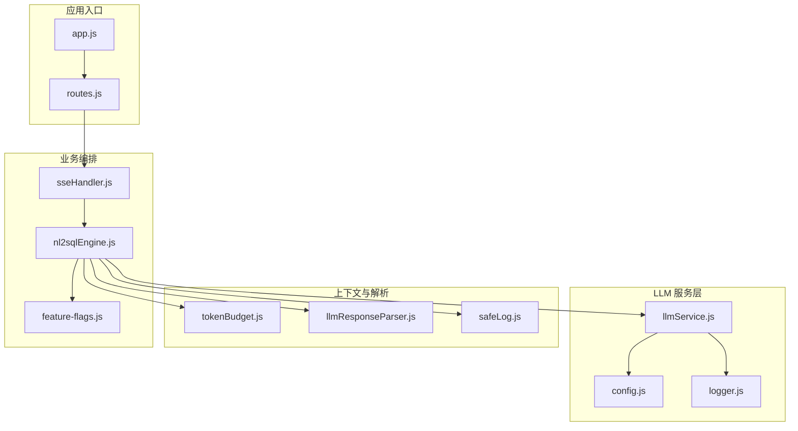
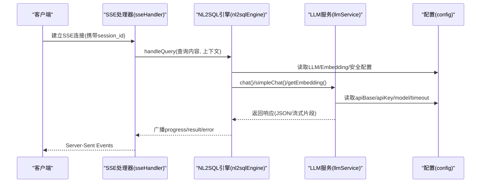
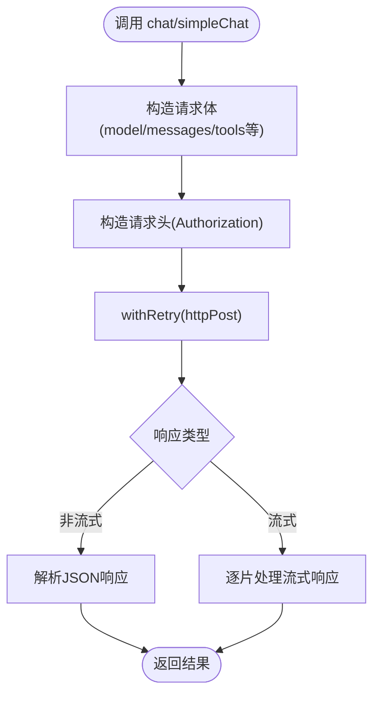
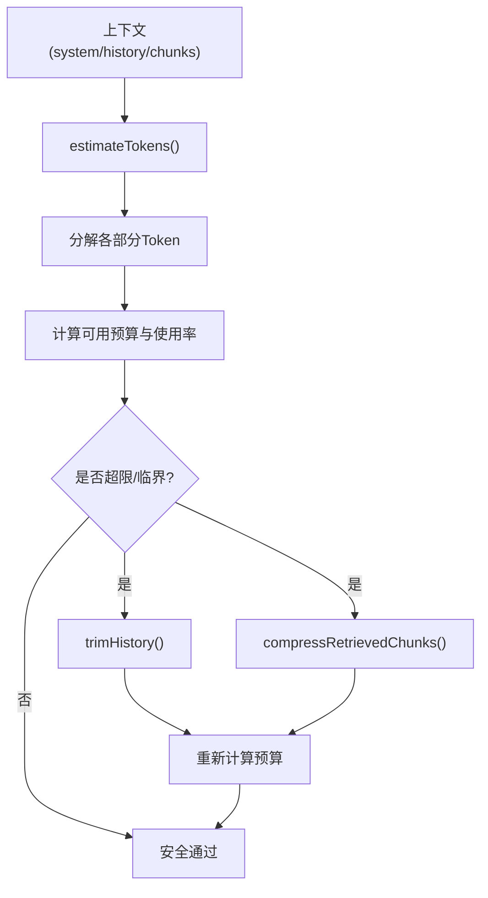
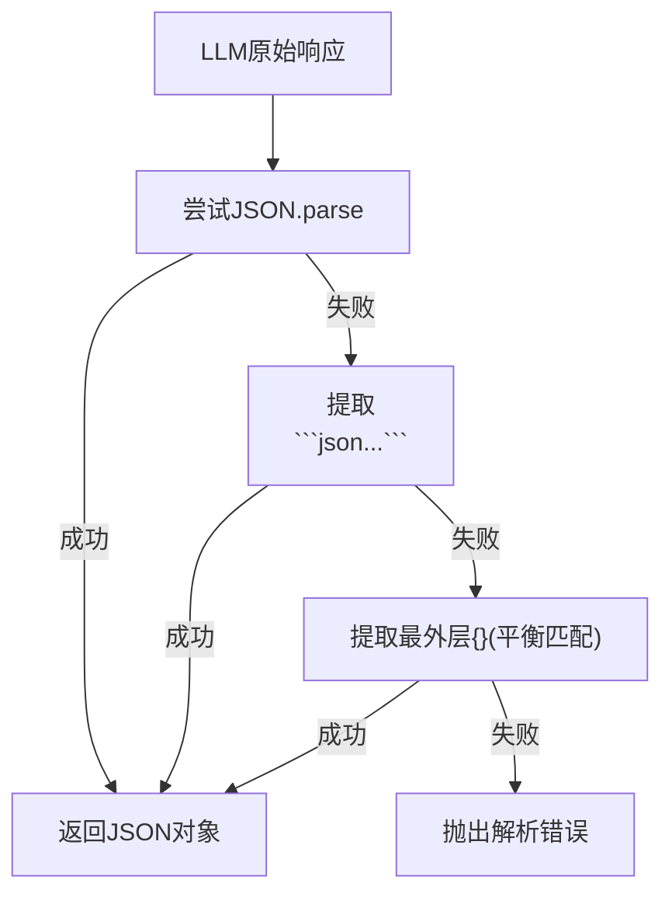

# LLM 服务集成

<cite>
**本文引用的文件**
- [llmService.js](file://backend/src/core/llmService.js)
- [tokenBudget.js](file://backend/src/utils/tokenBudget.js)
- [llmResponseParser.js](file://backend/src/utils/llmResponseParser.js)
- [config.js](file://backend/src/core/config.js)
- [logger.js](file://backend/src/utils/logger.js)
- [routes.js](file://backend/src/core/routes.js)
- [sseHandler.js](file://backend/src/core/sseHandler.js)
- [nl2sqlEngine.js](file://backend/src/core/nl2sqlEngine.js)
- [feature-flags.js](file://backend/config/feature-flags.js)
- [safeLog.js](file://backend/src/utils/safeLog.js)
- [app.js](file://backend/src/app.js)
- [package.json](file://backend/package.json)
</cite>

## 目录
1. [简介](#简介)
2. [项目结构](#项目结构)
3. [核心组件](#核心组件)
4. [架构总览](#架构总览)
5. [详细组件分析](#详细组件分析)
6. [依赖分析](#依赖分析)
7. [性能考量](#性能考量)
8. [故障排查指南](#故障排查指南)
9. [结论](#结论)
10. [附录](#附录)

## 简介
本技术文档围绕 NL2SQL 项目中的 LLM 服务集成展开，目标是为开发者提供一套完整的 LLM 集成指南，涵盖以下主题：
- LLM API 的封装与调用（非流式与流式）
- 提示工程最佳实践（Prompt 设计、上下文管理、多轮对话）
- Token 预算管理与上下文窗口溢出防护
- 多模型适配与兼容性处理
- 错误处理与重试机制
- 配置选项、性能监控与成本控制策略

## 项目结构
后端采用 Node.js + Express 架构，LLM 服务集成主要集中在 core 与 utils 模块中：
- 核心服务封装：llmService.js
- Token 预算与上下文压缩：tokenBudget.js
- LLM 响应解析：llmResponseParser.js
- 配置中心：config.js
- 日志系统：logger.js
- SSE 流式交互：sseHandler.js
- NL2SQL 主流程编排：nl2sqlEngine.js
- 功能开关：feature-flags.js
- 安全日志脱敏：safeLog.js
- 应用入口与路由：app.js、routes.js
- 依赖与运行环境：package.json

图表来源
- [app.js:1-279](file://backend/src/app.js#L1-L279)
- [routes.js:1-800](file://backend/src/core/routes.js#L1-L800)
- [llmService.js:1-491](file://backend/src/core/llmService.js#L1-L491)
- [tokenBudget.js:1-435](file://backend/src/utils/tokenBudget.js#L1-L435)
- [llmResponseParser.js:1-146](file://backend/src/utils/llmResponseParser.js#L1-L146)
- [config.js:1-439](file://backend/src/core/config.js#L1-L439)
- [logger.js:1-482](file://backend/src/utils/logger.js#L1-L482)
- [nl2sqlEngine.js:1-200](file://backend/src/core/nl2sqlEngine.js#L1-L200)
- [feature-flags.js:1-294](file://backend/config/feature-flags.js#L1-L294)
- [safeLog.js:1-71](file://backend/src/utils/safeLog.js#L1-L71)

章节来源
- [app.js:1-279](file://backend/src/app.js#L1-L279)
- [routes.js:1-800](file://backend/src/core/routes.js#L1-L800)

## 核心组件
- LLM 服务封装（llmService.js）
  - HTTP 请求封装、重试机制、流式与非流式响应处理、Embedding 调用、工具定义辅助
- Token 预算与上下文压缩（tokenBudget.js）
  - Token 估算、预算计算、历史裁剪、检索片段压缩、压缩触发策略
- LLM 响应解析（llmResponseParser.js）
  - JSON 与 SQL 提取的统一解析器
- 配置中心（config.js）
  - LLM/Embedding/数据库/安全/日志/上下文管理/评估等配置
- 日志系统（logger.js）
  - 多级别日志、文件轮转、追踪上下文
- SSE 流式交互（sseHandler.js）
  - 连接管理、进度回调、错误推送、查询处理编排
- NL2SQL 主流程（nl2sqlEngine.js）
  - 编排意图识别、实体解析、SQL 生成、执行、格式化与审计
- 功能开关（feature-flags.js）
  - 渐进式启用/回滚新功能
- 安全日志脱敏（safeLog.js）
  - Prompt 摘要与哈希，避免明文日志

章节来源
- [llmService.js:1-491](file://backend/src/core/llmService.js#L1-L491)
- [tokenBudget.js:1-435](file://backend/src/utils/tokenBudget.js#L1-L435)
- [llmResponseParser.js:1-146](file://backend/src/utils/llmResponseParser.js#L1-L146)
- [config.js:1-439](file://backend/src/core/config.js#L1-L439)
- [logger.js:1-482](file://backend/src/utils/logger.js#L1-L482)
- [sseHandler.js:1-688](file://backend/src/core/sseHandler.js#L1-L688)
- [nl2sqlEngine.js:1-200](file://backend/src/core/nl2sqlEngine.js#L1-L200)
- [feature-flags.js:1-294](file://backend/config/feature-flags.js#L1-L294)
- [safeLog.js:1-71](file://backend/src/utils/safeLog.js#L1-L71)

## 架构总览
LLM 服务集成贯穿请求生命周期：SSE 建立连接后，根据功能开关选择引擎（Legacy 或 Agentic），在编排流程中调用 LLM 服务进行 SQL 生成与澄清问答，期间通过 Token 预算与响应解析保障稳定性与准确性。

图表来源
- [sseHandler.js:258-410](file://backend/src/core/sseHandler.js#L258-L410)
- [nl2sqlEngine.js:121-200](file://backend/src/core/nl2sqlEngine.js#L121-L200)
- [llmService.js:224-322](file://backend/src/core/llmService.js#L224-L322)
- [config.js:64-94](file://backend/src/core/config.js#L64-L94)

## 详细组件分析

### LLM 服务封装（llmService.js）
- HTTP 请求封装
  - 支持 HTTPS/HTTP、超时控制、错误与超时处理、响应截断检测
- 重试机制
  - withRetry 包装器，指数退避风格的延迟等待
- 聊天与单轮对话
  - chat：支持流式与非流式，自动注入模型、温度、最大生成 Token
  - simpleChat：快速单轮对话，自动构造 system/user 消息
- Embedding 调用
  - getEmbedding：支持单个与批量文本，返回向量数组
- 工具定义辅助
  - createToolDefinition：构建函数工具定义，便于模型调用

图表来源
- [llmService.js:43-154](file://backend/src/core/llmService.js#L43-L154)
- [llmService.js:224-322](file://backend/src/core/llmService.js#L224-L322)
- [llmService.js:383-438](file://backend/src/core/llmService.js#L383-L438)
- [llmService.js:454-474](file://backend/src/core/llmService.js#L454-L474)

章节来源
- [llmService.js:1-491](file://backend/src/core/llmService.js#L1-L491)

### Token 预算管理（tokenBudget.js）
- Token 估算
  - 基于字符数的保守估算（3.5 字符/Token），支持批量与对象估算
- 预算计算
  - 分解系统提示、历史、检索片段三部分，计算使用率与剩余预算
- 压缩策略
  - 历史裁剪（保留最近 N 轮）、检索片段压缩（按分数保留重要片段）
- 触发压缩
  - 根据预算状态自动选择压缩策略，二次计算预算并给出建议

图表来源
- [tokenBudget.js:115-181](file://backend/src/utils/tokenBudget.js#L115-L181)
- [tokenBudget.js:315-372](file://backend/src/utils/tokenBudget.js#L315-L372)

章节来源
- [tokenBudget.js:1-435](file://backend/src/utils/tokenBudget.js#L1-L435)

### LLM 响应解析（llmResponseParser.js）
- JSON 解析策略
  - 直接解析 → 代码块提取 → 平衡花括号提取
- SQL 提取策略
  - JSON 字段 → 代码块 → SELECT 正则匹配
- 统一接口
  - 为多处引擎模块提供一致的解析能力，避免重复实现

图表来源
- [llmResponseParser.js:24-59](file://backend/src/utils/llmResponseParser.js#L24-L59)
- [llmResponseParser.js:119-143](file://backend/src/utils/llmResponseParser.js#L119-L143)

章节来源
- [llmResponseParser.js:1-146](file://backend/src/utils/llmResponseParser.js#L1-L146)

### 配置中心（config.js）
- LLM/Embedding
  - apiBase、apiKey、model、timeout、maxRetries、retryDelay、dimension、enabled
- 数据库与向量库
  - SQLite、LanceDB 路径与连接池配置
- 安全与白名单
  - allowedTables、dryRun、maxQueryRows、forbiddenKeywords、masking 规则、RLS
- 日志与自修复
  - 日志级别、文件轮转、自修复 Cron 与阈值
- 上下文管理
  - enableTokenBudget、enableSummarizer、tokenBudget 配置、summarizer 配置
- 评估
  - evaluation 开关与阈值

章节来源
- [config.js:1-439](file://backend/src/core/config.js#L1-L439)

### 日志系统（logger.js）
- 多级别日志：TRACE、DEBUG、INFO、WARN、ERROR
- 文件轮转：按大小轮转、保留数量
- 追踪上下文：startTrace/traceStep/endTrace，支持清理僵尸追踪条目
- 事件发射：便于外部监听日志事件

章节来源
- [logger.js:1-482](file://backend/src/utils/logger.js#L1-L482)

### SSE 流式交互（sseHandler.js）
- 连接管理：建立、关闭、错误处理
- 消息广播：connected、processing、progress、result、error
- 查询处理：根据功能开关选择 Legacy/Agentic 引擎，自动回退
- 澄清回答：resumeFromClarification 的续跑逻辑

章节来源
- [sseHandler.js:1-688](file://backend/src/core/sseHandler.js#L1-L688)

### NL2SQL 主流程（nl2sqlEngine.js）
- 错误类型：NL2SQLError，包含实体解析、SQL 验证、SQL 生成等分类
- 主流程：加载历史 → 历史压缩（可选）→ 意图识别/澄清 → SQL 生成 → 验证/RLS 改写 → 执行/脱敏 → 格式化 → 审计
- 与 LLM 集成：在 SQL 生成阶段调用 LLM 服务，结合 Token 预算与响应解析

章节来源
- [nl2sqlEngine.js:1-200](file://backend/src/core/nl2sqlEngine.js#L1-L200)

### 功能开关（feature-flags.js）
- 分阶段开关：Schema 探索、动态意图拆解、澄清机制、Agentic 引擎、自我修正等
- 全局开关：ENABLE_ALL_FEATURES/DISABLE_ALL_FEATURES
- 辅助函数：isEnabled、shouldUseAgenticWorkflow、getEnabledPhases

章节来源
- [feature-flags.js:1-294](file://backend/config/feature-flags.js#L1-L294)

### 安全日志脱敏（safeLog.js）
- hashPrompt：SHA-1 前 8 位摘要
- summarizePrompt：返回 length/hash/head/tail 摘要
- isPromptFullLoggingEnabled：调试逃生门（LOG_PROMPT_FULL=true）

章节来源
- [safeLog.js:1-71](file://backend/src/utils/safeLog.js#L1-L71)

## 依赖分析
- 运行时依赖
  - Express、body-parser、cors、node-sql-parser、mysql2/sqlite3、uuid、vectordb 等
- Node 版本要求：>= 18
- 开发依赖：nodemon

章节来源
- [package.json:1-36](file://backend/package.json#L1-L36)

## 性能考量
- LLM 调用
  - 合理设置 timeout 与 maxRetries，避免长尾阻塞
  - 使用 withRetry 与合理的延迟策略，降低瞬时峰值压力
- Token 预算
  - 启用 enableTokenBudget，定期触发 trimHistory 与 compressRetrievedChunks
  - 调整 maxContextTokens/reservedOutputTokens 与阈值，平衡准确度与稳定性
- SSE 与并发
  - 单连接互斥处理（isProcessing），避免并发冲突
  - Nginx 缓冲禁用（X-Accel-Buffering: no），保证实时性
- 日志与追踪
  - TRACE/DEBUG 仅在必要时开启，避免 IO 放大
  - 追踪上下文容量与清理周期需平衡内存占用

[本节为通用指导，无需特定文件引用]

## 故障排查指南
- LLM API 调用失败
  - 检查 config.llm.apiKey/apiBase/model/timeout
  - 查看 withRetry 重试日志与最终错误栈
  - 关注响应截断与 JSON 解析失败的告警
- SSE 连接异常
  - 检查 session_id 参数与会话存在性
  - 关注连接关闭与错误事件推送
- SQL 生成异常
  - 使用 llmResponseParser 提取 JSON/SQL，确认策略匹配
  - 若解析失败，查看日志中响应片段与截断标记
- Token 超限
  - 启用 getContextStatusSummary 与 triggerCompression，观察压缩动作与新预算
- 安全与合规
  - 检查 allowedTables、forbiddenKeywords、masking 规则
  - RLS 配置需同时满足开关、映射与请求头

章节来源
- [llmService.js:169-197](file://backend/src/core/llmService.js#L169-L197)
- [llmService.js:100-134](file://backend/src/core/llmService.js#L100-L134)
- [sseHandler.js:127-162](file://backend/src/core/sseHandler.js#L127-L162)
- [llmResponseParser.js:24-59](file://backend/src/utils/llmResponseParser.js#L24-L59)
- [tokenBudget.js:384-408](file://backend/src/utils/tokenBudget.js#L384-L408)
- [config.js:153-211](file://backend/src/core/config.js#L153-L211)

## 结论
本项目通过统一的 LLM 服务封装、完善的 Token 预算与上下文压缩、稳健的错误与重试机制，以及灵活的功能开关与日志脱敏策略，实现了 NL2SQL 场景下的 LLM 集成闭环。开发者可在保证稳定性的同时，逐步启用新功能并精细化调优性能与成本。

[本节为总结性内容，无需特定文件引用]

## 附录

### LLM 集成配置清单
- LLM 基础配置
  - LLM_API_BASE、LLM_API_KEY、LLM_MODEL、LLM_TIMEOUT、LLM_TIMEOUT、LLM_MAX_RETRIES、LLM_RETRY_DELAY
- Embedding 配置
  - EMBEDDING_ENABLED、EMBEDDING_MODEL、EMBEDDING_DIMENSION、EMBEDDING_TIMEOUT
- 上下文管理
  - ENABLE_TOKEN_BUDGET、ENABLE_SUMMARIZER、MAX_CONTEXT_TOKENS、RESERVED_OUTPUT_TOKENS、SUMMARIZER_* 系列
- 安全与脱敏
  - ALLOWED_TABLES、DRY_RUN、MAX_QUERY_ROWS、FORBIDDEN_KEYWORDS、MASKING_ENABLED、RLS_* 系列
- 日志与评估
  - LOG_LEVEL、LOG_FILE、EVALUATION_ENABLED、EVALUATION_TRACK_STATS

章节来源
- [config.js:64-94](file://backend/src/core/config.js#L64-L94)
- [config.js:344-374](file://backend/src/core/config.js#L344-L374)
- [config.js:153-211](file://backend/src/core/config.js#L153-L211)
- [config.js:236-254](file://backend/src/core/config.js#L236-L254)
- [config.js:383-395](file://backend/src/core/config.js#L383-L395)