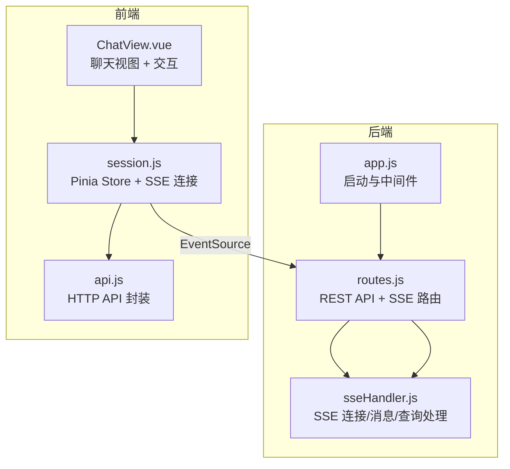
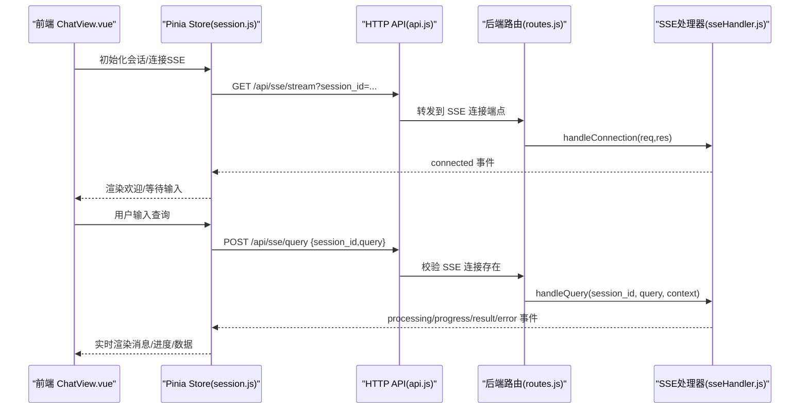
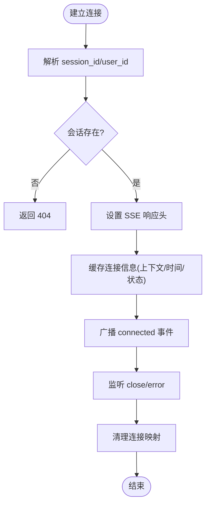
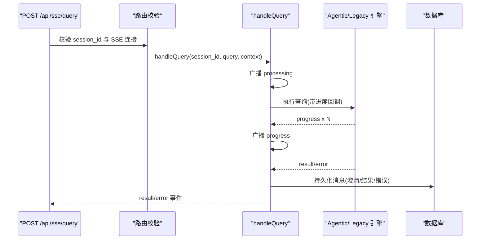
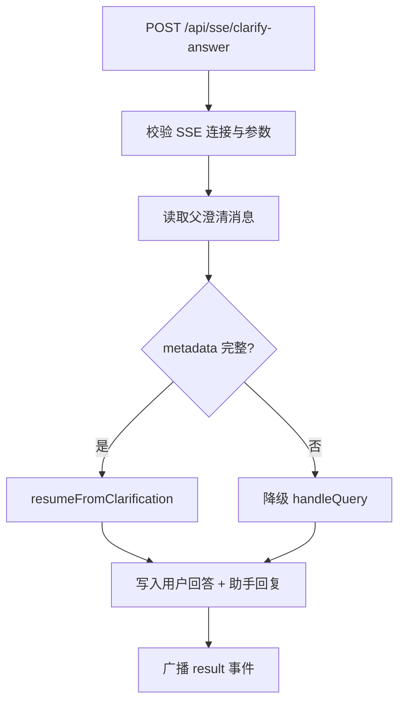
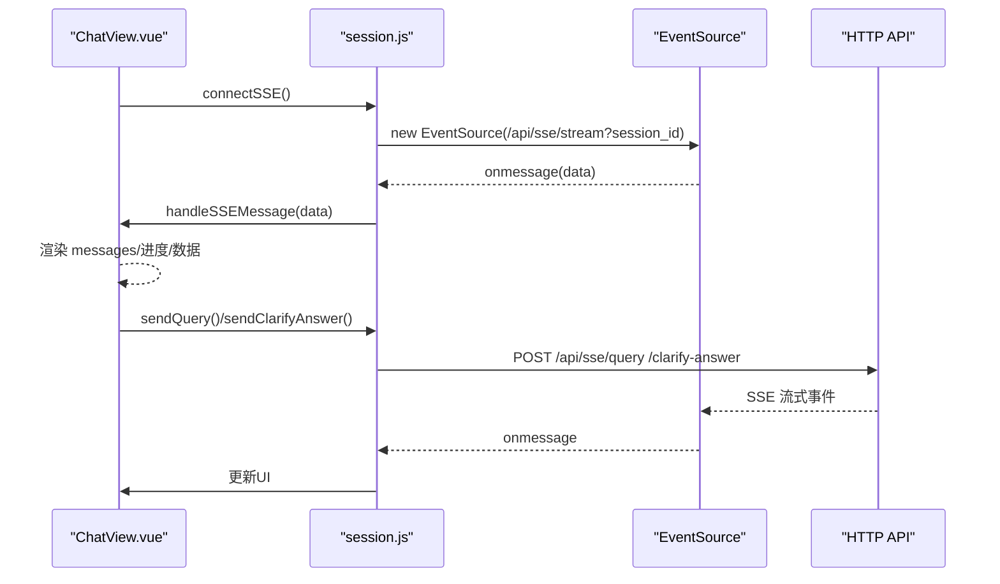
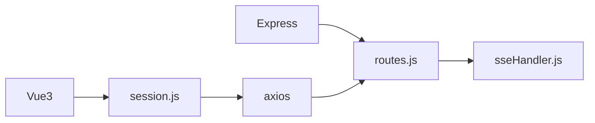

# SSE 流式通信

<cite>
**本文引用的文件**
- [backend/src/core/sseHandler.js](file://backend/src/core/sseHandler.js)
- [backend/src/core/routes.js](file://backend/src/core/routes.js)
- [backend/src/app.js](file://backend/src/app.js)
- [frontend/src/stores/session.js](file://frontend/src/stores/session.js)
- [frontend/src/views/ChatView.vue](file://frontend/src/views/ChatView.vue)
- [frontend/src/utils/api.js](file://frontend/src/utils/api.js)
- [backend/test/phase1/test-sse-error-feedback.js](file://backend/test/phase1/test-sse-error-feedback.js)
- [backend/test/phase3/sse-clarify-answer-route.test.js](file://backend/test/phase3/sse-clarify-answer-route.test.js)
</cite>

## 目录
1. [简介](#简介)
2. [项目结构](#项目结构)
3. [核心组件](#核心组件)
4. [架构总览](#架构总览)
5. [详细组件分析](#详细组件分析)
6. [依赖分析](#依赖分析)
7. [性能考虑](#性能考虑)
8. [故障排查指南](#故障排查指南)
9. [结论](#结论)
10. [附录](#附录)

## 简介
本文件针对 NL2SQL 项目的 SSE（Server-Sent Events）流式通信系统，提供从连接管理、消息协议、前后端集成到性能优化与故障诊断的完整技术文档。重点覆盖：
- 连接建立、多标签页支持、心跳检测与断线重连策略
- 消息事件类型、消息格式规范与错误处理机制
- 前端 Vue3 组件与后端 SSE 的集成实现
- 性能优化策略（消息批处理、内存管理、并发控制）
- 监控指标、故障诊断与调试方法

## 项目结构
后端采用 Express + Node.js，SSE 通过独立处理器模块管理连接与消息；前端使用 Pinia 状态管理与原生 EventSource 连接后端 SSE 端点。

图表来源
- [backend/src/app.js:1-279](file://backend/src/app.js#L1-L279)
- [backend/src/core/routes.js:946-1064](file://backend/src/core/routes.js#L946-L1064)
- [backend/src/core/sseHandler.js:1-688](file://backend/src/core/sseHandler.js#L1-L688)
- [frontend/src/stores/session.js:1-443](file://frontend/src/stores/session.js#L1-L443)
- [frontend/src/views/ChatView.vue:1-835](file://frontend/src/views/ChatView.vue#L1-L835)
- [frontend/src/utils/api.js:1-320](file://frontend/src/utils/api.js#L1-L320)

章节来源
- [backend/src/app.js:1-279](file://backend/src/app.js#L1-L279)
- [backend/src/core/routes.js:946-1064](file://backend/src/core/routes.js#L946-L1064)
- [backend/src/core/sseHandler.js:1-688](file://backend/src/core/sseHandler.js#L1-L688)
- [frontend/src/stores/session.js:1-443](file://frontend/src/stores/session.js#L1-L443)
- [frontend/src/views/ChatView.vue:1-835](file://frontend/src/views/ChatView.vue#L1-L835)
- [frontend/src/utils/api.js:1-320](file://frontend/src/utils/api.js#L1-L320)

## 核心组件
- 后端 SSE 处理器：负责连接建立、连接映射、消息广播、查询处理与错误推送。
- 后端路由：暴露 SSE 连接端点与查询提交端点，并前置校验连接有效性。
- 前端 Pinia Store：封装 SSE 连接、消息处理、查询提交与澄清回答提交。
- 前端视图组件：渲染消息、处理用户交互、触发查询与澄清回答。

章节来源
- [backend/src/core/sseHandler.js:1-688](file://backend/src/core/sseHandler.js#L1-L688)
- [backend/src/core/routes.js:946-1064](file://backend/src/core/routes.js#L946-L1064)
- [frontend/src/stores/session.js:1-443](file://frontend/src/stores/session.js#L1-L443)
- [frontend/src/views/ChatView.vue:1-835](file://frontend/src/views/ChatView.vue#L1-L835)

## 架构总览
SSE 通信链路分为“连接建立—消息推送—查询提交—结果回推”四个阶段，前后端通过 REST API 与 EventSource 协议协同工作。

图表来源
- [backend/src/core/routes.js:959-1017](file://backend/src/core/routes.js#L959-L1017)
- [backend/src/core/sseHandler.js:49-120](file://backend/src/core/sseHandler.js#L49-L120)
- [backend/src/core/sseHandler.js:258-410](file://backend/src/core/sseHandler.js#L258-L410)
- [frontend/src/stores/session.js:185-339](file://frontend/src/stores/session.js#L185-L339)
- [frontend/src/utils/api.js:246-251](file://frontend/src/utils/api.js#L246-L251)

## 详细组件分析

### 后端 SSE 连接管理与多标签页支持
- 连接建立：解析查询参数 session_id、user_id，校验会话存在，设置 SSE 响应头，缓存连接信息（含上下文、连接/活跃时间、处理状态），并向客户端发送 connected 事件。
- 多标签页支持：同一 session_id 可对应多个连接实例，内部以 Map 存储，每个连接独立写入数据。
- 连接关闭与错误：监听 close/error 事件，清理连接映射；错误日志记录并清理。
- 连接统计：提供连接数、连接列表、指定会话连接数等统计接口。

图表来源
- [backend/src/core/sseHandler.js:49-120](file://backend/src/core/sseHandler.js#L49-L120)
- [backend/src/core/sseHandler.js:127-162](file://backend/src/core/sseHandler.js#L127-L162)

章节来源
- [backend/src/core/sseHandler.js:32-120](file://backend/src/core/sseHandler.js#L32-L120)
- [backend/src/core/sseHandler.js:619-664](file://backend/src/core/sseHandler.js#L619-L664)

### 查询处理与事件广播
- 查询提交：POST /api/sse/query 前置校验 SSE 连接存在；异步调用 handleQuery，失败时通过 pushError 推送错误事件，避免“200 成功 + 前端无反馈”的假象。
- 引擎选择：根据功能开关选择 Agentic 引擎或 Legacy 引擎；Agentic 失败时可自动回退 Legacy。
- 事件类型：processing（开始处理）、progress（进度回调）、result（结果）、error（错误）。
- 消息落库：Agentic 结果在持久化时写入澄清/结果/错误消息，便于后续审计与恢复。

图表来源
- [backend/src/core/routes.js:974-1017](file://backend/src/core/routes.js#L974-L1017)
- [backend/src/core/sseHandler.js:258-410](file://backend/src/core/sseHandler.js#L258-L410)
- [backend/src/core/sseHandler.js:429-484](file://backend/src/core/sseHandler.js#L429-L484)

章节来源
- [backend/src/core/routes.js:974-1017](file://backend/src/core/routes.js#L974-L1017)
- [backend/src/core/sseHandler.js:258-410](file://backend/src/core/sseHandler.js#L258-L410)
- [backend/src/core/sseHandler.js:429-484](file://backend/src/core/sseHandler.js#L429-L484)

### 澄清回答处理（批次 B）
- 端点：POST /api/sse/clarify-answer，提交 parent_message_id 与用户回答，后端读取父澄清消息 metadata 恢复分解过程并继续生成。
- 降级策略：父消息缺失或 metadata 不完整时，降级走 handleQuery。
- 事件与落库：本地立即插入用户回答，随后通过 persistAgenticMessages 写入助手回复，保证一致性。

图表来源
- [backend/src/core/routes.js:1032-1064](file://backend/src/core/routes.js#L1032-L1064)
- [backend/src/core/sseHandler.js:511-615](file://backend/src/core/sseHandler.js#L511-L615)

章节来源
- [backend/src/core/routes.js:1032-1064](file://backend/src/core/routes.js#L1032-L1064)
- [backend/src/core/sseHandler.js:511-615](file://backend/src/core/sseHandler.js#L511-L615)
- [backend/test/phase3/sse-clarify-answer-route.test.js:1-261](file://backend/test/phase3/sse-clarify-answer-route.test.js#L1-L261)

### 前端 Vue3 集成与实时展示
- 连接建立：组件挂载时通过 Pinia Store 建立 EventSource，监听 onmessage/onerror/onopen，处理 connected/processing/progress/result/error 事件。
- 实时渲染：根据事件类型更新 messages、processingStatus、processingProgress；支持澄清选项渲染与点击回答。
- 用户交互：发送查询与澄清回答，均通过 HTTP API 触发后端 SSE 流式推送。

图表来源
- [frontend/src/views/ChatView.vue:350-420](file://frontend/src/views/ChatView.vue#L350-L420)
- [frontend/src/stores/session.js:185-339](file://frontend/src/stores/session.js#L185-L339)
- [frontend/src/utils/api.js:246-268](file://frontend/src/utils/api.js#L246-L268)

章节来源
- [frontend/src/views/ChatView.vue:1-835](file://frontend/src/views/ChatView.vue#L1-L835)
- [frontend/src/stores/session.js:1-443](file://frontend/src/stores/session.js#L1-L443)
- [frontend/src/utils/api.js:1-320](file://frontend/src/utils/api.js#L1-L320)

### 消息协议与事件类型
- 事件类型
  - connected：连接建立成功
  - processing：开始处理
  - progress：进度回调（含 stage/message/progress）
  - result：查询结果（含 type/sql/data/explanation 等）
  - error：错误事件
- 消息格式
  - 每条消息为 { type, data } 结构，data 为具体负载。
  - result 事件可能携带澄清/SQL/数据/解释等字段，前端据此渲染。
- 错误处理
  - 后端在查询提交与澄清回答提交时，若连接断开或异常，通过 pushError 推送统一错误事件，避免“假成功”。

章节来源
- [backend/src/core/sseHandler.js:103-198](file://backend/src/core/sseHandler.js#L103-L198)
- [backend/src/core/sseHandler.js:232-242](file://backend/src/core/sseHandler.js#L232-L242)
- [backend/src/core/routes.js:974-1017](file://backend/src/core/routes.js#L974-L1017)
- [backend/src/core/routes.js:1032-1064](file://backend/src/core/routes.js#L1032-L1064)

### 心跳检测与断线重连
- 心跳检测：后端未实现专用心跳事件；通过 lastActiveAt 记录最后活跃时间，可用于连接健康度评估（建议在监控中使用）。
- 断线重连：前端使用原生 EventSource，浏览器自动尝试重连；后端在 close/error 时清理连接映射，避免资源泄漏。
- 多标签页：同一 session_id 支持多连接，每个标签页独立接收事件，互不影响。

章节来源
- [backend/src/core/sseHandler.js:78-94](file://backend/src/core/sseHandler.js#L78-L94)
- [backend/src/core/sseHandler.js:127-162](file://backend/src/core/sseHandler.js#L127-L162)
- [frontend/src/stores/session.js:185-221](file://frontend/src/stores/session.js#L185-L221)

## 依赖分析
- 后端依赖
  - Express：HTTP 服务与路由
  - body-parser：解析请求体
  - sqlite3/mysql2：数据库访问
  - uuid：会话 ID 生成
- 前端依赖
  - Vue3/Pinia：状态管理与组件
  - Element Plus：UI 组件
  - axios：HTTP 客户端

图表来源
- [backend/src/app.js:22-52](file://backend/src/app.js#L22-L52)
- [backend/src/core/routes.js:16-31](file://backend/src/core/routes.js#L16-L31)
- [frontend/src/stores/session.js:15-22](file://frontend/src/stores/session.js#L15-L22)
- [frontend/src/utils/api.js:14-15](file://frontend/src/utils/api.js#L14-L15)

章节来源
- [backend/src/app.js:16-52](file://backend/src/app.js#L16-L52)
- [backend/src/core/routes.js:16-31](file://backend/src/core/routes.js#L16-L31)
- [frontend/src/stores/session.js:15-22](file://frontend/src/stores/session.js#L15-L22)
- [frontend/src/utils/api.js:14-15](file://frontend/src/utils/api.js#L14-L15)

## 性能考虑
- 消息批处理
  - 后端在 handleQuery 中通过 onProgress 回调逐段推送 progress，前端按事件增量渲染，避免一次性大消息导致 UI 卡顿。
- 内存管理
  - 连接映射 connections 使用 Map，按会话聚合；关闭连接时及时 splice 和 delete，避免内存泄漏。
- 并发控制
  - 单连接内 isProcessing 标记互斥，防止并发查询；多标签页共享同一 session_id 的连接列表，彼此独立。
- 网络与缓冲
  - SSE 响应头设置 keep-alive 与禁用缓冲，减少延迟；路由层对 SSE 连接进行前置校验，避免“假成功”。

章节来源
- [backend/src/core/sseHandler.js:275-285](file://backend/src/core/sseHandler.js#L275-L285)
- [backend/src/core/sseHandler.js:321-410](file://backend/src/core/sseHandler.js#L321-L410)
- [backend/src/core/routes.js:986-991](file://backend/src/core/routes.js#L986-L991)

## 故障排查指南
- 常见错误与定位
  - “SSE 连接未建立”：确认已先建立 /api/sse/stream 长连接，再提交查询或澄清回答。
  - “会话不存在”：确认 session_id 有效且数据库中存在对应会话。
  - “查询内容为空”：检查前端输入与后端校验。
  - “推送 error 时连接已断开”：后端 pushError 会静默记录告警，前端需关注 error 事件。
- 单元测试参考
  - SSE 异步错误反馈回归测试：验证无连接时 hasActiveConnection/false、pushError 不抛错、handleQuery 返回 null。
  - 澄清回答全链路测试：覆盖父消息完整/缺失/不完整三种场景与降级逻辑。

章节来源
- [backend/src/core/routes.js:986-991](file://backend/src/core/routes.js#L986-L991)
- [backend/src/core/routes.js:1042-1047](file://backend/src/core/routes.js#L1042-L1047)
- [backend/src/core/sseHandler.js:232-242](file://backend/src/core/sseHandler.js#L232-L242)
- [backend/test/phase1/test-sse-error-feedback.js:18-40](file://backend/test/phase1/test-sse-error-feedback.js#L18-L40)
- [backend/test/phase3/sse-clarify-answer-route.test.js:76-246](file://backend/test/phase3/sse-clarify-answer-route.test.js#L76-L246)

## 结论
NL2SQL 的 SSE 流式通信系统通过清晰的连接管理、严格的前置校验与统一的事件协议，实现了可靠的前后端实时协作。前端通过 Pinia Store 与原生 EventSource 简洁地接入后端 SSE，后端以模块化的方式处理连接、查询与澄清回答，并具备良好的错误兜底与落库能力。结合本文提供的性能优化与故障排查建议，可在生产环境中稳定运行并持续演进。

## 附录
- 监控指标建议
  - SSE 连接数、活跃连接数、每会话连接数
  - 查询成功率、平均处理耗时、错误率
  - 进度事件频率与延迟
- 调试方法
  - 后端日志：连接建立/关闭/错误、查询处理、错误推送
  - 前端日志：SSE 连接状态、事件解析、错误提示
  - 单元测试：覆盖关键路径与边界条件