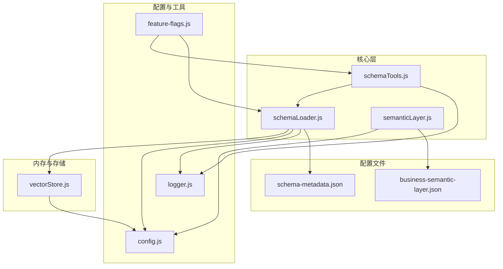
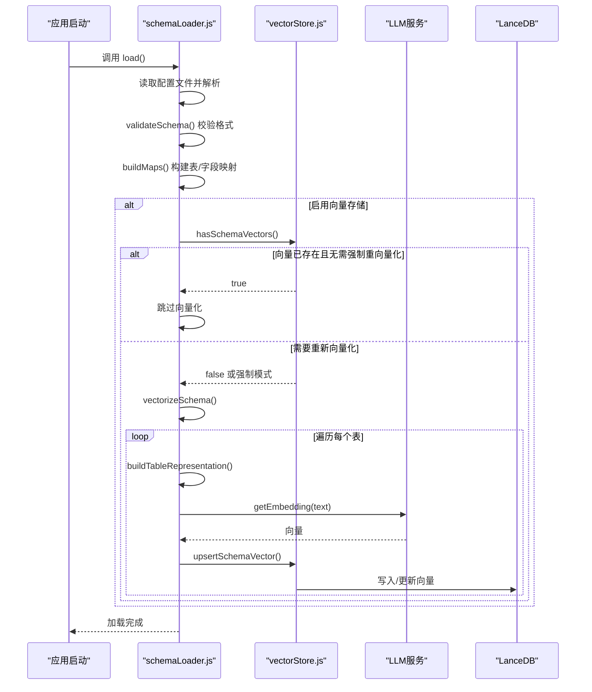
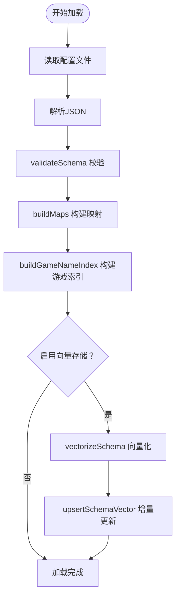
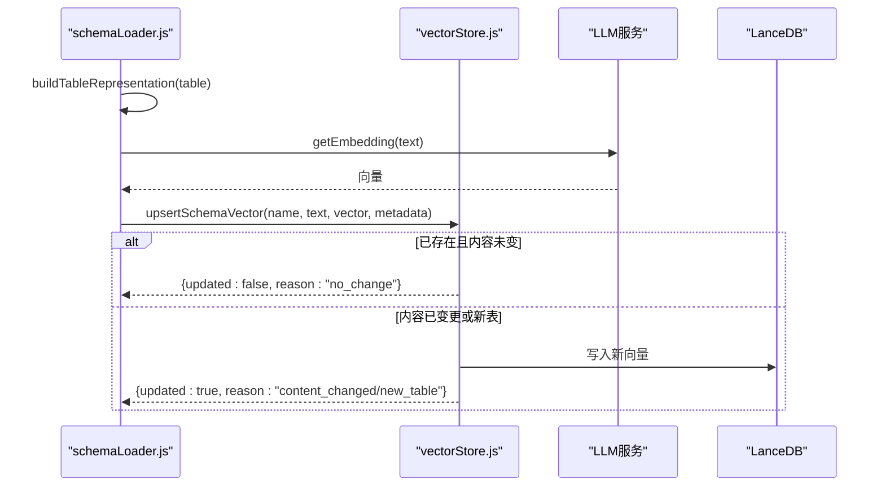
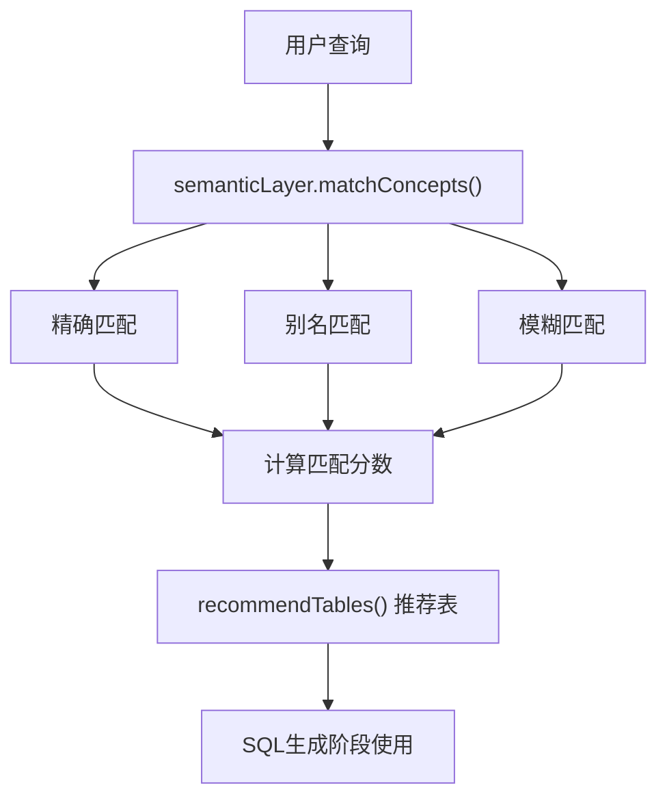
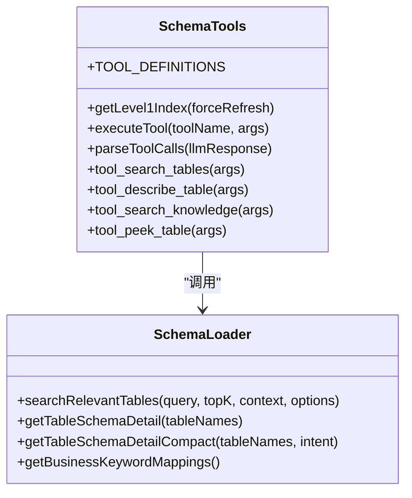
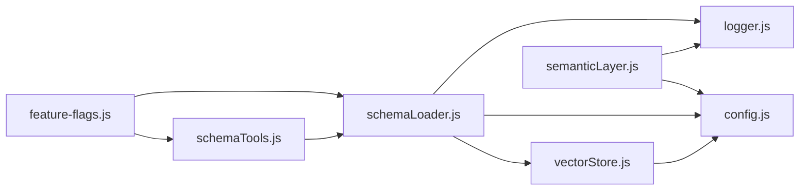

# Schema 管理系统

<cite>
**本文档引用的文件**
- [schemaLoader.js](file://backend/src/core/schemaLoader.js)
- [vectorStore.js](file://backend/src/memory/vectorStore.js)
- [schema-metadata.json](file://backend/config/schema-metadata.json)
- [business-semantic-layer.json](file://backend/config/business-semantic-layer.json)
- [config.js](file://backend/src/core/config.js)
- [feature-flags.js](file://backend/config/feature-flags.js)
- [logger.js](file://backend/src/utils/logger.js)
- [schemaTools.js](file://backend/src/core/schemaTools.js)
- [semanticLayer.js](file://backend/src/core/semanticLayer.js)
- [package.json](file://backend/package.json)
</cite>

## 目录
1. [简介](#简介)
2. [项目结构](#项目结构)
3. [核心组件](#核心组件)
4. [架构概览](#架构概览)
5. [详细组件分析](#详细组件分析)
6. [依赖关系分析](#依赖关系分析)
7. [性能考量](#性能考量)
8. [故障排查指南](#故障排查指南)
9. [结论](#结论)
10. [附录](#附录)

## 简介
本技术文档围绕 NL2SQL Schema 管理系统，深入解析 Schema 元数据的定义格式、加载机制与向量化处理流程。重点阐述 schemaLoader.js 的工作原理，包括元数据解析、结构验证、向量生成与存储过程；详解业务语义层映射机制如何将业务术语转换为物理表字段；提供 Schema 配置的最佳实践；说明 Schema 变更的处理流程与向量索引更新机制，并给出系统的扩展性设计与性能优化策略。

## 项目结构
NL2SQL 后端采用模块化分层架构，Schema 管理位于核心层，与向量存储、配置管理、日志系统协同工作。关键目录与文件如下：
- 核心模块：src/core 下的 schemaLoader.js、schemaTools.js、semanticLayer.js 等
- 向量存储：src/memory/vectorStore.js，基于 LanceDB 实现
- 配置管理：src/core/config.js，集中管理各模块配置
- 业务语义层：config/business-semantic-layer.json
- Schema 元数据：config/schema-metadata.json（示例：config/schema-metadata.example.json）

**图表来源**
- [schemaLoader.js:1-1261](file://backend/src/core/schemaLoader.js#L1-1261)
- [vectorStore.js:1-928](file://backend/src/memory/vectorStore.js#L1-928)
- [schemaTools.js:1-632](file://backend/src/core/schemaTools.js#L1-632)
- [semanticLayer.js:1-190](file://backend/src/core/semanticLayer.js#L1-190)
- [config.js:1-439](file://backend/src/core/config.js#L1-439)
- [feature-flags.js:1-294](file://backend/config/feature-flags.js#L1-294)
- [schema-metadata.json:1-800](file://backend/config/schema-metadata.json#L1-800)
- [business-semantic-layer.json:1-189](file://backend/config/business-semantic-layer.json#L1-189)

**章节来源**
- [schemaLoader.js:1-1261](file://backend/src/core/schemaLoader.js#L1-L1261)
- [vectorStore.js:1-928](file://backend/src/memory/vectorStore.js#L1-L928)
- [schemaTools.js:1-632](file://backend/src/core/schemaTools.js#L1-L632)
- [semanticLayer.js:1-190](file://backend/src/core/semanticLayer.js#L1-L190)
- [config.js:1-439](file://backend/src/core/config.js#L1-L439)
- [feature-flags.js:1-294](file://backend/config/feature-flags.js#L1-L294)
- [schema-metadata.json:1-800](file://backend/config/schema-metadata.json#L1-L800)
- [business-semantic-layer.json:1-189](file://backend/config/business-semantic-layer.json#L1-L189)

## 核心组件
- Schema 元数据加载与验证：schemaLoader.js 负责从 JSON 配置文件加载表结构、字段、关系、指标与维度，进行格式校验与映射构建，并支持缓存与重新加载。
- 向量存储与检索：vectorStore.js 基于 LanceDB 提供向量表的初始化、增删改查、智能搜索与统计信息查询。
- 业务语义层：semanticLayer.js 将业务概念映射到物理表/字段，支持别名识别与模糊匹配。
- 工具化 Schema 探索：schemaTools.js 提供 search_tables、describe_table、search_knowledge、peek_table 等工具，支持按需索取 Schema 信息。
- 配置与功能开关：config.js 集中管理 LLM、嵌入、数据库、安全、日志、Schema、长期记忆等配置；feature-flags.js 提供渐进式功能开关。

**章节来源**
- [schemaLoader.js:1-1261](file://backend/src/core/schemaLoader.js#L1-L1261)
- [vectorStore.js:1-928](file://backend/src/memory/vectorStore.js#L1-L928)
- [semanticLayer.js:1-190](file://backend/src/core/semanticLayer.js#L1-L190)
- [schemaTools.js:1-632](file://backend/src/core/schemaTools.js#L1-L632)
- [config.js:1-439](file://backend/src/core/config.js#L1-L439)
- [feature-flags.js:1-294](file://backend/config/feature-flags.js#L1-L294)

## 架构概览
Schema 管理系统通过 schemaLoader.js 作为入口，完成元数据加载与验证后，将表级表征文本经 LLM 生成向量，存储到 LanceDB 的 schema_vectors 表中。查询时，系统结合业务语义层与向量检索，提供智能表候选排序与过滤，最终驱动 SQL 生成。

**图表来源**
- [schemaLoader.js:75-131](file://backend/src/core/schemaLoader.js#L75-L131)
- [schemaLoader.js:210-285](file://backend/src/core/schemaLoader.js#L210-L285)
- [vectorStore.js:750-780](file://backend/src/memory/vectorStore.js#L750-L780)
- [vectorStore.js:846-899](file://backend/src/memory/vectorStore.js#L846-L899)

**章节来源**
- [schemaLoader.js:75-131](file://backend/src/core/schemaLoader.js#L75-L131)
- [schemaLoader.js:210-285](file://backend/src/core/schemaLoader.js#L210-L285)
- [vectorStore.js:750-780](file://backend/src/memory/vectorStore.js#L750-L780)
- [vectorStore.js:846-899](file://backend/src/memory/vectorStore.js#L846-L899)

## 详细组件分析

### Schema 元数据定义与加载机制
- 元数据格式：包含版本、表定义、字段、关系、指标与维度等。示例配置文件展示了标准字段类型、主键、外键、时间粒度、聚合函数等定义。
- 加载流程：读取配置文件 -> JSON 解析 -> validateSchema 校验 -> 构建 tableMap 与 fieldMap -> 构建动态游戏名索引 -> 可选向量化。
- 缓存与重新加载：维护 cacheTimestamp，支持 isCacheExpired 与 reload 接口，便于 Schema 变更后的热更新。
- 安全校验：validateSQL 对禁止关键字与白名单表进行检查，保障查询安全。

**图表来源**
- [schemaLoader.js:75-131](file://backend/src/core/schemaLoader.js#L75-L131)
- [schemaLoader.js:140-164](file://backend/src/core/schemaLoader.js#L140-L164)
- [schemaLoader.js:170-198](file://backend/src/core/schemaLoader.js#L170-L198)
- [schemaLoader.js:210-285](file://backend/src/core/schemaLoader.js#L210-L285)
- [schemaLoader.js:1173-1223](file://backend/src/core/schemaLoader.js#L1173-L1223)

**章节来源**
- [schema-metadata.json:1-328](file://backend/config/schema-metadata.example.json#L1-L328)
- [schemaLoader.js:75-131](file://backend/src/core/schemaLoader.js#L75-L131)
- [schemaLoader.js:140-164](file://backend/src/core/schemaLoader.js#L140-L164)
- [schemaLoader.js:170-198](file://backend/src/core/schemaLoader.js#L170-L198)
- [schemaLoader.js:1173-1223](file://backend/src/core/schemaLoader.js#L1173-L1223)

### 向量化处理流程与存储
- 表级表征：将每个表的核心业务含义浓缩为文本，包含域标签、类型、功能描述与强动作特征词，减少向量噪声。
- 增量更新：基于内容哈希判断是否变更，避免重复 Embedding 调用；支持软删除标记与覆盖写入。
- 智能搜索：结合查询意图识别与元数据标签过滤，提供优先级重排序，提升检索质量。
- 统计与监控：提供 hasSchemaVectors、clearSchemaVectors、getStats 等能力，便于运维与容量规划。

**图表来源**
- [schemaLoader.js:240-285](file://backend/src/core/schemaLoader.js#L240-L285)
- [vectorStore.js:846-899](file://backend/src/memory/vectorStore.js#L846-L899)

**章节来源**
- [schemaLoader.js:240-285](file://backend/src/core/schemaLoader.js#L240-L285)
- [schemaLoader.js:300-340](file://backend/src/core/schemaLoader.js#L300-L340)
- [schemaLoader.js:351-431](file://backend/src/core/schemaLoader.js#L351-L431)
- [vectorStore.js:846-899](file://backend/src/memory/vectorStore.js#L846-L899)

### 业务语义层映射机制
- 概念定义：business-semantic-layer.json 定义业务概念、别名、映射规则与优先级，涵盖平台、充值、注册、登录、聊天、创角、留存、等级等。
- 匹配策略：支持精确匹配、别名匹配与模糊匹配，按分数排序返回匹配结果。
- 与 SQL 生成集成：在 SQL 生成阶段，语义层推荐表与数据源，辅助 LLM 理解业务术语与物理表字段的对应关系。

**图表来源**
- [semanticLayer.js:140-167](file://backend/src/core/semanticLayer.js#L140-L167)
- [semanticLayer.js:177-190](file://backend/src/core/semanticLayer.js#L177-L190)
- [business-semantic-layer.json:1-189](file://backend/config/business-semantic-layer.json#L1-L189)

**章节来源**
- [semanticLayer.js:140-167](file://backend/src/core/semanticLayer.js#L140-L167)
- [semanticLayer.js:177-190](file://backend/src/core/semanticLayer.js#L177-L190)
- [business-semantic-layer.json:1-189](file://backend/config/business-semantic-layer.json#L1-L189)

### Schema 工具层与按需探索
- 工具定义：search_tables、describe_table、search_knowledge、peek_table，满足“按需索取”的 Schema 探索。
- 索引缓存：Level 1 索引（表名+业务注释）带缓存，支持强制刷新与过期时间控制。
- 与 schemaLoader 协作：工具调用最终委托给 schemaLoader 的搜索与描述接口，保证一致性。

**图表来源**
- [schemaTools.js:40-124](file://backend/src/core/schemaTools.js#L40-L124)
- [schemaTools.js:154-173](file://backend/src/core/schemaTools.js#L154-L173)
- [schemaTools.js:225-256](file://backend/src/core/schemaTools.js#L225-L256)
- [schemaTools.js:266-306](file://backend/src/core/schemaTools.js#L266-L306)
- [schemaTools.js:315-337](file://backend/src/core/schemaTools.js#L315-L337)
- [schemaTools.js:348-393](file://backend/src/core/schemaTools.js#L348-L393)
- [schemaLoader.js:571-679](file://backend/src/core/schemaLoader.js#L571-L679)
- [schemaLoader.js:816-851](file://backend/src/core/schemaLoader.js#L816-L851)
- [schemaLoader.js:864-929](file://backend/src/core/schemaLoader.js#L864-L929)
- [schemaLoader.js:1002-1059](file://backend/src/core/schemaLoader.js#L1002-L1059)

**章节来源**
- [schemaTools.js:40-124](file://backend/src/core/schemaTools.js#L40-L124)
- [schemaTools.js:154-173](file://backend/src/core/schemaTools.js#L154-L173)
- [schemaTools.js:225-256](file://backend/src/core/schemaTools.js#L225-L256)
- [schemaTools.js:266-306](file://backend/src/core/schemaTools.js#L266-L306)
- [schemaTools.js:315-337](file://backend/src/core/schemaTools.js#L315-L337)
- [schemaTools.js:348-393](file://backend/src/core/schemaTools.js#L348-L393)
- [schemaLoader.js:571-679](file://backend/src/core/schemaLoader.js#L571-L679)
- [schemaLoader.js:816-851](file://backend/src/core/schemaLoader.js#L816-L851)
- [schemaLoader.js:864-929](file://backend/src/core/schemaLoader.js#L864-L929)
- [schemaLoader.js:1002-1059](file://backend/src/core/schemaLoader.js#L1002-L1059)

### Schema 变更处理与向量索引更新
- 变更检测：通过内容哈希（contentHash）判断表级表征是否发生变化，仅对变更内容进行更新。
- 增量更新：upsertSchemaVector 支持“软删除”标记与覆盖写入，避免全量重建带来的开销。
- 强制重向量化：通过配置项 SCHEMA_REVECTORIZE 控制是否强制重新生成向量，清空后覆盖写入。
- 缓存失效：reload 接口清除缓存并重新加载，确保变更立即生效。

**章节来源**
- [schemaLoader.js:1173-1223](file://backend/src/core/schemaLoader.js#L1173-L1223)
- [vectorStore.js:846-899](file://backend/src/memory/vectorStore.js#L846-L899)
- [config.js:281-291](file://backend/src/core/config.js#L281-L291)

## 依赖关系分析
- 模块耦合：schemaLoader 依赖 vectorStore、llmService、logger、config；schemaTools 依赖 schemaLoader；semanticLayer 依赖 config 与 logger。
- 外部依赖：LanceDB（vectordb）、LLM API、MySQL/SQLite 等数据库驱动。
- 功能开关：feature-flags.js 控制业务语义层、工具化探索、统一表候选排序等功能的启用与回滚。

**图表来源**
- [schemaLoader.js:15-26](file://backend/src/core/schemaLoader.js#L15-L26)
- [schemaTools.js:17-19](file://backend/src/core/schemaTools.js#L17-L19)
- [semanticLayer.js:14-17](file://backend/src/core/semanticLayer.js#L14-L17)
- [vectorStore.js:14-25](file://backend/src/memory/vectorStore.js#L14-L25)
- [feature-flags.js:16-141](file://backend/config/feature-flags.js#L16-L141)

**章节来源**
- [schemaLoader.js:15-26](file://backend/src/core/schemaLoader.js#L15-L26)
- [schemaTools.js:17-19](file://backend/src/core/schemaTools.js#L17-L19)
- [semanticLayer.js:14-17](file://backend/src/core/semanticLayer.js#L14-L17)
- [vectorStore.js:14-25](file://backend/src/memory/vectorStore.js#L14-L25)
- [feature-flags.js:16-141](file://backend/config/feature-flags.js#L16-L141)

## 性能考量
- 向量检索优化：使用智能搜索与元数据标签过滤，结合优先级重排序，减少无关表干扰。
- 增量更新：基于内容哈希避免重复 Embedding，显著降低向量化成本。
- 缓存策略：Level 1 索引与 Schema 缓存，支持过期时间控制与强制刷新。
- 资源限制：配置嵌入维度、查询超时、最大行数等，防止资源耗尽。
- 功能开关：通过 feature-flags.js 渐进式启用新功能，便于性能评估与回滚。

**章节来源**
- [vectorStore.js:454-578](file://backend/src/memory/vectorStore.js#L454-L578)
- [vectorStore.js:846-899](file://backend/src/memory/vectorStore.js#L846-L899)
- [schemaTools.js:154-173](file://backend/src/core/schemaTools.js#L154-L173)
- [config.js:84-94](file://backend/src/core/config.js#L84-L94)
- [config.js:128-143](file://backend/src/core/config.js#L128-L143)
- [feature-flags.js:16-141](file://backend/config/feature-flags.js#L16-L141)

## 故障排查指南
- 向量数据库未初始化：检查 VECTOR_DB_PATH 与 LanceDB 安装，确认 initialize() 成功。
- Schema 向量缺失：确认 SCHEMA_REVECTORIZE 配置与 hasSchemaVectors() 返回值，必要时强制重向量化。
- LLM API 错误：检查 LLM_API_BASE、LLM_API_KEY、LLM_MODEL 与超时配置。
- 查询安全拦截：核对 forbiddenKeywords 与 allowedTables 白名单，避免误判。
- 日志追踪：使用 logger 的 trace、debug、info、warn、error 级别输出，结合 trace 上下文定位问题。

**章节来源**
- [vectorStore.js:235-265](file://backend/src/memory/vectorStore.js#L235-L265)
- [vectorStore.js:750-780](file://backend/src/memory/vectorStore.js#L750-L780)
- [config.js:64-94](file://backend/src/core/config.js#L64-L94)
- [config.js:153-211](file://backend/src/core/config.js#L153-L211)
- [logger.js:276-322](file://backend/src/utils/logger.js#L276-L322)
- [logger.js:352-448](file://backend/src/utils/logger.js#L352-L448)

## 结论
NL2SQL Schema 管理系统通过结构化的元数据定义、严格的加载与验证流程、高效的向量化与检索机制，以及业务语义层的深度融合，实现了从自然语言到 SQL 的高质量转换。系统具备良好的扩展性与性能表现，可通过功能开关与增量更新策略灵活演进。

## 附录

### Schema 配置最佳实践
- 字段定义：明确字段类型、主键、外键、时间粒度与聚合函数，提升检索与生成准确性。
- 关系映射：清晰标注表间关系，便于 JOIN 推断与表候选排序。
- 业务关键词：在表描述与字段描述中融入业务关键词，增强语义层匹配效果。
- 数据源标识：为不同数据库与平台设置明确的前缀与映射，便于智能过滤与路由。

**章节来源**
- [schema-metadata.json:1-800](file://backend/config/schema-metadata.json#L1-L800)
- [business-semantic-layer.json:1-189](file://backend/config/business-semantic-layer.json#L1-L189)

### 功能开关与 Phase 切换
- 通过 feature-flags.js 控制各 Phase 的功能启用，支持紧急回滚与渐进式上线。
- 常用开关：TOOL_AUGMENTED_SCHEMA、SCHEMA_LAYERED_LOADING、BUSINESS_SEMANTIC_LAYER、UNIFIED_RANKER 等。

**章节来源**
- [feature-flags.js:16-141](file://backend/config/feature-flags.js#L16-L141)