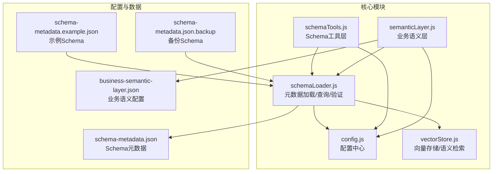
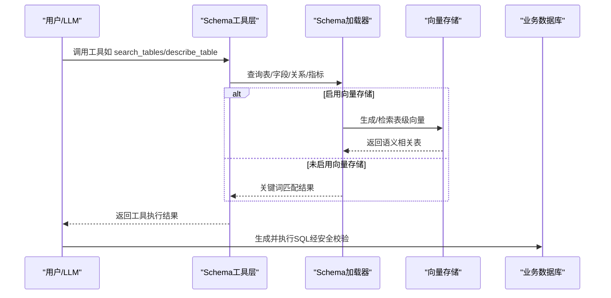
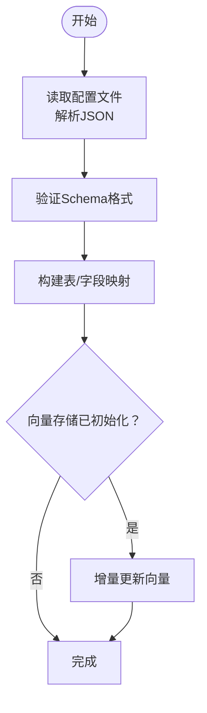
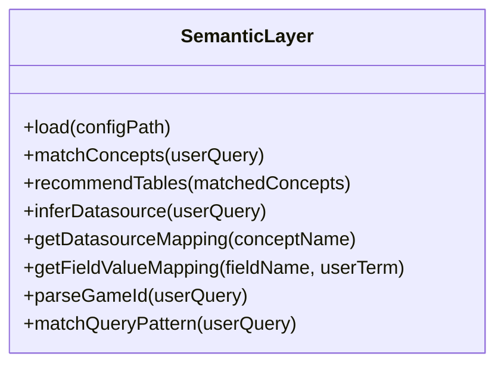
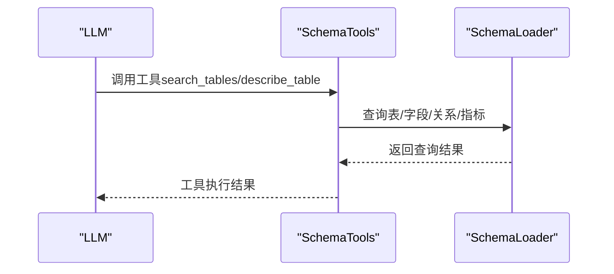
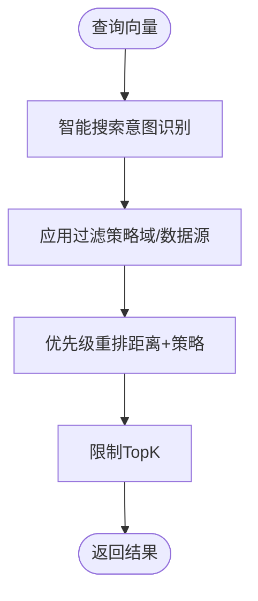
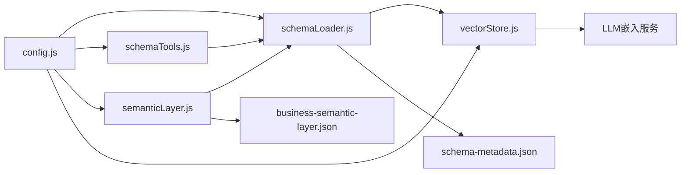

# Schema管理

<cite>
**本文引用的文件**
- [schemaLoader.js](file://backend/src/core/schemaLoader.js)
- [schemaTools.js](file://backend/src/core/schemaTools.js)
- [semanticLayer.js](file://backend/src/core/semanticLayer.js)
- [config.js](file://backend/src/core/config.js)
- [vectorStore.js](file://backend/src/memory/vectorStore.js)
- [business-semantic-layer.json](file://backend/config/business-semantic-layer.json)
- [schema-metadata.example.json](file://backend/config/schema-metadata.example.json)
- [schema-metadata.json](file://backend/config/schema-metadata.json)
- [schema-metadata.json.backup](file://backend/config/schema-metadata.json.backup)
</cite>

## 目录
1. [简介](#简介)
2. [项目结构](#项目结构)
3. [核心组件](#核心组件)
4. [架构总览](#架构总览)
5. [详细组件分析](#详细组件分析)
6. [依赖关系分析](#依赖关系分析)
7. [性能考量](#性能考量)
8. [故障排查指南](#故障排查指南)
9. [结论](#结论)
10. [附录](#附录)

## 简介
本技术文档围绕 NL2SQL Schema 管理系统，系统性阐述元数据配置体系、业务语义层设计、动态 Schema 加载与增量更新策略、Schema 工具函数能力与使用方法、业务语义映射与数据类型转换规则、Schema 验证与版本管理、兼容性处理，以及最佳实践与常见问题解决方案。目标是为数据库管理员与开发者提供实用、可操作的指导。

## 项目结构
Schema 管理系统主要由以下模块构成：
- 元数据加载与查询：schemaLoader.js
- 业务语义层：semanticLayer.js
- Schema 工具层（面向 LLM 的工具集）：schemaTools.js
- 向量存储与语义检索：vectorStore.js
- 配置中心：config.js
- 配置文件：business-semantic-layer.json、schema-metadata.example.json、schema-metadata.json、schema-metadata.json.backup

图表来源
- [schemaLoader.js:1-1172](file://backend/src/core/schemaLoader.js#L1-1172)
- [schemaTools.js:1-632](file://backend/src/core/schemaTools.js#L1-632)
- [semanticLayer.js:1-532](file://backend/src/core/semanticLayer.js#L1-532)
- [config.js:1-398](file://backend/src/core/config.js#L1-398)
- [vectorStore.js:1-881](file://backend/src/memory/vectorStore.js#L1-881)
- [business-semantic-layer.json:1-189](file://backend/config/business-semantic-layer.json#L1-189)
- [schema-metadata.example.json:1-328](file://backend/config/schema-metadata.example.json#L1-328)
- [schema-metadata.json:1-800](file://backend/config/schema-metadata.json#L1-800)
- [schema-metadata.json.backup:1-800](file://backend/config/schema-metadata.json.backup#L1-800)

章节来源
- [schemaLoader.js:1-1172](file://backend/src/core/schemaLoader.js#L1-1172)
- [schemaTools.js:1-632](file://backend/src/core/schemaTools.js#L1-632)
- [semanticLayer.js:1-532](file://backend/src/core/semanticLayer.js#L1-532)
- [config.js:1-398](file://backend/src/core/config.js#L1-398)
- [vectorStore.js:1-881](file://backend/src/memory/vectorStore.js#L1-881)
- [business-semantic-layer.json:1-189](file://backend/config/business-semantic-layer.json#L1-189)
- [schema-metadata.example.json:1-328](file://backend/config/schema-metadata.example.json#L1-328)
- [schema-metadata.json:1-800](file://backend/config/schema-metadata.json#L1-800)
- [schema-metadata.json.backup:1-800](file://backend/config/schema-metadata.json.backup#L1-800)

## 核心组件
- 元数据加载与查询（schemaLoader）
  - 负责从 JSON 配置文件加载表结构、字段、关系、指标、维度等元数据，构建查询映射，提供表/字段/关系/指标/维度的查询接口，并支持 SQL 安全性校验与 Schema 摘要输出。
  - 支持缓存与过期控制，支持基于向量的语义搜索与增量更新。
- 业务语义层（semanticLayer）
  - 将自然语言中的业务概念（如“老平台”、“充值”、“累计充值”等）映射到物理表/字段，支持别名识别、模糊匹配、查询模式匹配、数据源映射与字段值映射。
- Schema 工具层（schemaTools）
  - 面向 LLM 的工具集合，提供 search_tables、describe_table、search_knowledge、peek_table 等工具，支持 Level 1 索引缓存与业务知识库查询。
- 向量存储（vectorStore）
  - 基于 LanceDB 的向量存储与语义检索，支持 Schema 向量的增量更新、智能搜索与查询历史向量管理。
- 配置中心（config）
  - 统一管理 LLM、嵌入模型、数据库、向量库、安全策略、Schema 缓存、长期记忆、上下文管理等配置项。

章节来源
- [schemaLoader.js:1-1172](file://backend/src/core/schemaLoader.js#L1-1172)
- [semanticLayer.js:1-532](file://backend/src/core/semanticLayer.js#L1-532)
- [schemaTools.js:1-632](file://backend/src/core/schemaTools.js#L1-632)
- [vectorStore.js:1-881](file://backend/src/memory/vectorStore.js#L1-881)
- [config.js:1-398](file://backend/src/core/config.js#L1-398)

## 架构总览
Schema 管理系统采用“配置驱动 + 向量增强 + 语义层”的架构：
- 配置驱动：通过 schema-metadata.json 与 business-semantic-layer.json 提供结构化元数据与业务语义映射。
- 向量增强：将表级描述向量化，结合智能搜索与过滤策略，提升表推荐质量。
- 语义层：将自然语言业务概念映射到物理表/字段，辅助表推荐与查询意图识别。
- 工具层：为 LLM 提供按需索取的 Schema 探索工具，减少一次性全量传输带来的成本与风险。

图表来源
- [schemaTools.js:217-393](file://backend/src/core/schemaTools.js#L217-393)
- [schemaLoader.js:562-709](file://backend/src/core/schemaLoader.js#L562-709)
- [vectorStore.js:452-537](file://backend/src/memory/vectorStore.js#L452-537)

章节来源
- [schemaTools.js:1-632](file://backend/src/core/schemaTools.js#L1-632)
- [schemaLoader.js:1-1172](file://backend/src/core/schemaLoader.js#L1-1172)
- [vectorStore.js:1-881](file://backend/src/memory/vectorStore.js#L1-881)

## 详细组件分析

### 元数据加载与查询（schemaLoader）
- 加载与验证
  - 从配置路径读取 JSON 元数据，校验 tables、fields 等关键字段，构建 tableMap 与 fieldMap 快速映射。
  - 支持缓存时间戳与过期控制，支持重新加载。
- 表/字段/关系/指标/维度查询
  - 提供 getAllTables、getTable、getField、getTableFields、getAllMetrics、getMetric、getAllDimensions、getRelationship、getRelatedTables 等查询接口。
- 语义搜索与匹配
  - 支持基于向量的智能搜索（searchRelevantTables），结合上下文（game_id、datasource）增强查询文本，优先匹配平台类型与数据源。
  - 关键词匹配（keywordMatchTables）作为回退策略。
- SQL 安全校验
  - validateSQL 检查禁止关键字与白名单表，保障查询安全。
- Schema 输出与摘要
  - getSchemaSummary 与 getTableSchemaDetail/Compact 输出结构化摘要，支持精简版输出。
- 向量化与增量更新
  - vectorizeSchema 将表级描述向量化，使用 upsertSchemaVector 实现增量更新，避免重复 Embedding 调用。
  - buildTableRepresentation 与 extractKeyFeatures 构建表级表征文本，包含域标签、数据源类型、核心特征词等。

图表来源
- [schemaLoader.js:69-122](file://backend/src/core/schemaLoader.js#L69-122)
- [schemaLoader.js:201-276](file://backend/src/core/schemaLoader.js#L201-276)
- [schemaLoader.js:799-800](file://backend/src/core/schemaLoader.js#L799-800)

章节来源
- [schemaLoader.js:1-1172](file://backend/src/core/schemaLoader.js#L1-1172)
- [vectorStore.js:799-800](file://backend/src/memory/vectorStore.js#L799-800)

### 业务语义层（semanticLayer）
- 配置加载
  - 支持从 business-semantic-layer.json 加载配置，若文件不存在则加载内置兜底配置。
- 概念匹配
  - matchConcepts 支持精确匹配、别名匹配、模糊匹配，返回匹配到的概念及其分数与匹配类型。
- 表推荐
  - recommendTables 基于匹配到的概念推荐表，综合优先级与分数排序。
- 数据源映射与字段值映射
  - getDatasourceMapping 与 getFieldValueMapping 支持从概念到数据源与字段值的映射。
- 查询模式匹配
  - matchQueryPattern 支持基于必要/可选概念的查询模式识别。

图表来源
- [semanticLayer.js:1-532](file://backend/src/core/semanticLayer.js#L1-532)
- [business-semantic-layer.json:1-189](file://backend/config/business-semantic-layer.json#L1-189)

章节来源
- [semanticLayer.js:1-532](file://backend/src/core/semanticLayer.js#L1-532)
- [business-semantic-layer.json:1-189](file://backend/config/business-semantic-layer.json#L1-189)

### Schema 工具层（schemaTools）
- 工具定义
  - TOOL_DEFINITIONS 定义 search_tables、describe_table、search_knowledge、peek_table 四类工具，参数与用途清晰。
- Level 1 索引缓存
  - getLevel1Index 缓存仅包含表名与业务注释的极简索引，支持过期控制。
- 工具实现
  - tool_search_tables：基于 schemaLoader.searchRelevantTables 返回表列表。
  - tool_describe_table：返回表详情（支持精简版）。
  - tool_search_knowledge：查询业务知识库并进行概念匹配。
  - tool_peek_table：返回字段结构预览（安全考虑，不返回实际数据）。
- 业务知识库
  - 内置知识库涵盖平台、充值、注册、登录、聊天、创角等概念，支持别名与模糊匹配。
- 工具调度与解析
  - executeTool 与 parseToolCalls 支持工具调用执行与响应解析。

图表来源
- [schemaTools.js:217-393](file://backend/src/core/schemaTools.js#L217-393)
- [schemaLoader.js:562-709](file://backend/src/core/schemaLoader.js#L562-709)

章节来源
- [schemaTools.js:1-632](file://backend/src/core/schemaTools.js#L1-632)

### 向量存储与语义检索（vectorStore）
- 初始化与表管理
  - initialize 连接 LanceDB，初始化 schema_vectors 与 query_vectors 表。
- Schema 向量操作
  - addSchemaVectors、searchSchema、searchSchemaSmart 支持向量添加、基础搜索与智能搜索。
  - smart 搜索根据查询意图识别（如游戏名）进行优先级重排，降低报表表优先级。
- 增量更新与清理
  - upsertSchemaVector 基于内容哈希判断是否更新，避免重复 Embedding。
  - findSchemaByTableName 与 markSchemaAsDeleted 提供查找与软删除能力。
- 元数据增强
  - buildEnhancedMetadata 为查询向量增强元数据，包含重要性评分、查询类型、复杂度、执行信息等。

图表来源
- [vectorStore.js:452-537](file://backend/src/memory/vectorStore.js#L452-537)
- [vectorStore.js:799-800](file://backend/src/memory/vectorStore.js#L799-800)

章节来源
- [vectorStore.js:1-881](file://backend/src/memory/vectorStore.js#L1-881)

### 配置中心（config）
- 统一配置
  - 集中管理 LLM API、嵌入模型、数据库、向量库、安全策略、Schema 缓存、长期记忆、上下文管理等配置项。
- 安全与性能
  - 安全配置包含禁止关键字、白名单表、最大返回行数、查询超时、敏感字段脱敏等。
  - 性能配置包括缓存过期时间、向量维度、超时与重试等。
- Schema 配置
  - schema.configPath、enableCache、cacheExpireTime、revectorize 控制 Schema 加载与向量化策略。

章节来源
- [config.js:1-398](file://backend/src/core/config.js#L1-398)

## 依赖关系分析
- 模块耦合
  - schemaLoader 依赖 config、logger、llmService、vectorStore；提供查询接口给 schemaTools 与 semanticLayer。
  - schemaTools 依赖 schemaLoader 与 config；通过工具接口为 LLM 提供按需 Schema 信息。
  - semanticLayer 依赖 config 与本地配置文件 business-semantic-layer.json；与 schemaLoader 协作进行表推荐与映射。
  - vectorStore 依赖 config 与 LLM 嵌入服务；为 schemaLoader 与 query history 提供向量能力。
- 外部依赖
  - LanceDB（vectordb）用于向量存储与检索。
  - LLM API 用于生成 Embedding 与对话推理。

图表来源
- [config.js:1-398](file://backend/src/core/config.js#L1-398)
- [schemaLoader.js:1-1172](file://backend/src/core/schemaLoader.js#L1-1172)
- [schemaTools.js:1-632](file://backend/src/core/schemaTools.js#L1-632)
- [semanticLayer.js:1-532](file://backend/src/core/semanticLayer.js#L1-532)
- [vectorStore.js:1-881](file://backend/src/memory/vectorStore.js#L1-881)
- [business-semantic-layer.json:1-189](file://backend/config/business-semantic-layer.json#L1-189)
- [schema-metadata.json:1-800](file://backend/config/schema-metadata.json#L1-800)

章节来源
- [config.js:1-398](file://backend/src/core/config.js#L1-398)
- [schemaLoader.js:1-1172](file://backend/src/core/schemaLoader.js#L1-1172)
- [schemaTools.js:1-632](file://backend/src/core/schemaTools.js#L1-632)
- [semanticLayer.js:1-532](file://backend/src/core/semanticLayer.js#L1-532)
- [vectorStore.js:1-881](file://backend/src/memory/vectorStore.js#L1-881)

## 性能考量
- 缓存策略
  - schemaLoader 支持缓存时间戳与过期控制，避免频繁磁盘读取与解析。
  - schemaTools 的 Level 1 索引缓存支持过期时间控制，降低 LLM 调用成本。
- 向量检索优化
  - 智能搜索（searchSchemaSmart）结合意图识别与过滤策略，减少无关表干扰。
  - 增量更新（upsertSchemaVector）基于内容哈希判断是否更新，避免重复 Embedding。
- 安全与资源控制
  - 安全配置限制最大返回行数与查询超时，防止大查询导致资源耗尽。
  - 向量存储统计接口（getStats）便于监控与容量规划。

## 故障排查指南
- Schema 加载失败
  - 检查配置路径与文件存在性；确认 JSON 格式与必填字段（tables、fields）。
  - 查看日志输出，定位具体错误（如缺少字段、格式不正确）。
- 向量存储不可用
  - 确认 LanceDB 初始化状态；检查数据库目录权限与磁盘空间。
  - 若启用智能搜索失败，系统会回退到关键词匹配，可继续使用。
- LLM 嵌入失败
  - 检查 LLM API 基础配置与超时设置；确认网络连通性与 API Key。
- 安全校验失败
  - 检查 forbiddenKeywords 与 allowedTables 配置；确认 SQL 中未包含禁止关键字或访问未授权表。

章节来源
- [schemaLoader.js:70-122](file://backend/src/core/schemaLoader.js#L70-122)
- [vectorStore.js:233-263](file://backend/src/memory/vectorStore.js#L233-263)
- [config.js:60-87](file://backend/src/core/config.js#L60-87)
- [schemaLoader.js:722-758](file://backend/src/core/schemaLoader.js#L722-758)

## 结论
NL2SQL Schema 管理系统通过“配置驱动 + 向量增强 + 语义层”的设计，实现了元数据的动态加载、语义化表推荐、安全可控的工具化交互与高效的增量更新。该架构既满足了复杂业务场景下的 Schema 管理需求，也为数据库管理员与开发者提供了清晰、可维护、可扩展的技术路径。

## 附录

### Schema 验证与版本管理
- 验证规则
  - 必须包含 tables 数组；每个表必须包含 name 与 fields；每个字段必须包含 name。
- 版本管理
  - 元数据文件包含 version 字段；向量存储提供统计接口，便于版本演进跟踪。
- 兼容性处理
  - 业务语义层支持别名与模糊匹配，提升跨版本/跨命名风格的兼容性。
  - 向量存储提供过滤与重排策略，适配不同数据源与域标签。

章节来源
- [schemaLoader.js:131-155](file://backend/src/core/schemaLoader.js#L131-155)
- [schemaLoader.js:36-51](file://backend/src/core/schemaLoader.js#L36-51)
- [semanticLayer.js:48-73](file://backend/src/core/semanticLayer.js#L48-73)
- [vectorStore.js:655-685](file://backend/src/memory/vectorStore.js#L655-685)

### Schema 工具函数使用方法
- 工具定义
  - search_tables：关键词搜索相关表；describe_table：获取表详情（支持精简版）；search_knowledge：查询业务概念映射；peek_table：查看字段结构预览。
- 使用建议
  - 优先使用工具进行按需索取，减少一次性全量传输。
  - 结合 Level 1 索引与工具链路，逐步细化表结构信息。

章节来源
- [schemaTools.js:40-124](file://backend/src/core/schemaTools.js#L40-124)
- [schemaTools.js:225-393](file://backend/src/core/schemaTools.js#L225-393)

### 业务语义映射与数据类型转换规则
- 业务概念映射
  - “老平台/新平台”映射到数据源标识与平台字段值；“充值/累计充值”映射到主表与聚合字段。
- 字段值映射
  - 如 game_id、platform_type 等字段支持常见值映射与模糊匹配。
- 数据类型转换
  - 字段类型在描述中体现（如 BIGINT、VARCHAR、DATETIME 等），用于提示与校验。

章节来源
- [semanticLayer.js:342-464](file://backend/src/core/semanticLayer.js#L342-464)
- [business-semantic-layer.json:150-187](file://backend/config/business-semantic-layer.json#L150-187)

### 最佳实践
- 配置管理
  - 将 schema-metadata.json 与 business-semantic-layer.json 作为单一事实源，定期备份（schema-metadata.json.backup）。
- 向量化策略
  - 启用增量更新与智能搜索，合理设置 revectorize 与缓存过期时间。
- 安全与性能
  - 配置白名单与禁止关键字；限制最大返回行数与查询超时；监控向量存储统计。
- 工具化交互
  - 使用 schemaTools 的工具链路，结合 Level 1 索引，实现按需索取与高效协作。

章节来源
- [schema-metadata.example.json:1-328](file://backend/config/schema-metadata.example.json#L1-328)
- [schema-metadata.json.backup:1-800](file://backend/config/schema-metadata.json.backup#L1-800)
- [config.js:140-170](file://backend/src/core/config.js#L140-170)
- [schemaTools.js:136-173](file://backend/src/core/schemaTools.js#L136-173)