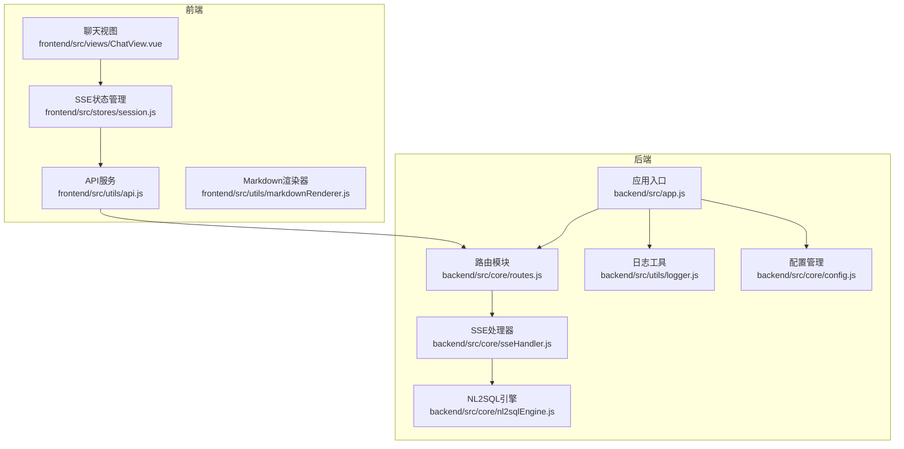
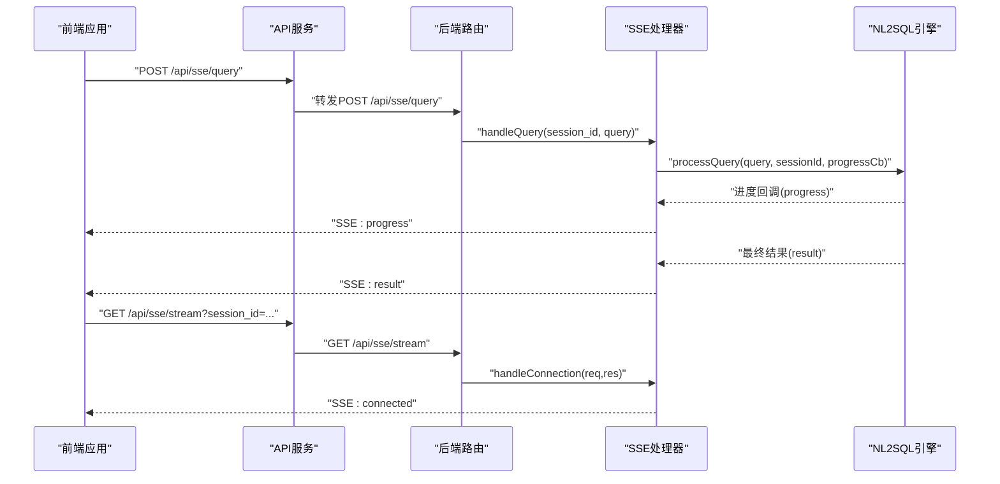
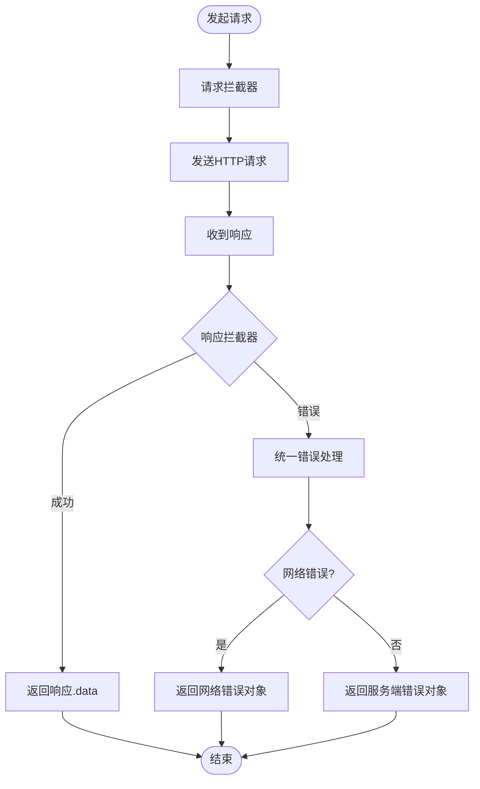
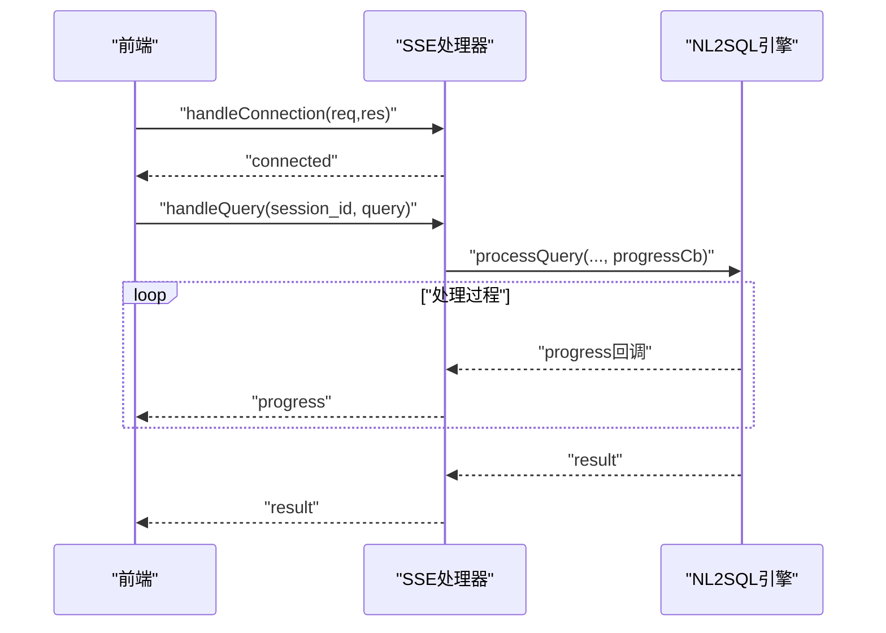
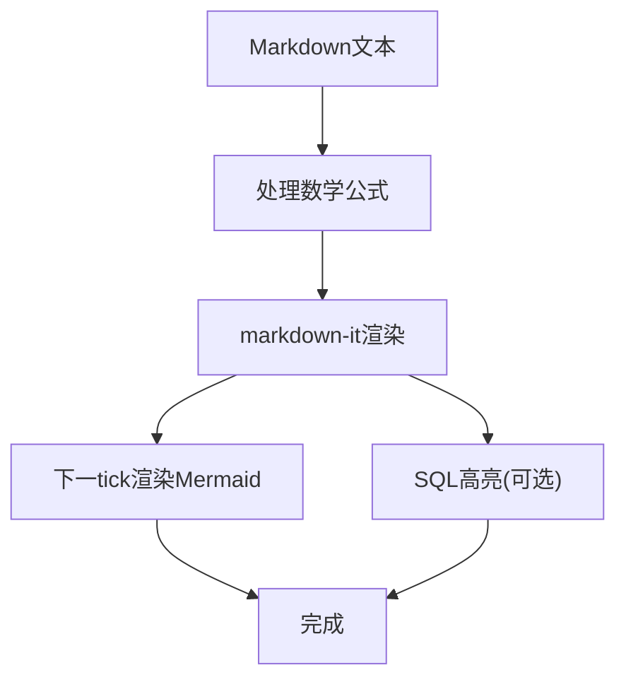
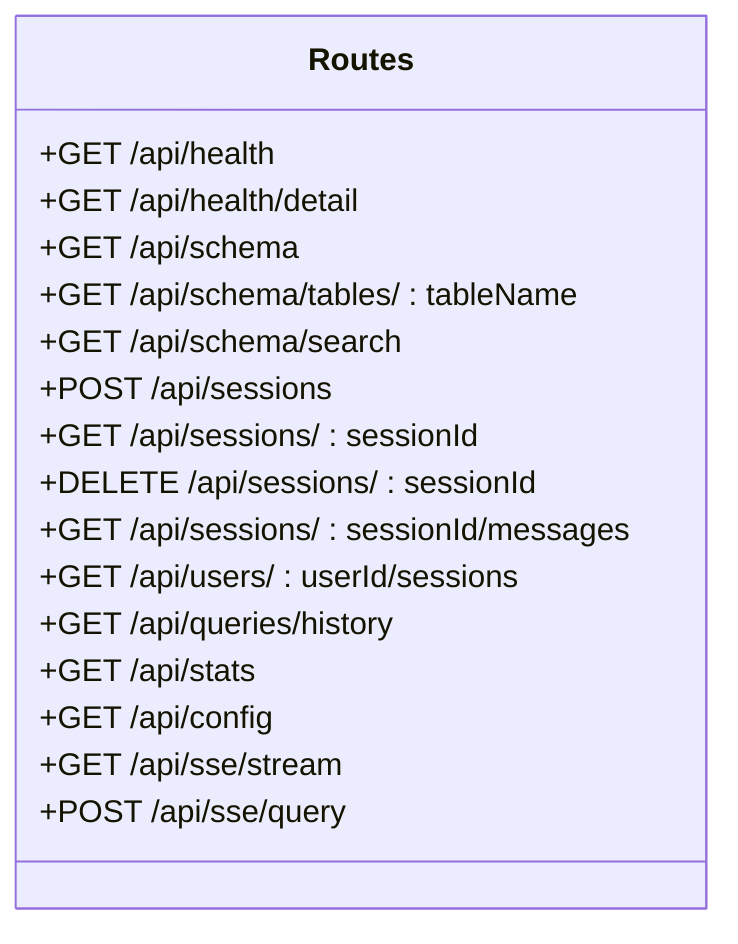
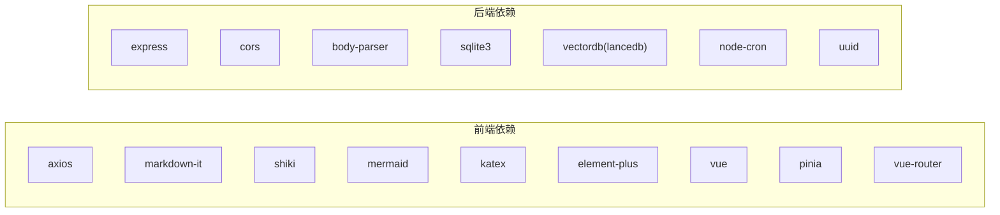

# API集成与通信

<cite>
**本文引用的文件**   
- [frontend/src/utils/api.js](file://frontend/src/utils/api.js)
- [frontend/src/utils/markdownRenderer.js](file://frontend/src/utils/markdownRenderer.js)
- [frontend/src/stores/session.js](file://frontend/src/stores/session.js)
- [frontend/src/views/ChatView.vue](file://frontend/src/views/ChatView.vue)
- [backend/src/app.js](file://backend/src/app.js)
- [backend/src/core/routes.js](file://backend/src/core/routes.js)
- [backend/src/core/sseHandler.js](file://backend/src/core/sseHandler.js)
- [backend/src/core/nl2sqlEngine.js](file://backend/src/core/nl2sqlEngine.js)
- [backend/src/utils/logger.js](file://backend/src/utils/logger.js)
- [backend/src/core/config.js](file://backend/src/core/config.js)
- [backend/config/feature-flags.js](file://backend/config/feature-flags.js)
- [frontend/vite.config.js](file://frontend/vite.config.js)
- [frontend/package.json](file://frontend/package.json)
- [backend/package.json](file://backend/package.json)
</cite>

## 目录
1. [简介](#简介)
2. [项目结构](#项目结构)
3. [核心组件](#核心组件)
4. [架构总览](#架构总览)
5. [详细组件分析](#详细组件分析)
6. [依赖分析](#依赖分析)
7. [性能考虑](#性能考虑)
8. [故障排查指南](#故障排查指南)
9. [结论](#结论)
10. [附录](#附录)

## 简介
本文件面向前端开发者，系统性阐述NL2SQL项目的API集成与通信机制，覆盖后端REST API封装、请求/响应拦截、错误处理与网络异常恢复策略；深入解析SSE（Server-Sent Events）实时通信的实现与连接管理；说明Markdown渲染器的集成与富文本显示能力；并提供API版本管理与向后兼容策略、性能优化与缓存策略、最佳实践与调试技巧，以及跨域与安全通信的实现方案。

## 项目结构
- 前端采用Vue 3 + Pinia + Vue Router，通过Axios封装统一API调用，配合EventSource实现SSE实时通信，并集成markdown-it、Shiki、KaTeX、Mermaid实现富文本渲染。
- 后端基于Express，提供REST API与SSE端点，集中于路由模块与SSE处理器，结合日志与配置模块保障可观测性与可运维性。

**图表来源**
- [frontend/src/utils/api.js:1-303](file://frontend/src/utils/api.js#L1-L303)
- [frontend/src/stores/session.js:1-400](file://frontend/src/stores/session.js#L1-L400)
- [frontend/src/views/ChatView.vue:1-778](file://frontend/src/views/ChatView.vue#L1-L778)
- [frontend/src/utils/markdownRenderer.js:1-258](file://frontend/src/utils/markdownRenderer.js#L1-L258)
- [backend/src/app.js:1-260](file://backend/src/app.js#L1-L260)
- [backend/src/core/routes.js:1-1037](file://backend/src/core/routes.js#L1-L1037)
- [backend/src/core/sseHandler.js:1-349](file://backend/src/core/sseHandler.js#L1-L349)
- [backend/src/core/nl2sqlEngine.js:1-200](file://backend/src/core/nl2sqlEngine.js#L1-L200)
- [backend/src/utils/logger.js:1-442](file://backend/src/utils/logger.js#L1-L442)
- [backend/src/core/config.js:1-398](file://backend/src/core/config.js#L1-L398)

**章节来源**
- [frontend/src/utils/api.js:1-303](file://frontend/src/utils/api.js#L1-L303)
- [frontend/src/stores/session.js:1-400](file://frontend/src/stores/session.js#L1-L400)
- [frontend/src/views/ChatView.vue:1-778](file://frontend/src/views/ChatView.vue#L1-L778)
- [frontend/src/utils/markdownRenderer.js:1-258](file://frontend/src/utils/markdownRenderer.js#L1-L258)
- [backend/src/app.js:1-260](file://backend/src/app.js#L1-L260)
- [backend/src/core/routes.js:1-1037](file://backend/src/core/routes.js#L1-L1037)
- [backend/src/core/sseHandler.js:1-349](file://backend/src/core/sseHandler.js#L1-L349)
- [backend/src/core/nl2sqlEngine.js:1-200](file://backend/src/core/nl2sqlEngine.js#L1-L200)
- [backend/src/utils/logger.js:1-442](file://backend/src/utils/logger.js#L1-L442)
- [backend/src/core/config.js:1-398](file://backend/src/core/config.js#L1-L398)

## 核心组件
- 前端API服务：基于Axios创建实例，统一配置baseURL、超时、请求/响应拦截器，封装REST API方法，暴露健康检查、Schema、会话、查询历史、统计、配置、SSE查询提交等接口。
- SSE状态管理：通过EventSource建立与后端SSE端点的连接，订阅消息类型（connected/processing/progress/result/error），驱动UI状态与消息列表更新。
- Markdown渲染器：集成markdown-it、Shiki、KaTeX、Mermaid，支持代码高亮、数学公式渲染、Mermaid图表渲染与延迟渲染。
- 后端路由与SSE：提供REST API与SSE端点，统一健康检查、Schema查询、会话管理、查询历史、统计、配置等接口；SSE端点负责连接管理、消息广播与进度回调。
- 日志与配置：集中配置管理与日志记录，支持级别控制、文件轮转、追踪上下文，保障可观测性与可维护性。

**章节来源**
- [frontend/src/utils/api.js:25-108](file://frontend/src/utils/api.js#L25-L108)
- [frontend/src/stores/session.js:185-221](file://frontend/src/stores/session.js#L185-L221)
- [frontend/src/utils/markdownRenderer.js:24-100](file://frontend/src/utils/markdownRenderer.js#L24-L100)
- [backend/src/core/routes.js:94-137](file://backend/src/core/routes.js#L94-L137)
- [backend/src/core/sseHandler.js:43-112](file://backend/src/core/sseHandler.js#L43-L112)
- [backend/src/utils/logger.js:54-85](file://backend/src/utils/logger.js#L54-L85)
- [backend/src/core/config.js:16-50](file://backend/src/core/config.js#L16-L50)

## 架构总览
前后端通过HTTP REST API与SSE双向通信。前端通过API服务发起REST请求与SSE查询提交，后端路由模块统一处理请求并调用SSE处理器；SSE处理器通过NL2SQL引擎处理查询，按阶段推送进度与结果，前端Store接收消息并更新UI。

**图表来源**
- [frontend/src/utils/api.js:246-251](file://frontend/src/utils/api.js#L246-L251)
- [backend/src/core/routes.js:972-1002](file://backend/src/core/routes.js#L972-L1002)
- [backend/src/core/sseHandler.js:218-280](file://backend/src/core/sseHandler.js#L218-L280)
- [backend/src/core/nl2sqlEngine.js:1-200](file://backend/src/core/nl2sqlEngine.js#L1-L200)

**章节来源**
- [frontend/src/utils/api.js:246-251](file://frontend/src/utils/api.js#L246-L251)
- [backend/src/core/routes.js:948-1002](file://backend/src/core/routes.js#L948-L1002)
- [backend/src/core/sseHandler.js:218-280](file://backend/src/core/sseHandler.js#L218-L280)
- [backend/src/core/nl2sqlEngine.js:1-200](file://backend/src/core/nl2sqlEngine.js#L1-L200)

## 详细组件分析

### 前端API服务与请求/响应拦截
- Axios实例：baseURL统一为“/api”，超时30秒，统一JSON Content-Type。
- 请求拦截：可扩展添加认证头（当前注释，便于后续启用）。
- 响应拦截：统一返回响应.data；对服务端错误、网络错误、请求配置错误分别处理并返回结构化错误对象。

**图表来源**
- [frontend/src/utils/api.js:25-88](file://frontend/src/utils/api.js#L25-L88)

**章节来源**
- [frontend/src/utils/api.js:25-88](file://frontend/src/utils/api.js#L25-L88)

### SSE实时通信与连接管理
- 建立连接：通过GET /api/sse/stream，携带session_id与可选user_id，后端设置SSE响应头并记录连接信息。
- 连接状态：Map维护sessionId到连接列表，支持多标签页；连接关闭与错误时清理。
- 查询提交：POST /api/sse/query，后端校验参数并异步处理，立即返回“提交成功”提示。
- 消息类型：connected/processing/progress/result/error，前端Store根据类型更新UI状态与消息列表。
- 进度回调：SSE处理器通过NL2SQL引擎的进度回调函数广播progress消息。

**图表来源**
- [backend/src/core/sseHandler.js:43-112](file://backend/src/core/sseHandler.js#L43-L112)
- [backend/src/core/sseHandler.js:218-280](file://backend/src/core/sseHandler.js#L218-L280)
- [backend/src/core/nl2sqlEngine.js:1-200](file://backend/src/core/nl2sqlEngine.js#L1-L200)

**章节来源**
- [backend/src/core/sseHandler.js:26-112](file://backend/src/core/sseHandler.js#L26-L112)
- [backend/src/core/sseHandler.js:197-204](file://backend/src/core/sseHandler.js#L197-L204)
- [backend/src/core/sseHandler.js:218-280](file://backend/src/core/sseHandler.js#L218-L280)

### Markdown渲染器集成与富文本显示
- 渲染流程：先处理行内/块级数学公式，再使用markdown-it渲染，最后延迟渲染Mermaid图表。
- 代码高亮：优先使用Shiki异步初始化，失败时降级为简单HTML转义包裹；SQL高亮专用renderSQL。
- Mermaid/KaTeX：Mermaid初始化严格安全模式，KaTeX渲染失败时降级为错误占位。
- 前端使用：ChatView中将消息内容交给renderMarkdown，SQL代码交给renderSQL，Mermaid图表在渲染后下一tick触发渲染。

**图表来源**
- [frontend/src/utils/markdownRenderer.js:181-196](file://frontend/src/utils/markdownRenderer.js#L181-L196)
- [frontend/src/utils/markdownRenderer.js:203-220](file://frontend/src/utils/markdownRenderer.js#L203-L220)
- [frontend/src/utils/markdownRenderer.js:156-170](file://frontend/src/utils/markdownRenderer.js#L156-L170)

**章节来源**
- [frontend/src/utils/markdownRenderer.js:24-100](file://frontend/src/utils/markdownRenderer.js#L24-L100)
- [frontend/src/utils/markdownRenderer.js:156-196](file://frontend/src/utils/markdownRenderer.js#L156-L196)
- [frontend/src/views/ChatView.vue:265-280](file://frontend/src/views/ChatView.vue#L265-L280)

### 后端REST API路由与SSE端点
- 健康检查：/api/health与/api/health/detail，返回服务状态、版本、运行时间、内存与组件状态。
- Schema接口：/api/schema、/api/schema/tables/:tableName、/api/schema/search。
- 会话管理：/api/sessions、/api/sessions/:sessionId、/api/sessions/:sessionId/messages、/api/users/:userId/sessions。
- 查询历史：/api/queries/history。
- 统计信息：/api/stats。
- 配置接口：/api/config。
- SSE端点：/api/sse/stream（GET，建立SSE连接）、/api/sse/query（POST，提交查询）。

**图表来源**
- [backend/src/core/routes.js:72-137](file://backend/src/core/routes.js#L72-L137)
- [backend/src/core/routes.js:150-250](file://backend/src/core/routes.js#L150-L250)
- [backend/src/core/routes.js:266-398](file://backend/src/core/routes.js#L266-L398)
- [backend/src/core/routes.js:413-450](file://backend/src/core/routes.js#L413-L450)
- [backend/src/core/routes.js:866-913](file://backend/src/core/routes.js#L866-L913)
- [backend/src/core/routes.js:924-942](file://backend/src/core/routes.js#L924-L942)
- [backend/src/core/routes.js:957-1002](file://backend/src/core/routes.js#L957-L1002)

**章节来源**
- [backend/src/core/routes.js:72-137](file://backend/src/core/routes.js#L72-L137)
- [backend/src/core/routes.js:150-250](file://backend/src/core/routes.js#L150-L250)
- [backend/src/core/routes.js:266-398](file://backend/src/core/routes.js#L266-L398)
- [backend/src/core/routes.js:413-450](file://backend/src/core/routes.js#L413-L450)
- [backend/src/core/routes.js:866-913](file://backend/src/core/routes.js#L866-L913)
- [backend/src/core/routes.js:924-942](file://backend/src/core/routes.js#L924-L942)
- [backend/src/core/routes.js:957-1002](file://backend/src/core/routes.js#L957-L1002)

### 错误处理与网络异常恢复策略
- 前端：响应拦截器统一捕获服务端错误与网络错误，返回结构化错误对象；SSE.onerror将isConnected置为false，便于UI反馈。
- 后端：全局错误中间件捕获未处理异常，返回标准化500响应；SSE连接关闭与错误时清理连接映射。
- 恢复策略：SSE连接断开后，前端Store提供disconnectSSE与connectSSE；网络错误时前端可提示重试或刷新页面。

**章节来源**
- [frontend/src/utils/api.js:72-88](file://frontend/src/utils/api.js#L72-L88)
- [frontend/src/stores/session.js:214-221](file://frontend/src/stores/session.js#L214-L221)
- [backend/src/core/routes.js:1024-1030](file://backend/src/core/routes.js#L1024-L1030)
- [backend/src/core/sseHandler.js:119-153](file://backend/src/core/sseHandler.js#L119-L153)

### API版本管理与向后兼容
- 版本标识：健康检查与配置接口返回版本号（如1.0.0），便于前端识别后端版本。
- 向后兼容：路由模块对新增接口采用条件启用（如评估接口），并通过配置开关控制功能可用性；前端通过getConfig读取features与security配置，动态调整行为。
- 建议：未来可在baseURL增加版本前缀（如/api/v1），并在路由层做版本映射与迁移策略。

**章节来源**
- [backend/src/core/routes.js:74-90](file://backend/src/core/routes.js#L74-L90)
- [backend/src/core/routes.js:927-942](file://backend/src/core/routes.js#L927-L942)
- [backend/src/core/config.js:16-50](file://backend/src/core/config.js#L16-L50)

### 跨域处理与安全通信
- 跨域：后端启用CORS中间件，开发环境允许任意来源；前端Vite开发服务器通过proxy将/api请求代理至后端，避免浏览器同源限制。
- 安全：后端配置安全开关（allowedTables、forbiddenKeywords、maxQueryRows、queryTimeout等），生产环境建议限定白名单与行数限制；日志模块支持级别控制与文件轮转。

**章节来源**
- [backend/src/app.js:65-72](file://backend/src/app.js#L65-L72)
- [frontend/vite.config.js:25-34](file://frontend/vite.config.js#L25-L34)
- [backend/src/core/config.js:140-170](file://backend/src/core/config.js#L140-L170)
- [backend/src/utils/logger.js:54-85](file://backend/src/utils/logger.js#L54-L85)

## 依赖分析
- 前端依赖：axios（HTTP）、markdown-it（Markdown）、shiki（代码高亮）、mermaid（图表）、katex（公式）、element-plus（UI）、vue/pinia/vue-router（框架）。
- 后端依赖：express（Web框架）、cors/body-parser（中间件）、sqlite3/lancedb（数据库）、node-cron（定时任务）、uuid（ID生成）。

**图表来源**
- [frontend/package.json:11-28](file://frontend/package.json#L11-L28)
- [backend/package.json:10-19](file://backend/package.json#L10-L19)

**章节来源**
- [frontend/package.json:11-28](file://frontend/package.json#L11-L28)
- [backend/package.json:10-19](file://backend/package.json#L10-L19)

## 性能考虑
- SSE连接池：后端Map按sessionId维护连接列表，支持多标签页；注意连接数统计与清理，避免内存泄漏。
- 响应头优化：SSE禁用Nginx缓冲，保证实时性；后端设置no-cache与keep-alive。
- 前端渲染：Markdown渲染采用延迟渲染Mermaid，避免阻塞主线程；SQL高亮异步初始化Shiki，失败时降级。
- 配置优化：后端配置超时、白名单、行数限制与慢查询阈值；前端请求超时30秒，避免长时间挂起。
- 构建优化：Vite配置第三方库分包，减少重复打包与体积。

**章节来源**
- [backend/src/core/sseHandler.js:64-70](file://backend/src/core/sseHandler.js#L64-L70)
- [backend/src/core/config.js:140-170](file://backend/src/core/config.js#L140-L170)
- [frontend/src/utils/markdownRenderer.js:67-68](file://frontend/src/utils/markdownRenderer.js#L67-L68)
- [frontend/vite.config.js:78-91](file://frontend/vite.config.js#L78-L91)

## 故障排查指南
- 健康检查：通过/api/health与/api/health/detail确认服务状态与组件连接情况。
- 日志定位：后端日志模块支持TRACE/DEBUG/INFO/WARN/ERROR级别，结合trace上下文定位流程问题。
- SSE连接：前端Store记录isConnected与onerror；若断开，检查后端SSE连接映射与清理逻辑。
- 网络异常：前端响应拦截器返回结构化错误；检查代理配置与CORS设置。
- 配置校验：后端启动时验证必要配置（LLM API密钥、数据库URL），缺失将抛出错误。

**章节来源**
- [backend/src/core/routes.js:72-137](file://backend/src/core/routes.js#L72-L137)
- [backend/src/utils/logger.js:263-310](file://backend/src/utils/logger.js#L263-L310)
- [frontend/src/stores/session.js:198-221](file://frontend/src/stores/session.js#L198-L221)
- [backend/src/core/config.js:366-388](file://backend/src/core/config.js#L366-L388)

## 结论
本项目通过Axios统一API封装、EventSource实现SSE实时通信、markdown-it/mermaid/katex/shiki构建富文本渲染体系，结合后端路由与SSE处理器、日志与配置模块，形成一套可维护、可观测、可扩展的前后端通信方案。建议在生产环境中强化CORS与安全配置、引入版本化API与功能开关，并持续优化SSE连接与渲染性能。

## 附录
- 开发与构建：前端使用Vite开发服务器与代理；后端使用Node.js启动HTTP服务，支持开发与生产模式。
- 功能开关：后端提供功能开关模块，支持按Phase启用/禁用新功能，便于灰度发布与紧急回滚。

**章节来源**
- [backend/src/app.js:173-180](file://backend/src/app.js#L173-L180)
- [backend/config/feature-flags.js:108-121](file://backend/config/feature-flags.js#L108-L121)