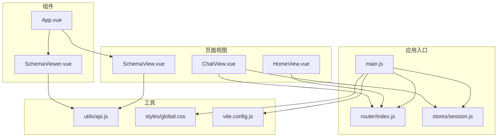
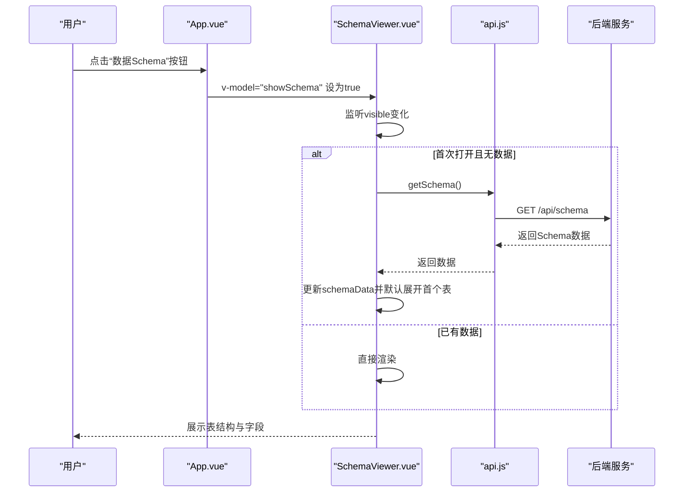
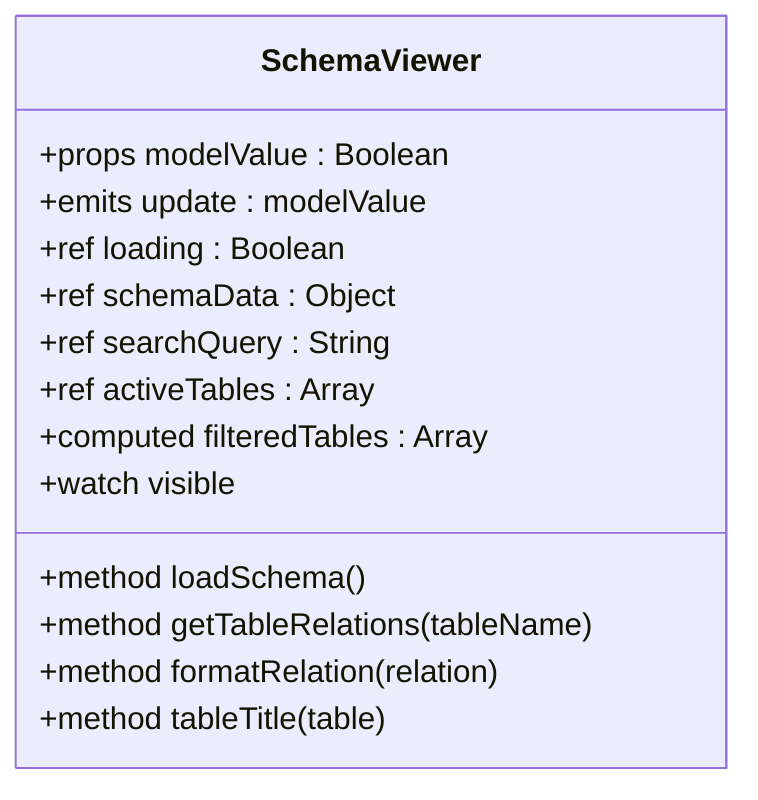
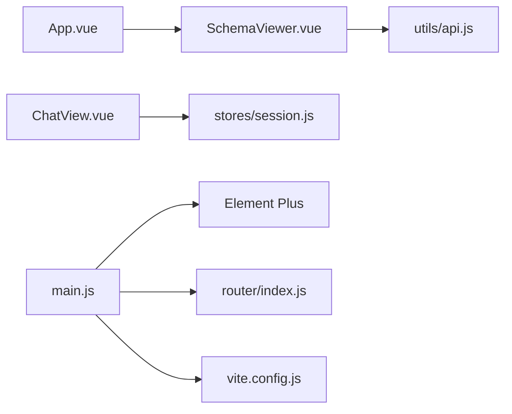

# UI组件

<cite>
**本文档引用的文件**
- [SchemaViewer.vue](file://frontend/src/components/SchemaViewer.vue)
- [SchemaView.vue](file://frontend/src/views/SchemaView.vue)
- [App.vue](file://frontend/src/App.vue)
- [api.js](file://frontend/src/utils/api.js)
- [session.js](file://frontend/src/stores/session.js)
- [main.js](file://frontend/src/main.js)
- [router/index.js](file://frontend/src/router/index.js)
- [vite.config.js](file://frontend/vite.config.js)
- [global.css](file://frontend/src/styles/global.css)
- [HomeView.vue](file://frontend/src/views/HomeView.vue)
- [ChatView.vue](file://frontend/src/views/ChatView.vue)
</cite>

## 目录
1. [简介](#简介)
2. [项目结构](#项目结构)
3. [核心组件](#核心组件)
4. [架构总览](#架构总览)
5. [详细组件分析](#详细组件分析)
6. [依赖分析](#依赖分析)
7. [性能考虑](#性能考虑)
8. [故障排查指南](#故障排查指南)
9. [结论](#结论)
10. [附录](#附录)

## 简介
本文件面向NL2SQL前端UI组件，重点围绕SchemaViewer组件进行深入文档化，涵盖其设计与实现细节、属性定义、事件处理、插槽使用与样式定制；同时总结Element Plus组件库的使用模式与最佳实践，阐述组件的可复用性与组合模式、测试策略与文档编写、代码规范与样式指南，以及响应式设计与跨浏览器兼容性处理。文档旨在帮助开发者快速理解并高效扩展UI组件体系。

## 项目结构
前端采用Vue 3 + Vite + Element Plus技术栈，采用单文件组件（SFC）组织，按功能模块划分目录：
- components：可复用UI组件（如SchemaViewer）
- views：页面级视图组件（如SchemaView、ChatView、HomeView）
- utils：工具模块（API封装、Markdown渲染等）
- stores：状态管理（Pinia）
- styles：全局样式
- router：路由配置
- main.js：应用入口，安装Element Plus与全局图标

**图表来源**
- [main.js:1-89](file://frontend/src/main.js#L1-L89)
- [router/index.js:1-147](file://frontend/src/router/index.js#L1-L147)
- [stores/session.js:1-398](file://frontend/src/stores/session.js#L1-L398)
- [App.vue:1-373](file://frontend/src/App.vue#L1-L373)
- [SchemaViewer.vue:1-317](file://frontend/src/components/SchemaViewer.vue#L1-L317)
- [SchemaView.vue:1-322](file://frontend/src/views/SchemaView.vue#L1-L322)
- [ChatView.vue:1-776](file://frontend/src/views/ChatView.vue#L1-L776)
- [api.js:1-252](file://frontend/src/utils/api.js#L1-L252)
- [global.css:1-317](file://frontend/src/styles/global.css#L1-L317)
- [vite.config.js:1-93](file://frontend/vite.config.js#L1-L93)

**章节来源**
- [main.js:1-89](file://frontend/src/main.js#L1-L89)
- [router/index.js:1-147](file://frontend/src/router/index.js#L1-L147)
- [vite.config.js:1-93](file://frontend/vite.config.js#L1-L93)

## 核心组件
本节聚焦SchemaViewer组件，它是基于Element Plus的弹窗组件，用于以对话框形式展示数据Schema（表结构、字段、关系等），具备搜索过滤、懒加载、骨架屏与空态展示等能力。

- 组件职责
  - 以弹窗形式展示Schema数据
  - 支持按表名/字段名/描述搜索
  - 懒加载Schema数据（首次打开时触发）
  - 展示表描述、字段列表、主键标识、关系标签
  - 提供加载状态与空状态反馈

- 关键实现要点
  - 使用v-model双向绑定控制弹窗显隐
  - 使用Element Plus的el-dialog、el-input、el-skeleton、el-empty、el-collapse、el-collapse-item、el-table、el-tag、el-statistic等组件
  - 通过watch监听visible状态，在打开时异步加载数据
  - 计算属性filteredTables实现搜索过滤
  - 提供格式化关系显示与表标题生成辅助方法

**章节来源**
- [SchemaViewer.vue:1-317](file://frontend/src/components/SchemaViewer.vue#L1-L317)

## 架构总览
SchemaViewer在应用中的位置与交互流程如下：

**图表来源**
- [App.vue:77-78](file://frontend/src/App.vue#L77-L78)
- [SchemaViewer.vue:252-256](file://frontend/src/components/SchemaViewer.vue#L252-L256)
- [api.js:118-120](file://frontend/src/utils/api.js#L118-L120)

## 详细组件分析

### SchemaViewer组件详解
- 属性定义
  - modelValue: Boolean，用于控制弹窗显示/隐藏（通过computed实现v-model）
- 事件处理
  - update:modelValue：内部通过emit触发，实现双向绑定
- 插槽使用
  - 未使用具名插槽，但可通过默认插槽自定义弹窗内容（当前模板为默认插槽）
- 样式定制
  - 使用scoped样式限定作用域，避免污染全局
  - 通过深选择器(:deep)在SchemaView中实现标签页内容滚动容器的样式覆盖
- 数据流
  - 响应式状态：loading、schemaData、searchQuery、activeTables
  - 计算属性：filteredTables（搜索过滤）
  - 方法：loadSchema（懒加载）、getTableRelations/formatRelation（关系展示）、tableTitle（标题生成）
  - 监听器：watch(visible)（打开时加载）

**图表来源**
- [SchemaViewer.vue:112-123](file://frontend/src/components/SchemaViewer.vue#L112-L123)
- [SchemaViewer.vue:130-147](file://frontend/src/components/SchemaViewer.vue#L130-L147)
- [SchemaViewer.vue:157-182](file://frontend/src/components/SchemaViewer.vue#L157-L182)
- [SchemaViewer.vue:191-208](file://frontend/src/components/SchemaViewer.vue#L191-L208)
- [SchemaViewer.vue:215-230](file://frontend/src/components/SchemaViewer.vue#L215-L230)
- [SchemaViewer.vue:237-242](file://frontend/src/components/SchemaViewer.vue#L237-L242)
- [SchemaViewer.vue:252-256](file://frontend/src/components/SchemaViewer.vue#L252-L256)

**章节来源**
- [SchemaViewer.vue:1-317](file://frontend/src/components/SchemaViewer.vue#L1-L317)

### Element Plus使用模式与最佳实践
- 组件库集成
  - 在main.js中全局安装ElementPlus并注册所有图标组件，便于在任意组件中直接使用
- 常用组件使用
  - 弹窗：el-dialog（配合v-model控制显隐）
  - 输入：el-input（支持clearable、prefix-icon）
  - 表格：el-table（支持size、border、show-overflow-tooltip）
  - 折叠面板：el-collapse + el-collapse-item（用于分表展示）
  - 标签：el-tag（用于字段类型、主键标识、关系标签）
  - 统计：el-statistic（用于页面统计信息）
  - 按钮：el-button（支持图标、禁用状态）
  - 空态与骨架：el-empty、el-skeleton（提升用户体验）
- 最佳实践
  - 使用scoped样式隔离组件样式
  - 通过计算属性与watch优化渲染与交互
  - 使用Element Plus图标组件，保持视觉一致性
  - 在复杂页面中使用深选择器(:deep)进行样式覆盖时，注意作用域与优先级

**章节来源**
- [main.js:37-80](file://frontend/src/main.js#L37-L80)
- [SchemaViewer.vue:6-86](file://frontend/src/components/SchemaViewer.vue#L6-L86)
- [SchemaView.vue:21-144](file://frontend/src/views/SchemaView.vue#L21-L144)

### 可复用性设计与组合模式
- 可复用性
  - SchemaViewer作为独立弹窗组件，通过v-model与外部状态解耦，可在不同页面复用
  - 通过API层抽象数据获取逻辑，降低组件与后端耦合
- 组合模式
  - App.vue中将SchemaViewer作为根组件的子组件，通过状态showSchema控制显示
  - SchemaView作为完整页面展示Schema，与SchemaViewer形成“弹窗版”与“页面版”的互补

**章节来源**
- [App.vue:77-78](file://frontend/src/App.vue#L77-L78)
- [SchemaViewer.vue:6-11](file://frontend/src/components/SchemaViewer.vue#L6-L11)
- [SchemaView.vue:1-20](file://frontend/src/views/SchemaView.vue#L1-L20)

### 测试策略与文档编写
- 单元测试建议
  - 组件属性与事件：验证modelValue双向绑定、update:modelValue事件触发
  - 计算属性：验证filteredTables在不同搜索条件下的正确性
  - 方法：模拟API返回，验证loadSchema、getTableRelations、formatRelation、tableTitle的行为
  - 监听器：验证watch(visible)在打开时触发数据加载
- 文档编写建议
  - 组件API文档：列出props、emits、slots、events
  - 使用示例：提供基本用法与高级用法（搜索、懒加载、样式覆盖）
  - 样式定制：说明如何通过scoped样式与深选择器覆盖Element Plus组件样式
  - 无障碍与可访问性：确保键盘可达与屏幕阅读器友好

[本节为通用指导，不直接分析具体文件]

### 代码规范与样式指南
- 代码规范
  - 使用Composition API与<script setup>语法，保持简洁
  - 响应式状态集中声明，计算属性与方法分离
  - API调用统一通过utils/api.js封装，便于测试与维护
- 样式指南
  - 使用scoped样式隔离组件样式
  - 全局样式通过global.css统一管理，提供基础重置、工具类与动画
  - 在复杂页面中谨慎使用深选择器(:deep)，并注明作用范围

**章节来源**
- [global.css:1-317](file://frontend/src/styles/global.css#L1-L317)
- [api.js:1-252](file://frontend/src/utils/api.js#L1-L252)

### 响应式设计与跨浏览器兼容性
- 响应式布局
  - 使用CSS Grid与Flex布局实现自适应
  - 在global.css中提供@media规则，适配移动端侧边栏等场景
- 跨浏览器兼容性
  - 使用Vite构建，现代浏览器原生支持良好
  - Element Plus提供良好的浏览器兼容性，遵循其官方建议
  - 对于特殊样式需求，使用autoprefixer或SCSS变量保证兼容

**章节来源**
- [global.css:299-317](file://frontend/src/styles/global.css#L299-L317)
- [vite.config.js:60-69](file://frontend/vite.config.js#L60-L69)

## 依赖分析
- 组件间依赖
  - App.vue依赖SchemaViewer组件并通过状态控制显示
  - SchemaViewer依赖utils/api.js进行数据获取
  - ChatView依赖stores/session.js进行SSE连接与消息管理
- 外部依赖
  - Element Plus：UI组件库
  - Vue 3 + Vue Router + Pinia：前端框架与状态管理
  - Axios：HTTP客户端
  - Vite：构建工具

**图表来源**
- [App.vue:114-114](file://frontend/src/App.vue#L114-L114)
- [SchemaViewer.vue:103-103](file://frontend/src/components/SchemaViewer.vue#L103-L103)
- [api.js:1-252](file://frontend/src/utils/api.js#L1-L252)
- [ChatView.vue:149-152](file://frontend/src/views/ChatView.vue#L149-L152)
- [session.js:1-398](file://frontend/src/stores/session.js#L1-L398)
- [main.js:37-80](file://frontend/src/main.js#L37-L80)
- [router/index.js:1-147](file://frontend/src/router/index.js#L1-L147)
- [vite.config.js:1-93](file://frontend/vite.config.js#L1-L93)

**章节来源**
- [App.vue:1-373](file://frontend/src/App.vue#L1-L373)
- [SchemaViewer.vue:1-317](file://frontend/src/components/SchemaViewer.vue#L1-L317)
- [ChatView.vue:1-776](file://frontend/src/views/ChatView.vue#L1-L776)
- [session.js:1-398](file://frontend/src/stores/session.js#L1-L398)
- [api.js:1-252](file://frontend/src/utils/api.js#L1-L252)
- [main.js:1-89](file://frontend/src/main.js#L1-L89)
- [router/index.js:1-147](file://frontend/src/router/index.js#L1-L147)
- [vite.config.js:1-93](file://frontend/vite.config.js#L1-L93)

## 性能考虑
- 懒加载与条件渲染
  - SchemaViewer在弹窗首次打开时才加载数据，减少初始渲染压力
- 虚拟化与滚动优化
  - 使用Element Plus的表格组件与滚动容器，避免大列表全量渲染
- 样式与资源优化
  - Vite配置中对Element Plus、ECharts、第三方库进行手动分包，优化首屏加载
- 网络请求优化
  - API层统一拦截与错误处理，避免重复请求与异常传播

**章节来源**
- [SchemaViewer.vue:252-256](file://frontend/src/components/SchemaViewer.vue#L252-L256)
- [vite.config.js:78-91](file://frontend/vite.config.js#L78-L91)
- [api.js:67-88](file://frontend/src/utils/api.js#L67-L88)

## 故障排查指南
- 弹窗无法显示或数据不加载
  - 检查App.vue中showSchema状态与SchemaViewer的v-model绑定
  - 确认watch(visible)是否触发loadSchema
- API请求失败
  - 检查utils/api.js中的请求拦截与响应拦截逻辑
  - 确认Vite代理配置是否正确指向后端服务
- 样式覆盖无效
  - 确认是否使用了深选择器(:deep)，并检查scoped作用域
- 会话与SSE问题
  - 检查stores/session.js中的SSE连接与消息处理逻辑

**章节来源**
- [App.vue:122-123](file://frontend/src/App.vue#L122-L123)
- [SchemaViewer.vue:252-256](file://frontend/src/components/SchemaViewer.vue#L252-L256)
- [api.js:44-88](file://frontend/src/utils/api.js#L44-L88)
- [vite.config.js:24-35](file://frontend/vite.config.js#L24-L35)
- [session.js:185-221](file://frontend/src/stores/session.js#L185-L221)

## 结论
SchemaViewer组件通过清晰的属性定义、事件处理与样式隔离，实现了可复用的Schema展示能力。结合Element Plus的丰富组件与Vite的现代化构建，项目在可维护性、性能与开发体验方面均表现良好。建议后续补充单元测试与组件文档，持续优化交互细节与跨浏览器兼容性。

## 附录
- 相关视图组件
  - SchemaView：完整页面版Schema展示，包含统计、标签页与卡片布局
  - HomeView：首页视图，提供快速入口与示例
  - ChatView：聊天页面，集成SSE与消息渲染

**章节来源**
- [SchemaView.vue:1-322](file://frontend/src/views/SchemaView.vue#L1-L322)
- [HomeView.vue:1-318](file://frontend/src/views/HomeView.vue#L1-L318)
- [ChatView.vue:1-776](file://frontend/src/views/ChatView.vue#L1-L776)