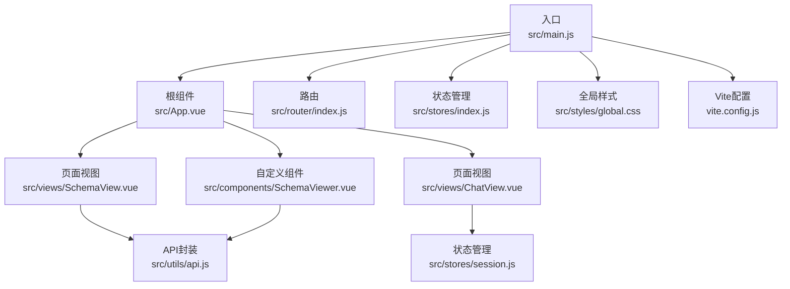
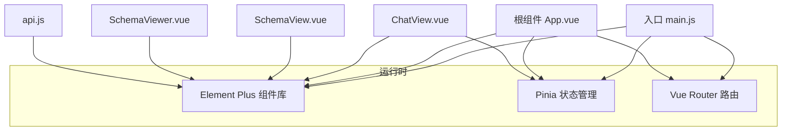
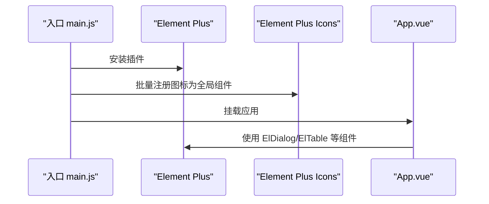
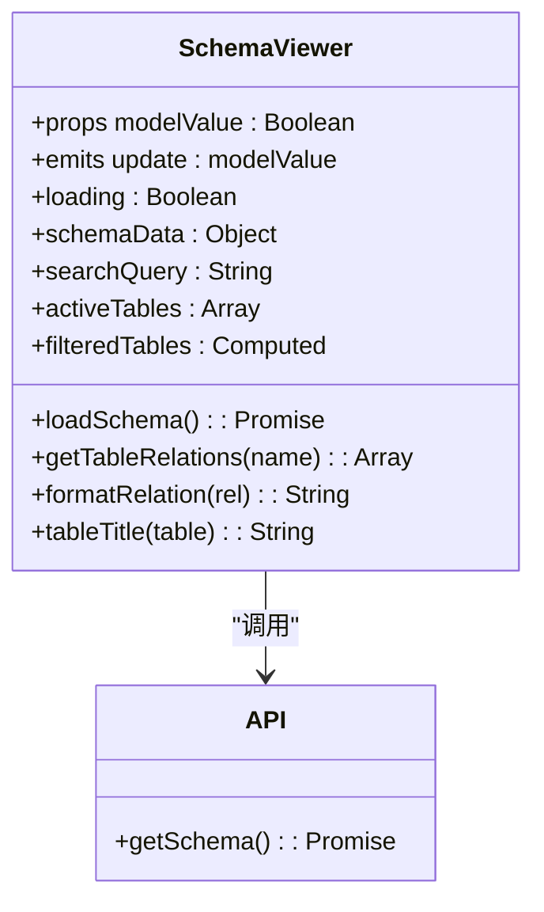
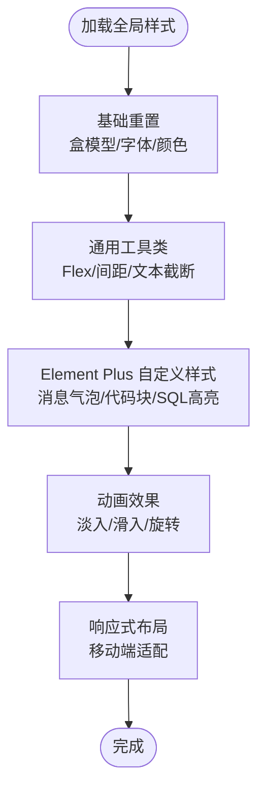
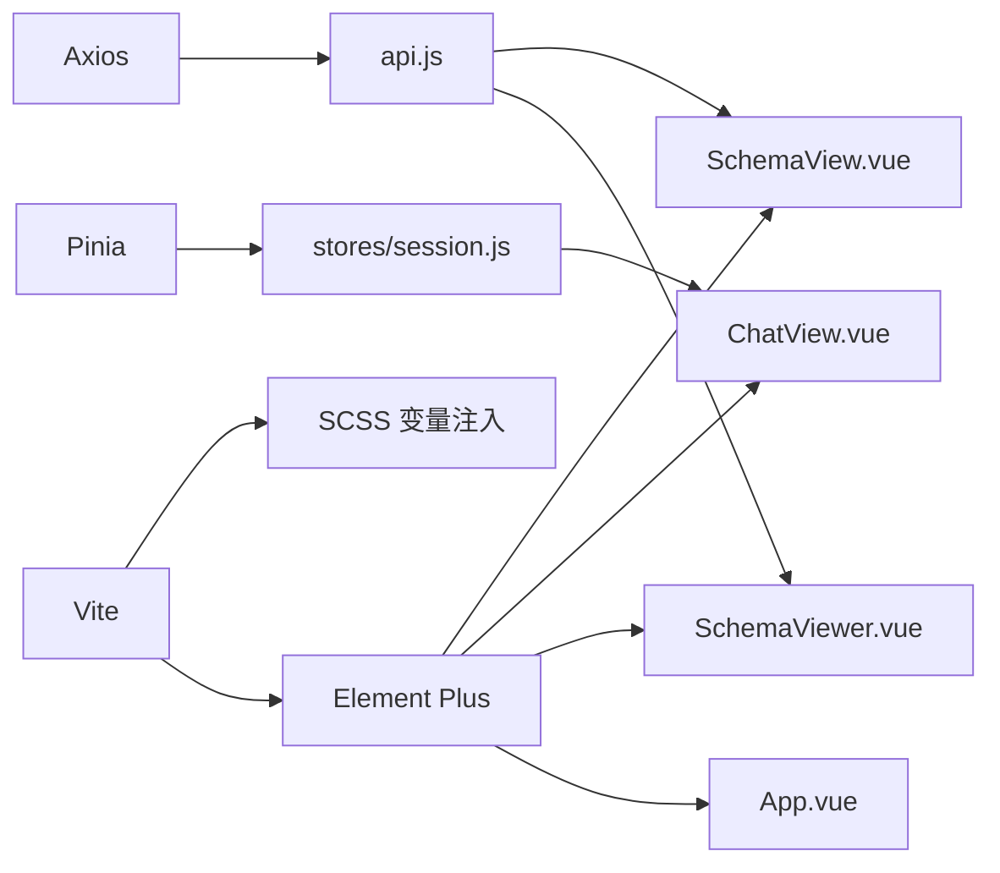

# UI组件库

<cite>
**本文档引用的文件**
- [package.json](file://frontend/package.json)
- [main.js](file://frontend/src/main.js)
- [App.vue](file://frontend/src/App.vue)
- [vite.config.js](file://frontend/vite.config.js)
- [SchemaViewer.vue](file://frontend/src/components/SchemaViewer.vue)
- [global.css](file://frontend/src/styles/global.css)
- [router/index.js](file://frontend/src/router/index.js)
- [stores/session.js](file://frontend/src/stores/session.js)
- [utils/api.js](file://frontend/src/utils/api.js)
- [views/SchemaView.vue](file://frontend/src/views/SchemaView.vue)
- [views/ChatView.vue](file://frontend/src/views/ChatView.vue)
- [stores/index.js](file://frontend/src/stores/index.js)
- [utils/markdownRenderer.js](file://frontend/src/utils/markdownRenderer.js)
- [index.html](file://frontend/index.html)
</cite>

## 目录
1. [简介](#简介)
2. [项目结构](#项目结构)
3. [核心组件](#核心组件)
4. [架构总览](#架构总览)
5. [组件详解](#组件详解)
6. [依赖关系分析](#依赖关系分析)
7. [性能考量](#性能考量)
8. [故障排查指南](#故障排查指南)
9. [结论](#结论)
10. [附录](#附录)

## 简介
本文件为 NL2SQL 前端 UI 组件库的技术文档，聚焦以下目标：
- 深入解释 Element Plus 组件库的集成与定制策略
- 详细描述自定义组件 SchemaViewer 的设计与实现
- 说明全局样式的组织与主题定制方案
- 解释响应式设计与跨浏览器兼容性处理
- 包含组件的可访问性支持与国际化配置
- 提供 UI 组件的开发规范与设计系统
- 为前端开发者提供组件开发与样式管理的指导
- 涵盖组件测试与质量保证的方法

## 项目结构
前端采用 Vue 3 + Vite + Element Plus 技术栈，核心目录与职责如下：
- src/main.js：应用入口，安装路由、状态管理、Element Plus 插件，注册全局图标组件
- src/App.vue：根组件，侧边栏布局、会话管理、Schema 查看弹窗
- src/components/SchemaViewer.vue：自定义弹窗组件，展示数据 Schema
- src/views/*：页面视图，如聊天、Schema 查看、历史、评估等
- src/stores/*：状态管理，使用 Pinia 管理会话、消息、SSE 连接
- src/utils/*：工具模块，API 封装、Markdown/SQL 渲染
- src/styles/global.css：全局样式与 Element Plus 自定义
- vite.config.js：Vite 配置，路径别名、CSS 预处理器、第三方库分包
- package.json：依赖声明，包含 Element Plus、ECharts、Mermaid、KaTeX 等

**图表来源**
- [main.js:1-89](file://frontend/src/main.js#L1-L89)
- [App.vue:1-384](file://frontend/src/App.vue#L1-L384)
- [router/index.js:1-157](file://frontend/src/router/index.js#L1-L157)
- [stores/index.js:1-30](file://frontend/src/stores/index.js#L1-L30)
- [SchemaViewer.vue:1-317](file://frontend/src/components/SchemaViewer.vue#L1-L317)
- [ChatView.vue:1-778](file://frontend/src/views/ChatView.vue#L1-L778)
- [SchemaView.vue:1-322](file://frontend/src/views/SchemaView.vue#L1-L322)
- [session.js:1-400](file://frontend/src/stores/session.js#L1-L400)
- [api.js:1-303](file://frontend/src/utils/api.js#L1-L303)
- [global.css:1-317](file://frontend/src/styles/global.css#L1-L317)
- [vite.config.js:1-93](file://frontend/vite.config.js#L1-L93)

**章节来源**
- [main.js:1-89](file://frontend/src/main.js#L1-L89)
- [vite.config.js:1-93](file://frontend/vite.config.js#L1-L93)
- [package.json:1-36](file://frontend/package.json#L1-L36)

## 核心组件
- Element Plus 集成与全局注册：在入口文件中安装 Element Plus 插件，并批量注册 Element Plus 图标为全局组件，便于在任意模板中直接使用
- 自定义 SchemaViewer：基于 ElDialog、ElCollapse、ElTable、ElSkeleton、ElEmpty 等 Element Plus 组件，实现 Schema 数据的弹窗展示、搜索过滤、折叠展开、关系展示
- 全局样式与主题：通过全局 CSS 重置、通用工具类、Element Plus 自定义样式与动画，统一视觉与交互体验；Vite 中配置 SCSS 自动导入 Element Plus 变量，便于主题定制
- 响应式与兼容：全局样式中提供移动端适配；页面通过相对布局与弹性布局适配不同屏幕尺寸；入口 HTML 设置 viewport 与语言属性，提升兼容性

**章节来源**
- [main.js:34-80](file://frontend/src/main.js#L34-L80)
- [SchemaViewer.vue:1-317](file://frontend/src/components/SchemaViewer.vue#L1-L317)
- [global.css:1-317](file://frontend/src/styles/global.css#L1-L317)
- [vite.config.js:60-68](file://frontend/vite.config.js#L60-L68)
- [index.html:6-18](file://frontend/index.html#L6-L18)

## 架构总览
前端应用采用“入口安装插件 + 根组件布局 + 页面视图 + 状态管理 + 工具模块”的分层架构。Element Plus 作为 UI 基座，配合 Pinia 管理会话与消息流，API 工具模块统一后端交互，Markdown/SQL 渲染工具增强消息内容表现力。

**图表来源**
- [main.js:34-89](file://frontend/src/main.js#L34-L89)
- [App.vue:1-384](file://frontend/src/App.vue#L1-L384)
- [ChatView.vue:1-778](file://frontend/src/views/ChatView.vue#L1-L778)
- [SchemaView.vue:1-322](file://frontend/src/views/SchemaView.vue#L1-L322)
- [SchemaViewer.vue:1-317](file://frontend/src/components/SchemaViewer.vue#L1-L317)
- [api.js:1-303](file://frontend/src/utils/api.js#L1-L303)

## 组件详解

### Element Plus 集成与定制策略
- 插件安装与图标注册：在入口文件中安装 Element Plus 插件，并遍历注册 Element Plus 图标为全局组件，减少重复导入
- 全局样式覆盖：在全局 CSS 中定义 Element Plus 消息气泡、代码块、SQL 高亮等自定义样式，统一消息展示风格
- SCSS 变量注入：Vite 中配置 SCSS 自动导入 Element Plus 变量，便于在组件样式中使用主题变量进行定制
- 组件使用范式：根组件与各页面广泛使用 ElButton、ElDialog、ElTable、ElTabs、ElCollapse、ElSkeleton、ElEmpty 等组件，遵循 Element Plus 设计语言

**图表来源**
- [main.js:34-80](file://frontend/src/main.js#L34-L80)
- [App.vue:1-384](file://frontend/src/App.vue#L1-L384)

**章节来源**
- [main.js:34-80](file://frontend/src/main.js#L34-L80)
- [global.css:185-242](file://frontend/src/styles/global.css#L185-L242)
- [vite.config.js:60-68](file://frontend/vite.config.js#L60-L68)

### 自定义组件 SchemaViewer 设计与实现
SchemaViewer 是一个基于 ElDialog 的弹窗组件，用于展示数据 Schema。其设计要点包括：
- 双向绑定：通过 v-model 实现与父组件的显示控制
- 数据加载：首次打开时懒加载 Schema 数据，避免不必要的请求
- 搜索过滤：支持按表名、中文名、描述、字段名进行模糊搜索
- 折叠展示：使用 ElCollapse 展示每个表的字段与关系
- 关系格式化：将关系对象格式化为“表A → 表B”展示
- 空态与骨架：无数据时显示空状态，加载中显示骨架屏

**图表来源**
- [SchemaViewer.vue:112-256](file://frontend/src/components/SchemaViewer.vue#L112-L256)
- [api.js:118-120](file://frontend/src/utils/api.js#L118-L120)

**章节来源**
- [SchemaViewer.vue:1-317](file://frontend/src/components/SchemaViewer.vue#L1-L317)
- [api.js:118-120](file://frontend/src/utils/api.js#L118-L120)

### 全局样式组织与主题定制
- 基础重置：统一盒模型、移除默认内外边距、设置基础字体与颜色
- 通用工具类：提供文本对齐、多行省略、Flex 布局、间距、显示控制、光标样式
- Element Plus 自定义：消息气泡、代码块、SQL 高亮等样式
- 动画效果：淡入、滑入、旋转等动画，提升交互体验
- 响应式布局：移动端侧边栏抽屉式适配，通过 transform 与 z-index 控制层级

**图表来源**
- [global.css:10-317](file://frontend/src/styles/global.css#L10-L317)

**章节来源**
- [global.css:1-317](file://frontend/src/styles/global.css#L1-L317)

### 响应式设计与跨浏览器兼容性
- 视口与语言：入口 HTML 设置 viewport 与 lang="zh-CN"，确保移动端缩放与语言环境
- 布局适配：全局样式中针对移动端侧边栏提供抽屉式布局；页面使用相对布局与弹性布局
- 浏览器兼容：Element Plus 与 Vue 3 在现代浏览器中具备良好支持；全局样式中使用标准 CSS 属性，避免过时特性

**章节来源**
- [index.html:6-18](file://frontend/index.html#L6-L18)
- [global.css:298-317](file://frontend/src/styles/global.css#L298-L317)

### 可访问性与国际化
- 可访问性：组件使用语义化标签与合理的焦点顺序；Element Plus 组件本身提供基础可访问性支持
- 国际化：当前项目未引入专门的 i18n 方案；若需国际化，可在路由元信息与 Element Plus 国际化资源基础上扩展

[本节为概念性说明，不直接分析具体文件]

### 开发规范与设计系统
- 组件命名：采用 PascalCase，如 SchemaViewer.vue
- 样式组织：优先使用 scoped 样式；全局样式集中于 global.css；Element Plus 变量通过 SCSS 注入
- 状态管理：使用 Composition API 与 Pinia；会话状态集中管理，SSE 连接与消息流在 store 中处理
- API 规范：统一使用 axios 实例，配置 baseURL、超时与拦截器，集中处理错误
- 渲染增强：Markdown 使用 markdown-it，SQL 使用 Shiki 高亮，Mermaid 图表与 KaTeX 数学公式集成

**章节来源**
- [stores/session.js:33-399](file://frontend/src/stores/session.js#L33-L399)
- [api.js:25-88](file://frontend/src/utils/api.js#L25-L88)
- [markdownRenderer.js:15-258](file://frontend/src/utils/markdownRenderer.js#L15-L258)

## 依赖关系分析
- Element Plus：作为 UI 基座，被根组件、页面视图与自定义组件广泛使用
- Axios：统一后端 API 调用，提供请求/响应拦截与错误处理
- Pinia：状态管理，集中管理会话、消息、SSE 连接
- Vite：构建工具，配置路径别名、SCSS 变量注入、第三方库分包
- 第三方渲染库：Mermaid、KaTeX、Shiki，用于消息内容的可视化与高亮

**图表来源**
- [package.json:11-28](file://frontend/package.json#L11-L28)
- [main.js:34-89](file://frontend/src/main.js#L34-L89)
- [api.js:14-34](file://frontend/src/utils/api.js#L14-L34)
- [session.js:15-22](file://frontend/src/stores/session.js#L15-L22)
- [vite.config.js:54-91](file://frontend/vite.config.js#L54-L91)

**章节来源**
- [package.json:1-36](file://frontend/package.json#L1-L36)
- [vite.config.js:1-93](file://frontend/vite.config.js#L1-L93)

## 性能考量
- 代码分割：Vite 配置中将 Element Plus、ECharts、工具库等第三方库独立打包，降低首屏体积
- 懒加载：路由页面采用动态导入，按需加载组件
- 组件懒加载：SchemaViewer 首次打开才加载数据，减少初始请求
- 渲染优化：长消息支持折叠与展开，避免一次性渲染过多 DOM

**章节来源**
- [vite.config.js:72-91](file://frontend/vite.config.js#L72-L91)
- [SchemaViewer.vue:252-256](file://frontend/src/components/SchemaViewer.vue#L252-L256)
- [ChatView.vue:236-259](file://frontend/src/views/ChatView.vue#L236-L259)

## 故障排查指南
- API 错误处理：axios 响应拦截器统一捕获错误，区分服务端错误、网络错误与请求配置错误
- Element Plus 消息提示：使用 ElMessage 与 ElMessageBox 提示用户操作反馈
- SSE 连接：会话 store 中维护 EventSource 连接，断开与重连逻辑清晰
- Markdown/SQL 渲染：渲染失败时提供降级方案与错误日志

**章节来源**
- [api.js:67-88](file://frontend/src/utils/api.js#L67-L88)
- [App.vue:206-228](file://frontend/src/App.vue#L206-L228)
- [session.js:184-221](file://frontend/src/stores/session.js#L184-L221)
- [markdownRenderer.js:160-170](file://frontend/src/utils/markdownRenderer.js#L160-L170)

## 结论
本 UI 组件库以 Element Plus 为核心，结合 Pinia 状态管理与 Vite 构建工具，形成了清晰的分层架构与统一的视觉体系。自定义 SchemaViewer 有效整合了数据 Schema 的展示、搜索与关系呈现；全局样式与主题定制提供了良好的扩展空间；响应式与兼容性处理确保了多端体验。建议后续引入 i18n 与组件测试体系，进一步完善国际化与质量保障。

## 附录
- 路由与页面：路由配置包含首页、聊天、历史、Schema、内存、评估等页面，支持滚动行为与标题设置
- 状态管理：会话 store 提供会话 CRUD、消息管理、SSE 连接与处理状态
- 工具模块：API 封装统一后端交互；Markdown/SQL 渲染工具增强内容表现力

**章节来源**
- [router/index.js:34-150](file://frontend/src/router/index.js#L34-L150)
- [stores/session.js:103-370](file://frontend/src/stores/session.js#L103-L370)
- [utils/markdownRenderer.js:156-258](file://frontend/src/utils/markdownRenderer.js#L156-L258)