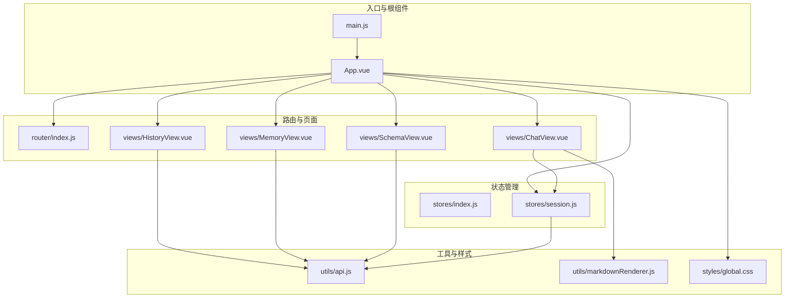
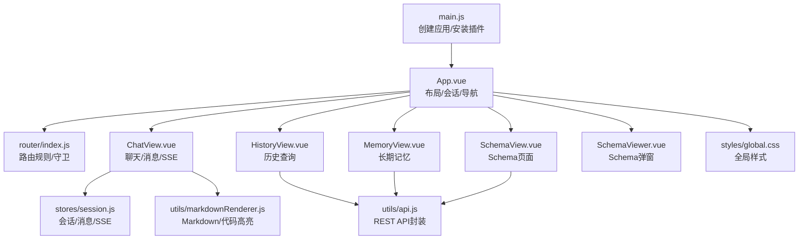
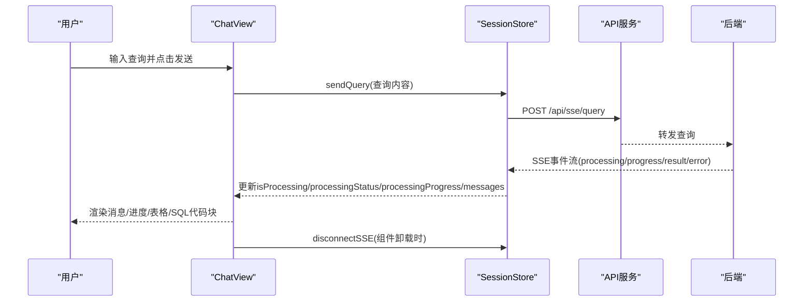
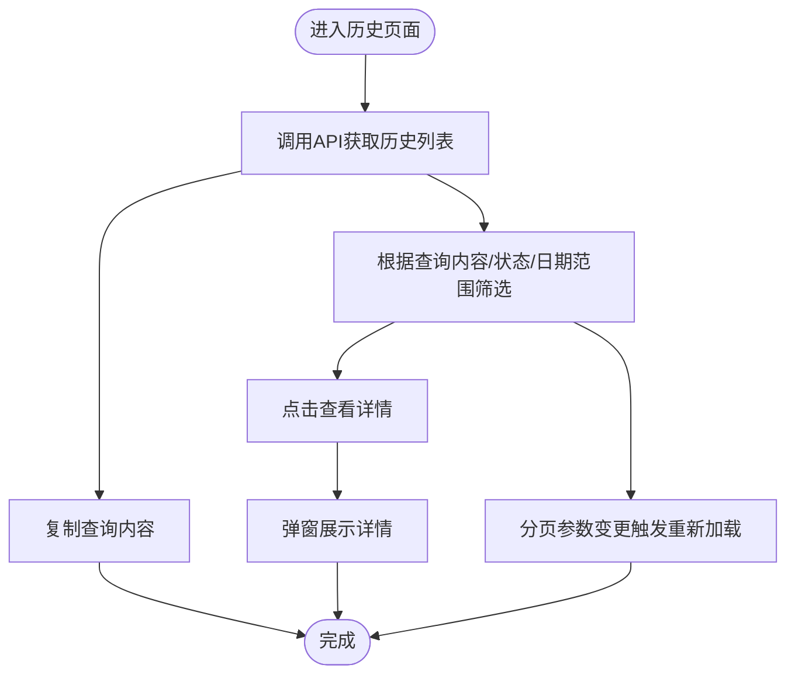
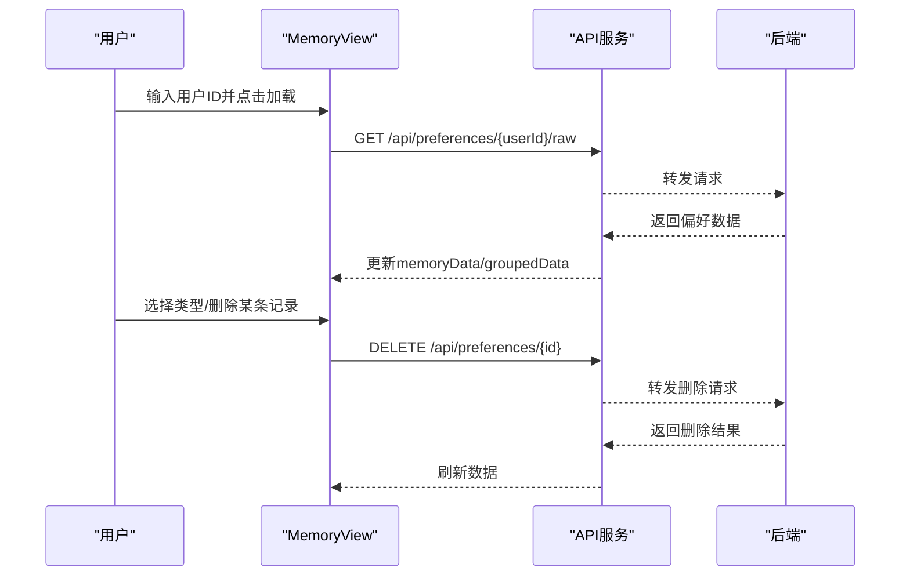
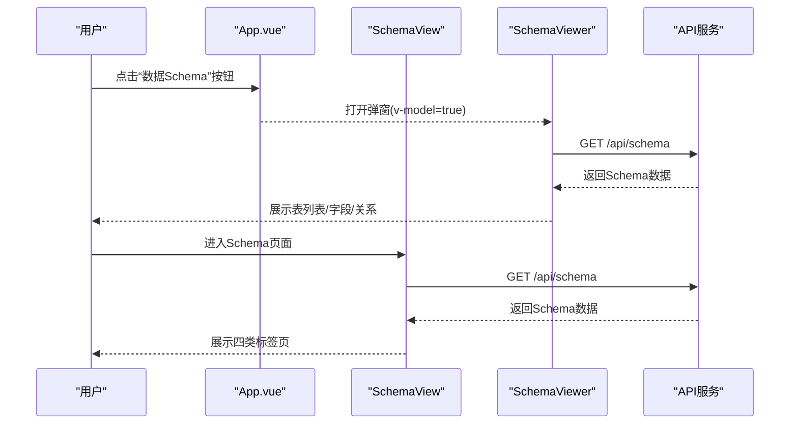
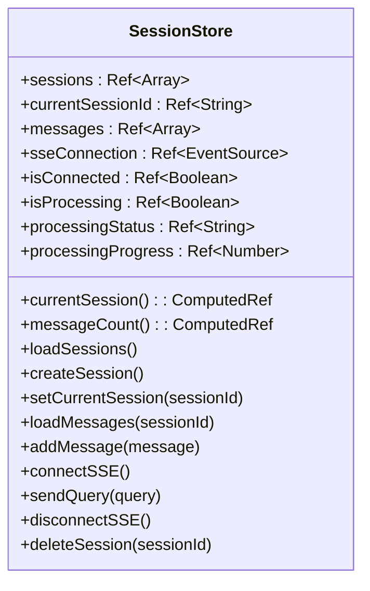
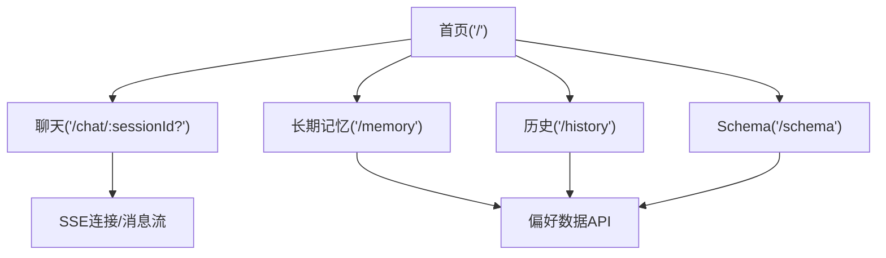
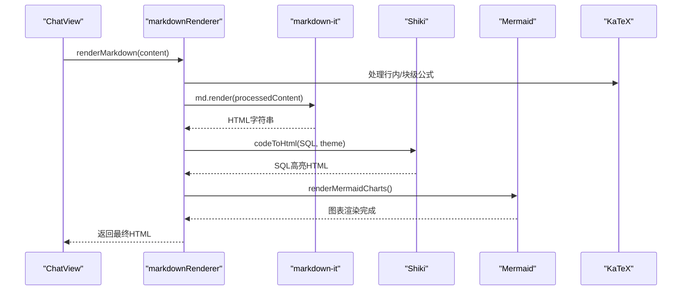
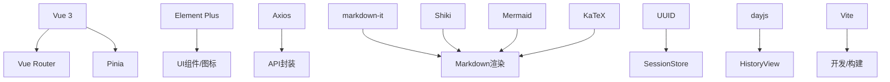

# 前端应用

<cite>
**本文档引用的文件**
- [main.js](file://frontend/src/main.js)
- [App.vue](file://frontend/src/App.vue)
- [router/index.js](file://frontend/src/router/index.js)
- [stores/index.js](file://frontend/src/stores/index.js)
- [stores/session.js](file://frontend/src/stores/session.js)
- [views/ChatView.vue](file://frontend/src/views/ChatView.vue)
- [views/HistoryView.vue](file://frontend/src/views/HistoryView.vue)
- [views/MemoryView.vue](file://frontend/src/views/MemoryView.vue)
- [views/SchemaView.vue](file://frontend/src/views/SchemaView.vue)
- [components/SchemaViewer.vue](file://frontend/src/components/SchemaViewer.vue)
- [utils/api.js](file://frontend/src/utils/api.js)
- [utils/markdownRenderer.js](file://frontend/src/utils/markdownRenderer.js)
- [styles/global.css](file://frontend/src/styles/global.css)
- [vite.config.js](file://frontend/vite.config.js)
- [package.json](file://frontend/package.json)
</cite>

## 目录
1. [简介](#简介)
2. [项目结构](#项目结构)
3. [核心组件](#核心组件)
4. [架构总览](#架构总览)
5. [详细组件分析](#详细组件分析)
6. [依赖分析](#依赖分析)
7. [性能考虑](#性能考虑)
8. [故障排查指南](#故障排查指南)
9. [结论](#结论)
10. [附录](#附录)

## 简介
本项目是一个基于 Vue 3 的单页应用（SPA），用于自然语言到 SQL 的智能查询。前端采用 Composition API + script setup 的现代化开发范式，结合 Element Plus UI 组件库、Pinia 状态管理、Vue Router 路由系统以及 Vite 构建工具，提供聊天对话、历史查询、Schema 查看、长期记忆管理等功能。应用通过 Axios 封装的 API 服务与后端交互，使用 Server-Sent Events（SSE）实现实时消息流；Markdown 渲染与代码高亮通过 markdown-it、Shiki、Mermaid、KaTeX 等工具实现。

## 项目结构
前端项目采用按功能分层的组织方式：
- 入口与应用根组件：main.js、App.vue
- 路由：router/index.js
- 状态管理：stores/index.js、stores/session.js
- 视图页面：views 下的各页面组件
- 可复用组件：components 下的 SchemaViewer.vue
- 工具函数：utils 下的 API 封装与 Markdown 渲染
- 样式：styles/global.css
- 构建配置：vite.config.js、package.json

**图表来源**
- [main.js:1-89](file://frontend/src/main.js#L1-L89)
- [App.vue:1-373](file://frontend/src/App.vue#L1-L373)
- [router/index.js:1-147](file://frontend/src/router/index.js#L1-L147)
- [stores/index.js:1-30](file://frontend/src/stores/index.js#L1-L30)
- [stores/session.js:1-398](file://frontend/src/stores/session.js#L1-L398)
- [views/ChatView.vue:1-776](file://frontend/src/views/ChatView.vue#L1-L776)
- [views/HistoryView.vue:1-441](file://frontend/src/views/HistoryView.vue#L1-L441)
- [views/MemoryView.vue:1-511](file://frontend/src/views/MemoryView.vue#L1-L511)
- [views/SchemaView.vue:1-322](file://frontend/src/views/SchemaView.vue#L1-L322)
- [utils/api.js:1-252](file://frontend/src/utils/api.js#L1-L252)
- [utils/markdownRenderer.js:1-258](file://frontend/src/utils/markdownRenderer.js#L1-L258)
- [styles/global.css:1-317](file://frontend/src/styles/global.css#L1-L317)

**章节来源**
- [main.js:1-89](file://frontend/src/main.js#L1-L89)
- [App.vue:1-373](file://frontend/src/App.vue#L1-L373)
- [router/index.js:1-147](file://frontend/src/router/index.js#L1-L147)
- [stores/index.js:1-30](file://frontend/src/stores/index.js#L1-L30)
- [stores/session.js:1-398](file://frontend/src/stores/session.js#L1-L398)
- [utils/api.js:1-252](file://frontend/src/utils/api.js#L1-L252)
- [utils/markdownRenderer.js:1-258](file://frontend/src/utils/markdownRenderer.js#L1-L258)
- [styles/global.css:1-317](file://frontend/src/styles/global.css#L1-L317)
- [vite.config.js:1-93](file://frontend/vite.config.js#L1-L93)
- [package.json:1-36](file://frontend/package.json#L1-L36)

## 核心组件
- 应用入口与安装插件：在入口文件中创建 Vue 应用实例，安装路由、状态管理、UI 组件库、全局图标注册与全局样式。
- 根组件布局：提供侧边栏（会话列表、历史会话、Schema 查看、长期记忆、设置、侧边栏开关）、主内容区（router-view）与 Schema 查看弹窗。
- 路由系统：定义首页、聊天、历史、Schema、长期记忆、404 等页面，配置滚动行为与全局前置守卫设置页面标题。
- 状态管理：Pinia 创建全局 store，会话 store 管理会话列表、当前会话、消息、SSE 连接、处理状态与进度。
- 页面组件：聊天页面负责实时对话与消息渲染；历史页面展示查询记录并支持筛选与分页；Schema 页面与弹窗组件提供数据结构浏览；长期记忆页面展示偏好数据与删除操作。
- 工具函数：API 封装统一请求与响应拦截；Markdown 渲染器集成多格式渲染与代码高亮。

**章节来源**
- [main.js:1-89](file://frontend/src/main.js#L1-L89)
- [App.vue:1-373](file://frontend/src/App.vue#L1-L373)
- [router/index.js:1-147](file://frontend/src/router/index.js#L1-L147)
- [stores/index.js:1-30](file://frontend/src/stores/index.js#L1-L30)
- [stores/session.js:1-398](file://frontend/src/stores/session.js#L1-L398)
- [views/ChatView.vue:1-776](file://frontend/src/views/ChatView.vue#L1-L776)
- [views/HistoryView.vue:1-441](file://frontend/src/views/HistoryView.vue#L1-L441)
- [views/SchemaView.vue:1-322](file://frontend/src/views/SchemaView.vue#L1-L322)
- [components/SchemaViewer.vue:1-317](file://frontend/src/components/SchemaViewer.vue#L1-L317)
- [views/MemoryView.vue:1-511](file://frontend/src/views/MemoryView.vue#L1-L511)
- [utils/api.js:1-252](file://frontend/src/utils/api.js#L1-L252)
- [utils/markdownRenderer.js:1-258](file://frontend/src/utils/markdownRenderer.js#L1-L258)

## 架构总览
应用采用“入口 -> 根组件 -> 路由 -> 页面组件 -> 状态管理/工具”的分层架构。根组件负责布局与会话管理，页面组件通过 Pinia 与 API 工具与后端交互，Markdown 渲染器提供富文本与代码高亮能力。

**图表来源**
- [main.js:1-89](file://frontend/src/main.js#L1-L89)
- [App.vue:1-373](file://frontend/src/App.vue#L1-L373)
- [router/index.js:1-147](file://frontend/src/router/index.js#L1-L147)
- [stores/session.js:1-398](file://frontend/src/stores/session.js#L1-L398)
- [views/ChatView.vue:1-776](file://frontend/src/views/ChatView.vue#L1-L776)
- [views/HistoryView.vue:1-441](file://frontend/src/views/HistoryView.vue#L1-L441)
- [views/MemoryView.vue:1-511](file://frontend/src/views/MemoryView.vue#L1-L511)
- [views/SchemaView.vue:1-322](file://frontend/src/views/SchemaView.vue#L1-L322)
- [components/SchemaViewer.vue:1-317](file://frontend/src/components/SchemaViewer.vue#L1-L317)
- [utils/api.js:1-252](file://frontend/src/utils/api.js#L1-L252)
- [utils/markdownRenderer.js:1-258](file://frontend/src/utils/markdownRenderer.js#L1-L258)
- [styles/global.css:1-317](file://frontend/src/styles/global.css#L1-L317)

## 详细组件分析

### 聊天界面（ChatView）
- 功能要点
  - 实时消息展示：用户消息与助手消息分别渲染，支持长文本折叠与展开。
  - Markdown 渲染：使用 markdown-it 渲染富文本，支持 mermaid 图表与 KaTeX 数学公式。
  - 代码高亮：SQL 代码块通过 Shiki 高亮渲染。
  - 数据表格：助手返回的数据以表格形式展示。
  - 处理状态：SSE 推送的处理状态与进度条展示。
  - 输入交互：支持 Enter 发送、Shift+Enter 换行；发送后自动滚动到底部。
- 关键流程
  - 初始化会话：根据路由参数设置当前会话并连接 SSE。
  - 发送查询：将用户输入通过 API 提交，消息加入本地列表。
  - SSE 消息处理：根据消息类型更新状态、进度与消息列表。
  - 卸载清理：断开 SSE 连接。

**图表来源**
- [views/ChatView.vue:196-325](file://frontend/src/views/ChatView.vue#L196-L325)
- [stores/session.js:299-340](file://frontend/src/stores/session.js#L299-L340)
- [utils/api.js:246-251](file://frontend/src/utils/api.js#L246-L251)

**章节来源**
- [views/ChatView.vue:1-776](file://frontend/src/views/ChatView.vue#L1-L776)
- [stores/session.js:1-398](file://frontend/src/stores/session.js#L1-L398)
- [utils/api.js:1-252](file://frontend/src/utils/api.js#L1-L252)
- [utils/markdownRenderer.js:1-258](file://frontend/src/utils/markdownRenderer.js#L1-L258)

### 历史记录（HistoryView）
- 功能要点
  - 查询历史列表：支持按查询内容、状态、日期范围筛选。
  - 分页：支持每页条数与页码变更。
  - 详情弹窗：展示查询内容、生成 SQL、状态、错误信息、执行时间、返回行数、查询时间。
  - 复制：一键复制查询内容。
- 关键流程
  - 加载历史：调用 API 获取历史列表与总数。
  - 筛选与分页：计算属性过滤与分页参数联动。
  - 详情查看：打开弹窗并展示选中项。

**图表来源**
- [views/HistoryView.vue:226-289](file://frontend/src/views/HistoryView.vue#L226-L289)
- [utils/api.js:206-208](file://frontend/src/utils/api.js#L206-L208)

**章节来源**
- [views/HistoryView.vue:1-441](file://frontend/src/views/HistoryView.vue#L1-L441)
- [utils/api.js:1-252](file://frontend/src/utils/api.js#L1-L252)

### 内存管理（MemoryView）
- 功能要点
  - 用户ID选择：支持匿名用户。
  - 加载数据：调用后端偏好接口获取原始数据与分组统计。
  - 统计卡片：展示总记录数、字段别名、查询模式、常用指标、常用维度数量。
  - 类型筛选：按字段别名、查询模式、常用指标、常用维度切换表格。
  - 删除操作：调用删除接口并重新加载数据。
- 关键流程
  - 加载：GET /api/preferences/{userId}/raw。
  - 删除：DELETE /api/preferences/{id}。
  - 刷新：重新加载数据并更新视图。

**图表来源**
- [views/MemoryView.vue:212-243](file://frontend/src/views/MemoryView.vue#L212-L243)
- [utils/api.js:1-252](file://frontend/src/utils/api.js#L1-L252)

**章节来源**
- [views/MemoryView.vue:1-511](file://frontend/src/views/MemoryView.vue#L1-L511)
- [utils/api.js:1-252](file://frontend/src/utils/api.js#L1-L252)

### Schema 查看（SchemaView 与 SchemaViewer）
- 功能要点
  - SchemaView：完整页面，提供表结构、指标、维度、表关系四个标签页，支持统计信息展示。
  - SchemaViewer：弹窗组件，支持搜索表名/字段、折叠展开、关联关系展示。
- 关键流程
  - 加载：调用 API 获取 Schema 数据。
  - 搜索：在弹窗中根据关键词过滤表。
  - 关联：根据表名筛选关联关系并格式化展示。

**图表来源**
- [App.vue:54-78](file://frontend/src/App.vue#L54-L78)
- [views/SchemaView.vue:185-192](file://frontend/src/views/SchemaView.vue#L185-L192)
- [components/SchemaViewer.vue:191-208](file://frontend/src/components/SchemaViewer.vue#L191-L208)
- [utils/api.js:118-120](file://frontend/src/utils/api.js#L118-L120)

**章节来源**
- [views/SchemaView.vue:1-322](file://frontend/src/views/SchemaView.vue#L1-L322)
- [components/SchemaViewer.vue:1-317](file://frontend/src/components/SchemaViewer.vue#L1-L317)
- [utils/api.js:1-252](file://frontend/src/utils/api.js#L1-L252)

### 状态管理系统（Pinia）
- 设计与使用
  - stores/index.js：创建并导出 Pinia 实例。
  - stores/session.js：定义会话 Store，包含状态（会话列表、当前会话、消息、SSE 连接、处理状态与进度）、计算属性与动作（加载会话、创建会话、设置当前会话、加载消息、添加消息、连接/断开 SSE、发送查询、删除会话）。
- 使用模式
  - 在根组件与页面组件中通过 useSessionStore 获取 store 实例，使用 computed 读取响应式状态，调用 actions 执行业务逻辑。
  - 在 ChatView 中监听路由参数变化与消息变化，自动滚动与初始化会话。

**图表来源**
- [stores/session.js:33-397](file://frontend/src/stores/session.js#L33-L397)

**章节来源**
- [stores/index.js:1-30](file://frontend/src/stores/index.js#L1-L30)
- [stores/session.js:1-398](file://frontend/src/stores/session.js#L1-L398)

### 路由配置与导航
- 路由规则
  - 首页、聊天（带可选会话参数）、历史、Schema、长期记忆、404。
  - 元信息包含页面标题与是否需要会话。
- 导航逻辑
  - App.vue 中通过路由实例跳转到聊天与长期记忆页面。
  - 聊天页面根据路由参数初始化当前会话并连接 SSE。
  - 全局前置守卫设置页面标题。

**图表来源**
- [router/index.js:34-98](file://frontend/src/router/index.js#L34-L98)
- [App.vue:157-189](file://frontend/src/App.vue#L157-L189)
- [views/ChatView.vue:331-343](file://frontend/src/views/ChatView.vue#L331-L343)

**章节来源**
- [router/index.js:1-147](file://frontend/src/router/index.js#L1-L147)
- [App.vue:1-373](file://frontend/src/App.vue#L1-L373)
- [views/ChatView.vue:1-776](file://frontend/src/views/ChatView.vue#L1-L776)

### 工具函数与渲染
- API 封装
  - 基于 axios 创建实例，配置 baseURL、超时与请求/响应拦截器。
  - 提供健康检查、Schema、会话、查询历史、统计、配置、SSE 查询等 API 方法。
- Markdown 渲染与代码高亮
  - markdown-it：启用 HTML、链接识别、排版与代码高亮回调。
  - Shiki：异步初始化高亮器，支持多种语言（含 SQL）。
  - Mermaid：初始化并延迟渲染图表节点。
  - KaTeX：渲染行内与块级数学公式。
  - 提供渲染 Markdown、渲染 SQL、高亮任意代码与渲染图表的导出函数。

**图表来源**
- [utils/markdownRenderer.js:74-196](file://frontend/src/utils/markdownRenderer.js#L74-L196)
- [utils/markdownRenderer.js:203-246](file://frontend/src/utils/markdownRenderer.js#L203-L246)

**章节来源**
- [utils/api.js:1-252](file://frontend/src/utils/api.js#L1-L252)
- [utils/markdownRenderer.js:1-258](file://frontend/src/utils/markdownRenderer.js#L1-L258)

### 组件开发指南与样式系统
- 组件开发指南
  - 使用 Composition API 与 script setup，合理拆分响应式状态、计算属性与方法。
  - 在页面组件中通过 Pinia actions 与 API 工具进行数据交互。
  - 注意生命周期钩子中的资源释放（如 SSE 连接）。
  - 使用 Element Plus 组件与图标，遵循其样式规范。
- 样式系统
  - 全局样式：重置、通用工具类、Element Plus 自定义样式、动画与移动端适配。
  - 页面样式：scoped 样式隔离，按模块划分容器、列表、卡片、表格等结构。
  - 响应式：媒体查询适配移动端布局。

**章节来源**
- [styles/global.css:1-317](file://frontend/src/styles/global.css#L1-L317)
- [views/ChatView.vue:383-776](file://frontend/src/views/ChatView.vue#L383-L776)
- [views/HistoryView.vue:300-441](file://frontend/src/views/HistoryView.vue#L300-L441)
- [views/MemoryView.vue:256-511](file://frontend/src/views/MemoryView.vue#L256-L511)
- [views/SchemaView.vue:203-322](file://frontend/src/views/SchemaView.vue#L203-L322)
- [components/SchemaViewer.vue:259-317](file://frontend/src/components/SchemaViewer.vue#L259-L317)

## 依赖分析
- 核心依赖
  - Vue 3、Vue Router、Pinia：框架与生态核心。
  - Element Plus：UI 组件库与图标。
  - Axios：HTTP 客户端与拦截器。
  - markdown-it、Shiki、Mermaid、KaTeX：Markdown 渲染与代码/图表/公式高亮。
  - UUID：生成会话 ID。
  - dayjs：时间格式化。
- 构建与开发
  - Vite：开发服务器、代理、路径别名、代码分割与插件。
  - SCSS：CSS 预处理与 Element Plus 变量注入。

**图表来源**
- [package.json:11-29](file://frontend/package.json#L11-L29)
- [vite.config.js:17-92](file://frontend/vite.config.js#L17-L92)

**章节来源**
- [package.json:1-36](file://frontend/package.json#L1-L36)
- [vite.config.js:1-93](file://frontend/vite.config.js#L1-L93)

## 性能考虑
- 代码分割：Vite 配置将 Element Plus、ECharts、Vue 生态等第三方库独立打包，减少首屏体积。
- 懒加载：历史与 Schema 页面采用路由懒加载，按需加载组件。
- SSE 连接管理：在聊天页面卸载时断开连接，避免资源泄漏。
- 渲染优化：Markdown 渲染后延迟触发 Mermaid 图表渲染，避免阻塞主线程。
- 列表渲染：历史与内存页面使用虚拟滚动与分页，控制 DOM 节点数量。

[本节为通用指导，无需特定文件引用]

## 故障排查指南
- API 请求失败
  - 检查响应拦截器错误分支，区分服务器错误、网络错误与请求配置错误。
  - 确认代理配置与后端服务连通性。
- SSE 连接异常
  - 确认会话 ID 正确与后端 SSE 端点可用。
  - 在组件卸载时断开连接，避免重复连接导致资源占用。
- 渲染问题
  - 若 Shiki 初始化失败，回退到简单高亮；Mermaid 渲染失败会在容器内显示错误提示。
- 路由与导航
  - 全局守卫设置标题失败时，检查路由元信息与守卫逻辑。

**章节来源**
- [utils/api.js:67-88](file://frontend/src/utils/api.js#L67-L88)
- [views/ChatView.vue:322-325](file://frontend/src/views/ChatView.vue#L322-L325)
- [utils/markdownRenderer.js:156-170](file://frontend/src/utils/markdownRenderer.js#L156-L170)
- [router/index.js:132-140](file://frontend/src/router/index.js#L132-L140)

## 结论
本前端应用以 Vue 3 为核心，结合 Pinia、Vue Router、Element Plus 与 Vite，构建了功能完备的 NL2SQL 交互界面。通过统一的 API 封装与强大的 Markdown/代码高亮渲染能力，实现了从自然语言到 SQL 的可视化查询体验。状态管理与路由系统清晰解耦，组件职责明确，具备良好的可维护性与扩展性。

[本节为总结，无需特定文件引用]

## 附录
- 开发与构建
  - 开发：npm run dev（Vite 开发服务器，端口 5173，自动打开浏览器）。
  - 构建：npm run build（输出至 dist，开启代码分割）。
  - 预览：npm run preview。
- 代理配置
  - /api 前缀请求代理至 http://localhost:3000，解决前后端分离跨域问题。

**章节来源**
- [package.json:6-10](file://frontend/package.json#L6-L10)
- [vite.config.js:18-35](file://frontend/vite.config.js#L18-L35)