# 前端应用

<cite>
**本文引用的文件**
- [main.js](file://frontend/src/main.js)
- [App.vue](file://frontend/src/App.vue)
- [router/index.js](file://frontend/src/router/index.js)
- [stores/index.js](file://frontend/src/stores/index.js)
- [stores/session.js](file://frontend/src/stores/session.js)
- [views/ChatView.vue](file://frontend/src/views/ChatView.vue)
- [views/HistoryView.vue](file://frontend/src/views/HistoryView.vue)
- [views/MemoryView.vue](file://frontend/src/views/MemoryView.vue)
- [views/SchemaView.vue](file://frontend/src/views/SchemaView.vue)
- [components/SchemaViewer.vue](file://frontend/src/components/SchemaViewer.vue)
- [utils/api.js](file://frontend/src/utils/api.js)
- [utils/markdownRenderer.js](file://frontend/src/utils/markdownRenderer.js)
- [styles/global.css](file://frontend/src/styles/global.css)
- [package.json](file://frontend/package.json)
</cite>

## 目录
1. [简介](#简介)
2. [项目结构](#项目结构)
3. [核心组件](#核心组件)
4. [架构总览](#架构总览)
5. [详细组件分析](#详细组件分析)
6. [依赖分析](#依赖分析)
7. [性能考虑](#性能考虑)
8. [故障排查指南](#故障排查指南)
9. [结论](#结论)
10. [附录](#附录)

## 简介
本项目是一个基于 Vue.js 3 的前端应用，提供自然语言到 SQL 的交互式查询能力。应用采用 Composition API 与单文件组件（SFC）组织，结合 Element Plus UI 组件库、Pinia 状态管理、Vue Router 路由系统以及自定义 Markdown/代码高亮渲染器，构建了聊天界面、历史记录、内存管理、Schema 查看等核心视图。后端通过 REST API 与 Server-Sent Events（SSE）提供实时交互体验。

## 项目结构
前端工程位于 frontend 目录，采用“按功能域”组织方式：
- src/
  - components/：可复用组件（如 SchemaViewer）
  - router/：路由配置
  - stores/：Pinia 状态管理
  - utils/：工具模块（API、Markdown 渲染）
  - views/：页面视图组件
  - styles/：全局样式
  - App.vue、main.js：应用入口与根组件
- package.json：依赖与脚本

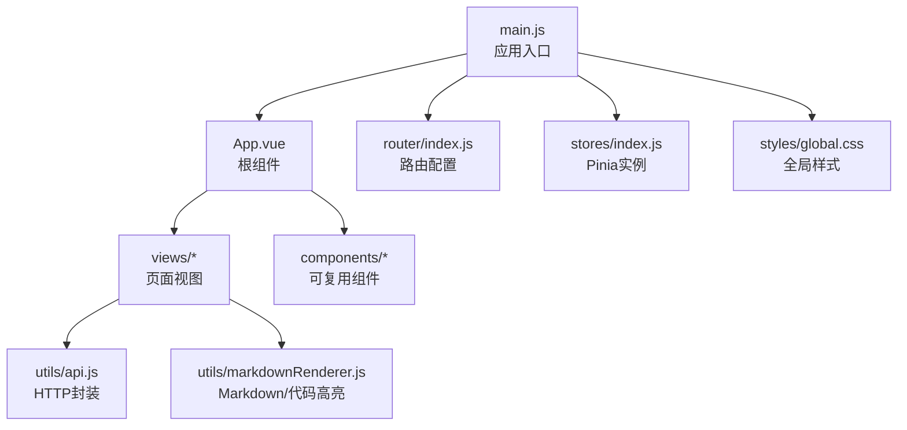

**图表来源**
- [main.js:1-89](file://frontend/src/main.js#L1-L89)
- [App.vue:1-384](file://frontend/src/App.vue#L1-L384)
- [router/index.js:1-157](file://frontend/src/router/index.js#L1-L157)
- [stores/index.js:1-30](file://frontend/src/stores/index.js#L1-L30)
- [utils/api.js:1-303](file://frontend/src/utils/api.js#L1-L303)
- [utils/markdownRenderer.js:1-258](file://frontend/src/utils/markdownRenderer.js#L1-L258)
- [styles/global.css:1-317](file://frontend/src/styles/global.css#L1-L317)

**章节来源**
- [main.js:1-89](file://frontend/src/main.js#L1-L89)
- [package.json:1-36](file://frontend/package.json#L1-L36)

## 核心组件
- 根组件 App.vue：提供侧边栏导航、会话列表、主内容区与 Schema 查看弹窗，协调状态管理与路由跳转。
- 路由系统 router/index.js：定义页面路由、懒加载、滚动行为与全局前置守卫。
- 状态管理 stores/session.js：集中管理会话列表、当前会话、消息历史、SSE 连接与处理状态。
- 视图组件：
  - ChatView.vue：聊天对话界面，支持 Markdown 渲染、SQL 高亮、数据表格展示、SSE 流式输出。
  - HistoryView.vue：查询历史列表，支持筛选、分页与详情弹窗。
  - MemoryView.vue：长期记忆管理，按类型分组展示字段别名、查询模式、指标与维度偏好。
  - SchemaView.vue：Schema 完整页面，按标签页展示表结构、指标、维度与表关系。
  - SchemaViewer.vue：Schema 查看弹窗，支持搜索、折叠面板与关联关系展示。
- 工具模块：
  - api.js：基于 axios 的 API 封装，统一请求/响应拦截与错误处理。
  - markdownRenderer.js：集成 markdown-it、Shiki、Mermaid、KaTeX 的渲染工具。
- 全局样式 global.css：基础重置、工具类、Element Plus 自定义样式与动画。

**章节来源**
- [App.vue:1-384](file://frontend/src/App.vue#L1-L384)
- [router/index.js:1-157](file://frontend/src/router/index.js#L1-L157)
- [stores/session.js:1-400](file://frontend/src/stores/session.js#L1-L400)
- [views/ChatView.vue:1-778](file://frontend/src/views/ChatView.vue#L1-L778)
- [views/HistoryView.vue:1-441](file://frontend/src/views/HistoryView.vue#L1-L441)
- [views/MemoryView.vue:1-511](file://frontend/src/views/MemoryView.vue#L1-L511)
- [views/SchemaView.vue:1-322](file://frontend/src/views/SchemaView.vue#L1-L322)
- [components/SchemaViewer.vue:1-317](file://frontend/src/components/SchemaViewer.vue#L1-L317)
- [utils/api.js:1-303](file://frontend/src/utils/api.js#L1-L303)
- [utils/markdownRenderer.js:1-258](file://frontend/src/utils/markdownRenderer.js#L1-L258)
- [styles/global.css:1-317](file://frontend/src/styles/global.css#L1-L317)

## 架构总览
应用采用“入口 -> 根组件 -> 视图 -> 工具”的分层架构：
- 入口层：main.js 安装插件（路由、状态管理、UI）、注册全局图标、挂载应用。
- 视图层：各页面视图通过 Composition API 与 Pinia store 交互，使用 Element Plus 组件与自定义渲染器。
- 状态层：Pinia store 管理会话、消息、SSE 连接与处理状态；store 内部封装 API 调用。
- 工具层：API 封装统一错误处理；Markdown 渲染器提供富文本与代码高亮能力。

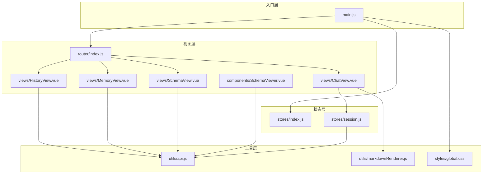

**图表来源**
- [main.js:1-89](file://frontend/src/main.js#L1-L89)
- [router/index.js:1-157](file://frontend/src/router/index.js#L1-L157)
- [stores/index.js:1-30](file://frontend/src/stores/index.js#L1-L30)
- [stores/session.js:1-400](file://frontend/src/stores/session.js#L1-L400)
- [views/ChatView.vue:1-778](file://frontend/src/views/ChatView.vue#L1-L778)
- [views/HistoryView.vue:1-441](file://frontend/src/views/HistoryView.vue#L1-L441)
- [views/MemoryView.vue:1-511](file://frontend/src/views/MemoryView.vue#L1-L511)
- [views/SchemaView.vue:1-322](file://frontend/src/views/SchemaView.vue#L1-L322)
- [components/SchemaViewer.vue:1-317](file://frontend/src/components/SchemaViewer.vue#L1-L317)
- [utils/api.js:1-303](file://frontend/src/utils/api.js#L1-L303)
- [utils/markdownRenderer.js:1-258](file://frontend/src/utils/markdownRenderer.js#L1-L258)
- [styles/global.css:1-317](file://frontend/src/styles/global.css#L1-L317)

## 详细组件分析

### 聊天界面（ChatView.vue）
- 功能要点
  - 消息列表渲染：区分用户与助手消息，支持长文本折叠/展开。
  - Markdown 渲染：使用 markdown-it 与 KaTeX、Mermaid、Shiki 高亮。
  - SQL 展示：支持复制 SQL、表格展示查询结果。
  - SSE 流式处理：连接后端流式接口，接收处理状态、进度与最终结果。
  - 输入交互：支持 Enter 发送、Shift+Enter 换行，禁用无效输入。
- 关键流程（发送查询）
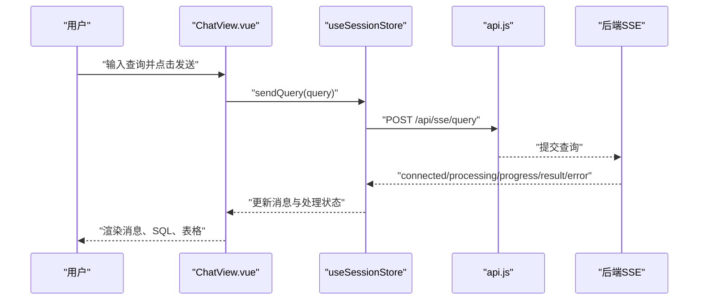

**图表来源**
- [views/ChatView.vue:196-214](file://frontend/src/views/ChatView.vue#L196-L214)
- [stores/session.js:297-330](file://frontend/src/stores/session.js#L297-L330)
- [utils/api.js:246-251](file://frontend/src/utils/api.js#L246-L251)

**章节来源**
- [views/ChatView.vue:1-778](file://frontend/src/views/ChatView.vue#L1-L778)
- [stores/session.js:1-400](file://frontend/src/stores/session.js#L1-L400)
- [utils/api.js:1-303](file://frontend/src/utils/api.js#L1-L303)
- [utils/markdownRenderer.js:1-258](file://frontend/src/utils/markdownRenderer.js#L1-L258)

### 历史记录（HistoryView.vue）
- 功能要点
  - 列表展示：查询内容、状态、执行时间、返回行数。
  - 筛选与分页：支持按内容、状态、日期范围筛选与分页。
  - 详情弹窗：展示生成 SQL、错误信息、执行统计。
- 关键流程（加载历史）
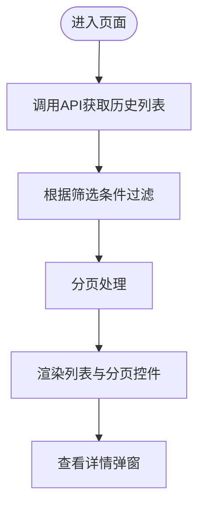

**图表来源**
- [views/HistoryView.vue:226-243](file://frontend/src/views/HistoryView.vue#L226-L243)
- [views/HistoryView.vue:190-217](file://frontend/src/views/HistoryView.vue#L190-L217)
- [utils/api.js:206-208](file://frontend/src/utils/api.js#L206-L208)

**章节来源**
- [views/HistoryView.vue:1-441](file://frontend/src/views/HistoryView.vue#L1-L441)
- [utils/api.js:1-303](file://frontend/src/utils/api.js#L1-L303)

### 内存管理（MemoryView.vue）
- 功能要点
  - 用户选择：输入用户 ID，加载长期记忆数据。
  - 统计卡片：总记录数、字段别名、查询模式、常用指标、常用维度。
  - 类型筛选：按字段别名、查询模式、指标、维度四类展示表格。
  - 原始数据：JSON 形式展示原始数据。
- 关键流程（加载与删除）
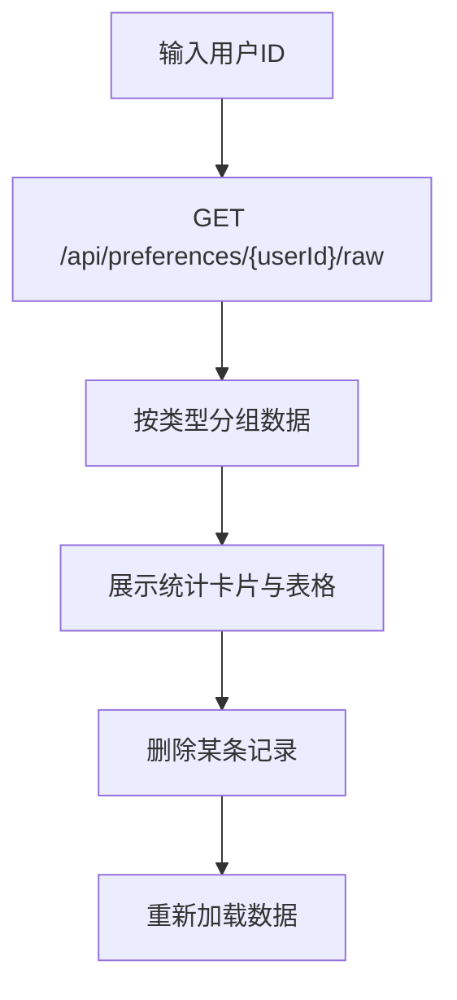

**图表来源**
- [views/MemoryView.vue:212-228](file://frontend/src/views/MemoryView.vue#L212-L228)
- [views/MemoryView.vue:230-243](file://frontend/src/views/MemoryView.vue#L230-L243)

**章节来源**
- [views/MemoryView.vue:1-511](file://frontend/src/views/MemoryView.vue#L1-L511)

### Schema 查看（SchemaView.vue 与 SchemaViewer.vue）
- 功能要点
  - SchemaView.vue：完整页面，按标签页展示表结构、指标、维度、表关系。
  - SchemaViewer.vue：弹窗组件，支持搜索、折叠面板、关联关系展示。
- 关键流程（弹窗搜索与展开）
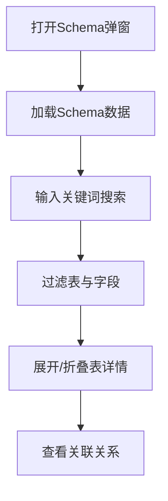

**图表来源**
- [views/SchemaView.vue:185-192](file://frontend/src/views/SchemaView.vue#L185-L192)
- [components/SchemaViewer.vue:191-208](file://frontend/src/components/SchemaViewer.vue#L191-L208)
- [components/SchemaViewer.vue:157-182](file://frontend/src/components/SchemaViewer.vue#L157-L182)
- [components/SchemaViewer.vue:215-230](file://frontend/src/components/SchemaViewer.vue#L215-L230)

**章节来源**
- [views/SchemaView.vue:1-322](file://frontend/src/views/SchemaView.vue#L1-L322)
- [components/SchemaViewer.vue:1-317](file://frontend/src/components/SchemaViewer.vue#L1-L317)
- [utils/api.js:1-303](file://frontend/src/utils/api.js#L1-L303)

### 根组件与侧边栏（App.vue）
- 功能要点
  - 侧边栏：Logo、新建会话、历史会话列表、底部工具栏（Schema、长期记忆、评估、设置、侧边栏开关）。
  - 会话管理：创建、切换、删除会话，路由跳转到对应聊天页面。
  - Schema 弹窗：统一入口打开 Schema 查看。
- 关键流程（创建/切换/删除会话）
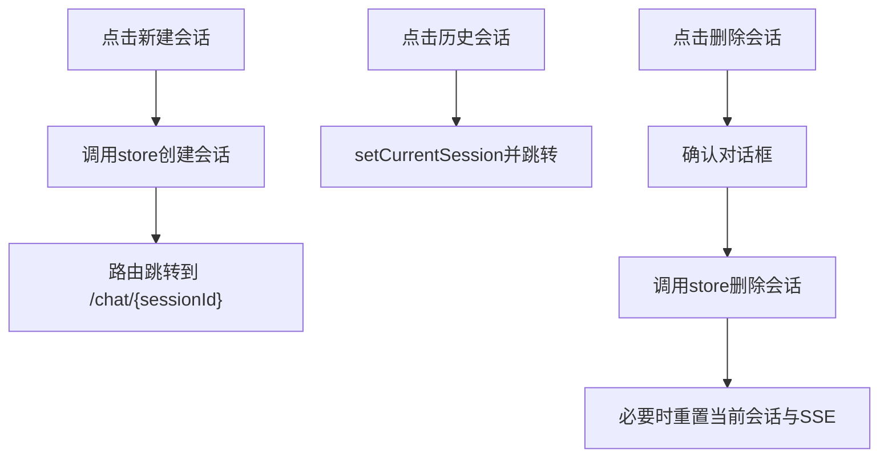

**图表来源**
- [App.vue:176-186](file://frontend/src/App.vue#L176-L186)
- [App.vue:192-200](file://frontend/src/App.vue#L192-L200)
- [App.vue:206-228](file://frontend/src/App.vue#L206-L228)
- [stores/session.js:118-138](file://frontend/src/stores/session.js#L118-L138)
- [stores/session.js:144-155](file://frontend/src/stores/session.js#L144-L155)
- [stores/session.js:347-370](file://frontend/src/stores/session.js#L347-L370)

**章节来源**
- [App.vue:1-384](file://frontend/src/App.vue#L1-L384)
- [stores/session.js:1-400](file://frontend/src/stores/session.js#L1-L400)

### 状态管理（Pinia Store）
- useSessionStore
  - State：sessions、currentSessionId、messages、sseConnection、isConnected、isProcessing、processingStatus、processingProgress。
  - Getters：currentSession、messageCount。
  - Actions：loadSessions、createSession、setCurrentSession、loadMessages、addMessage、connectSSE、sendQuery、disconnectSSE、deleteSession。
- 状态与视图交互
  - ChatView 通过 computed 读取 store 的 messages/isProcessing 等响应式状态。
  - App.vue 通过 store 管理会话列表与当前会话。
- 关键流程（SSE 消息处理）
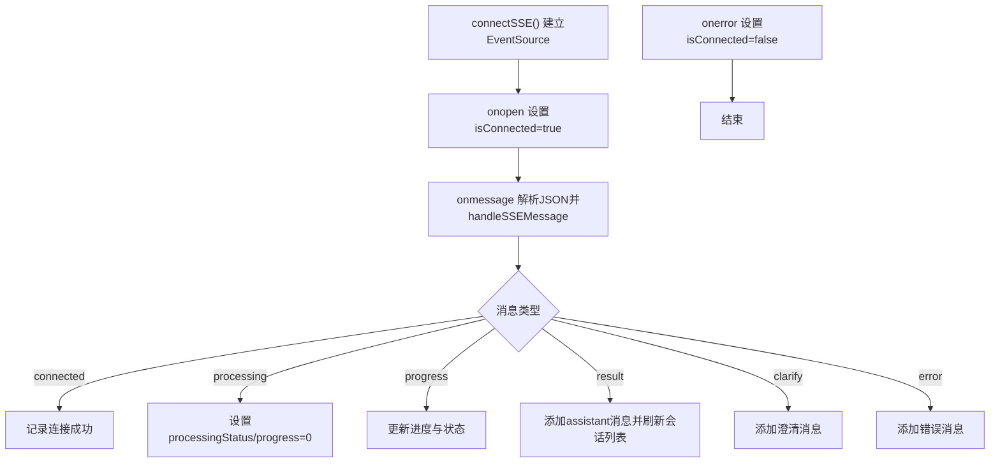

**图表来源**
- [stores/session.js:185-221](file://frontend/src/stores/session.js#L185-L221)
- [stores/session.js:227-295](file://frontend/src/stores/session.js#L227-L295)

**章节来源**
- [stores/session.js:1-400](file://frontend/src/stores/session.js#L1-L400)

### 路由配置（router/index.js）
- 路由规则：首页、聊天（带会话参数）、历史、Schema、长期记忆、评估、404。
- 懒加载：HistoryView、SchemaView、MemoryView、EvaluationView。
- 全局守卫：设置页面标题。
- 滚动行为：返回顶部或恢复滚动位置。
- 关键流程（路由守卫）
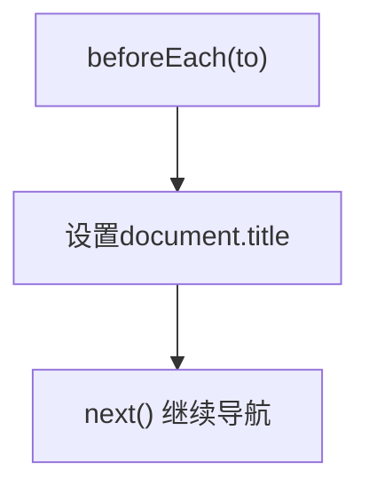

**图表来源**
- [router/index.js:142-150](file://frontend/src/router/index.js#L142-L150)
- [router/index.js:124-132](file://frontend/src/router/index.js#L124-L132)

**章节来源**
- [router/index.js:1-157](file://frontend/src/router/index.js#L1-L157)

### API 封装（utils/api.js）
- axios 实例：baseURL="/api"、timeout、默认请求头。
- 请求/响应拦截：统一错误处理与数据透传。
- 接口覆盖：健康检查、Schema、会话、查询历史、统计、配置、SSE 查询、评估相关。
- 关键流程（统一错误处理）
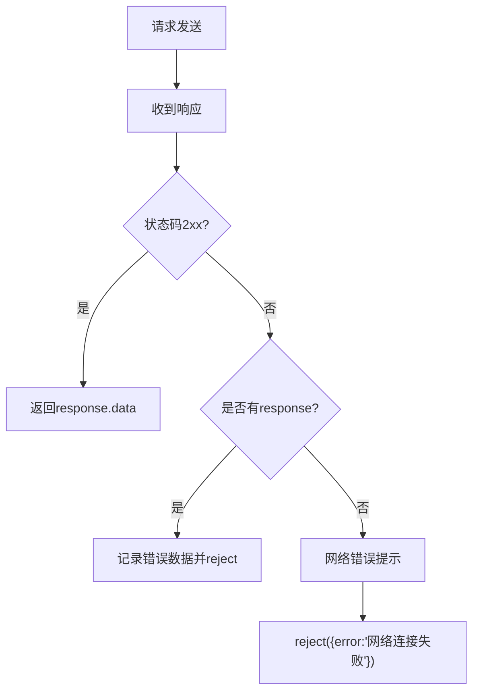

**图表来源**
- [utils/api.js:67-88](file://frontend/src/utils/api.js#L67-L88)

**章节来源**
- [utils/api.js:1-303](file://frontend/src/utils/api.js#L1-L303)

### Markdown 渲染（utils/markdownRenderer.js）
- 集成：markdown-it、Shiki、Mermaid、KaTeX。
- 特性：行内/块级数学公式、Mermaid 图表、SQL/多语言代码高亮。
- 关键流程（渲染与高亮）
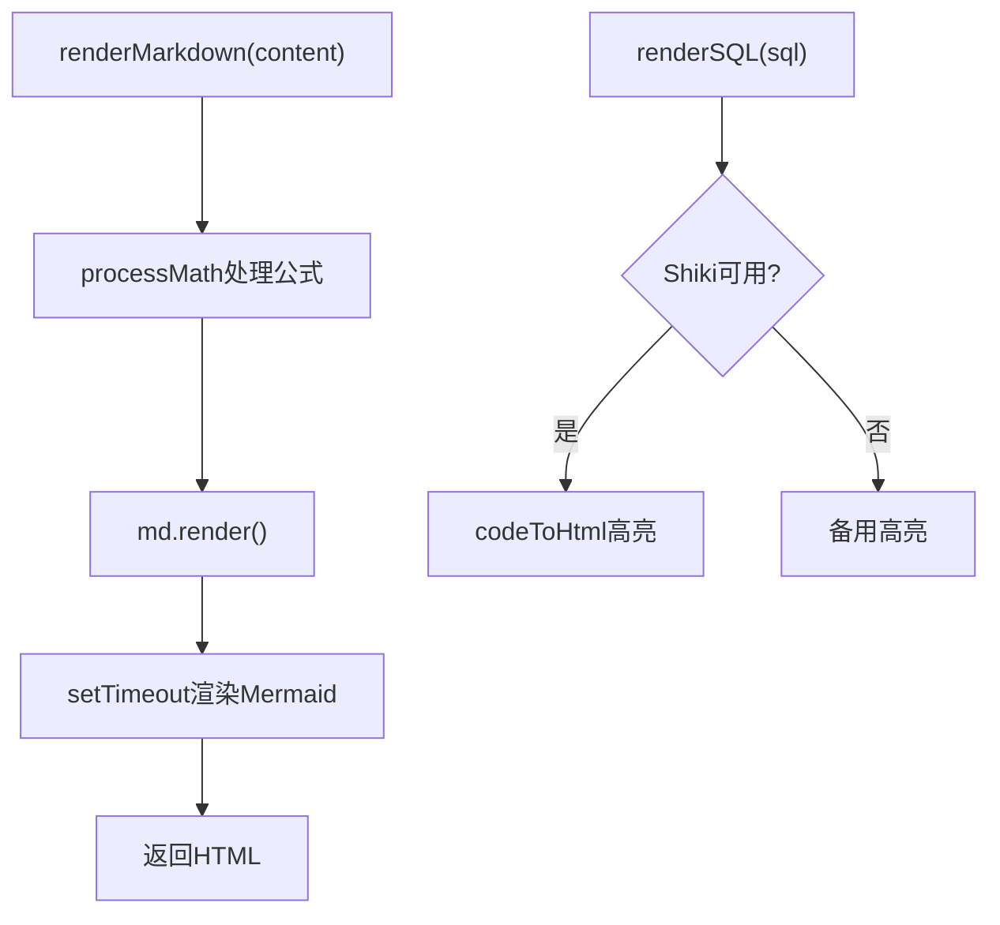

**图表来源**
- [utils/markdownRenderer.js:181-196](file://frontend/src/utils/markdownRenderer.js#L181-L196)
- [utils/markdownRenderer.js:203-220](file://frontend/src/utils/markdownRenderer.js#L203-L220)

**章节来源**
- [utils/markdownRenderer.js:1-258](file://frontend/src/utils/markdownRenderer.js#L1-L258)

## 依赖分析
- 核心依赖
  - Vue 3、Vue Router、Pinia：应用框架与状态管理。
  - Element Plus：UI 组件库与图标。
  - axios：HTTP 客户端。
  - markdown-it、shiki、mermaid、katex：富文本与代码高亮。
  - dayjs：日期处理。
  - uuid：会话ID生成。
- 开发依赖
  - vite、@vitejs/plugin-vue、sass：构建与样式支持。

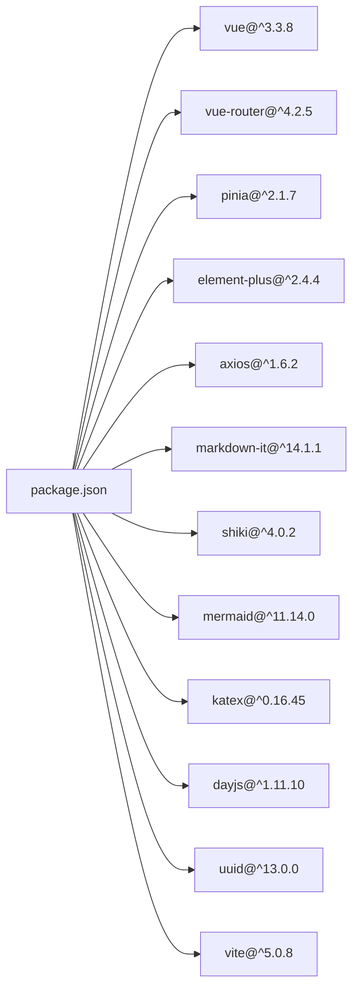

**图表来源**
- [package.json:11-34](file://frontend/package.json#L11-L34)

**章节来源**
- [package.json:1-36](file://frontend/package.json#L1-L36)

## 性能考虑
- 渲染优化
  - ChatView 使用虚拟滚动与懒加载（HistoryView 的分页）减少 DOM 压力。
  - Markdown 渲染延迟触发 Mermaid 渲染，避免阻塞主线程。
- 状态与网络
  - Pinia store 将消息与 SSE 状态集中管理，避免重复请求。
  - API 封装统一错误处理，减少异常分支导致的重渲染。
- 资源加载
  - 路由懒加载与组件按需加载，降低首屏体积。
  - Element Plus 图标全局注册，避免重复导入。

[本节为通用建议，无需特定文件来源]

## 故障排查指南
- 会话无法创建/切换
  - 检查后端健康状态与会话接口连通性。
  - 查看控制台错误日志与 Element Plus 消息提示。
- SSE 不工作
  - 确认后端 SSE 端点与会话ID正确传递。
  - 检查浏览器 EventSource 支持与跨域配置。
- Markdown/代码高亮异常
  - Shiki 初始化失败时回退到简单高亮，确认网络可达与依赖版本。
  - Mermaid 渲染失败时查看控制台错误并检查图表语法。
- 路由跳转问题
  - 确认路由守卫未拦截导航，检查 meta.requiresSession 配置。
- Schema 查看空白
  - 确认 Schema API 返回数据结构一致，检查过滤逻辑与搜索关键词。

**章节来源**
- [stores/session.js:185-221](file://frontend/src/stores/session.js#L185-L221)
- [utils/api.js:67-88](file://frontend/src/utils/api.js#L67-L88)
- [utils/markdownRenderer.js:160-170](file://frontend/src/utils/markdownRenderer.js#L160-L170)

## 结论
该前端应用以 Vue 3 为核心，结合 Element Plus、Pinia、Vue Router 与自研工具模块，构建了完整的 NL2SQL 交互体验。通过清晰的组件分层、统一的状态管理与 API 封装，实现了从聊天对话到历史记录、Schema 查看与长期记忆管理的完整闭环。建议后续持续优化渲染性能、增强错误兜底与国际化支持，并完善组件文档与测试覆盖率。

[本节为总结，无需特定文件来源]

## 附录
- 组件开发指南与最佳实践
  - 使用 Composition API 与 <script setup> 语法，保持响应式状态与副作用分离。
  - 将 UI 与业务逻辑解耦，优先通过 Pinia store 管理全局状态。
  - 对外暴露稳定 API，内部实现可演进；对外接口通过 utils/api.js 统一封装。
  - 合理使用 Element Plus 组件与图标，避免过度自定义破坏一致性。
  - 为复杂渲染（Markdown/代码高亮）提供降级方案，保证可用性。
  - 为长列表与大表格提供分页/懒加载策略，避免一次性渲染过多节点。
  - 为异步操作提供明确的加载态与错误提示，提升用户体验。
- 使用示例
  - 在视图组件中通过 useSessionStore 读取 messages 与 isProcessing，驱动 UI 更新。
  - 通过 router.push 编程式导航跳转到指定会话或页面。
  - 通过 api.js 的封装函数发起请求，统一处理错误与提示。

[本节为通用指导，无需特定文件来源]