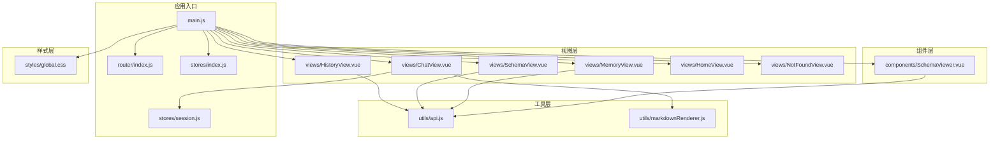
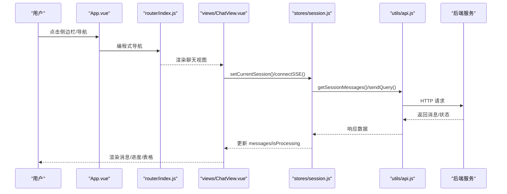
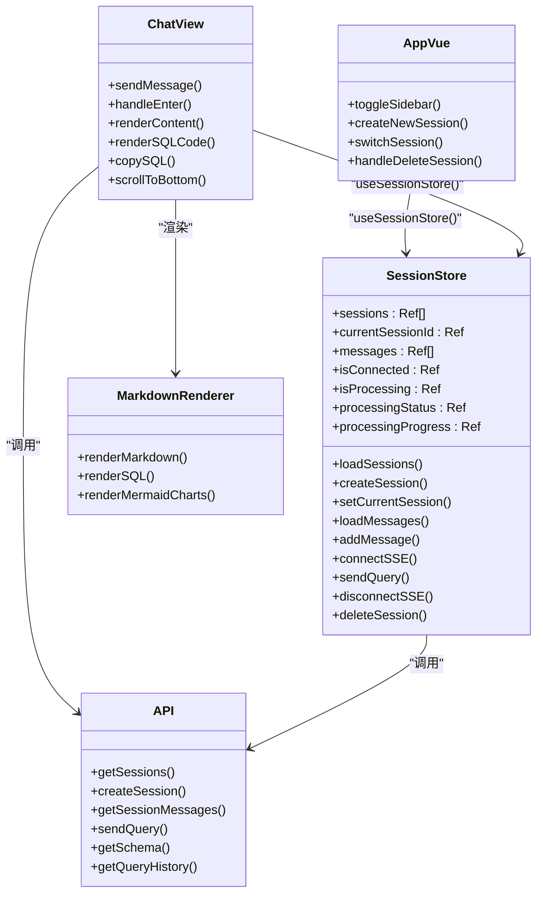
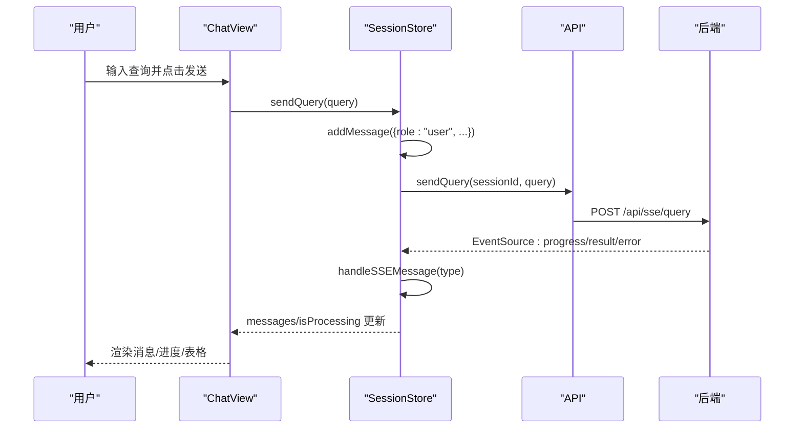
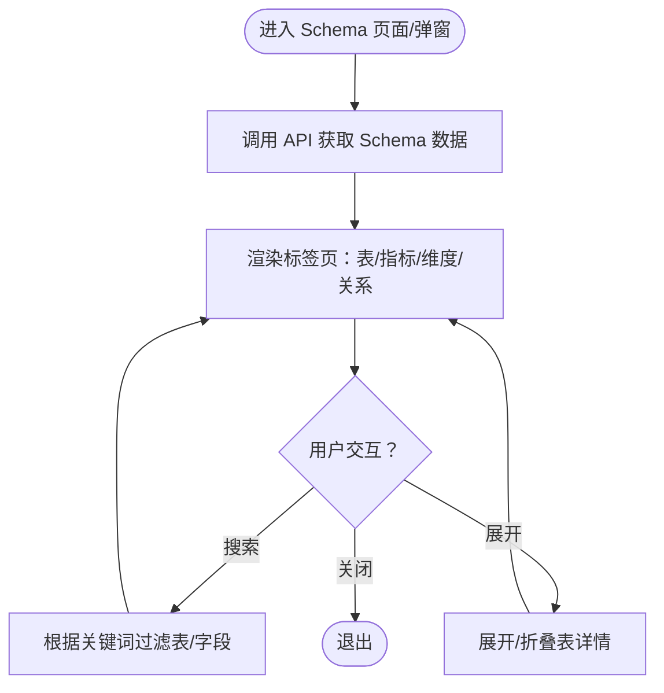
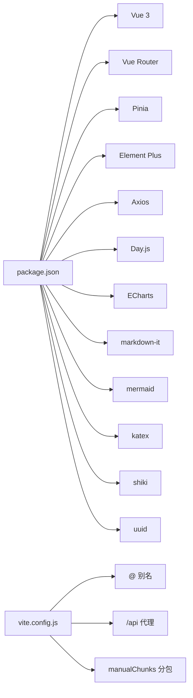

# 前端应用

<cite>
**本文档引用的文件**
- [main.js](file://frontend/src/main.js)
- [App.vue](file://frontend/src/App.vue)
- [router/index.js](file://frontend/src/router/index.js)
- [stores/index.js](file://frontend/src/stores/index.js)
- [stores/session.js](file://frontend/src/stores/session.js)
- [views/ChatView.vue](file://frontend/src/views/ChatView.vue)
- [views/HistoryView.vue](file://frontend/src/views/HistoryView.vue)
- [views/MemoryView.vue](file://frontend/src/views/MemoryView.vue)
- [views/SchemaView.vue](file://frontend/src/views/SchemaView.vue)
- [views/HomeView.vue](file://frontend/src/views/HomeView.vue)
- [views/NotFoundView.vue](file://frontend/src/views/NotFoundView.vue)
- [components/SchemaViewer.vue](file://frontend/src/components/SchemaViewer.vue)
- [utils/api.js](file://frontend/src/utils/api.js)
- [utils/markdownRenderer.js](file://frontend/src/utils/markdownRenderer.js)
- [styles/global.css](file://frontend/src/styles/global.css)
- [vite.config.js](file://frontend/vite.config.js)
- [package.json](file://frontend/package.json)
</cite>

## 目录
1. [简介](#简介)
2. [项目结构](#项目结构)
3. [核心组件](#核心组件)
4. [架构总览](#架构总览)
5. [详细组件分析](#详细组件分析)
6. [依赖关系分析](#依赖关系分析)
7. [性能考量](#性能考量)
8. [故障排查指南](#故障排查指南)
9. [结论](#结论)
10. [附录](#附录)

## 简介
本项目是一个基于 Vue 3 的单页应用（SPA），围绕 NL2SQL 自然语言转 SQL 的核心能力构建，提供聊天交互、Schema 查看、历史记录与长期记忆管理等功能。应用采用 Composition API 与 `<script setup>` 语法，结合 Pinia 进行状态管理，通过 Element Plus 提供 UI 组件，借助 Axios 进行 API 通信，并集成多种富文本与可视化渲染能力（Markdown、Mermaid、KaTeX、Shiki）。后端通过 SSE 提供流式数据同步，前端负责建立连接、接收消息并驱动界面状态。

## 项目结构
前端工程位于 frontend 目录，采用“按功能分层 + 视图驱动”的组织方式：
- 入口与插件安装：main.js 负责创建应用、安装路由、Pinia、Element Plus 并挂载。
- 路由：router/index.js 定义页面路由与守卫。
- 状态管理：stores/index.js 创建 Pinia 实例；stores/session.js 定义会话相关状态与动作。
- 视图：views 下包含各页面组件（聊天、历史、Schema、记忆、首页、404）。
- 组件：components 下包含可复用组件（如 SchemaViewer）。
- 工具：utils 下封装 API 与 Markdown 渲染工具。
- 样式：styles 下放置全局样式与主题变量。
- 构建：vite.config.js 配置开发服务器、代理、路径别名与代码分割。
- 依赖：package.json 管理运行时与开发依赖。

**图表来源**
- [main.js:1-89](file://frontend/src/main.js#L1-L89)
- [router/index.js:1-157](file://frontend/src/router/index.js#L1-L157)
- [stores/index.js:1-30](file://frontend/src/stores/index.js#L1-L30)
- [stores/session.js:1-400](file://frontend/src/stores/session.js#L1-L400)
- [views/ChatView.vue:1-778](file://frontend/src/views/ChatView.vue#L1-L778)
- [views/HistoryView.vue:1-441](file://frontend/src/views/HistoryView.vue#L1-L441)
- [views/SchemaView.vue:1-322](file://frontend/src/views/SchemaView.vue#L1-L322)
- [views/MemoryView.vue:1-511](file://frontend/src/views/MemoryView.vue#L1-L511)
- [components/SchemaViewer.vue:1-317](file://frontend/src/components/SchemaViewer.vue#L1-L317)
- [utils/api.js:1-303](file://frontend/src/utils/api.js#L1-L303)
- [utils/markdownRenderer.js:1-258](file://frontend/src/utils/markdownRenderer.js#L1-L258)
- [styles/global.css:1-317](file://frontend/src/styles/global.css#L1-L317)

**章节来源**
- [main.js:1-89](file://frontend/src/main.js#L1-L89)
- [router/index.js:1-157](file://frontend/src/router/index.js#L1-L157)
- [vite.config.js:1-93](file://frontend/vite.config.js#L1-L93)
- [package.json:1-36](file://frontend/package.json#L1-L36)

## 核心组件
- 应用入口与插件安装：创建 Vue 应用实例，安装路由、Pinia、Element Plus，注册全局图标，挂载到 DOM。
- 根组件 App.vue：提供侧边栏导航、会话列表、主内容区与 Schema 查看弹窗，协调会话状态与路由跳转。
- 路由系统：定义首页、聊天、历史、Schema、记忆、评估、404 等页面，设置标题与滚动行为。
- Pinia 状态管理：stores/index.js 创建 Pinia 实例；stores/session.js 管理会话列表、当前会话、消息、SSE 连接与处理状态。
- 视图组件：
  - ChatView.vue：聊天对话界面，支持 Markdown/SQL/表格渲染、长消息折叠、SSE 流式处理。
  - HistoryView.vue：查询历史列表，支持筛选、分页、详情查看与复制。
  - SchemaView.vue：Schema 完整展示，含表结构、指标、维度、关系四类标签页。
  - MemoryView.vue：长期记忆管理，按类型分组展示字段别名、查询模式、指标/维度偏好。
- 可复用组件：SchemaViewer.vue 以弹窗形式展示 Schema，支持搜索与折叠。
- 工具模块：
  - api.js：Axios 封装，统一请求/响应拦截与错误处理，暴露会话、Schema、查询历史、SSE 等接口。
  - markdownRenderer.js：集成 markdown-it、Mermaid、KaTeX、Shiki，提供 Markdown、SQL 与图表渲染能力。
- 全局样式：global.css 提供基础重置、工具类、Element Plus 自定义样式与动画。

**章节来源**
- [main.js:1-89](file://frontend/src/main.js#L1-L89)
- [App.vue:1-384](file://frontend/src/App.vue#L1-L384)
- [router/index.js:1-157](file://frontend/src/router/index.js#L1-L157)
- [stores/index.js:1-30](file://frontend/src/stores/index.js#L1-L30)
- [stores/session.js:1-400](file://frontend/src/stores/session.js#L1-L400)
- [views/ChatView.vue:1-778](file://frontend/src/views/ChatView.vue#L1-L778)
- [views/HistoryView.vue:1-441](file://frontend/src/views/HistoryView.vue#L1-L441)
- [views/SchemaView.vue:1-322](file://frontend/src/views/SchemaView.vue#L1-L322)
- [views/MemoryView.vue:1-511](file://frontend/src/views/MemoryView.vue#L1-L511)
- [components/SchemaViewer.vue:1-317](file://frontend/src/components/SchemaViewer.vue#L1-L317)
- [utils/api.js:1-303](file://frontend/src/utils/api.js#L1-L303)
- [utils/markdownRenderer.js:1-258](file://frontend/src/utils/markdownRenderer.js#L1-L258)
- [styles/global.css:1-317](file://frontend/src/styles/global.css#L1-L317)

## 架构总览
应用采用“入口 -> 路由 -> 视图/组件 -> 工具/状态”的分层架构，核心交互链路如下：

**图表来源**
- [App.vue:140-240](file://frontend/src/App.vue#L140-L240)
- [router/index.js:118-150](file://frontend/src/router/index.js#L118-L150)
- [views/ChatView.vue:333-361](file://frontend/src/views/ChatView.vue#L333-L361)
- [stores/session.js:144-171](file://frontend/src/stores/session.js#L144-L171)
- [utils/api.js:246-251](file://frontend/src/utils/api.js#L246-L251)

## 详细组件分析

### 组件层次与职责
- 入口与插件安装：负责应用初始化、插件注册与挂载。
- 根组件 App.vue：布局与导航，维护会话列表与当前会话，触发路由跳转与弹窗控制。
- 路由系统：集中定义页面与守卫，设置标题与滚动行为。
- 状态管理：Pinia Store 聚合会话、消息、SSE 连接与处理状态，提供 actions 与 getters。
- 视图组件：各自承载页面业务逻辑，依赖 Store 与工具模块。
- 可复用组件：SchemaViewer 作为弹窗组件，复用 API 与搜索过滤逻辑。
- 工具模块：API 封装与拦截器；Markdown 渲染器集成多格式渲染。

**图表来源**
- [App.vue:115-228](file://frontend/src/App.vue#L115-L228)
- [stores/session.js:33-399](file://frontend/src/stores/session.js#L33-L399)
- [views/ChatView.vue:132-383](file://frontend/src/views/ChatView.vue#L132-L383)
- [utils/api.js:98-302](file://frontend/src/utils/api.js#L98-L302)
- [utils/markdownRenderer.js:181-246](file://frontend/src/utils/markdownRenderer.js#L181-L246)

**章节来源**
- [App.vue:1-384](file://frontend/src/App.vue#L1-L384)
- [stores/session.js:1-400](file://frontend/src/stores/session.js#L1-L400)
- [views/ChatView.vue:1-778](file://frontend/src/views/ChatView.vue#L1-L778)
- [utils/api.js:1-303](file://frontend/src/utils/api.js#L1-L303)
- [utils/markdownRenderer.js:1-258](file://frontend/src/utils/markdownRenderer.js#L1-L258)

### 聊天界面（ChatView）
- 功能要点
  - 消息渲染：支持 Markdown、SQL 代码高亮、Mermaid 图表、KaTeX 公式、表格展示。
  - 交互体验：长消息折叠/展开、输入框 Enter 发送、Shift+Enter 换行、自动滚动到底部。
  - 实时通信：通过 SSE 接收后端流式消息，更新处理状态、进度与最终结果。
  - 会话管理：监听路由参数变化，切换会话并重建连接。
- 关键流程（发送查询）

**图表来源**
- [views/ChatView.vue:196-214](file://frontend/src/views/ChatView.vue#L196-L214)
- [stores/session.js:301-330](file://frontend/src/stores/session.js#L301-L330)
- [utils/api.js:246-251](file://frontend/src/utils/api.js#L246-L251)

**章节来源**
- [views/ChatView.vue:1-778](file://frontend/src/views/ChatView.vue#L1-L778)
- [stores/session.js:185-295](file://frontend/src/stores/session.js#L185-L295)
- [utils/api.js:246-251](file://frontend/src/utils/api.js#L246-L251)

### Schema 查看（SchemaView 与 SchemaViewer）
- SchemaView：完整页面，按标签页展示表结构、指标、维度、关系。
- SchemaViewer：弹窗组件，支持搜索、折叠、关联关系展示。
- 两者均通过 API 获取 Schema 数据并在组件内渲染。

**图表来源**
- [views/SchemaView.vue:185-200](file://frontend/src/views/SchemaView.vue#L185-L200)
- [components/SchemaViewer.vue:191-208](file://frontend/src/components/SchemaViewer.vue#L191-L208)
- [utils/api.js:118-120](file://frontend/src/utils/api.js#L118-L120)

**章节来源**
- [views/SchemaView.vue:1-322](file://frontend/src/views/SchemaView.vue#L1-L322)
- [components/SchemaViewer.vue:1-317](file://frontend/src/components/SchemaViewer.vue#L1-L317)
- [utils/api.js:118-120](file://frontend/src/utils/api.js#L118-L120)

### 历史记录（HistoryView）
- 功能要点：分页加载历史、关键词/状态/日期范围筛选、查看详情弹窗、复制查询。
- 性能考虑：Skeleton 占位、懒加载与分页避免一次性渲染大量数据。

**章节来源**
- [views/HistoryView.vue:1-441](file://frontend/src/views/HistoryView.vue#L1-L441)
- [utils/api.js:206-208](file://frontend/src/utils/api.js#L206-L208)

### 长期记忆（MemoryView）
- 功能要点：按用户 ID 加载记忆数据，按类型分组展示字段别名、查询模式、指标/维度偏好，支持删除与原始 JSON 查看。
- 技术要点：使用 axios 直接请求 /api/preferences/{userId}/raw 与删除接口。

**章节来源**
- [views/MemoryView.vue:1-511](file://frontend/src/views/MemoryView.vue#L1-L511)

### 根组件与路由（App.vue 与 router/index.js）
- App.vue：侧边栏、会话列表、导航与弹窗控制；与 Pinia 会话 Store 协作。
- router/index.js：定义页面路由、元信息与全局前置守卫（设置标题）。

**章节来源**
- [App.vue:1-384](file://frontend/src/App.vue#L1-L384)
- [router/index.js:1-157](file://frontend/src/router/index.js#L1-L157)

## 依赖关系分析
- 运行时依赖：Vue 3、Vue Router、Pinia、Element Plus、Axios、Day.js、ECharts、markdown-it、mermaid、katex、shiki、uuid。
- 开发依赖：Vite、@vitejs/plugin-vue、sass。
- 构建优化：Vite 配置了路径别名、代理、SCSS 自动导入 Element Plus 变量、手动分包（element-plus、echarts、vendor）。

**图表来源**
- [package.json:11-28](file://frontend/package.json#L11-L28)
- [vite.config.js:38-91](file://frontend/vite.config.js#L38-L91)

**章节来源**
- [package.json:1-36](file://frontend/package.json#L1-L36)
- [vite.config.js:1-93](file://frontend/vite.config.js#L1-L93)

## 性能考量
- 代码分割：将 Element Plus、ECharts/Vue-ECharts、Vue 生态库独立打包，减少首屏体积。
- 路由懒加载：HistoryView、MemoryView、EvaluationView 采用动态导入，按需加载。
- 渲染优化：ChatView 对长消息提供折叠与渐进渲染；HistoryView 使用 Skeleton 与分页。
- SSE 管理：ChatView 在组件卸载时断开连接，避免内存泄漏；Store 统一处理连接状态与错误。
- 样式与主题：全局样式与 Element Plus 变量注入，减少重复样式与主题切换成本。

**章节来源**
- [vite.config.js:78-91](file://frontend/vite.config.js#L78-L91)
- [router/index.js:63-99](file://frontend/src/router/index.js#L63-L99)
- [views/ChatView.vue:324-327](file://frontend/src/views/ChatView.vue#L324-L327)
- [stores/session.js:335-341](file://frontend/src/stores/session.js#L335-L341)

## 故障排查指南
- API 请求失败
  - 症状：控制台打印错误、消息提示“加载失败”或“网络连接失败”。
  - 排查：检查 /api 代理是否正确指向后端（vite.config.js），确认后端服务可用与 CORS 配置。
  - 参考：API 拦截器统一处理响应错误。
- SSE 连接异常
  - 症状：无法接收流式消息、处理状态不更新。
  - 排查：确认会话 ID 正确、后端 SSE 端点可用、浏览器 EventSource 支持。
  - 参考：Store 中 connectSSE/onerror/isConnected 状态。
- Markdown/图表渲染失败
  - 症状：Mermaid 图表不显示或报错。
  - 排查：确认渲染时机（nextTick/异步渲染）、Mermaid 初始化与主题配置。
  - 参考：markdownRenderer.js 的 renderMermaidCharts 与 renderMarkdown。
- 会话切换问题
  - 症状：切换会话后消息未刷新或连接未重建。
  - 排查：确认路由参数监听与 setCurrentSession/connectSSE 调用顺序。
  - 参考：ChatView 的 watch 与 initSession。

**章节来源**
- [utils/api.js:67-88](file://frontend/src/utils/api.js#L67-L88)
- [stores/session.js:185-221](file://frontend/src/stores/session.js#L185-L221)
- [utils/markdownRenderer.js:156-170](file://frontend/src/utils/markdownRenderer.js#L156-L170)
- [views/ChatView.vue:354-361](file://frontend/src/views/ChatView.vue#L354-L361)

## 结论
本前端应用以 Vue 3 为核心，结合 Pinia、Element Plus 与现代化构建工具，实现了 NL2SQL 的核心交互场景。通过清晰的组件分层、完善的 API 封装与富文本渲染能力，提供了良好的用户体验。SSE 机制与 Store 状态管理保证了实时数据同步与界面一致性。后续可在主题定制、国际化、离线缓存与性能监控方面进一步增强。

## 附录
- 组件开发指南
  - 使用 Composition API 与 `<script setup>`，将状态、方法与生命周期集中在同一文件，提升可读性。
  - 优先使用受控组件与计算属性，避免直接修改外部状态。
  - 对外暴露 v-model 或 props/emits，确保组件间解耦。
- 样式与主题
  - 使用全局样式与 Element Plus 变量注入，统一风格。
  - 通过工具类与 Flex 布局快速实现常见布局，避免重复定义。
- 浏览器兼容性
  - 确保 EventSource、IntersectionObserver、ResizeObserver 等现代 API 的降级或 polyfill。
  - 在移动端适配中注意触摸交互与滚动行为。