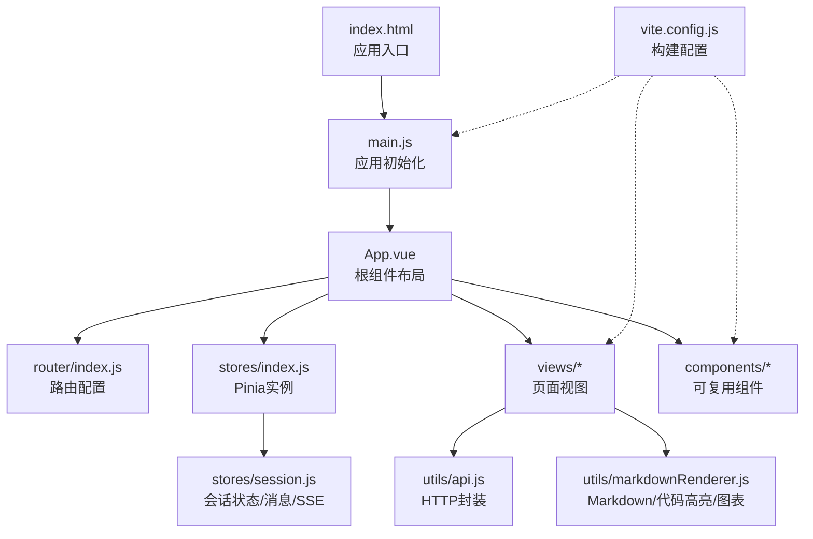
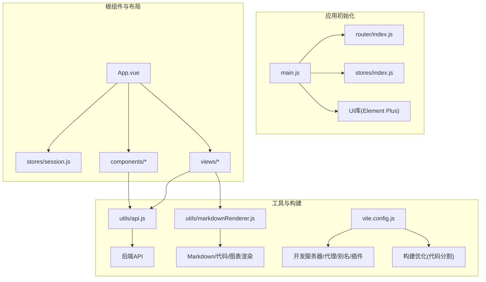
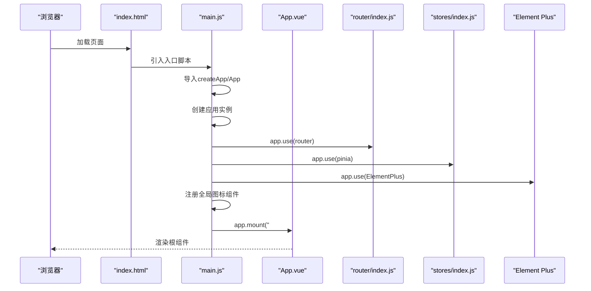
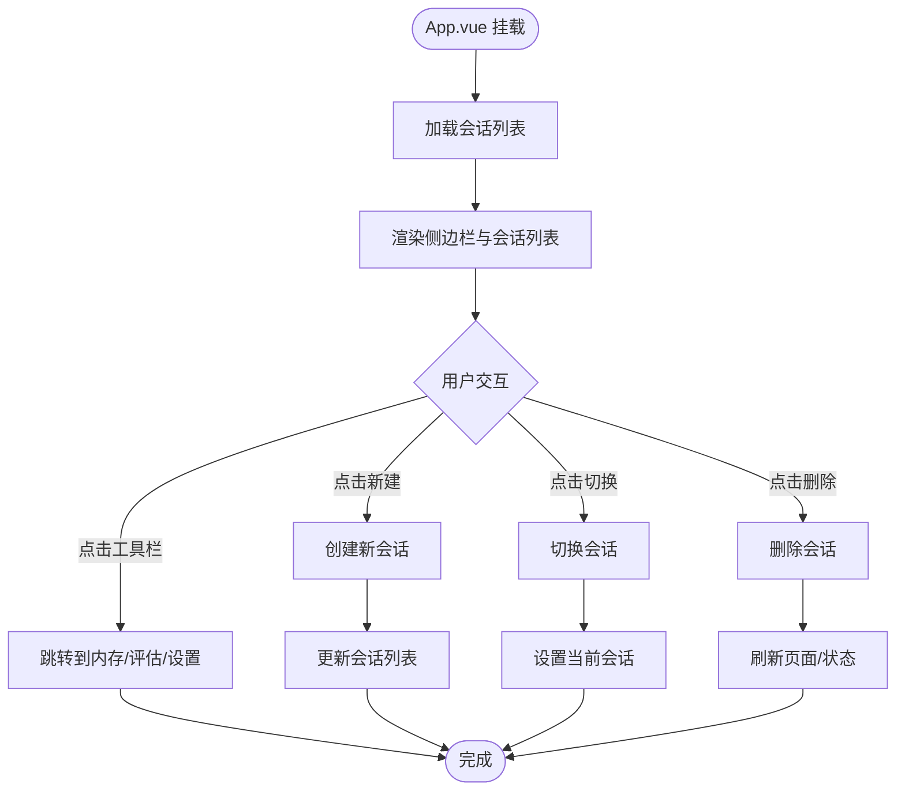
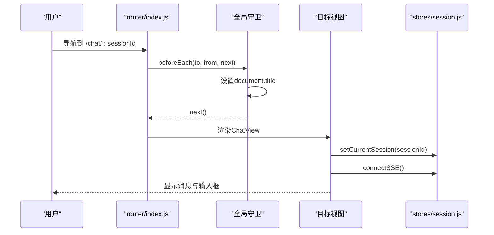
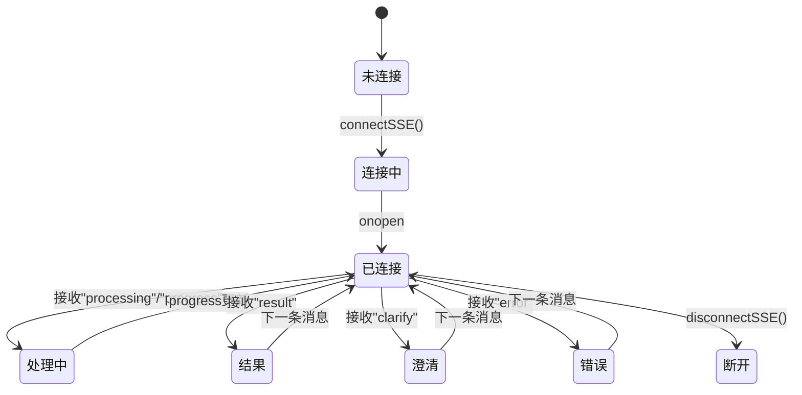
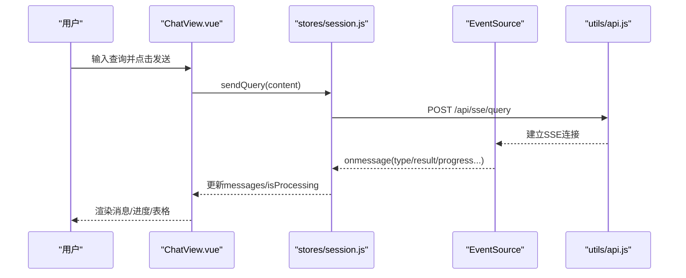
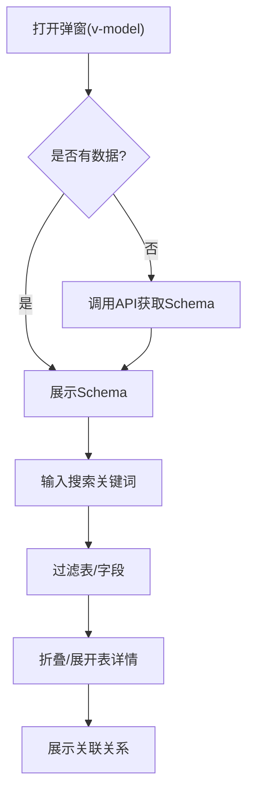
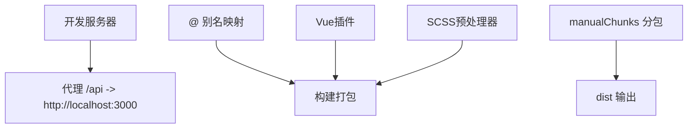
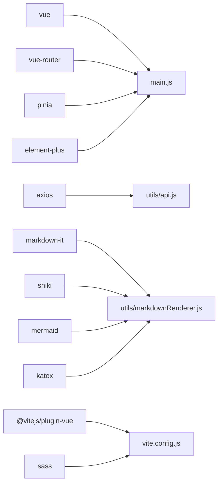

# 前端架构设计

<cite>
**本文档引用的文件**
- [main.js](file://frontend/src/main.js)
- [App.vue](file://frontend/src/App.vue)
- [vite.config.js](file://frontend/vite.config.js)
- [package.json](file://frontend/package.json)
- [index.html](file://frontend/index.html)
- [router/index.js](file://frontend/src/router/index.js)
- [stores/index.js](file://frontend/src/stores/index.js)
- [stores/session.js](file://frontend/src/stores/session.js)
- [styles/global.css](file://frontend/src/styles/global.css)
- [views/HomeView.vue](file://frontend/src/views/HomeView.vue)
- [views/ChatView.vue](file://frontend/src/views/ChatView.vue)
- [components/SchemaViewer.vue](file://frontend/src/components/SchemaViewer.vue)
- [utils/api.js](file://frontend/src/utils/api.js)
- [utils/markdownRenderer.js](file://frontend/src/utils/markdownRenderer.js)
</cite>

## 目录
1. [简介](#简介)
2. [项目结构](#项目结构)
3. [核心组件](#核心组件)
4. [架构总览](#架构总览)
5. [详细组件分析](#详细组件分析)
6. [依赖分析](#依赖分析)
7. [性能考量](#性能考量)
8. [故障排查指南](#故障排查指南)
9. [结论](#结论)
10. [附录](#附录)

## 简介
本文件面向前端架构师，系统性阐述NL2SQL前端Vue.js 3应用的整体架构设计与实现细节。重点覆盖应用入口初始化流程、根组件设计、路由与状态管理、构建工具配置、UI组件库集成与主题定制、以及关键业务组件的交互与数据流。文档同时提供架构决策的技术背景与权衡考虑，帮助读者在复杂场景下做出合理的设计取舍。

## 项目结构
前端采用典型的Vue 3单页应用（SPA）组织方式：
- 入口与根组件：main.js负责应用初始化；App.vue作为布局根组件。
- 路由层：router/index.js集中定义页面路由与导航守卫。
- 状态管理层：stores/index.js创建Pinia实例；stores/session.js定义会话状态与SSE交互。
- 视图层：views目录存放页面组件，如HomeView、ChatView等。
- 组件层：components目录存放可复用组件，如SchemaViewer。
- 工具层：utils目录封装API调用与富文本渲染。
- 样式层：styles/global.css提供全局样式与Element Plus主题定制。
- 构建层：vite.config.js配置开发服务器、路径别名、插件与构建优化；index.html为SPA入口。

**图表来源**
- [index.html:1-33](file://frontend/index.html#L1-L33)
- [main.js:1-89](file://frontend/src/main.js#L1-L89)
- [App.vue:1-384](file://frontend/src/App.vue#L1-L384)
- [router/index.js:1-157](file://frontend/src/router/index.js#L1-L157)
- [stores/index.js:1-30](file://frontend/src/stores/index.js#L1-L30)
- [stores/session.js:1-400](file://frontend/src/stores/session.js#L1-L400)
- [utils/api.js:1-303](file://frontend/src/utils/api.js#L1-L303)
- [utils/markdownRenderer.js:1-258](file://frontend/src/utils/markdownRenderer.js#L1-L258)
- [vite.config.js:1-93](file://frontend/vite.config.js#L1-L93)

**章节来源**
- [index.html:1-33](file://frontend/index.html#L1-L33)
- [main.js:1-89](file://frontend/src/main.js#L1-L89)
- [App.vue:1-384](file://frontend/src/App.vue#L1-L384)
- [router/index.js:1-157](file://frontend/src/router/index.js#L1-L157)
- [stores/index.js:1-30](file://frontend/src/stores/index.js#L1-L30)
- [stores/session.js:1-400](file://frontend/src/stores/session.js#L1-L400)
- [utils/api.js:1-303](file://frontend/src/utils/api.js#L1-L303)
- [utils/markdownRenderer.js:1-258](file://frontend/src/utils/markdownRenderer.js#L1-L258)
- [vite.config.js:1-93](file://frontend/vite.config.js#L1-L93)

## 核心组件
- 应用入口与初始化：main.js负责创建Vue实例、安装路由、状态管理、UI库插件，注册全局图标组件，并挂载到DOM。
- 根组件：App.vue提供侧边栏导航、会话列表、主内容区与Schema弹窗，承载全局布局与状态。
- 路由系统：router/index.js定义页面路由、懒加载、滚动行为与全局标题设置。
- 状态管理：stores/index.js创建Pinia实例；stores/session.js定义会话、消息、SSE连接与处理状态。
- 视图组件：HomeView提供欢迎与功能介绍；ChatView实现消息渲染、输入与SSE交互。
- 可复用组件：SchemaViewer以弹窗形式展示数据Schema，支持搜索与折叠。
- 工具模块：api.js封装Axios实例与拦截器；markdownRenderer.js集成Markdown-it、Shiki、Mermaid、KaTeX。

**章节来源**
- [main.js:1-89](file://frontend/src/main.js#L1-L89)
- [App.vue:1-384](file://frontend/src/App.vue#L1-L384)
- [router/index.js:1-157](file://frontend/src/router/index.js#L1-L157)
- [stores/index.js:1-30](file://frontend/src/stores/index.js#L1-L30)
- [stores/session.js:1-400](file://frontend/src/stores/session.js#L1-L400)
- [views/HomeView.vue:1-318](file://frontend/src/views/HomeView.vue#L1-L318)
- [views/ChatView.vue:1-778](file://frontend/src/views/ChatView.vue#L1-L778)
- [components/SchemaViewer.vue:1-317](file://frontend/src/components/SchemaViewer.vue#L1-L317)
- [utils/api.js:1-303](file://frontend/src/utils/api.js#L1-L303)
- [utils/markdownRenderer.js:1-258](file://frontend/src/utils/markdownRenderer.js#L1-L258)

## 架构总览
应用采用“入口初始化—根组件布局—路由驱动—状态管理—组件交互”的分层架构。Element Plus作为UI基础库，结合Vue Router与Pinia形成完整的前端技术栈。构建阶段通过Vite实现快速开发与高效打包，配合代码分割与路径别名提升开发体验与运行性能。

**图表来源**
- [main.js:1-89](file://frontend/src/main.js#L1-L89)
- [router/index.js:1-157](file://frontend/src/router/index.js#L1-L157)
- [stores/index.js:1-30](file://frontend/src/stores/index.js#L1-L30)
- [stores/session.js:1-400](file://frontend/src/stores/session.js#L1-L400)
- [App.vue:1-384](file://frontend/src/App.vue#L1-L384)
- [utils/api.js:1-303](file://frontend/src/utils/api.js#L1-L303)
- [utils/markdownRenderer.js:1-258](file://frontend/src/utils/markdownRenderer.js#L1-L258)
- [vite.config.js:1-93](file://frontend/vite.config.js#L1-L93)

## 详细组件分析

### 应用入口与初始化流程（main.js）
- 创建Vue应用实例并注入根组件App.vue。
- 安装插件：路由、状态管理、UI组件库。
- 注册全局图标组件，便于在任意组件中直接使用。
- 挂载到DOM元素#app。

**图表来源**
- [index.html:1-33](file://frontend/index.html#L1-L33)
- [main.js:1-89](file://frontend/src/main.js#L1-L89)
- [router/index.js:1-157](file://frontend/src/router/index.js#L1-L157)
- [stores/index.js:1-30](file://frontend/src/stores/index.js#L1-L30)

**章节来源**
- [main.js:1-89](file://frontend/src/main.js#L1-L89)
- [index.html:1-33](file://frontend/index.html#L1-L33)

### 根组件设计（App.vue）
- 布局：侧边栏（Logo、新建会话、历史会话列表、底部工具栏）、主内容区（router-view）、Schema查看弹窗。
- 状态：侧边栏展开/收起、Schema弹窗显示。
- 交互：创建/切换/删除会话、跳转到不同页面、调用Element Plus消息组件与确认框。
- 生命周期：挂载时加载会话列表。

**图表来源**
- [App.vue:1-384](file://frontend/src/App.vue#L1-L384)
- [stores/session.js:1-400](file://frontend/src/stores/session.js#L1-L400)

**章节来源**
- [App.vue:1-384](file://frontend/src/App.vue#L1-L384)
- [stores/session.js:1-400](file://frontend/src/stores/session.js#L1-L400)

### 路由系统（router/index.js）
- 路由规则：首页、聊天、历史、Schema、内存、评估、404。
- 懒加载：历史、Schema、内存、评估页面按需加载。
- 导航守卫：设置页面标题。
- 滚动行为：返回顶部或恢复滚动位置。

**图表来源**
- [router/index.js:1-157](file://frontend/src/router/index.js#L1-L157)
- [views/ChatView.vue:1-778](file://frontend/src/views/ChatView.vue#L1-L778)
- [stores/session.js:1-400](file://frontend/src/stores/session.js#L1-L400)

**章节来源**
- [router/index.js:1-157](file://frontend/src/router/index.js#L1-L157)

### 状态管理（stores/session.js）
- Store定义：使用defineStore与Composition API风格。
- 状态：会话列表、当前会话ID、消息列表、SSE连接、处理状态与进度。
- 行为：加载会话、创建会话、切换会话、加载消息、添加消息、连接SSE、发送查询、断开SSE、删除会话。
- SSE消息处理：根据消息类型更新UI状态与消息列表。

**图表来源**
- [stores/session.js:1-400](file://frontend/src/stores/session.js#L1-L400)

**章节来源**
- [stores/session.js:1-400](file://frontend/src/stores/session.js#L1-L400)

### 聊天视图（views/ChatView.vue）
- 消息渲染：用户消息与助手消息分别渲染，支持Markdown、SQL高亮、表格展示。
- 输入交互：支持多行输入、Enter发送、Shift+Enter换行。
- SSE集成：初始化会话时连接SSE，监听消息并自动滚动到底部。
- 处理状态：显示进度条与打字动画，避免重复提交。

**图表来源**
- [views/ChatView.vue:1-778](file://frontend/src/views/ChatView.vue#L1-L778)
- [stores/session.js:1-400](file://frontend/src/stores/session.js#L1-L400)
- [utils/api.js:1-303](file://frontend/src/utils/api.js#L1-L303)

**章节来源**
- [views/ChatView.vue:1-778](file://frontend/src/views/ChatView.vue#L1-L778)
- [stores/session.js:1-400](file://frontend/src/stores/session.js#L1-L400)
- [utils/api.js:1-303](file://frontend/src/utils/api.js#L1-L303)

### Schema查看组件（components/SchemaViewer.vue）
- 弹窗展示：v-model双向绑定控制显示。
- 数据加载：首次打开时调用API获取Schema数据。
- 搜索过滤：支持表名、中文名、描述、字段的模糊搜索。
- 折叠展示：使用Collapse展示表字段与关联关系。

**图表来源**
- [components/SchemaViewer.vue:1-317](file://frontend/src/components/SchemaViewer.vue#L1-L317)
- [utils/api.js:1-303](file://frontend/src/utils/api.js#L1-L303)

**章节来源**
- [components/SchemaViewer.vue:1-317](file://frontend/src/components/SchemaViewer.vue#L1-L317)
- [utils/api.js:1-303](file://frontend/src/utils/api.js#L1-L303)

### 构建与开发配置（vite.config.js）
- 开发服务器：端口、自动打开、代理到后端服务。
- 路径别名：@、@components、@views、@stores、@utils。
- 插件：Vue插件。
- CSS：SCSS预处理器，自动导入Element Plus变量。
- 构建优化：手动分包，将Element Plus、ECharts、Vue生态库独立打包。

**图表来源**
- [vite.config.js:1-93](file://frontend/vite.config.js#L1-L93)

**章节来源**
- [vite.config.js:1-93](file://frontend/vite.config.js#L1-L93)

### UI组件库与主题定制（Element Plus）
- 集成方式：安装Element Plus插件并在入口注册全局图标组件。
- 主题定制：通过Vite的SCSS预处理器自动导入Element Plus变量，便于覆盖默认变量。
- 全局样式：在global.css中定义通用工具类与消息气泡样式，配合Element Plus组件使用。

**章节来源**
- [main.js:34-80](file://frontend/src/main.js#L34-L80)
- [vite.config.js:60-69](file://frontend/vite.config.js#L60-L69)
- [styles/global.css:1-317](file://frontend/src/styles/global.css#L1-L317)

## 依赖分析
- 运行时依赖：Vue 3、Vue Router、Pinia、Element Plus、axios、markdown相关生态（markdown-it、shiki、mermaid、katex）。
- 开发依赖：Vite、@vitejs/plugin-vue、sass。
- 依赖关系：main.js依赖router、stores、Element Plus；App.vue依赖router、session store、SchemaViewer；ChatView依赖session store与markdown渲染工具；SchemaViewer依赖api工具；vite.config.js影响构建产物与开发体验。

**图表来源**
- [package.json:1-36](file://frontend/package.json#L1-L36)
- [main.js:1-89](file://frontend/src/main.js#L1-L89)
- [utils/api.js:1-303](file://frontend/src/utils/api.js#L1-L303)
- [utils/markdownRenderer.js:1-258](file://frontend/src/utils/markdownRenderer.js#L1-L258)
- [vite.config.js:1-93](file://frontend/vite.config.js#L1-L93)

**章节来源**
- [package.json:1-36](file://frontend/package.json#L1-L36)

## 性能考量
- 代码分割：通过manualChunks将Element Plus、ECharts、Vue生态库独立打包，减少首屏体积并提升缓存命中率。
- 懒加载路由：历史、Schema、内存、评估页面按需加载，降低初始加载压力。
- 资源优化：构建时关闭source map（生产环境），减少调试资源体积。
- 渲染优化：ChatView使用虚拟滚动与折叠长消息，避免大量DOM节点；SSE连接按需建立与释放。
- 样式优化：全局样式集中管理，避免重复样式导致的体积膨胀。

**章节来源**
- [vite.config.js:71-91](file://frontend/vite.config.js#L71-L91)
- [router/index.js:63-84](file://frontend/src/router/index.js#L63-L84)
- [views/ChatView.vue:236-259](file://frontend/src/views/ChatView.vue#L236-L259)

## 故障排查指南
- API请求失败：检查axios拦截器与错误处理，确认后端服务可达与代理配置正确。
- SSE连接异常：确认路由参数sessionId有效，检查connectSSE与disconnectSSE调用时机。
- Markdown/代码高亮失败：确认Shiki初始化与渲染流程，必要时降级到简单高亮。
- 路由跳转失效：检查路由守卫与meta配置，确保页面标题与导航正常。
- 样式冲突：检查Element Plus变量覆盖与全局样式优先级，避免scoped样式被覆盖。

**章节来源**
- [utils/api.js:67-88](file://frontend/src/utils/api.js#L67-L88)
- [stores/session.js:184-221](file://frontend/src/stores/session.js#L184-L221)
- [utils/markdownRenderer.js:51-65](file://frontend/src/utils/markdownRenderer.js#L51-L65)
- [router/index.js:142-150](file://frontend/src/router/index.js#L142-L150)
- [styles/global.css:184-317](file://frontend/src/styles/global.css#L184-L317)

## 结论
NL2SQL前端采用Vue 3 + Element Plus + Pinia + Vue Router的成熟技术栈，结合Vite构建工具实现高性能开发与生产体验。通过清晰的分层架构、完善的路由与状态管理、以及丰富的富文本与可视化能力，满足自然语言数据查询的交互需求。建议在后续迭代中持续关注SSE稳定性、Markdown渲染性能与移动端适配，以进一步提升用户体验与可维护性。

## 附录
- 架构决策与权衡
  - 选择Vue 3 Composition API：提升逻辑复用与类型推断，适合复杂状态与SSE交互。
  - 选择Pinia：相比Vuex更轻量且TypeScript友好，适合当前规模。
  - 选择Element Plus：组件丰富、主题可定制，满足快速开发需求。
  - 选择Vite：开发体验与构建性能优异，配合manualChunks优化首屏。
  - 选择Markdown-it + Shiki + Mermaid + KaTeX：统一富文本渲染方案，兼顾可读性与表现力。