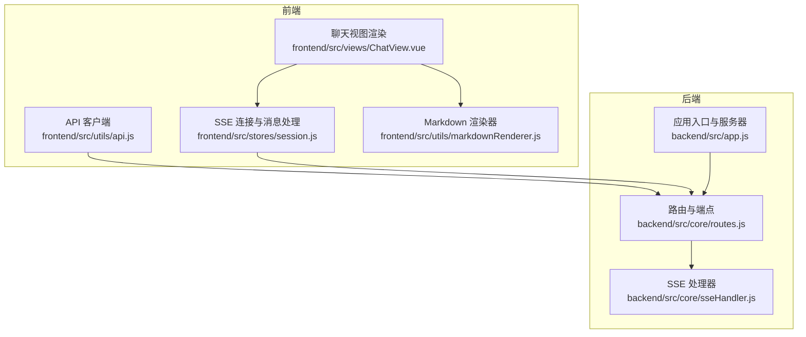
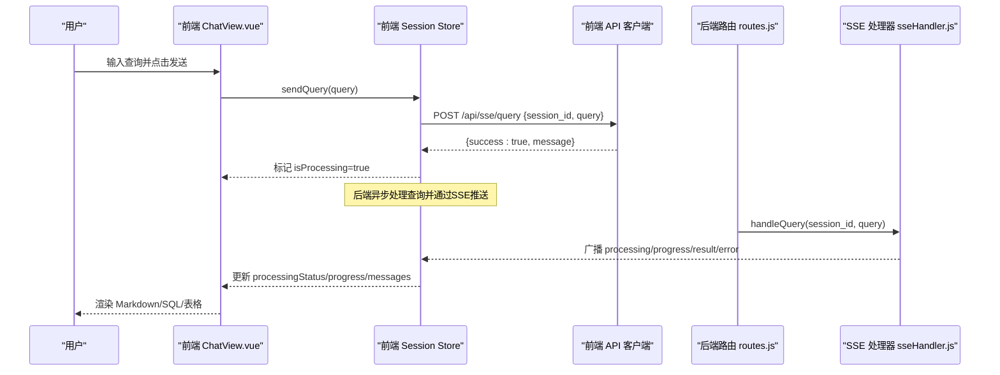
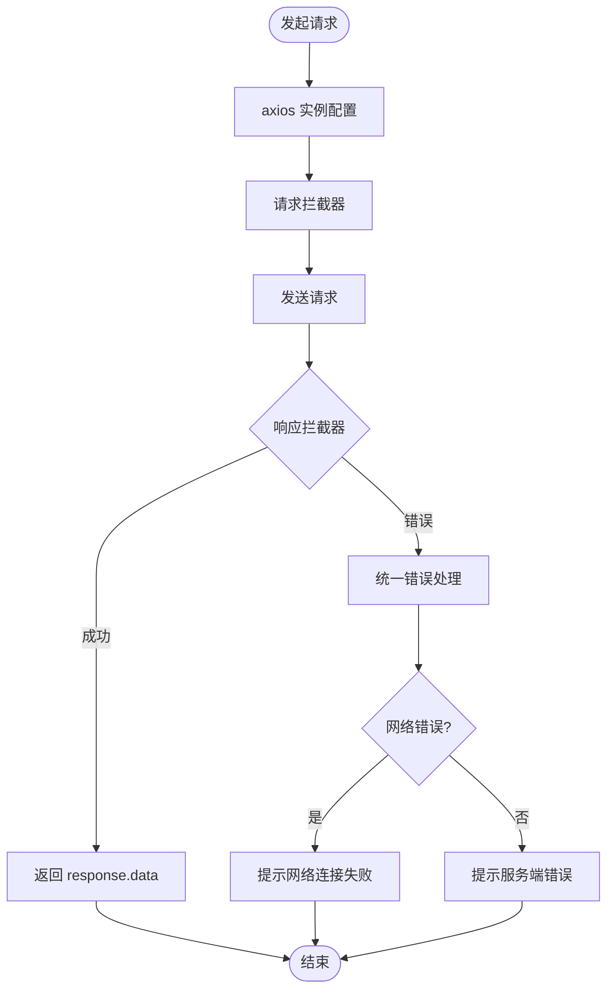
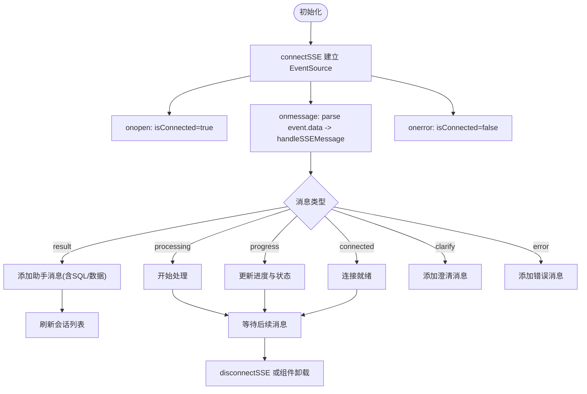
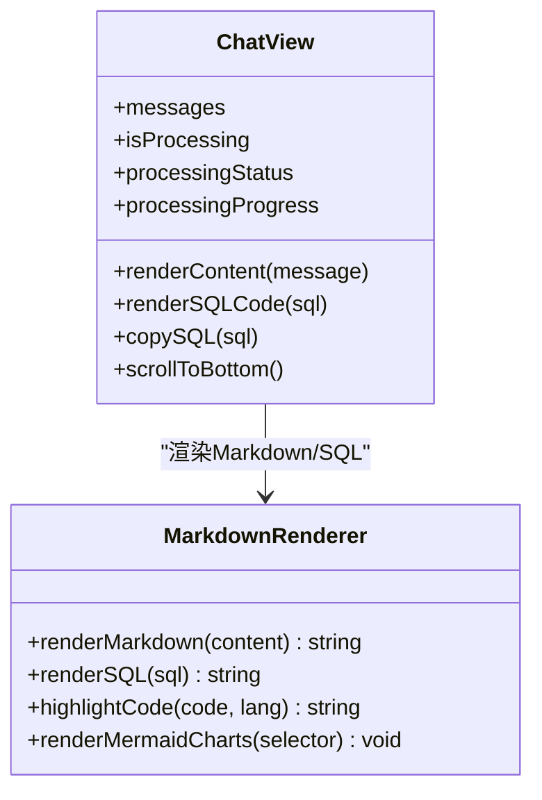
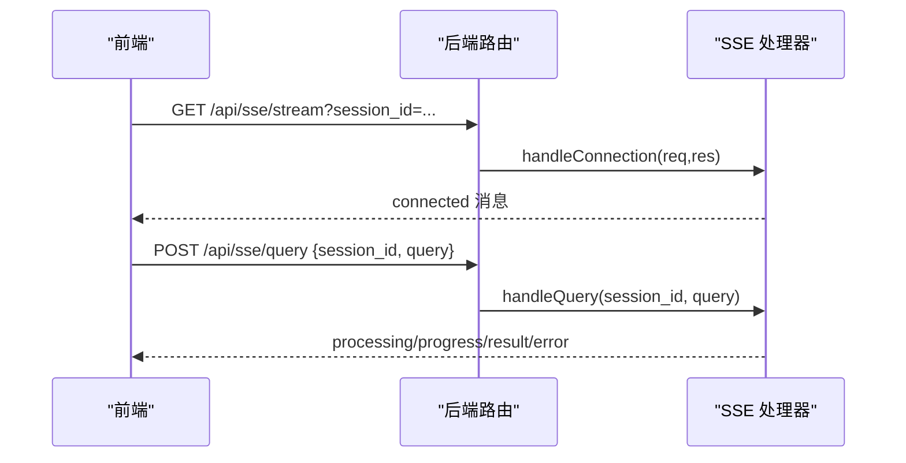
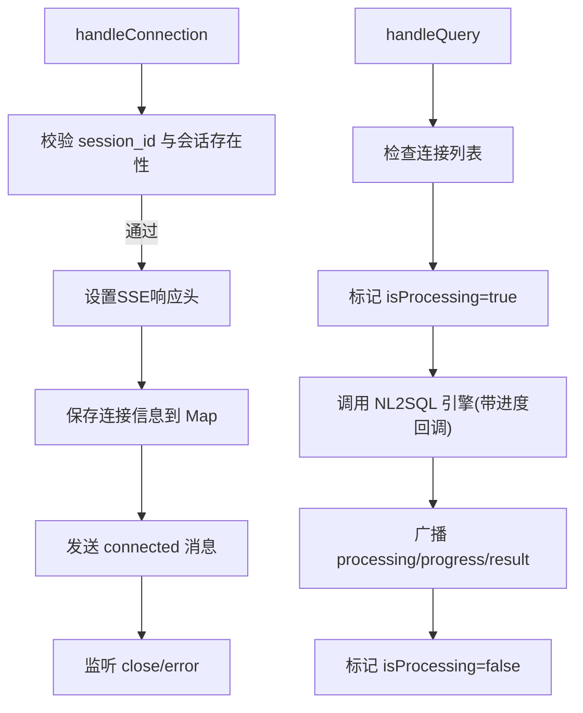
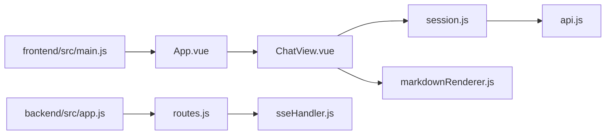

# 实时通信

<cite>
**本文档引用的文件**
- [api.js](file://frontend/src/utils/api.js)
- [markdownRenderer.js](file://frontend/src/utils/markdownRenderer.js)
- [ChatView.vue](file://frontend/src/views/ChatView.vue)
- [session.js](file://frontend/src/stores/session.js)
- [routes.js](file://backend/src/core/routes.js)
- [sseHandler.js](file://backend/src/core/sseHandler.js)
- [app.js](file://backend/src/app.js)
- [main.js](file://frontend/src/main.js)
</cite>

## 目录
1. [简介](#简介)
2. [项目结构](#项目结构)
3. [核心组件](#核心组件)
4. [架构总览](#架构总览)
5. [详细组件分析](#详细组件分析)
6. [依赖关系分析](#依赖关系分析)
7. [性能考虑](#性能考虑)
8. [故障排查指南](#故障排查指南)
9. [结论](#结论)

## 简介
本文件面向 NL2SQL 前端实时通信系统，围绕基于 Server-Sent Events（SSE）的实时数据传输机制进行深入说明，涵盖连接建立、消息接收与断线重连策略；API 客户端实现（请求封装、响应处理、错误管理）；Markdown 渲染器的使用与实时内容更新机制；以及实时通信最佳实践（连接池管理、消息队列处理、性能优化）、错误处理策略、超时管理与用户体验优化。

## 项目结构
- 前端采用 Vue 3 + Pinia + Element Plus 架构，实时通信通过 EventSource 连接后端 SSE 端点，消息经由会话状态管理 Store 推送到视图层渲染。
- 后端基于 Express，提供 REST API 与 SSE 端点，SSE 连接由 SSE 处理器统一管理，查询处理通过 NL2SQL 引擎驱动，进度与结果通过 SSE 广播给客户端。

**图表来源**
- [api.js:25-34](file://frontend/src/utils/api.js#L25-L34)
- [session.js:185-221](file://frontend/src/stores/session.js#L185-L221)
- [ChatView.vue:132-383](file://frontend/src/views/ChatView.vue#L132-L383)
- [markdownRenderer.js:15-68](file://frontend/src/utils/markdownRenderer.js#L15-L68)
- [routes.js:947-1002](file://backend/src/core/routes.js#L947-L1002)
- [sseHandler.js:43-112](file://backend/src/core/sseHandler.js#L43-L112)
- [app.js:56-87](file://backend/src/app.js#L56-L87)

**章节来源**
- [main.js:55-89](file://frontend/src/main.js#L55-L89)
- [app.js:56-87](file://backend/src/app.js#L56-L87)

## 核心组件
- 前端 API 客户端：封装 axios 实例，统一请求/响应拦截、错误处理与业务 API（含 SSE 查询提交）。
- 前端 SSE Store：管理 EventSource 连接、消息分发、处理状态与进度、错误提示与断线处理。
- 前端视图层：负责渲染 Markdown、SQL 代码块、数据表格与处理状态指示器。
- 后端路由：暴露 /api/sse/stream（SSE 连接）与 /api/sse/query（提交查询）端点。
- 后端 SSE 处理器：维护连接映射、发送消息、广播进度与结果、清理连接。

**章节来源**
- [api.js:25-34](file://frontend/src/utils/api.js#L25-L34)
- [session.js:185-398](file://frontend/src/stores/session.js#L185-L398)
- [ChatView.vue:132-383](file://frontend/src/views/ChatView.vue#L132-L383)
- [routes.js:947-1002](file://backend/src/core/routes.js#L947-L1002)
- [sseHandler.js:26-348](file://backend/src/core/sseHandler.js#L26-L348)

## 架构总览
SSE 实时通信链路如下：
- 前端通过 EventSource 连接到 /api/sse/stream，携带 session_id。
- 用户在前端输入查询，通过 /api/sse/query 提交查询，后端立即返回“已提交”确认，随后通过 SSE 广播处理状态、进度与最终结果。
- 前端 Store 接收消息，更新处理状态、进度与消息列表，视图层根据消息类型渲染 Markdown、SQL 与表格。

**图表来源**
- [ChatView.vue:196-214](file://frontend/src/views/ChatView.vue#L196-L214)
- [session.js:301-330](file://frontend/src/stores/session.js#L301-L330)
- [api.js:246-251](file://frontend/src/utils/api.js#L246-L251)
- [routes.js:972-1002](file://backend/src/core/routes.js#L972-L1002)
- [sseHandler.js:218-280](file://backend/src/core/sseHandler.js#L218-L280)

## 详细组件分析

### 前端 API 客户端（axios 封装）
- 基础配置：baseURL 为 /api，超时 30 秒，JSON Content-Type。
- 请求拦截：可扩展添加认证头等。
- 响应拦截：统一封装错误处理，区分服务端错误、网络错误与请求配置错误。
- 业务 API：
  - 健康检查、Schema、会话、查询历史、统计、配置等 REST 接口。
  - SSE 查询提交：POST /api/sse/query，提交 session_id 与 query。

**图表来源**
- [api.js:25-88](file://frontend/src/utils/api.js#L25-L88)

**章节来源**
- [api.js:25-303](file://frontend/src/utils/api.js#L25-L303)

### 前端 SSE Store（EventSource 管理与消息分发）
- 连接管理：connectSSE 基于当前会话 ID 构造 /api/sse/stream URL，创建 EventSource，监听 open/message/error，保存连接实例。
- 消息分发：handleSSEMessage 根据消息类型（connected/processing/progress/result/clarify/error）更新处理状态、进度与消息列表。
- 查询提交：sendQuery 先在本地添加用户消息，再调用 API 提交查询，若连接未打开则提示失败。
- 断线处理：disconnectSSE 关闭连接并将 isConnected 置为 false；组件卸载时自动断开。

**图表来源**
- [session.js:185-295](file://frontend/src/stores/session.js#L185-L295)

**章节来源**
- [session.js:185-398](file://frontend/src/stores/session.js#L185-L398)

### 前端视图层（Markdown 渲染与实时更新）
- Markdown 渲染：renderMarkdown 使用 markdown-it，支持代码高亮（Shiki）、Mermaid 图表、KaTeX 数学公式。
- SQL 高亮：renderSQL 使用 Shiki 对 SQL 片段进行高亮。
- 实时更新：watch 监听 messages 与 isProcessing，自动滚动到底部；渲染时延后触发 Mermaid 渲染。
- 交互：支持复制 SQL、长消息折叠/展开、进度条与打字动画。

**图表来源**
- [ChatView.vue:132-383](file://frontend/src/views/ChatView.vue#L132-L383)
- [markdownRenderer.js:15-68](file://frontend/src/utils/markdownRenderer.js#L15-L68)

**章节来源**
- [ChatView.vue:132-383](file://frontend/src/views/ChatView.vue#L132-L383)
- [markdownRenderer.js:181-246](file://frontend/src/utils/markdownRenderer.js#L181-L246)

### 后端路由与 SSE 端点
- /api/sse/stream：GET 建立 SSE 连接，校验 session_id 与会话存在性，设置 SSE 响应头，记录连接信息，发送 connected 消息，并监听 close/error。
- /api/sse/query：POST 提交查询，校验参数，异步调用 SSE 处理器处理查询，立即返回“已提交”确认。
- 健康检查与统计：/api/health、/api/health/detail、/api/stats 等，便于前端监控与诊断。

**图表来源**
- [routes.js:957-1002](file://backend/src/core/routes.js#L957-L1002)
- [sseHandler.js:43-112](file://backend/src/core/sseHandler.js#L43-L112)

**章节来源**
- [routes.js:947-1002](file://backend/src/core/routes.js#L947-L1002)

### 后端 SSE 处理器
- 连接管理：Map 以 session_id 为键，存储多个连接信息（支持多标签页），记录连接时间、最后活跃时间与处理状态。
- 消息发送：sendMessage 将消息序列化为 SSE data 格式写入响应；broadcastToSession 广播至同一会话的所有连接。
- 查询处理：handleQuery 校验连接与请求状态，标记 isProcessing，调用 NL2SQL 引擎并回调进度，最终广播 result 或 error。
- 统计接口：getConnectionCount/getConnectionList/getSessionConnectionCount 供健康检查使用。

**图表来源**
- [sseHandler.js:43-112](file://backend/src/core/sseHandler.js#L43-L112)
- [sseHandler.js:218-280](file://backend/src/core/sseHandler.js#L218-L280)

**章节来源**
- [sseHandler.js:26-348](file://backend/src/core/sseHandler.js#L26-L348)

## 依赖关系分析
- 前端依赖
  - Vue 3 + Pinia：状态管理与响应式数据。
  - Element Plus：UI 组件与图标。
  - Axios：HTTP 客户端。
  - markdown-it、Shiki、Mermaid、KaTeX：Markdown/代码/图表/公式渲染。
- 后端依赖
  - Express：Web 框架。
  - SSE 处理器：连接映射、消息广播。
  - NL2SQL 引擎：查询处理与进度回调。
  - 日志与数据库：日志记录与会话持久化。

**图表来源**
- [main.js:55-89](file://frontend/src/main.js#L55-L89)
- [app.js:56-87](file://backend/src/app.js#L56-L87)

**章节来源**
- [main.js:55-89](file://frontend/src/main.js#L55-L89)
- [app.js:56-87](file://backend/src/app.js#L56-L87)

## 性能考虑
- SSE 缓冲控制：后端设置 X-Accel-Buffering=no，避免 Nginx 缓冲导致延迟。
- 连接复用：同一会话允许多个连接（多标签页），通过 Map 管理，减少重复连接成本。
- 前端渲染优化：Markdown 渲染后延时触发 Mermaid 渲染，避免阻塞主线程；SQL 高亮使用 Shiki，失败时回退简单高亮。
- 进度与状态：前端仅在收到 progress 时更新，避免频繁重绘；处理完成后滚动到底部，保证可见性。
- 超时与重试：前端 API 客户端设置 30 秒超时；SSE 连接断开时需由前端主动重建（见“断线重连策略”）。

[本节为通用性能建议，不直接分析特定文件]

## 故障排查指南
- 健康检查
  - 前端可调用 /api/health 与 /api/health/detail 获取服务状态与 SSE 连接数。
- 常见问题定位
  - 会话不存在：SSE 连接建立时校验 session_id，若不存在返回 404。
  - 查询为空：提交查询时校验 query 非空，否则返回 400。
  - 连接未建立：前端 sendQuery 前检查 readyState，未打开则提示失败。
  - 渲染异常：Markdown 渲染器对 KaTeX/mermaid 渲染失败有兜底，查看控制台错误日志。
- 日志与监控
  - 后端记录 SSE 连接建立/关闭/错误与查询处理日志，便于定位问题。
  - 前端 Store 记录 SSE 连接状态与消息类型，便于前端调试。

**章节来源**
- [routes.js:957-1002](file://backend/src/core/routes.js#L957-L1002)
- [sseHandler.js:43-112](file://backend/src/core/sseHandler.js#L43-L112)
- [session.js:301-330](file://frontend/src/stores/session.js#L301-L330)
- [markdownRenderer.js:160-170](file://frontend/src/utils/markdownRenderer.js#L160-L170)

## 结论
NL2SQL 前端实时通信系统以 SSE 为核心，结合前后端清晰的职责划分与状态管理，实现了低延迟、可扩展的流式查询体验。前端通过 EventSource 与 Store 协作，后端通过 SSE 处理器与进度回调，共同保障了用户体验与系统稳定性。建议在生产环境中进一步完善断线重连策略、连接池与消息队列处理、以及更细粒度的超时与重试机制，以提升可靠性与性能。