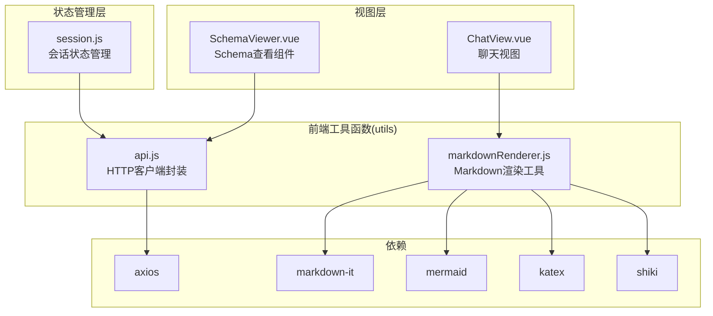
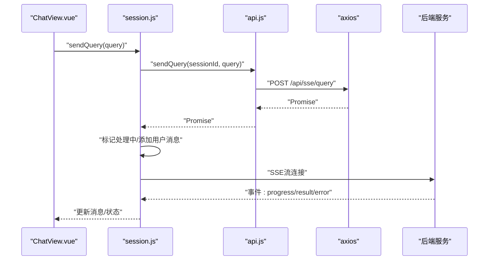
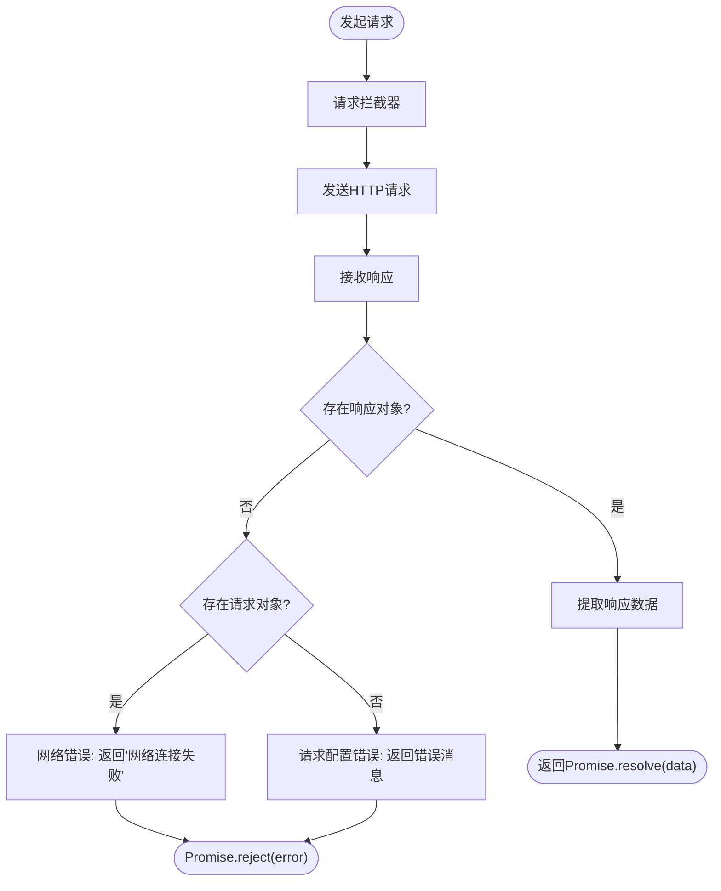
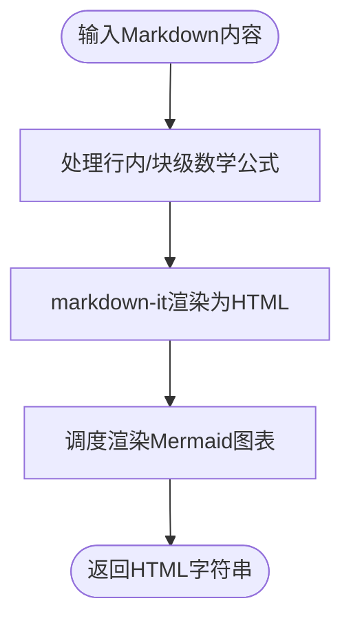
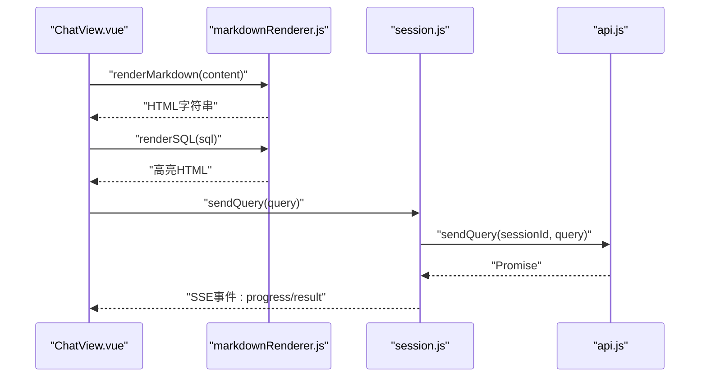
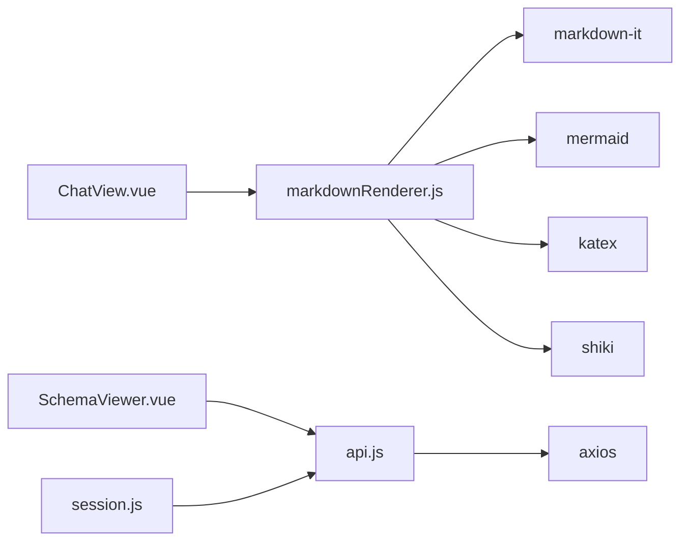

# 工具函数

<cite>
**本文档引用的文件**
- [frontend/src/utils/api.js](file://frontend/src/utils/api.js)
- [frontend/src/utils/markdownRenderer.js](file://frontend/src/utils/markdownRenderer.js)
- [frontend/src/views/ChatView.vue](file://frontend/src/views/ChatView.vue)
- [frontend/src/stores/session.js](file://frontend/src/stores/session.js)
- [frontend/src/components/SchemaViewer.vue](file://frontend/src/components/SchemaViewer.vue)
- [frontend/package.json](file://frontend/package.json)
</cite>

## 目录
1. [简介](#简介)
2. [项目结构](#项目结构)
3. [核心组件](#核心组件)
4. [架构总览](#架构总览)
5. [详细组件分析](#详细组件分析)
6. [依赖分析](#依赖分析)
7. [性能考虑](#性能考虑)
8. [故障排查指南](#故障排查指南)
9. [结论](#结论)
10. [附录](#附录)

## 简介
本文件面向NL2SQL前端工具函数，系统性梳理以下内容：
- API封装模块：统一HTTP请求、请求/响应拦截、错误处理与REST接口导出
- Markdown渲染工具：Markdown解析、代码高亮、Mermaid图表与KaTeX公式渲染
- 辅助工具函数：HTML转义、数学公式处理、Mermaid渲染调度
- 设计原则与复用策略：模块化、可扩展、可降级、可测试
- 使用示例与集成方法：在聊天视图、会话状态管理、Schema查看组件中的应用
- 测试与维护策略：错误捕获、日志记录、降级方案与版本演进

## 项目结构
前端工具函数位于frontend/src/utils目录，主要包含两个模块：
- api.js：基于axios的HTTP客户端封装，提供统一的请求/响应拦截与业务API导出
- markdownRenderer.js：基于markdown-it、Shiki、Mermaid、KaTeX的Markdown渲染工具

**图表来源**
- [frontend/src/utils/api.js:14-34](file://frontend/src/utils/api.js#L14-L34)
- [frontend/src/utils/markdownRenderer.js:15-18](file://frontend/src/utils/markdownRenderer.js#L15-L18)
- [frontend/src/views/ChatView.vue:151-152](file://frontend/src/views/ChatView.vue#L151-L152)
- [frontend/src/components/SchemaViewer.vue:102-103](file://frontend/src/components/SchemaViewer.vue#L102-L103)
- [frontend/src/stores/session.js:21-22](file://frontend/src/stores/session.js#L21-L22)

**章节来源**
- [frontend/src/utils/api.js:1-252](file://frontend/src/utils/api.js#L1-L252)
- [frontend/src/utils/markdownRenderer.js:1-258](file://frontend/src/utils/markdownRenderer.js#L1-L258)
- [frontend/src/views/ChatView.vue:1-776](file://frontend/src/views/ChatView.vue#L1-L776)
- [frontend/src/stores/session.js:1-398](file://frontend/src/stores/session.js#L1-L398)
- [frontend/src/components/SchemaViewer.vue:1-317](file://frontend/src/components/SchemaViewer.vue#L1-L317)
- [frontend/package.json:11-28](file://frontend/package.json#L11-L28)

## 核心组件
- API封装模块(api.js)
  - 基于axios创建带baseURL、超时与默认头的客户端
  - 请求拦截器：预留认证token注入位置
  - 响应拦截器：统一提取响应数据与错误处理
  - 导出REST API：健康检查、Schema、会话、查询历史、统计、配置、SSE查询提交
- Markdown渲染工具(markdownRenderer.js)
  - 初始化Mermaid、Shiki、KaTeX
  - 自定义highlight回调：Mermaid图表、LaTeX/数学公式、通用代码块
  - 提供renderMarkdown、renderSQL、highlightCode、renderMermaidCharts等导出
  - 包含HTML转义与行内/块级公式处理

**章节来源**
- [frontend/src/utils/api.js:25-88](file://frontend/src/utils/api.js#L25-L88)
- [frontend/src/utils/api.js:98-251](file://frontend/src/utils/api.js#L98-L251)
- [frontend/src/utils/markdownRenderer.js:24-100](file://frontend/src/utils/markdownRenderer.js#L24-L100)
- [frontend/src/utils/markdownRenderer.js:181-246](file://frontend/src/utils/markdownRenderer.js#L181-L246)

## 架构总览
工具函数在前端的职责边界清晰：API模块负责与后端交互，Markdown渲染模块负责内容呈现。二者被视图层与状态管理层消费。

**图表来源**
- [frontend/src/views/ChatView.vue:196-214](file://frontend/src/views/ChatView.vue#L196-L214)
- [frontend/src/stores/session.js:299-328](file://frontend/src/stores/session.js#L299-L328)
- [frontend/src/utils/api.js:246-251](file://frontend/src/utils/api.js#L246-L251)

## 详细组件分析

### API封装模块分析
- 设计要点
  - 单一客户端实例，集中配置baseURL、超时与默认头
  - 请求拦截器：预留认证token注入，便于后续扩展
  - 响应拦截器：统一返回响应.data，异常分支分别处理服务端错误、网络错误、请求配置错误
  - API导出：按领域分组（健康检查、Schema、会话、查询历史、统计、配置、SSE）
- 错误处理机制
  - 服务端错误：打印错误数据并reject后端返回的错误体
  - 网络错误：提示“网络连接失败”
  - 请求配置错误：返回错误消息
- 请求/响应拦截流程

**图表来源**
- [frontend/src/utils/api.js:44-57](file://frontend/src/utils/api.js#L44-L57)
- [frontend/src/utils/api.js:67-88](file://frontend/src/utils/api.js#L67-L88)

- 关键API导出与用途
  - 健康检查：getHealth、getHealthDetail
  - Schema：getSchema、getTableDetail、searchSchema
  - 会话：getSessions、createSession、getSession、getSessionMessages、deleteSession
  - 查询历史：getQueryHistory
  - 统计与配置：getStats、getConfig
  - SSE查询：sendQuery

**章节来源**
- [frontend/src/utils/api.js:25-34](file://frontend/src/utils/api.js#L25-L34)
- [frontend/src/utils/api.js:44-57](file://frontend/src/utils/api.js#L44-L57)
- [frontend/src/utils/api.js:67-88](file://frontend/src/utils/api.js#L67-L88)
- [frontend/src/utils/api.js:98-251](file://frontend/src/utils/api.js#L98-L251)

### Markdown渲染工具分析
- 设计要点
  - 初始化Mermaid：禁用自动启动，设置主题与安全级别，配置流程图/时序图/Gantt参数
  - 初始化Shiki：动态按需加载，预设主题与语言集；失败时降级
  - 自定义highlight回调：Mermaid图表、LaTeX/数学公式、通用代码块
  - 提供renderMarkdown、renderSQL、highlightCode、renderMermaidCharts
- 渲染流程

**图表来源**
- [frontend/src/utils/markdownRenderer.js:181-196](file://frontend/src/utils/markdownRenderer.js#L181-L196)
- [frontend/src/utils/markdownRenderer.js:124-150](file://frontend/src/utils/markdownRenderer.js#L124-L150)
- [frontend/src/utils/markdownRenderer.js:156-170](file://frontend/src/utils/markdownRenderer.js#L156-L170)

- 代码高亮与降级
  - renderSQL：优先使用Shiki对SQL高亮，失败时回退到简单HTML转义包裹
  - highlightCode：动态初始化Shiki，支持任意语言，失败时同样回退
  - escapeHtml：内置HTML转义映射，避免XSS风险

**章节来源**
- [frontend/src/utils/markdownRenderer.js:24-40](file://frontend/src/utils/markdownRenderer.js#L24-L40)
- [frontend/src/utils/markdownRenderer.js:51-68](file://frontend/src/utils/markdownRenderer.js#L51-L68)
- [frontend/src/utils/markdownRenderer.js:74-100](file://frontend/src/utils/markdownRenderer.js#L74-L100)
- [frontend/src/utils/markdownRenderer.js:181-246](file://frontend/src/utils/markdownRenderer.js#L181-L246)

### 组件集成与使用示例
- 聊天视图(ChatView.vue)
  - 导入renderMarkdown与renderSQL，用于渲染助手消息中的Markdown与SQL代码块
  - 通过sessionStore与SSE交互，触发后端查询并接收实时进度与结果
- 会话状态管理(session.js)
  - 通过api模块调用后端接口，管理会话列表、消息历史与SSE连接
  - sendQuery通过HTTP POST提交查询，随后由SSE流推送结果
- Schema查看组件(SchemaViewer.vue)
  - 导入api模块，调用getSchema加载Schema数据并在组件中展示

**图表来源**
- [frontend/src/views/ChatView.vue:263-278](file://frontend/src/views/ChatView.vue#L263-L278)
- [frontend/src/stores/session.js:299-328](file://frontend/src/stores/session.js#L299-L328)
- [frontend/src/utils/api.js:246-251](file://frontend/src/utils/api.js#L246-L251)
- [frontend/src/utils/markdownRenderer.js:181-246](file://frontend/src/utils/markdownRenderer.js#L181-L246)

**章节来源**
- [frontend/src/views/ChatView.vue:151-152](file://frontend/src/views/ChatView.vue#L151-L152)
- [frontend/src/views/ChatView.vue:263-278](file://frontend/src/views/ChatView.vue#L263-L278)
- [frontend/src/stores/session.js:299-328](file://frontend/src/stores/session.js#L299-L328)
- [frontend/src/components/SchemaViewer.vue:191-208](file://frontend/src/components/SchemaViewer.vue#L191-L208)

## 依赖分析
- 外部依赖
  - axios：HTTP客户端，提供请求/响应拦截
  - markdown-it：Markdown解析
  - mermaid：图表渲染
  - katex：数学公式渲染
  - shiki：代码高亮
- 内部依赖关系
  - ChatView.vue依赖markdownRenderer.js
  - SchemaViewer.vue与session.js依赖api.js
  - api.js依赖axios

**图表来源**
- [frontend/src/views/ChatView.vue:151-152](file://frontend/src/views/ChatView.vue#L151-L152)
- [frontend/src/components/SchemaViewer.vue:102-103](file://frontend/src/components/SchemaViewer.vue#L102-L103)
- [frontend/src/stores/session.js:21-22](file://frontend/src/stores/session.js#L21-L22)
- [frontend/src/utils/api.js:14-15](file://frontend/src/utils/api.js#L14-L15)
- [frontend/src/utils/markdownRenderer.js:15-18](file://frontend/src/utils/markdownRenderer.js#L15-L18)

**章节来源**
- [frontend/package.json:11-28](file://frontend/package.json#L11-L28)
- [frontend/src/utils/api.js:14-15](file://frontend/src/utils/api.js#L14-L15)
- [frontend/src/utils/markdownRenderer.js:15-18](file://frontend/src/utils/markdownRenderer.js#L15-L18)

## 性能考虑
- 渲染策略
  - Markdown渲染采用同步渲染与异步Mermaid调度分离，避免阻塞主线程
  - Shiki按需动态加载，首次使用时初始化，减少初始包体积
- 错误与降级
  - Shiki初始化失败与Mermaid渲染失败均记录日志并降级输出，保证可用性
- 网络与超时
  - axios设置合理超时时间，避免长时间挂起
- 建议
  - 对高频渲染场景可引入虚拟滚动与缓存策略
  - 对长Markdown内容可考虑分页或懒加载

[本节为通用建议，不直接分析具体文件]

## 故障排查指南
- API错误处理
  - 服务端错误：检查后端返回的错误体，定位业务异常
  - 网络错误：确认代理与跨域配置，检查网络连通性
  - 请求配置错误：检查baseURL、headers与参数传递
- Markdown渲染问题
  - Shiki高亮失败：确认动态导入路径与主题/语言集配置
  - Mermaid渲染失败：检查图表语法与节点选择器
  - 数学公式渲染失败：检查公式语法与KaTeX配置
- 日志与调试
  - 统一使用console.error输出错误信息，便于定位问题
  - 在响应拦截器中打印错误数据，便于后端调试

**章节来源**
- [frontend/src/utils/api.js:74-86](file://frontend/src/utils/api.js#L74-L86)
- [frontend/src/utils/markdownRenderer.js:164-169](file://frontend/src/utils/markdownRenderer.js#L164-L169)
- [frontend/src/utils/markdownRenderer.js:213-215](file://frontend/src/utils/markdownRenderer.js#L213-L215)
- [frontend/src/utils/markdownRenderer.js:240-242](file://frontend/src/utils/markdownRenderer.js#L240-L242)

## 结论
- API封装模块提供了统一、可扩展的HTTP访问层，具备完善的错误处理与拦截能力
- Markdown渲染工具整合多种渲染能力，具备良好的可读性与可维护性
- 通过明确的模块边界与清晰的调用链路，工具函数在视图层与状态管理层之间形成稳定桥梁
- 建议持续关注依赖版本升级、渲染性能优化与错误监控完善

[本节为总结性内容，不直接分析具体文件]

## 附录
- 设计原则
  - 单一职责：每个模块专注一个领域
  - 可扩展：预留认证、主题、语言等扩展点
  - 可降级：高亮与图表渲染失败时提供回退方案
  - 可测试：导出函数便于单元测试与集成测试
- 复用策略
  - 将通用逻辑抽象为独立模块，避免重复实现
  - 通过导出函数而非硬编码常量，提升灵活性
- 维护策略
  - 定期评估依赖安全性与性能
  - 增加单元测试覆盖关键路径
  - 建立变更追踪与回归测试流程

[本节为通用指导，不直接分析具体文件]