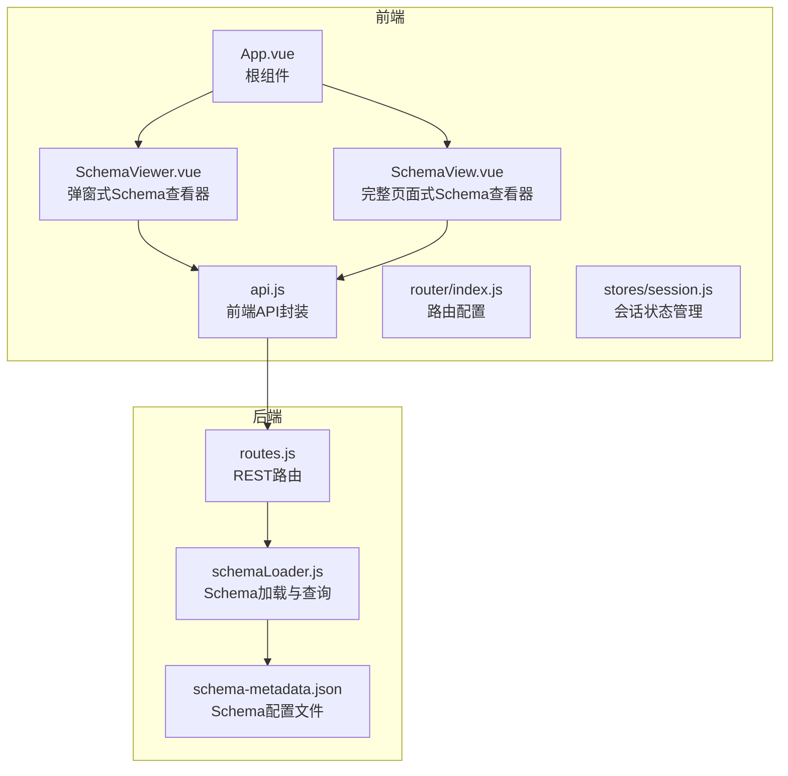
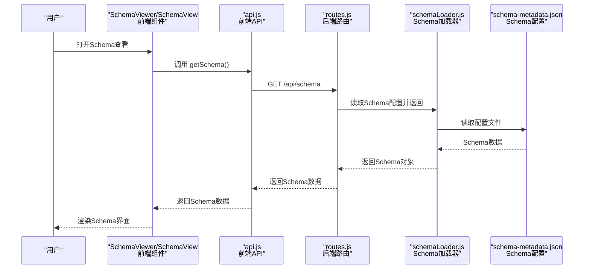
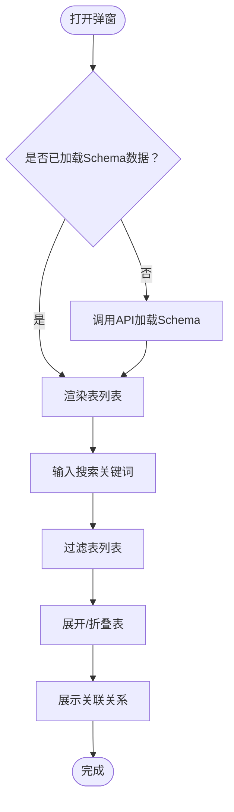
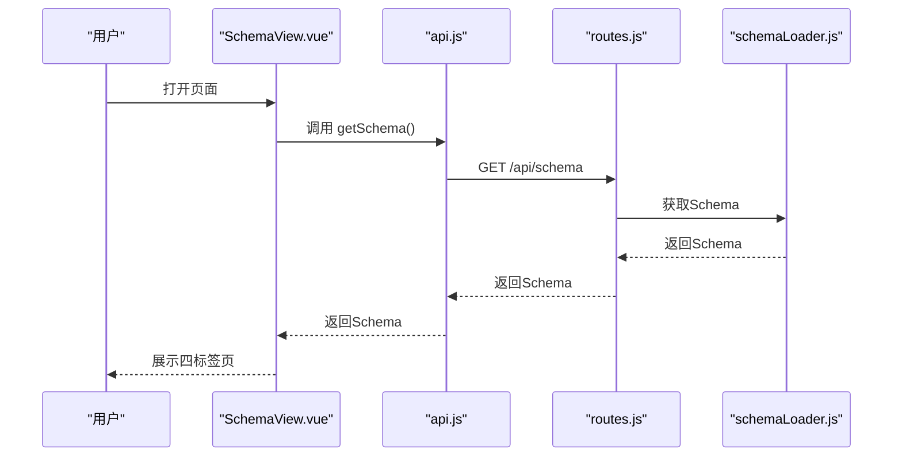
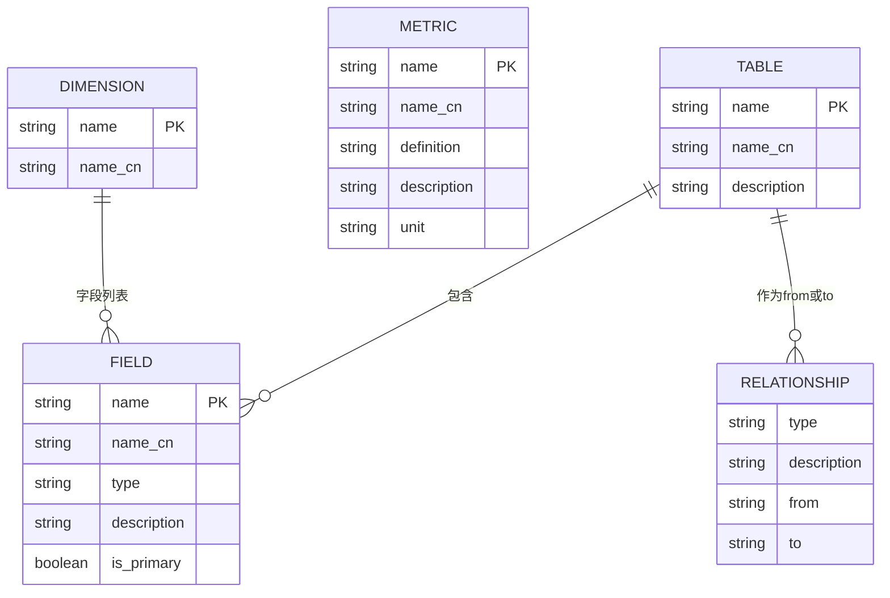
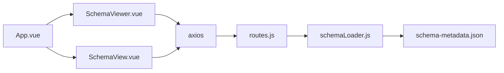

# Schema 查看组件

<cite>
**本文档引用的文件**
- [SchemaViewer.vue](file://frontend/src/components/SchemaViewer.vue)
- [SchemaView.vue](file://frontend/src/views/SchemaView.vue)
- [api.js](file://frontend/src/utils/api.js)
- [routes.js](file://backend/src/core/routes.js)
- [schemaLoader.js](file://backend/src/core/schemaLoader.js)
- [schema-metadata.json](file://backend/config/schema-metadata.json)
- [App.vue](file://frontend/src/App.vue)
- [router/index.js](file://frontend/src/router/index.js)
- [session.js](file://frontend/src/stores/session.js)
</cite>

## 目录
1. [简介](#简介)
2. [项目结构](#项目结构)
3. [核心组件](#核心组件)
4. [架构总览](#架构总览)
5. [详细组件分析](#详细组件分析)
6. [依赖关系分析](#依赖关系分析)
7. [性能考虑](#性能考虑)
8. [故障排除指南](#故障排除指南)
9. [结论](#结论)
10. [附录](#附录)

## 简介
本文件面向 NL2SQL 项目的 Schema 查看组件，系统性梳理 SchemaViewer.vue（弹窗式 Schema 查看器）与 SchemaView.vue（完整页面式 Schema 查看器）的实现细节。内容涵盖：
- 数据模型与 Schema 结构
- 组件数据绑定与动态渲染
- 用户交互与响应式设计
- Schema 数据获取、缓存与性能优化
- 使用示例、自定义配置与扩展开发建议

## 项目结构
Schema 查看组件位于前端工程的组件与视图层，配合后端路由与 Schema 加载模块共同工作。整体结构如下：

图表来源
- [App.vue](file://frontend/src/App.vue)
- [SchemaViewer.vue](file://frontend/src/components/SchemaViewer.vue)
- [SchemaView.vue](file://frontend/src/views/SchemaView.vue)
- [api.js](file://frontend/src/utils/api.js)
- [router/index.js](file://frontend/src/router/index.js)
- [routes.js](file://backend/src/core/routes.js)
- [schemaLoader.js](file://backend/src/core/schemaLoader.js)
- [schema-metadata.json](file://backend/config/schema-metadata.json)

章节来源
- [App.vue](file://frontend/src/App.vue)
- [SchemaViewer.vue](file://frontend/src/components/SchemaViewer.vue)
- [SchemaView.vue](file://frontend/src/views/SchemaView.vue)
- [api.js](file://frontend/src/utils/api.js)
- [router/index.js](file://frontend/src/router/index.js)
- [routes.js](file://backend/src/core/routes.js)
- [schemaLoader.js](file://backend/src/core/schemaLoader.js)
- [schema-metadata.json](file://backend/config/schema-metadata.json)

## 核心组件
- SchemaViewer.vue：以弹窗形式展示 Schema，支持搜索、折叠展开、字段与关系展示，适合在聊天界面中快速查看。
- SchemaView.vue：完整页面展示 Schema，包含表结构、指标、维度、关系四个标签页，适合独立页面浏览与导出。

章节来源
- [SchemaViewer.vue](file://frontend/src/components/SchemaViewer.vue)
- [SchemaView.vue](file://frontend/src/views/SchemaView.vue)

## 架构总览
Schema 查看组件的前后端交互链路如下：

图表来源
- [SchemaViewer.vue](file://frontend/src/components/SchemaViewer.vue)
- [SchemaView.vue](file://frontend/src/views/SchemaView.vue)
- [api.js](file://frontend/src/utils/api.js)
- [routes.js](file://backend/src/core/routes.js)
- [schemaLoader.js](file://backend/src/core/schemaLoader.js)
- [schema-metadata.json](file://backend/config/schema-metadata.json)

## 详细组件分析

### SchemaViewer.vue（弹窗式 Schema 查看器）
- 功能特性
  - 弹窗展示，支持 v-model 控制显隐
  - 搜索框：支持按表名、中文名、描述、字段名/中文名模糊搜索
  - 折叠面板：逐表展开，展示字段列表、描述、主键标记、关联关系
  - 加载态与空态：骨架屏与空状态提示
  - 关联关系：根据表名筛选关系，格式化显示 from → to
- 数据绑定与动态渲染
  - 使用响应式 ref/computed/watch 管理状态与计算属性
  - 通过 API 获取 Schema 数据，首次打开弹窗时触发加载
  - 搜索关键词实时过滤表列表
- 用户交互
  - 输入框清空、回车触发搜索
  - 点击“刷新”按钮可重新加载数据
  - 关闭弹窗时保持数据缓存，再次打开无需重复加载
- 响应式设计
  - 弹窗宽度固定，内容区域最大高度与滚动条控制
  - 表格列宽与标签样式适配移动端

图表来源
- [SchemaViewer.vue](file://frontend/src/components/SchemaViewer.vue)

章节来源
- [SchemaViewer.vue](file://frontend/src/components/SchemaViewer.vue)

### SchemaView.vue（完整页面式 Schema 查看器）
- 功能特性
  - 顶部统计栏：表数量、指标数量、维度数量
  - 四个标签页：
    - 表结构：网格卡片展示每张表，包含表名、中文名、字段列表、描述
    - 指标：指标名、中文名、定义、描述、单位
    - 维度：字段列表、粒度标签
    - 表关系：from → to 关系、关系类型、描述
  - 刷新按钮：手动触发加载
- 数据绑定与动态渲染
  - 使用 onMounted 生命周期加载一次 Schema
  - 标签页内容区域采用滚动容器，适配不同屏幕尺寸
- 用户交互
  - 切换标签页查看不同维度
  - 点击“刷新”重新拉取最新 Schema
- 响应式设计
  - 表卡片网格自适应列数
  - 标签页内容区域高度自适应窗口

图表来源
- [SchemaView.vue](file://frontend/src/views/SchemaView.vue)
- [api.js](file://frontend/src/utils/api.js)
- [routes.js](file://backend/src/core/routes.js)
- [schemaLoader.js](file://backend/src/core/schemaLoader.js)

章节来源
- [SchemaView.vue](file://frontend/src/views/SchemaView.vue)

### 数据模型与 Schema 结构
Schema 数据结构包含以下字段：
- 版本号（version）
- 表定义数组（tables）
  - 表名（name）、中文名（name_cn）、描述（description）
  - 字段数组（fields）
    - 字段名（name）、中文名（name_cn）、类型（type）、描述（description）
    - 主键标记（is_primary）、时间粒度（time_granularity）、聚合函数（aggregations）
- 指标定义数组（metrics）
  - 指标名（name）、中文名（name_cn）、定义（definition）、描述（description）、单位（unit）
- 维度定义数组（dimensions）
  - 维度名（name）、中文名（name_cn）、字段列表（fields）、粒度（granularities）
- 表关系数组（relationships）
  - 关系类型（type）、描述（description）、from/to 表字段标识

图表来源
- [schema-metadata.json](file://backend/config/schema-metadata.json)

章节来源
- [schema-metadata.json](file://backend/config/schema-metadata.json)

### 组件数据绑定机制
- v-model 与事件
  - SchemaViewer 使用 computed getter/setter 实现 v-model 双向绑定
  - 通过 update:modelValue 事件向上派发显隐状态变化
- 响应式状态
  - loading：加载状态
  - schemaData：Schema 数据对象（tables、metrics、dimensions、relationships）
  - searchQuery：搜索关键词
  - activeTables：当前展开的表名集合
- 计算属性
  - filteredTables：根据搜索关键词过滤后的表列表
- 监听器
  - 监听 visible 状态变化，首次打开时加载数据

章节来源
- [SchemaViewer.vue](file://frontend/src/components/SchemaViewer.vue)

### 动态渲染逻辑
- 条件渲染
  - 骨架屏：loading 为真时显示
  - 空状态：无表数据时显示
  - 表列表：存在表时渲染折叠面板
- 列表渲染
  - 表列表：v-for 遍历 tables
  - 字段列表：v-for 遍历 table.fields
  - 关联关系：v-for 遍历 getTableRelations(table.name)
- 标签与样式
  - 主键字段显示危险色标签
  - 字段类型以标签形式展示
  - 代码样式包裹字段名

章节来源
- [SchemaViewer.vue](file://frontend/src/components/SchemaViewer.vue)

### 用户交互处理
- 搜索交互
  - 输入框支持 clearable 与前缀图标
  - 搜索关键词不区分大小写，匹配表名、中文名、描述、字段名/中文名
- 折叠交互
  - 默认展开第一个表
  - 支持多表折叠面板切换
- 刷新交互
  - SchemaView 提供刷新按钮
  - SchemaViewer 通过 watch 监听显隐状态自动加载

章节来源
- [SchemaViewer.vue](file://frontend/src/components/SchemaViewer.vue)
- [SchemaView.vue](file://frontend/src/views/SchemaView.vue)

### 响应式设计
- 弹窗式组件
  - 固定宽度与最大高度，内容区域滚动
  - 代码块样式统一字体与背景
- 页面式组件
  - 标签页内容区域高度自适应窗口
  - 表卡片网格自适应列数
  - 统计栏与标题栏布局合理

章节来源
- [SchemaViewer.vue](file://frontend/src/components/SchemaViewer.vue)
- [SchemaView.vue](file://frontend/src/views/SchemaView.vue)

### Schema 数据获取与缓存策略
- 前端获取
  - 前端通过 api.js 的 getSchema() 调用 /api/schema 接口
  - SchemaViewer 首次打开时自动加载；SchemaView 在挂载时加载
- 后端加载
  - 后端 routes.js 定义 /api/schema 路由，返回完整 Schema 或按 type 返回部分数据
  - schemaLoader.js 从 schema-metadata.json 加载配置，构建表/字段映射，支持向量化与搜索
- 缓存与性能
  - schemaLoader.js 内部维护 schemaData 缓存与缓存时间戳
  - 支持向量存储与智能搜索，提升相关表检索性能
  - 前端组件在弹窗关闭时不销毁数据，再次打开无需重复加载

章节来源
- [api.js](file://frontend/src/utils/api.js)
- [routes.js](file://backend/src/core/routes.js)
- [schemaLoader.js](file://backend/src/core/schemaLoader.js)
- [schema-metadata.json](file://backend/config/schema-metadata.json)

### 组件使用示例与集成
- 在根组件中引入 SchemaViewer 并通过 v-model 控制显示
- 在侧边栏工具栏中添加“数据Schema”按钮，点击打开弹窗
- 在路由中配置 /schema 页面，使用 SchemaView.vue 作为视图组件

章节来源
- [App.vue](file://frontend/src/App.vue)
- [router/index.js](file://frontend/src/router/index.js)

### 自定义配置与扩展开发
- 自定义搜索行为
  - 可在组件中扩展搜索逻辑，增加字段类型、粒度等筛选条件
- 自定义字段展示
  - 可在字段列模板中增加更多元信息（如时间粒度、聚合函数）
- 自定义关系展示
  - 可扩展关系标签样式与交互（如点击跳转到表详情）
- 后端扩展
  - 在 schemaLoader.js 中扩展搜索算法或增加新的 Schema 查询接口
  - 在 routes.js 中新增路由以支持更细粒度的 Schema 查询

章节来源
- [SchemaViewer.vue](file://frontend/src/components/SchemaViewer.vue)
- [SchemaView.vue](file://frontend/src/views/SchemaView.vue)
- [schemaLoader.js](file://backend/src/core/schemaLoader.js)
- [routes.js](file://backend/src/core/routes.js)

## 依赖关系分析
- 组件依赖
  - SchemaViewer 依赖 Element Plus 的 Dialog、Input、Skeleton、Empty、Collapse、Table、Tag、Icon
  - SchemaView 依赖 Element Plus 的 Tabs、TabPane、Card、Statistic、Table、Tag、Icon
- 前后端依赖
  - 前端 api.js 依赖 axios，封装 /api 前缀的基础 URL
  - 后端 routes.js 依赖 schemaLoader.js 与 schema-metadata.json
- 状态管理
  - App.vue 通过 Pinia 的 useSessionStore 管理会话状态，与 Schema 查看组件无直接耦合

图表来源
- [SchemaViewer.vue](file://frontend/src/components/SchemaViewer.vue)
- [SchemaView.vue](file://frontend/src/views/SchemaView.vue)
- [api.js](file://frontend/src/utils/api.js)
- [routes.js](file://backend/src/core/routes.js)
- [schemaLoader.js](file://backend/src/core/schemaLoader.js)
- [schema-metadata.json](file://backend/config/schema-metadata.json)
- [App.vue](file://frontend/src/App.vue)

章节来源
- [SchemaViewer.vue](file://frontend/src/components/SchemaViewer.vue)
- [SchemaView.vue](file://frontend/src/views/SchemaView.vue)
- [api.js](file://frontend/src/utils/api.js)
- [routes.js](file://backend/src/core/routes.js)
- [schemaLoader.js](file://backend/src/core/schemaLoader.js)
- [schema-metadata.json](file://backend/config/schema-metadata.json)
- [App.vue](file://frontend/src/App.vue)

## 性能考虑
- 前端渲染
  - 使用骨架屏与空状态减少首屏等待感
  - 折叠面板按需展开，避免一次性渲染大量表
  - 搜索过滤在前端完成，复杂度与表数量成正比
- 后端加载
  - schemaLoader.js 构建表/字段映射，查询 O(1)
  - 支持向量存储与智能搜索，提升相关表检索效率
- 缓存策略
  - 后端维护 schemaData 缓存与时间戳
  - 前端组件在弹窗关闭时保留数据，避免重复请求

[本节为通用性能讨论，无需具体文件分析]

## 故障排除指南
- 加载失败
  - 检查后端 /api/schema 路由是否可达
  - 检查 schema-metadata.json 是否存在且格式正确
- 搜索无结果
  - 确认搜索关键词与表/字段命名一致
  - 检查 schemaLoader.js 的搜索逻辑与映射构建
- 弹窗不显示
  - 确认 v-model 绑定与 update:modelValue 事件派发
  - 检查父组件中 showSchema 的状态管理

章节来源
- [routes.js](file://backend/src/core/routes.js)
- [schemaLoader.js](file://backend/src/core/schemaLoader.js)
- [schema-metadata.json](file://backend/config/schema-metadata.json)
- [SchemaViewer.vue](file://frontend/src/components/SchemaViewer.vue)

## 结论
Schema 查看组件通过弹窗与页面两种形态满足不同场景下的 Schema 浏览需求。前端组件具备良好的交互体验与响应式设计，后端通过 schemaLoader.js 提供高性能的 Schema 查询与缓存能力。结合向量存储与智能搜索，系统在大规模 Schema 场景下仍能保持良好性能与可用性。

[本节为总结性内容，无需具体文件分析]

## 附录
- API 接口
  - GET /api/schema：获取完整 Schema 或按 type 返回部分数据
  - GET /api/schema/tables/:tableName：获取指定表详情
  - GET /api/schema/search?q=&limit=：搜索相关表
- 前端 API 封装
  - getSchema()：获取完整 Schema
  - getTableDetail(tableName)：获取表详情
  - searchSchema(query, limit)：搜索相关表

章节来源
- [routes.js](file://backend/src/core/routes.js)
- [api.js](file://frontend/src/utils/api.js)