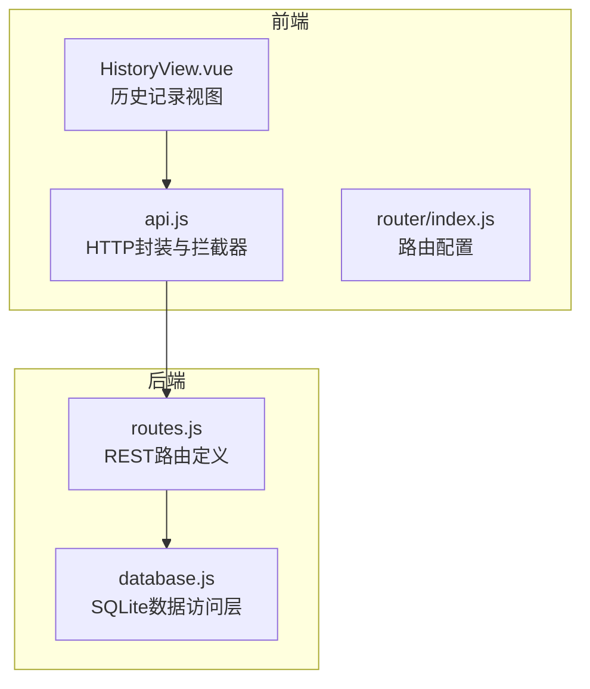
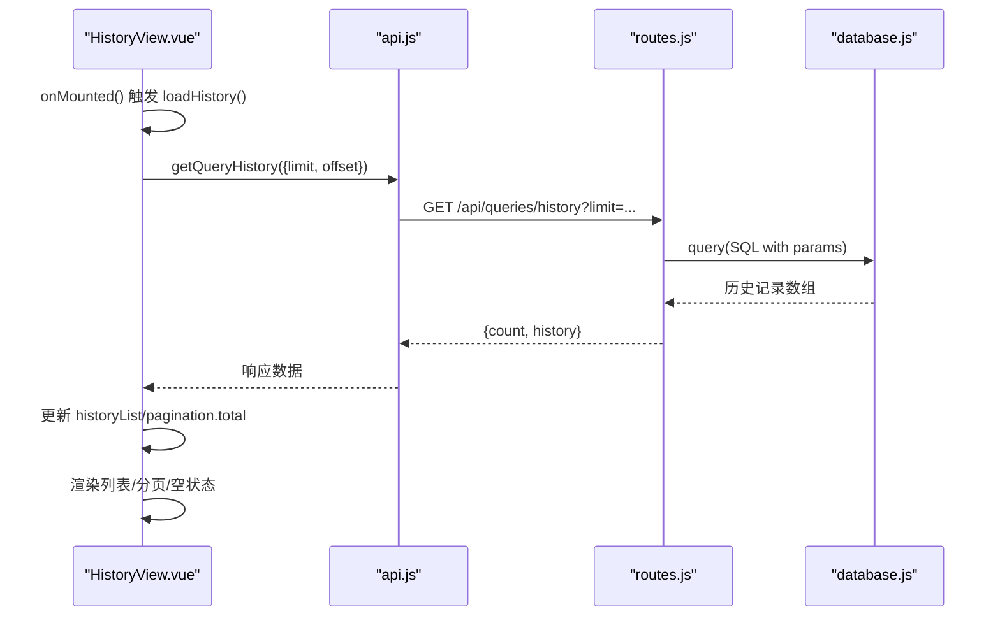
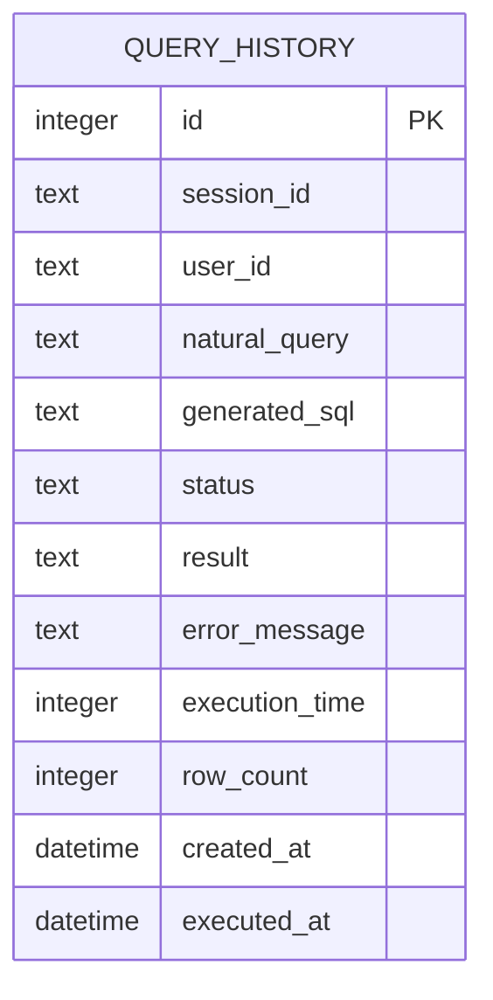
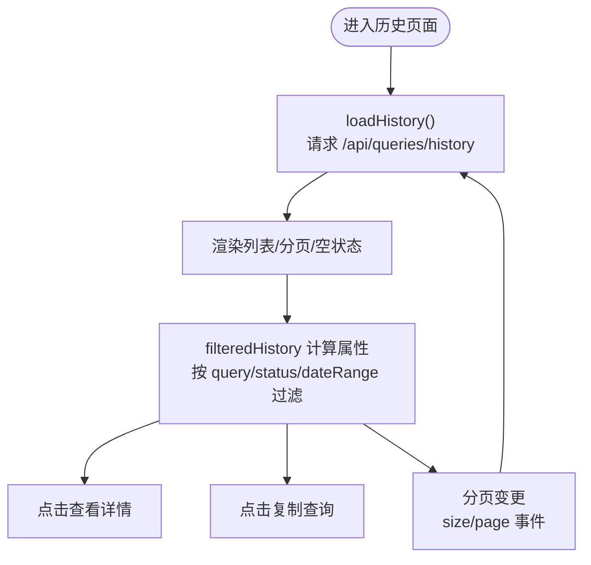
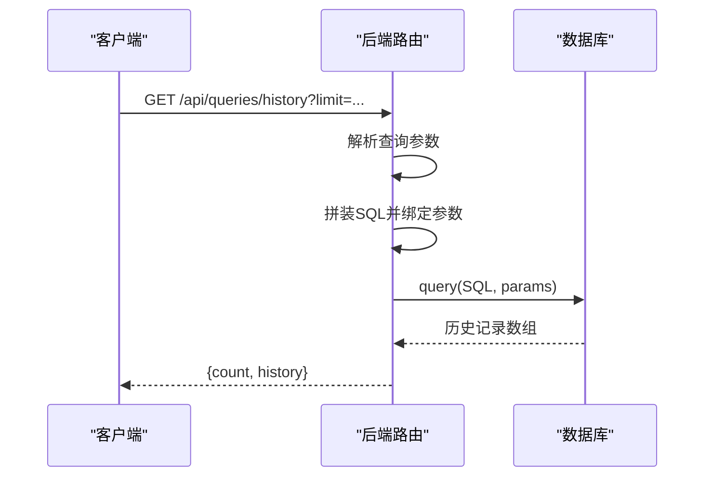
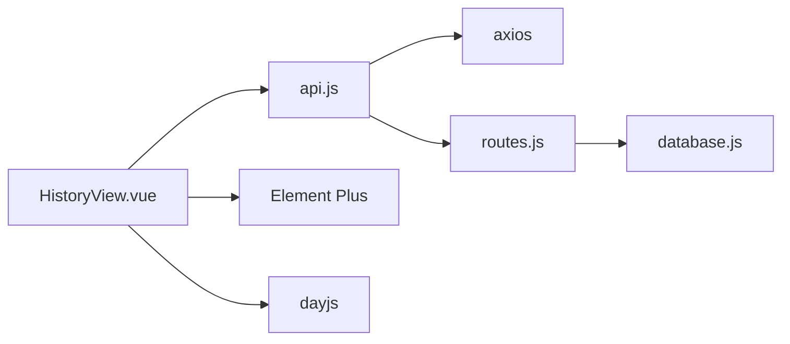

# 历史记录管理

<cite>
**本文引用的文件**
- [HistoryView.vue](file://frontend/src/views/HistoryView.vue)
- [api.js](file://frontend/src/utils/api.js)
- [routes.js](file://backend/src/core/routes.js)
- [database.js](file://backend/src/core/database.js)
- [index.js](file://frontend/src/router/index.js)
</cite>

## 目录
1. [简介](#简介)
2. [项目结构](#项目结构)
3. [核心组件](#核心组件)
4. [架构总览](#架构总览)
5. [详细组件分析](#详细组件分析)
6. [依赖关系分析](#依赖关系分析)
7. [性能考虑](#性能考虑)
8. [故障排查指南](#故障排查指南)
9. [结论](#结论)
10. [附录](#附录)

## 简介
本文件面向 NL2SQL 历史记录管理组件，围绕前端 HistoryView.vue 的实现进行系统化技术文档编写。内容涵盖查询历史的获取、展示与管理，历史记录的数据结构、分页加载机制、搜索过滤功能与批量操作现状、与后端 API 的交互方式、数据同步策略与缓存机制、导出与清理策略及隐私保护建议，并提供实际使用示例与性能优化建议。

## 项目结构
HistoryView.vue 位于前端 views 目录，配合前端 API 封装模块与后端路由/数据库模块共同工作。路由配置中已将历史记录页面注册为独立路由，支持懒加载与标题设置。

**图表来源**
- [HistoryView.vue:1-441](file://frontend/src/views/HistoryView.vue#L1-L441)
- [api.js:1-303](file://frontend/src/utils/api.js#L1-L303)
- [routes.js:400-450](file://backend/src/core/routes.js#L400-L450)
- [database.js:95-135](file://backend/src/core/database.js#L95-L135)
- [index.js:59-69](file://frontend/src/router/index.js#L59-L69)

**章节来源**
- [HistoryView.vue:1-441](file://frontend/src/views/HistoryView.vue#L1-L441)
- [api.js:1-303](file://frontend/src/utils/api.js#L1-L303)
- [routes.js:400-450](file://backend/src/core/routes.js#L400-L450)
- [database.js:95-135](file://backend/src/core/database.js#L95-L135)
- [index.js:59-69](file://frontend/src/router/index.js#L59-L69)

## 核心组件
- 历史记录视图组件：负责渲染历史列表、筛选、分页、详情弹窗与复制操作。
- API 封装模块：统一发起 /api 前缀的 HTTP 请求，内置拦截器与错误处理。
- 后端路由：提供 /api/queries/history 接口，支持 limit 等参数。
- 数据库层：SQLite 表 query_history 存储查询历史，含索引优化。

**章节来源**
- [HistoryView.vue:138-298](file://frontend/src/views/HistoryView.vue#L138-L298)
- [api.js:206-208](file://frontend/src/utils/api.js#L206-L208)
- [routes.js:404-450](file://backend/src/core/routes.js#L404-L450)
- [database.js:95-135](file://backend/src/core/database.js#L95-L135)

## 架构总览
HistoryView.vue 通过 api.js 调用后端 /api/queries/history 接口，后端路由根据查询参数拼装 SQL 并返回历史记录与数量。前端使用 Element Plus 组件展示列表、分页与详情，使用 dayjs 格式化时间。

**图表来源**
- [HistoryView.vue:226-243](file://frontend/src/views/HistoryView.vue#L226-L243)
- [api.js:206-208](file://frontend/src/utils/api.js#L206-L208)
- [routes.js:413-450](file://backend/src/core/routes.js#L413-L450)
- [database.js:361-380](file://backend/src/core/database.js#L361-L380)

## 详细组件分析

### 历史记录数据模型
- 历史记录表：query_history，包含字段如 user_id、natural_query、generated_sql、status、result、error_message、execution_time、row_count、created_at、executed_at 等。
- 前端展示字段：natural_query、status、execution_time、row_count、created_at。
- 后端接口返回：count（总数）、history（记录数组）。

**图表来源**
- [database.js:95-135](file://backend/src/core/database.js#L95-L135)

**章节来源**
- [database.js:95-135](file://backend/src/core/database.js#L95-L135)
- [routes.js:413-450](file://backend/src/core/routes.js#L413-L450)
- [HistoryView.vue:40-134](file://frontend/src/views/HistoryView.vue#L40-L134)

### 前端交互与状态管理
- 响应式状态：loading、historyList、filter（query/status/dateRange）、pagination（page/pageSize/total）、detailVisible、selectedItem。
- 计算属性 filteredHistory：基于 query、status、dateRange 三要素进行本地过滤。
- 方法：
  - loadHistory：调用 api.getQueryHistory，传入 limit/offset。
  - viewDetail：打开详情弹窗。
  - copyQuery：复制查询内容到剪贴板。
  - handleSizeChange/handlePageChange：分页变更时重新加载。
- 生命周期：onMounted 时自动加载一次。

**图表来源**
- [HistoryView.vue:162-298](file://frontend/src/views/HistoryView.vue#L162-L298)

**章节来源**
- [HistoryView.vue:138-298](file://frontend/src/views/HistoryView.vue#L138-L298)

### 后端 API 与数据同步
- 路由定义：GET /api/queries/history，支持 user_id、session_id、limit 等查询参数。
- SQL 构造：动态拼接 WHERE 条件与 ORDER BY、LIMIT，返回 count 与 history。
- 数据库访问：query() 执行 SQL，返回结果数组。

**图表来源**
- [routes.js:413-450](file://backend/src/core/routes.js#L413-L450)
- [database.js:361-380](file://backend/src/core/database.js#L361-L380)

**章节来源**
- [routes.js:404-450](file://backend/src/core/routes.js#L404-L450)
- [database.js:361-380](file://backend/src/core/database.js#L361-L380)

### 搜索与过滤功能
- 文本搜索：按 natural_query 包含关键词过滤（大小写不敏感）。
- 状态过滤：success/failed 二选一。
- 日期范围过滤：基于 created_at 的起止时间（包含当天起始与结束）。
- 本地过滤：filteredHistory 计算属性串联三个条件，最终得到结果集。

**章节来源**
- [HistoryView.vue:190-217](file://frontend/src/views/HistoryView.vue#L190-L217)

### 分页加载机制
- 前端分页：Element Plus el-pagination 控件，支持 page-size 切换与页码切换。
- 后端分页：limit 与 offset 由前端传入，后端按 limit 返回。
- 总数同步：后端返回 count，前端更新 pagination.total。

**章节来源**
- [HistoryView.vue:75-87](file://frontend/src/views/HistoryView.vue#L75-L87)
- [HistoryView.vue:277-289](file://frontend/src/views/HistoryView.vue#L277-L289)
- [routes.js:413-450](file://backend/src/core/routes.js#L413-L450)

### 详情弹窗与复制功能
- 详情弹窗：展示 natural_query、generated_sql、status、error_message、execution_time、row_count、created_at。
- 复制功能：调用 Clipboard API 将 natural_query 写入剪贴板并提示成功。

**章节来源**
- [HistoryView.vue:90-134](file://frontend/src/views/HistoryView.vue#L90-L134)
- [HistoryView.vue:267-271](file://frontend/src/views/HistoryView.vue#L267-L271)

### 与后端 API 的交互方式
- 前端封装：api.js 基于 axios，baseURL 为 /api，统一请求/响应拦截与错误处理。
- 历史接口：getQueryHistory(params) -> GET /api/queries/history。
- 错误处理：响应拦截器统一返回 data 或抛出错误对象，前端捕获并提示。

**章节来源**
- [api.js:206-208](file://frontend/src/utils/api.js#L206-L208)
- [api.js:44-87](file://frontend/src/utils/api.js#L44-L87)

### 数据同步策略与缓存机制
- 前端缓存：historyList 作为响应式数组，分页与过滤均在内存中进行，无持久化缓存。
- 后端缓存：未见专用缓存层，查询走数据库直连。
- 同步策略：每次分页或筛选变更时重新拉取数据，保证一致性。

**章节来源**
- [HistoryView.vue:162-181](file://frontend/src/views/HistoryView.vue#L162-L181)
- [routes.js:413-450](file://backend/src/core/routes.js#L413-L450)

### 批量操作现状
- 当前未实现批量删除、批量导出等操作。
- 若需扩展，可在前端增加勾选框与批量操作按钮，并在后端新增批量接口。

**章节来源**
- [HistoryView.vue:68-73](file://frontend/src/views/HistoryView.vue#L68-L73)

### 导出与清理策略
- 导出：当前未提供导出功能。建议在后端新增 /api/queries/history/export 接口，支持 CSV/JSON 导出。
- 清理：当前未提供清理接口。建议新增 /api/queries/history/cleanup，支持按时间范围或状态批量清理。

**章节来源**
- [routes.js:404-450](file://backend/src/core/routes.js#L404-L450)

### 隐私保护措施
- 历史记录包含 natural_query、generated_sql、error_message 等字段，可能包含敏感信息。
- 建议：
  - 后端导出/清理接口增加鉴权与审计日志。
  - 对导出数据进行脱敏处理（如隐藏敏感字段或按规则打码）。
  - 提供用户自助清理能力，并支持删除确认与不可逆提示。

**章节来源**
- [database.js:95-135](file://backend/src/core/database.js#L95-L135)

### 实际使用示例
- 打开历史记录页面：访问 /history。
- 刷新：点击“刷新”按钮触发重新加载。
- 过滤：在搜索框输入关键词、选择状态、选择日期范围。
- 分页：调整每页条数或翻页。
- 查看详情：点击“查看”打开弹窗。
- 复制查询：点击“复制”将查询内容复制到剪贴板。

**章节来源**
- [index.js:59-69](file://frontend/src/router/index.js#L59-L69)
- [HistoryView.vue:8-134](file://frontend/src/views/HistoryView.vue#L8-L134)

## 依赖关系分析
- HistoryView.vue 依赖：
  - api.js：发起 HTTP 请求。
  - Element Plus：UI 组件（输入、选择器、日期选择器、表格、分页、对话框、标签等）。
  - dayjs：时间格式化。
- api.js 依赖：
  - axios：HTTP 客户端。
  - baseURL 为 /api，统一拦截器处理。
- 后端依赖：
  - routes.js：定义 /api/queries/history。
  - database.js：SQLite 访问与查询。

**图表来源**
- [HistoryView.vue:147-156](file://frontend/src/views/HistoryView.vue#L147-L156)
- [api.js:14-34](file://frontend/src/utils/api.js#L14-L34)
- [routes.js:404-450](file://backend/src/core/routes.js#L404-L450)
- [database.js:361-380](file://backend/src/core/database.js#L361-L380)

**章节来源**
- [HistoryView.vue:138-298](file://frontend/src/views/HistoryView.vue#L138-L298)
- [api.js:1-303](file://frontend/src/utils/api.js#L1-L303)
- [routes.js:400-450](file://backend/src/core/routes.js#L400-L450)
- [database.js:361-380](file://backend/src/core/database.js#L361-L380)

## 性能考虑
- 前端：
  - 本地过滤 filteredHistory 在数据量较大时可能影响性能，建议后端支持更丰富的过滤参数（如 created_at 起止、status 等）。
  - 分页采用 limit+offset，大数据量下 offset 较大时查询可能变慢，可考虑游标分页或基于主键的范围分页。
- 后端：
  - query_history 表已建立 user_id、session_id、created_at、status 等索引，有助于过滤与排序。
  - SQL 拼接参数化查询，避免注入风险。
- 缓存：
  - 可引入 Redis 缓存热门查询（如最近 N 条），降低数据库压力。

[本节为通用指导，不直接分析具体文件]

## 故障排查指南
- 加载失败：检查 /api/queries/history 是否可达，确认 baseURL 与代理配置。
- 空数据：确认数据库中是否存在历史记录，检查 user_id/session_id 过滤条件。
- 分页异常：确认后端 limit 参数与前端传参一致，检查 count 与 total 同步。
- 复制失败：确认浏览器支持 Clipboard API，检查 HTTPS 环境。

**章节来源**
- [api.js:44-87](file://frontend/src/utils/api.js#L44-L87)
- [HistoryView.vue:226-243](file://frontend/src/views/HistoryView.vue#L226-L243)

## 结论
HistoryView.vue 提供了查询历史的完整前端展示与交互体验，具备本地过滤、分页与详情查看等功能。后端通过 /api/queries/history 提供数据接口，数据库层具备必要的索引支持。当前未实现批量操作、导出与清理功能，建议后续扩展以满足更复杂的管理需求。整体架构清晰、职责分离良好，具备良好的可扩展性。

[本节为总结性内容，不直接分析具体文件]

## 附录

### API 定义概览
- GET /api/queries/history
  - 查询参数：user_id、session_id、limit
  - 响应：{ count, history }

**章节来源**
- [routes.js:404-450](file://backend/src/core/routes.js#L404-L450)